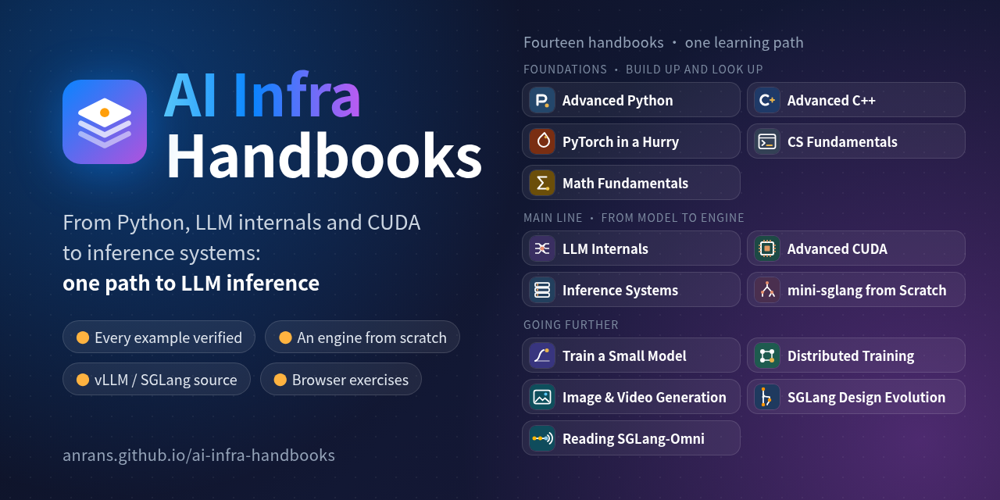
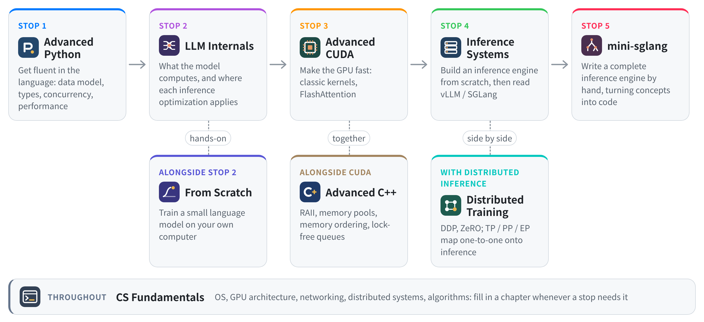

<p align="center">
  <a href="https://anrans.github.io/ai-infra-handbooks/en/"></a>
</p>

<p align="center">
  <b>Eleven interlinked handbooks: from Python, LLM internals and CUDA all the way to LLM inference systems</b><br>
  Every example verified automatically · An inference engine from scratch · Read against the vLLM / SGLang source · Exercises in the browser
</p>

<p align="center">
  <a href="https://anrans.github.io/ai-infra-handbooks/en/"></a>
  <a href="https://github.com/AnranS/ai-infra-handbooks/actions/workflows/pages.yml"></a>
  <a href="LICENSE-docs.md"></a>
  <a href="LICENSE"></a>
  <a href="https://github.com/AnranS/ai-infra-handbooks/stargazers"></a>
</p>

<p align="center">
  <a href="https://anrans.github.io/ai-infra-handbooks/en/"><b>Read online</b></a> ·
  <a href="https://anrans.github.io/ai-infra-handbooks/en/roadmap/">Roadmap</a> ·
  <a href="https://anrans.github.io/ai-infra-handbooks/practice/">Exercises</a> ·
  <a href="https://anrans.github.io/ai-infra-handbooks/playground/">Playground</a> ·
  <a href="https://anrans.github.io/ai-infra-handbooks/cards/">Flashcards</a> ·
  <a href="https://anrans.github.io/ai-infra-handbooks/en/plan/">17-week plan</a> ·
  <a href="README.md">中文</a>
</p>

---

**11** handbooks · **291** chapters · **288** exercises · **2052** flashcards · **85** frequent interview questions

This is a set of handbooks for LLM inference: inference frameworks, inference optimization and inference platforms. It starts with writing idiomatic Python and C++, explains what large models compute and how GPUs compute fast, then builds an inference engine from scratch, reads the vLLM and SGLang source to understand industrial implementations, and finally lands every concept in a hand-written mini-sglang. The thirteen books link to each other: when the LLM book reaches FlashAttention, it links straight to the matching kernel in the CUDA book; the math it uses links to the right section of the math book.

> **Language.** The handbooks are written in Chinese. All thirteen books, the learning roadmap, the 17-week plan, the flashcards and the interactive widgets are available in the [English edition](https://anrans.github.io/ai-infra-handbooks/en/), and every page has a switch between the two languages. Code and its output are kept exactly as verified, so some printed labels stay in Chinese. The exercises and the pages listed under [Beyond the handbooks](#beyond-the-handbooks) are in Chinese for now.

## Features

- **Every example is verified**: all Python code blocks are actually run, and `>>>` examples are checked verbatim; C++ runs under ASan, UBSan and TSan; every `.cu` is compiled with nvcc 12.9 and 13.4 and self-checks on a homemade CPU emulator; multi-process parallel examples are matched item by item against a single process; the vLLM / SGLang files, functions and parameters the books cite are checked by script against pinned versions of the source.
- **Build it from scratch, then read industrial source**: the inference systems book first writes a mini engine (paged KV, scheduler, prefix cache, CUDA Graphs), then reads vLLM V1 and SGLang; mini-sglang from Scratch implements the whole engine following the official module layout, with 63 pytest tests matching Hugging Face transformers token for token; SGLang Design Evolution then follows the commit history to show how these modules grew step by step.
- **Every chapter has exercises, graded right in the web page**: Python exercises run in the browser (Pyodide); CUDA exercises run on a GPU emulator that checks out-of-bounds accesses, data races, memory coalescing and bank conflicts; C++ exercises are graded locally with sanitizers; with an NVIDIA GPU you also get timings and bandwidth on real hardware.
- **Learn it and keep it**: a self-test at the start of each chapter, exercises at the end, and "How to explain it" tips; each chapter's questions and answers become flashcards reviewed with spaced repetition and exportable to Anki; runnable chapters download as Jupyter notebooks.
- **A route and a progress record**: 291 chapters laid out over 17 weeks, marking core and optional chapters and the key chapters for different directions; each chapter's study bar shows which week it belongs to, lets you mark it as done and points to the next chapter; progress can be exported and imported.

## The thirteen handbooks

-  **[Advanced Python](https://anrans.github.io/ai-infra-handbooks/en/python/)** · 22 chapters · [`python/`](python/)<br>
  The object model, iterators and generators, decorators, type hints and protocols, metaprogramming, engineering and testing, concurrency and profiling

-  **[Advanced C++](https://anrans.github.io/ai-infra-handbooks/en/cpp/)** · 15 chapters · [`cpp/`](cpp/)<br>
  Modern C++ for AI infra: value semantics and RAII, move semantics, templates; object layout, memory pools and a KV block allocator; atomics and memory ordering, lock-free queues and thread pools; pybind11 and PyTorch extensions, enough to read vLLM's `csrc/`

-  **[CS Fundamentals](https://anrans.github.io/ai-infra-handbooks/en/cs/)** · 24 chapters · [`cs/`](cs/)<br>
  The operating systems and architecture an inference engineer needs: processes and scheduling, virtual memory and huge pages, pinned memory and NUMA, how a write reaches the disk, epoll and io_uring, inter-process communication, containers and cgroups, profiling tools; CPU pipelines and caches, GPU SMs and Tensor Cores, the GPU memory system, the architectures from Volta to Blackwell, multi-GPU systems and topology; TCP and streaming output, load balancing and queueing, consistent hashing and consensus; six chapters of data structures and algorithms (two pointers and sliding windows, monotonic stacks and LRU, trees and graphs, heaps and greedy, DP and backtracking) with 63 browser-graded exercises

-  **[Math Fundamentals](https://anrans.github.io/ai-infra-handbooks/en/math/)** · 7 chapters · [`math/`](math/)<br>
  The math you meet when reading about models and inference systems, in its own book to look up when needed: linear algebra and low rank (SVD, LoRA, MLA), probability and sampling (rejection sampling and speculative decoding), information theory (cross-entropy and KL), backpropagation and GPTQ's second-order information, floating-point error and quantization noise, rooflines and queueing theory; every result is measured on a real Qwen3-0.6B

-  **[LLM Internals](https://anrans.github.io/ai-infra-handbooks/en/llm/)** · 24 chapters · [`llm/`](llm/)<br>
  Tokenization and tensor basics; every Transformer component, implementing the LLaMA architecture from scratch and loading real Qwen3 weights; GQA / MLA, MoE, training and alignment, sampling, KV cache, estimation, quantization and sparsity; capstone: train a small language model from scratch

-  **[PyTorch in a Hurry](https://anrans.github.io/ai-infra-handbooks/en/torch/)** · 8 chapters · [`torch/`](torch/)<br>
  Get fluent with PyTorch: tensors and shapes (view/reshape, broadcasting, einsum), indexing and masks (gather, scatter_, causal masks), how to use autograd and the three kinds of "grad is None", nn.Module's parameters and state_dict, Dataset and a complete training loop, checkpoints and reproducibility, error messages and the profiler

-  **[Advanced CUDA](https://anrans.github.io/ai-infra-handbooks/en/cuda/)** · 32 chapters · [`cuda/`](cuda/)<br>
  GPU architecture and the execution model; classic kernels such as reduction, GEMM and softmax, Tensor Cores and Hopper, CuTe layout algebra, FlashAttention, quantized GEMV; Nsight, CUDA Graphs, PDL and megakernels, NCCL, Triton, TileLang; the PyTorch runtime, a crash course in compilers, and torch.compile

-  **[Train a Small Model](https://anrans.github.io/ai-infra-handbooks/en/scratch/)** · 6 chapters · [`scratch/`](scratch/)<br>
  Start from an empty directory on your own computer: prepare the corpus, train a BPE tokenizer, write a small GPT and a complete training loop, resume and sample, then train it faster and larger with gradient accumulation, `torch.compile` and DDP; then instruction tuning (chat template, loss on the replies only), LoRA, DPO and distillation, and an export into LLaMA's weight layout; finally move to one 16 GB consumer card for the memory budget, a text model trained overnight and a small image generator

-  **[Distributed Training](https://anrans.github.io/ai-infra-handbooks/en/train/)** · 16 chapters · [`train/`](train/)<br>
  Memory accounting and collective communication; DDP, ZeRO and FSDP2; tensor, pipeline, context and expert parallelism; FP8 mixed precision, configuration search for 3D / 5D parallelism, distributed checkpoints and RL training systems; capstone: DDP + ZeRO-1 + recomputation

-  **[Inference Systems](https://anrans.github.io/ai-infra-handbooks/en/serving/)** · 65 chapters · [`serving/`](serving/)<br>
  Write an inference engine from scratch, then walk through the vLLM V1 and SGLang source; parallelism, PD disaggregation and hierarchical KV caching; NVLink, RDMA, DeepEP and KV transfer; benchmarking, profiling and quantized deployment; frontier topics such as speculative decoding, long context and large-scale MoE inference; production operations; an interview question bank and system design

-  **[mini-sglang from Scratch](https://anrans.github.io/ai-infra-handbooks/en/minisgl/)** · 25 chapters · [`minisgl/`](minisgl/)<br>
  Following the module layout of the official mini-sglang, implement a complete inference engine from scratch: a paged KV pool, the scheduler, the radix cache, chunked prefill, overlap scheduling, tensor parallelism, CUDA Graphs, fused MoE and an OpenAI-compatible server

-  **[Image & Video Generation Inference](https://anrans.github.io/ai-infra-handbooks/en/media/)** · 20 chapters · [`media/`](media/)<br>
  Inference and serving for diffusion and flow-matching models: pipeline anatomy, compute and memory budgets, denoisers from UNet to DiT, VAEs and latent space, samplers and schedulers; the examples really run on CPU with minimal configurations and need no model weights

-  **[SGLang Design Evolution](https://anrans.github.io/ai-infra-handbooks/en/sglang/)** · 27 chapters · [`sglang/`](sglang/)<br>
  The 19,000-plus commits of the SGLang repository read as primary sources: what problem each design answered, which commit introduced it and how it evolved, in order of time: the paper and the initial commit, the first RadixAttention, compressed FSMs and jump-forward decoding, the frontend language… Every chapter's git commands and quoted historical code are re-run and re-extracted on a clone

## Learning path

<picture>
  <source media="(prefers-color-scheme: dark)" srcset="assets/brand/path-en-dark.png">
  
</picture>

- The [roadmap](https://anrans.github.io/ai-infra-handbooks/en/roadmap/) on the site lays out the 291 chapters over 17 weeks. It marks each chapter as core or optional, shows the key chapters for different directions and the dependencies across books, and records your progress; skip anything you already know once you pass the chapter's opening self-test.
- The [17-week sprint plan](https://anrans.github.io/ai-infra-handbooks/en/plan/) follows the roadmap week by week, listing the chapters to read, the exercises to do and a checklist for each week.
- [ROADMAP.md](ROADMAP.md) is a one-page summary of the route for learning inference engines (vLLM / SGLang), in Chinese.

**Who it is for**: engineers and students who write Python and want to get into LLM inference systematically, and people preparing for interviews for inference framework, inference optimization or inference platform roles. A grounding in linear algebra and probability is enough; what you need is in Math Fundamentals, to look up when you get there. You do not need an NVIDIA GPU: CUDA code runs on a CPU emulator, and the [setup](https://anrans.github.io/ai-infra-handbooks/setup/) page lists alternatives for the parts that need real hardware.

## Beyond the handbooks

| Page | What it is |
| --- | --- |
| [Exercises](https://anrans.github.io/ai-infra-handbooks/practice/) | Coding exercises for every chapter: write code in the browser and grade it with one click; you can also grade locally on macOS or on WSL2 with an NVIDIA GPU, see [practice/README.md](practice/README.md) |
| [Playground](https://anrans.github.io/ai-infra-handbooks/playground/) | A Python sandbox in the browser, not tied to any exercise: numpy, matplotlib, the CUDA and Triton emulators, code completion, and shareable links |
| [Flashcards](https://anrans.github.io/ai-infra-handbooks/cards/) | Questions and answers from the chapter self-tests, exercises and interview banks, reviewed with spaced repetition and exportable to Anki |
| [Interview bank](https://anrans.github.io/ai-infra-handbooks/serving/career/interview/) | Frequent questions for inference roles, coding questions, system design with reference answers, and mock interview sets |
| [Capstones](assignments/README.md) | In the style of CS336, only interfaces, tests and grading scripts are given: train a small language model from scratch, a training system, GPU performance targets for the inference engine, and adding a hybrid-architecture model |
| [Setup](https://anrans.github.io/ai-infra-handbooks/setup/) | One-click setup of every environment on a Mac, with a self-check that each book runs |
| [Site search](https://anrans.github.io/ai-infra-handbooks/search/) | Search the thirteen handbooks, the exercises and the roadmap together |

## Quick start

**Read online**: open <https://anrans.github.io/ai-infra-handbooks/en/>; nothing to install.

**Read or run the code from the text**: every code block with a file name is also a real file under `<book>/examples/` (for example [`cuda/examples/`](cuda/examples/) and [`scratch/examples/`](scratch/examples/)), and each directory's README says which page a file comes from. The files are exported from the text by `tools/export_examples.py` and checked character for character at build time, so they never drift from the pages.

**With an NVIDIA GPU** (Linux or WSL2):

```bash
bash setup-gpu.sh                      # check the driver and nvcc, install CUDA PyTorch and the models
.venv-gpu/bin/python gpu_check.py      # run all 14 self-checks and print a table (missing tools are skipped)
```

**Run the books' code locally** (macOS, Apple Silicon or Intel):

```bash
git clone https://github.com/AnranS/ai-infra-handbooks.git && cd ai-infra-handbooks
bash env/setup-macos.sh                  # Python environment, PyTorch, compiler toolchain and three small models (about 4 GB)
.venv/bin/python tools/mac_check.py      # self-check: run a few representative examples from every book
```

For Linux and WSL2, see each handbook's README and [practice/LOCAL.md](practice/LOCAL.md).

**Do the exercises locally**:

```bash
python practice/judge.py doctor          # which exercises this machine can run
python practice/judge.py start 12        # copy exercise 12's template to practice/workspace/
python practice/judge.py test 12         # grade it
```

**Build the site locally**:

```bash
python3 -m venv .venv && .venv/bin/pip install -r requirements-docs.txt
PYTHON=.venv/bin/python MKDOCS=.venv/bin/mkdocs ./build.sh   # output goes to _site/, the English edition to _site/en/
python3 -m http.server 8000 --directory _site                 # open http://localhost:8000
```

When working on a single book, `mkdocs serve` gives a live preview, for example `.venv/bin/mkdocs serve -f llm/mkdocs.yml`; links across books only resolve in the full `_site/`.

## How the code is verified

Each handbook has its own checking scripts under `tools/`; the environments they need (Python 3.14, CPU PyTorch with Qwen3 weights, the CUDA toolchain and so on) are described in each handbook's README.

<details>
<summary><b>How each handbook is verified</b></summary>

| Handbook | Verification |
| --- | --- |
| Advanced Python | Every `python` code block runs on Python 3.14, `>>>` examples are checked verbatim with doctest, and the testing chapters' examples run under pytest |
| Advanced C++ | Every program is compiled with g++ 12 (C++20, `-Wall -Wextra -Werror`), runs under ASan + UBSan, with the concurrency chapters under TSan, and its output is compared line by line with the page; deliberately broken examples must be caught by a sanitizer; the CMake projects, pybind11 and PyTorch extensions are actually built and run |
| CS Fundamentals | Python and C programs actually run on Linux and their output is checked line by line; machine-dependent measurements (timings, bandwidth, page-fault counts) are marked as local examples and only have to run |
| Math Fundamentals | Runs in the LLM book's environment, with output compared line by line; every result is measured on a real model (SVD energy, KL after quantization, draft acceptance rates, GPTQ against RTN and more) |
| LLM Internals | The code runs on CPU PyTorch; the hand-written model loads real Qwen3-0.6B weights and is compared item by item with the official Hugging Face implementation |
| Advanced CUDA | Every `.cu` is compiled with nvcc 12.9 and 13.4; kernels run with self-checks on a homemade CPU emulator; Triton examples run in interpreter mode; PyTorch examples and the CuTe layout algebra are run with output compared line by line (CuTe results are also cross-checked by compiling and running CUTLASS) |
| Distributed Training | Every script runs on CPU PyTorch with output compared line by line; multi-process examples are launched with `torchrun` + gloo, and every kind of parallelism is matched item by item against a single process's forward pass, loss and gradients |
| Inference Systems | The mini engine's output is compared token by token with one-at-a-time generation; the models and simulations in the communication, storage and frontier chapters are compared line by line with the page; TP / EP / PP / PD are checked against a single process with multi-process torch.distributed on CPU; the source walkthroughs are checked against vLLM 0.30.0 and SGLang 0.5.20 |
| mini-sglang from Scratch | The code lives in `minisgl/python/minisgl/` with the same names and interfaces as upstream; pytest checks that greedy outputs match HF transformers token by token (covering radix, chunking, overlap scheduling, TP=2/4, three attention backends, CUDA Graph emulation, Qwen2.5 / Llama3 / Qwen3-MoE); GPU libraries are replaced by fakes with the same interfaces, and CUDA kernels are compiled with nvcc and self-checked on the CPU emulator |
| SGLang Design Evolution | Every chapter's git commands and scripts run on a clone of the SGLang repository (pinned to commit `29f6d408c0` of 2026-10-02) with output compared line by line; quoted historical code is re-extracted with `git show` at the cited commit and checked verbatim |

</details>

<details>
<summary><b>Site-wide checks</b></summary>

- `./build.sh`: builds every handbook in `--strict` mode, so broken links fail the build; before building, `tools/site_stats.py --fix` syncs the chapter and exercise counts written on the home pages, the roadmap and the READMEs, and checks that the roadmap covers every chapter exactly once.
- `python3 tools/check_links.py _site`: checks every internal link and anchor (CI runs it after the build).
- `python practice/judge.py check`: every exercise's reference solution must pass and its starter template must fail.
- `python tools/check_sources.py --vllm <vLLM source dir> --sglang <dir containing the sglang/ package>`: checks that the vLLM / SGLang file paths, function and class names, command-line flags and environment variables cited in the books still exist; run it when upgrading the pinned framework versions and fix the text from its report.
- `python tools/i18n.py status`: how many pages of each book have been translated into English.

</details>

<details>
<summary><b>Repository layout</b></summary>

```text
.
├── python/ cpp/ cs/ math/ torch/ llm/ cuda/ scratch/ train/ serving/ minisgl/ media/ sglang/   the thirteen handbooks: each has mkdocs.yml, docs/ (the text),
│                            docs-en/ (English translations), i18n-en.yml (English titles and nav), tools/ (code checks), README.md
├── practice/                exercises: problems (problems/), browser grading and code completion (app/, runtime/), local grading (judge.py)
├── assignments/             capstones: interfaces, tests and grading scripts only
├── portal/                  home page, roadmap (roadmap/), sprint plan (plan/), flashcards (cards/), site search (search/), setup (setup/),
│                            and the English home page (en/)
├── i18n/en/                 translation tables for the English roadmap, plan page and figures
├── theme/                   the MkDocs Material overrides shared by all thirteen books: header, page styles, study bars and interactive widgets
├── hooks/                   MkDocs hooks: cross-book links, exercise lists at the end of each chapter, inline figures, Jupyter notebook export
├── tools/                   site tools: site_stats.py (sync counts), check_links.py, check_sources.py, cards.py (flashcards),
│                            search_index.py (site search), figures.py (figures), mac_check.py (environment self-check), refresh_outputs.py,
│                            redirects.py (redirect pages for moved pages), i18n.py (English build and translation helpers)
├── <book>/examples/        the code blocks with file names, exported as real files (generated by tools/export_examples.py, checked against the pages at build time)
├── setup-gpu.sh             one-click setup when an NVIDIA GPU is present; gpu_check.py runs 14 self-checks (including the C++ / CS / Python book checks)
├── env/                     setup-macos.sh: one-click setup of every handbook's environment on a Mac
├── assets/brand/            logo and covers (cover.html / cover-en.html are the sources)
├── build.sh                 builds every handbook, the English edition, the exercises, flashcards and search index into _site/
├── ROADMAP.md               summary of the route for learning inference engines (vLLM / SGLang)
└── .github/workflows/       build, check links and deploy to GitHub Pages
```

</details>

## Contributing

Issues reporting mistakes or asking for content are welcome, and so are pull requests:

- **Fix the text**: edit the Markdown under the handbook's `docs/`, build once with `./build.sh` before committing, then check anchors with `python3 tools/check_links.py _site`; if you changed example code, run the checking scripts under that handbook's `tools/`. A new chapter must be scheduled into some week of the roadmap (`STAGES` in `portal/roadmap/index.html`), or the build fails.
- **Translate a page**: run `python tools/i18n.py extract <book> <page>`, which writes the page with its code blocks replaced by placeholders, plus the code comments to translate, under `<book>/.i18n-en/work/`. Write the English text as `<page>.en.md` there, keeping the placeholders, links and anchors, and fill in the comments file. Then `python tools/i18n.py assemble <book> <page>` puts the code back, keeps the Chinese heading anchors so existing links still work, and writes `<book>/docs-en/<page>`. When the Chinese code of a translated page changes, `python tools/i18n.py sync <book> <page>` carries the new code over to the English page; the build runs `tools/i18n.py check`, which fails if the code or headings of the two versions disagree.
- **Add an exercise**: put `problem.md`, `starter.py`, `solution.py` and `test.py` under `practice/problems/<book>/<exercise>/`, then run `python practice/judge.py check <exercise>`; the format is in [practice/README.md](practice/README.md).
- **Content plans**: the "Content to build" section of the [sprint plan](https://anrans.github.io/ai-infra-handbooks/en/plan/#build) lists what is still being written.

After a push to `main`, GitHub Actions builds the site, checks the links and deploys to GitHub Pages (set Settings → Pages → Source to GitHub Actions).

## License

The text is licensed under [CC BY-NC-SA 4.0](LICENSE-docs.md) and the code under [MIT](LICENSE); quoted upstream code follows its original project's license, see [LICENSE-docs.md](LICENSE-docs.md).

## Acknowledgments

The site's visual style is inspired by [AIInfraGuide](https://caomaolufei.github.io/AIInfraGuide/); the source walkthroughs are based on [vLLM](https://github.com/vllm-project/vllm), [SGLang](https://github.com/sgl-project/sglang) and [mini-sglang](https://github.com/sgl-project/mini-sglang).

If these handbooks help you, a star is appreciated, and so is telling us about any mistakes you find.
