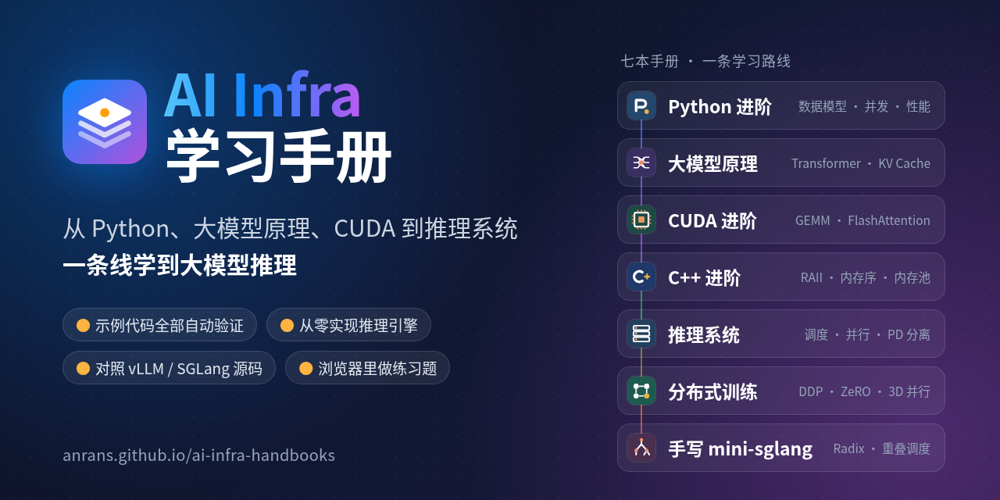
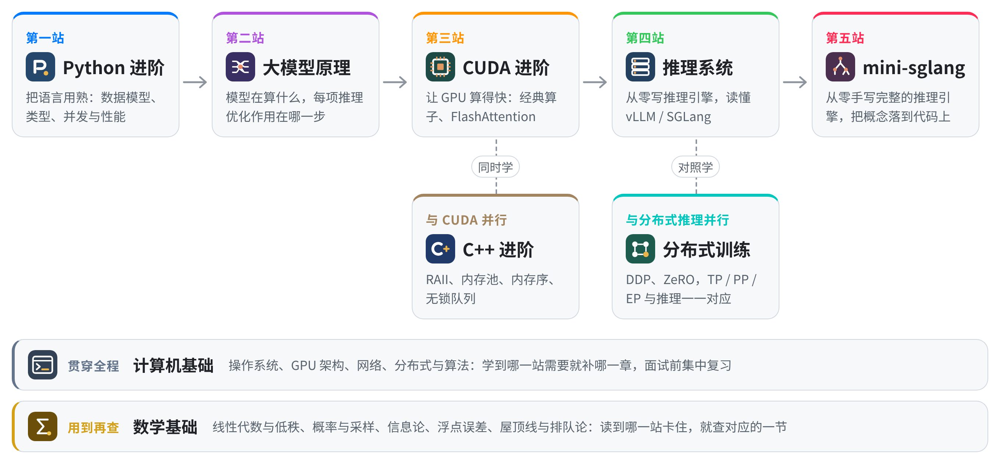

<p align="center">
  <a href="https://anrans.github.io/ai-infra-handbooks/"></a>
</p>

<p align="center">
  <b>八本互相衔接的中文手册：从 Python、大模型原理、CUDA 一路学到大模型推理系统</b><br>
  示例代码全部自动验证 · 从零实现推理引擎 · 对照 vLLM / SGLang 源码 · 浏览器里做练习题
</p>

<p align="center">
  <a href="https://anrans.github.io/ai-infra-handbooks/"></a>
  <a href="https://github.com/AnranS/ai-infra-handbooks/actions/workflows/pages.yml"></a>
  <a href="LICENSE-docs.md"></a>
  <a href="LICENSE"></a>
  <a href="https://github.com/AnranS/ai-infra-handbooks/stargazers"></a>
</p>

<p align="center">
  <a href="https://anrans.github.io/ai-infra-handbooks/"><b>在线阅读</b></a> ·
  <a href="https://anrans.github.io/ai-infra-handbooks/roadmap/">学习路线</a> ·
  <a href="https://anrans.github.io/ai-infra-handbooks/practice/">练习题</a> ·
  <a href="https://anrans.github.io/ai-infra-handbooks/playground/">Playground</a> ·
  <a href="https://anrans.github.io/ai-infra-handbooks/cards/">学习卡</a> ·
  <a href="https://anrans.github.io/ai-infra-handbooks/plan/">17 周计划</a>
</p>

---

**8** 本手册 · **212** 章 · **204** 道练习题 · **1471** 张学习卡 · **85** 道面试高频题

这是一套面向大模型推理（推理框架、推理优化、推理平台）的中文学习手册。它从写地道的 Python 和 C++ 开始，讲清大模型在算什么、GPU 怎么算得快，接着从零写一个推理引擎、对照 vLLM 和 SGLang 的源码读懂工业级实现，最后把所有概念落到一个手写的 mini-sglang 上。八本书互相链接：大模型手册讲到 FlashAttention，会直接链到 CUDA 手册里对应的 kernel 实现。

## 特色

- **示例代码全部经过验证**：Python 代码块全部实际运行，`>>>` 示例逐字核对；C++ 在 ASan、UBSan、TSan 下运行；每个 `.cu` 用 nvcc 12.9 与 13.4 编译，并在自制的 CPU 模拟器上自检；多进程的并行示例与单进程逐项对齐；书里引用的 vLLM / SGLang 文件、函数、参数用脚本对照固定版本的源码核对。
- **先从零实现，再读工业级源码**：推理系统手册先写一个迷你引擎（分页 KV、调度器、前缀缓存、CUDA Graphs），再读 vLLM V1 与 SGLang；手写 mini-sglang 按官方的模块划分完整实现一遍，63 个 pytest 测试与 Hugging Face transformers 逐 token 对齐。
- **每章都有练习，打开网页就能判题**：Python 题跑在浏览器里（Pyodide）；CUDA 题用 GPU 模拟器检查越界、数据竞争、合并访存和 bank conflict；C++ 题在本地用 sanitizer 判题；有 NVIDIA GPU 时还能在真卡上报告耗时和带宽。
- **学得会，也记得住**：章首自测、章末练习、「面试怎么答」提示；各章的题目与答案抽成学习卡，按间隔重复复习，可以导出到 Anki；能运行的章节可以下载成 Jupyter notebook。
- **有路线，有进度**：212 章按 17 周排好，标出必学、选学和不同方向的重点；每章的学习条显示它排在第几周、可以标为已学、指向下一章，进度可以导出和导入。

## 八本手册

-  **[Python 进阶手册](https://anrans.github.io/ai-infra-handbooks/python/)** · 22 章 · [`python/`](python/)<br>
  对象模型、迭代器与生成器、装饰器、类型标注与协议、元编程、工程化与测试、并发与性能分析

-  **[C++ 进阶手册](https://anrans.github.io/ai-infra-handbooks/cpp/)** · 15 章 · [`cpp/`](cpp/)<br>
  面向 AI Infra 的现代 C++：值语义与 RAII、移动语义、模板；对象布局、内存池与 KV 块分配器；atomic 与内存序、无锁队列与线程池；pybind11 与 PyTorch 扩展，读懂 vLLM 的 `csrc/`

-  **[计算机基础手册](https://anrans.github.io/ai-infra-handbooks/cs/)** · 13 章 · [`cs/`](cs/)<br>
  推理工程师需要的操作系统与体系结构：进程与调度、虚拟内存与大页、锁页内存与 NUMA、一次写入如何落盘、epoll 与 io_uring、进程间通信、容器与 cgroup、性能分析工具；CPU 流水线与缓存、GPU 的 SM 与 Tensor Core、GPU 内存系统、Volta 到 Blackwell 的架构演进、多卡系统与拓扑；网络、分布式与算法陆续补充

-  **[大模型原理手册](https://anrans.github.io/ai-infra-handbooks/llm/)** · 30 章 · [`llm/`](llm/)<br>
  分词与数学基础；Transformer 各组件，从零实现 LLaMA 结构并加载真实的 Qwen3 权重；GQA / MLA、MoE、训练与对齐、采样、KV Cache、估算、量化与稀疏；大作业：从零训练一个小语言模型

-  **[CUDA 进阶手册](https://anrans.github.io/ai-infra-handbooks/cuda/)** · 30 章 · [`cuda/`](cuda/)<br>
  GPU 架构与执行模型；归约、GEMM、Softmax 等经典算子，Tensor Core 与 Hopper，CuTe 布局代数，FlashAttention，量化 GEMV；Nsight、CUDA Graphs、PDL 与 megakernel、NCCL、Triton；PyTorch 运行时与 torch.compile

-  **[分布式训练手册](https://anrans.github.io/ai-infra-handbooks/train/)** · 18 章 · [`train/`](train/)<br>
  显存账本与集合通信；DDP、ZeRO 与 FSDP2；张量、流水线、上下文与专家并行；FP8 混合精度、3D / 5D 并行的配置搜索、分布式 checkpoint 与 RL 训练系统；大作业：DDP + ZeRO-1 + 重计算

-  **[推理系统手册](https://anrans.github.io/ai-infra-handbooks/serving/)** · 59 章 · [`serving/`](serving/)<br>
  从零写推理引擎，vLLM V1 与 SGLang 源码导读；并行、PD 分离与 KV 分层缓存；NVLink、RDMA、DeepEP 与 KV 传输；压测、Profiling 与量化部署；投机解码、长上下文、大规模 MoE 推理等前沿专题；生产运维；面试题库与系统设计

-  **[手写 mini-sglang](https://anrans.github.io/ai-infra-handbooks/minisgl/)** · 25 章 · [`minisgl/`](minisgl/)<br>
  按官方 mini-sglang 的模块划分，从零实现完整的推理引擎：分页 KV 池、调度器、Radix Cache、分块 prefill、重叠调度、张量并行、CUDA Graph、fused MoE、OpenAI 兼容服务

## 学习路线

<picture>
  <source media="(prefers-color-scheme: dark)" srcset="assets/brand/path-dark.png">
  
</picture>

- 网站上的[学习路线图](https://anrans.github.io/ai-infra-handbooks/roadmap/)把 212 章按 17 周排好，标出每章是必学还是选学、不同方向的重点和跨书的知识依赖，还能记录进度；已经熟悉的内容做完章首自测就可以跳过。
- [17 周冲刺计划](https://anrans.github.io/ai-infra-handbooks/plan/)与路线图逐周对应，每周列出要读的章节、要做的练习和验收清单。
- [ROADMAP.md](ROADMAP.md) 是一页纸的推理引擎（vLLM / SGLang）学习路线摘要。

**适合谁**：会写 Python、想系统进入大模型推理方向的工程师和学生，以及准备推理框架、推理优化、推理平台方向面试的人。线性代数和概率只要有基础就够，大模型手册的数学章节会补齐用到的部分。没有 NVIDIA GPU 也能学：CUDA 代码可以在 CPU 模拟器上运行，必须用真卡的部分在[学习环境](https://anrans.github.io/ai-infra-handbooks/setup/)一页写了替代办法。

## 手册之外

| 入口 | 说明 |
| --- | --- |
| [练习题](https://anrans.github.io/ai-infra-handbooks/practice/) | 每章配套的编程题，浏览器里写代码、一键判题；也可以在 macOS 或 WSL2 + NVIDIA GPU 上本地判题，见 [practice/README.md](practice/README.md) |
| [Playground](https://anrans.github.io/ai-infra-handbooks/playground/) | 不绑定题目的浏览器 Python 沙盒：numpy、matplotlib、CUDA 模拟器、Triton 模拟器，带代码补全，代码可以用链接分享 |
| [学习卡](https://anrans.github.io/ai-infra-handbooks/cards/) | 从各章自测题、练习和面试题库抽出的题目与答案，按间隔重复复习，可以导出到 Anki |
| [面试题库](https://anrans.github.io/ai-infra-handbooks/serving/career/interview/) | 推理岗高频题、手撕代码、系统设计与参考答案、模拟面试套卷 |
| [大作业](assignments/README.md) | 参考 CS336 的做法，只给接口、测试和评分脚本：从零训练小语言模型、训练系统、推理引擎的 GPU 性能门槛、接入混合架构模型 |
| [学习环境](https://anrans.github.io/ai-infra-handbooks/setup/) | Mac 上一键准备全部环境，自检每本书能否运行 |
| [全站搜索](https://anrans.github.io/ai-infra-handbooks/search/) | 在八本手册、练习题和学习路线里一起搜索 |

## 快速开始

**在线阅读**：直接打开 <https://anrans.github.io/ai-infra-handbooks/>，不需要安装任何东西。

**在本地跑书里的代码**（macOS，Apple Silicon 与 Intel 都可以）：

```bash
git clone https://github.com/AnranS/ai-infra-handbooks.git && cd ai-infra-handbooks
bash env/setup-macos.sh                  # Python 环境、PyTorch、编译工具链和三个小模型（约 4 GB）
.venv/bin/python tools/mac_check.py      # 自检：每本书跑几个有代表性的例子
```

Linux 与 WSL2 的环境见各手册的 README 和 [practice/LOCAL.md](practice/LOCAL.md)。

**在本地做练习题**：

```bash
python practice/judge.py doctor          # 看本机能跑哪些题
python practice/judge.py start 12        # 把第 12 题的模板复制到 practice/workspace/
python practice/judge.py test 12         # 判题
```

**在本地构建站点**：

```bash
python3 -m venv .venv && .venv/bin/pip install -r requirements-docs.txt
PYTHON=.venv/bin/python MKDOCS=.venv/bin/mkdocs ./build.sh   # 输出到 _site/
python3 -m http.server 8000 --directory _site                 # 打开 http://localhost:8000
```

只写某一本时，可以用 `mkdocs serve` 实时预览，比如 `.venv/bin/mkdocs serve -f llm/mkdocs.yml`；单独预览时跨手册的链接跳不过去，只有在 `_site/` 里才能跳转。

## 代码是怎么验证的

每本手册的 `tools/` 下有自己的校验脚本，需要的运行环境（Python 3.14、CPU 版 PyTorch 与 Qwen3 模型权重、CUDA 工具链等）见各手册的 README。

<details>
<summary><b>各手册的验证方式</b></summary>

| 手册 | 验证方式 |
| --- | --- |
| Python 进阶 | 所有 `python` 代码块在 Python 3.14 上运行，`>>>` 示例用 doctest 逐字核对，测试章节的示例用 pytest 实际运行 |
| C++ 进阶 | 每个程序用 g++ 12（C++20，`-Wall -Wextra -Werror`）编译，在 ASan + UBSan 下运行，并发章节在 TSan 下运行，输出与页面逐行比对；故意演示的错误必须被 sanitizer 抓到；CMake 工程、pybind11 与 PyTorch 扩展实际构建运行 |
| 计算机基础 | Python 与 C 程序在 Linux 上实际运行，输出逐行核对；和机器相关的测量结果（耗时、带宽、缺页次数）标为本机示例，只要求跑通 |
| 大模型原理 | 代码在 CPU 版 PyTorch 上实际运行；数学章节的结论都在真实模型上测量（SVD 能量、量化后的 KL、draft 接受率、GPTQ 与 RTN 对比等）；自己实现的模型加载真实的 Qwen3-0.6B 权重，与 Hugging Face 官方实现逐项对比 |
| CUDA 进阶 | 每个 `.cu` 用 nvcc 12.9 与 13.4 编译检查；kernel 在自制的 CPU 模拟器上执行自检；Triton 示例在解释器模式下运行；PyTorch 示例和 CuTe 布局代数实跑、输出逐行比对（CuTe 的结果另用 CUTLASS 编译运行核对） |
| 分布式训练 | 所有脚本在 CPU 版 PyTorch 上实跑，输出与页面逐行比对；多进程示例用 `torchrun` + gloo 启动，每种并行都与单进程的前向、损失和梯度逐项对齐 |
| 推理系统 | 迷你引擎的输出与逐个生成逐 token 比较；通信、存储与前沿专题的模型和模拟输出与页面逐行比对；TP / EP / PP / PD 用 torch.distributed 多进程在 CPU 上与单进程核对；源码导读基于 vLLM 0.30.0 与 SGLang 0.5.20 核对 |
| 手写 mini-sglang | 代码在 `minisgl/python/minisgl/`，与官方同名同接口；pytest 测试的贪心输出与 HF transformers 逐 token 对齐（覆盖 Radix、分块、重叠调度、TP=2/4、三种注意力后端、CUDA Graph 仿真、Qwen2.5 / Llama3 / Qwen3-MoE）；GPU 库用同接口的假实现验证，CUDA kernel 用 nvcc 编译并在 CPU 模拟器上自检 |

</details>

<details>
<summary><b>站点级的检查</b></summary>

- `./build.sh`：各手册以 `--strict` 模式构建，坏链接直接报错；构建前 `tools/site_stats.py --fix` 把首页、路线图、README 里写的章数、题数同步成实际值，并检查路线图恰好覆盖每一章。
- `python3 tools/check_links.py _site`：检查所有站内链接和锚点（CI 在构建后运行）。
- `python practice/judge.py check`：每道练习题的参考解答必须通过、初始模板必须不通过。
- `python tools/check_sources.py --vllm <vLLM 源码目录> --sglang <含 sglang/ 包的目录>`：书里引用的 vLLM / SGLang 文件路径、函数与类名、命令行参数和环境变量是否还存在；升级引用的框架版本时运行，按报告修改正文。

</details>

<details>
<summary><b>目录结构</b></summary>

```text
.
├── python/ cpp/ cs/ llm/ cuda/ train/ serving/ minisgl/   八本手册：各自的 mkdocs.yml、docs/（正文）、tools/（代码校验脚本）、README.md
├── practice/                练习题：题目（problems/）、浏览器判题与代码补全（app/、runtime/）、本地判题（judge.py）
├── assignments/             大作业：只给接口、测试和评分脚本
├── portal/                  总入口页、学习路线图（roadmap/）、冲刺计划（plan/）、学习卡（cards/）、全站搜索（search/）、学习环境（setup/）
├── theme/                   八本手册共用的 MkDocs Material 主题覆盖：顶栏、页面样式、各章的学习条与交互小工具
├── hooks/                   MkDocs 钩子：跨手册链接、每章末尾的练习题列表、示意图内联、导出 Jupyter notebook
├── tools/                   站点工具：site_stats.py（同步统计数字）、check_links.py、check_sources.py、cards.py（学习卡）、
│                            search_index.py（全站搜索）、figures.py（示意图）、mac_check.py（环境自检）、refresh_outputs.py
├── env/                     setup-macos.sh：Mac 上一键准备全部手册的环境
├── assets/brand/            logo 与封面（cover.html 是封面的源文件）
├── build.sh                 构建全部手册、练习题、学习卡和搜索索引到 _site/
├── ROADMAP.md               推理引擎（vLLM / SGLang）学习路线摘要
└── .github/workflows/       构建、检查链接并部署到 GitHub Pages
```

</details>

## 参与贡献

欢迎通过 Issue 反馈错误、提出想看的内容，也欢迎直接提 PR：

- **改正文**：改对应手册 `docs/` 下的 Markdown，提交前用 `./build.sh` 构建一遍，再用 `python3 tools/check_links.py _site` 检查锚点；改了示例代码的话，跑一下该手册 `tools/` 下的校验脚本。新增章节要在学习路线图（`portal/roadmap/index.html` 的 `STAGES`）里排进某一周，否则构建会失败。
- **加练习题**：在 `practice/problems/<手册>/<题目>/` 下放 `problem.md`、`starter.py`、`solution.py`、`test.py`，再跑 `python practice/judge.py check <题目>`，格式见 [practice/README.md](practice/README.md)。
- **内容规划**：[冲刺计划页](https://anrans.github.io/ai-infra-handbooks/plan/#build)的「配套内容建设」列出了还在写的部分。

推送到 `main` 后，GitHub Actions 会自动构建、检查链接并部署到 GitHub Pages（Settings → Pages 的 Source 设为 GitHub Actions）。

## 许可

文档内容采用 [CC BY-NC-SA 4.0](LICENSE-docs.md)，代码采用 [MIT](LICENSE)；引用的上游代码片段按原项目的许可使用，详见 [LICENSE-docs.md](LICENSE-docs.md)。

## 致谢

站点的视觉风格参考了 [AIInfraGuide](https://caomaolufei.github.io/AIInfraGuide/)；源码导读基于 [vLLM](https://github.com/vllm-project/vllm)、[SGLang](https://github.com/sgl-project/sglang) 与 [mini-sglang](https://github.com/sgl-project/mini-sglang)。

如果这套手册对你有帮助，欢迎点一个 Star，也欢迎把发现的错误告诉我们。
