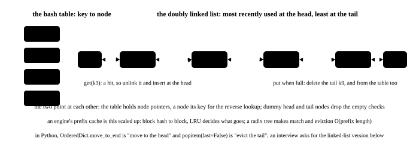

# Linked lists, stacks and hashing: using the structure right

<p class="lead">All three structures in this chapter have a direct counterpart in an inference engine: the free list of the KV block pool, the scheduler's request queue, the prefix cache's hash table, the block allocator's LRU. They are also the steadiest material in an interview, where a linked list tests whether your pointer work is solid, a monotonic stack tests when an old element should be thrown away, and a hash table tests what you use as the key. This chapter sets out the templates for the dummy head, fast and slow pointers, the monotonic stack, the monotonic queue and LRU, each with code you can run.</p>

!!! question "Self-test: if you can answer these, skip the chapter"
    1. What problem does a dummy head node solve?
    2. Besides finding the midpoint, what else can fast and slow pointers do?
    3. Why is a monotonic stack O(n), even with a nested `while` in the code?
    4. Which two structures does an O(1) LRU cache need? What is each responsible for?
    5. When grouping with a hash table by some equivalence, what is the crux?

??? success "Answers for the self-test (answer first, then open this)"
    1. Deleting or inserting at the head needs no special case. With a dummy head every node has a predecessor, so the "remove prev.next" logic holds for the head too; the code is half as long with half the mistakes.
    2. Detecting a cycle (the fast pointer catches the slow one), finding the cycle's entry (after they meet, send one pointer back to the head and advance both at the same speed), finding the kth node from the end (the fast pointer goes k steps first), and checking whether a list is a palindrome (find the midpoint and reverse the second half).
    3. Because every element is pushed at most once and popped at most once, for 2n operations in total. The total number of times the nested `while` runs is bounded by how many elements can be popped altogether, not by n pops at every position. The sliding window and the monotonic queue rest on the same argument.
    4. A hash table (key to node, for O(1) location) plus a doubly linked list (for the usage order, with O(1) unlink and insert). In Python `OrderedDict` already combines the two, with `move_to_end` and `popitem(last=False)` corresponding exactly.
    5. Design a **canonical form** as the key: anagrams become identical once sorted, token sequences with the same prefix hash the same, and blocks with the same content have the same content hash. Once an equivalence can be reduced to a definite key, grouping is one pass.

A six-panel strip first, then the chapter:

<!-- comic ../assets/comics/lru.webp is in Chinese; put it back once the English version exists -->

## Linked lists: the dummy head, fast and slow pointers, in-place reversal {#链表虚拟头快慢指针原地反转}

```python title="linked.py"
# the three staples of linked lists: the dummy head, fast and slow pointers, in-place reversal
class Node:
    def __init__(self, val, nxt=None):
        self.val, self.next = val, nxt


def build(vals):
    head = None
    for v in reversed(vals):
        head = Node(v, head)
    return head


def to_list(head):
    out = []
    while head:
        out.append(head.val)
        head = head.next
    return out


def remove_all(head, target):
    """删除所有值为 target 的节点：虚拟头节点让"删除头节点"不用特判"""
    dummy = Node(None, head)
    prev = dummy
    while prev.next:
        if prev.next.val == target:
            prev.next = prev.next.next         # skip it, leaving prev where it is
        else:
            prev = prev.next
    return dummy.next


def middle(head):
    """快慢指针：快指针一次两步，慢指针一次一步，快到头时慢正好在中点"""
    slow = fast = head
    while fast and fast.next:
        slow, fast = slow.next, fast.next.next
    return slow.val if slow else None


def has_cycle(head):
    """判环：有环时快指针一定会追上慢指针"""
    slow = fast = head
    while fast and fast.next:
        slow, fast = slow.next, fast.next.next
        if slow is fast:
            return True
    return False


def reverse(head):
    """原地反转：三个指针，prev 是新的后继"""
    prev = None
    while head:
        head.next, prev, head = prev, head, head.next
    return prev


print("删除所有 2：", to_list(remove_all(build([2, 1, 2, 3, 2]), 2)))
print("删除头节点：", to_list(remove_all(build([1, 1, 1]), 1)), "（虚拟头节点省掉了特判）")
print("中间节点：", middle(build([1, 2, 3, 4, 5])), "（偶数个时取靠后的：", middle(build([1, 2, 3, 4])), "）")
print("反转：", to_list(reverse(build([1, 2, 3, 4, 5]))))

loop = build([1, 2, 3, 4])
tail = loop
while tail.next:
    tail = tail.next
tail.next = loop.next                          # 4 -> 2, making a cycle
print("有环吗：", has_cycle(loop), "；无环的链表：", has_cycle(build([1, 2, 3])))
```

```text title="output"
删除所有 2： [1, 3]
删除头节点： [] （虚拟头节点省掉了特判）
中间节点： 3 （偶数个时取靠后的： 3 ）
反转： [5, 4, 3, 2, 1]
有环吗： True ；无环的链表： False
```

Three things:

- **The dummy head**: whenever the head could be deleted or inserted, build a `dummy` first and return `dummy.next`.
- **Fast and slow pointers**: the midpoint, cycle detection, the kth from the end, palindromes. When the fast pointer takes two steps, the loop condition has to be `while fast and fast.next` and the order cannot be reversed (short-circuit evaluation).
- **In-place reversal**: three pointers, `prev / cur / next`. In Python it can be the one-liner `head.next, prev, head = prev, head, head.next`, but spelling it out over three lines is safer in an interview and easier to explain.

Linked-list problems in Python should **be written iteratively first**: the default recursion depth is only 1000, so a list of ten thousand gives a `RecursionError`.

Linked lists in an inference engine: the free-block list of the KV block pool (O(1) to take and return), the waiting queue of requests, and the free-block list of CUDA's caching allocator (see [The caching allocator](cuda://framework/cuda-runtime/)). Real systems often use an array with indices in place of pointers (friendlier to the cache and directly serialisable), but the reasoning is the same.

## Stacks and the monotonic stack {#栈与单调栈}

A stack's basic use is pairing: matching brackets, evaluating an expression, undoing an operation, turning recursion into iteration (maintaining the stack by hand). More worth practising are the **monotonic stack** and the **monotonic queue**:

```python title="monotonic.py"
# the monotonic stack and the monotonic queue: one scan solves the next greater element and the sliding window maximum
from collections import deque


def next_greater(a):
    """每个元素右边第一个比它大的元素，没有就是 -1"""
    out = [-1] * len(a)
    stack = []                                 # holds indices, whose values decrease from the bottom of the stack to the top
    for i, x in enumerate(a):
        while stack and a[stack[-1]] < x:      # the new element is larger than the top: the top has found its answer
            out[stack.pop()] = x
        stack.append(i)
    return out


def largest_rectangle(heights):
    """柱状图里最大的矩形：每根柱子向左右扩展到第一个更矮的柱子"""
    stack, best = [], 0
    for i, h in enumerate(heights + [0]):      # append a 0 so that everything left on the stack is popped
        while stack and heights[stack[-1]] >= h:
            height = heights[stack.pop()]
            left = stack[-1] + 1 if stack else 0
            best = max(best, height * (i - left))
        stack.append(i)
    return best


def sliding_max(a, k):
    """滑动窗口最大值：双端队列里存下标，值单调递减"""
    dq, out = deque(), []
    for i, x in enumerate(a):
        while dq and a[dq[-1]] <= x:           # anything smaller than the new element can never be the maximum again
            dq.pop()
        dq.append(i)
        if dq[0] <= i - k:                     # the front has slid out of the window
            dq.popleft()
        if i >= k - 1:
            out.append(a[dq[0]])
    return out


a = [2, 1, 2, 4, 3]
print("数组：", a)
print("下一个更大元素：", next_greater(a))
print("最大矩形（柱状图 [2,1,5,6,2,3]）：", largest_rectangle([2, 1, 5, 6, 2, 3]))
print("滑动窗口最大值（k=3）：", sliding_max([1, 3, -1, -3, 5, 3, 6, 7], 3))
print()
print("共同点：每个下标进栈/进队一次、出一次，所以是 O(n)，哪怕代码里有嵌套的 while。")
```

```text title="output"
数组： [2, 1, 2, 4, 3]
下一个更大元素： [4, 2, 4, -1, -1]
最大矩形（柱状图 [2,1,5,6,2,3]）： 10
滑动窗口最大值（k=3）： [3, 3, 5, 5, 6, 7]

共同点：每个下标进栈/进队一次、出一次，所以是 O(n)，哪怕代码里有嵌套的 while。
```

To decide whether a problem takes a monotonic stack, see whether it is asking for **the first element to the left or right of each element that is larger or smaller**, or for the largest range in which each element is the extreme. The largest rectangle in a histogram, trapping rain water, daily temperatures and stock span are all of this kind.

Settle three things when writing it: whether the stack holds indices or values (**indices** are usually more flexible, since distances can be computed), whether it is increasing or decreasing, and what is settled on a pop. Appending a sentinel at the end (0 or infinity, say) removes the duplicated code for draining the stack after the loop.

The monotonic queue (a double-ended queue) solves **the extreme within a sliding window**: the front is the current window's maximum, a new element pops everything smaller off the back, and the front is popped when it slides out of the window. It differs from the monotonic stack only in popping from both ends.

## Hash tables: designing the key {#哈希表键的设计}

The three common uses of a hash table in problems:

| Use | Example | What the key is |
| --- | --- | --- |
| Checking whether something has occurred | two-sum, the longest substring without repeats | the element's value |
| Counting | anagrams, the top-k by occurrence | the element's value |
| Grouping by an equivalence | grouping anagrams, grouping by prefix | **a canonical form** |

The third takes the most thought: the equivalence has to reduce to a **definite key**. Anagrams use the sorted string or a tuple of letter counts; points on one line use a tuple of the slope in lowest terms; the prefix cache uses a rolling hash of the prefix tokens.

A few more things to watch in engineering:

- **Collisions and the worst case**. Python's dict is O(1) on average, but carefully constructed keys can degrade it. When a server handles untrusted input this is a real attack surface (a hash-collision attack), and the answer is a salted hash (Python randomises by default through `PYTHONHASHSEED`).
- **The key's content has to be complete**. In inference systems, vLLM's block hash includes not only this block's tokens but also **the parent block's hash**, the hash of any multimodal input, the LoRA id and the `cache_salt` used for multi-tenant isolation. Leave one out and requests with different content may wrongly share (see [The prefix cache](serving://engine/prefix-cache/)).
- **Only something immutable can be a key**. A list cannot, so convert to a tuple; a custom object has to implement `__hash__` and `__eq__` consistently with each other.

## LRU: a hash table plus a doubly linked list {#lru哈希表--双向链表}

{.aig-svg}

```python title="lru.py"
# an LRU cache: a hash table to locate plus a doubly linked list for the order. Here with OrderedDict, then written by hand for comparison
from collections import OrderedDict


class LRUEasy:
    def __init__(self, capacity):
        self.cap, self.d = capacity, OrderedDict()

    def get(self, key):
        if key not in self.d:
            return -1
        self.d.move_to_end(key)                # make it the most recently used
        return self.d[key]

    def put(self, key, value):
        if key in self.d:
            self.d.move_to_end(key)
        self.d[key] = value
        if len(self.d) > self.cap:
            self.d.popitem(last=False)         # evict the least recently used


class LRU:
    """手写版：双向链表的每个节点是 [key, value, prev, next]，头是最久没用的"""

    def __init__(self, capacity):
        self.cap, self.map = capacity, {}
        self.head, self.tail = ["#head", None, None, None], ["#tail", None, None, None]
        self.head[3], self.tail[2] = self.tail, self.head

    def _unlink(self, node):
        node[2][3], node[3][2] = node[3], node[2]

    def _append(self, node):                   # attach at the tail (the most recently used)
        node[2], node[3] = self.tail[2], self.tail
        self.tail[2][3] = node
        self.tail[2] = node

    def get(self, key):
        node = self.map.get(key)
        if node is None:
            return -1
        self._unlink(node)
        self._append(node)
        return node[1]

    def put(self, key, value):
        node = self.map.get(key)
        if node is not None:
            node[1] = value
            self._unlink(node)
            self._append(node)
            return
        node = [key, value, None, None]
        self.map[key] = node
        self._append(node)
        if len(self.map) > self.cap:
            oldest = self.head[3]
            self._unlink(oldest)
            del self.map[oldest[0]]


for cls in (LRUEasy, LRU):
    c = cls(2)
    c.put(1, 1)
    c.put(2, 2)
    got = [c.get(1)]                           # touch 1, which makes 2 the least recently used
    c.put(3, 3)                                # evicts 2
    got += [c.get(2), c.get(3)]
    c.put(4, 4)                                # evicts 1
    got += [c.get(1), c.get(3), c.get(4)]
    print(f"{cls.__name__:8s} 依次得到 {got}（-1 表示已被淘汰）")
print()
print("两种写法都是 O(1)：哈希表负责定位，双向链表负责维护顺序。")
print("推理引擎的 KV 块池用的是同一套结构：块哈希 -> 块，空闲块按 LRU 排队等待复用。")
```

```text title="output"
LRUEasy  依次得到 [1, -1, 3, -1, 3, 4]（-1 表示已被淘汰）
LRU      依次得到 [1, -1, 3, -1, 3, 4]（-1 表示已被淘汰）

两种写法都是 O(1)：哈希表负责定位，双向链表负责维护顺序。
推理引擎的 KV 块池用的是同一套结构：块哈希 -> 块，空闲块按 LRU 排队等待复用。
```

Asked about LRU in an interview, be able to make three points clear: **why the list has to be doubly linked** (unlinking an arbitrary node has to be O(1), and a singly linked list cannot find the predecessor), **why the hash table is needed** (otherwise locating is O(n)), and **how the edges are handled** (a capacity of 0, a repeated put, and a missed get not inserting anything).

The variants in an inference engine:

- vLLM's block pool uses a free queue plus a block hash table: blocks without a hash go to the front in LIFO order (better for GPU locality) and blocks with one go to the back in LRU order.
- SGLang's radix cache is **a reference-counted LRU over the leaves**: a node a request is using is locked against eviction, and eviction starts from the leaves.
- LFU (by usage frequency) is better when the hit distribution is very skewed, but it is complex to implement and slow to react to a traffic burst, so it is rarely used in practice.

## What this chapter's problems are testing {#这一章的题在考什么}

| When you see these words | Think of this template |
| --- | --- |
| linked list, delete, insert, head node | the dummy head |
| the midpoint, a cycle, the kth from the end, a palindrome list | fast and slow pointers |
| brackets, matching, undo, an expression | a stack |
| the next greater, the first smaller to the left, the largest rectangle, trapping rain water | a monotonic stack |
| the maximum or minimum of a sliding window | a monotonic queue |
| a cache, eviction, O(1) get and put | a hash table plus a doubly linked list |
| grouping, deduplication, occurrence counts | a hash table (where the key's design is the crux) |

!!! interview "How to explain it"
    For a linked-list problem, name two tools first: "I will use a dummy head to remove the special case at the head, and fast and slow pointers to find the midpoint or detect a cycle", then stress writing it iteratively (Python's recursion depth is only 1000). For a monotonic stack, prove the complexity unprompted: "each index is pushed once and popped once, so it is O(n)", and make clear that the stack holds indices, which direction it is monotone in, and what is settled on a pop. For LRU, give the structure directly: "a hash table to locate plus a doubly linked list for the order, both O(1)", and add a sentence on what real systems do (vLLM's free queue, SGLang's reference-counted LRU over the leaves). For a hash-table problem the crux is the key's design, and an engineering example such as "a block hash has to include the parent's hash and the cache salt" counts in your favour.

## Summary {#小结}

- [x] A dummy head removes the special case at the head; fast and slow pointers handle the midpoint, cycle detection, the kth from the end and palindromes.
- [x] Write linked-list problems iteratively in Python, where the recursion depth limit is only 1000.
- [x] A monotonic stack handles the next greater or smaller, a monotonic queue the extreme of a sliding window; each element goes in and out once, so both are O(n).
- [x] LRU is a hash table plus a doubly linked list; an inference engine's block pool and radix cache are variants of it.
- [x] The crux of grouping with a hash table is the canonical form; the key's content has to be complete (a block hash needs the parent, the LoRA and the salt).
