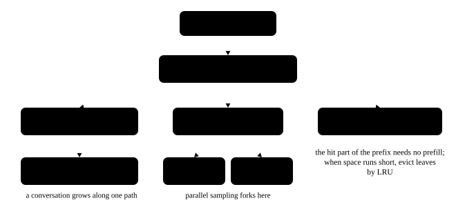

# Trees and graphs: traversal, topological order, union-find and the prefix tree

<p class="lead">Trees and graphs are everywhere in an inference system: a compute graph needs a legal execution order, the prefix cache is a tree branching by token, speculative decoding's draft is a tree awaiting verification, and a distributed job's dependencies are a directed acyclic graph. This family of problems also shows the fundamentals best in an interview: whether you can write a traversal iteratively, what BFS and DFS are each good for, how a topological sort detects a cycle, and what union-find's two optimisations each solve. This chapter sets out those templates, using the compute graph and the radix cache as examples.</p>

!!! question "Self-test: if you can answer these, skip the chapter"
    1. Which data structure writes each of the pre-order, in-order, post-order and level-order traversals of a binary tree iteratively?
    2. Why are tree and graph problems best written iteratively in Python?
    3. The level count BFS produces is a shortest path. Why is it not the earliest time an operator in a compute graph can run?
    4. How does a topological sort tell whether the graph has a cycle?
    5. What are union-find's two optimisations? What does each solve?

??? success "Answers for the self-test (answer first, then open this)"
    1. Pre-order and post-order use a stack (post-order can traverse root-right-left and reverse the whole thing); in-order uses a stack with the walk-all-the-way-left form; level order uses a queue, and recording the current queue length at the start of each round splits it by level.
    2. The default recursion depth is only 1000. A binary tree degenerated into a chain, a long linked list or a very deep graph all give a `RecursionError`, and the call overhead is not small. In an interview you can say "I will write it iteratively to avoid blowing the stack", which counts in your favour by itself.
    3. BFS's shortest path is the fewest edges traversed, while an operator in a compute graph has to wait for **all** of its predecessors, which corresponds to the **longest path** (the critical path). So working out the execution order takes a topological sort plus dynamic programming for the longest path, not BFS's shortest path.
    4. Dequeue the nodes with in-degree 0 one by one and decrement their successors' in-degrees; if fewer nodes came out of the queue than the total at the end, the remaining nodes are certainly in a cycle. The DFS version uses three-colour marking, where reaching a node that is currently being visited means there is a cycle.
    5. **Path compression** (attaching the nodes along the way directly to the root during a find) and **union by size or rank** (hanging the smaller tree under the larger). The first flattens the tree and the second keeps it from growing lopsided; together they make one operation approximately O(1) (an inverse Ackermann function).

## Tree traversal: all of it iterative {#树的遍历全部写成迭代}

```python title="traverse.py"
# all four tree traversals, written iteratively (Python's recursion depth is only 1000, and a tree degenerated into a chain breaks it)
from collections import deque


class T:
    def __init__(self, val, left=None, right=None):
        self.val, self.left, self.right = val, left, right


root = T(1, T(2, T(4), T(5)), T(3, None, T(6)))


def preorder(node):
    out, stack = [], [node] if node else []
    while stack:
        cur = stack.pop()
        out.append(cur.val)
        if cur.right:
            stack.append(cur.right)            # push the right first and the left second: the left comes off first
        if cur.left:
            stack.append(cur.left)
    return out


def inorder(node):
    out, stack = [], []
    while node or stack:
        while node:                            # all the way left
            stack.append(node)
            node = node.left
        node = stack.pop()
        out.append(node.val)
        node = node.right
    return out


def postorder(node):
    out, stack = [], [node] if node else []
    while stack:                               # traverse root-right-left and reverse the whole thing, which is left-right-root
        cur = stack.pop()
        out.append(cur.val)
        if cur.left:
            stack.append(cur.left)
        if cur.right:
            stack.append(cur.right)
    return out[::-1]


def level_order(node):
    out, q = [], deque([node] if node else [])
    while q:
        level = []
        for _ in range(len(q)):                # handle one whole level at a time
            cur = q.popleft()
            level.append(cur.val)
            q.extend(x for x in (cur.left, cur.right) if x)
        out.append(level)
    return out


print("       1")
print("      / \\")
print("     2   3")
print("    / \\   \\")
print("   4   5   6")
print("前序（根左右）：", preorder(root))
print("中序（左根右）：", inorder(root))
print("后序（左右根）：", postorder(root))
print("层序：", level_order(root))
print()
deep = T(0)
cur = deep
for i in range(1, 20000):                      # a tree degenerated into a chain: recursion certainly blows the stack
    cur.right = T(i)
    cur = cur.right
print("两万层的退化树，迭代前序遍历的前几个：", preorder(deep)[:5], "…… 共", len(preorder(deep)), "个节点")
```

```text title="output"
       1
      / \
     2   3
    / \   \
   4   5   6
前序（根左右）： [1, 2, 4, 5, 3, 6]
中序（左根右）： [4, 2, 5, 1, 3, 6]
后序（左右根）： [4, 5, 2, 6, 3, 1]
层序： [[1], [2, 3], [4, 5, 6]]

两万层的退化树，迭代前序遍历的前几个： [0, 1, 2, 3, 4] …… 共 20000 个节点
```

The last line is the point: **a degenerate tree of twenty thousand levels** certainly blows the stack with recursion, while iteration is fine. A binary search tree degenerates like this when sorted data is inserted in order, so this is not a contrived extreme.

A few useful conclusions:

- **An in-order traversal of a binary search tree gives an ascending sequence**, so validating a BST and finding the kth smallest can both use in-order.
- **A level-order traversal** naturally suits problems that do one thing per level (the right-side view, the maximum per level, a zigzag traversal).
- **A post-order traversal** suits problems that need the subtree's result first (height, checking balance, tree DP, the lowest common ancestor). When recursion is the more natural way to write it, an interview allows writing the recursion first and then saying "with large data I would switch to iteration or an explicit stack".

## Graphs: BFS, DFS and topological sorting {#图bfsdfs-与拓扑排序}

```python title="graph.py"
# three basic graph algorithms: BFS for the shortest path (unweighted), topological sorting, union-find
from collections import defaultdict, deque

# a small dependency graph: an operator -> the operators that depend on it (the shape of a compute graph)
edges = [("embed", "attn"), ("attn", "norm1"), ("norm1", "mlp"), ("mlp", "norm2"),
         ("embed", "residual"), ("residual", "norm2"), ("norm2", "logits")]
graph = defaultdict(list)
indeg = defaultdict(int)
nodes = set()
for a, b in edges:
    graph[a].append(b)
    indeg[b] += 1
    nodes |= {a, b}


def bfs_dist(start):
    dist = {start: 0}
    q = deque([start])
    while q:
        cur = q.popleft()
        for nxt in graph[cur]:
            if nxt not in dist:                # the first visit is the shortest distance
                dist[nxt] = dist[cur] + 1
                q.append(nxt)
    return dist


def topo_sort():
    deg = {n: indeg[n] for n in nodes}
    q = deque(sorted(n for n in nodes if deg[n] == 0))   # sorted only to keep the output stable
    out = []
    while q:
        cur = q.popleft()
        out.append(cur)
        for nxt in graph[cur]:
            deg[nxt] -= 1
            if deg[nxt] == 0:
                q.append(nxt)
    return out if len(out) == len(nodes) else None       # missing nodes mean there is a cycle


class DSU:
    def __init__(self, items):
        self.parent = {x: x for x in items}
        self.size = {x: 1 for x in items}

    def find(self, x):
        while self.parent[x] != x:
            self.parent[x] = self.parent[self.parent[x]]   # path compression
            x = self.parent[x]
        return x

    def union(self, a, b):
        ra, rb = self.find(a), self.find(b)
        if ra == rb:
            return False
        if self.size[ra] < self.size[rb]:                  # union by size
            ra, rb = rb, ra
        self.parent[rb] = ra
        self.size[ra] += self.size[rb]
        return True


print("从 embed 出发的层数：", dict(sorted(bfs_dist("embed").items())))
print("拓扑序（一种合法的执行顺序）：", topo_sort())

graph["logits"].append("embed")                # add a back edge to make a cycle
indeg["embed"] += 1
print("加一条 logits -> embed 之后：", topo_sort(), "（None 表示有环，计算图非法）")
graph["logits"].pop()
indeg["embed"] -= 1

dsu = DSU(nodes)
merged = [dsu.union(a, b) for a, b in edges]
print("\n并查集：把所有有依赖关系的算子并起来后，连通块个数 =",
      len({dsu.find(n) for n in nodes}), "，合并成功的边数 =", sum(merged), "（其余是成环的边）")
```

```text title="output"
从 embed 出发的层数： {'attn': 1, 'embed': 0, 'logits': 3, 'mlp': 3, 'norm1': 2, 'norm2': 2, 'residual': 1}
拓扑序（一种合法的执行顺序）： ['embed', 'attn', 'residual', 'norm1', 'mlp', 'norm2', 'logits']
加一条 logits -> embed 之后： None （None 表示有环，计算图非法）

并查集：把所有有依赖关系的算子并起来后，连通块个数 = 1 ，合并成功的边数 = 6 （其余是成环的边）
```

A few notes:

- **BFS gives the shortest path (the fewest edges)** while DFS gives reachability and connectivity. In grid problems (counting islands, the shortest path), BFS uses a queue and DFS a stack or recursion, and in both the key is to **mark as visited on the way in**, not on the way out, or the same node gets added repeatedly.
- **A topological sort** uses an in-degree table plus a queue (Kahn's algorithm): the nodes with in-degree 0 come out first, and each one decrements its successors' in-degrees. Fewer nodes out of the queue than the total at the end means there is a cycle. Compute graphs, task dependencies and the course schedule are all of this kind.
- In the example above, `norm2` is at BFS level 2, but it has to wait for `mlp` (level 3) to finish before it can run. **Working out the execution order takes the longest path over the topological order (the critical path), not BFS's shortest path.** Real operator scheduling also has to consider parallelism and device memory, see [Compute graphs and compilation](serving://engine/graphs-compile/).
- **Union-find** answers whether two nodes are connected: with path compression and union by size, one operation is approximately O(1). Typical uses: finding the connected components of an undirected graph, Kruskal's minimum spanning tree, detecting whether adding an edge creates a cycle, and merging equivalence classes as in the accounts-merge problem.

A weighted shortest path needs another algorithm: **Dijkstra** (non-negative weights, with a heap, O((V+E) log V)), **Bellman-Ford** (negative weights allowed, O(VE)) and **Floyd** (all pairs, O(V cubed)). Picking the lowest-latency route in a cluster is Dijkstra.

## The prefix tree: from the trie to the radix cache {#前缀树从字典树到-radix-cache}

{.aig-svg}

```python title="trie.py"
# the prefix tree: an inference engine's radix cache is its compressed form (a chain with one child squeezed into one edge)
class Trie:
    def __init__(self):
        self.root = {}                         # each node is a dict, where the special key "#" marks the end of a word

    def insert(self, word):
        node = self.root
        for ch in word:
            node = node.setdefault(ch, {})
            node.setdefault("#count", 0)
            node["#count"] += 1                # how many words pass through this prefix
        node["#"] = True

    def contains(self, word):
        node = self.walk(word)
        return node is not None and "#" in node

    def walk(self, prefix):
        node = self.root
        for ch in prefix:
            if ch not in node:
                return None
            node = node[ch]
        return node

    def count_prefix(self, prefix):
        node = self.walk(prefix)
        return 0 if node is None else node.get("#count", 0)

    def longest_match(self, text):
        """text 与树里任何一条路径的最长公共前缀长度——这正是前缀缓存的匹配"""
        node, matched = self.root, 0
        for ch in text:
            if ch not in node:
                break
            node = node[ch]
            matched += 1
        return matched


t = Trie()
for w in ["cat", "car", "card", "care", "dog"]:
    t.insert(w)
print("包含 'car'：", t.contains("car"), "；包含 'ca'：", t.contains("ca"))
print("以 'ca' 开头的词有", t.count_prefix("ca"), "个；以 'car' 开头的有", t.count_prefix("car"), "个")
print("'cards' 与已有内容的最长公共前缀长度：", t.longest_match("cards"))
print("'dogs' ：", t.longest_match("dogs"), "；'xyz'：", t.longest_match("xyz"))
print()

# switching to token sequences: how much prefix is reusable when multi-turn conversations share one system prompt
cache = Trie()
system = [101, 102, 103, 104, 105]
cache.insert(tuple(system + [201, 202]))
for name, req in [("同一个系统提示词 + 新问题", system + [301]),
                  ("换了系统提示词", [999] + system),
                  ("完全相同的请求", system + [201, 202])]:
    matched = cache.longest_match(tuple(req))
    print(f"{name}：可复用前缀 {matched} 个 token，需要重算 {len(req) - matched} 个")
```

```text title="output"
包含 'car'： True ；包含 'ca'： False
以 'ca' 开头的词有 4 个；以 'car' 开头的有 3 个
'cards' 与已有内容的最长公共前缀长度： 4
'dogs' ： 3 ；'xyz'： 0

同一个系统提示词 + 新问题：可复用前缀 5 个 token，需要重算 1 个
换了系统提示词：可复用前缀 0 个 token，需要重算 6 个
完全相同的请求：可复用前缀 7 个 token，需要重算 0 个
```

Each node of a prefix tree stands for a prefix and each edge is one character (or one token). Its value is that **a shared prefix is stored only once**, and it answers whether a prefix exists, how many entries start with it, and how long a match can get, all in time proportional to the prefix's length.

An inference engine's **radix cache** is its compressed form: a chain with only one child is squeezed into one edge (saving memory and pointer hops), each node carries the matching KV blocks, and reference counting and LRU eviction are added. The last few lines above simulate exactly its central question, **how much prefix a new request can reuse**: a new question with the same system prompt hits the whole prefix and only the new part has to be computed; change the system prompt and it fails to match from the very first token. That also explains why putting the system prompt at the front and the varying content behind it raises the hit rate so much (see [The prefix cache](serving://engine/prefix-cache/)).

## What this chapter's problems are testing {#这一章的题在考什么}

| When you see these words | Think of this template |
| --- | --- |
| binary tree, depth, path, subtree | recursion or post-order (iterative for large data) |
| each level, the right-side view, zigzag | level order (a queue) |
| binary search tree, the kth smallest, validate | in-order |
| the fewest steps, the fewest operations, a grid | BFS |
| connected, whether a path exists, islands | DFS or union-find |
| dependencies, the course schedule, the execution order, detect a cycle | a topological sort |
| merging sets, in the same group, an edge making a cycle | union-find |
| a prefix, autocomplete, a common prefix | a prefix tree |
| a weighted shortest path | Dijkstra (with a heap) |

!!! interview "How to explain it"
    For a tree problem, say which traversal and why: "this needs the subtree's result first, so post-order", and volunteer that "Python's recursion depth is only 1000, so I will write it iteratively with an explicit stack". For a graph problem, be clear about **how the graph is built** (an adjacency list, an in-degree table) and **where the visited mark goes** (on the way into the queue, to avoid enqueueing twice), then give the O(V+E). For a topological sort, say how the cycle is detected (fewer nodes out of the queue than there are nodes). For union-find, name both optimisations (path compression, union by size) and the approximate O(1). Mapping the problem to an engineering case counts in your favour: a topological sort is the compute graph's execution order (noting that it is the longest path, not the shortest), a prefix tree is the radix cache's prefix reuse, and union-find is a connectivity check.

## Summary {#小结}

- [x] All four traversals can be iterative: a stack for pre- and post-order, walk-all-the-way-left for in-order, a queue for level order; a tree degenerated into a chain blows the recursion stack.
- [x] BFS gives the shortest path and DFS tests connectivity; the visited mark goes on at enqueue time.
- [x] A topological sort detects a cycle through the in-degree table; a compute graph's execution order needs the longest path over the topological order, not BFS's shortest path.
- [x] Union-find is path compression plus union by size, approximately O(1) per operation.
- [x] A prefix tree stores a shared prefix once; the radix cache is its compressed form and decides how much prefix a request can reuse.
