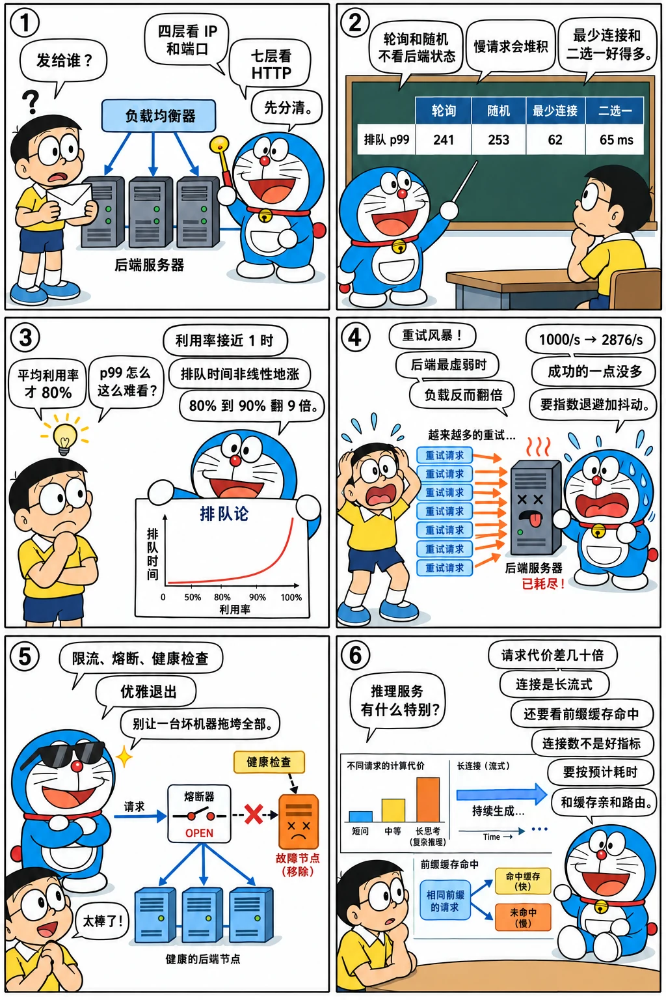

# 负载均衡与排队：请求该发给谁

<p class="lead">一个推理集群前面总有一层负载均衡：它决定请求发到哪台机器，也决定了 p99 有多难看。这一章讲三件事——负载均衡的四种常见算法在长尾服务时间下差多少（本章的模拟里 p99 相差近 4 倍）、排队论为什么说"利用率过了 80% 延迟就开始起飞"、以及限流、重试和熔断该怎么配合。最后落到推理服务特有的地方：请求代价差几十倍、长连接让四层负载均衡失效、缓存亲和与负载均衡互相打架。</p>

!!! question "自测：能答上来就可以跳过本章"
    1. 四层和七层负载均衡各在哪一层工作？流式输出的服务为什么不能只靠四层？
    2. 轮询、随机、最少连接、二选一（P2C），在服务时间长尾的情况下哪个最好？为什么？
    3. 一个服务的利用率从 50% 提到 90%，平均排队时间大概涨多少倍？机器数量对这件事有什么影响？
    4. 后端短暂过载时，客户端重试会发生什么？指数退避加抖动够不够？
    5. 推理服务的负载均衡和普通 Web 服务比，特殊在哪？

??? success "自测参考答案（先自己答，再展开对照）"
    1. 四层看 IP 和端口，按连接转发，不理解 HTTP；七层解析 HTTP，能按路径、请求头、请求体路由，能做重试和熔断。流式服务的一条连接会持续几十秒到几分钟，四层只在建连时做一次选择，之后这条连接上的所有请求都去同一个后端，很容易不均；而按请求长度、缓存命中来路由更需要七层。
    2. 一般是最少连接和二选一。轮询和随机不看后端状态，慢请求会让某台机器堆积，本章的模拟里排队 p99 分别是 241 ms 和 253 ms；最少连接是 62 ms，二选一是 140 ms。最少连接最准但需要集中状态，二选一（随机挑两台选较空的那台）只要局部信息，在分布式负载均衡器里更常用。
    3. 按 M/M/c 公式，单台服务器上平均排队时间从 10 ms 涨到 90 ms，9 倍；4 台从 0.9 ms 到 19.7 ms，20 多倍。机器越多越"抗"：同样 90% 的利用率，1 台排队 90 ms，16 台只要 3.7 ms。小池子要留更多余量。
    4. 重试会在后端最虚弱的时候再加一倍多的负载，本章模拟里峰值从 1000/s 涨到 2876/s，而故障期间能成功的请求数一点没变（受容量限制）。指数退避加抖动能避免重试同时到达，但在持续过载时仍然会放大总量；真正有效的是**重试预算**（每秒重试量不超过正常流量的 10%）和熔断，模拟里峰值回到 1100/s。
    5. 三点：请求代价差异极大（prefill 长度差几十倍，输出长度未知），所以"连接数"不是好的负载指标；流式响应使连接长期存在，四层负载均衡会不均；前缀缓存让"发给曾经处理过同样前缀的实例"更快，但这与负载均衡冲突，需要折中。

先看一个六格小剧场，再读正文：

{.aig-comic}

## 四层与七层

| | 四层（L4） | 七层（L7） |
| --- | --- | --- |
| 看什么 | IP、端口 | HTTP 方法、路径、头、请求体 |
| 决策时机 | 建立连接时一次 | 每个请求 |
| 能做什么 | 转发、连接级健康检查 | 按内容路由、重试、超时、限流、熔断、改写、观测 |
| 开销 | 极低（可以做到内核态、硬件） | 需要解析和缓冲，延迟高一些 |
| 典型实现 | LVS/IPVS、云上的网络负载均衡、kube-proxy | Nginx、Envoy、HAProxy（七层模式）、各种 API 网关 |

推理服务通常两层都有：外层四层负载均衡把流量分到若干台网关，网关做七层路由（鉴权、限流、按模型名选后端池、按缓存亲和选实例）。

注意一个坑：**HTTP/2 和长连接会让四层负载均衡失效**。一条连接建立时选定后端，之后这条连接上的成百上千个请求都去那里。客户端如果只开一条连接，后端就只有一台在干活。解决办法是用七层负载均衡（按请求分发），或者让客户端定期重建连接（设置最大连接寿命、最大请求数）。

## 选哪台：四种算法

后端机器性能相同、请求代价有长尾时，四种常见算法的差别：

```python title="balance.py"
# 四种负载均衡策略在"服务时间长尾"下的表现：轮询、随机、最少连接、二选一（P2C）
import heapq
import random


def simulate(policy, n_servers=8, n_reqs=20000, seed=7):
    rng = random.Random(seed)
    busy_until = [0.0] * n_servers        # 每台服务器忙到什么时候
    inflight = [0] * n_servers            # 正在处理的请求数
    finish = []                           # 已安排的完成事件（时间, 服务器）
    waits = []
    t = 0.0
    for i in range(n_reqs):
        t += rng.expovariate(1 / 1.0)     # 请求到达间隔平均 1 ms
        while finish and finish[0][0] <= t:
            _, s = heapq.heappop(finish)
            inflight[s] -= 1
        if policy == "轮询":
            s = i % n_servers
        elif policy == "随机":
            s = rng.randrange(n_servers)
        elif policy == "最少连接":
            s = min(range(n_servers), key=lambda k: (inflight[k], k))
        else:                             # 二选一：随机挑两台，选正在处理的请求少的那台
            a, b = rng.randrange(n_servers), rng.randrange(n_servers)
            s = a if inflight[a] <= inflight[b] else b
        service = rng.expovariate(1 / 4.0) if rng.random() > 0.05 else rng.expovariate(1 / 40.0)
        start = max(t, busy_until[s])     # 这台机器一次只处理一个请求
        busy_until[s] = start + service
        inflight[s] += 1
        heapq.heappush(finish, (busy_until[s], s))
        waits.append(start - t)           # 排队等待时间
    waits.sort()
    return waits[len(waits) // 2], waits[int(len(waits) * 0.99)]


print("到达 1000 请求/秒，8 台服务器，平均服务 5.8 ms（5% 的慢请求平均 40 ms），利用率约 72%\n")
print("策略      排队 p50   排队 p99")
for policy in ["轮询", "随机", "最少连接", "二选一"]:
    p50, p99 = simulate(policy)
    print(f"{policy:6s} {p50:7.2f} ms {p99:7.1f} ms")
```

```text title="输出"
到达 1000 请求/秒，8 台服务器，平均服务 5.8 ms（5% 的慢请求平均 40 ms），利用率约 72%

策略      排队 p50   排队 p99
轮询        3.48 ms   241.3 ms
随机        9.97 ms   253.4 ms
最少连接      0.00 ms    62.5 ms
二选一       0.99 ms   139.6 ms
```

- **轮询**和**随机**不看后端状态。一台机器碰上一个慢请求，后面派给它的请求全都跟着等，p99 最差。
- **最少连接**把请求发给当前正在处理的请求数最少的那台，等于把长尾请求的影响局限在它自己身上，p99 最好。代价是负载均衡器要维护每台后端的实时状态；多个负载均衡器实例各自维护的话，会因为看到的状态不一致而打架（大家同时认为同一台最空，一起涌过去）。
- **二选一（P2C）**：随机挑两台，选其中正在处理的请求数少的那台。只要局部信息，多个负载均衡器实例之间不会同步过载，效果接近最少连接。这是 Envoy、gRPC 等默认或推荐的策略。

实践中还有两个常用的变体：**加权**（后端性能不同或灰度发布时按权重分配）和 **EWMA 延迟**（按最近的响应时间滑动平均来选，能反映后端的真实健康度）。

## 排队论：利用率与延迟

为什么"平均利用率才 80%，p99 却很难看"？因为请求到达是随机的，排队时间随利用率非线性增长：

拉一拉利用率，看排队时间怎么涨：

<div class="aig-widget" data-widget="mm1-latency"></div>

```python title="queueing.py"
# 排队论：利用率越接近 1，排队时间涨得越快。M/M/c 的等待概率用 Erlang C 公式
from math import factorial


def erlang_c(c, rho):
    """c 台服务器、利用率 rho 时，一个请求到达就要排队的概率"""
    a = c * rho                                        # 到达率 ÷ 单台服务率
    top = a ** c / factorial(c) / (1 - rho)
    bottom = sum(a ** k / factorial(k) for k in range(c)) + top
    return top / bottom


def wait_ms(c, rho, service_ms):
    """平均排队时间 = 排队概率 × 服务时间 / (c × (1 - 利用率))"""
    return erlang_c(c, rho) * service_ms / (c * (1 - rho))


print("平均服务时间 10 ms 时，不同利用率下的平均排队时间：")
print("利用率   1 台      4 台      16 台")
for rho in (0.5, 0.7, 0.8, 0.9, 0.95, 0.99):
    row = "".join(f"{wait_ms(c, rho, 10):8.1f} ms" for c in (1, 4, 16))
    print(f"{rho:5.0%} {row}")
print()
print("同样 90% 的利用率，机器越多排队越短（小池子更怕长尾）：")
for c in (1, 2, 4, 8, 16, 32):
    print(f"  {c:2d} 台：排队 {wait_ms(c, 0.9, 10):6.2f} ms，排队概率 {erlang_c(c, 0.9):4.0%}")
print()
print("要把排队压到 5 ms 以内，利用率最高能到多少：")
for c in (1, 4, 16, 64):
    hi = max((r for r in (i / 1000 for i in range(1, 1000)) if wait_ms(c, r, 10) <= 5), default=0)
    print(f"  {c:2d} 台：{hi:.1%}")
```

```text title="输出"
平均服务时间 10 ms 时，不同利用率下的平均排队时间：
利用率   1 台      4 台      16 台
  50%     10.0 ms     0.9 ms     0.0 ms
  70%     23.3 ms     3.6 ms     0.3 ms
  80%     40.0 ms     7.5 ms     1.0 ms
  90%     90.0 ms    19.7 ms     3.7 ms
  95%    190.0 ms    44.6 ms     9.8 ms
  99%    990.0 ms   244.5 ms    59.6 ms

同样 90% 的利用率，机器越多排队越短（小池子更怕长尾）：
   1 台：排队  90.00 ms，排队概率  90%
   2 台：排队  42.63 ms，排队概率  85%
   4 台：排队  19.69 ms，排队概率  79%
   8 台：排队   8.77 ms，排队概率  70%
  16 台：排队   3.70 ms，排队概率  59%
  32 台：排队   1.43 ms，排队概率  46%

要把排队压到 5 ms 以内，利用率最高能到多少：
   1 台：33.3%
   4 台：74.7%
  16 台：91.8%
  64 台：97.5%
```

三个要记住的结论：

- **利用率过 80% 之后，排队时间开始起飞**。50% → 90% 时，单台的平均排队从 10 ms 涨到 90 ms；到 99% 就是 990 ms。容量规划要按"能接受的排队延迟"定利用率，而不是"机器别闲着"。
- **池子越大越抗**。同样 90% 的利用率，1 台机器排队 90 ms，16 台只要 3.7 ms。所以小集群要留更多余量，也是"一个大池子优于多个小池子"的理由（分片会切碎池子）。
- **这还只是平均值**。p99 更差，而且服务时间的方差越大（推理请求的长度差异极大），分布的尾巴越长。

对推理服务，还要把"什么是服务时间"想清楚：一个请求占用的不是一整台机器，而是与别人共享的一个连续批处理槽位。引擎内部的排队（等待被调度进批次）和外部的排队（等待被分配到实例）是两层队列，[压测与容量规划](serving://perf/benchmark/)讲了怎么一起测。

## 限流、重试与熔断

**限流**把超出容量的请求挡在门外，而不是让所有人一起变慢。常见两种算法：

- **令牌桶**：桶里按固定速率放令牌，每个请求取一个；桶有容量，所以允许一定程度的突发。大多数场景用它。
- **漏桶**：请求按固定速率流出，完全平滑，不允许突发。

推理服务的限流要按"合适的单位"计：按每秒请求数限流很不准（一个请求可能是 100 token 也可能是 100000 token），按 **token 数**或**并发数**更合理，通常两者结合（并发上限保护显存，token 速率保护吞吐）。

**重试**要非常小心。看看后端容量短暂下降时，各种重试策略给后端带来多少额外负载：

```python title="retry.py"
# 后端短暂变慢时，重试策略会把负载放大多少
from collections import defaultdict

RPS, CAPACITY, SECONDS, OUTAGE = 1000, 1200, 60, range(10, 20)
MAX_ATTEMPTS, BUDGET = 3, 0.1              # 最多重试 2 次；重试预算：每秒重试量不超过正常流量的 10%


def simulate(policy):
    """返回（峰值负载, 总请求数, 故障期间成功的请求数, 恢复到正常负载用了几秒）"""
    queued = defaultdict(lambda: defaultdict(int))     # 秒 -> {第几次尝试: 请求数}
    peak = total = served_in_outage = 0
    back_to_normal = None
    for sec in range(SECONDS):
        arrivals = dict(queued.pop(sec, {}))
        retries = sum(arrivals.values())
        if policy.endswith("重试预算"):                # 超出预算的重试直接放弃（快速失败）
            allowed = int(RPS * BUDGET)
            for attempt in sorted(arrivals, reverse=True):
                take = min(arrivals[attempt], allowed)
                arrivals[attempt], allowed = take, allowed - take
            retries = sum(arrivals.values())
        arrivals[0] = arrivals.get(0, 0) + RPS         # 这一秒新到的请求
        load = sum(arrivals.values())
        cap = CAPACITY if sec not in OUTAGE else CAPACITY // 10
        peak, total = max(peak, load), total + load
        if sec in OUTAGE:
            served_in_outage += min(load, cap)
        elif sec > OUTAGE[-1] and back_to_normal is None and load <= RPS * 1.05:
            back_to_normal = sec - OUTAGE[-1]
        if load <= cap or policy == "不重试":
            continue
        share = (load - cap) / load                    # 按比例分摊失败
        for attempt, n in list(arrivals.items()):
            failed = int(n * share)
            if not failed or attempt + 1 >= MAX_ATTEMPTS:
                continue
            if policy == "立即重试":
                queued[sec + 1][attempt + 1] += failed
            else:                                      # 指数退避 + 抖动：等 2^(k+1) 秒，并摊平到这段窗口里
                window = 2 ** (attempt + 1)
                for d in range(window):
                    queued[sec + window + d][attempt + 1] += failed // window
    return peak, total, served_in_outage, back_to_normal


print(f"正常 {RPS} 请求/秒、容量 {CAPACITY}，第 {OUTAGE[0]}～{OUTAGE[-1] + 1} 秒容量掉到 {CAPACITY // 10}：")
print("策略                 峰值负载  打到后端的总量  故障期间成功  恢复用时")
for policy in ["不重试", "立即重试", "指数退避 + 抖动", "退避 + 抖动 + 重试预算"]:
    peak, total, served, back = simulate(policy)
    print(f"{policy:20s} {peak:6d}/s {total:11d} {served:12d} {back if back is not None else '-':>7} 秒")
```

```text title="输出"
正常 1000 请求/秒、容量 1200，第 10～20 秒容量掉到 120：
策略                 峰值负载  打到后端的总量  故障期间成功  恢复用时
不重试                    1000/s       60000         1200       1 秒
立即重试                   2876/s       80068         1200       6 秒
指数退避 + 抖动              2820/s       84556         1200      20 秒
退避 + 抖动 + 重试预算         1100/s       61170         1200       4 秒
```

- 立即重试让峰值负载从 1000/s 涨到 2876/s——在后端最虚弱的时候给它三倍的压力；
- 指数退避加抖动能避免重试同时到达，但持续过载时它只是把负载推后，总量反而更大、恢复更慢；
- **重试预算**才是真正有效的：限制每秒重试量不超过正常流量的一个小比例（这里是 10%），超出的直接快速失败。峰值回到 1100/s，恢复也快。
- 最关键的一行：**故障期间成功的请求数在四种策略下完全一样**。后端能处理多少就是多少，重试不会凭空变出容量。

**熔断**是重试的补充：某个后端连续失败达到阈值就暂时不再给它发请求，过一段时间放少量请求去试探。它避免了"明知会失败还一直发"，也给故障实例留出恢复的时间。

三件事要一起用，而且**只在最外层重试**。每一层都重试 3 次，三层下来就是 27 倍的放大。

## 健康检查与优雅退出

负载均衡器需要知道哪些实例可用：

- **存活探针**（进程还在吗）和**就绪探针**（能接新请求吗）要分开。推理实例加载权重要几十秒到几分钟，这期间进程活着但不能服务——就绪探针没配好，流量会打到还没加载完的实例上（见[生产部署与运维](serving://ops/deploy/)）。
- **就绪探针可以反映过载**：队列太长、显存吃紧时主动报告"未就绪"，让负载均衡器把流量分给别人。但要防止抖动（所有实例轮流报未就绪）。
- **优雅退出**：收到终止信号后先从负载均衡器摘掉（就绪探针转为失败），等已有的请求做完再退出。推理请求可能要跑几分钟，终止宽限期要按最长回答设置，否则用户会看到回答被截断。

## 推理服务的特殊之处

| 特点 | 后果 | 常见做法 |
| --- | --- | --- |
| 请求代价差几十倍（prefill 长度、输出长度未知） | "连接数"不是好的负载指标 | 用"待处理 token 数"或引擎上报的队列长度做负载指标 |
| 响应是长时间的流 | 四层负载均衡按连接分发会严重不均 | 用七层；限制连接寿命 |
| 前缀缓存 | 同一前缀发给同一实例能省掉整个 prefill | 缓存感知路由（一致性哈希 + 负载上限），见[前缀缓存](serving://engine/prefix-cache/) |
| PD 分离 | prefill 和 decode 是两个池子，还要考虑 KV 传输 | 全局调度器，见[分离式架构的全局调度](serving://frontier/disagg-sched/) |
| 排队发生在引擎内部 | 负载均衡器看到的"响应时间"包含了排队 | 让引擎上报队列深度，路由时参考 |

缓存亲和与负载均衡是一对矛盾：全都发给缓存命中最高的实例，它就会过载。常见折中是"带负载上限的亲和"——优先选命中高的实例，但它的队列超过阈值就换一台；下一章的一致性哈希是实现这种亲和的基础工具。

!!! interview "面试怎么答"
    被问负载均衡：先分四层（按连接、看 IP 端口、开销低）和七层（按请求、能看内容、可以重试限流熔断），指出长连接和 HTTP/2 会让四层失效。算法上，轮询和随机不看后端状态、长尾请求会拖累 p99；最少连接最准但要集中状态；二选一只要局部信息、效果接近，是分布式负载均衡的常用选择。再用排队论解释容量规划：利用率过 80% 排队时间就开始起飞，池子越大越抗（同样 90% 利用率，1 台排队 90 ms、16 台 3.7 ms）。过载保护三件套：限流（推理按 token 或并发计，不按 QPS）、重试（必须有重试预算，只在最外层重试，否则峰值翻几倍而成功量一点不变）、熔断。最后讲推理特有的：请求代价差几十倍所以用待处理 token 数做负载指标，前缀缓存亲和与负载均衡要折中，PD 分离需要全局调度。

## 练习

**1. 选指标。** 一个推理集群用"当前连接数最少"来选实例。一台实例正在处理 2 个超长上下文（各 100K token）的请求，另一台在处理 8 个短请求。哪台更忙？该用什么指标？

??? success "参考答案"
    几乎可以肯定是前者更忙：prefill 的计算量与 token 数成正比，2 个 100K 的请求是 200K token 的 prefill，而 8 个短请求可能只有几千；KV Cache 的占用也是前者大几十倍。

    更好的指标：引擎上报的"待处理 token 数"（排队中的 prefill token + 运行中请求的上下文长度）、KV Cache 使用率、以及最近的 TTFT 滑动平均。很多网关的做法是让每个实例通过指标接口暴露队列深度和 KV 使用率，路由器按这些值打分。

**2. 容量与延迟。** 一个服务平均处理时间 50 ms，要求排队时间 p50 不超过 10 ms。按本章的 M/M/c 公式，4 台机器时利用率最高能到多少？16 台呢？如果业务增长一倍，你会加机器还是允许利用率上升？

??? success "参考答案"
    把本章程序里的 `service_ms` 改成 50、目标改成 10 ms 再跑一遍即可：所需的利用率上限会随机器数上升（4 台约 55%，16 台约 80%，具体数字以程序输出为准）。

    增长一倍时，如果保持机器数不变，利用率会翻倍地逼近 1，排队时间会涨好几倍甚至发散；所以要加机器。加机器还有额外好处：池子变大，同样的利用率下排队更短，可以顺带把目标利用率调高一点，成本并不是线性增加。

**3. 重试的账。** 一个网关对推理实例设置了"失败重试 2 次"。某次事故中，一批实例因为显存不足开始报错。画出接下来会发生什么，并给出三条改进措施。

??? success "参考答案"
    连锁反应：报错 → 网关重试 → 健康实例上的负载变成 3 倍 → 它们的队列变长、TTFT 超时 → 超时也触发重试 → 更多实例被拖垮 → 雪崩。

    改进：（1）加重试预算，例如重试量不超过总量的 10%，超出直接返回错误；（2）只对"明确可重试"的错误重试（连接失败、503），对超时不重试（可能已经在生成了，重试等于翻倍占用 GPU）；（3）加熔断，连续失败的实例暂时摘除；（4）配合限流，在入口就拒掉超出容量的请求，而不是让它们进来排队；（5）确保只在最外层重试。

**4. 亲和与均衡。** 一个多轮对话服务，同一个会话的后续请求发给同一实例能命中前缀缓存、省掉几百毫秒的 prefill。但热门会话会让某台实例过载。设计一个路由策略，并说明它在实例扩缩容时怎么表现。

??? success "参考答案"
    用一致性哈希把会话 ID 映射到实例（下一章的内容），得到"同一会话默认去同一台"；再加一个负载上限：如果目标实例的队列深度或 KV 使用率超过阈值，就沿着哈希环顺延到下一台（有界负载的一致性哈希），并记录这次改派，让后续请求也去新的那台直到会话结束。

    扩缩容时，一致性哈希只会让一小部分会话改变归属（约 1/N），这些会话的下一次请求会丢失前缀缓存、多花一次 prefill，但不会全体失效；虚拟节点能让迁移更均匀。另外要给"改派"加上滞后（hysteresis），避免在阈值附近来回抖动。

## 小结

- [x] 四层按连接转发、开销低，七层按请求路由、能重试限流熔断；长连接和 HTTP/2 会让四层严重不均。
- [x] 长尾服务时间下，最少连接和二选一明显优于轮询和随机；二选一只要局部信息，适合分布式负载均衡器。
- [x] 排队时间随利用率非线性增长，80% 以后开始起飞；池子越大越抗，容量规划按可接受的排队延迟定利用率。
- [x] 过载保护三件套：限流（推理按 token 或并发计）、重试（必须有预算，只在最外层）、熔断；重试不会凭空变出容量。
- [x] 存活与就绪探针分开，优雅退出的宽限期要按最长回答设置。
- [x] 推理服务用待处理 token 数做负载指标；缓存亲和与负载均衡要折中（带负载上限的一致性哈希）。
