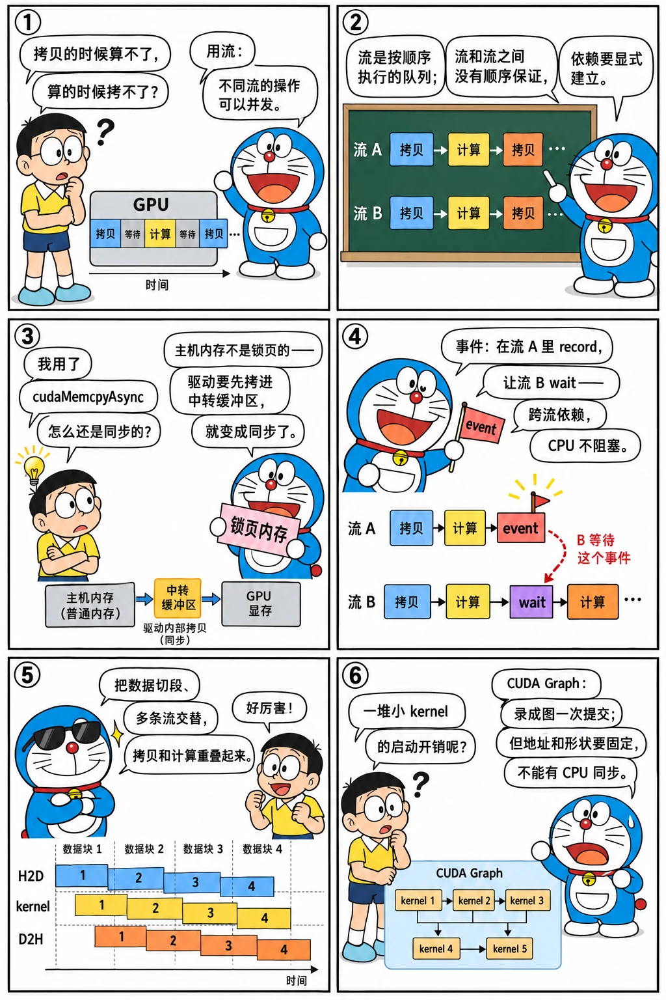

# 流、并发与 CUDA Graphs

<p class="lead">单个 kernel 优化到极致之后，下一个层面是系统级的并发：让数据拷贝和计算重叠、让多个小任务同时占满 GPU、消除 kernel 启动的开销。这一章讲 CUDA 流、事件、锁页内存、CUDA Graphs 和统一内存。它们是推理引擎和训练框架里随处可见的基础设施。</p>

!!! question "自测：能答上来就可以跳过本章"
    1. 什么是 CUDA 流？同一个流和不同流里的操作分别有什么执行顺序保证？
    2. `cudaMemcpyAsync` 在什么情况下并不是真正异步的？
    3. 怎么让流 B 等待流 A 中的某个 kernel 完成，而不阻塞 CPU？
    4. CUDA Graphs 解决什么问题？使用时有什么限制？
    5. 统一内存（`cudaMallocManaged`）为什么有时很慢？怎么缓解？

??? success "自测参考答案（先自己答，再展开对照）"
    1. 流是一个按顺序执行的操作队列。同一个流里的操作严格按提交顺序执行；不同流之间没有顺序保证，可以并发执行，需要依赖时要显式建立。
    2. 主机内存不是锁页内存（pageable）时，驱动要先把数据拷进一块锁页的中转缓冲区，调用实际上变成同步的。
    3. 在流 A 里 `cudaEventRecord(e, A)`，然后 `cudaStreamWaitEvent(B, e)`：流 B 里之后的操作会等这个事件完成，CPU 不阻塞。
    4. 消除大量小 kernel 的启动开销：把一串 kernel 录制成图，一次提交。限制：录制时的地址和形状是固定的，输入要拷进固定的缓冲区；不能包含需要 CPU 同步的操作；参数改变要重新录制或更新图。
    5. GPU 访问不在显存里的页时触发缺页，要按页从主机迁移过来，每次缺页的开销很大。用 `cudaMemPrefetchAsync` 提前迁移，用 `cudaMemAdvise` 给出访问提示。

先看一个六格小剧场，再读正文：

{.aig-comic}

## 流（stream）

**流是一个按顺序执行的操作队列**。同一个流里的操作（kernel、拷贝、事件记录）按提交顺序依次执行；**不同流里的操作之间没有顺序保证**，硬件条件允许时可以并发执行。

```cuda
cudaStream_t s1, s2;
cudaStreamCreate(&s1);
cudaStreamCreate(&s2);
kernelA<<<grid, block, 0, s1>>>(...);        // 第四个执行配置参数指定流
kernelB<<<grid, block, 0, s2>>>(...);        // 可能与 kernelA 并发
cudaMemcpyAsync(dst, src, bytes, cudaMemcpyDeviceToHost, s1);   // 在 s1 中排在 kernelA 之后
cudaStreamSynchronize(s1);                   // CPU 等待 s1 中的所有操作完成
```

不指定流时使用**默认流**。传统的默认流（legacy default stream）有一个特殊性质：它会和其他所有"阻塞型"流同步，即在默认流上的操作开始前，要等其他流之前提交的操作完成，反之亦然。这常常在不经意间破坏了并发。两种避免方法：

- 创建流时使用 `cudaStreamCreateWithFlags(&s, cudaStreamNonBlocking)`；
- 编译时加 `--default-stream per-thread`，让每个主机线程的默认流成为普通的流。

PyTorch 中每个设备有当前流的概念（`torch.cuda.current_stream()`、`torch.cuda.Stream()`），语义和这里完全一致。

## 事件：计时与跨流依赖

事件（event）是流中的一个标记点。除了[计时](../basics/first-kernel.md#kernel-启动是异步的)，它还用于建立流之间的依赖：

```cuda
cudaEvent_t done;
cudaEventCreateWithFlags(&done, cudaEventDisableTiming);   // 只用于同步时可以关闭计时，开销更小
producer<<<g, b, 0, s1>>>(buf);
cudaEventRecord(done, s1);
cudaStreamWaitEvent(s2, done);                             // s2 后续的操作要等 done 发生
consumer<<<g, b, 0, s2>>>(buf);                            // CPU 不会阻塞
```

这就是在 GPU 上表达"有向无环图"依赖的基本方式。

## 锁页内存与拷贝计算重叠

`cudaMemcpyAsync` 要做到真正的异步，**主机端内存必须是锁页内存（pinned memory）**。普通的 `malloc`/`new` 分配的是可分页内存，操作系统随时可能把它换出，DMA 引擎不能直接访问，驱动只能先同步地把数据拷贝到一块内部的锁页缓冲区。用 `cudaMallocHost`（或 `cudaHostAlloc`）分配锁页内存，或者用 `cudaHostRegister` 锁定已有的内存。锁页内存是有限的系统资源，不要无节制地分配。

有了锁页内存和多个流，就可以把一个大任务切成若干块，形成流水线：块 i 在做计算时，块 i+1 在做主机到设备的拷贝，块 i-1 在做设备到主机的拷贝。GPU 通常有独立的拷贝引擎，两个方向的拷贝和计算可以同时进行。

```cuda title="overlap.cu"
// overlap.cu —— 锁页内存 + 多流：把拷贝和计算重叠起来
// 编译：nvcc -O3 -arch=sm_75 overlap.cu -o overlap
#include "common.cuh"

__global__ void heavy(float* x, int n) {
  int i = blockIdx.x * blockDim.x + threadIdx.x;
  if (i < n) {
    float v = x[i];
    for (int k = 0; k < 64; ++k) v = v * 0.999f + 0.001f;   // 人为增加计算量，使计算与拷贝耗时相当
    x[i] = v;
  }
}

float ref_value(float v) {
  for (int k = 0; k < 64; ++k) v = v * 0.999f + 0.001f;
  return v;
}

int main() {
  const int n = 1 << 26, chunks = 8, chunk = n / chunks;
  const size_t bytes = static_cast<size_t>(n) * sizeof(float);
  float *h, *d;
  CUDA_CHECK(cudaMallocHost(&h, bytes));   // 锁页内存：异步拷贝的前提
  CUDA_CHECK(cudaMalloc(&d, bytes));
  auto init = [&] { for (int i = 0; i < n; ++i) h[i] = static_cast<float>(i % 100) / 100.f; };

  // 串行版本：整块拷入 → 计算 → 整块拷出
  init();
  GpuTimer t;
  t.start();
  CUDA_CHECK(cudaMemcpy(d, h, bytes, cudaMemcpyHostToDevice));
  heavy<<<(n + 255) / 256, 256>>>(d, n);
  CUDA_CHECK_LAST();
  CUDA_CHECK(cudaMemcpy(h, d, bytes, cudaMemcpyDeviceToHost));
  float serial_ms = t.stop();

  // 流水线版本：分块，每块在自己的流里依次执行拷入、计算、拷出
  init();
  std::vector<cudaStream_t> streams(4);
  for (auto& s : streams) CUDA_CHECK(cudaStreamCreateWithFlags(&s, cudaStreamNonBlocking));
  t.start();   // 在默认流上记录；计时范围内用 cudaDeviceSynchronize 保证覆盖所有流
  for (int c = 0; c < chunks; ++c) {
    cudaStream_t s = streams[c % streams.size()];
    const size_t off = static_cast<size_t>(c) * chunk;
    CUDA_CHECK(cudaMemcpyAsync(d + off, h + off, chunk * sizeof(float), cudaMemcpyHostToDevice, s));
    heavy<<<(chunk + 255) / 256, 256, 0, s>>>(d + off, chunk);
    CUDA_CHECK(cudaMemcpyAsync(h + off, d + off, chunk * sizeof(float), cudaMemcpyDeviceToHost, s));
  }
  CUDA_CHECK(cudaDeviceSynchronize());
  float pipelined_ms = t.stop();

  size_t bad = 0;
  for (int i = 0; i < n; ++i) bad += std::fabs(h[i] - ref_value(static_cast<float>(i % 100) / 100.f)) > 1e-5f;
  std::printf("%s (%zu mismatches)\nserial   : %.3f ms\npipelined: %.3f ms\n", bad ? "FAIL" : "PASS", bad,
              serial_ms, pipelined_ms);
  for (auto& s : streams) CUDA_CHECK(cudaStreamDestroy(s));
  CUDA_CHECK(cudaFreeHost(h));
  CUDA_CHECK(cudaFree(d));
  return bad ? 1 : 0;
}
```

用 Nsight Systems 查看这个程序，能清楚地看到拷贝和计算在时间线上交错重叠。理想情况下，流水线版本的耗时接近三者中最慢的那一项，而不是三者之和。

把分段数、流数和三段耗时拨一拨，看时间线怎么重叠：

<div class="aig-widget" data-widget="stream-overlap"></div>

## CUDA Graphs

每次 kernel 启动都有几微秒的 CPU 开销。对于由大量小 kernel 组成的工作负载（比如大模型的 decode 步骤，每步几百个 kernel、每个只运行十几微秒），启动开销和 CPU 端的调度会让 GPU 大量时间处于空闲。

**CUDA Graphs** 把一系列操作记录成一张图，之后每次只需一次调用就能提交整张图。驱动可以预先完成大部分准备工作，启动开销大幅降低。最方便的创建方式是**流捕获（stream capture）**：

```cuda
cudaStreamBeginCapture(stream, cudaStreamCaptureModeGlobal);
// ... 在 stream 上照常提交 kernel 和拷贝，它们不会执行，只会被记录 ...
cudaStreamEndCapture(stream, &graph);
cudaGraphInstantiate(&graph_exec, graph, 0);   // 实例化，开销较大，只做一次
for (int step = 0; step < steps; ++step)
  cudaGraphLaunch(graph_exec, stream);         // 每次重放：一次调用提交整张图
```

```cuda title="cuda_graph.cu"
// cuda_graph.cu —— 用流捕获把大量小 kernel 录成 CUDA Graph，对比逐个启动的开销
// 编译：nvcc -O3 -arch=sm_75 cuda_graph.cu -o cuda_graph
#include "common.cuh"

__global__ void add_one(float* x, int n) {
  int i = blockIdx.x * blockDim.x + threadIdx.x;
  if (i < n) x[i] += 1.f;
}

int main() {
  const int n = 4096, kernels_per_step = 200, steps = 20;
  float* d;
  CUDA_CHECK(cudaMalloc(&d, n * sizeof(float)));
  CUDA_CHECK(cudaMemset(d, 0, n * sizeof(float)));
  cudaStream_t s;
  CUDA_CHECK(cudaStreamCreateWithFlags(&s, cudaStreamNonBlocking));

  // 1) 逐个启动
  GpuTimer t;
  t.start(s);
  for (int step = 0; step < steps; ++step)
    for (int k = 0; k < kernels_per_step; ++k) add_one<<<(n + 255) / 256, 256, 0, s>>>(d, n);
  float eager_ms = t.stop(s);
  CUDA_CHECK_LAST();

  // 2) 捕获一个 step 的 200 个 kernel，之后每个 step 只启动一次图
  cudaGraph_t graph;
  cudaGraphExec_t exec;
  CUDA_CHECK(cudaStreamBeginCapture(s, cudaStreamCaptureModeGlobal));
  for (int k = 0; k < kernels_per_step; ++k) add_one<<<(n + 255) / 256, 256, 0, s>>>(d, n);
  CUDA_CHECK(cudaStreamEndCapture(s, &graph));
  CUDA_CHECK(cudaGraphInstantiate(&exec, graph, 0));
  t.start(s);
  for (int step = 0; step < steps; ++step) CUDA_CHECK(cudaGraphLaunch(exec, s));
  float graph_ms = t.stop(s);

  std::vector<float> h(n);
  CUDA_CHECK(cudaMemcpy(h.data(), d, n * sizeof(float), cudaMemcpyDeviceToHost));
  const float expect = 2.f * steps * kernels_per_step;   // 两种方式各执行了 steps * kernels_per_step 次加一
  size_t bad = 0;
  for (float v : h) bad += v != expect;
  std::printf("%s (value %.0f, expected %.0f)\neager: %.3f ms\ngraph: %.3f ms\n", bad ? "FAIL" : "PASS", h[0],
              expect, eager_ms, graph_ms);
  CUDA_CHECK(cudaGraphExecDestroy(exec));
  CUDA_CHECK(cudaGraphDestroy(graph));
  CUDA_CHECK(cudaStreamDestroy(s));
  CUDA_CHECK(cudaFree(d));
  return bad ? 1 : 0;
}
```

**限制**：图记录的是固定的操作序列、固定的 kernel 参数和**固定的内存地址**。所以：

- 输入输出要放在固定的缓冲区里，每次重放前把新数据拷进这些缓冲区；
- 形状变化时需要不同的图。vLLM、SGLang 会为若干个常用的 batch 大小（比如 1、2、4、8……256）分别捕获 decode 图，运行时把实际 batch 向上补齐到最近的一个；
- 捕获期间不能有同步操作（比如 `cudaMemcpy` 同步拷贝、`cudaDeviceSynchronize`），也不能在 CPU 上根据 GPU 的结果做分支；
- 参数小幅变化时，可以用 `cudaGraphExecUpdate` 或 `cudaGraphExecKernelNodeSetParams` 更新已实例化的图，避免重新实例化。

PyTorch 通过 `torch.cuda.CUDAGraph` 和 `torch.cuda.graph()` 提供了同样的功能，`torch.compile(mode="reduce-overhead")` 也会自动使用 CUDA Graphs。

!!! tip "Hopper 上的 PDL"
    Hopper 支持 **Programmatic Dependent Launch**：后一个 kernel 可以在前一个 kernel 结束之前就开始执行它的"前奏"部分（比如加载不依赖前一个 kernel 结果的权重），在需要依赖数据的位置调用 `cudaGridDependencySynchronize()` 等待。它进一步压缩了相邻 kernel 之间的空隙，推理引擎中已经大量使用。机制、写法、坑和推理引擎里的用法见 [kernel 之间的空隙：PDL 与 megakernel](pdl-megakernel.md)。

## 统一内存

`cudaMallocManaged` 分配的内存在 CPU 和 GPU 上使用**同一个指针**，数据在两端之间按需迁移：访问不在本地的页时触发缺页，由驱动把页迁移过来。写原型代码很方便，但有两个性能问题：

- **缺页开销很大**：GPU 上第一次访问时，成千上万个线程触发的缺页会被逐页处理，比一次性的大块拷贝慢得多；
- **来回迁移**：CPU 和 GPU 交替访问同一块数据时，页会被反复搬来搬去。

缓解办法是**预取**：在 kernel 启动前调用 `cudaMemPrefetchAsync` 把数据一次性迁移到 GPU，用 `cudaMemAdvise` 给出访问模式的提示。注意 CUDA 13 修改了这两个函数的签名（目标位置改用 `cudaMemLocation` 结构体表示），同时支持 12.x 和 13.x 的代码需要按版本区分：

```cuda title="managed_prefetch.cu"
// managed_prefetch.cu —— 统一内存 + 预取；演示如何同时兼容 CUDA 12 与 CUDA 13 的 API
// 编译：nvcc -O3 -arch=sm_75 managed_prefetch.cu -o managed_prefetch
#include "common.cuh"

__global__ void square(float* x, int n) {
  int i = blockIdx.x * blockDim.x + threadIdx.x;
  if (i < n) x[i] = x[i] * x[i];
}

void prefetch(const void* p, size_t bytes, int device, cudaStream_t s) {
#if CUDART_VERSION >= 13000
  cudaMemLocation loc{};
  loc.type = device == cudaCpuDeviceId ? cudaMemLocationTypeHost : cudaMemLocationTypeDevice;
  loc.id = device == cudaCpuDeviceId ? 0 : device;
  CUDA_CHECK(cudaMemPrefetchAsync(p, bytes, loc, 0, s));
#else
  CUDA_CHECK(cudaMemPrefetchAsync(p, bytes, device, s));
#endif
}

int main() {
  const int n = 1 << 24;
  const size_t bytes = static_cast<size_t>(n) * sizeof(float);
  float* x;
  CUDA_CHECK(cudaMallocManaged(&x, bytes));
  for (int i = 0; i < n; ++i) x[i] = static_cast<float>(i % 1000) * 0.01f;   // 在 CPU 上直接写

  int dev = 0, concurrent = 0;
  CUDA_CHECK(cudaGetDevice(&dev));
  CUDA_CHECK(cudaDeviceGetAttribute(&concurrent, cudaDevAttrConcurrentManagedAccess, dev));
  if (concurrent) prefetch(x, bytes, dev, 0);   // 一次性迁移到 GPU，避免 kernel 里大量缺页

  square<<<(n + 255) / 256, 256>>>(x, n);
  CUDA_CHECK_LAST();
  if (concurrent) prefetch(x, bytes, cudaCpuDeviceId, 0);   // 迁移回 CPU
  CUDA_CHECK(cudaDeviceSynchronize());                       // 访问前必须同步

  size_t bad = 0;
  for (int i = 0; i < n; ++i) {
    float v = static_cast<float>(i % 1000) * 0.01f;
    bad += std::fabs(x[i] - v * v) > 1e-4f;
  }
  std::printf("%s (%zu mismatches)\n", bad ? "FAIL" : "PASS", bad);
  CUDA_CHECK(cudaFree(x));
  return bad ? 1 : 0;
}
```

统一内存在 Grace Hopper（GH200）这类 CPU 与 GPU 通过 NVLink-C2C 高速互联、共享地址空间的系统上表现更好。在普通的 PCIe 服务器上，性能关键的代码仍然建议显式管理内存。

!!! interview "面试怎么答"
    流与 CUDA Graph 题：同一个流里顺序执行，不同流之间可以并发，注意传统默认流的隐式同步；跨流依赖用 event（`cudaStreamWaitEvent`），不阻塞 CPU；`cudaMemcpyAsync` 只有在锁页内存上才真正异步，分块 + 多流让拷贝和计算重叠。CUDA Graph 把一串 kernel 录下来一次提交，消除 decode 里几百个小 kernel 的启动开销，代价是地址和形状固定，推理引擎按 batch 大小的档位分别捕获。统一内存方便但缺页昂贵，要预取。

## 练习

**1. 流水线的块数。** 在 `overlap.cu` 中，把 `chunks` 从 2 改到 64，耗时会如何变化？为什么不是块越多越好？

??? success "参考答案"
    块太少时，流水线的"填充"和"排空"阶段（第一块只有拷入、最后一块只有拷出）占比高，重叠不充分；块增多后重叠变好，耗时下降。但块太多时，每次拷贝和 kernel 都很小：每次操作都有固定开销（启动、DMA 设置），小拷贝的带宽也更低，kernel 太小填不满 GPU，耗时又会上升。通常几个到十几个块就足够了，具体要实测。

**2. 用事件表达依赖。** 有三个 kernel：A 和 B 互不依赖，C 需要 A 和 B 都完成。用两个流和事件实现，要求 A、B 可以并发，CPU 全程不阻塞。

??? success "参考答案"
    ```cuda
    cudaEvent_t evB;
    cudaEventCreateWithFlags(&evB, cudaEventDisableTiming);
    A<<<g, b, 0, s1>>>(...);
    B<<<g, b, 0, s2>>>(...);
    cudaEventRecord(evB, s2);
    cudaStreamWaitEvent(s1, evB);   // s1 在 A 之后再等待 B
    C<<<g, b, 0, s1>>>(...);        // 同一流中排在 A 之后，并且等待了 B
    ```

    这段代码如果放在流捕获里，得到的图就是 A、B 并行，然后汇合到 C 的菱形结构。

## 小结

- [x] 同一流内顺序执行，不同流之间可以并发；注意传统默认流的隐式同步。
- [x] 事件用于计时和跨流依赖（`cudaStreamWaitEvent`），不会阻塞 CPU。
- [x] 异步拷贝需要锁页内存；分块 + 多流让拷贝与计算重叠。
- [x] CUDA Graphs 消除大量小 kernel 的启动开销；地址和形状固定，推理引擎按 batch 大小分别捕获。
- [x] 统一内存方便但缺页昂贵，用预取和访问提示缓解；CUDA 13 改了预取 API 的签名。
