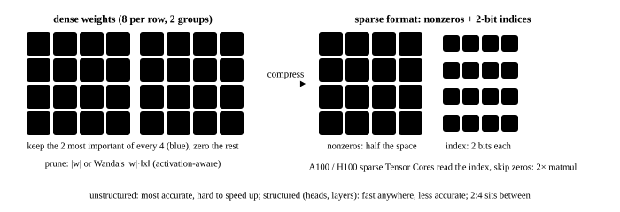

# Pruning, 2:4 sparsity and distillation

<p class="lead">The <a href="../quantization/">quantization</a> chapter covered "representing each weight with fewer bits". The other two roads to compressing a model are <b>pruning</b>, removing some of the weights outright, and <b>distillation</b>, having a small model learn a large model's outputs. This chapter uses two small experiments to show that in pruning, "which to prune" matters more than "how much" (pruning by weight magnitude vs. Wanda, which also considers the input activations), and what 2:4 semi-structured sparsity saves on hardware; then it looks at why distillation lets a small model approach a large one with very little labeled data, and how it relates to reasoning models.</p>

!!! question "Self-test: if you can answer these, skip this chapter"
    1. What is the difference between unstructured, semi-structured (2:4) and structured pruning? Which can be accelerated directly on a GPU?
    2. Why can't pruning of large models look only at weight magnitude? What is Wanda's pruning criterion?
    3. How much does 2:4 sparsity save in storage and in compute?
    4. What information do the "soft labels" of knowledge distillation carry beyond hard labels? What does the temperature do?
    5. How were the "distilled" small models of DeepSeek-R1 trained?

??? success "Answers (try first, then expand to compare)"
    1. Unstructured: weights at any position are zeroed; 2:4 semi-structured: keep 2 of every 4; structured: delete whole rows, heads or layers. Structured pruning yields smaller dense matrices and 2:4 has sparse Tensor Core support, so these two can be accelerated directly on a GPU; unstructured is hard to accelerate.
    2. The input activations differ greatly in scale, and a small weight multiplied by a large activation can contribute more than a large weight. Wanda uses "the weight's absolute value × the L2 norm of the matching input channel's activations" as importance, compared within each output row.
    3. Storage: half the values plus 2 bits of position metadata per value, about 56% of dense; compute: the sparse Tensor Cores' peak is twice the dense peak.
    4. Soft labels carry "which classes this sample resembles, and how much", far richer than one-hot; the higher the temperature, the flatter the distribution and the more visible this secondary information, and the loss is usually multiplied by $T^2$ to keep the gradient's magnitude.
    5. Sequence-level distillation: DeepSeek-R1 generated many answers with long reasoning processes, which were used to SFT base models of Qwen and Llama; the small models learned long-chain reasoning this way, with no further RL.

<!-- comic ../assets/comics/sparsity-distill.webp is in Chinese; put it back once the English version exists -->

## Which weights to prune {#剪哪些权重}

Pruning falls into three kinds by granularity:

- **Unstructured**: weights at any position can be zeroed. The least accuracy loss, but the sparse positions are irregular, so ordinary GPU kernels cannot speed it up (unless sparsity is extremely high);
- **Semi-structured (2:4)**: keep exactly 2 of every 4 consecutive weights. NVIDIA's sparse Tensor Cores, from Ampere on, support this format natively;
- **Structured**: remove whole rows, columns, attention heads or even layers. The model simply gets smaller and any hardware speeds up, but the accuracy loss is the largest, and it usually needs retraining or distillation.

{.aig-svg}

Which weights to prune? The most direct idea is to prune those with the smallest absolute values. But large models' activations have a few **outlier channels** (values tens of times larger than other channels; see the [quantization](quantization.md) chapter), and even small weights that multiply these channels contribute a lot to the output. **Wanda** (Pruning by Weights and activations) uses $|W_{ij}| \cdot \|X_j\|$ as importance: the weight's magnitude times the activation norm of the matching input channel (measured on a little calibration data), with no retraining at all. Compare them on a linear layer with outlier input channels:

```python
import torch

torch.manual_seed(0)
N, D_IN, D_OUT = 512, 1024, 1024
X = torch.randn(N, D_IN)
X[:, torch.randperm(D_IN)[:16]] *= 20                  # a few input channels have very large activations (the outlier channels common in LLMs)
W = torch.randn(D_IN, D_OUT) / D_IN**0.5
ref = X @ W


def prune(score, pattern):
    keep = torch.zeros_like(W, dtype=torch.bool)
    if pattern == "非结构化 50%":
        keep.view(-1)[score.flatten().topk(W.numel() // 2).indices] = True
    else:                                                  # 2:4: along the input dim, keep the 2 highest-scoring of every 4 consecutive weights
        g = score.T.reshape(D_OUT, -1, 4)
        top = g.topk(2, dim=-1).indices
        keep = torch.zeros_like(g, dtype=torch.bool).scatter_(-1, top, True).reshape(D_OUT, D_IN).T
    return W * keep


for pattern in ("非结构化 50%", "2:4 半结构化"):
    for name, score in (("按权重大小", W.abs()), ("Wanda（权重 × 输入激活范数）", W.abs() * X.norm(dim=0)[:, None])):
        err = ((X @ prune(score, pattern) - ref).norm() / ref.norm()).item()
        print(f"{pattern}，{name}：输出相对误差 {err:.3f}")
bits = 0.5 * 16 + 0.5 * 2                                  # 2:4: store half the values (bf16) + 2 bits of position per value
print(f"2:4 的存储：每个权重平均 {bits:.0f} 比特（稠密 bf16 是 16 比特），decode 读权重减少到 {bits / 16:.0%}；稀疏 Tensor Core 算力翻倍")
```

```text title="输出"
非结构化 50%，按权重大小：输出相对误差 0.266
非结构化 50%，Wanda（权重 × 输入激活范数）：输出相对误差 0.101
2:4 半结构化，按权重大小：输出相对误差 0.361
2:4 半结构化，Wanda（权重 × 输入激活范数）：输出相对误差 0.138
2:4 的存储：每个权重平均 9 比特（稠密 bf16 是 16 比特），decode 读权重减少到 56%；稀疏 Tensor Core 算力翻倍
```

- Pruning the same half, Wanda, which considers the activations, brings the output error down to about 40% of magnitude pruning: **which to prune matters more than how much**;
- The 2:4 constraint (2 of every 4 must be kept, not chosen freely) loses some more accuracy than unstructured pruning;
- **SparseGPT** goes further: after pruning some weights, it uses second-order information (the same idea as [GPTQ](math://calculus/)) to adjust the remaining weights to compensate the error, which is more accurate but more expensive to compute.

**What 2:4 saves on hardware.** Storage: only half the values plus 2 bits of position per value, about 56% of dense, cutting decode's weight-read time accordingly; compute: the sparse Tensor Cores skip the zero half, doubling the peak of matrix multiplication. The price is accuracy: 50% sparsity is a sizable injury for a large model and usually needs a stretch of retraining to recover, while INT8 / FP8 quantization, which saves the same half of the bandwidth, is nearly lossless. That is why quantization is far more common than pruning in inference serving; pruning is used more as part of "structured pruning + distillation" to **make a smaller model**.

## Distillation: a small model learning a large model's outputs {#蒸馏让小模型学大模型的输出}

**Knowledge distillation** has a student model fit the teacher model's output distribution, not just the true labels. The teacher's **soft labels** (softmax with temperature $T$) contain "which classes this sample is similar to": for a picture of a cat, the teacher gives "dog" much higher probability than "car", which is far richer than a one-hot "cat". The higher the temperature, the flatter the distribution and the more visible this secondary information; the loss is usually the KL divergence on the soft labels (multiplied by $T^2$ to keep the gradient's magnitude) plus the cross-entropy on the hard labels.

A more practical point: the teacher can soft-label **unlabeled data**. In the experiment below, the student has only 300 labeled samples, plus 5000 unlabeled samples soft-labeled by the teacher:

```python
import torch
import torch.nn.functional as F

torch.manual_seed(0)
torch.set_num_threads(4)
C, D = 10, 32
centers = torch.randn(C, 4, D) * 2                         # each class is made of 4 clusters, so the decision boundary is fairly complex


def sample(n, g):
    y = torch.randint(0, C, (n,), generator=g)
    k = torch.randint(0, 4, (n,), generator=g)
    return centers[y, k] + torch.randn(n, D, generator=g) * 1.5, y


g = torch.Generator().manual_seed(1)
x_big, y_big = sample(8000, g)                             # the teacher trains on plenty of data
x_small, y_small = sample(300, g)                          # the student has only 300 labeled samples
x_test, y_test = sample(5000, g)
x_unlab, _ = sample(5000, g)                               # plus 5000 unlabeled samples the teacher can soft-label


def mlp(h):
    return torch.nn.Sequential(torch.nn.Linear(D, h), torch.nn.ReLU(), torch.nn.Linear(h, h), torch.nn.ReLU(), torch.nn.Linear(h, C))


def fit(model, x, loss_fn, steps=1500):
    opt = torch.optim.Adam(model.parameters(), lr=3e-3)
    for _ in range(steps):
        opt.zero_grad()
        loss_fn(model(x)).backward()
        opt.step()
    return model


def acc(model):
    with torch.no_grad():
        return (model(x_test).argmax(-1) == y_test).float().mean().item()


teacher = fit(mlp(128), x_big, lambda out: F.cross_entropy(out, y_big), steps=800)
torch.manual_seed(2)
hard = fit(mlp(32), x_small, lambda out: F.cross_entropy(out, y_small))
T = 4.0
x_kd = torch.cat([x_small, x_unlab])
with torch.no_grad():
    soft = F.softmax(teacher(x_kd) / T, -1)                # the teacher's soft labels: they carry "which classes it resembles"
torch.manual_seed(2)
kd = fit(mlp(32), x_kd, lambda out: F.kl_div(F.log_softmax(out / T, -1), soft, reduction="batchmean") * T * T
         + F.cross_entropy(out[:len(x_small)], y_small))
print(f"老师（128 宽，8000 个样本）：测试准确率 {acc(teacher):.1%}")
print(f"学生（32 宽）只用 300 个硬标签：{acc(hard):.1%}")
print(f"学生（32 宽）+ 蒸馏（老师在 5300 个样本上的软标签，温度 {T:.0f}）：{acc(kd):.1%}")
```

```text title="输出"
老师（128 宽，8000 个样本）：测试准确率 99.8%
学生（32 宽）只用 300 个硬标签：89.9%
学生（32 宽）+ 蒸馏（老师在 5300 个样本上的软标签，温度 4）：99.6%
```

The same small network gets under 90% accuracy with only a few labels; after distillation it almost catches up with the teacher. Part of the gain comes from the soft labels themselves and part from the teacher turning lots of unlabeled data into a training signal; for large models, the latter often matters more.

**Ways it is used with large models:**

- **Logit distillation**: the student fits the teacher's output distribution at every position on the same input (the two need the same vocabulary), commonly used for small models during pretraining;
- **Sequence-level distillation**: supervised fine-tuning (SFT) on text **generated** by the teacher. DeepSeek-R1's "distilled" small models were made this way: fine-tuning base models of Qwen and Llama on lots of reasoning traces generated by R1, from which the small models learned long-chain reasoning;
- **Pruning + distillation**: first prune the large model structurally (removing some layers, heads, FFN channels), then distill with the original model as teacher to recover accuracy, getting a smaller model with far less compute than training from scratch (NVIDIA's Minitron series);
- **On-policy distillation**: the student generates text itself, the teacher gives a distribution at each position of the student's text, and the student fits it, which fixes the problem that "the student has only seen the teacher's text, never its own mistakes".

For inference systems, the point of distillation is that the same quality can be served by a smaller model, cutting cost and latency in proportion; draft models for speculative decoding, and draft heads like EAGLE, are essentially distillations of the target model too.

!!! inference "Inference view"
    The trade-offs among the three compression approaches: **quantization** is nearly lossless, needs no training and is supported on all kinds of hardware, so it is the first choice for inference serving; **2:4 sparsity** gains in storage and compute on supported hardware, but loses noticeable accuracy and needs retraining; **distillation** produces a new, smaller model, with the largest gains but also the highest cost (it needs training and evaluation). In practice they are often combined: distill a small model, then quantize it for deployment.

!!! interview "In an interview"
    Compare the three: quantization is nearly lossless, needs no training and is widely supported by hardware, so it is the first choice for inference serving; 2:4 sparsity on sparse Tensor Cores takes about 56% of dense storage and doubles compute, but loses noticeable accuracy and needs retraining; unstructured pruning is hard to accelerate on GPUs. Which to prune matters more than how much (Wanda uses "weight × input activation norm"). Distillation yields a new small model, with the largest gains and the highest cost: DeepSeek-R1's distilled versions were made by SFT on reasoning traces the teacher generated. In practice they are often combined: distill a small model first, then quantize it for deployment.

## Exercises {#练习}

**1. Why is unstructured pruning hard to accelerate on a GPU?**

??? success "Answer"
    GPU matrix multiplication relies on regular, contiguous data access and the fixed shapes of Tensor Cores. In unstructured sparsity the zeros sit anywhere, and skipping them means storing the position of every nonzero value (CSR and similar formats), making memory access irregular and leaving the Tensor Cores unusable; below 90%-plus sparsity, the extra indexing often costs more than the computation saved. By requiring "2 of every 4", 2:4 lets the hardware handle it with fixed 2-bit metadata and a dedicated data path.

**2. What happens if the distillation temperature $T$ is too high or too low?**

??? success "Answer"
    Too low (near 1) and the soft labels are nearly one-hot: the secondary classes have almost zero probability, the student cannot learn "which classes are similar", and it degenerates into using the teacher's predictions as hard labels. Too high and the distribution approaches uniform, so the useful information drowns in noise, and in fitting the flat high-temperature distribution the student may sacrifice confidence in the correct class. The common range is 2 to 8, together with a loss on the hard labels.

## Summary {#小结}

- [x] Pruning is unstructured, 2:4 semi-structured or structured; only the latter two can be accelerated directly on a GPU, and 2:4 is supported by the sparse Tensor Cores.
- [x] Which to prune matters more than how much: Wanda uses "weight × input activation norm", and with outlier channels its error is about 40% of magnitude pruning; SparseGPT also compensates with second-order information.
- [x] 2:4 takes about 56% of dense storage and doubles compute, but loses noticeable accuracy, so inference serving more often uses quantization; pruning is mostly combined with distillation to make smaller models.
- [x] Distillation has the student fit the teacher's soft labels and can also use unlabeled data; with large models it is used as logit distillation, sequence-level distillation (R1's distilled versions), pruning + distillation, and on-policy distillation.
