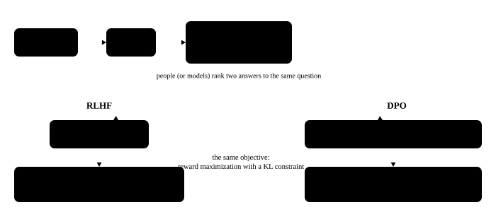

# Post-training: SFT, RLHF and reasoning models

<p class="lead">The "base model" that comes out of pretraining can only continue text. Turning it into an assistant that holds conversations, declines requests and reasons well is the job of post-training: supervised fine-tuning (SFT), preference-based alignment (RLHF, DPO), and, in the last two years, reasoning-model training with reinforcement learning on verifiable rewards. These processes shape what the model's output looks like, and they profoundly change the shape of inference workloads.</p>

!!! question "Self-test: if you can answer these, skip this chapter"
    1. How does the SFT loss differ from pretraining? Why compute the loss only on the answer?
    2. What is the RLHF pipeline? How is the reward model trained?
    3. What is the DPO loss? Why does it need neither a reward model nor PPO?
    4. How are reasoning models such as DeepSeek-R1 trained? How is the GRPO advantage computed?
    5. How do reasoning models affect inference serving? And LoRA?

??? success "Answers (try first, then expand to compare)"
    1. The loss is the same cross-entropy, but the data is in "instruction + answer" form and the loss is computed only on the answer (including the end token): the prompt is a given condition that the model need not learn to generate, and including it would teach the model the distribution of prompts.
    2. SFT → train a reward model → optimize the policy with PPO, with a KL penalty to keep it from drifting too far from the SFT model. The reward model is trained on human preference data of the form "two answers to the same prompt, which is better", with the Bradley-Terry loss $-\log \sigma(r_w - r_l)$.
    3. $L = -\log \sigma\big(\beta[\log \tfrac{\pi(y_w)}{\pi_{ref}(y_w)} - \log \tfrac{\pi(y_l)}{\pi_{ref}(y_l)}]\big)$. Reward maximization with a KL constraint has a closed-form solution in which the reward can be written as the ratio of the log-probabilities of the policy and the reference model; substituting it into the preference model gives a loss that needs only the policy itself, with no reward model and no RL sampling.
    4. Cold-start SFT → large-scale RL (verifiable rewards: is the answer right, is the format right; with GRPO) → rejection sampling to produce new SFT data → another round of RL covering all kinds of scenarios. GRPO samples a group of answers for the same question, and the advantage = (reward − group mean) ÷ group standard deviation, with no value model.
    5. Reasoning models make outputs very long, so the workload is dominated by decode, with heavy pressure on KV and tail latency; RL training itself relies on inference engines for batch sampling. LoRA trains only a low-rank update, which can be merged into the weights or kept separate so that one instance serves many adapters at once.

<!-- comic ../assets/comics/post-training.webp is in Chinese; put it back once the English version exists -->

## Base models and chat models {#基座模型与对话模型}

A base model is the direct product of pretraining: it continues text but does not follow instructions; ask it a question and it may go on to write a few similar questions. The "fill-in-the-blank" behavior seen in the [first chapter](../basics/language-model.md#看一眼真实模型的输出) is this tendency. A chat (instruct) model has been through post-training and has learned to play the assistant within the format of the [chat template](../basics/tokenization.md#特殊-token-与对话模板).

## SFT: supervised fine-tuning {#sft监督微调}

Continue training on high-quality "instruction → answer" data written by people or generated by models. The loss is still cross-entropy, with one key difference: **compute the loss only on the assistant's answer tokens**, setting the labels of the system prompt and user input to -100 (PyTorch's `cross_entropy` ignores them). The model should learn "how to answer", not "how to ask".

```python
import torch
from transformers import AutoTokenizer

tok = AutoTokenizer.from_pretrained("models/Qwen3-0.6B")
msgs = [{"role": "user", "content": "中国的首都是哪里？"},
        {"role": "assistant", "content": "中国的首都是北京。"}]
prompt = tok.apply_chat_template(msgs[:1], tokenize=False, add_generation_prompt=True, enable_thinking=False)
full = tok.apply_chat_template(msgs, tokenize=False)
assert full.startswith(prompt)                       # full conversation = prompt part + answer part

input_ids = tok(full).input_ids
n_prompt = len(tok(prompt).input_ids)
labels = [-100] * n_prompt + input_ids[n_prompt:]    # compute the loss on the answer part only
trained = tok.decode([t for t, l in zip(input_ids, labels) if l != -100])
print(repr(trained))
assert trained.startswith("中国的首都是北京。<|im_end|>")   # the end token is learned too, so the model knows when to stop
```

Note that `<|im_end|>` is part of what is learned: the model must learn to output the end token when its answer is over, or at inference time it will keep generating.

## RLHF: reinforcement learning from human feedback {#rlhf基于人类反馈的强化学习}

SFT teaches the model to imitate good answers, but "good" is hard to express fully with demonstrations. RLHF (InstructGPT, 2022) has people rank several of the model's answers, then optimizes the model with these preferences:

1. **Train a reward model**: given two answers to the same question (the human-preferred $y_w$ and the dispreferred $y_l$), make the reward model score $y_w$ higher. The loss (Bradley-Terry model): $\mathcal{L} = -\log \sigma\big(r(x, y_w) - r(x, y_l)\big)$;
2. **Reinforcement learning**: optimize the language model (the policy) with the PPO algorithm to maximize the reward model's score, with a KL penalty to keep it from drifting too far from the SFT model (otherwise it learns to "game" the reward model).

PPO has to maintain four models at once, the policy, the reference, the reward model and the value model, which is very complex to engineer.

{.aig-svg}

## DPO: direct preference optimization {#dpo直接偏好优化}

DPO (Rafailov et al., 2023) showed that reward maximization with a KL constraint has a closed-form solution in which the reward can be expressed directly as the ratio of the log-probabilities of the policy and the reference model. So there is no need for a separate reward model or reinforcement learning; train directly on preference data with a classification-style loss:

$$
\mathcal{L}_{\text{DPO}} = -\log \sigma\Big(\beta \big[(\log \pi_\theta(y_w|x) - \log \pi_{\text{ref}}(y_w|x)) - (\log \pi_\theta(y_l|x) - \log \pi_{\text{ref}}(y_l|x))\big]\Big)
$$

This loss is just a curve: the horizontal axis is the difference inside the brackets (the margin), and β decides how steep the curve is. Move β to see how the loss and gradient change:

<div class="aig-widget" data-widget="dpo-loss"></div>

Intuitively: relative to the reference model, raise the probability of good answers and lower that of bad ones. The core operation here is **computing the log-probability of an answer under the model**, which is also the basic operation of RL training. Compute it on a real model:

```python
from transformers import AutoModelForCausalLM

model = AutoModelForCausalLM.from_pretrained("models/Qwen3-0.6B", dtype=torch.float32).eval()

@torch.no_grad()
def response_logprob(model, prompt_ids, response_ids):
    """回答部分每个 token 的对数概率之和：log π(y | x)"""
    ids = torch.tensor([prompt_ids + response_ids])
    logp = model(ids).logits[0, :-1].log_softmax(-1)
    targets = ids[0, 1:]
    token_logp = logp.gather(1, targets[:, None]).squeeze(1)
    return token_logp[len(prompt_ids) - 1:].sum().item()     # keep the answer part only

prompt_ids = tok(prompt).input_ids
good = response_logprob(model, prompt_ids, tok("中国的首都是北京。").input_ids)
bad = response_logprob(model, prompt_ids, tok("中国的首都是上海。").input_ids)
print(f"log π(北京) = {good:.2f}，log π(上海) = {bad:.2f}")
assert good > bad

def dpo_loss(pi_w, pi_l, ref_w, ref_l, beta=0.1):
    return -torch.nn.functional.logsigmoid(beta * ((pi_w - ref_w) - (pi_l - ref_l)))

# the loss is smaller when the policy prefers the good answer more than the reference does
t = torch.tensor
assert dpo_loss(t(-5.0), t(-9.0), t(-6.0), t(-8.0)) < dpo_loss(t(-6.0), t(-8.0), t(-6.0), t(-8.0))
```

## Reasoning models: reinforcement learning with verifiable rewards {#推理模型用可验证的奖励做强化学习}

"Reasoning models" such as OpenAI o1 and DeepSeek-R1 generate a long thinking process before answering (DeepSeek-R1 wraps it in `<think>...</think>`), and accuracy improves with the length of the thinking. DeepSeek-R1's key practices:

**Verifiable rewards (RLVR)**: on tasks such as math and code, where answers can be checked automatically, the reward is simply "is the answer right" (plus a format reward), with no reward model to train.

**GRPO**: sample a group of answers (16, say) for the same question and normalize by the mean and standard deviation of the rewards within the group to get each answer's advantage, removing PPO's value model:

```python
rewards = torch.tensor([1.0, 0.0, 0.0, 1.0, 1.0, 0.0, 0.0, 0.0])   # 8 sampled answers, 1 point if correct
adv = (rewards - rewards.mean()) / (rewards.std() + 1e-6)
print([round(a, 2) for a in adv.tolist()])
assert adv[rewards == 1].min() > 0 > adv[rewards == 0].max()        # correct answers are encouraged, wrong ones suppressed
```

The correct answers (within this group) get positive advantages and their tokens' probabilities are raised; the wrong ones are lowered. As training goes on, the model spontaneously learns to think longer and more carefully, including checking and backtracking.

**Distillation**: SFT a small model on the thinking processes generated by a large reasoning model, and the small model gains decent reasoning ability too (DeepSeek-R1 released a series of small models distilled from Qwen and LLaMA).

!!! inference "Inference view"
    - **Reasoning models turn the workload into "long outputs"**: one answer can carry thousands to tens of thousands of tokens of thinking, the decode phase dominates, and the KV cache keeps growing with the output. Decode speed (TPOT), KV cache management for long sequences and speculative decoding all become much more important;
    - **RL training itself relies heavily on inference engines**: methods like GRPO sample several answers (rollouts) for many questions at every step, and this often takes most of the RL training time. RL frameworks such as verl and OpenRLHF use vLLM or SGLang as the sampling engine and must synchronize weights efficiently between the training and inference engines;
    - **The chat template must match**: the template used in post-training (including the format of the thinking tags) is exactly the format inference must use.

## LoRA: low-rank fine-tuning {#lora低秩微调}

Full fine-tuning has to keep gradients and optimizer states for every parameter ([about 16 bytes per parameter](pretraining.md#训练的显存)). **LoRA** freezes the original weights $W$ and trains only a low-rank update:

$$
W' = W + \frac{\alpha}{r} BA,\qquad A \in \mathbb{R}^{r \times d_{in}},\ B \in \mathbb{R}^{d_{out} \times r},\ r \ll d
$$

$B$ is initialized to 0, so $W' = W$ when training starts. After training, $BA$ can be merged into $W$, with no extra inference cost at all; or it can be kept separate:

```python
torch.manual_seed(0)
d_in, d_out, r, alpha = 896, 896, 8, 16
W = torch.randn(d_out, d_in)
A = torch.randn(r, d_in) * 0.01
B = torch.randn(d_out, r) * 0.01                     # after training B is no longer 0
x = torch.randn(5, d_in)

y_separate = x @ W.T + (alpha / r) * (x @ A.T) @ B.T  # unmerged: the original matmul + two small matmuls
W_merged = W + (alpha / r) * B @ A
y_merged = x @ W_merged.T                             # merged: the same compute as the original model
assert torch.allclose(y_separate, y_merged, atol=1e-4)
print(f"LoRA 参数 {A.numel() + B.numel():,}，原矩阵 {W.numel():,}（{(A.numel() + B.numel()) / W.numel():.1%}）")
```

Change the model, the rank and the target modules to see how the trainable parameters and training memory change:

<div class="aig-widget" data-widget="lora-params"></div>

!!! inference "Inference view"
    Keeping LoRA separate has an important use: **one base model serving many LoRA adapters at once**. Different requests in the same batch use different LoRAs; the base part is computed together and the LoRA parts with dedicated grouped kernels (the idea behind Punica and S-LoRA). Both vLLM and SGLang support multi-LoRA serving, so a single GPU can host dozens or hundreds of "custom models" at the same time.

!!! interview "How to explain it"
    The impact of post-training on inference is a common follow-up: SFT computes the loss only on the answer; RLHF = reward model + PPO + KL constraint, while DPO trains directly on preference pairs using log-probability ratios; reasoning models are trained with verifiable rewards and GRPO (group-normalized rewards as advantages) and think at great length. The impact on inference systems: the workload is dominated by long outputs, with decode taking most of the time; RL training itself depends on inference engines for rollouts; LoRA can be merged into the weights or kept separate to support multi-LoRA serving.

## Exercises {#练习}

**1. Label masking.** What happens if you forget to set the labels of the user input to -100 during SFT?

??? success "Answer"
    The model also learns to "generate the user's question". On one hand that wastes training signal and dilutes learning on the answers; on the other, the model may keep "playing the user" after its answer and generate the next question, because it has learned the distribution of the whole conversation. For multi-turn data, also make sure every assistant turn contributes to the loss while every user turn is masked.

**2. Compute.** Add an r = 16 LoRA to each of the seven projections q, k, v, o, gate, up and down in every layer of Qwen2.5-7B (d = 3584, 28 layers). How many trainable parameters is that? (The k and v projections output 512 dimensions; gate and up output 18944.)

??? success "Answer"
    Each LoRA has r × (d_in + d_out) parameters.

    ```python
    r, d, dff, dkv, L = 16, 3584, 18944, 512, 28
    shapes = [(d, d), (d, dkv), (d, dkv), (d, d), (d, dff), (d, dff), (dff, d)]   # (d_in, d_out)
    per_layer = sum(r * (i + o) for i, o in shapes)
    print(f"{per_layer * L / 1e6:.1f}M")   # about 40.4M, only 0.5% of the total parameters
    ```

## Summary {#小结}

- [x] SFT trains with cross-entropy but computes the loss only on the answer (including the end token).
- [x] RLHF = reward model + PPO + KL constraint; DPO trains directly on preference data using log-probability ratios.
- [x] Reasoning models are trained with verifiable rewards and GRPO, using group-normalized rewards as advantages, and produce long thinking processes.
- [x] Reasoning models make long outputs the dominant workload; RL training itself relies on inference engines for sampling.
- [x] LoRA trains a low-rank update that can be merged into the weights or kept separate to support multi-LoRA serving.
