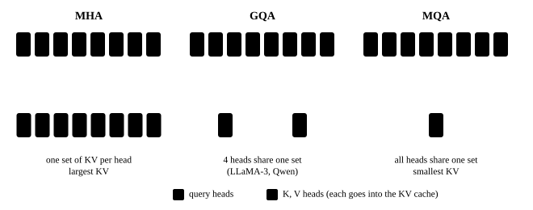
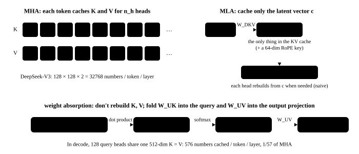

# Attention variants: MQA, GQA, MLA

<p class="lead">Standard multi-head attention (MHA) has too large a KV cache: with long contexts and high concurrency it does not fit in memory, and reading it at every decode step is too slow. Almost every change to the attention structure in recent years (MQA, GQA, MLA, sliding windows, sparse attention) has aimed to shrink the KV cache. This chapter explains how each one works, how much it saves, and how it affects inference kernels and parallelism.</p>

!!! question "Self-test: if you can answer these, skip this chapter"
    1. How large is the KV cache per token? How is it computed under MHA, GQA and MQA?
    2. Why does a GQA inference kernel not need to actually copy the KV heads?
    3. What does MLA cache? What does "weight absorption" mean?
    4. Why does MLA split RoPE off on its own?
    5. What do you do when there are fewer KV heads than tensor-parallel GPUs?

??? success "Answers (try first, then expand to compare)"
    1. 2 × layers × KV heads × head dimension × bytes. Under MHA the number of KV heads equals the number of query heads, under GQA it is the number of groups, and under MQA it is 1.
    2. The query heads of a group read the same KV head; the kernel finds it with `kv_head = q_head // group size` and reads it once for the whole group, without copying it in memory.
    3. Each token's low-dimensional latent vector (512 dimensions in DeepSeek-V3) plus a 64-dimensional RoPE key shared by all heads. Weight absorption: fold K's up-projection into the query and V's up-projection into the output projection, so attention is computed directly in the latent space without expanding the cache.
    4. RoPE's rotation matrix depends on position and sits between K's up-projection and the latent vector, so the up-projection can no longer be folded into the query ahead of time. Putting the position information into a few separate dimensions, shared by all heads, lets the rest be absorbed.
    5. The KV heads cannot be split further, so they are replicated: each KV head is placed on several GPUs, and each GPU still handles only its own query heads; the price is that the KV projections and the KV cache are duplicated. For models such as MLA, whose KV exists as a single copy, use DP attention instead.

<!-- comic ../assets/comics/attention-variants.webp is in Chinese; put it back once the English version exists -->

## How big is the KV cache {#kv-cache-有多大}

The [KV cache](../inference/kv-cache.md) stores every layer's K and V for every past token. Each token takes:

$$
\text{KV bytes} = 2 \times L \times n_{kv} \times d_h \times \text{bytes per element}
$$

Compare a few models (BF16):

```python
def kv_bytes_per_token(layers, n_kv, head_dim, bytes_per_elem=2):
    return 2 * layers * n_kv * head_dim * bytes_per_elem

models = {
    "LLaMA-2-7B（MHA，32 个 KV 头）": kv_bytes_per_token(32, 32, 128),
    "LLaMA-3-8B（GQA，8 个 KV 头）": kv_bytes_per_token(32, 8, 128),
    "Qwen2.5-7B（GQA，4 个 KV 头）": kv_bytes_per_token(28, 4, 128),
    "Qwen3-0.6B（GQA，8 个 KV 头）": kv_bytes_per_token(28, 8, 128),
    "DeepSeek-V3（MLA，缓存 512+64 维）": 61 * (512 + 64) * 2,
}
for name, b in models.items():
    print(f"{name:34s} {b / 1024:7.1f} KB/token   32K 上下文: {b * 32768 / 2**30:6.2f} GB")
assert models["LLaMA-2-7B（MHA，32 个 KV 头）"] == 4 * models["LLaMA-3-8B（GQA，8 个 KV 头）"] == 512 * 1024
```

DeepSeek-V3, with 671B parameters, needs only about 69 KB of KV cache per token, far less than the 7B LLaMA-2. That is the power of architecture design. Conversely, Qwen3-0.6B with only 0.6B parameters needs 112 KB per token, about the same as the 8B LLaMA-3: the size of the KV is decided by the number of layers, the number of KV heads and the head dimension, and has no direct relation to the parameter count.

## MQA and GQA {#mqa-与-gqa}

- **MHA**: each query head has its own K and V heads, $n_{kv} = n_h$;
- **MQA** (Multi-Query Attention, Shazeer 2019): all query heads share **one** set of K and V, $n_{kv} = 1$, shrinking the KV cache $n_h$-fold but costing some model quality;
- **GQA** (Grouped-Query Attention, Ainslie et al. 2023): the compromise; the query heads are divided into $n_{kv}$ groups, and each group shares one set of K and V. It started with LLaMA-2-70B and is now practically standard (LLaMA-3 uses 8 groups, Qwen2.5-7B 4).

{.aig-svg}

The GQA paper also proposed a way to convert an existing MHA model to GQA: average the K and V projection weights of the heads within each group, then continue training on a small amount of data (uptraining).

### Kernels do not need to copy the KV heads {#kernel-不需要复制-kv-头}

[mini_llm.py](build-llm.md) uses `repeat_interleave` to copy each KV head to its query heads, which is intuitive but wasteful. A better way is to arrange the query heads by group, so a group of query heads computes against the same KV head together:

```python
import math
import torch

torch.manual_seed(0)
B, T, n_h, n_kv, d = 2, 9, 12, 3, 16
rep = n_h // n_kv
q = torch.randn(B, n_h, T, d)
k = torch.randn(B, n_kv, T, d)
v = torch.randn(B, n_kv, T, d)
mask = torch.ones(T, T, dtype=torch.bool).tril()

def attend(q, k, v):
    s = (q @ k.transpose(-2, -1) / math.sqrt(d)).masked_fill(~mask, float("-inf"))
    return s.softmax(-1) @ v

# version 1: copy the KV heads into n_h copies
out1 = attend(q, k.repeat_interleave(rep, 1), v.repeat_interleave(rep, 1))

# version 2: no copy. Treat a group's rep query heads as "more query rows" and do one matmul with their shared KV head
qg = q.view(B, n_kv, rep, T, d).reshape(B, n_kv, rep * T, d)      # [B, n_kv, rep*T, d]
s = qg @ k.transpose(-2, -1) / math.sqrt(d)                        # [B, n_kv, rep*T, T]
s = s.view(B, n_kv, rep, T, T).masked_fill(~mask, float("-inf"))
out2 = (s.softmax(-1).view(B, n_kv, rep * T, T) @ v).view(B, n_h, T, d)

assert torch.allclose(out1, out2, atol=1e-5)
```

In version 2, K and V are each read once and serve all the query heads in a group. This matters especially in decode: once a KV head's data is read from memory, it is reused by `rep` queries, raising the arithmetic intensity `rep`-fold, and decode attention is exactly a memory bottleneck. The decode kernels of FlashInfer and FlashAttention organize their computation this way.

## MLA: multi-head latent attention {#mla多头潜在注意力}

**MLA (Multi-head Latent Attention)**, used by DeepSeek-V2/V3, goes further: it does not cache K and V themselves, but a **low-dimensional latent vector**.

**Compression and reconstruction**: each token's hidden state $h$ is first compressed into a $d_c$-dimensional latent vector ($d_c = 512$ in DeepSeek-V3):

$$
c = h W_{DKV} \in \mathbb{R}^{d_c}
$$

When needed, each head's K and V are reconstructed from $c$: $k^{(i)} = c\, W_{UK}^{(i)}$ and $v^{(i)} = c\, W_{UV}^{(i)}$. The KV cache only needs to store $c$, not the K and V of $n_h$ heads (DeepSeek-V3 has 128 heads of 128 dimensions each).

**Weight absorption**: at inference time, K and V need not even be reconstructed. The attention score

$$
q^{(i)\top} k^{(i)}_j = q^{(i)\top} W_{UK}^{(i)\top} c_j = \big(W_{UK}^{(i)} q^{(i)}\big)^\top c_j
$$

lets you first project the query into the latent space ($\tilde q^{(i)} = W_{UK}^{(i)} q^{(i)}$; this matrix multiplication can be merged with $W_Q$) and then **take dot products directly with the cached latent vectors**. The output side works the same way: $\sum_j p_j v_j^{(i)} = \big(\sum_j p_j c_j\big) W_{UV}^{(i)}$, so the weighted sum is taken in the latent space and $W_{UV}$ can be merged into the output projection. Decode attention thus becomes "128 query heads sharing one 512-dimensional K (which is also V)", effectively an MQA with a very large dimension.

{.aig-svg}

**Decoupled RoPE**: RoPE inserts a position-dependent rotation matrix between q and k; in $q^\top R_m^\top R_n W_{UK} c$ the rotation stands in the middle, and $W_{UK}$ can no longer be absorbed into the query. MLA's solution is to move the position information into a small separate set of dimensions: each head's query and key get an extra $d_R = 64$ dimensions used only for RoPE, and the key's RoPE part is shared by all heads and cached separately. So DeepSeek-V3 caches 512 + 64 = 576 numbers per token per layer.

A small example checks that "absorption" is equivalent (ignoring the RoPE part for now):

```python
torch.manual_seed(0)
T, d_model, d_c, n_h, d_h = 7, 64, 16, 4, 8
h = torch.randn(T, d_model)
W_q = torch.randn(d_model, n_h * d_h) / 8
W_dkv = torch.randn(d_model, d_c) / 8                   # compress: hidden -> latent
W_uk = torch.randn(n_h, d_c, d_h) / 4                   # per head: latent -> k
W_uv = torch.randn(n_h, d_c, d_h) / 4                   # per head: latent -> v
causal = torch.ones(T, T, dtype=torch.bool).tril()

c = h @ W_dkv                                           # [T, d_c]: the KV cache stores only this
q = (h @ W_q).view(T, n_h, d_h).transpose(0, 1)         # [n_h, T, d_h]

# naive: reconstruct each head's K, V from the latent
k = torch.einsum("tc,hcd->htd", c, W_uk)                # [n_h, T, d_h]
v = torch.einsum("tc,hcd->htd", c, W_uv)
p = (q @ k.transpose(-2, -1) / math.sqrt(d_h)).masked_fill(~causal, float("-inf")).softmax(-1)
out_naive = p @ v                                       # [n_h, T, d_h]

# absorbed: project the query into latent space and attend to c directly; multiply by W_uv at the end
q_lat = torch.einsum("htd,hcd->htc", q, W_uk)           # [n_h, T, d_c]
p2 = (q_lat @ c.T / math.sqrt(d_h)).masked_fill(~causal, float("-inf")).softmax(-1)
out_absorbed = torch.einsum("hts,sc,hcd->htd", p2, c, W_uv)

assert torch.allclose(out_naive, out_absorbed, atol=1e-5)
print("每个 token 缓存:", "MHA", 2 * n_h * d_h, "个数，MLA", d_c, "个数")
```

!!! inference "Inference view"
    MLA changes quite a lot in the design of inference systems:

    - **Decode leans toward compute**: 128 query heads share one latent vector, so far more computation is done per byte of KV read, and decode attention is no longer purely memory bound. DeepSeek's open-source **FlashMLA** is a decode kernel for exactly this shape;
    - **Prefill and decode compute differently**: with many tokens in prefill, it pays to reconstruct K and V and run ordinary attention; decode uses the absorbed latent-space computation. Inference engines have to implement both paths;
    - **A tensor-parallel puzzle**: GQA's KV heads can be split across GPUs, but MLA's latent vector is one copy shared by all heads, so when TP splits the attention heads, every GPU must hold the complete latent KV cache, which duplicates the KV cache TP times. SGLang introduced **DP attention** for DeepSeek: attention switches to data parallelism (each GPU handles different requests and keeps its own KV), and the MoE part uses expert parallelism, avoiding the duplication.

## Other ways to shrink the KV cache {#其他缩小-kv-cache-的思路}

| Method | Idea | Examples |
| --- | --- | --- |
| Sliding-window attention | some layers (or all) look only at the most recent W tokens, so their KV cache has a fixed size | Mistral; Gemma 2/3 and gpt-oss alternate local and global layers |
| Cross-layer KV sharing | several adjacent layers share one copy of KV | some research models |
| Sparse attention | each query looks only at a few selected tokens (the selection itself must be cheap enough) | DeepSeek Sparse Attention in DeepSeek-V3.2 |
| Hybrids with linear attention / state-space models | most layers use linear attention or an SSM with a fixed-size state, and a few keep full attention | hybrid architectures such as Jamba, MiniMax-01 and Qwen3-Next |
| KV cache quantization | store K and V in FP8 or INT8/INT4 | both vLLM and SGLang support an FP8 KV cache |

!!! inference "Inference view"
    **The KV cache size nearly determines how many requests an inference service can handle at once**: memory minus weights, divided by "the average KV size per request", is the concurrency limit; and since every decode step reads the KV of all requests, it also determines decode speed. So when you see a new model, the first thing to do is compute its KV cache size per token. Also, when a model has fewer KV heads than tensor-parallel GPUs (say, 8 GPUs running a model with only 4 KV heads), the KV heads cannot be divided evenly, so the inference engine replicates KV heads across GPUs and the total KV cache footprint grows.

!!! interview "In an interview"
    Answer along "how big is the KV → how to shrink it → the impact on the engine": KV per token = 2 × layers × KV heads × head dimension × bytes; MQA shares one set of KV across all heads and GQA shares by group, with kernels computing per group without copying KV; MLA caches a 512-dimensional latent vector plus a 64-dimensional RoPE key and computes in the latent space via weight absorption, and RoPE must be decoupled to make absorption possible; beyond these there are sliding windows, sparse attention, linear-attention hybrids and KV quantization. On deployment: with fewer KV heads than tensor-parallel GPUs, KV must be replicated; MLA models often use DP attention.

## Exercises {#练习}

**1. Estimating concurrency.** One 80 GB GPU serves LLaMA-3-8B (about 16 GB of BF16 weights), with 4 GB reserved for activations and other overhead. If the average context per request is 4096 tokens, how many requests can it serve at most? What about LLaMA-2-7B (MHA, about 13.5 GB of weights)?

??? success "Answer"
    ```python
    gb = 2**30
    kv_llama3 = 2 * 32 * 8 * 128 * 2            # 128 KB/token
    kv_llama2 = 2 * 32 * 32 * 128 * 2           # 512 KB/token
    free3 = (80 - 16 - 4) * gb
    free2 = (80 - 13.5 - 4) * gb
    print(int(free3 // (kv_llama3 * 4096)), int(free2 // (kv_llama2 * 4096)))   # 120 and 31
    ```

    About 120 for LLaMA-3-8B, but only about 31 for LLaMA-2-7B. GQA raises the same GPU's concurrency about 4-fold, and also cuts the KV read at each decode step by 4.

**2. Food for thought.** MQA saves the most KV, so why do most mainstream models choose GQA?

??? success "Answer"
    MQA has all heads share one set of K and V, which noticeably reduces expressiveness and affects both model quality and training stability; GQA with about 8 groups comes close to MHA in quality while already shrinking the KV cache many times over, the best trade-off. Also, MQA has only one KV head, which every GPU must replicate under tensor parallelism, whereas GQA's 8 KV heads divide evenly across 8 GPUs. MLA keeps quality close to MHA with an even smaller cache through low-rank compression, at the cost of a more complex structure and inference implementation.

## Summary {#小结}

- [x] KV cache per token = 2 × layers × KV heads × head dimension × bytes; it determines the concurrency limit and decode speed.
- [x] MQA shares one set of KV across all heads and GQA shares by group; kernels organize the computation per group without copying KV heads.
- [x] MLA caches a low-dimensional latent vector and computes attention directly in the latent space via weight absorption; RoPE is decoupled into a few separate dimensions.
- [x] Sliding windows, sparse attention, hybrid architectures and KV quantization are other ways to shrink the KV cache.
- [x] With fewer KV heads than TP GPUs, KV is replicated; MLA models often use DP attention.
