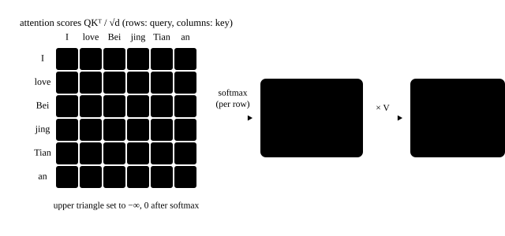
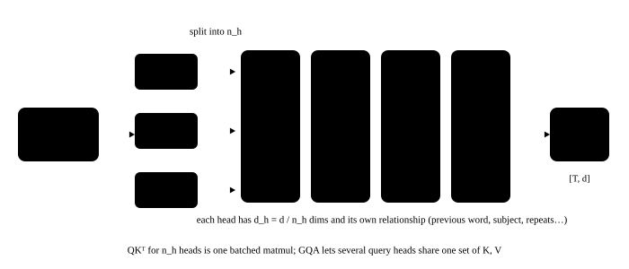

# Attention

<p class="lead">Attention is the only place in a Transformer where different tokens exchange information; every other operation is done for each token independently. Understand attention's computation, shapes and complexity, and you understand why long contexts are expensive, why the KV cache exists, and what FlashAttention and PagedAttention optimize.</p>

!!! question "Self-test: if you can answer these, skip this chapter"
    1. Write the formula for scaled dot-product attention. Where do Q, K and V come from?
    2. Why divide by $\sqrt{d_h}$?
    3. How is the causal mask implemented?
    4. Why is multi-head attention better than a single head? What does `o_proj` do after the heads?
    5. For a sequence of length T, how do attention's compute and memory grow with T?

??? success "Answers (try first, then expand to compare)"
    1. $\mathrm{Attention}(Q, K, V) = \mathrm{softmax}(QK^\top / \sqrt{d_h} + M)\,V$, where Q, K and V are the input x multiplied by three projection matrices.
    2. The variance of a dot product grows linearly with the dimension $d_h$; without scaling the scores are large, softmax tends to one-hot and the gradients approach 0. Dividing by $\sqrt{d_h}$ brings the variance back to about 1.
    3. Before the softmax, add $-\infty$ at positions with $j > i$ (an upper-triangular mask), so their weights become 0. With a KV cache, the new tokens' positions start at the history length, so the diagonal shifts right by the history length.
    4. One head can express only one kind of "relevance"; multiple heads let different heads attend to different relationships (the previous token, syntax, repeated content and so on). After the heads' outputs are concatenated, `o_proj` mixes them back into the hidden dimension.
    5. Compute is about $O(T^2 d)$ and storing the score matrix is $O(T^2)$ (FlashAttention never materializes it, bringing memory down to $O(T)$); during decode every step reads the whole KV history, so time grows linearly with the context.

<!-- comic ../assets/comics/attention.webp is in Chinese; put it back once the English version exists -->

## Intuition: a differentiable "lookup" {#直觉可微分的查表}

Every token wants to get information from the other tokens. Attention has each position produce three vectors:

- **Query**: what I am looking for;
- **Key**: what I have (for others to match against);
- **Value**: what I give you if you pick me.

Position i takes the dot product of its query with the keys of all positions to get "relevance", turns it into weights with softmax, and uses the weights to sum the values of all positions. It is like a "soft" lookup: instead of fetching exactly one row, it mixes all the rows according to relevance.

Draw the keys as points on a plane and drag the query around to see what a "soft lookup" means:

<div class="aig-widget" data-widget="attention2d"></div>

## Scaled dot-product attention {#缩放点积注意力}

For an input $X \in \mathbb{R}^{T \times d}$, three linear layers first produce $Q = XW_Q$, $K = XW_K$ and $V = XW_V$, and then:

$$
\text{Attention}(Q, K, V) = \text{softmax}\left(\frac{QK^\top}{\sqrt{d_h}} + M\right) V
$$

- $QK^\top$ is the $T \times T$ score matrix, whose row i, column j is the relevance of position j to position i;
- Divide by $\sqrt{d_h}$: the scale of a dot product grows with the dimension (about $\sqrt{d_h}$; see [math basics](../basics/math-torch.md#点积与相似度)), and without scaling the softmax is too sharp and training is unstable;
- $M$ is the mask: masked positions get $-\infty$ added, so their weight after softmax is 0;
- Multiplying the result by V gives what each position "reads", with shape $T \times d_h$.

```python
import math
import torch
import torch.nn.functional as F

def attention(q, k, v, causal=True):
    """q, k, v: [B, H, T, D]"""
    T, S = q.shape[-2], k.shape[-2]
    scores = q @ k.transpose(-2, -1) / math.sqrt(q.shape[-1])      # [B, H, T, S]
    if causal:
        mask = torch.ones(T, S, dtype=torch.bool).tril(diagonal=S - T)
        scores = scores.masked_fill(~mask, float("-inf"))
    return scores.softmax(dim=-1) @ v                               # [B, H, T, D]

torch.manual_seed(0)
q, k, v = (torch.randn(2, 4, 10, 16) for _ in range(3))
ours = attention(q, k, v)
ref = F.scaled_dot_product_attention(q, k, v, is_causal=True)      # PyTorch's built-in implementation
assert torch.allclose(ours, ref, atol=1e-5)
```

## The causal mask {#因果掩码}

When a language model predicts the token after position i, it may only see the first i tokens and must not "peek" at the answers that follow. So the upper triangle of the score matrix is masked out:

{.aig-svg}

```pycon
>>> import torch
>>> T = 5
>>> mask = torch.ones(T, T, dtype=torch.bool).tril()
>>> mask.int()
tensor([[1, 0, 0, 0, 0],
        [1, 1, 0, 0, 0],
        [1, 1, 1, 0, 0],
        [1, 1, 1, 1, 0],
        [1, 1, 1, 1, 1]], dtype=torch.int32)
```

Row i can see only the first i+1 positions. Thanks to this mask, training can compute the predictions of all positions in parallel in one forward pass (each position's output depends only on what comes before it; see [language models](../basics/language-model.md#训练可以并行推理只能串行)).

The `tril(diagonal=S - T)` in the code above handles a case that is crucial at inference time: **fewer queries than keys**. With a KV cache, the T new tokens attend to S keys including the history, and the new tokens' absolute positions are S−T through S−1, so the diagonal shifts right by S−T:

```pycon
>>> T, S = 2, 5          # 2 new tokens plus 3 past tokens: 5 keys in all
>>> torch.ones(T, S, dtype=torch.bool).tril(diagonal=S - T).int()
tensor([[1, 1, 1, 1, 0],
        [1, 1, 1, 1, 1]], dtype=torch.int32)
```

During decode T = 1, and the new token can see all S keys: the mask is all ones, so no mask is actually needed.

The causal mask is only the most common one. Below you can switch between several masks used in real systems and count how many blocks can be skipped entirely. FlashAttention computes block by block (see [FlashAttention](cuda://advanced/attention/) in the CUDA book), so the shape of the mask directly determines the amount of computation:

<div class="aig-widget" data-widget="mask"></div>

## Multi-head attention {#多头注意力}

One attention "head" can express only one pattern of relevance. **Multi-head attention** splits the d dimensions into $n_h$ heads of $d_h$ dimensions each ($d = n_h \times d_h$). Each head computes attention independently and attends to different relationships (some heads attend to the previous token, some to the grammatical subject, some to repeated content); finally the heads' outputs are concatenated and mixed by an output projection $W_O$ (`o_proj`):

{.aig-svg}

```python
import torch.nn as nn

class MultiHeadAttention(nn.Module):
    def __init__(self, d, n_heads):
        super().__init__()
        self.nh, self.hd = n_heads, d // n_heads
        self.q_proj, self.k_proj, self.v_proj = (nn.Linear(d, d, bias=False) for _ in range(3))
        self.o_proj = nn.Linear(d, d, bias=False)

    def forward(self, x):                                            # x: [B, T, d]
        B, T, d = x.shape
        split = lambda t: t.view(B, T, self.nh, self.hd).transpose(1, 2)   # -> [B, nh, T, hd]
        q, k, v = split(self.q_proj(x)), split(self.k_proj(x)), split(self.v_proj(x))
        out = attention(q, k, v)                                    # [B, nh, T, hd]
        return self.o_proj(out.transpose(1, 2).reshape(B, T, d))    # concatenate the heads, then apply the output projection

mha = MultiHeadAttention(64, 4)
x = torch.randn(2, 10, 64)
assert mha(x).shape == (2, 10, 64)

# causality check: changing the last token must not change the outputs of earlier positions
x2 = x.clone()
x2[:, -1] += 1.0
assert torch.allclose(mha(x)[:, :-1], mha(x2)[:, :-1], atol=1e-6)
assert not torch.allclose(mha(x)[:, -1], mha(x2)[:, -1])
```

In real models K and V can have fewer heads than Q (GQA), a design that matters a great deal for inference optimization and gets its own chapter, [attention variants](attention-variants.md).

## Attention in a real model: attention sinks {#真实模型里的注意力注意力汇聚}

Look at Qwen3-0.6B's trained attention weights. A very common phenomenon: **a large share of attention concentrates on the first token**:

```pycon
>>> from transformers import AutoModelForCausalLM, AutoTokenizer
>>> path = "models/Qwen3-0.6B"
>>> tok = AutoTokenizer.from_pretrained(path)
>>> model = AutoModelForCausalLM.from_pretrained(path, dtype=torch.float32, attn_implementation="eager").eval()
>>> text = "推理优化的核心是减少访存。大模型在解码阶段每生成一个词，都要读取全部的权重和缓存。"
>>> ids = tok(text, return_tensors="pt").input_ids
>>> with torch.no_grad():
...     att = model(ids, output_attentions=True).attentions   # one [B, n_h, T, T] per layer
>>> T = ids.shape[1]
>>> T, len(att), tuple(att[0].shape)
(29, 28, (1, 16, 29, 29))
>>> for layer in [0, 2, 6, 13, 20, 27]:          # mean attention the second half of the queries give to position 0
...     print(layer, round(att[layer][0, :, T // 2:, 0].mean().item(), 3))
0 0.006
2 0.028
6 0.555
13 0.426
20 0.677
27 0.769
```

If attention were spread evenly, position 0 would get only about 5% of the weight on average; but from layer 6 on it gets 40% to 77%, more the deeper the layer. This phenomenon is called an **attention sink**: softmax requires the weights to sum to 1, so when a head "does not need" to read from any position, it piles the weight onto a fixed position (usually the first token), which amounts to "doing nothing".

!!! inference "Inference view"
    Attention sinks directly affect inference: long-context methods such as StreamingLLM found that if you drop the earliest KV cache to save memory (a sliding window), **you must keep the first few tokens**, or the model collapses. Some newer models (such as OpenAI's gpt-oss) add learnable "sink" parameters to attention to handle this explicitly, and inference kernels have to support them.

## Complexity: why attention is expensive {#复杂度注意力为什么贵}

For a sequence of length T and hidden dimension d:

| Part | Compute | Note |
| --- | --- | --- |
| The four projections Q, K, V, O | about $4 \times 2Td^2 = 8Td^2$ | linear in T (K and V are smaller under GQA) |
| $QK^\top$ | $2T^2 d$ | quadratic in T |
| Multiplying by V | $2T^2 d$ | quadratic in T |
| Storing the score matrix | $n_h \times T^2$ numbers | quadratic in T |

For small T the projections (linear layers) dominate; beyond a few thousand tokens the $T^2$ terms become significant. Worse is storing the score matrix: at T = 32768, each head alone has a billion entries. The whole point of **FlashAttention** is to avoid writing this $T \times T$ matrix to memory, using blocked computation and online softmax; see [FlashAttention](cuda://advanced/attention/) in the CUDA book.

!!! inference "Inference view"
    - **Attention is the only operation that depends on the "history"**: linear layers, normalization and activations are computed independently per token, so tokens from different requests can be stacked into one big matrix and computed together; attention, however, must have each request's queries attend only to **its own** K and V. That is why attention needs special handling under batching (each request's KV has a different length and lives in a different place), and it is where designs such as PagedAttention start;
    - **Attention behaves differently in prefill and decode**: in prefill, T queries attend to T keys, a compute-intensive matrix multiplication; in decode, 1 query attends to S keys, reading the whole KV cache while doing very little computation, which is memory bound; see [KV cache](../inference/kv-cache.md).

!!! interview "How to explain it"
    The basics of attention call for the inference angle: the formula is $\mathrm{softmax}(QK^\top/\sqrt{d_h} + M)\,V$, and dividing by $\sqrt{d_h}$ keeps dot products from growing with dimension and saturating the softmax; with a KV cache the causal mask's diagonal shifts right by the history length; multiple heads learn several relationships in parallel and `o_proj` mixes them. Cost: compute and storage grow with T squared (FlashAttention does not materialize the T×T matrix), and in decode attention is memory bound on reading KV; attention sinks mean that when "dropping early KV" you must keep the first few tokens.

## Exercises {#练习}

**1. Comparing compute.** For a single attention layer with d = 4096 and T = 4096 (ignoring GQA), compute the cost of the four projections and of the two matrix multiplications $QK^\top$ and $PV$. At what T does the latter start to exceed the former?

??? success "Answer"
    - Projections: $8Td^2 = 8 \times 4096 \times 4096^2 ≈ 5.5 \times 10^{11}$;
    - The two attention matrix multiplications: $4T^2d = 4 \times 4096^2 \times 4096 ≈ 2.7 \times 10^{11}$.

    Setting $4T^2d = 8Td^2$ gives $T = 2d = 8192$. So for a model of this size, attention's own compute exceeds the projections beyond about 8K tokens. Since a layer also has an FFN (on the order of $16Td^2$, depending on the intermediate dimension), attention only dominates at even longer sequences.

    ```python
    d, T = 4096, 4096
    assert 8 * T * d**2 == 549_755_813_888 and 4 * T**2 * d == 274_877_906_944
    ```

**2. Implementation.** Modify the `attention` function to take an extra parameter `window`: each query can see at most `window` tokens before it (sliding-window attention).

??? success "Answer"
    ```python
    import math
    import torch

    def sliding_window_attention(q, k, v, window):
        T, S = q.shape[-2], k.shape[-2]
        scores = q @ k.transpose(-2, -1) / math.sqrt(q.shape[-1])
        qpos = torch.arange(S - T, S)[:, None]         # absolute positions of the queries
        kpos = torch.arange(S)[None, :]
        allowed = (kpos <= qpos) & (kpos > qpos - window)
        return scores.masked_fill(~allowed, float("-inf")).softmax(-1) @ v

    q, k, v = (torch.randn(1, 2, 8, 4) for _ in range(3))
    out = sliding_window_attention(q, k, v, window=3)
    # with a large enough window it reduces to ordinary causal attention
    full = sliding_window_attention(q, k, v, window=100)
    ref = torch.nn.functional.scaled_dot_product_attention(q, k, v, is_causal=True)
    assert torch.allclose(full, ref, atol=1e-5) and out.shape == ref.shape
    ```

    Mistral, Gemma, gpt-oss and other models use sliding windows in some or all layers, and the KV cache of those layers only needs to keep the most recent window tokens.

## Summary {#小结}

- [x] Attention = softmax(QKᵀ/√d_h + mask)·V, the only way tokens exchange information.
- [x] The causal mask hides future positions; with a KV cache the mask's diagonal is offset by the history length.
- [x] Multi-head attention learns several relationships in parallel, and o_proj mixes them at the end.
- [x] Attention sinks are common in real models; when dropping early KV, keep the first tokens.
- [x] Attention's compute and storage grow with T squared; in decode, attention is memory bound on reading the KV cache.
