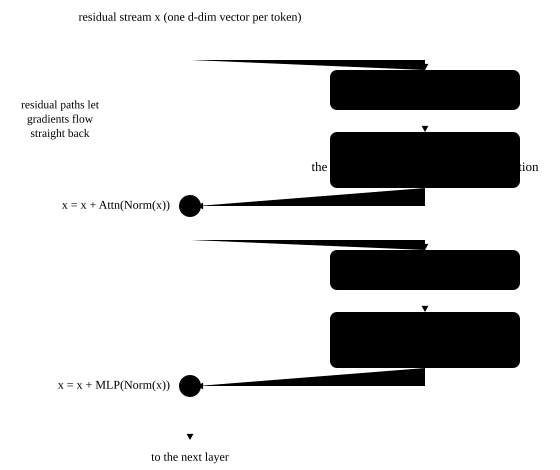

# Assembling a large model from scratch

<p class="lead">The previous chapters covered the embedding, attention, RoPE, RMSNorm and SwiGLU one at a time. This chapter puts them together into a <code>mini_llm.py</code> of about 200 lines, loads the real Qwen3-0.6B weights, and compares it item by item with the official Hugging Face transformers implementation: the logits match and the generated text is identical. Later chapters run their experiments on this code.</p>

!!! question "Self-test: if you can answer these, skip this chapter"
    1. What parts make up a decoder layer? How do the shapes change as data passes through it?
    2. When loading Hugging Face weights, how do the parameter names correspond?
    3. How do you verify that your model is "the same" as the official implementation? What do you compare?
    4. Why can greedy decoding with transformers' `generate` differ from "taking the argmax at every step"?
    5. What are the main differences between this code and the model implementations in vLLM?

??? success "Answers (try first, then expand to compare)"
    1. RMSNorm → attention (q / k / v projections, QK-Norm, RoPE, GQA attention, `o_proj`) → residual add → RMSNorm → SwiGLU FFN → residual add. Input and output are both `[B, T, d]`; in between, q is `[B, n_h, T, d_h]` and the FFN's intermediate dimension is `d_ff`.
    2. The modules' attribute names match Hugging Face (`q_proj`, `input_layernorm`, `mlp.gate_proj`, …), so the keys in the weight files line up one to one once the `model.` prefix is removed.
    3. On the same input, compare the maximum absolute difference of the logits (in fp32 it is far below the magnitude of the logits themselves; this chapter uses 1e-3 as the threshold), then check that the greedily generated token sequences are identical.
    4. `generate` reads the default parameters in `generation_config.json` (which may turn on sampling, repetition penalty and so on), so unless you explicitly turn them off it is not pure greedy decoding; it also computes differently from a hand-written loop, and floating-point error can flip near-tied tokens.
    5. vLLM fuses projections (merged QKV, merged gate / up) and elementwise operations, uses parallel linear layers that can be sharded, and has pluggable attention backends; its KV cache is paged, and one forward pass handles a variable-length batch of requests (flattened tokens plus batching metadata).

## Overall structure {#整体结构}

<!-- i18n:diagram 4a973f25b8 -->
```text
input_ids [B, T]
  │ embed_tokens                                  lookup
  ▼
x [B, T, d] ──────────────────────────────┐  residual stream
  │ × L layers                              │
  │   input_layernorm (RMSNorm)             │
  │   self_attn: q/k/v_proj → QK-Norm → RoPE → GQA attention → o_proj
  │   x = x + attn_out  ◄────────────────── ┤
  │   post_attention_layernorm (RMSNorm)    │
  │   mlp: down(silu(gate(x)) * up(x))      │
  │   x = x + mlp_out   ◄────────────────── ┘
  ▼
norm (RMSNorm) → lm_head → logits [B, T, V]
```

{.aig-svg}

For Qwen3-0.6B (d = 1024, 16 query heads, 8 KV heads, $d_h$ = 128, $d_{ff}$ = 3072, 28 layers), the shapes of the tensors in one layer:

| Step | Shape |
| --- | --- |
| Input | `[B, T, 1024]` |
| q_proj / k_proj / v_proj | `[B, T, 2048]` / `[B, T, 1024]` / `[B, T, 1024]` |
| Split into heads | q: `[B, 16, T, 128]`, k, v: `[B, 8, T, 128]` |
| QK-Norm, RoPE | unchanged |
| GQA: each K, V head copied twice | `[B, 16, T, 128]` |
| Attention scores | `[B, 16, T, T]` |
| Attention output, heads merged | `[B, T, 2048]` |
| o_proj | `[B, T, 1024]` |
| gate_proj, up_proj | `[B, T, 3072]` |
| down_proj | `[B, T, 1024]` |

Note that q_proj outputs 2048 dimensions, more than the hidden dimension: Qwen3 configures $d_h$ separately as 128, so heads × head dimension (16 × 128) no longer equals d. The code must therefore read the head dimension from `head_dim` in `config.json` rather than derive it as `hidden_size // num_attention_heads`. Another difference between Qwen3 and Qwen2 is **QK-Norm**: before RoPE, q and k each get an RMSNorm per head (with a weight of length $d_h$), which keeps the attention scores in a more stable range; Qwen3 also drops the biases of the q, k and v projections.

## The complete code {#完整代码}

The parameter names follow Hugging Face's naming (`q_proj`, `input_layernorm`, …), so loading the weights only requires removing a `model.` prefix.

```python title="mini_llm.py"
"""mini_llm.py —— 从零实现的 LLaMA / Qwen2 / Qwen3 结构的解码器模型（约 200 行），可以加载真实权重。

结构：Embedding → N × [RMSNorm → 注意力(GQA + QK-Norm + RoPE) → 残差 → RMSNorm → SwiGLU MLP → 残差] → RMSNorm → LM Head
"""

import json
import math
from dataclasses import dataclass
from pathlib import Path

import torch
import torch.nn as nn
import torch.nn.functional as F


@dataclass
class Config:
    vocab_size: int
    hidden_size: int
    intermediate_size: int
    num_hidden_layers: int
    num_attention_heads: int
    num_key_value_heads: int
    rms_norm_eps: float = 1e-6
    rope_theta: float = 10000.0
    attention_bias: bool = False          # Qwen2's q/k/v projections have biases; LLaMA and Qwen3 do not
    qk_norm: bool = False                 # Qwen3: q and k get a per-head RMSNorm before RoPE
    tie_word_embeddings: bool = False     # whether the output layer shares weights with the word embedding
    head_dim: int | None = None

    @property
    def hd(self) -> int:
        return self.head_dim or self.hidden_size // self.num_attention_heads

    @classmethod
    def from_json(cls, path: str | Path) -> "Config":
        c = json.loads(Path(path).read_text())
        return cls(
            vocab_size=c["vocab_size"], hidden_size=c["hidden_size"], intermediate_size=c["intermediate_size"],
            num_hidden_layers=c["num_hidden_layers"], num_attention_heads=c["num_attention_heads"],
            num_key_value_heads=c.get("num_key_value_heads", c["num_attention_heads"]),
            rms_norm_eps=c.get("rms_norm_eps", 1e-6), rope_theta=c.get("rope_theta", 10000.0),
            attention_bias=c.get("attention_bias", c.get("model_type") == "qwen2"), qk_norm=c.get("model_type") == "qwen3",
            tie_word_embeddings=c.get("tie_word_embeddings", False), head_dim=c.get("head_dim"),
        )


class RMSNorm(nn.Module):
    def __init__(self, dim: int, eps: float):
        super().__init__()
        self.eps = eps
        self.weight = nn.Parameter(torch.ones(dim))

    def forward(self, x):
        dtype = x.dtype
        x = x.float()                                              # statistics computed in FP32
        x = x * torch.rsqrt(x.pow(2).mean(-1, keepdim=True) + self.eps)
        return self.weight * x.to(dtype)


def rope_cos_sin(positions: torch.Tensor, head_dim: int, theta: float):
    """返回 [T, head_dim] 的 cos、sin 表。第 i 对维度的旋转频率为 theta^(-2i/d)。"""
    inv_freq = 1.0 / (theta ** (torch.arange(0, head_dim, 2, dtype=torch.float32) / head_dim))
    freqs = positions.float()[:, None] * inv_freq[None, :]        # [T, head_dim/2]
    emb = torch.cat([freqs, freqs], dim=-1)                       # [T, head_dim]
    return emb.cos(), emb.sin()


def rotate_half(x):
    x1, x2 = x.chunk(2, dim=-1)
    return torch.cat([-x2, x1], dim=-1)


def apply_rope(x, cos, sin):
    """x: [B, H, T, D]；把第 i 维和第 i + D/2 维看成一个二维向量，按位置旋转。"""
    return (x * cos + rotate_half(x) * sin).to(x.dtype)


class KVCache:
    """每层保存到目前为止所有 token 的 K、V：[B, n_kv_heads, S, head_dim]。"""

    def __init__(self, num_layers: int):
        self.k = [None] * num_layers
        self.v = [None] * num_layers

    def update(self, layer: int, k, v):
        if self.k[layer] is not None:
            k = torch.cat([self.k[layer], k], dim=2)
            v = torch.cat([self.v[layer], v], dim=2)
        self.k[layer], self.v[layer] = k, v
        return k, v

    @property
    def length(self) -> int:
        return 0 if self.k[0] is None else self.k[0].shape[2]


class Attention(nn.Module):
    def __init__(self, cfg: Config, layer: int):
        super().__init__()
        self.layer, self.nh, self.nkv, self.hd = layer, cfg.num_attention_heads, cfg.num_key_value_heads, cfg.hd
        self.q_proj = nn.Linear(cfg.hidden_size, self.nh * self.hd, bias=cfg.attention_bias)
        self.k_proj = nn.Linear(cfg.hidden_size, self.nkv * self.hd, bias=cfg.attention_bias)
        self.v_proj = nn.Linear(cfg.hidden_size, self.nkv * self.hd, bias=cfg.attention_bias)
        self.o_proj = nn.Linear(self.nh * self.hd, cfg.hidden_size, bias=False)
        # QK-Norm: RMSNorm on each head's q and k (weight size head_dim); models without QK-Norm get an identity, so callers need not check
        norm = (lambda: RMSNorm(self.hd, cfg.rms_norm_eps)) if cfg.qk_norm else nn.Identity
        self.q_norm, self.k_norm = norm(), norm()

    def forward(self, x, cos, sin, cache: KVCache | None = None):
        B, T, _ = x.shape
        q = self.q_proj(x).view(B, T, self.nh, self.hd).transpose(1, 2)    # [B, nh, T, hd]
        k = self.k_proj(x).view(B, T, self.nkv, self.hd).transpose(1, 2)   # [B, nkv, T, hd]
        v = self.v_proj(x).view(B, T, self.nkv, self.hd).transpose(1, 2)
        q, k = self.q_norm(q), self.k_norm(k)                               # before RoPE
        q, k = apply_rope(q, cos, sin), apply_rope(k, cos, sin)
        if cache is not None:
            k, v = cache.update(self.layer, k, v)                           # append the K, V of past tokens
        S = k.shape[2]
        rep = self.nh // self.nkv                                           # GQA: each KV head serves rep query heads
        k, v = k.repeat_interleave(rep, dim=1), v.repeat_interleave(rep, dim=1)
        scores = (q @ k.transpose(-2, -1)) / math.sqrt(self.hd)             # [B, nh, T, S]
        # new token i sits at absolute position S - T + i and can only see keys at or before it
        mask = torch.ones(T, S, dtype=torch.bool, device=x.device).tril(diagonal=S - T)
        scores = scores.masked_fill(~mask, float("-inf"))
        probs = scores.float().softmax(dim=-1).to(q.dtype)
        out = (probs @ v).transpose(1, 2).reshape(B, T, self.nh * self.hd)
        return self.o_proj(out)


class MLP(nn.Module):
    def __init__(self, cfg: Config):
        super().__init__()
        self.gate_proj = nn.Linear(cfg.hidden_size, cfg.intermediate_size, bias=False)
        self.up_proj = nn.Linear(cfg.hidden_size, cfg.intermediate_size, bias=False)
        self.down_proj = nn.Linear(cfg.intermediate_size, cfg.hidden_size, bias=False)

    def forward(self, x):
        return self.down_proj(F.silu(self.gate_proj(x)) * self.up_proj(x))   # SwiGLU


class DecoderLayer(nn.Module):
    def __init__(self, cfg: Config, layer: int):
        super().__init__()
        self.input_layernorm = RMSNorm(cfg.hidden_size, cfg.rms_norm_eps)
        self.self_attn = Attention(cfg, layer)
        self.post_attention_layernorm = RMSNorm(cfg.hidden_size, cfg.rms_norm_eps)
        self.mlp = MLP(cfg)

    def forward(self, x, cos, sin, cache=None):
        x = x + self.self_attn(self.input_layernorm(x), cos, sin, cache)   # residual connection
        x = x + self.mlp(self.post_attention_layernorm(x))
        return x


class Transformer(nn.Module):
    def __init__(self, cfg: Config):
        super().__init__()
        self.cfg = cfg
        self.embed_tokens = nn.Embedding(cfg.vocab_size, cfg.hidden_size)
        self.layers = nn.ModuleList(DecoderLayer(cfg, i) for i in range(cfg.num_hidden_layers))
        self.norm = RMSNorm(cfg.hidden_size, cfg.rms_norm_eps)
        self.lm_head = nn.Linear(cfg.hidden_size, cfg.vocab_size, bias=False)
        if cfg.tie_word_embeddings:
            self.lm_head.weight = self.embed_tokens.weight

    def forward(self, input_ids, cache: KVCache | None = None):
        """input_ids: [B, T] → logits: [B, T, vocab]。有 cache 时，只需传入新 token。"""
        start = cache.length if cache is not None else 0
        positions = torch.arange(start, start + input_ids.shape[1], device=input_ids.device)
        cos, sin = rope_cos_sin(positions, self.cfg.hd, self.cfg.rope_theta)
        x = self.embed_tokens(input_ids)
        cos, sin = cos.to(x.dtype), sin.to(x.dtype)
        for layer in self.layers:
            x = layer(x, cos, sin, cache)
        return self.lm_head(self.norm(x))

    @classmethod
    def from_pretrained(cls, path: str | Path, dtype=torch.float32) -> "Transformer":
        """加载 Hugging Face 格式（config.json + *.safetensors）的 LLaMA / Qwen2 / Qwen3 权重。"""
        from safetensors.torch import load_file

        path = Path(path)
        model = cls(Config.from_json(path / "config.json"))
        state = {}
        for f in sorted(path.glob("*.safetensors")):
            state.update(load_file(f))
        state = {k.removeprefix("model."): v for k, v in state.items()}   # HF layer names carry an extra "model." prefix
        if model.cfg.tie_word_embeddings:
            state.pop("lm_head.weight", None)
        missing, unexpected = model.load_state_dict(state, strict=False)
        missing = [m for m in missing if not (model.cfg.tie_word_embeddings and m == "lm_head.weight")]
        assert not missing and not unexpected, (missing, unexpected)
        return model.to(dtype).eval()


@torch.no_grad()
def generate(model: Transformer, input_ids, max_new_tokens: int, pick=lambda logits: logits.argmax(-1),
             eos_token_id: int | None = None):
    """自回归生成：prefill 一次处理整个提示词，之后每步只输入 1 个新 token（decode）。"""
    cache = KVCache(model.cfg.num_hidden_layers)
    logits = model(input_ids, cache)                  # prefill
    out = []
    for _ in range(max_new_tokens):
        next_id = pick(logits[:, -1, :])              # [B]
        out.append(next_id)
        if eos_token_id is not None and bool((next_id == eos_token_id).all()):
            break
        logits = model(next_id[:, None], cache)       # decode: compute only the new token
    return torch.stack(out, dim=1)
```

A few implementation details worth noting:

- **The attention mask** `tril(diagonal=S - T)` supports both "the whole input at once" (S = T, the ordinary causal mask) and "T new tokens with a cache" (the new tokens see the whole history); see [attention](attention.md#因果掩码);
- **Softmax is computed in FP32**, as in RMSNorm, which is key to matching the official implementation numerically;
- **GQA** uses `repeat_interleave` to copy the KV heads to their query heads, which is simple but wastes memory; real inference kernels do not copy; see [attention variants](attention-variants.md);
- **The KV cache** here is just a list of K and V per layer, appended with `torch.cat` at each step. The principle is in [KV cache](../inference/kv-cache.md); real systems replace this "concatenate every step" approach with preallocated paged memory.

## Check 1: against the official LLaMA implementation {#验证一和官方-llama-实现对比}

First check the structure with a randomly initialized mini LLaMA (LLaMA's attention projections have no biases, a different code path from Qwen2):

```python
import torch
from transformers import LlamaConfig, LlamaForCausalLM
from mini_llm import Config, Transformer

torch.manual_seed(0)
hf_cfg = LlamaConfig(vocab_size=1000, hidden_size=64, intermediate_size=172, num_hidden_layers=3,
                     num_attention_heads=8, num_key_value_heads=2, rope_theta=10000.0, tie_word_embeddings=False)
hf = LlamaForCausalLM(hf_cfg).eval()

cfg = Config(vocab_size=1000, hidden_size=64, intermediate_size=172, num_hidden_layers=3,
             num_attention_heads=8, num_key_value_heads=2, rope_theta=10000.0)
ours = Transformer(cfg).eval()
state = {k.removeprefix("model."): v for k, v in hf.state_dict().items()}
ours.load_state_dict(state)                      # the names match exactly, so strict loading succeeds

ids = torch.randint(0, 1000, (2, 17))
with torch.no_grad():
    diff = (ours(ids) - hf(ids).logits).abs().max().item()
print(f"LLaMA 结构，logits 最大差异: {diff:.2e}")
assert diff < 1e-5
```

## Check 2: loading the real Qwen3-0.6B {#验证二加载真实的-qwen3-06b}

```python
from transformers import AutoModelForCausalLM, AutoTokenizer
from mini_llm import generate

path = "models/Qwen3-0.6B"
tok = AutoTokenizer.from_pretrained(path)
ours = Transformer.from_pretrained(path)
hf = AutoModelForCausalLM.from_pretrained(path, dtype=torch.float32).eval()
print("参数量:", sum(p.numel() for p in ours.parameters()), sum(p.numel() for p in hf.parameters()))

msgs = [{"role": "user", "content": "用一句话解释什么是大语言模型。"}]
ids = tok(tok.apply_chat_template(msgs, tokenize=False, add_generation_prompt=True, enable_thinking=False), return_tensors="pt").input_ids
with torch.no_grad():
    a, b = ours(ids), hf(ids).logits
diff = (a - b).abs().max().item()
print(f"Qwen3-0.6B，{ids.shape[1]} 个 token，logits 最大差异 {diff:.1e}（logits 本身最大约 {b.abs().max().item():.0f}）")
assert diff < 1e-3
```

The logits differ on the order of 1e-5 to 1e-4, the normal error from a different order of floating-point operations (the official implementation calls PyTorch's fused attention operator, for example). The `enable_thinking=False` in the chat template makes Qwen3 skip "thinking" and answer directly (see [tokenization](../basics/tokenization.md#特殊-token-与对话模板)). Now compare the generated output:

```python
ours_out = generate(ours, ids, max_new_tokens=30, eos_token_id=tok.eos_token_id)
hf_out = hf.generate(ids, max_new_tokens=30, do_sample=False, repetition_penalty=1.0,
                     top_k=None, top_p=None, temperature=None)[:, ids.shape[1]:]
assert ours_out.tolist() == hf_out.tolist()      # all 30 tokens identical
print(tok.decode(ours_out[0], skip_special_tokens=True))
```

The 30 tokens the two generate are identical. Note that `hf.generate` is called with `do_sample=False` and other parameters set explicitly: Qwen3's `generation_config.json` defaults to `do_sample=True`, `temperature=0.6`, `top_p=0.95` and `top_k=20`, and unless these are turned off explicitly, `generate` samples with them, giving results different from "argmax at every step"; Qwen2.5's config also has a default `repetition_penalty=1.1` that applies even with `do_sample=False`, so `repetition_penalty=1.0` is passed here as well. **Whether an inference engine reads and applies the default sampling parameters in `generation_config.json` directly affects the output** when a model is deployed; it is a common trap when comparing the results of different inference frameworks. See [decoding and sampling](../inference/decoding.md).

## Parameters of each part {#各部分的参数量}

```python
counts = {"embed_tokens(与 lm_head 共享)": ours.embed_tokens.weight.numel()}
layer = ours.layers[0]
counts["每层 attention"] = sum(p.numel() for p in layer.self_attn.parameters())
counts["每层 mlp"] = sum(p.numel() for p in layer.mlp.parameters())
counts["每层 norm"] = sum(p.numel() for n, p in layer.named_parameters() if "layernorm" in n)
counts["最终 norm"] = ours.norm.weight.numel()
for k, v in counts.items():
    print(f"{k:28s} {v:>12,d}")
total = counts["embed_tokens(与 lm_head 共享)"] + 28 * (counts["每层 attention"] + counts["每层 mlp"] + counts["每层 norm"]) + counts["最终 norm"]
assert total == sum(p.numel() for p in ours.parameters()) == 596_049_920
```

!!! inference "Inference view"
    `mini_llm.py` has almost the same structure as the model files in vLLM and SGLang (vLLM's `vllm/model_executor/models/qwen2.py`, for example, or `qwen3.py` for Qwen3), so once you understand this code you can read theirs. The main differences:

    | mini_llm.py | Inference engine |
    | --- | --- |
    | three separate linear layers for q, k, v | merged into one `qkv_proj`, one GEMM; gate and up merged into `gate_up_proj` |
    | `nn.Linear` | `ColumnParallelLinear` / `RowParallelLinear` that support tensor-parallel sharding, plus quantized linear layers |
    | hand-written attention + `repeat_interleave` | calls attention backends such as FlashAttention / FlashInfer, which read the paged KV cache directly without copying KV heads |
    | KV cache appended with `torch.cat` | a preallocated pool of paged memory managed by the scheduler (PagedAttention) |
    | each request runs its own forward pass | the tokens of many requests form one batch (continuous batching), with attention computed per request |
    | operators run one by one | fused kernels for RMSNorm + residual, SiLU × mul, RoPE and more; CUDA Graphs for decode |

    This table is practically a table of contents for inference optimization.

!!! interview "How to explain it"
    "Write a model from scratch and match the official implementation" is a common open-ended exercise: a layer = RMSNorm → attention (projections, QK-Norm, RoPE, GQA, `o_proj`) → residual → RMSNorm → SwiGLU → residual; keep the parameter names the same as Hugging Face so loading only strips a prefix; verify with the maximum logits difference and identical greedy generation, and align the sampling parameters of `generation_config.json`. Then describe how vLLM's implementation differs: fusion (merged QKV, gate / up), parallel linear layers, pluggable attention backends, paged KV and batching metadata.

## Exercises {#练习}

**1. BF16 inference.** Load the model with `Transformer.from_pretrained(path, dtype=torch.bfloat16)`, and compare its logits with the FP32 version, and whether the first 30 greedily generated tokens agree.

??? success "Answer"
    ```python
    ours_bf16 = Transformer.from_pretrained(path, dtype=torch.bfloat16)
    with torch.no_grad():
        lb = ours_bf16(ids).float()
    print(f"BF16 vs FP32 logits 最大差异: {(lb - a).abs().max().item():.2f}")
    out_bf16 = generate(ours_bf16, ids, max_new_tokens=30, eos_token_id=tok.eos_token_id)
    n = min(out_bf16.shape[1], ours_out.shape[1])               # the two may hit the end token at different positions
    diff_at = (out_bf16[0, :n] != ours_out[0, :n]).nonzero()
    print("从第", diff_at[0].item() if len(diff_at) else n, "个 token 开始分叉；BF16：", tok.decode(out_bf16[0], skip_special_tokens=True))
    ```

    The BF16 logits usually differ from FP32 by 0.1 to 1, and greedy generation is often the same for a stretch at the start, then may diverge at some position "where two candidates have close probabilities" and go down a different path. This is normal: a different precision, different kernels or a different batch composition can all cause such divergence, so to check an inference framework's correctness you usually compare logits errors or accuracy on an evaluation set, not demand word-for-word identical text.

**2. Add a feature.** Give `Transformer.forward` a parameter `last_only=True` that computes the LM head for the last position only, and check that it matches the last position of the full computation.

??? success "Answer"
    Change `return self.lm_head(self.norm(x))` to:

    ```py
    if last_only:
        x = x[:, -1:, :]
    return self.lm_head(self.norm(x))
    ```

    RMSNorm is computed per token, so slicing before normalizing gives the same result as normalizing before slicing. When prefilling a long prompt, this saves nearly all of the LM head computation; see the inference view in [embedding and output layers](embedding.md#残差流).

## Summary {#小结}

- [x] A decoder layer = RMSNorm → attention (projections, RoPE, GQA, o_proj) → residual → RMSNorm → SwiGLU → residual.
- [x] Keep the parameter names the same as the official ones, so loading weights only strips a prefix; verify the implementation with logits differences and greedy generation.
- [x] When comparing generated output, watch the default sampling parameters in `generation_config.json`.
- [x] Inference engines' model implementations have the same structure; the differences are in fusion, parallelism, attention backends, KV cache management and batching.
