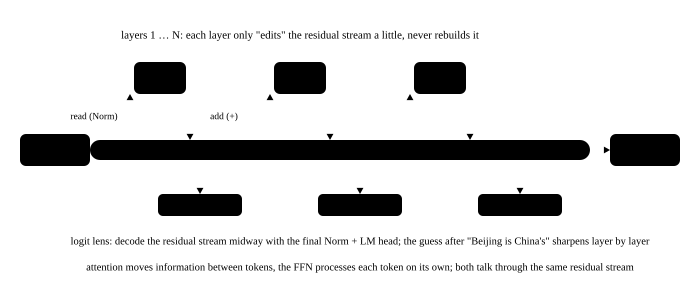

# Embedding and output layers

<p class="lead">The model's entrance turns token ids into vectors, and its exit turns vectors back into "scores for the next token". These two ends look simple, yet they hold a sizable share of a small model's parameters, and the vector that flows between them (the residual stream) is the key to understanding the whole Transformer. This chapter also uses the "logit lens" to peek at what the model's middle layers are "thinking".</p>

!!! question "Self-test: if you can answer these, skip this chapter"
    1. What operation does the embedding layer perform? How is it related to a linear layer?
    2. What are tied embeddings? Which models use them?
    3. How are the logits computed? Why does inference only need them at the last position?
    4. What share of Qwen3-0.6B's parameters is the embedding matrix? And in a 70B model?
    5. What is the logit lens? What does it show?
    6. How is the address of row i computed for a lookup? Why not actually do the one-hot multiplication?

??? success "Answers (try first, then expand to compare)"
    1. It takes the row of the `[V, d]` matrix indexed by the token id; this is equivalent to a one-hot vector times the matrix, that is, a linear layer without bias (but the lookup needs no actual multiplication).
    2. The output layer reuses the embedding matrix (transposed) to compute the logits, saving one $V \times d$ set of parameters. Small models often do this, for example Qwen3-0.6B and Gemma; large models usually do not.
    3. The logits are the dot products of the final hidden state with each token's output vector ($h\,E^\top$). Generation only needs the distribution of the next token, so inference computes them at the last position only; training needs the loss at every position.
    4. About 26% in Qwen3-0.6B; in LLaMA-3-70B the embedding and output layers together are only about 3%.
    5. Feed a middle layer's hidden state straight into the final normalization and output layer to see "what it would predict": the right answer often appears only in the last few layers, which shows the representation is built up layer by layer.
    6. The matrix is stored row after row, so row i starts at "base address + i × d × bytes per number"; a lookup computes this one address and reads d numbers. The one-hot multiplication costs 2Vd operations per token, almost all of them multiplications by 0. In the backward pass, gradients are added back by index to the rows that were used.

## The embedding layer: a lookup {#嵌入层查表}

The embedding layer is just a matrix $E$ of shape `[V, d]` whose row i is the vector of token i. Give it a token id and it returns the corresponding row:

```pycon
>>> import torch
>>> import torch.nn as nn
>>> torch.manual_seed(0)  # doctest: +ELLIPSIS
<torch._C.Generator object at 0x...>
>>> emb = nn.Embedding(10, 4)
>>> ids = torch.tensor([3, 7, 3])
>>> out = emb(ids)
>>> out.shape
torch.Size([3, 4])
>>> torch.equal(out[0], emb.weight[3]) and torch.equal(out[0], out[2])
True
>>> onehot = nn.functional.one_hot(ids, 10).float()       # equivalent: a one-hot vector times the embedding matrix
>>> torch.allclose(onehot @ emb.weight, out)
True
```

A **one-hot vector** is a vector of length V with a 1 at position i and 0 everywhere else ("only one bit is hot"). With a vocabulary of just 5 tokens, for example, the one-hot vector of token 2 is `[0, 0, 1, 0, 0]`. Multiplying it by $E$ gives the rows of $E$ weighted by the corresponding entries of the one-hot vector and summed; only row i has weight 1, so the result is exactly row i. That is the equivalence the last line of the code above checks.

Written this way, the math shows that the embedding layer is really a linear layer without bias. But no implementation actually multiplies: as a matrix multiplication, each token would take $2Vd$ operations (2 × 151936 × 1024 for Qwen3-0.6B, about 310 million, as much as the LM head for one position), nearly all of them multiplications by 0; taking the row by index reads only d numbers. PyTorch's `nn.Embedding` calls `index_select` (take rows by index) in its forward pass.

### How the lookup is implemented {#查表是怎么实现的}

A matrix is stored in memory row after row (row-major), so the position of row i can be computed directly: base address + i × d × bytes per number.

```pycon
>>> W = torch.zeros(151936, 1024, dtype=torch.bfloat16)   # the same size as Qwen3-0.6B's embedding matrix, BF16
>>> W.stride(), W.element_size()                           # the next row is 1024 numbers away, 2 bytes each
((1024, 1), 2)
>>> W[42].data_ptr() - W.data_ptr()                        # where row 42 starts: 42 × 1024 × 2 bytes
86016
>>> W[42].is_contiguous(), W[:, 7].is_contiguous()         # a row is contiguous in memory, a column is not
(True, False)
>>> del W
```

So a lookup is "compute an address, then copy a row": the only arithmetic is the one multiplication id × row width, and everything else is memory reads and writes. On a GPU the implementation looks roughly like this (a sketch): one thread block handles one token, and the threads in the block share the work of copying the row to the output, with adjacent threads reading adjacent addresses so the memory accesses are coalesced.

```cuda
__global__ void embedding_lookup(const float* W, const int64_t* ids, float* out, int d) {
    int t = blockIdx.x;                          // token t
    const float* row = W + ids[t] * d;           // compute where this row starts
    for (int j = threadIdx.x; j < d; j += blockDim.x)
        out[(int64_t)t * d + j] = row[j];        // adjacent threads read adjacent addresses
}
// launch: embedding_lookup<<<number of tokens, 128>>>(W, ids, out, d);
```

Real kernels also read and write 16 bytes at a time and let one thread block handle several tokens, but the idea is the same. The rows of different tokens are scattered across the matrix, but each row is contiguous: looking up 64 tokens reads only 128 KB, while the whole matrix is about 300 MB. The output layer's matrix multiplication, by contrast, has to read all 300 MB. How the token ids are looked up from the text is in the [tokenization](../basics/tokenization.md#分词器内部查的是哪几张表) chapter.

The backward pass is not a matrix multiplication either: gradients are **added back** by index to the rows that were used, and the other rows get zero gradient; if the same id appears several times, its gradient accumulates that many copies.

```pycon
>>> emb.zero_grad()
>>> emb(torch.tensor([3, 7, 3])).sum().backward()
>>> emb.weight.grad.sum(dim=1)            # only rows 3 and 7 get gradients; 3 appears twice, so it accumulates two copies
tensor([0., 0., 0., 8., 0., 0., 0., 4., 0., 0.])
```

On a GPU, the gradients of repeated ids are commonly accumulated with atomic adds, or by sorting by id first and then summing segment by segment.

## The output layer: the LM head {#输出层lm-head}

The last layer's hidden state $h$ (after the final RMSNorm) is multiplied by the output matrix $W_{out}$ (shape `[V, d]`) to get a score for every token:

$$
\text{logits} = h\, W_{out}^\top \in \mathbb{R}^{V}
$$

You can read this as **taking the dot product of $h$ with the "output vector" of every token in the vocabulary**: the more alike, the higher the token's score.

### Tied weights {#权重共享}

Many models have the output matrix reuse the embedding matrix directly, $W_{out} = E$, which is called **tied embeddings**. On input it is "token → vector", on output "vector → which token is it most like"; using the same set of vectors for both is natural and saves parameters. Qwen3-0.6B does exactly this:

```pycon
>>> from transformers import AutoModelForCausalLM, AutoTokenizer
>>> path = "models/Qwen3-0.6B"
>>> tok = AutoTokenizer.from_pretrained(path)
>>> model = AutoModelForCausalLM.from_pretrained(path, dtype=torch.float32).eval()
>>> E = model.model.embed_tokens.weight
>>> E.shape
torch.Size([151936, 1024])
>>> model.lm_head.weight.data_ptr() == E.data_ptr()      # the same memory
True
>>> total = sum(p.numel() for p in model.parameters())   # shared parameters are counted once
>>> total, E.numel(), round(E.numel() / total, 3)
(596049920, 155582464, 0.261)
```

The embedding matrix holds 26.1% of the 0.6B model's parameters. The larger the model, the smaller this share: LLaMA-3-70B has a vocabulary of 128256 and a hidden dimension of 8192, so its embedding and output layers have about 1.05 billion parameters each, together only about 3%. So **small models tend to tie the weights and large models usually do not** (Qwen models of 7B or 8B and up, and LLaMA-3, do not).

## What is in an embedding vector {#嵌入向量里有什么}

After training, tokens with similar meanings have similar embedding vectors. Use cosine similarity to find the "neighbors" of a few tokens:

```pycon
>>> En = nn.functional.normalize(E[:151643], dim=-1)      # only the tokens that actually exist
>>> for w in ["北京", "猫", " king", "三"]:
...     i = tok.encode(w)[0]
...     top = (En @ En[i]).topk(6).indices[1:]          # drop the token itself
...     print(repr(w), [tok.decode([t]) for t in top])
'北京' [' Beijing', '北京市', '在北京', '上海', '广州']
'猫' ['貓', ' cat', ' cats', '猫咪', ' Cat']
' king' [' King', 'King', ' kings', ' KING', '国王']
'三' [' three', 'three', ' Three', 'Three', '四']
```

Cross-language counterparts ("北京" and " Beijing", "猫" and " cat", " king" and "国王" (king)), traditional and simplified forms, case variants and concepts of the same kind ("上海" Shanghai, "广州" Guangzhou; "四" four) all sit close together. The model was never told about these relationships; it learned them entirely from training to "predict the next token".

Draw these vectors to see them: 1024 dimensions cannot be drawn, so PCA finds the three directions of largest variance and projects onto them. Below are the real embeddings of 59 words from the same model; drag to rotate, and switch to "three random directions" to compare and see what PCA is doing:

<div class="aig-widget" data-widget="embed3d"></div>

## The residual stream {#残差流}

The vectors `[B, T, d]` output by the embedding layer enter the first layer, and every layer after that **adds** its result onto these vectors (the residual connection; see [normalization and the residual stream](norm-residual.md)); finally RMSNorm and the LM head turn them into logits. This d-dimensional vector running from the embedding to the output through every layer is called the **residual stream**. You can think of each layer as reading information from the residual stream, computing, and writing the result back.

{.aig-svg}

### The logit lens: peeking at the middle layers {#logit-lens偷看中间层}

Since the last layer's residual stream turns into a prediction after "RMSNorm + LM head", what would **a middle layer's residual stream** predict if we applied the same transformation directly? This trick is called the **logit lens**:

```pycon
>>> msgs = [{"role": "user", "content": "中国的首都是哪里？"}]
>>> prompt = tok.apply_chat_template(msgs, tokenize=False, add_generation_prompt=True, enable_thinking=False) + "中国的首都是"
>>> ids = tok(prompt, return_tensors="pt").input_ids
>>> with torch.no_grad():
...     out = model(ids, output_hidden_states=True)
>>> len(out.hidden_states)            # the embedding output + the output of each of the 28 layers
29
>>> with torch.no_grad():
...     for layer in [0, 4, 8, 14, 20, 24, 27]:
...         h = model.model.norm(out.hidden_states[layer][0, -1])
...         p = model.lm_head(h).softmax(-1)
...         print(layer, repr(tok.decode(p.argmax())), round(p.max().item(), 3))
0 '都是' 1.0
4 'omorphic' 0.181
8 '**' 0.187
14 '1' 0.463
20 ' **' 0.601
24 '北京' 0.79
27 '北京' 0.823
>>> p = out.logits[0, -1].softmax(-1)  # the last layer (the last hidden state transformers returns has already gone through the final RMSNorm)
>>> repr(tok.decode(p.argmax())), round(p.max().item(), 3)
("'北京'", 0.433)
```

Reading the result:

- Layer 0 (just after embedding) predicts the input token itself (with tied weights, an embedding vector is most like itself);
- The "predictions" of the middle layers are mostly formatting symbols such as `**` and `1`: at this point the information in the residual stream cannot yet be read directly as the next token;
- By layer 24, "北京" (Beijing) has surfaced (0.79), and it reaches 0.82 just before the last layer;
- The final output is still "北京", but its probability drops to 0.43: the last layer hands part of the probability to other phrasings (such as "北京市", Beijing city), acting as a "calibration".

This shows that **the answer only takes shape in the last few layers**, while the earlier layers do more abstract processing. This kind of "interpretability" analysis is not required knowledge for inference optimization, but it helps you build intuition for the residual stream.

!!! inference "Inference view"
    - **The embedding layer is a "gather" (reading by index) and takes almost no time**; the output layer is a large `[T, d] × [d, V]` matrix multiplication, and V is large. At inference time only the logits of **the last position** are useful (to choose the next token), so during prefill, inference engines compute the LM head for the last position only, saving a factor of T−1 in computation;
    - **Under tensor parallelism**, the embedding and output layers are often split across GPUs along the vocabulary dimension (vocab parallel). For the embedding, each GPU stores only a range of rows: ids that do not belong to it are first replaced by a valid index, the looked-up rows at those positions are zeroed, and finally an all-reduce adds up the results of all GPUs (vLLM's `VocabParallelEmbedding` does exactly this); the output layer's logits have to be gathered from all GPUs afterwards, or each GPU computes a local maximum first and the results are combined;
    - **Sampling over a large vocabulary**: softmax, sorting and top-p over 150k-dimensional logits are not cheap in themselves, and inference engines optimize the sampling kernels specifically; see [decoding and sampling](../inference/decoding.md).

!!! interview "How to explain it"
    The points on the input and output layers: the embedding is a lookup (gather) in a `[V, d]` table, and the output layer takes the dot product of the hidden state with every token's vector, a large GEMM; small models often tie the two, and Qwen3-0.6B's embedding holds 26% of its parameters, while LLaMA-3-70B's embedding and output layers together are only about 3%. At inference time the LM head is computed for the last position only (saving about a quarter of the per-token computation for a 0.6B model), while training computes it at every position. The logit lens shows the answer takes shape only in the last few layers.

## Exercises {#练习}

**1. Parameter count.** Qwen2.5-7B has a vocabulary of 152064 and a hidden dimension of 3584, and does not tie its embedding weights. How many parameters do the embedding and output layers have together? What share of the 7.62 billion total is that?

??? success "Answer"
    ```python
    V, d, total = 152064, 3584, 7_615_616_512
    emb = 2 * V * d                       # embedding + output layer, not shared
    assert emb == 1_089_994_752
    print(f"{emb / total:.1%}")           # about 14.3%
    ```

    About 1.09 billion parameters, 14.3%. With a large vocabulary, even in a 7B model the embedding and output layers take a sizable share.

**2. Food for thought.** If the prompt has 1000 tokens and prefill computes the LM head for the last position only, how much computation does that save (for Qwen3-0.6B, counting only the LM head)?

??? success "Answer"
    The LM head costs 2 × 1024 × 151936 ≈ 311 million operations per position. Computing all 1000 positions takes 311 billion; computing only the last position takes 311 million, a saving of 99.9%. For a 0.6B model, the LM head is about a quarter of the per-token computation, so this is a very significant saving. Training cannot skip it, because every position needs its loss.

## Summary {#小结}

- [x] The embedding layer is a `[V, d]` lookup table; the output layer takes the dot product of the final hidden state with every token's output vector to get the logits.
- [x] A lookup is "compute an address, then copy a row": row i starts at "base address + i × d × bytes per number"; in the backward pass gradients are added back by index to the rows that were used.
- [x] Small models often tie the embedding and output weights; with a large vocabulary these two layers take a sizable share.
- [x] Embedding vectors encode semantic relationships; the hidden vector running through all the layers is called the residual stream.
- [x] The logit lens shows the answer forms only in the last few layers.
- [x] At inference time the LM head is needed only at the last position; the embedding is a gather, the output layer a large GEMM.
