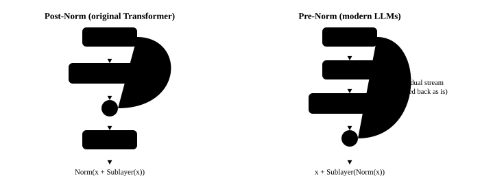

# Normalization and the residual stream

<p class="lead">Residual connections make networks of dozens or hundreds of layers trainable, and normalization keeps each layer's input at a suitable scale. Their compute is negligible, yet they shape the model's numerics: the "massive activations" and "outlier channels" in the residual stream are exactly the biggest headaches of quantization and low-precision inference.</p>

!!! question "Self-test: if you can answer these, skip this chapter"
    1. What is a residual connection? Why do we say each layer "reads and writes the residual stream"?
    2. What are the formulas of LayerNorm and RMSNorm? What does RMSNorm leave out?
    3. What is the difference between Pre-Norm and Post-Norm? Which do modern large models use?
    4. Why should normalization statistics be computed in FP32?
    5. What are activation outliers? How do they affect inference?

??? success "Answers (try first, then expand to compare)"
    1. Each sublayer's output is added back onto its input: $x \leftarrow x + f(x)$. The $x$ running through all the layers is called the residual stream; each layer reads from it, computes, and writes the result back (adds it back).
    2. LayerNorm: $(x - \mu)/\sqrt{\sigma^2 + \epsilon} \cdot \gamma + \beta$; RMSNorm: $x / \sqrt{\mathrm{mean}(x^2) + \epsilon} \cdot \gamma$, which leaves out subtracting the mean (one less reduction) and the bias $\beta$.
    3. Post-Norm normalizes after the residual addition (the original Transformer); Pre-Norm normalizes before the sublayer and leaves the residual stream itself unnormalized, which trains deep models more stably. Modern large models all use Pre-Norm, with one final normalization at the end.
    4. It takes a sum of squares over a whole row: a long accumulation in low precision loses accuracy, the squares can even overflow in FP16, and the statistic is applied to every number in the row, so it is computed in FP32.
    5. A few fixed channels (or a few tokens) have activations tens to thousands of times larger than the rest. They make per-tensor or per-token activation quantization very inaccurate and are the main difficulty of activation quantization such as W8A8.

## Residual connections {#残差连接}

The output of each sublayer (attention, feed-forward network) does not replace its input but is **added back** onto it:

$$
x \leftarrow x + \text{Sublayer}(\text{Norm}(x))
$$

There are two benefits: gradients can flow straight back to the shallow layers along the "addition" shortcut, so even dozens or hundreds of layers can be trained; and each layer only has to learn "what change to make to the existing representation" rather than build a new representation from scratch.

Seen this way, the whole model is one **residual stream** running from start to end: the embedding layer writes the tokens into it, each layer reads from it (through a normalization), computes, and adds the result back, and finally the output layer reads it out. The full structure of a Transformer layer:

{.aig-svg}

```py
h = x + attention(rms_norm_1(x))      # attention sublayer: tokens exchange information
y = h + mlp(rms_norm_2(h))            # feed-forward sublayer: each token processed on its own
```

## LayerNorm and RMSNorm {#layernorm-与-rmsnorm}

**LayerNorm** (the original Transformer, GPT-2) standardizes each token's d-dimensional vector, then scales and shifts it:

$$
\text{LayerNorm}(x) = \frac{x - \mu}{\sqrt{\sigma^2 + \epsilon}} \odot \gamma + \beta
$$

**RMSNorm** (LLaMA, Qwen, DeepSeek and nearly every newer model) drops the mean subtraction and the shift, and only divides by the root mean square:

$$
\text{RMSNorm}(x) = \frac{x}{\sqrt{\frac{1}{d}\sum_i x_i^2 + \epsilon}} \odot \gamma
$$

One less reduction and one less set of parameters, with essentially the same results. One implementation detail: **compute the statistic in FP32**, because summing the squares of thousands of numbers in BF16 loses precision. The implementation below matches Qwen2's RMSNorm in transformers bit for bit:

First see what the two normalizations each do to the same vector. Try a few inputs (a global shift, a global scale-up, an outlier dimension) to see where they differ and why subtracting the mean can be dropped:

<div class="aig-widget" data-widget="norm"></div>

```python
import torch
import torch.nn as nn
from transformers.models.qwen2.modeling_qwen2 import Qwen2RMSNorm

class RMSNorm(nn.Module):
    def __init__(self, dim, eps=1e-6):
        super().__init__()
        self.eps = eps
        self.weight = nn.Parameter(torch.ones(dim))

    def forward(self, x):
        dtype = x.dtype
        x = x.float()                                                   # statistics in FP32
        x = x * torch.rsqrt(x.pow(2).mean(-1, keepdim=True) + self.eps)
        return self.weight * x.to(dtype)                                # cast back to the original precision first, then multiply by the weight

torch.manual_seed(0)
ours, ref = RMSNorm(896), Qwen2RMSNorm(896, eps=1e-6)
w = torch.rand(896) + 0.5
ours.weight.data.copy_(w)
ref.weight.data.copy_(w)
for dtype in (torch.float32, torch.bfloat16):
    x = torch.randn(2, 7, 896, dtype=dtype) * 3
    assert torch.equal(ours.to(dtype)(x), ref.to(dtype)(x))            # bitwise equal

# after RMSNorm every token vector has RMS 1 (before multiplying by the weight)
y = RMSNorm(896)(torch.randn(4, 896) * 100)
assert torch.allclose(y.pow(2).mean(-1).sqrt(), torch.ones(4), atol=1e-3)
```

Details of order such as "cast back to the original precision first, then multiply by the weight" decide whether the BF16 result matches the official implementation bit for bit. Inference engines must reproduce these details very carefully when writing fused kernels.

## Pre-Norm and Post-Norm {#pre-norm-与-post-norm}

The original Transformer put normalization **after** the residual addition (Post-Norm): $x \leftarrow \text{Norm}(x + \text{Sublayer}(x))$. With many layers this trains very unstably and needs careful learning-rate warmup.

Modern large models all use **Pre-Norm**: normalization comes **before** the sublayer, the residual stream itself is never normalized, and there is just one **final normalization** (`model.norm`) before the output. The residual stream thus becomes a "clean" addition path, and training is much more stable. The price is that the values in the residual stream can keep growing with depth, as we will see below.

{.aig-svg}

## A look at a real residual stream {#看看真实的残差流}

Use Qwen3-0.6B to look at the magnitude of the residual stream at each layer:

```pycon
>>> from transformers import AutoModelForCausalLM, AutoTokenizer
>>> path = "models/Qwen3-0.6B"
>>> tok = AutoTokenizer.from_pretrained(path)
>>> model = AutoModelForCausalLM.from_pretrained(path, dtype=torch.float32).eval()
>>> text = "推理优化的核心是减少访存。大模型在解码阶段每生成一个词，都要读取全部的权重和缓存。"
>>> ids = tok(text, return_tensors="pt").input_ids
>>> with torch.no_grad():
...     hs = model(ids, output_hidden_states=True).hidden_states
>>> print("layer  rms(其他token)  rms(第0个token)  最大绝对值  位置[token,维度]")  # doctest: +NORMALIZE_WHITESPACE
layer  rms(其他token)  rms(第0个token)  最大绝对值  位置[token,维度]
>>> for layer in [0, 1, 2, 4, 8, 14, 20, 26, 27]:
...     h = hs[layer][0]
...     rms = h.pow(2).mean(-1).sqrt()
...     mx = h.abs().max()
...     pos = (h.abs() == mx).nonzero()[0].tolist()
...     print(layer, round(rms[1:].mean().item(), 2), round(rms[0].item(), 2), round(mx.item(), 1), pos)
0 0.03 0.03 0.2 [8, 126]
1 0.27 0.35 6.9 [7, 35]
2 0.35 0.44 9.4 [2, 35]
4 0.5 218.46 6938.6 [0, 35]
8 0.85 218.34 6934.4 [0, 35]
14 1.72 217.76 6915.6 [0, 35]
20 4.79 218.02 6924.2 [0, 35]
26 16.2 219.23 6955.7 [0, 35]
27 18.05 211.75 6708.4 [0, 35]
```

Three things can be read from these numbers:

1. **The residual stream grows with depth**: the RMS of ordinary tokens grows from 0.03 to 18, which is normal under Pre-Norm, since every layer's input is normalized first;
2. **Massive activations**: from layer 4 on, **token 0** has a value of about 6900 in **dimension 35**, three to four orders of magnitude larger than ordinary values, and it stays until the last layer. It is the other face of the [attention sink](attention.md#真实模型里的注意力注意力汇聚) seen in the previous chapter: the model uses this fixed huge value to make token 0 the "trash can" of attention;
3. **Outlier channels**: even for ordinary tokens, the maximum always appears in a few fixed dimensions (dimension 35 again here, followed by dimension 277):

```pycon
>>> h = hs[12][0, 1:]                                  # layer 12, without token 0
>>> top = h.abs().amax(dim=0).topk(4)
>>> [(i.item(), round(v.item(), 1)) for v, i in zip(top.values, top.indices)], round(h.abs().median().item(), 3)
([(35, 34.5), (277, 15.0), (62, 10.7), (12, 10.5)], 0.545)
```

The maximum in dimension 35 is about 60 times the median of all values.

!!! inference "Inference view"
    - **Outliers make activation quantization hard**: when activations are quantized to INT8, a tensor shares one scale, and its range is set by the maximum. Outliers in a few dimensions stretch the range, ordinary values get squeezed into a handful of quantization levels, and precision suffers badly. Methods such as SmoothQuant are designed for exactly this: they "move" part of the activation outliers into the weights; see [how quantization works](../inference/quantization.md);
    - **Massive activations need enough numeric range**: a value of about 6900 still fits in FP16 (maximum about 65504), but with only one order of magnitude to spare; this is why BF16 (the same range as FP32) is safer, and why FP8 needs careful scaling;
    - **Normalization is a small, memory-bound operator**: it is often fused with the residual addition into one kernel (`fused_add_rms_norm`) that reads once and writes once; see [softmax and normalization](cuda://kernels/softmax-norm/) in the CUDA book.

!!! interview "In an interview"
    On normalization: the residual stream is the backbone, and each layer reads, computes and writes back; RMSNorm only divides by the root mean square, one reduction and one set of parameters fewer than LayerNorm; modern large models use Pre-Norm (more stable training) plus a final normalization at the end; the statistic is computed in FP32. Two inference-related points: real models' residual streams contain massive activations and fixed outlier channels, the main difficulty of activation quantization; and normalization is often fused with the residual addition into one kernel (vLLM's `fused_add_rms_norm`).

## Exercises {#练习}

**1. RMSNorm by hand.** x = (3, 4), γ = (1, 2), ε = 0. What is RMSNorm(x)?

??? success "Answer"
    RMS = √((9 + 16) / 2) = √12.5 ≈ 3.536. x / RMS ≈ (0.849, 1.131), and multiplying by γ gives (0.849, 2.263).

    ```python
    import torch
    x, g = torch.tensor([3.0, 4.0]), torch.tensor([1.0, 2.0])
    y = x / x.pow(2).mean().sqrt() * g
    assert torch.allclose(y, torch.tensor([0.8485, 2.2627]), atol=1e-4)
    ```

**2. Food for thought.** What happens if the RMSNorm statistic is computed in BF16 at inference time?

??? success "Answer"
    BF16 has only 8 bits of significand precision (about 2–3 significant decimal digits). When thousands of squares are accumulated, small values added later get rounded away, and the RMS can be off by several percent. Every layer's input is then scaled wrongly, the errors accumulate layer by layer, and the model's output drifts noticeably, degrading generation quality in bad cases. This is why every mainstream implementation computes the statistic in FP32 and uses BF16 only for input and output.

## Summary {#小结}

- [x] Residual connections turn the model into one residual stream that each layer reads, computes on and writes back to.
- [x] RMSNorm only divides by the root mean square, one reduction and one set of parameters fewer than LayerNorm; the statistic is computed in FP32.
- [x] Modern large models use Pre-Norm, with a final normalization at the end.
- [x] Real models' residual streams have massive activations (related to attention sinks) and fixed outlier channels.
- [x] Outliers are the main difficulty of activation quantization; normalization is often fused with the residual addition.
