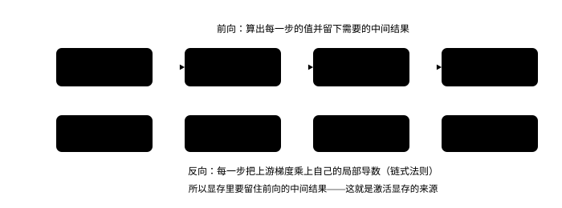

# 微积分与反向传播

<p class="lead">推理本身不需要求导，但做推理的人绕不开它：训练和微调（LoRA、RL）要反向传播；"训练算力约为推理的 3 倍"来自反向传播的计算量；GPTQ 这类量化方法用的是损失函数的二阶信息。这一章从导数和链式法则出发，手写一个最小的自动微分引擎并与 PyTorch 对照，推导线性层和 softmax 交叉熵的梯度，最后用 Hessian 实现一个简化的 GPTQ，在真实模型上把 INT4 量化的精度补回来一大截。</p>

!!! question "自测：能答上来就可以跳过本章"
    1. 反向模式自动微分是怎么工作的？为什么它适合"很多参数、一个损失"的情形？
    2. $Y = XW^\top$ 的反向传播中，$\partial L/\partial X$ 和 $\partial L/\partial W$ 分别是什么？为什么训练的计算量约为 $6N$ 每 token？
    3. softmax 加交叉熵的梯度为什么是 $p - y$？
    4. 用有限差分检查梯度时，步长 $h$ 为什么不能太小？
    5. GPTQ 用到了什么二阶信息？它为什么比逐个四舍五入好？

??? success "自测参考答案（先自己答，再展开对照）"
    1. 前向记录计算图，反向从损失出发，按链式法则把"损失对每个中间量的导数"（伴随量）一路往回传。一次反向就得到损失对所有参数的梯度，代价约是前向的两倍，与参数个数无关，所以适合"参数很多、输出只有一个损失"的情形。
    2. $\partial L / \partial X = (\partial L / \partial Y)\,W$，$\partial L / \partial W = (\partial L / \partial Y)^\top X$，各是一次和前向同样大的矩阵乘。前向 $2N$、反向两次矩阵乘共 $4N$，合计每 token 约 $6N$。
    3. 交叉熵 $L = -\log p_y$，代入 softmax 求导得到 $\partial L / \partial z_i = p_i - \mathbb{1}[i = y]$，即 $p - y$（$y$ 是 one-hot）。
    4. 有限差分的误差有两部分：截断误差随步长减小，舍入误差约为 机器精度 ÷ 步长、随步长减小而增大。步长太小时 $f(x+h) - f(x-h)$ 发生灾难性抵消，所以要用 float64 并取适中的步长。
    5. GPTQ 用层输入的二阶信息 $H = X^\top X$（重建误差对权重的海森矩阵）。量化一个权重后，把它的误差按 $H$ 的逆分摊到同一行还没量化的权重上，而不是各自独立舍入，所以整体输出误差小得多。

## 导数、梯度与链式法则

导数衡量函数值对输入的敏感程度：$f'(x) = \lim_{h\to 0} \frac{f(x+h) - f(x)}{h}$。多个输入时，每个输入的偏导数组成**梯度** $\nabla f$，它指向函数增长最快的方向，梯度下降就是沿它的反方向更新参数。

复合函数 $y = f(g(x))$ 的导数由**链式法则**给出：$\frac{dy}{dx} = \frac{dy}{dg}\cdot\frac{dg}{dx}$。神经网络是很多函数的复合，求梯度就是反复应用链式法则。

### 有限差分：最朴素的数值导数

用 $\frac{f(x+h) - f(x-h)}{2h}$ 近似导数（中心差分），截断误差约为 $h^2$ 量级。但 $h$ 也不能太小：分子是两个很接近的数相减，浮点舍入误差会被 $1/h$ 放大。两种误差此消彼长：

```python
import math
import torch

x = torch.tensor(1.0, dtype=torch.float64)
exact = math.cos(1.0)                                              # sin 的导数
print("步长 h      float32 误差      float64 误差")
for h in (1e-1, 1e-2, 1e-3, 1e-4, 1e-5, 1e-6, 1e-8):
    errs = []
    for dtype in (torch.float32, torch.float64):
        xx, hh = x.to(dtype), torch.tensor(h, dtype=dtype)
        approx = ((torch.sin(xx + hh) - torch.sin(xx - hh)) / (2 * hh)).item()
        errs.append(abs(approx - exact))
    print(f"{h:7.0e}   {errs[0]:12.2e}   {errs[1]:12.2e}")
```

```text title="输出"
步长 h      float32 误差      float64 误差
  1e-01       9.00e-04       9.00e-04
  1e-02       7.06e-06       9.00e-06
  1e-03       1.38e-05       9.01e-08
  1e-04       1.38e-05       9.00e-10
  1e-05       8.80e-04       1.11e-11
  1e-06       3.86e-03       2.77e-11
  1e-08       5.40e-01       2.58e-09
```

float32 下最好的步长在 $10^{-2}$ 附近，误差约 $10^{-5}$ 量级；步长再小，误差反而变大，到 $10^{-8}$ 时误差已经达到 0.5，完全不可用。float64 的精度高得多，最佳步长在 $10^{-5}$ 附近，误差约 $10^{-11}$。所以**用有限差分检查梯度时要用 float64**（`torch.autograd.gradcheck` 默认就要求 float64 输入）。数值误差的来源见下一章。

### 沿着梯度往下走：学习率、动量与曲面形状

梯度指向上升最快的方向，所以更新沿它的反方向。但"走多远"是另一个问题：步子太大会在陡的方向上来回震荡甚至发散，步子太小又要走很久。真正决定这件事的是**曲面的形状**——损失函数在不同方向上的曲率差多少倍（条件数）。

拖动学习率、动量和条件数，按"播放"看轨迹怎么走：

<div class="aig-widget" data-widget="graddesc"></div>

三个能直接读出来的结论：（1）学习率超过 $2 / L$（$L$ 是最大曲率）一定发散；（2）椭圆越扁，沿陡方向越震荡、沿平方向越慢；（3）动量把来回的震荡互相抵消，等效于在平方向上加速。这正是归一化（把曲面拉圆）、动量、以及 Adam 按维度调步长要解决的问题（见[优化器](train://algo/optimizer/)）。

## 反向模式自动微分

{.aig-svg}

神经网络有几十亿个参数、一个标量损失。**反向模式**自动微分从损失出发，沿计算图反向传播"损失对每个中间量的导数"（伴随量），一次反向就得到所有参数的梯度，代价与一次前向相当。下面是一个最小的实现（思路与 Karpathy 的 micrograd 相同）：每个节点记录自己的值、梯度、父节点，以及把梯度传给父节点的规则。

```python
class Value:
    def __init__(self, data, parents=(), backward=lambda: None):
        self.data, self.grad, self.parents, self._backward = data, 0.0, parents, backward

    def __add__(self, other):
        other = other if isinstance(other, Value) else Value(other)
        out = Value(self.data + other.data, (self, other))
        def backward():                                            # d(a+b)/da = 1，d(a+b)/db = 1
            self.grad += out.grad
            other.grad += out.grad
        out._backward = backward
        return out

    def __mul__(self, other):
        other = other if isinstance(other, Value) else Value(other)
        out = Value(self.data * other.data, (self, other))
        def backward():                                            # d(ab)/da = b，d(ab)/db = a
            self.grad += other.data * out.grad
            other.grad += self.data * out.grad
        out._backward = backward
        return out

    def exp(self):
        out = Value(math.exp(self.data), (self,))
        def backward():
            self.grad += out.data * out.grad                       # (e^x)' = e^x
        out._backward = backward
        return out

    def log(self):
        out = Value(math.log(self.data), (self,))
        def backward():
            self.grad += out.grad / self.data                      # (ln x)' = 1/x
        out._backward = backward
        return out

    def backward(self):
        order, seen = [], set()
        def visit(v):                                              # 拓扑排序：父节点在前
            if v not in seen:
                seen.add(v)
                for p in v.parents:
                    visit(p)
                order.append(v)
        visit(self)
        self.grad = 1.0
        for v in reversed(order):                                  # 从损失开始，逆序传播
            v._backward()

# 一个小例子：3 个 logits 的 softmax 交叉熵，真实类别是 1
logits = [Value(2.0), Value(0.5), Value(-1.0)]
exps = [z.exp() for z in logits]
total = exps[0] + exps[1] + exps[2]
loss = (total.log() + logits[1] * -1.0)                            # -log softmax(z)[1] = log Σe^z - z_1
loss.backward()

z = torch.tensor([2.0, 0.5, -1.0], requires_grad=True)
torch.nn.functional.cross_entropy(z[None], torch.tensor([1])).backward()
print("手写自动微分：", [round(v.grad, 6) for v in logits])
print("PyTorch：     ", [round(g, 6) for g in z.grad.tolist()])
print("softmax - onehot：", [round(p - (i == 1), 6) for i, p in enumerate(z.softmax(0).tolist())])
```

```text title="输出"
手写自动微分： [0.785597, -0.82471, 0.039113]
PyTorch：      [0.785597, -0.82471, 0.039113]
softmax - onehot： [0.785597, -0.82471, 0.039113]
```

三者一致。最后一行说明了一个非常重要的结论：**softmax 交叉熵对 logits 的梯度就是 $p - y$**（预测分布减去 one-hot 标签）。推导：$L = \log\sum_j e^{z_j} - z_y$，对 $z_i$ 求导得 $\frac{e^{z_i}}{\sum_j e^{z_j}} - [i = y] = p_i - y_i$。这个梯度简单而且数值稳定，所以框架总是把 softmax 和交叉熵合在一起计算。

## 线性层的反向传播

对 $Y = XW^\top$（$X$ 是 $[T, d_\text{in}]$，$W$ 是 $[d_\text{out}, d_\text{in}]$），已知 $G = \partial L/\partial Y$，则

$$
\frac{\partial L}{\partial X} = G W, \qquad \frac{\partial L}{\partial W} = G^\top X
$$

形状可以帮助记忆：梯度与原变量同形状，只有一种矩阵乘法的组合能凑出正确的形状。

```python
torch.manual_seed(0)
X = torch.randn(8, 16, requires_grad=True)
W = torch.randn(32, 16, requires_grad=True)
Y = X @ W.T
G = torch.randn_like(Y)                                            # 假设上游传来的梯度
Y.backward(G)
print("dX = G W：  ", torch.allclose(X.grad, G @ W, atol=1e-5))
print("dW = Gᵀ X： ", torch.allclose(W.grad, G.T @ X, atol=1e-5))
```

```text title="输出"
dX = G W：   True
dW = Gᵀ X：  True
```

前向是一次矩阵乘法（$2 T d_\text{in} d_\text{out}$ 次运算），反向是**两次**同样大小的矩阵乘法（一次求 $\partial L/\partial X$ 传给上一层，一次求 $\partial L/\partial W$ 用于更新）。所以训练每个 token 的计算量约为前向的 3 倍：$2N + 4N = 6N$，这就是训练算力公式 $C \approx 6ND$ 的来源（见[预训练](../training/pretraining.md#训练需要多少算力)）。推理只做前向，每个 token 约 $2N$。

## 二阶信息：GPTQ

梯度是一阶导数；**Hessian**（二阶导数矩阵）描述函数的曲率。在最优点附近，损失可以用二次函数近似：$\Delta L \approx \frac{1}{2}\Delta w^\top H \Delta w$。

量化一个线性层时，我们希望量化后的输出尽量不变：最小化 $\|XW^\top - X\hat{W}^\top\|^2$。对权重的每一行 $w$，这个目标是二次的：

$$
\|X(w - \hat w)^\top\|^2 = (w - \hat w)\, H\, (w - \hat w)^\top, \qquad H = X^\top X
$$

$H$ 由激活决定（也就是二阶信息）。逐个四舍五入（RTN）相当于假设 $H$ 是对角的，忽略了不同输入维度之间的相关性。**GPTQ**（基于更早的 OBS/OBQ）的做法是：按列逐个量化，每量化一列，就利用 $H^{-1}$ 把这一列产生的误差"补偿"到还没量化的列上，让它们朝着抵消误差的方向调整。用 $H^{-1}$ 的 Cholesky 分解可以高效、稳定地完成这件事。

在真实模型上实现：先用一段校准文本（取自本书的分词一章，与评测文本不同）收集每个线性层输入的 $H = X^\top X$，再对全部线性层做 INT4 按通道量化，比较 RTN 与 GPTQ 的困惑度：

```python
import copy
import re
from transformers import AutoTokenizer
from mini_llm import Transformer
from quant import fake_quant_int

torch.set_num_threads(16)
path = "models/Qwen3-0.6B"
tok = AutoTokenizer.from_pretrained(path)
model = Transformer.from_pretrained(path)
text = ("大语言模型的推理过程分为两个阶段。在预填充阶段，模型一次性处理用户输入的全部提示词，计算每个位置的键和值并写入缓存。"
        "在解码阶段，模型每次只生成一个新的词元，需要读取全部的模型权重和已经缓存的键值。由于每一步的计算量很小而读取的数据量很大，"
        "解码阶段通常受限于显存带宽。为了提高吞吐量，推理系统会把多个请求合并成一个批次，让它们共享同一次权重读取。"
        "量化通过降低权重和激活的数值精度来减少需要读取的字节数，是加速解码的常用方法。")
eval_ids = tok(text, return_tensors="pt").input_ids                  # 与大模型手册量化一章相同的评测文本
raw = re.sub(r"```.*?```", "", open("docs/basics/tokenization.md").read(), flags=re.S)
calib_ids = tok(re.sub(r"[#*`>|\-\[\]()!]", "", raw)).input_ids[:512]    # 校准文本

def perplexity(m):
    with torch.no_grad():
        logits = m(eval_ids)
    return math.exp(torch.nn.functional.cross_entropy(logits[0, :-1], eval_ids[0, 1:]).item())

def linears(m):
    for layer in m.layers:
        a, f = layer.self_attn, layer.mlp
        yield from (a.q_proj, a.k_proj, a.v_proj, a.o_proj, f.gate_proj, f.up_proj, f.down_proj)

hessians, hooks = {}, []
for lin in linears(model):                                         # 收集每个线性层输入的 H = XᵀX
    def hook(mod, inp, out, lin=lin):
        x = inp[0].reshape(-1, inp[0].shape[-1])
        hessians[lin] = x.T @ x
    hooks.append(lin.register_forward_hook(hook))
with torch.no_grad():
    model(torch.tensor([calib_ids]))
for h in hooks:
    h.remove()

def gptq(W, H, bits=4, block=128):
    """按列量化，把每列的量化误差用 H⁻¹ 补偿到后面的列上（按块延迟更新，与原论文一致）。"""
    W, n = W.clone(), W.shape[1]
    H = H + 0.01 * H.diag().mean() * torch.eye(n)                 # 阻尼，保证可逆
    Hinv = torch.linalg.cholesky(torch.cholesky_inverse(torch.linalg.cholesky(H)), upper=True)
    qmax = 2 ** (bits - 1) - 1
    scale = W.abs().amax(1) / qmax                                  # 按通道的缩放因子
    Q = torch.zeros_like(W)
    for a in range(0, n, block):
        b = min(a + block, n)
        W1, errors = W[:, a:b].clone(), torch.zeros(W.shape[0], b - a)
        for i in range(b - a):
            q = (W1[:, i] / scale).round().clamp(-qmax - 1, qmax) * scale
            Q[:, a + i] = q
            err = (W1[:, i] - q) / Hinv[a + i, a + i]
            W1[:, i:] -= err[:, None] * Hinv[a + i, a + i:b][None, :]    # 补偿到本块剩余的列
            errors[:, i] = err
        W[:, b:] -= errors @ Hinv[a:b, b:]                                # 补偿到后面所有的列
    return Q

rtn, gq = copy.deepcopy(model), copy.deepcopy(model)
for lin_rtn, lin_gptq, lin in zip(linears(rtn), linears(gq), linears(model)):
    lin_rtn.weight.data = fake_quant_int(lin.weight.data, 4, "channel")
    lin_gptq.weight.data = gptq(lin.weight.data, hessians[lin])
print(f"FP32 原始 {perplexity(model):.2f}；INT4 按通道：四舍五入（RTN）{perplexity(rtn):.2f}，GPTQ {perplexity(gq):.2f}")
```

```text title="输出"
FP32 原始 25.94；INT4 按通道：四舍五入（RTN）55.02，GPTQ 36.85
```

同样的 INT4 按通道格式、同样的缩放因子，只是换了一种"决定每个权重舍入到哪里"的方式，困惑度的损失就减少了约一半。GPTQ 没有训练，只用了一段校准文本和一些线性代数。实际使用中，GPTQ 通常还会配合按组缩放（例如每 128 个数一组），精度更接近原模型（见[量化原理](../inference/quantization.md#gptq-与-awq)）。

!!! interview "面试怎么答"
    被问反向传播讲三点：反向模式自动微分从损失出发，一次反向得到所有参数的梯度，适合"参数多、损失只有一个"；线性层 $Y = XW^\top$ 的反向是两次矩阵乘（$dX = dY\,W$、$dW = dY^\top X$），所以训练每 token 约 6N、推理 2N；softmax 加交叉熵对 logits 的梯度是 $p - y$，融合的交叉熵 kernel 因此不必存下完整的 softmax。检查梯度要用 float64 的有限差分——步长太小会被舍入误差淹没。

## 练习

**1. 为什么是反向模式？** 一个网络有 $n$ 个参数、一个标量损失。前向模式自动微分（每次沿一个输入方向传播导数）求全部梯度需要几次传播？反向模式呢？什么情况下前向模式更划算？

??? success "参考答案"
    前向模式每次得到损失对一个输入方向的导数，求全部 $n$ 个参数的梯度需要 $n$ 次传播；反向模式一次反向就得到对所有参数的梯度。所以"输入多、输出少"（神经网络训练）用反向模式；"输入少、输出多"（例如求一个函数对单个超参数的敏感度、雅可比向量积）用前向模式更划算。反向模式的代价是要保存前向的中间结果（激活），这就是训练显存大、需要激活重计算的原因。

**2. LoRA 的梯度。** 对 $Y = X(W + BA)^\top$，$W$ 冻结，只训练 $A$（$r \times d_\text{in}$）和 $B$（$d_\text{out} \times r$）。写出 $\partial L/\partial A$ 和 $\partial L/\partial B$，并说明 LoRA 为什么省显存。

??? success "参考答案"
    设 $G = \partial L/\partial Y$，$Z = XA^\top$（$[T, r]$）。则 $Y$ 中 LoRA 的部分是 $ZB^\top$，$\partial L/\partial B = G^\top Z$，$\partial L/\partial Z = GB$，$\partial L/\partial A = (GB)^\top X$。需要保存的优化器状态只有 $A$、$B$ 的（参数量是原矩阵的百分之一量级），而 $W$ 不需要梯度和优化器状态，所以显存大幅下降；但 $\partial L/\partial X$ 仍然要穿过 $W$ 传给上一层，前向与反向的计算量并没有减少多少。

## 小结

- [x] 有限差分受截断误差与舍入误差两头夹击，检查梯度要用 float64。
- [x] 反向模式自动微分从损失反向传播伴随量，一次反向得到所有参数的梯度；手写的最小实现与 PyTorch 一致。
- [x] softmax 交叉熵对 logits 的梯度是 $p - y$；线性层的反向是两次矩阵乘法，训练约 $6N$、推理约 $2N$ 每 token。
- [x] GPTQ 用激活的二阶信息 $H = X^\top X$ 做误差补偿，本书实验中把 INT4 按通道量化的困惑度损失减少了约 60%。
