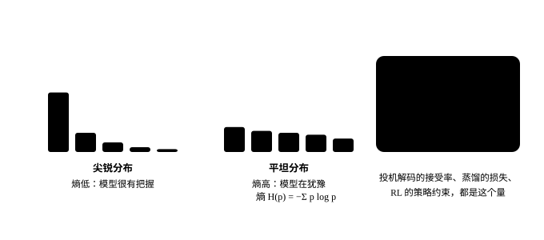

# 信息论

<p class="lead">语言模型的训练目标是交叉熵，评测指标是困惑度，RLHF 和蒸馏里有 KL 散度，量化评测也越来越多地用 KL 散度。它们都来自信息论。这一章从"不确定性"的度量讲起，把熵、交叉熵、KL 散度、困惑度串成一条线，再在真实模型上看它们各自说明了什么：模型在哪些位置有把握、它能把文本压缩到多少比特、量化到底改变了多少、为什么熵低的位置投机解码更容易成功。</p>

!!! question "自测：能答上来就可以跳过本章"
    1. 熵、交叉熵、KL 散度之间是什么关系？
    2. 困惑度 27 是什么意思？和"每个 token 多少比特"怎么换算？
    3. 为什么说量化评测中，KL 散度比困惑度更灵敏？
    4. 正向 KL 与反向 KL 的区别是什么？RLHF 中的 KL 惩罚用的是哪个？

??? success "自测参考答案（先自己答，再展开对照）"
    1. 交叉熵 $H(p, q) = H(p) + \mathrm{KL}(p \| q)$：熵是数据本身的不确定性，KL 是模型分布 $q$ 相对真实分布 $p$ 多付出的代价；训练最小化交叉熵等价于最小化 KL。
    2. 平均每个 token 的交叉熵是 $\ln 27$ 奈特，相当于每一步在 27 个等可能的 token 里挑一个；换成比特是 $\log_2 27 \approx 4.75$ 比特 / token。
    3. 困惑度只看正确 token 的概率在整体上的平均，量化带来的小变化互相抵消；KL 散度逐位置比较两个完整的分布，能看出分布形状的改变，所以更灵敏（INT8 时困惑度不变，仍有 2% 的位置 top-1 变了）。
    4. 正向 $\mathrm{KL}(p \| q)$ 要求 $q$ 覆盖 $p$ 的所有高概率区域（mode covering），用于最大似然和蒸馏；反向 $\mathrm{KL}(q \| p)$ 允许 $q$ 只抓住一个峰（mode seeking）。RLHF 里的 KL 惩罚是反向的：$\mathrm{KL}(\pi_\theta \| \pi_{ref})$。

## 熵、交叉熵与 KL 散度

{.aig-svg}

一个分布的**熵**衡量它的不确定性：

$$
H(p) = -\sum_x p(x)\log_2 p(x) \quad \text{（单位：比特）}
$$

均匀分布在 $2^k$ 个结果上的熵是 $k$ 比特；确定的结果熵为 0。直观地说，熵是"用最优编码表示一个样本平均需要的比特数"。

如果真实分布是 $p$，却用为分布 $q$ 设计的编码，平均需要的比特数就是**交叉熵**：

$$
H(p, q) = -\sum_x p(x)\log_2 q(x) = H(p) + D_\text{KL}(p \,\|\, q)
$$

多出来的部分 $D_\text{KL}(p\|q) = \sum_x p(x)\log\frac{p(x)}{q(x)} \ge 0$ 就是 **KL 散度**，衡量"用 $q$ 代替 $p$"的额外代价，当且仅当 $p = q$ 时为 0。它不对称：$D_\text{KL}(p\|q) \ne D_\text{KL}(q\|p)$。

语言模型的训练损失就是交叉熵：$p$ 是数据中的真实下一个 token（one-hot），$q$ 是模型的预测，损失 $= -\log q(x_\text{真实})$。**困惑度**是交叉熵的指数：$\text{PPL} = e^{H}$（用自然对数时），可以理解为"模型平均在多少个选项中犹豫"（见[语言模型](../basics/language-model.md#训练目标交叉熵)）。

## 模型在哪些位置有把握

在本书的一段正文上，计算 Qwen3-0.6B 在每个位置预测分布的熵，以及它对这段文本的交叉熵：

```python
import copy
import math
import re
import torch
from transformers import AutoTokenizer
from mini_llm import Transformer
from quant import fake_quant_int

torch.set_num_threads(16)
path = "models/Qwen3-0.6B"
tok = AutoTokenizer.from_pretrained(path)
model = Transformer.from_pretrained(path)
raw = re.sub(r"```.*?```", "", open("docs/basics/language-model.md").read(), flags=re.S)
ids = tok(re.sub(r"[#*`>|\-\[\]()!]", "", raw)).input_ids[:400]
with torch.no_grad():
    logp = model(torch.tensor([ids]))[0].log_softmax(-1)             # [400, V]，每个位置的对数概率
p = logp.exp()
entropy_bits = -(p * logp).sum(-1) / math.log(2)
print("每个位置预测分布的熵（比特）：10% 分位", f"{entropy_bits.quantile(0.1):.2f}，中位数 {entropy_bits.median():.2f}，"
      f"90% 分位 {entropy_bits.quantile(0.9):.2f}")

nll = -logp[:-1].gather(1, torch.tensor(ids[1:])[:, None]).squeeze(1)   # 每个真实 token 的负对数概率
bits = nll.sum().item() / math.log(2)
n_bytes = len(tok.decode(ids[1:]).encode("utf-8"))
print(f"交叉熵：每个 token {bits / (len(ids) - 1):.2f} 比特，困惑度 {math.exp(nll.mean()):.1f}")
print(f"这段文本 UTF-8 编码是 {n_bytes} 字节（{n_bytes * 8} 比特），模型只需要 {bits:.0f} 比特，"
      f"即每字节 {bits / n_bytes:.2f} 比特")
```

```text title="输出"
每个位置预测分布的熵（比特）：10% 分位 0.08，中位数 2.55，90% 分位 6.87
交叉熵：每个 token 4.98 比特，困惑度 31.6
这段文本 UTF-8 编码是 1579 字节（12632 比特），模型只需要 1987 比特，即每字节 1.26 比特
```

- 模型在大约 10% 的位置几乎确定（熵小于 0.1 比特，比如一个词的后半部分），在另外 10% 的位置非常犹豫（约 7 比特，相当于在一百多个选项中选择）；
- 交叉熵约 5 比特/token：配合算术编码，这个模型可以把这段中文压缩到每字节 1.26 比特，而 UTF-8 每字节 8 比特。**语言建模就是压缩**，这也是"困惑度越低、模型越好"的信息论解释。

## KL 散度：量化改变了多少

评估量化时，最常用的指标是困惑度，但它只看"真实 token 的概率"，是一个平均值，很多变化会相互抵消。更直接的方法是比较量化前后**整个分布**的差别：每个位置计算 $D_\text{KL}(p_\text{原始} \| p_\text{量化})$，再看 top-1 预测是否改变：

```python
def quantized_model(fn):
    m = copy.deepcopy(model)
    for layer in m.layers:
        a, f = layer.self_attn, layer.mlp
        for lin in (a.q_proj, a.k_proj, a.v_proj, a.o_proj, f.gate_proj, f.up_proj, f.down_proj):
            lin.weight.data = fn(lin.weight.data)
    return m

print("方案          困惑度   平均 KL    KL 的 P99   top-1 一致率")
print(f"FP32 原始    {math.exp(nll.mean()):7.2f}")
for name, fn in [("INT8 按通道", lambda w: fake_quant_int(w, 8, "channel")),
                 ("INT4 按组", lambda w: fake_quant_int(w, 4, "group")),
                 ("INT4 按通道", lambda w: fake_quant_int(w, 4, "channel"))]:
    with torch.no_grad():
        logq = quantized_model(fn)(torch.tensor([ids]))[0].log_softmax(-1)
    kl = (p * (logp - logq)).sum(-1)
    agree = (logp.argmax(-1) == logq.argmax(-1)).float().mean()
    ppl = math.exp(-logq[:-1].gather(1, torch.tensor(ids[1:])[:, None]).mean())
    print(f"{name:10s} {ppl:7.2f}   {kl.mean():7.4f}   {kl.quantile(0.99):8.2f}   {agree:8.1%}")
```

```text title="输出"
方案          困惑度   平均 KL    KL 的 P99   top-1 一致率
FP32 原始      31.57
INT8 按通道     31.60    0.0047       0.03      96.2%
INT4 按组      38.16    0.4091       2.04      68.3%
INT4 按通道     54.16    0.9639       4.35      55.3%
```

INT8 按通道量化后，困惑度与原始模型几乎相同（31.60 对 31.57），看起来"无损"；但 KL 散度显示分布确实变了，**有近 4% 的位置 top-1 预测发生了改变**。对贪心解码来说，这意味着生成的文本大约每 25 个 token 就可能出现一次分叉。INT4 的差别就更明显了：三分之一的位置 top-1 改变。所以更严谨的量化评测会报告 KL 散度与 top-1 一致率（llama.cpp 的量化评测工具就这样做），而不只是困惑度。

## 熵与投机解码

[上一章](probability.md#拒绝采样与投机解码)证明了投机采样的接受率是 $\sum_x \min(p, q) = 1 - \text{TV}(p, q)$。直觉上，目标模型有把握的位置（熵低），草稿模型也更容易猜对。用同一段文本验证，草稿模型仍然是 INT4 量化版本：

```python
with torch.no_grad():
    q_draft = quantized_model(lambda w: fake_quant_int(w, 4, "group"))(torch.tensor([ids]))[0].softmax(-1)
accept = torch.minimum(p, q_draft).sum(-1)
low, high = entropy_bits < entropy_bits.quantile(0.25), entropy_bits > entropy_bits.quantile(0.75)
print(f"熵与接受率的相关系数 {torch.corrcoef(torch.stack([entropy_bits, accept]))[0, 1]:.2f}")
print(f"熵最低的四分之一位置，平均接受率 {accept[low].mean():.2f}；熵最高的四分之一位置 {accept[high].mean():.2f}")
```

```text title="输出"
熵与接受率的相关系数 -0.50
熵最低的四分之一位置，平均接受率 0.89；熵最高的四分之一位置 0.62
```

熵低的位置接受率明显更高。这解释了很多经验现象：代码、JSON、复述这类"确定性高"的输出，投机解码的加速比更大；开放式创作、高温采样时，加速比下降。

## 正向 KL 与反向 KL

KL 散度不对称，用它来拟合分布时，方向决定了结果的性质。用一个单峰分布 $q$（离散化的高斯）去拟合一个双峰分布 $p$：

```python
xs = torch.arange(100).float()
bump = lambda mu, sigma: torch.exp(-0.5 * ((xs - mu) / sigma) ** 2)
p_target = 0.6 * bump(25, 5) + 0.4 * bump(70, 5)
p_target = p_target / p_target.sum()

def fit(direction, mu0):
    mu, log_sigma = torch.tensor(mu0, requires_grad=True), torch.tensor(math.log(10.0), requires_grad=True)
    opt = torch.optim.Adam([mu, log_sigma], lr=0.5)
    for _ in range(2000):
        q = torch.softmax(-0.5 * ((xs - mu) / log_sigma.exp()) ** 2, 0)
        if direction == "正向":
            loss = (p_target * (p_target.log() - q.clamp_min(1e-30).log())).sum()     # KL(p‖q)
        else:
            loss = (q * (q.clamp_min(1e-30).log() - p_target.log())).sum()            # KL(q‖p)
        opt.zero_grad()
        loss.backward()
        opt.step()
    return mu.item(), log_sigma.exp().item(), loss.item()

for direction in ("正向", "反向"):
    for mu0 in (30.0, 60.0):                                          # 从两个不同的起点出发
        mu, sigma, loss = fit(direction, mu0)
        print(f"{direction} KL，起点 {mu0:.0f}：q 的中心 {mu:5.1f}，宽度 {sigma:5.1f}，KL = {loss:.3f}")
```

```text title="输出"
正向 KL，起点 30：q 的中心  40.2，宽度  27.2，KL = 0.786
正向 KL，起点 60：q 的中心  40.2，宽度  27.2，KL = 0.786
反向 KL，起点 30：q 的中心  25.0，宽度   5.0，KL = 0.511
反向 KL，起点 60：q 的中心  70.0，宽度   5.0，KL = 0.916
```

- **正向 KL** $D(p\|q)$ 在 $p > 0$ 而 $q \approx 0$ 的地方惩罚极大，所以 $q$ 必须**覆盖** $p$ 的所有峰：无论从哪里出发，结果都是一个又宽又居中、落在两个峰之间的分布（mode covering）。最大似然训练、用教师 logits 蒸馏学生，都是在最小化正向 KL；
- **反向 KL** $D(q\|p)$ 在 $q > 0$ 而 $p \approx 0$ 的地方惩罚极大，所以 $q$ 宁可**只贴住一个峰**（mode seeking）。贴住哪个峰取决于起点：从 60 出发会停在较小的那个峰上，KL 更大，是一个局部最优。RLHF/GRPO 中约束策略不要偏离参考模型太远的 KL 惩罚 $D(\pi_\theta \| \pi_\text{ref})$ 是反向 KL，它倾向于让模型在某些"模式"上更集中，这也是 RL 后模型输出多样性下降的原因之一。

!!! interview "面试怎么答"
    评估指标题：交叉熵 = 熵 + KL，困惑度是交叉熵的指数（困惑度 27 相当于每一步在 27 个等可能的 token 里挑），也可以换算成每 token 或每字节的比特数；评测量化要看 KL 散度和 top-1 一致率，它们比困惑度灵敏（INT8 时困惑度不变，仍有 2% 的位置 top-1 改变）；正向 KL 覆盖所有模式（最大似然、蒸馏），反向 KL 追逐单个模式（RL 里的 KL 惩罚）。熵低的位置投机解码更容易被接受。

## 练习

**1. 熵的上限。** Qwen 的词表大小约 15 万，下一个 token 分布的熵最大是多少比特？上面实测的 90% 分位是 7.5 比特，相当于在多少个等概率选项中选择？

??? success "参考答案"
    最大熵是均匀分布的熵 $\log_2 151936 \approx 17.2$ 比特。7.5 比特相当于 $2^{7.5} \approx 181$ 个等概率选项。即使在最犹豫的位置，模型的分布也远比均匀分布集中。

**2. KL 与温度。** 把目标模型的温度从 1 降到 0.5，而草稿模型不变，接受率会怎样变？（提示：考虑熵的变化和两个分布的距离。）

??? success "参考思路"
    温度降低让目标分布更尖锐（熵降低）。如果草稿模型也用同样的温度（投机采样要求草稿的分布就是实际采样用的分布），两者都变尖锐，最可能的 token 一致时接受率上升，不一致时则急剧下降；整体上，在草稿与目标的 top-1 大多一致的情况下，低温会提高接受率，极限情况（温度趋于 0）就是贪心验证，接受与否取决于 top-1 是否相同。如果只降低目标的温度而草稿不变，两个分布的差距会变大，接受率下降。

## 小结

- [x] 熵衡量不确定性；交叉熵 = 熵 + KL 散度；困惑度是交叉熵的指数，也可以换算成每 token 或每字节的比特数。
- [x] 语言建模就是压缩：本书的小模型能把一段中文压缩到约 1.2 比特/字节。
- [x] KL 散度与 top-1 一致率比困惑度更能反映量化带来的变化：INT8 困惑度不变，仍有 2% 的位置 top-1 改变。
- [x] 熵低的位置投机解码更容易被接受；正向 KL 覆盖所有模式（最大似然、蒸馏），反向 KL 追逐单个模式（RL 中的 KL 惩罚）。
