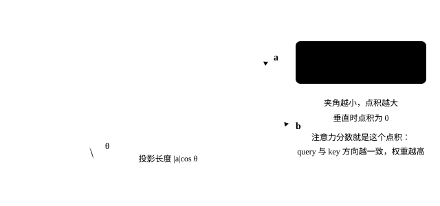
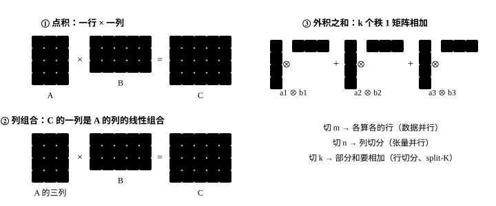
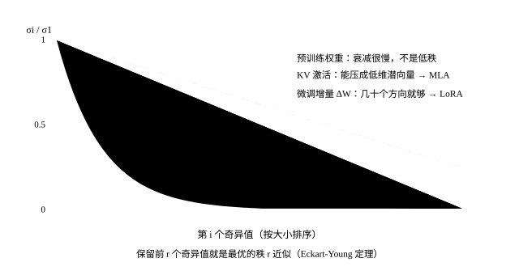

# 线性代数

<p class="lead">大模型的计算几乎全是矩阵乘法，很多推理优化背后是线性代数里的几个概念：把矩阵乘法看成"外积之和"，就理解了分块和分布式切分；把矩阵看成"低秩 + 噪声"，就理解了 LoRA 和 MLA；把正交矩阵看成"旋转"，就理解了 RoPE 和量化中的旋转技巧。这一章讲清这些概念，并在 Qwen3-0.6B 的真实权重和激活上验证它们。</p>

!!! question "自测：能答上来就可以跳过本章"
    1. 矩阵乘法 $C = AB$ 有哪三种等价的理解方式？分别对应什么样的并行切分？
    2. 矩阵的秩是什么？SVD 截断为什么是"最好的"低秩近似？
    3. 大模型的权重是低秩的吗？KV 呢？这和 LoRA、MLA 有什么关系？
    4. 正交矩阵有什么性质？为什么把激活和权重同时乘以一个正交矩阵，能让量化误差变小？

??? success "自测参考答案（先自己答，再展开对照）"
    1. 点积视角（每个元素是 A 的一行与 B 的一列的点积）→ 按输出切分、各算各的；列组合视角（C 的每一列是 A 的列的组合）→ 按 B 的列切分，对应张量并行的列切分；外积之和视角（$C = \sum_k a_k b_k^\top$）→ 按 k 切分，各算一部分再相加，对应行切分、split-K、分块注意力。
    2. 秩是线性无关的行（列）数，即矩阵真正"用到"的维数。按 Eckart-Young 定理，保留 SVD 最大的 r 个奇异值得到的矩阵，是所有秩不超过 r 的矩阵里误差（Frobenius 或谱范数）最小的。
    3. 预训练权重的奇异值衰减很慢，不是低秩的；但微调带来的增量往往低秩（LoRA 的依据），K、V 这类激活也接近低秩（MLA 用低维潜向量压缩 KV 的依据）。
    4. 正交矩阵 $Q^\top Q = I$，保持长度和点积不变，所以 $(xQ)(Q^\top W) = xW$，结果不变。旋转把集中在少数通道的离群值"搅散"到所有通道上，每一组数的最大值与典型值更接近，量化误差就小了（QuaRot 等方法）。

## 先看几何：矩阵是对空间做的一件事

在写下任何公式之前，先记住一句话：**一个矩阵就是"把基向量搬到别处"，其余的点跟着一起走**。二维的 $\begin{pmatrix} a & b \\ c & d \end{pmatrix}$ 把 $\hat{\imath} = (1,0)$ 搬到第一列 $(a, c)$、把 $\hat{\jmath} = (0,1)$ 搬到第二列 $(b, d)$；任何向量 $x$ 的去向就是这两个新位置的线性组合：

$$
Wx = x_1 \cdot \begin{pmatrix} a \\ c \end{pmatrix} + x_2 \cdot \begin{pmatrix} b \\ d \end{pmatrix}
$$

拖一拖下面这四个数，看网格怎么被拉伸、旋转、剪切甚至压扁（按"播放"会从单位阵动画过渡过去）：

<div class="aig-widget" data-widget="linmap"></div>

三个可以直接读出来的量，后面都会用到：

- **行列式**是面积的缩放倍数。等于 0 就说明整个平面被压到一条线上——矩阵**降秩**了，信息丢掉了一维，不可逆。
- **行列式为负**表示空间被翻折（左右手性反过来）。
- **特征向量**是方向不变、只被拉伸的那些向量。没有实特征值，说明这个变换里含旋转。

线性层做的就是同一件事，只是维度从 2 变成几千：每个输出通道是输入通道的一个加权组合。注意力里的 $QK^\top$ 也是——它在算每个 query 和每个 key 的点积，而点积的几何含义是**投影**：

{.aig-svg}

两个向量方向越一致，点积越大，注意力权重就越高；垂直时点积为零，互不相关。RoPE 把位置信息编成一个旋转——旋转不改变长度、只改变夹角，所以它只影响"谁和谁更像"，不影响向量的模长（见[旋转位置编码](../transformer/position.md)）。

## 矩阵乘法的三种视角

$C = AB$，$A$ 的形状是 $m \times k$，$B$ 是 $k \times n$。同一个结果可以用三种方式理解：

1. **点积视角**：$C_{ij} = \sum_t A_{it} B_{tj}$，$C$ 的每个元素是 $A$ 的一行与 $B$ 的一列的点积；
2. **列组合视角**：$C$ 的第 $j$ 列是 $A$ 的各列的线性组合，组合系数是 $B$ 的第 $j$ 列；
3. **外积之和视角**：$C = \sum_t A_{:,t} B_{t,:}$，是 $k$ 个秩为 1 的矩阵（外积）之和。

{.aig-svg}

```pycon
>>> import torch
>>> torch.manual_seed(0)
<torch._C.Generator object at ...>
>>> A, B = torch.randn(4, 3), torch.randn(3, 5)
>>> C = A @ B
>>> dot = torch.tensor([[A[i] @ B[:, j] for j in range(5)] for i in range(4)])      # 点积视角
>>> cols = torch.stack([A @ B[:, j] for j in range(5)], dim=1)                      # 列组合视角
>>> outer = sum(torch.outer(A[:, t], B[t]) for t in range(3))                        # 外积之和视角
>>> torch.allclose(C, dot, atol=1e-6), torch.allclose(C, cols, atol=1e-6), torch.allclose(C, outer, atol=1e-6)
(True, True, True)
```

这三种视角对应了三种切分矩阵乘法的方式，在 GPU kernel 和分布式并行中反复出现：

| 按什么切 | 视角 | 每份的结果 | 在哪里见到 |
| --- | --- | --- | --- |
| 切 $A$ 的行（$m$） | 点积 | 结果的若干行，拼起来即可 | 不同 token 分给不同线程块；数据并行 |
| 切 $B$ 的列（$n$） | 列组合 | 结果的若干列，拼起来即可 | 张量并行的**列切分** |
| 切 $k$ | 外积之和 | 完整形状的**部分和**，要相加 | 张量并行的**行切分**（all-reduce）；GEMM 的 split-K；FlashAttention 沿 K/V 的分块 |

计算量：每个 $C_{ij}$ 要 $k$ 次乘法和 $k$ 次加法，共 $2mnk$ 次浮点运算，这是大模型所有算力估算的起点（见[数学与 PyTorch 预备](../basics/math-torch.md#矩阵乘法线性层)）。

## 秩与低秩近似

矩阵的**秩**是它的列（或行）中线性无关的最大个数，也就是它能表示的"独立方向"的个数。任何矩阵都可以做**奇异值分解**（SVD）：

$$
W = U \Sigma V^\top = \sum_{i=1}^{r} \sigma_i \, u_i v_i^\top, \quad \sigma_1 \ge \sigma_2 \ge \dots \ge 0
$$

$u_i$、$v_i$ 是互相正交的单位向量，$\sigma_i$ 是奇异值。只保留最大的 $k$ 项，得到的 $W_k$ 是所有秩不超过 $k$ 的矩阵中，与 $W$ 的误差（按 Frobenius 范数）最小的一个（Eckart–Young 定理），误差为 $\sqrt{\sum_{i>k}\sigma_i^2}$。所以奇异值的平方和的分布，直接告诉我们"用低秩矩阵近似它会损失多少"。

先用一个能拖的例子建立直觉：把"保留几个奇异值"从 1 拖到 24，看右边的近似图案什么时候变得和原图一样，以及这时省了多少参数。

<div class="aig-widget" data-widget="lowrank"></div>

奇异值掉得快不快，决定了低秩近似值不值得做。三类矩阵的典型形状：

{.aig-svg}

大模型的权重是低秩的吗？看看 Qwen3-0.6B 第 12 层 `gate_proj`（3072 × 1024）的奇异值，与同样大小、同样方差的随机矩阵比较：

```python
import re
import torch
from transformers import AutoTokenizer
from mini_llm import KVCache, Transformer

torch.set_num_threads(16)
path = "models/Qwen3-0.6B"
tok = AutoTokenizer.from_pretrained(path)
model = Transformer.from_pretrained(path)

def energy_curve(M):
    s = torch.linalg.svdvals(M)
    return (s ** 2).cumsum(0) / (s ** 2).sum()                      # 前 k 个奇异值占的"能量"比例

W = model.layers[12].mlp.gate_proj.weight.data
e_w, e_r = energy_curve(W), energy_curve(torch.randn_like(W) * W.std())
for k in (32, 128, 512):
    print(f"秩 {k:3d}：真实权重保留 {e_w[k - 1]:.1%} 的能量，随机矩阵 {e_r[k - 1]:.1%}")
```

```text title="输出"
秩  32：真实权重保留 12.7% 的能量，随机矩阵 7.2%
秩 128：真实权重保留 36.1% 的能量，随机矩阵 25.7%
秩 512：真实权重保留 82.4% 的能量，随机矩阵 73.9%
```

真实权重比随机矩阵"集中"一些，但离低秩还很远：保留 128 个方向只能留下 36.1% 的能量，保留一半的方向（512）也只有 82%。**预训练权重不是低秩的**，所以不能简单地把整个模型做低秩压缩。

低秩在两个地方真正起作用：

- **LoRA**：微调时权重的**变化量** $\Delta W$ 往往是低秩的（LoRA 论文的核心假设与实验），所以用 $\Delta W = BA$（$B$ 是 $d \times r$，$A$ 是 $r \times k$，$r$ 通常 8～64）来训练，参数量从 $dk$ 降到 $r(d + k)$（见[后训练](../training/post-training.md#lora低秩微调)）；
- **KV 与激活**：模型运行时产生的 K、V 这类激活，往往集中在少数方向上。

验证第二点：取一段 1024 token 的文本，看几层 K、V 缓存（每个 token 1024 维，即 8 个 KV 头 × 128）需要多少个方向才能覆盖 90% 的能量：

```python
raw = re.sub(r"```.*?```", "", open("docs/basics/language-model.md").read(), flags=re.S)
ids = tok(re.sub(r"[#*`>|\-\[\]()!]", "", raw)).input_ids[:1024]
cache = KVCache(model.cfg.num_hidden_layers)
with torch.no_grad():
    model(torch.tensor([ids]), cache)
for layer in (2, 14, 26):
    for name, t in (("K", cache.k[layer]), ("V", cache.v[layer])):
        M = t[0].transpose(0, 1).reshape(len(ids), -1)              # [1024 个 token, 1024 维]
        e = energy_curve(M - M.mean(0))
        print(f"第 {layer:2d} 层 {name}：{M.shape[1]} 维中，{int((e < 0.9).sum()) + 1:4d} 个方向覆盖 90% 的能量")
```

```text title="输出"
第  2 层 K：1024 维中，  89 个方向覆盖 90% 的能量
第  2 层 V：1024 维中， 178 个方向覆盖 90% 的能量
第 14 层 K：1024 维中， 129 个方向覆盖 90% 的能量
第 14 层 V：1024 维中， 116 个方向覆盖 90% 的能量
第 26 层 K：1024 维中，  90 个方向覆盖 90% 的能量
第 26 层 V：1024 维中， 126 个方向覆盖 90% 的能量
```

K、V 都明显是低秩的：1024 维里只要 90～130 个方向（约十分之一）就覆盖了 90% 的能量，V 稍微分散一些（120～180 个）。这正是 **MLA**（DeepSeek-V2/V3）的出发点：与其存完整的 K、V，不如存一个低维的潜在向量，用时再投影回去（见[注意力变体](../transformer/attention-variants.md#mla多头潜在注意力)）。也有不少研究在推理时直接对 KV 做低秩压缩。

## 正交矩阵与旋转

**正交矩阵** $Q$ 满足 $Q^\top Q = I$，它的每一列都是单位向量且两两正交。正交变换就是（广义的）**旋转**（和反射）：

- 保持长度：$\|xQ\| = \|x\|$；
- 保持点积：$(xQ)\cdot(yQ) = x \cdot y$；
- 求逆就是转置：$Q^{-1} = Q^\top$。

大模型中至少有两处用到它。

**RoPE** 就是按位置旋转：位置 $m$ 的旋转矩阵 $R_m$ 是块对角的，每个 $2\times2$ 块旋转角度 $m\theta_i$。因为旋转矩阵满足 $R_m^\top R_n = R_{n-m}$，所以 $(qR_m)\cdot(kR_n) = q R_m R_n^\top k^\top = q R_{m-n} k^\top$，注意力分数只依赖相对位置 $m - n$（见[位置编码](../transformer/position.md#rope用旋转编码位置)）：

```pycon
>>> import math
>>> def rotation(pos, dim=8, theta=10000.0):          # RoPE 的旋转矩阵（作用于行向量：x @ R）
...     R = torch.zeros(dim, dim)
...     for i in range(dim // 2):
...         a = pos * theta ** (-2 * i / dim)
...         R[2*i:2*i+2, 2*i:2*i+2] = torch.tensor([[math.cos(a), math.sin(a)], [-math.sin(a), math.cos(a)]])
...     return R
>>> R3, R7 = rotation(3.0), rotation(7.0)
>>> torch.allclose(R3 @ R3.T, torch.eye(8), atol=1e-6)            # 正交
True
>>> torch.allclose(R3.T @ R7, rotation(4.0), atol=1e-5)           # R_m^T R_n = R_{n-m}
True
```

**量化中的旋转**：大模型某些固定通道上有巨大的离群值（见[量化原理](../inference/quantization.md#激活量化与离群值)），按张量量化时，量化步长被离群值决定，普通数值只剩很少的量化级别。旋转的思路是：对任意正交矩阵 $Q$，

$$
XW^\top = (XQ)(WQ)^\top
$$

乘积完全不变，但 $XQ$ 把每个 token 的"能量"均匀地摊到了所有维度上，原本集中在一两个通道的离群值被"搅散"了。QuaRot、SpinQuant 等方法就是这样做的，常用的 $Q$ 是（分块的）Hadamard 矩阵，因为它可以用快速变换在 $O(d\log d)$ 时间内完成，而且可以部分合并进前后层的权重。

在真实激活上验证：抓取第 12 层 FFN 的输入，比较不旋转、随机正交旋转、分块 Hadamard 旋转（1024 = 8 × 128，用 8 个 128 维的 Hadamard 块）三种情况下的离群程度和量化误差：

```python
from quant import rel_error

captured = {}
hook = model.layers[12].mlp.gate_proj.register_forward_hook(lambda m, i, o: captured.__setitem__("x", i[0][0].detach()))
with torch.no_grad():
    model(torch.tensor([ids[:512]]))
hook.remove()
X, W = captured["x"], model.layers[12].mlp.gate_proj.weight.data
Y = X @ W.T

def quant(x, bits, per_row):
    qmax = 2 ** (bits - 1) - 1
    scale = (x.abs().amax(1, keepdim=True) if per_row else x.abs().max()) / qmax
    return (x / scale).round().clamp(-qmax - 1, qmax) * scale

def hadamard(n):                                                     # Sylvester 构造，n 为 2 的幂
    H = torch.ones(1, 1)
    while H.shape[0] < n:
        H = torch.cat([torch.cat([H, H], 1), torch.cat([H, -H], 1)], 0)
    return H / n ** 0.5

torch.manual_seed(0)
D = X.shape[1]
rotations = {"不旋转": torch.eye(D), "随机正交矩阵": torch.linalg.qr(torch.randn(D, D))[0],
             "分块 Hadamard": torch.block_diag(*[hadamard(128)] * (D // 128))}
for name, Q in rotations.items():
    Xq, Wq = X @ Q, W @ Q
    assert torch.allclose(Xq @ Wq.T, Y, atol=1e-3)                  # 乘积不变
    peak = (Xq.abs().max() / Xq.abs().median()).item()
    w8a8 = rel_error(quant(Xq, 8, per_row=False) @ quant(Wq, 8, per_row=True).T, Y)
    w4a4 = rel_error(quant(Xq, 4, per_row=True) @ quant(Wq, 4, per_row=True).T, Y)
    print(f"{name:12s} 最大值/中位数 {peak:5.1f}   W8A8 误差 {w8a8:.4f}   W4A4 误差 {w4a4:.4f}")
```

```text title="输出"
不旋转          最大值/中位数  46.8   W8A8 误差 0.0377   W4A4 误差 0.4190
随机正交矩阵       最大值/中位数   9.0   W8A8 误差 0.0116   W4A4 误差 0.1477
分块 Hadamard  最大值/中位数  12.2   W8A8 误差 0.0131   W4A4 误差 0.1772
```

旋转之后，激活的最大值与中位数之比从 47 降到 9～12，W8A8 的误差降为原来的约 1/3（和[量化原理](../inference/quantization.md#激活量化与离群值)一章里 SmoothQuant 的 0.0130 相当），W4A4 的误差也降到一半以下。分块 Hadamard 比随机正交矩阵稍差一点（每块只有 128 维，"搅"得不如整体旋转彻底），但可以用快速变换计算，快得多。

!!! interview "面试怎么答"
    线性代数最常以"切分"的形式出现：矩阵乘的三种视角对应三种并行——按行切（数据并行）、按列切（张量并行的列切分，不需要通信）、按 k 切（张量并行的行切分、split-K，要把部分和加起来）。低秩：预训练权重不是低秩的，但微调增量（LoRA）和 K、V 这类激活往往是低秩的，这是 MLA 压缩 KV 的依据。正交变换保持点积：RoPE 就是按位置的旋转；量化前给激活和权重同时乘一个正交矩阵，可以把离群值"搅散"。

## 练习

**1. LoRA 的参数量。** 对 LLaMA-3-8B 的 `q_proj`（4096 × 4096）和 `gate_proj`（14336 × 4096）加秩为 16 的 LoRA，各增加多少参数？占原矩阵的比例是多少？

??? success "参考答案"
    ```pycon
    >>> for d_out, d_in in [(4096, 4096), (14336, 4096)]:
    ...     lora = 16 * (d_out + d_in)
    ...     print(lora, f"{lora / (d_out * d_in):.2%}")
    131072 0.78%
    294912 0.50%
    ```

    都不到原矩阵的 1%。这就是多 LoRA 服务能在一张卡上同时加载成百上千个适配器的原因。

**2. 旋转为什么要"合并"进权重？** 推理时如果真的每层都对激活做一次 1024 × 1024 的矩阵乘法来旋转，会增加多少计算？QuaRot 这类方法是怎样避免这笔开销的？

??? success "参考思路"
    每个 token 多一次 $d \times d$ 的乘法，约 $2d^2$ 次运算，相当于每层多了约 1/4 个注意力投影，开销不小。避免的办法是利用 $XW^\top = (XQ)(WQ)^\top$ 中的 $WQ$ 可以离线算好，而 $XQ$ 的旋转可以合并进**上一层**的输出投影（上一层输出 $Y = ZV^\top$，则 $YQ = Z(Q^\top V)^\top$，把 $Q^\top V$ 离线合并），再利用 RMSNorm 对正交旋转的不变性（去掉逐通道缩放后，$\|xQ\| = \|x\|$）。只有少数无法合并的位置（例如注意力内部、FFN 的激活函数之后）需要在线做快速 Hadamard 变换。

## 小结

- [x] 矩阵乘法的三种视角（点积、列组合、外积之和）对应三种切分方式：按行、按列（TP 列切分）、按 $k$（TP 行切分、split-K、分块注意力）。
- [x] SVD 截断是最优的低秩近似；预训练权重不是低秩的，但微调的增量（LoRA）和 K、V 这类激活往往是低秩的（MLA 的依据）。
- [x] 正交矩阵保持长度和点积：RoPE 是按位置的旋转，$R_m^\top R_n = R_{n-m}$ 给出相对位置；量化前对激活和权重同时旋转，能把离群值"搅散"，大幅降低量化误差。
