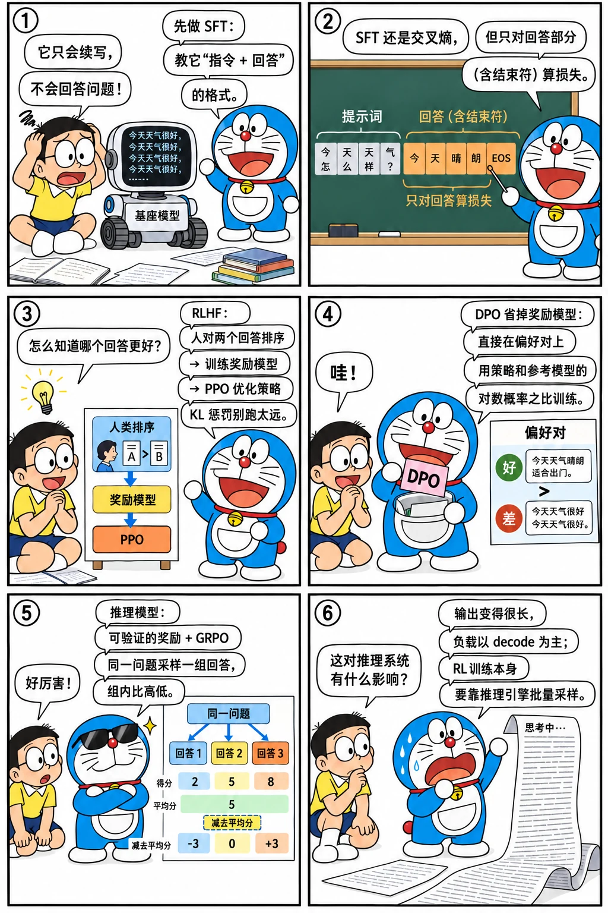
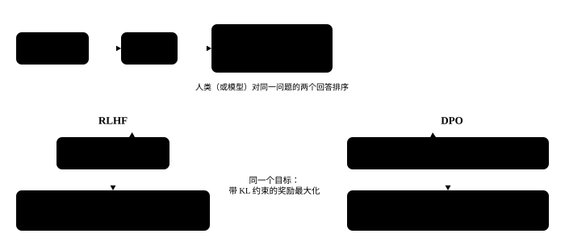

# 后训练：SFT、RLHF 与推理模型

<p class="lead">预训练得到的"基座模型"只会续写文本。让它变成能对话、会拒绝、擅长推理的助手，靠的是后训练：监督微调（SFT）、基于偏好的对齐（RLHF、DPO），以及近两年兴起的、以可验证奖励做强化学习的推理模型训练。这些过程决定了模型的输出长什么样，也深刻影响了推理负载的形态。</p>

!!! question "自测：能答上来就可以跳过本章"
    1. SFT 的损失和预训练有什么不同？为什么只对回答部分计算损失？
    2. RLHF 的流程是什么？奖励模型怎么训练？
    3. DPO 的损失函数是什么？它为什么不需要奖励模型和 PPO？
    4. DeepSeek-R1 这类推理模型是怎么训练出来的？GRPO 的优势（advantage）怎么算？
    5. 推理模型对推理服务有什么影响？LoRA 呢？

??? success "自测参考答案（先自己答，再展开对照）"
    1. 损失函数一样是交叉熵，但数据是"指令 + 回答"的格式，只对回答部分（含结束符）计算损失：提示词是给定的条件，不需要模型学会生成它，算进去反而会学到提示词的分布。
    2. SFT → 训练奖励模型 → 用 PPO 优化策略，同时用 KL 惩罚防止偏离 SFT 模型太远。奖励模型在"同一个提示词的两个回答、哪个更好"的人类偏好数据上训练，用 Bradley-Terry 损失 $-\log \sigma(r_w - r_l)$。
    3. $L = -\log \sigma\big(\beta[\log \tfrac{\pi(y_w)}{\pi_{ref}(y_w)} - \log \tfrac{\pi(y_l)}{\pi_{ref}(y_l)}]\big)$。带 KL 约束的奖励最大化有闭式解，奖励可以用策略与参考模型的对数概率之比表示，代入偏好模型就得到只需要策略本身的损失，不用奖励模型，也不用 RL 的采样。
    4. 冷启动 SFT → 大规模 RL（可验证的奖励：答案对不对、格式对不对，用 GRPO）→ 拒绝采样出新的 SFT 数据 → 再做一轮覆盖各种场景的 RL。GRPO 对同一个问题采样一组回答，优势 = (奖励 − 组内平均) ÷ 组内标准差，不需要价值模型。
    5. 推理模型让输出变得很长，负载以 decode 为主，KV 和尾延迟压力大；RL 训练本身要靠推理引擎批量采样。LoRA 只训练低秩增量，可以合并进权重，也可以保持分离，让一个实例同时服务很多个适配器。

先看一个六格小剧场，再读正文：

{.aig-comic}

## 基座模型与对话模型

基座模型（Base）是预训练的直接产物，它续写文本，但不遵循指令：问它一个问题，它可能接着出几道类似的题。[第一章](../basics/language-model.md#看一眼真实模型的输出)看到的"填空题"现象就是这种倾向。对话模型（Instruct / Chat）经过后训练，学会了在[对话模板](../basics/tokenization.md#特殊-token-与对话模板)的格式下扮演助手。

## SFT：监督微调

用人工或模型生成的高质量"指令 → 回答"数据继续训练。损失函数仍然是交叉熵，但有一个关键区别：**只对助手回答的 token 计算损失**，系统提示和用户输入部分的标签设为 -100（PyTorch 的 `cross_entropy` 会忽略它们）。模型要学的是"怎么回答"，而不是"怎么提问"。

```python
import torch
from transformers import AutoTokenizer

tok = AutoTokenizer.from_pretrained("models/Qwen3-0.6B")
msgs = [{"role": "user", "content": "中国的首都是哪里？"},
        {"role": "assistant", "content": "中国的首都是北京。"}]
prompt = tok.apply_chat_template(msgs[:1], tokenize=False, add_generation_prompt=True, enable_thinking=False)
full = tok.apply_chat_template(msgs, tokenize=False)
assert full.startswith(prompt)                       # 完整对话 = 提示部分 + 回答部分

input_ids = tok(full).input_ids
n_prompt = len(tok(prompt).input_ids)
labels = [-100] * n_prompt + input_ids[n_prompt:]    # 只对回答部分计算损失
trained = tok.decode([t for t, l in zip(input_ids, labels) if l != -100])
print(repr(trained))
assert trained.startswith("中国的首都是北京。<|im_end|>")   # 结束符也要学，模型才知道何时停止
```

注意 `<|im_end|>` 也在需要学习的部分里：模型必须学会在回答结束时输出结束符，否则推理时它会一直生成下去。

## RLHF：基于人类反馈的强化学习

SFT 教模型模仿好的回答，但"好"很难完全用示范数据表达。RLHF（InstructGPT，2022）让人对模型的多个回答排序，再用这些偏好优化模型：

1. **训练奖励模型**：给定同一个问题的两个回答（人类偏好的 $y_w$ 和不偏好的 $y_l$），让奖励模型给 $y_w$ 打更高的分。损失（Bradley-Terry 模型）：$\mathcal{L} = -\log \sigma\big(r(x, y_w) - r(x, y_l)\big)$；
2. **强化学习**：用 PPO 算法优化语言模型（策略），最大化奖励模型的打分，同时加一个 KL 惩罚，防止偏离 SFT 模型太远（否则会"钻奖励模型的空子"）。

PPO 需要同时维护策略模型、参考模型、奖励模型、价值模型四个模型，工程上非常复杂。

{.aig-svg}

## DPO：直接偏好优化

DPO（Rafailov 等，2023）证明了：带 KL 约束的奖励最大化问题有一个闭式解，可以把奖励直接用策略模型和参考模型的对数概率之比表示。于是不需要单独的奖励模型和强化学习，直接在偏好数据上用一个分类式的损失训练：

$$
\mathcal{L}_{\text{DPO}} = -\log \sigma\Big(\beta \big[(\log \pi_\theta(y_w|x) - \log \pi_{\text{ref}}(y_w|x)) - (\log \pi_\theta(y_l|x) - \log \pi_{\text{ref}}(y_l|x))\big]\Big)
$$

这个损失只是一条曲线：横轴是方括号里的差（margin），β 决定曲线多陡。拨一拨 β 看损失和梯度怎么变：

<div class="aig-widget" data-widget="dpo-loss"></div>

直观地说：让模型相对参考模型，更提高好回答的概率、更降低差回答的概率。其中的核心运算是**计算一段回答在模型下的对数概率**，这也是 RL 训练中的基本操作。在真实模型上算一下：

```python
from transformers import AutoModelForCausalLM

model = AutoModelForCausalLM.from_pretrained("models/Qwen3-0.6B", dtype=torch.float32).eval()

@torch.no_grad()
def response_logprob(model, prompt_ids, response_ids):
    """回答部分每个 token 的对数概率之和：log π(y | x)"""
    ids = torch.tensor([prompt_ids + response_ids])
    logp = model(ids).logits[0, :-1].log_softmax(-1)
    targets = ids[0, 1:]
    token_logp = logp.gather(1, targets[:, None]).squeeze(1)
    return token_logp[len(prompt_ids) - 1:].sum().item()     # 只取回答部分

prompt_ids = tok(prompt).input_ids
good = response_logprob(model, prompt_ids, tok("中国的首都是北京。").input_ids)
bad = response_logprob(model, prompt_ids, tok("中国的首都是上海。").input_ids)
print(f"log π(北京) = {good:.2f}，log π(上海) = {bad:.2f}")
assert good > bad

def dpo_loss(pi_w, pi_l, ref_w, ref_l, beta=0.1):
    return -torch.nn.functional.logsigmoid(beta * ((pi_w - ref_w) - (pi_l - ref_l)))

# 策略比参考模型更偏好好回答时损失更小
t = torch.tensor
assert dpo_loss(t(-5.0), t(-9.0), t(-6.0), t(-8.0)) < dpo_loss(t(-6.0), t(-8.0), t(-6.0), t(-8.0))
```

## 推理模型：用可验证的奖励做强化学习

OpenAI o1、DeepSeek-R1 等"推理模型"在回答前先生成很长的思考过程（DeepSeek-R1 用 `<think>...</think>` 包裹），准确率随思考长度提升。DeepSeek-R1 的关键做法：

**可验证奖励（RLVR）**：在数学、代码等答案可以自动判定对错的任务上，奖励就是"答案对不对"（加上格式奖励），不需要训练奖励模型。

**GRPO**：对同一个问题采样一组（比如 16 个）回答，用组内奖励的均值和标准差做归一化，作为每个回答的优势（advantage），省掉了 PPO 中的价值模型：

```python
rewards = torch.tensor([1.0, 0.0, 0.0, 1.0, 1.0, 0.0, 0.0, 0.0])   # 8 个采样回答，对了记 1 分
adv = (rewards - rewards.mean()) / (rewards.std() + 1e-6)
print([round(a, 2) for a in adv.tolist()])
assert adv[rewards == 1].min() > 0 > adv[rewards == 0].max()        # 答对的被鼓励，答错的被抑制
```

答对的回答（在这一组里）得到正的优势，其 token 的概率被提高；答错的被降低。随着训练，模型自发地学会了更长、更仔细的思考，包括验证和回溯。

**蒸馏**：用大推理模型生成的思考过程对小模型做 SFT，小模型也能获得不错的推理能力（DeepSeek-R1 发布了基于 Qwen、LLaMA 蒸馏的系列小模型）。

!!! inference "推理视角"
    - **推理模型让负载变成"长输出"**：一次回答动辄几千到几万个 token 的思考过程，decode 阶段占主导，KV Cache 随输出不断增长。decode 的速度（TPOT）、长序列的 KV Cache 管理、投机解码的重要性都大大提高；
    - **RL 训练本身重度依赖推理引擎**：GRPO 这类方法每一步都要为大量问题采样多个回答（rollout），这部分往往占 RL 训练时间的大头。verl、OpenRLHF 等 RL 框架都把 vLLM 或 SGLang 作为采样引擎，并要在训练和推理引擎之间高效地同步权重；
    - **对话模板必须一致**：后训练使用的模板（包括思考标签的格式）就是推理时必须使用的格式。

## LoRA：低秩微调

全参数微调需要为每个参数保存梯度和优化器状态（[约 16 字节/参数](pretraining.md#训练的显存)）。**LoRA** 冻结原始权重 $W$，只训练一个低秩的增量：

$$
W' = W + \frac{\alpha}{r} BA,\qquad A \in \mathbb{R}^{r \times d_{in}},\ B \in \mathbb{R}^{d_{out} \times r},\ r \ll d
$$

$B$ 初始化为 0，训练开始时 $W' = W$。训练完成后，可以把 $BA$ 合并进 $W$，推理时没有任何额外开销；也可以保持分离：

```python
torch.manual_seed(0)
d_in, d_out, r, alpha = 896, 896, 8, 16
W = torch.randn(d_out, d_in)
A = torch.randn(r, d_in) * 0.01
B = torch.randn(d_out, r) * 0.01                     # 训练后 B 不再为 0
x = torch.randn(5, d_in)

y_separate = x @ W.T + (alpha / r) * (x @ A.T) @ B.T  # 不合并：原矩阵乘 + 两个小矩阵乘
W_merged = W + (alpha / r) * B @ A
y_merged = x @ W_merged.T                             # 合并后：和原模型一样的计算量
assert torch.allclose(y_separate, y_merged, atol=1e-4)
print(f"LoRA 参数 {A.numel() + B.numel():,}，原矩阵 {W.numel():,}（{(A.numel() + B.numel()) / W.numel():.1%}）")
```

换模型、换秩、换目标模块，看可训练参数和训练显存怎么变：

<div class="aig-widget" data-widget="lora-params"></div>

!!! inference "推理视角"
    保持 LoRA 分离有一个重要用途：**一个基座模型同时服务多个 LoRA 适配器**。同一个 batch 中不同请求使用不同的 LoRA，基座部分一起算，LoRA 部分用专门的分组 kernel 计算（Punica、S-LoRA 的思路），vLLM、SGLang 都支持多 LoRA 服务。这样一张卡上可以同时部署几十上百个"定制模型"。

!!! interview "面试怎么答"
    后训练对推理的影响是常见追问：SFT 只对回答部分算损失；RLHF = 奖励模型 + PPO + KL 约束，DPO 用对数概率之比直接在偏好对上训练；推理模型用可验证的奖励和 GRPO（组内归一化的奖励作为优势）训练，思考过程很长。对推理系统的影响：负载以长输出为主，decode 占绝大部分时间；RL 训练本身要靠推理引擎做 rollout；LoRA 可以合并进权重，也可以保持分离、支持多 LoRA 服务。

## 练习

**1. 标签掩码。** 如果 SFT 时忘了把用户输入部分的标签设为 -100，会发生什么？

??? success "参考答案"
    模型也会学习"生成用户的问题"。一方面浪费了训练信号，稀释了回答部分的学习；另一方面，模型可能在回答结束后继续"扮演用户"生成下一个问题，因为它学到了整段对话的分布。对于多轮对话数据，还要注意每一轮助手回答都需要计算损失，而每一轮的用户输入都要屏蔽。

**2. 计算题。** 对 Qwen2.5-7B（d = 3584，28 层）的每一层 q、k、v、o、gate、up、down 七个投影都加 r = 16 的 LoRA，一共多少可训练参数？（k、v 投影的输出维度是 512，gate、up 的输出维度是 18944。）

??? success "参考答案"
    每个 LoRA 的参数量是 r × (d_in + d_out)。

    ```python
    r, d, dff, dkv, L = 16, 3584, 18944, 512, 28
    shapes = [(d, d), (d, dkv), (d, dkv), (d, d), (d, dff), (d, dff), (dff, d)]   # (d_in, d_out)
    per_layer = sum(r * (i + o) for i, o in shapes)
    print(f"{per_layer * L / 1e6:.1f}M")   # 约 40.4M，只有总参数的 0.5%
    ```

## 小结

- [x] SFT 用交叉熵训练，但只对回答部分（含结束符）计算损失。
- [x] RLHF = 奖励模型 + PPO + KL 约束；DPO 用对数概率之比直接在偏好数据上训练。
- [x] 推理模型用可验证奖励和 GRPO 训练，组内归一化的奖励作为优势，产生很长的思考过程。
- [x] 推理模型让负载以长输出为主；RL 训练本身依赖推理引擎做采样。
- [x] LoRA 训练低秩增量，可合并进权重，也可保持分离以支持多 LoRA 服务。
