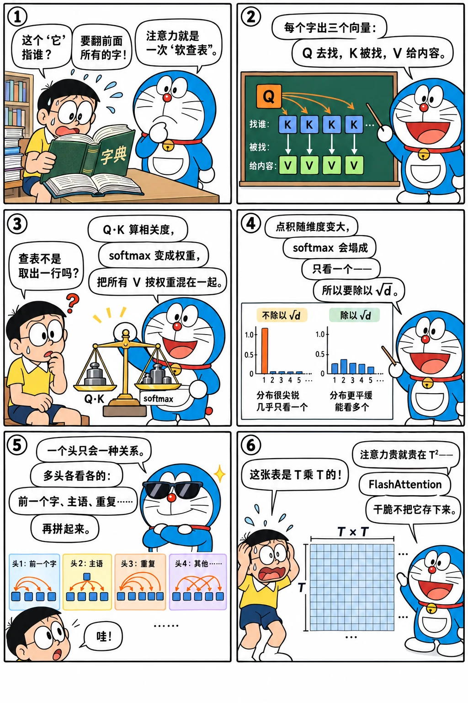

# 注意力机制

<p class="lead">注意力是 Transformer 里唯一让不同 token 之间交换信息的地方，其余所有运算都是逐个 token 独立进行的。理解注意力的计算、形状和复杂度，就理解了长上下文为什么昂贵、KV Cache 为什么存在、FlashAttention 和 PagedAttention 在优化什么。</p>

!!! question "自测：能答上来就可以跳过本章"
    1. 写出缩放点积注意力的公式。Q、K、V 分别从哪里来？
    2. 为什么要除以 $\sqrt{d_h}$？
    3. 因果掩码是怎么实现的？
    4. 多头注意力为什么比单头好？多头之后的 `o_proj` 做什么？
    5. 序列长度为 T 时，注意力的计算量和显存随 T 怎么增长？

??? success "自测参考答案（先自己答，再展开对照）"
    1. $\mathrm{Attention}(Q, K, V) = \mathrm{softmax}(QK^\top / \sqrt{d_h} + M)\,V$，Q、K、V 都是输入 x 分别乘以三个投影矩阵得到的。
    2. 点积的方差随维度 $d_h$ 线性增长，不缩放时分数很大，softmax 趋于 one-hot、梯度接近 0；除以 $\sqrt{d_h}$ 把方差拉回 1 附近。
    3. 在 softmax 之前把 $j > i$ 的位置加上 $-\infty$（上三角掩码），这些位置的权重变成 0。有 KV Cache 时，新 token 的位置从历史长度开始，对角线要右移历史长度。
    4. 一个头只能表达一种"相关度"，多头让不同的头关注不同的关系（前一个 token、语法、重复的内容等）；各头的输出拼起来后，`o_proj` 把它们混合回隐藏维度。
    5. 计算量约 $O(T^2 d)$，分数矩阵的存储 $O(T^2)$（FlashAttention 不物化它，显存降到 $O(T)$）；decode 时每步要读全部历史 KV，时间随上下文线性增长。

先看一个六格小剧场，再读正文：

{.aig-comic}

## 直觉：可微分的"查表"

每个 token 想从其他 token 那里获取信息。注意力让每个位置生成三个向量：

- **Query（查询）**：我在找什么；
- **Key（键）**：我有什么（供别人匹配）；
- **Value（值）**：如果你选中我，我给你的内容。

位置 i 用自己的 query 和所有位置的 key 做点积，得到"相关度"，softmax 成权重，再用这些权重对所有位置的 value 加权求和。这就像一次"软"查表：不是精确地取出一行，而是按相关度把所有行混合起来。

把 key 画成平面上的点，拖着 query 到处走，就能看到"软查表"是什么意思：

<div class="aig-widget" data-widget="attention2d"></div>

## 缩放点积注意力

对输入 $X \in \mathbb{R}^{T \times d}$，先用三个线性层得到 $Q = XW_Q$、$K = XW_K$、$V = XW_V$，然后：

$$
\text{Attention}(Q, K, V) = \text{softmax}\left(\frac{QK^\top}{\sqrt{d_h}} + M\right) V
$$

- $QK^\top$ 是 $T \times T$ 的分数矩阵，第 i 行第 j 列是位置 i 对位置 j 的相关度；
- 除以 $\sqrt{d_h}$：点积的尺度随维度增长（约为 $\sqrt{d_h}$，见[数学预备](../basics/math-torch.md#点积与相似度)），不缩放的话 softmax 会过于尖锐，训练不稳定；
- $M$ 是掩码，被屏蔽的位置加上 $-\infty$，softmax 之后权重为 0；
- 结果乘以 V，得到每个位置"读到"的信息，形状 $T \times d_h$。

```python
import math
import torch
import torch.nn.functional as F

def attention(q, k, v, causal=True):
    """q, k, v: [B, H, T, D]"""
    T, S = q.shape[-2], k.shape[-2]
    scores = q @ k.transpose(-2, -1) / math.sqrt(q.shape[-1])      # [B, H, T, S]
    if causal:
        mask = torch.ones(T, S, dtype=torch.bool).tril(diagonal=S - T)
        scores = scores.masked_fill(~mask, float("-inf"))
    return scores.softmax(dim=-1) @ v                               # [B, H, T, D]

torch.manual_seed(0)
q, k, v = (torch.randn(2, 4, 10, 16) for _ in range(3))
ours = attention(q, k, v)
ref = F.scaled_dot_product_attention(q, k, v, is_causal=True)      # PyTorch 内置实现
assert torch.allclose(ours, ref, atol=1e-5)
```

## 因果掩码

语言模型预测第 i 个位置之后的 token 时，只能看到前 i 个 token，不能"偷看"后面的答案。所以分数矩阵的上三角部分要屏蔽掉：

{.aig-svg}

```pycon
>>> import torch
>>> T = 5
>>> mask = torch.ones(T, T, dtype=torch.bool).tril()
>>> mask.int()
tensor([[1, 0, 0, 0, 0],
        [1, 1, 0, 0, 0],
        [1, 1, 1, 0, 0],
        [1, 1, 1, 1, 0],
        [1, 1, 1, 1, 1]], dtype=torch.int32)
```

第 i 行只有前 i+1 个位置可见。正是因为这个掩码，训练时一次前向就能并行计算所有位置的预测（每个位置的输出只依赖它之前的内容，见[语言模型](../basics/language-model.md#训练可以并行推理只能串行)）。

上面代码里的 `tril(diagonal=S - T)` 处理了一个推理时很关键的情况：**query 比 key 少**。使用 KV Cache 时，新输入的 T 个 token 要和包括历史在内的 S 个 key 做注意力，新 token 的绝对位置是 S−T 到 S−1，所以对角线要右移 S−T：

```pycon
>>> T, S = 2, 5          # 2 个新 token，加上 3 个历史 token，共 5 个 key
>>> torch.ones(T, S, dtype=torch.bool).tril(diagonal=S - T).int()
tensor([[1, 1, 1, 1, 0],
        [1, 1, 1, 1, 1]], dtype=torch.int32)
```

decode 时 T = 1，新 token 可以看到全部 S 个 key，掩码全为 1，实际上不需要掩码。

因果掩码只是最常见的一种。下面可以切换几种实际系统里常用的掩码，并按块统计有多少块能整块跳过——FlashAttention 就是按块计算的（见 CUDA 手册的 [FlashAttention](cuda://advanced/attention/)），所以掩码的形状直接决定了计算量：

<div class="aig-widget" data-widget="mask"></div>

## 多头注意力

一个注意力"头"只能表达一种相关度模式。**多头注意力**把 d 维拆成 $n_h$ 个 $d_h$ 维的头（$d = n_h \times d_h$），每个头独立计算注意力，关注不同的关系（有的头关注前一个 token，有的关注语法上的主语，有的关注重复出现的内容），最后把各头的输出拼接起来，再经过一个输出投影 $W_O$（`o_proj`）混合：

{.aig-svg}

```python
import torch.nn as nn

class MultiHeadAttention(nn.Module):
    def __init__(self, d, n_heads):
        super().__init__()
        self.nh, self.hd = n_heads, d // n_heads
        self.q_proj, self.k_proj, self.v_proj = (nn.Linear(d, d, bias=False) for _ in range(3))
        self.o_proj = nn.Linear(d, d, bias=False)

    def forward(self, x):                                            # x: [B, T, d]
        B, T, d = x.shape
        split = lambda t: t.view(B, T, self.nh, self.hd).transpose(1, 2)   # -> [B, nh, T, hd]
        q, k, v = split(self.q_proj(x)), split(self.k_proj(x)), split(self.v_proj(x))
        out = attention(q, k, v)                                    # [B, nh, T, hd]
        return self.o_proj(out.transpose(1, 2).reshape(B, T, d))    # 拼接各头，再做输出投影

mha = MultiHeadAttention(64, 4)
x = torch.randn(2, 10, 64)
assert mha(x).shape == (2, 10, 64)

# 因果性检验：改动最后一个 token，前面位置的输出不应该变化
x2 = x.clone()
x2[:, -1] += 1.0
assert torch.allclose(mha(x)[:, :-1], mha(x2)[:, :-1], atol=1e-6)
assert not torch.allclose(mha(x)[:, -1], mha(x2)[:, -1])
```

真实模型里 K、V 的头数可以少于 Q 的头数（GQA），这是推理优化中非常重要的设计，放在[注意力变体](attention-variants.md)一章单独讲。

## 真实模型里的注意力：注意力汇聚

用 Qwen3-0.6B 看看训练好的注意力权重。一个很普遍的现象是：**大量注意力集中在第一个 token 上**：

```pycon
>>> from transformers import AutoModelForCausalLM, AutoTokenizer
>>> path = "models/Qwen3-0.6B"
>>> tok = AutoTokenizer.from_pretrained(path)
>>> model = AutoModelForCausalLM.from_pretrained(path, dtype=torch.float32, attn_implementation="eager").eval()
>>> text = "推理优化的核心是减少访存。大模型在解码阶段每生成一个词，都要读取全部的权重和缓存。"
>>> ids = tok(text, return_tensors="pt").input_ids
>>> with torch.no_grad():
...     att = model(ids, output_attentions=True).attentions   # 每层一个 [B, n_h, T, T]
>>> T = ids.shape[1]
>>> T, len(att), tuple(att[0].shape)
(29, 28, (1, 16, 29, 29))
>>> for layer in [0, 2, 6, 13, 20, 27]:          # 后一半 query 平均分给第 0 个位置的注意力
...     print(layer, round(att[layer][0, :, T // 2:, 0].mean().item(), 3))
0 0.006
2 0.028
6 0.555
13 0.426
20 0.677
27 0.769
```

如果注意力均匀分布，第 0 个位置平均只能分到约 5% 的权重；但从第 6 层起，它拿到了 40%～77%，越往后越多。这个现象叫**注意力汇聚（attention sink）**：softmax 要求权重之和为 1，当一个头"不需要"从任何位置读取信息时，就把权重堆在一个固定的位置上（通常是第一个 token），相当于"什么都不做"。

!!! inference "推理视角"
    注意力汇聚对推理有直接影响：StreamingLLM 等长文本方法发现，如果为了省显存丢掉最早的 KV Cache（滑动窗口），**必须保留最开始的几个 token**，否则模型会崩溃。有些新模型（比如 OpenAI 的 gpt-oss）直接在注意力里加入可学习的"汇聚"参数来显式处理这个问题，推理 kernel 也要相应支持。

## 复杂度：注意力为什么贵

对一个长度为 T 的序列、隐藏维度 d：

| 部分 | 计算量 | 说明 |
| --- | --- | --- |
| Q、K、V、O 四个投影 | 约 $4 \times 2Td^2 = 8Td^2$ | 与 T 线性相关（GQA 下 K、V 更小） |
| $QK^\top$ | $2T^2 d$ | 与 T 平方相关 |
| 乘以 V | $2T^2 d$ | 与 T 平方相关 |
| 分数矩阵的存储 | $n_h \times T^2$ 个数 | 与 T 平方相关 |

T 较小时，投影（线性层）占主导；T 超过几千，$T^2$ 项就变得显著。更麻烦的是分数矩阵的存储：T = 32768 时，每个头就有 10 亿个元素。**FlashAttention** 的全部意义，就是通过分块计算和 online softmax，避免把这个 $T \times T$ 的矩阵写到显存里，参见 CUDA 手册的 [FlashAttention](cuda://advanced/attention/)。

!!! inference "推理视角"
    - **注意力是唯一依赖"历史"的运算**：线性层、归一化、激活都是逐 token 独立计算的，不同请求的 token 可以直接拼成一个大矩阵一起算；注意力却要让每个请求的 query 只和**它自己的** K、V 计算。这就是批处理时注意力需要特殊处理的原因（每个请求的 KV 长度不同、存放位置不同），也是 PagedAttention 这类设计的出发点；
    - **prefill 和 decode 的注意力性质不同**：prefill 时 T 个 query 对 T 个 key，是计算密集的矩阵乘；decode 时 1 个 query 对 S 个 key，要把整个 KV Cache 读一遍却只做很少的计算，是访存瓶颈，见 [KV Cache](../inference/kv-cache.md)。

!!! interview "面试怎么答"
    注意力的基础题要答出推理视角：公式是 $\mathrm{softmax}(QK^\top/\sqrt{d_h} + M)\,V$，除以 $\sqrt{d_h}$ 防止点积随维度变大、softmax 饱和；有 KV Cache 时因果掩码的对角线要右移历史长度；多头并行学习多种关系，由 `o_proj` 混合。成本：计算和存储随 T 平方增长（FlashAttention 不物化 T×T 的矩阵），decode 时注意力是读 KV 的访存瓶颈；注意力汇聚让"丢掉早期的 KV"时必须保留开头的几个 token。

## 练习

**1. 计算量对比。** 对 d = 4096、T = 4096 的单层注意力（不考虑 GQA），分别计算四个投影和 $QK^\top$、$PV$ 两个矩阵乘的计算量。T 为多少时，后者开始超过前者？

??? success "参考答案"
    - 投影：$8Td^2 = 8 \times 4096 \times 4096^2 ≈ 5.5 \times 10^{11}$；
    - 两个注意力矩阵乘：$4T^2d = 4 \times 4096^2 \times 4096 ≈ 2.7 \times 10^{11}$。

    令 $4T^2d = 8Td^2$，得 $T = 2d = 8192$。所以对这个尺寸的模型，序列长度超过约 8K 后，注意力本身的计算量超过投影。考虑到一层还有 FFN（约 $16Td^2$ 量级，取决于中间维度），注意力要到更长的序列才会成为主导。

    ```python
    d, T = 4096, 4096
    assert 8 * T * d**2 == 549_755_813_888 and 4 * T**2 * d == 274_877_906_944
    ```

**2. 实现练习。** 修改 `attention` 函数，支持一个额外的参数 `window`：每个 query 只能看到它之前最多 `window` 个 token（滑动窗口注意力）。

??? success "参考答案"
    ```python
    import math
    import torch

    def sliding_window_attention(q, k, v, window):
        T, S = q.shape[-2], k.shape[-2]
        scores = q @ k.transpose(-2, -1) / math.sqrt(q.shape[-1])
        qpos = torch.arange(S - T, S)[:, None]         # query 的绝对位置
        kpos = torch.arange(S)[None, :]
        allowed = (kpos <= qpos) & (kpos > qpos - window)
        return scores.masked_fill(~allowed, float("-inf")).softmax(-1) @ v

    q, k, v = (torch.randn(1, 2, 8, 4) for _ in range(3))
    out = sliding_window_attention(q, k, v, window=3)
    # 窗口足够大时退化成普通因果注意力
    full = sliding_window_attention(q, k, v, window=100)
    ref = torch.nn.functional.scaled_dot_product_attention(q, k, v, is_causal=True)
    assert torch.allclose(full, ref, atol=1e-5) and out.shape == ref.shape
    ```

    Mistral、Gemma、gpt-oss 等模型在部分层或全部层使用滑动窗口，这些层的 KV Cache 只需保留最近 window 个 token。

## 小结

- [x] 注意力 = softmax(QKᵀ/√d_h + 掩码)·V，是 token 之间交换信息的唯一途径。
- [x] 因果掩码屏蔽未来位置；有 KV Cache 时掩码的对角线要偏移历史长度。
- [x] 多头注意力并行学习多种关系，最后由 o_proj 混合。
- [x] 真实模型普遍存在注意力汇聚，丢弃早期 KV 时要保留开头的 token。
- [x] 注意力的计算和存储随 T 平方增长；decode 时的注意力是读 KV Cache 的访存瓶颈。
