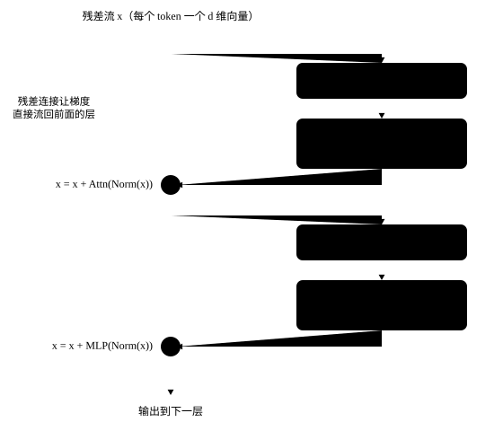

# 从零组装一个大模型

<p class="lead">前面几章分别讲了嵌入、注意力、RoPE、RMSNorm 和 SwiGLU。这一章把它们拼起来，写出一个约 200 行的 <code>mini_llm.py</code>，加载真实的 Qwen3-0.6B 权重，逐项和 Hugging Face transformers 的官方实现对比：logits 相同，生成的文字也一模一样。之后的章节都会在这份代码上做实验。</p>

!!! question "自测：能答上来就可以跳过本章"
    1. 一个 Decoder 层由哪几部分组成？数据经过它时形状怎么变化？
    2. 加载 Hugging Face 权重时，参数名是怎么对应的？
    3. 怎么验证自己写的模型和官方实现"一样"？要比较什么？
    4. 为什么用 transformers 的 `generate` 做贪心解码，结果可能和"每步取 argmax"不同？
    5. 这份代码和 vLLM 里的模型实现有哪些主要区别？

??? success "自测参考答案（先自己答，再展开对照）"
    1. RMSNorm → 注意力（q / k / v 投影、QK-Norm、RoPE、GQA 注意力、`o_proj`）→ 残差相加 → RMSNorm → SwiGLU FFN → 残差相加。输入输出都是 `[B, T, d]`，中间 q 是 `[B, n_h, T, d_h]`、FFN 的中间维度是 `d_ff`。
    2. 模块的属性名和 Hugging Face 保持一致（`q_proj`、`input_layernorm`、`mlp.gate_proj`……），权重文件里的键只要去掉 `model.` 前缀就能一一对上。
    3. 在同样的输入上比较 logits 的最大绝对误差（fp32 下远小于 logits 本身的量级，本章用 1e-3 作为阈值），再比较贪心生成的 token 序列是否完全一致。
    4. `generate` 会读取 `generation_config.json` 里的默认参数（可能开了采样、重复惩罚等），不显式关掉就不是纯贪心；此外它和手写循环的计算方式不同，浮点误差可能让接近平局的 token 翻转。
    5. vLLM 融合了投影（QKV 合并、gate / up 合并）和逐元素运算、用可切分的并行线性层、可替换的注意力后端，KV Cache 是分页的，一次前向处理变长的一批请求（扁平的 token 加上批处理元数据）。

## 整体结构

```text
input_ids [B, T]
  │ embed_tokens                                  查表
  ▼
x [B, T, d] ──────────────────────────────┐  残差流
  │ × L 层                                  │
  │   input_layernorm (RMSNorm)             │
  │   self_attn: q/k/v_proj → QK-Norm → RoPE → GQA 注意力 → o_proj
  │   x = x + attn_out  ◄────────────────── ┤
  │   post_attention_layernorm (RMSNorm)    │
  │   mlp: down(silu(gate(x)) * up(x))      │
  │   x = x + mlp_out   ◄────────────────── ┘
  ▼
norm (RMSNorm) → lm_head → logits [B, T, V]
```

{.aig-svg}

以 Qwen3-0.6B 为例（d = 1024，16 个 query 头，8 个 KV 头，$d_h$ = 128，$d_{ff}$ = 3072，28 层），一层里张量的形状变化：

| 步骤 | 形状 |
| --- | --- |
| 输入 | `[B, T, 1024]` |
| q_proj / k_proj / v_proj | `[B, T, 2048]` / `[B, T, 1024]` / `[B, T, 1024]` |
| 拆成多头 | q: `[B, 16, T, 128]`，k、v: `[B, 8, T, 128]` |
| QK-Norm、RoPE | 形状不变 |
| GQA：K、V 每个头复制 2 份 | `[B, 16, T, 128]` |
| 注意力分数 | `[B, 16, T, T]` |
| 注意力输出，合并多头 | `[B, T, 2048]` |
| o_proj | `[B, T, 1024]` |
| gate_proj、up_proj | `[B, T, 3072]` |
| down_proj | `[B, T, 1024]` |

注意 q_proj 的输出是 2048 维，比隐藏维度还大：Qwen3 的 $d_h$ 单独配置成 128，头数 × 头维（16 × 128）不再等于 d。所以代码里的头维要从 `config.json` 的 `head_dim` 读，不能用 `hidden_size // num_attention_heads` 推算。Qwen3 和 Qwen2 的另一个区别是 **QK-Norm**：q、k 在做 RoPE 之前，先按头各做一次 RMSNorm（权重长度为 $d_h$），让注意力分数的数值范围更稳定；同时去掉了 q、k、v 投影的偏置。

## 完整代码

参数名和 Hugging Face 的命名保持一致（`q_proj`、`input_layernorm`……），这样加载权重时只需要去掉一个 `model.` 前缀。

```python title="mini_llm.py"
"""mini_llm.py —— 从零实现的 LLaMA / Qwen2 / Qwen3 结构的解码器模型（约 200 行），可以加载真实权重。

结构：Embedding → N × [RMSNorm → 注意力(GQA + QK-Norm + RoPE) → 残差 → RMSNorm → SwiGLU MLP → 残差] → RMSNorm → LM Head
"""

import json
import math
from dataclasses import dataclass
from pathlib import Path

import torch
import torch.nn as nn
import torch.nn.functional as F


@dataclass
class Config:
    vocab_size: int
    hidden_size: int
    intermediate_size: int
    num_hidden_layers: int
    num_attention_heads: int
    num_key_value_heads: int
    rms_norm_eps: float = 1e-6
    rope_theta: float = 10000.0
    attention_bias: bool = False          # Qwen2 的 q/k/v 投影带偏置，LLaMA、Qwen3 不带
    qk_norm: bool = False                 # Qwen3：q、k 在 RoPE 之前按头各做一次 RMSNorm
    tie_word_embeddings: bool = False     # 输出层是否与词嵌入共享权重
    head_dim: int | None = None

    @property
    def hd(self) -> int:
        return self.head_dim or self.hidden_size // self.num_attention_heads

    @classmethod
    def from_json(cls, path: str | Path) -> "Config":
        c = json.loads(Path(path).read_text())
        return cls(
            vocab_size=c["vocab_size"], hidden_size=c["hidden_size"], intermediate_size=c["intermediate_size"],
            num_hidden_layers=c["num_hidden_layers"], num_attention_heads=c["num_attention_heads"],
            num_key_value_heads=c.get("num_key_value_heads", c["num_attention_heads"]),
            rms_norm_eps=c.get("rms_norm_eps", 1e-6), rope_theta=c.get("rope_theta", 10000.0),
            attention_bias=c.get("attention_bias", c.get("model_type") == "qwen2"), qk_norm=c.get("model_type") == "qwen3",
            tie_word_embeddings=c.get("tie_word_embeddings", False), head_dim=c.get("head_dim"),
        )


class RMSNorm(nn.Module):
    def __init__(self, dim: int, eps: float):
        super().__init__()
        self.eps = eps
        self.weight = nn.Parameter(torch.ones(dim))

    def forward(self, x):
        dtype = x.dtype
        x = x.float()                                              # 统计量用 FP32 计算
        x = x * torch.rsqrt(x.pow(2).mean(-1, keepdim=True) + self.eps)
        return self.weight * x.to(dtype)


def rope_cos_sin(positions: torch.Tensor, head_dim: int, theta: float):
    """返回 [T, head_dim] 的 cos、sin 表。第 i 对维度的旋转频率为 theta^(-2i/d)。"""
    inv_freq = 1.0 / (theta ** (torch.arange(0, head_dim, 2, dtype=torch.float32) / head_dim))
    freqs = positions.float()[:, None] * inv_freq[None, :]        # [T, head_dim/2]
    emb = torch.cat([freqs, freqs], dim=-1)                       # [T, head_dim]
    return emb.cos(), emb.sin()


def rotate_half(x):
    x1, x2 = x.chunk(2, dim=-1)
    return torch.cat([-x2, x1], dim=-1)


def apply_rope(x, cos, sin):
    """x: [B, H, T, D]；把第 i 维和第 i + D/2 维看成一个二维向量，按位置旋转。"""
    return (x * cos + rotate_half(x) * sin).to(x.dtype)


class KVCache:
    """每层保存到目前为止所有 token 的 K、V：[B, n_kv_heads, S, head_dim]。"""

    def __init__(self, num_layers: int):
        self.k = [None] * num_layers
        self.v = [None] * num_layers

    def update(self, layer: int, k, v):
        if self.k[layer] is not None:
            k = torch.cat([self.k[layer], k], dim=2)
            v = torch.cat([self.v[layer], v], dim=2)
        self.k[layer], self.v[layer] = k, v
        return k, v

    @property
    def length(self) -> int:
        return 0 if self.k[0] is None else self.k[0].shape[2]


class Attention(nn.Module):
    def __init__(self, cfg: Config, layer: int):
        super().__init__()
        self.layer, self.nh, self.nkv, self.hd = layer, cfg.num_attention_heads, cfg.num_key_value_heads, cfg.hd
        self.q_proj = nn.Linear(cfg.hidden_size, self.nh * self.hd, bias=cfg.attention_bias)
        self.k_proj = nn.Linear(cfg.hidden_size, self.nkv * self.hd, bias=cfg.attention_bias)
        self.v_proj = nn.Linear(cfg.hidden_size, self.nkv * self.hd, bias=cfg.attention_bias)
        self.o_proj = nn.Linear(self.nh * self.hd, cfg.hidden_size, bias=False)
        # QK-Norm：每个头的 q、k 各自做 RMSNorm（权重维度 head_dim）；没有 QK-Norm 的模型用恒等映射，调用方不必判断
        norm = (lambda: RMSNorm(self.hd, cfg.rms_norm_eps)) if cfg.qk_norm else nn.Identity
        self.q_norm, self.k_norm = norm(), norm()

    def forward(self, x, cos, sin, cache: KVCache | None = None):
        B, T, _ = x.shape
        q = self.q_proj(x).view(B, T, self.nh, self.hd).transpose(1, 2)    # [B, nh, T, hd]
        k = self.k_proj(x).view(B, T, self.nkv, self.hd).transpose(1, 2)   # [B, nkv, T, hd]
        v = self.v_proj(x).view(B, T, self.nkv, self.hd).transpose(1, 2)
        q, k = self.q_norm(q), self.k_norm(k)                               # 在 RoPE 之前
        q, k = apply_rope(q, cos, sin), apply_rope(k, cos, sin)
        if cache is not None:
            k, v = cache.update(self.layer, k, v)                           # 拼上历史 token 的 K、V
        S = k.shape[2]
        rep = self.nh // self.nkv                                           # GQA：每个 KV 头服务 rep 个 query 头
        k, v = k.repeat_interleave(rep, dim=1), v.repeat_interleave(rep, dim=1)
        scores = (q @ k.transpose(-2, -1)) / math.sqrt(self.hd)             # [B, nh, T, S]
        # 第 i 个新 token 的绝对位置是 S - T + i，只能看到位置不超过它的 key
        mask = torch.ones(T, S, dtype=torch.bool, device=x.device).tril(diagonal=S - T)
        scores = scores.masked_fill(~mask, float("-inf"))
        probs = scores.float().softmax(dim=-1).to(q.dtype)
        out = (probs @ v).transpose(1, 2).reshape(B, T, self.nh * self.hd)
        return self.o_proj(out)


class MLP(nn.Module):
    def __init__(self, cfg: Config):
        super().__init__()
        self.gate_proj = nn.Linear(cfg.hidden_size, cfg.intermediate_size, bias=False)
        self.up_proj = nn.Linear(cfg.hidden_size, cfg.intermediate_size, bias=False)
        self.down_proj = nn.Linear(cfg.intermediate_size, cfg.hidden_size, bias=False)

    def forward(self, x):
        return self.down_proj(F.silu(self.gate_proj(x)) * self.up_proj(x))   # SwiGLU


class DecoderLayer(nn.Module):
    def __init__(self, cfg: Config, layer: int):
        super().__init__()
        self.input_layernorm = RMSNorm(cfg.hidden_size, cfg.rms_norm_eps)
        self.self_attn = Attention(cfg, layer)
        self.post_attention_layernorm = RMSNorm(cfg.hidden_size, cfg.rms_norm_eps)
        self.mlp = MLP(cfg)

    def forward(self, x, cos, sin, cache=None):
        x = x + self.self_attn(self.input_layernorm(x), cos, sin, cache)   # 残差连接
        x = x + self.mlp(self.post_attention_layernorm(x))
        return x


class Transformer(nn.Module):
    def __init__(self, cfg: Config):
        super().__init__()
        self.cfg = cfg
        self.embed_tokens = nn.Embedding(cfg.vocab_size, cfg.hidden_size)
        self.layers = nn.ModuleList(DecoderLayer(cfg, i) for i in range(cfg.num_hidden_layers))
        self.norm = RMSNorm(cfg.hidden_size, cfg.rms_norm_eps)
        self.lm_head = nn.Linear(cfg.hidden_size, cfg.vocab_size, bias=False)
        if cfg.tie_word_embeddings:
            self.lm_head.weight = self.embed_tokens.weight

    def forward(self, input_ids, cache: KVCache | None = None):
        """input_ids: [B, T] → logits: [B, T, vocab]。有 cache 时，只需传入新 token。"""
        start = cache.length if cache is not None else 0
        positions = torch.arange(start, start + input_ids.shape[1], device=input_ids.device)
        cos, sin = rope_cos_sin(positions, self.cfg.hd, self.cfg.rope_theta)
        x = self.embed_tokens(input_ids)
        cos, sin = cos.to(x.dtype), sin.to(x.dtype)
        for layer in self.layers:
            x = layer(x, cos, sin, cache)
        return self.lm_head(self.norm(x))

    @classmethod
    def from_pretrained(cls, path: str | Path, dtype=torch.float32) -> "Transformer":
        """加载 Hugging Face 格式（config.json + *.safetensors）的 LLaMA / Qwen2 / Qwen3 权重。"""
        from safetensors.torch import load_file

        path = Path(path)
        model = cls(Config.from_json(path / "config.json"))
        state = {}
        for f in sorted(path.glob("*.safetensors")):
            state.update(load_file(f))
        state = {k.removeprefix("model."): v for k, v in state.items()}   # HF 的层名多一个 "model." 前缀
        if model.cfg.tie_word_embeddings:
            state.pop("lm_head.weight", None)
        missing, unexpected = model.load_state_dict(state, strict=False)
        missing = [m for m in missing if not (model.cfg.tie_word_embeddings and m == "lm_head.weight")]
        assert not missing and not unexpected, (missing, unexpected)
        return model.to(dtype).eval()


@torch.no_grad()
def generate(model: Transformer, input_ids, max_new_tokens: int, pick=lambda logits: logits.argmax(-1),
             eos_token_id: int | None = None):
    """自回归生成：prefill 一次处理整个提示词，之后每步只输入 1 个新 token（decode）。"""
    cache = KVCache(model.cfg.num_hidden_layers)
    logits = model(input_ids, cache)                  # prefill
    out = []
    for _ in range(max_new_tokens):
        next_id = pick(logits[:, -1, :])              # [B]
        out.append(next_id)
        if eos_token_id is not None and bool((next_id == eos_token_id).all()):
            break
        logits = model(next_id[:, None], cache)       # decode：只算新 token
    return torch.stack(out, dim=1)
```

几处值得注意的实现细节：

- **注意力掩码** `tril(diagonal=S - T)`：同时支持"整段输入"（S = T，普通的因果掩码）和"带缓存输入 T 个新 token"（新 token 能看到全部历史），见[注意力](attention.md#因果掩码)；
- **softmax 在 FP32 下计算**，与 RMSNorm 一样，这是和官方实现数值一致的关键；
- **GQA** 用 `repeat_interleave` 把 KV 头复制给对应的 query 头，简单但浪费内存，真正的推理 kernel 不会复制，见[注意力变体](attention-variants.md)；
- **KV Cache** 在这里只是一个按层保存 K、V 的列表，每步用 `torch.cat` 追加。原理见 [KV Cache](../inference/kv-cache.md)，这种"每步拼接"的做法在真实系统里会被预分配的分页内存代替。

## 验证一：和官方 LLaMA 实现对比

先用一个随机初始化的迷你 LLaMA 验证结构（LLaMA 的注意力投影没有偏置，这条代码路径和 Qwen2 不同）：

```python
import torch
from transformers import LlamaConfig, LlamaForCausalLM
from mini_llm import Config, Transformer

torch.manual_seed(0)
hf_cfg = LlamaConfig(vocab_size=1000, hidden_size=64, intermediate_size=172, num_hidden_layers=3,
                     num_attention_heads=8, num_key_value_heads=2, rope_theta=10000.0, tie_word_embeddings=False)
hf = LlamaForCausalLM(hf_cfg).eval()

cfg = Config(vocab_size=1000, hidden_size=64, intermediate_size=172, num_hidden_layers=3,
             num_attention_heads=8, num_key_value_heads=2, rope_theta=10000.0)
ours = Transformer(cfg).eval()
state = {k.removeprefix("model."): v for k, v in hf.state_dict().items()}
ours.load_state_dict(state)                      # 名字完全对得上，strict 模式加载成功

ids = torch.randint(0, 1000, (2, 17))
with torch.no_grad():
    diff = (ours(ids) - hf(ids).logits).abs().max().item()
print(f"LLaMA 结构，logits 最大差异: {diff:.2e}")
assert diff < 1e-5
```

## 验证二：加载真实的 Qwen3-0.6B

```python
from transformers import AutoModelForCausalLM, AutoTokenizer
from mini_llm import generate

path = "models/Qwen3-0.6B"
tok = AutoTokenizer.from_pretrained(path)
ours = Transformer.from_pretrained(path)
hf = AutoModelForCausalLM.from_pretrained(path, dtype=torch.float32).eval()
print("参数量:", sum(p.numel() for p in ours.parameters()), sum(p.numel() for p in hf.parameters()))

msgs = [{"role": "user", "content": "用一句话解释什么是大语言模型。"}]
ids = tok(tok.apply_chat_template(msgs, tokenize=False, add_generation_prompt=True, enable_thinking=False), return_tensors="pt").input_ids
with torch.no_grad():
    a, b = ours(ids), hf(ids).logits
diff = (a - b).abs().max().item()
print(f"Qwen3-0.6B，{ids.shape[1]} 个 token，logits 最大差异 {diff:.1e}（logits 本身最大约 {b.abs().max().item():.0f}）")
assert diff < 1e-3
```

logits 的差异在 1e-5～1e-4 量级，这是浮点运算顺序不同带来的正常误差（比如官方实现调用了 PyTorch 的融合注意力算子）。对话模板里的 `enable_thinking=False` 让 Qwen3 跳过"思考"直接回答（见[分词](../basics/tokenization.md#特殊-token-与对话模板)）。再比较生成结果：

```python
ours_out = generate(ours, ids, max_new_tokens=30, eos_token_id=tok.eos_token_id)
hf_out = hf.generate(ids, max_new_tokens=30, do_sample=False, repetition_penalty=1.0,
                     top_k=None, top_p=None, temperature=None)[:, ids.shape[1]:]
assert ours_out.tolist() == hf_out.tolist()      # 30 个 token 逐个相同
print(tok.decode(ours_out[0], skip_special_tokens=True))
```

两者生成的 30 个 token 完全一致。注意调用 `hf.generate` 时显式设置了 `do_sample=False` 等参数：Qwen3 的 `generation_config.json` 里默认 `do_sample=True`、`temperature=0.6`、`top_p=0.95`、`top_k=20`，不显式关掉，`generate` 就会按这些参数采样，结果和"每步取 argmax"不同；Qwen2.5 的配置里还有默认的 `repetition_penalty=1.1`，即使 `do_sample=False` 也会生效，所以这里一并传了 `repetition_penalty=1.0`。**部署模型时，推理引擎是否读取并应用了 `generation_config.json` 里的默认采样参数，会直接影响输出**，这是对比不同推理框架结果时的常见陷阱，详见[解码与采样](../inference/decoding.md)。

## 各部分的参数量

```python
counts = {"embed_tokens(与 lm_head 共享)": ours.embed_tokens.weight.numel()}
layer = ours.layers[0]
counts["每层 attention"] = sum(p.numel() for p in layer.self_attn.parameters())
counts["每层 mlp"] = sum(p.numel() for p in layer.mlp.parameters())
counts["每层 norm"] = sum(p.numel() for n, p in layer.named_parameters() if "layernorm" in n)
counts["最终 norm"] = ours.norm.weight.numel()
for k, v in counts.items():
    print(f"{k:28s} {v:>12,d}")
total = counts["embed_tokens(与 lm_head 共享)"] + 28 * (counts["每层 attention"] + counts["每层 mlp"] + counts["每层 norm"]) + counts["最终 norm"]
assert total == sum(p.numel() for p in ours.parameters()) == 596_049_920
```

!!! inference "推理视角"
    `mini_llm.py` 和 vLLM、SGLang 里的模型文件（比如 vLLM 的 `vllm/model_executor/models/qwen2.py`）结构几乎一样（Qwen3 对应 `qwen3.py`），读懂这份代码就能读懂它们。主要区别在于：

    | mini_llm.py | 推理引擎 |
    | --- | --- |
    | q、k、v 三个独立的线性层 | 合并成一个 `qkv_proj`，一次 GEMM；gate、up 合并成 `gate_up_proj` |
    | `nn.Linear` | 支持张量并行切分的 `ColumnParallelLinear` / `RowParallelLinear`，以及量化的线性层 |
    | 手写注意力 + `repeat_interleave` | 调用 FlashAttention / FlashInfer 等注意力后端，直接读分页的 KV Cache，不复制 KV 头 |
    | KV Cache 用 `torch.cat` 追加 | 预先分配好的分页显存池，由调度器管理（PagedAttention） |
    | 每个请求单独前向 | 多个请求的 token 拼成一个批次（连续批处理），注意力按请求分别计算 |
    | 逐个算子执行 | RMSNorm + 残差、SiLU × mul、RoPE 等融合 kernel，decode 用 CUDA Graphs |

    这张表几乎就是推理优化的目录。

!!! interview "面试怎么答"
    "从零写一个模型并和官方实现对齐"是常见的开放题：一层 = RMSNorm → 注意力（投影、QK-Norm、RoPE、GQA、`o_proj`）→ 残差 → RMSNorm → SwiGLU → 残差；参数名和 Hugging Face 保持一致，加载时只去掉前缀；验证看 logits 的最大差异和贪心生成是否一致，并对齐 `generation_config.json` 的采样参数。再说和 vLLM 实现的差别：融合（QKV、gate / up 合并）、并行的线性层、可替换的注意力后端、分页 KV 和批处理元数据。

## 练习

**1. BF16 推理。** 用 `Transformer.from_pretrained(path, dtype=torch.bfloat16)` 加载模型，和 FP32 版本比较 logits 的差异，以及贪心生成的前 30 个 token 是否一致。

??? success "参考答案"
    ```python
    ours_bf16 = Transformer.from_pretrained(path, dtype=torch.bfloat16)
    with torch.no_grad():
        lb = ours_bf16(ids).float()
    print(f"BF16 vs FP32 logits 最大差异: {(lb - a).abs().max().item():.2f}")
    out_bf16 = generate(ours_bf16, ids, max_new_tokens=30, eos_token_id=tok.eos_token_id)
    n = min(out_bf16.shape[1], ours_out.shape[1])               # 两者可能在不同的位置遇到结束符
    diff_at = (out_bf16[0, :n] != ours_out[0, :n]).nonzero()
    print("从第", diff_at[0].item() if len(diff_at) else n, "个 token 开始分叉；BF16：", tok.decode(out_bf16[0], skip_special_tokens=True))
    ```

    BF16 的 logits 与 FP32 的差异通常在 0.1 到 1 的量级，贪心生成往往在开头一段相同，之后可能在某个"两个候选概率接近"的位置分叉，然后走上不同的路径。这是正常的：不同的精度、不同的 kernel、不同的 batch 组合都可能导致这种分叉，所以对比推理框架的正确性时，通常比较 logits 的误差或者在评测集上的准确率，而不是要求生成的文本逐字相同。

**2. 加一个功能。** 给 `Transformer.forward` 加一个参数 `last_only=True`，只对最后一个位置计算 LM Head，并验证它和完整计算的最后一个位置结果一致。

??? success "参考答案"
    把 `return self.lm_head(self.norm(x))` 改成：

    ```py
    if last_only:
        x = x[:, -1:, :]
    return self.lm_head(self.norm(x))
    ```

    RMSNorm 是逐 token 计算的，先切片再归一化与先归一化再切片结果相同。prefill 一个长提示词时，这能省掉几乎全部的 LM Head 计算，见[嵌入层与输出层](embedding.md#残差流)的推理视角。

## 小结

- [x] 一个解码器层 = RMSNorm → 注意力（投影、RoPE、GQA、o_proj）→ 残差 → RMSNorm → SwiGLU → 残差。
- [x] 参数名和官方保持一致，加载权重只需去掉前缀；用 logits 差异和贪心生成结果验证实现。
- [x] 对比生成结果时注意 `generation_config.json` 里的默认采样参数。
- [x] 推理引擎的模型实现与此结构相同，差异集中在融合、并行、注意力后端、KV Cache 管理和批处理上。
