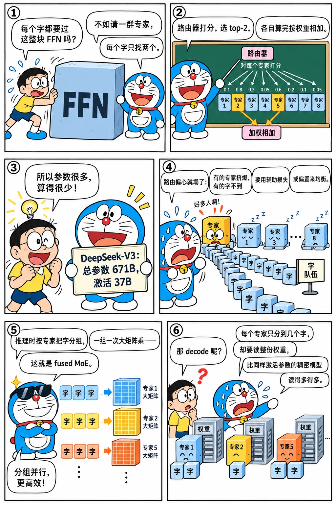

# 混合专家 MoE

<p class="lead">混合专家（Mixture of Experts）把一个大的前馈网络换成很多个小的"专家"，每个 token 只激活其中几个。这样模型的总参数可以很大（知识容量大），每个 token 的计算量却很小。DeepSeek-V3、Qwen3 的 MoE 版本、Mixtral、gpt-oss 都是 MoE 模型。它给推理带来了全新的问题：显存要装下全部专家，计算却只用一小部分，专家之间还要做负载均衡和跨卡通信。</p>

!!! question "自测：能答上来就可以跳过本章"
    1. MoE 层由哪几部分组成？一个 token 经过 MoE 层时发生了什么？
    2. "总参数"和"激活参数"分别是什么？DeepSeek-V3 各是多少？
    3. 为什么需要负载均衡？有哪些做法？
    4. 实现 MoE 时，为什么要把 token 按专家分组，而不是逐个 token 计算？
    5. MoE 模型的 decode 为什么比同样激活参数量的稠密模型更难优化？

??? success "自测参考答案（先自己答，再展开对照）"
    1. 路由器（一个线性层给每个专家打分）+ top-k 选择 + 若干个小 FFN 专家 + 按门控权重加权合并（有的模型还有共享专家）。一个 token 算出分数、选出 k 个专家，分别送进去计算，再把结果加权相加。
    2. 总参数是所有专家加起来，决定显存；激活参数是每个 token 实际经过的参数，决定计算量。DeepSeek-V3 为 671B / 37B。
    3. 路由会越来越偏爱少数专家：它们过载、成为瓶颈（还可能丢 token），其他专家得不到训练。做法：辅助损失、容量上限，以及 DeepSeek-V3 的无辅助损失偏置（只在选专家时加偏置，按负载调整）。
    4. 逐 token 计算是一堆很小的矩阵乘，GPU 用不满；按专家分组（排序、计数、分段）后，每个专家对它分到的所有 token 做一次大矩阵乘，最后再按原来的顺序散回——这就是 fused MoE kernel 的骨架。
    5. decode 时 batch 里的 token 分散到很多专家上，每个专家只分到几个 token，却要读完整的专家权重，读的字节数远大于同样激活参数的稠密模型；专家分在多张卡上还要 all-to-all 和处理负载不均。

先看一个六格小剧场，再读正文：

{.aig-comic}

## 结构

一个 MoE 层替换掉 Transformer 层中的 FFN：

1. **路由器（router / gate）**：一个线性层 `d → E`，为每个 token 给 E 个专家打分；
2. **选择**：每个 token 选出分数最高的 k 个专家（top-k，常见 k = 2 到 8）；
3. **计算**：被选中的专家（每个都是一个小的 SwiGLU FFN）分别处理这个 token；
4. **加权合并**：按路由权重对 k 个专家的输出加权求和。

$$
y = \sum_{i \in \text{TopK}(g(x))} w_i(x)\, \text{Expert}_i(x)
$$

DeepSeekMoE 在此基础上做了两点改进，被后来的很多模型采用：

- **细粒度专家**：把专家切得更小、数量更多（DeepSeek-V3 有 256 个路由专家，每个 token 选 8 个），组合方式更丰富；
- **共享专家**：另外设 1 个所有 token 都会经过的专家，负责通用的知识，路由专家专注于各自的领域。

{.aig-svg}

## 实现：逐 token 与按专家分组

最直观的实现是对每个 token 循环它选中的专家。这在数学上完全正确，但在 GPU 上极其低效：每个专家每次只处理一个 token，全是矩阵向量乘。实际的实现**按专家分组**：先找出每个专家负责哪些 token，每个专家对自己的所有 token 做一次矩阵乘法，再把结果按权重散回原位置。两种写法结果相同：

```python title="moe.py"
"""moe.py —— 一个 top-k 路由的 MoE 层（带共享专家），以及两种等价的前向实现。"""

import torch
import torch.nn as nn
import torch.nn.functional as F


class Expert(nn.Module):
    def __init__(self, d, d_ff):
        super().__init__()
        self.gate_proj = nn.Linear(d, d_ff, bias=False)
        self.up_proj = nn.Linear(d, d_ff, bias=False)
        self.down_proj = nn.Linear(d_ff, d, bias=False)

    def forward(self, x):
        return self.down_proj(F.silu(self.gate_proj(x)) * self.up_proj(x))


class MoE(nn.Module):
    def __init__(self, d, d_ff, n_experts, top_k, n_shared=1):
        super().__init__()
        self.top_k = top_k
        self.router = nn.Linear(d, n_experts, bias=False)
        self.experts = nn.ModuleList(Expert(d, d_ff) for _ in range(n_experts))
        self.shared = nn.ModuleList(Expert(d, d_ff) for _ in range(n_shared))

    def route(self, x):                                   # x: [N, d]，N 个 token
        probs = self.router(x).softmax(dim=-1)            # [N, E]
        weights, idx = probs.topk(self.top_k, dim=-1)     # [N, k]
        weights = weights / weights.sum(-1, keepdim=True) # 选中的 k 个权重重新归一化
        return weights, idx, probs

    def forward_naive(self, x):
        """逐个 token、逐个专家地计算：正确但低效。"""
        weights, idx, _ = self.route(x)
        out = torch.zeros_like(x)
        for t in range(x.shape[0]):
            for j in range(self.top_k):
                e = idx[t, j].item()
                out[t] += weights[t, j] * self.experts[e](x[t])
        return out + sum(s(x) for s in self.shared)

    def forward_grouped(self, x):
        """按专家分组：每个专家对分给它的全部 token 做一次矩阵乘法。"""
        weights, idx, _ = self.route(x)
        flat_expert = idx.flatten()                                   # [N*k]：每个 (token, 槽位) 去哪个专家
        flat_token = torch.arange(x.shape[0]).repeat_interleave(self.top_k)
        order = flat_expert.argsort(stable=True)                      # 按专家排序，同一专家的 token 连在一起
        counts = torch.bincount(flat_expert, minlength=len(self.experts))
        out = torch.zeros_like(x)
        start = 0
        for e, n in enumerate(counts.tolist()):
            if n == 0:
                continue
            sel = order[start:start + n]
            tok = flat_token[sel]
            y = self.experts[e](x[tok])                               # 一次处理 n 个 token
            out.index_add_(0, tok, y * weights.flatten()[sel, None])  # 按权重加回原位置
            start += n
        return out + sum(s(x) for s in self.shared)
```

```python
import torch
from moe import MoE

torch.manual_seed(0)
moe = MoE(d=64, d_ff=128, n_experts=16, top_k=4)
x = torch.randn(50, 64)
with torch.no_grad():
    a, b = moe.forward_naive(x), moe.forward_grouped(x)
assert torch.allclose(a, b, atol=1e-5)

_, idx, _ = moe.route(x)
counts = torch.bincount(idx.flatten(), minlength=16)
print("每个专家分到的 token 数:", counts.tolist())
```

`forward_grouped` 里的"排序 → 统计每个专家的数量 → 分段计算 → 按权重散回"，正是推理引擎中 **fused MoE** kernel 的骨架：统计数量是一次直方图，每个专家的起始位置是一次前缀和，然后用一个分组 GEMM 同时计算所有专家，参见 CUDA 手册中的[前缀和与 MoE 分发](cuda://kernels/scan/#在大模型里的应用moe-的-token-分发)。

## 负载均衡

如果路由器总是偏爱少数几个专家，这些专家会过载，其他专家学不到东西，也浪费了参数。所以训练时必须鼓励负载均衡：

- **辅助损失**（Switch Transformer）：$\mathcal{L}_{aux} = E \sum_{i=1}^{E} f_i P_i$，其中 $f_i$ 是分给专家 i 的 token 比例，$P_i$ 是路由器给专家 i 的平均概率。完全均匀时它取最小值；
- **容量限制**：训练时给每个专家设一个容量上限，超出的 token 被丢弃（直接走残差）；
- **无辅助损失的均衡**（DeepSeek-V3）：给每个专家的路由分数加一个偏置，只用于选择 top-k、不影响权重；训练中过载的专家偏置调低、空闲的调高。避免了辅助损失对模型质量的干扰。

把路由过程模拟出来看：路由器越偏心，忙的专家越忙，辅助损失越大，超出容量的 token 越多：

<div class="aig-widget" data-widget="moe-route"></div>

```python
def aux_loss(probs, idx, n_experts):
    f = torch.bincount(idx.flatten(), minlength=n_experts).float() / idx.numel()   # 实际分配比例
    P = probs.mean(dim=0)                                                            # 平均路由概率
    return n_experts * (f * P).sum()

_, idx, probs = moe.route(x)
print(f"随机初始化的路由器，辅助损失 = {aux_loss(probs, idx, 16).item():.3f}（完全均衡时约为 1）")

# 极端不均衡：所有 token 都选前 4 个专家
skewed = torch.zeros(50, 16)
skewed[:, :4] = 0.25
bad_idx = torch.arange(4).repeat(50, 1)
print(f"极端不均衡时，辅助损失 = {aux_loss(skewed, bad_idx, 16).item():.3f}")
assert aux_loss(skewed, bad_idx, 16) > aux_loss(probs, idx, 16)
```

## 总参数与激活参数

用官方配置在"meta 设备"上构建模型（只创建形状、不分配内存），就能精确计算参数量：

```python
import transformers
from transformers import AutoModelForCausalLM

def total_and_active(cfg, n_experts, top_k, moe_layers, expert_params):
    with torch.device("meta"):
        model = AutoModelForCausalLM.from_config(cfg)
    total = sum(p.numel() for p in model.parameters())
    return total, total - (n_experts - top_k) * expert_params * moe_layers   # 减去每个 token 用不到的专家

ds = transformers.DeepseekV3Config()          # 默认值即 DeepSeek-V3 的配置
ds_total, ds_active = total_and_active(ds, ds.n_routed_experts, ds.num_experts_per_tok,
                                       ds.num_hidden_layers - ds.first_k_dense_replace,
                                       3 * ds.hidden_size * ds.moe_intermediate_size)
mx = transformers.MixtralConfig()             # 默认值即 Mixtral-8x7B 的配置
mx_total, mx_active = total_and_active(mx, mx.num_local_experts, mx.num_experts_per_tok,
                                       mx.num_hidden_layers, 3 * mx.hidden_size * mx.intermediate_size)
print(f"DeepSeek-V3: 总参数 {ds_total / 1e9:.1f}B，每个 token 激活 {ds_active / 1e9:.1f}B")
print(f"Mixtral-8x7B: 总参数 {mx_total / 1e9:.1f}B，每个 token 激活 {mx_active / 1e9:.1f}B")
assert round(ds_total / 1e9) == 671 and round(ds_active / 1e9) == 38
assert round(mx_total / 1e9, 1) == 46.7 and round(mx_active / 1e9, 1) == 12.9
```

DeepSeek-V3 有 6710 亿参数，每个 token 只激活约 375 亿（官方表述为 37B），计算量相当于一个 37B 的稠密模型，但知识容量接近一个 671B 的模型。

!!! inference "推理视角"
    MoE 让推理的很多权衡发生了变化：

    - **显存按总参数算，计算按激活参数算**：DeepSeek-V3 的 FP8 权重约 700 GB，至少需要一台 8 卡 H200 或者多机部署，但每个 token 的计算量只相当于 37B 的模型；
    - **小 batch 下 MoE 很吃亏**：decode 时 batch 中的 token 被分散到很多专家上，每个专家只分到很少的 token，退化成矩阵向量乘；而且被激活的专家越多，要读的权重越多。batch 为 1 时要读 8 个专家的权重，batch 很大时几乎所有 256 个专家的权重都要读一遍。所以 **MoE 模型的服务需要更大的 batch** 才能摊薄权重读取；
    - **专家并行（EP）**：把专家分散到多张卡上，每层需要两次 all-to-all（把 token 发给专家所在的卡，再把结果收回来），DeepEP 就是为此设计的通信库；
    - **负载不均衡**：推理时路由不受控制，热门专家所在的卡成为瓶颈，于是有了冗余专家（在多张卡上复制热门专家）、按负载重新放置专家（如 DeepSeek 开源的 EPLB）等手段；
    - **fused MoE kernel**：分组、分组 GEMM、激活函数、按权重合并，被融合成少数几个 kernel。

!!! interview "怎么讲清楚"
    讲 MoE 按"结构 → 计算 → 部署"展开：路由器 + top-k 选择 + 多个小专家 + 加权合并，DeepSeekMoE 加了细粒度专家和共享专家；总参数决定显存，激活参数决定计算（DeepSeek-V3 为 671B / 37B）；实现的骨架是按专家分组（排序、计数、分段 GEMM、散回），这就是 fused MoE kernel；训练要负载均衡（辅助损失、容量限制、无辅助损失的偏置）。推理时每个专家在 decode 里分到的 token 很少、主要在读权重，所以需要更大的 batch、专家并行和 all-to-all，还要处理负载不均。

## 练习

**1. 计算题。** 一个 MoE 模型有 64 个专家，每个 token 选 8 个，每个专家 3 × 2048 × 1408 个参数，共 24 个 MoE 层。所有专家一共多少参数？每个 token 激活的专家参数有多少？

??? success "参考答案"
    ```python
    per_expert = 3 * 2048 * 1408
    total = 64 * per_expert * 24
    active = 8 * per_expert * 24
    print(f"{total / 1e9:.2f}B 总，{active / 1e9:.2f}B 激活")   # 13.29B 总，1.66B 激活
    ```

**2. 思考题。** 在 `forward_grouped` 中，如果某个专家一个 token 都没分到，会发生什么？如果路由严重不均衡，对推理性能有什么影响？

??? success "参考答案"
    代码里 `n == 0` 时直接跳过，不会出错。真实的分组 GEMM kernel 也要正确处理"某组为空"的情况。路由不均衡时，分到 token 多的专家计算时间长，整个 MoE 层要等最慢的那个专家（或者那张卡）算完，其他专家（卡）处于空闲；在专家并行下，热门专家所在的卡还要接收更多的 all-to-all 数据。这就是为什么推理系统会统计专家负载，并通过冗余专家、重新放置来平衡。

## 小结

- [x] MoE 层 = 路由器 + top-k 选择 + 多个小 FFN 专家 + 加权合并；DeepSeekMoE 加入细粒度专家和共享专家。
- [x] 按专家分组计算（排序、计数、分段 GEMM、散回）是 fused MoE kernel 的骨架。
- [x] 训练需要负载均衡：辅助损失、容量限制，或 DeepSeek-V3 的无辅助损失偏置调整。
- [x] 总参数决定显存，激活参数决定计算量；DeepSeek-V3 为 671B / 37B。
- [x] MoE 推理需要更大的 batch、专家并行和 all-to-all 通信，并要处理负载不均衡。
