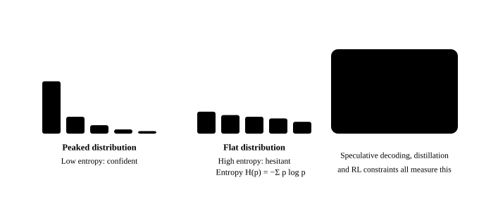

# Information theory

<p class="lead">A language model is trained on cross-entropy and evaluated with perplexity; RLHF and distillation use KL divergence, and so, increasingly, does quantization evaluation. All of them come from information theory. This chapter starts from how to measure "uncertainty", connects entropy, cross-entropy, KL divergence and perplexity in one line, and then looks at what each of them tells us on a real model: where the model is confident, how many bits it can compress text into, how much quantization really changes, and why speculative decoding succeeds more often where entropy is low.</p>

!!! question "Self-test: if you can answer these, skip this chapter"
    1. How are entropy, cross-entropy and KL divergence related?
    2. What does a perplexity of 27 mean? How does it convert to "bits per token"?
    3. Why is KL divergence more sensitive than perplexity in quantization evaluation?
    4. What is the difference between forward and reverse KL? Which one does the KL penalty in RLHF use?

??? success "Answers (try first, then expand to compare)"
    1. Cross-entropy $H(p, q) = H(p) + \mathrm{KL}(p \| q)$: entropy is the uncertainty of the data itself, and KL is the extra cost the model distribution $q$ pays relative to the true distribution $p$; minimizing cross-entropy in training is equivalent to minimizing KL.
    2. The average cross-entropy per token is $\ln 27$ nats, as if at every step the model picked among 27 equally likely tokens; in bits that is $\log_2 27 \approx 4.75$ bits per token.
    3. Perplexity only averages the probability of the correct token, and the small changes quantization causes cancel out; KL divergence compares the two full distributions position by position and sees changes in the shape of the distribution, so it is more sensitive (with INT8, perplexity barely moves, yet the top-1 prediction changes at 4% of positions).
    4. Forward $\mathrm{KL}(p \| q)$ forces $q$ to cover every high-probability region of $p$ (mode covering), used in maximum likelihood and distillation; reverse $\mathrm{KL}(q \| p)$ lets $q$ latch onto a single peak (mode seeking). The KL penalty in RLHF is reverse: $\mathrm{KL}(\pi_\theta \| \pi_{ref})$.

## Entropy, cross-entropy and KL divergence {#熵交叉熵与-kl-散度}

{.aig-svg}

The **entropy** of a distribution measures its uncertainty:

$$
H(p) = -\sum_x p(x)\log_2 p(x) \quad \text{(in bits)}
$$

A uniform distribution over $2^k$ outcomes has an entropy of $k$ bits; a certain outcome has entropy 0. Intuitively, entropy is "the average number of bits needed to represent one sample with the best possible code".

If the true distribution is $p$ but you use a code designed for distribution $q$, the average number of bits you need is the **cross-entropy**:

$$
H(p, q) = -\sum_x p(x)\log_2 q(x) = H(p) + D_\text{KL}(p \,\|\, q)
$$

The extra part, $D_\text{KL}(p\|q) = \sum_x p(x)\log\frac{p(x)}{q(x)} \ge 0$, is the **KL divergence**: the extra cost of "using $q$ instead of $p$", which is 0 if and only if $p = q$. It is not symmetric: $D_\text{KL}(p\|q) \ne D_\text{KL}(q\|p)$.

A language model's training loss is exactly cross-entropy: $p$ is the actual next token in the data (one-hot), $q$ is the model's prediction, and the loss is $-\log q(x_\text{actual})$. **Perplexity** is the exponential of the cross-entropy: $\text{PPL} = e^{H}$ (with natural logarithms), which you can read as "how many options the model is hesitating between, on average" (see [language models](llm://basics/language-model/#训练目标交叉熵)).

## Where the model is confident {#模型在哪些位置有把握}

On a passage of this book, compute the entropy of Qwen3-0.6B's predicted distribution at every position, and its cross-entropy on the passage:

```python
import copy
import math
import re
import torch
from transformers import AutoTokenizer
from mini_llm import Transformer
from quant import fake_quant_int

torch.set_num_threads(16)
path = "models/Qwen3-0.6B"
tok = AutoTokenizer.from_pretrained(path)
model = Transformer.from_pretrained(path)
raw = open("docs/assets/sample-passage.txt").read()   # frozen sample text: a snapshot of the language-model chapter, so editing that chapter no longer changes the numbers here
ids = tok(re.sub(r"[#*`>|\-\[\]()!]", "", raw)).input_ids[:400]
with torch.no_grad():
    logp = model(torch.tensor([ids]))[0].log_softmax(-1)             # [400, V], log-probabilities at every position
p = logp.exp()
entropy_bits = -(p * logp).sum(-1) / math.log(2)
print("每个位置预测分布的熵（比特）：10% 分位", f"{entropy_bits.quantile(0.1):.2f}，中位数 {entropy_bits.median():.2f}，"
      f"90% 分位 {entropy_bits.quantile(0.9):.2f}")

nll = -logp[:-1].gather(1, torch.tensor(ids[1:])[:, None]).squeeze(1)   # negative log-probability of each actual token
bits = nll.sum().item() / math.log(2)
n_bytes = len(tok.decode(ids[1:]).encode("utf-8"))
print(f"交叉熵：每个 token {bits / (len(ids) - 1):.2f} 比特，困惑度 {math.exp(nll.mean()):.1f}")
print(f"这段文本 UTF-8 编码是 {n_bytes} 字节（{n_bytes * 8} 比特），模型只需要 {bits:.0f} 比特，"
      f"即每字节 {bits / n_bytes:.2f} 比特")
```

```text title="output"
每个位置预测分布的熵（比特）：10% 分位 0.07，中位数 2.83，90% 分位 6.88
交叉熵：每个 token 5.19 比特，困惑度 36.5
这段文本 UTF-8 编码是 1545 字节（12360 比特），模型只需要 2071 比特，即每字节 1.34 比特
```

- At about 10% of positions the model is almost certain (entropy below 0.1 bits, for example the second half of a word), and at another 10% it hesitates a lot (about 7 bits, like choosing among more than a hundred options);
- The cross-entropy is about 5 bits per token: with arithmetic coding, this model could compress this Chinese passage to 1.34 bits per byte, against 8 bits per byte for UTF-8. **Language modeling is compression**, which is the information-theoretic explanation for "lower perplexity means a better model".

## KL divergence: how much quantization changes {#kl-散度量化改变了多少}

The most common metric for evaluating quantization is perplexity, but it only looks at "the probability of the actual token" and is an average, so many changes cancel each other out. A more direct method is to compare the **whole distribution** before and after quantization: compute $D_\text{KL}(p_\text{original} \| p_\text{quantized})$ at every position, and check whether the top-1 prediction changed:

```python
def quantized_model(fn):
    m = copy.deepcopy(model)
    for layer in m.layers:
        a, f = layer.self_attn, layer.mlp
        for lin in (a.q_proj, a.k_proj, a.v_proj, a.o_proj, f.gate_proj, f.up_proj, f.down_proj):
            lin.weight.data = fn(lin.weight.data)
    return m

print("方案          困惑度   平均 KL    KL 的 P99   top-1 一致率")
print(f"FP32 原始    {math.exp(nll.mean()):7.2f}")
for name, fn in [("INT8 按通道", lambda w: fake_quant_int(w, 8, "channel")),
                 ("INT4 按组", lambda w: fake_quant_int(w, 4, "group")),
                 ("INT4 按通道", lambda w: fake_quant_int(w, 4, "channel"))]:
    with torch.no_grad():
        logq = quantized_model(fn)(torch.tensor([ids]))[0].log_softmax(-1)
    kl = (p * (logp - logq)).sum(-1)
    agree = (logp.argmax(-1) == logq.argmax(-1)).float().mean()
    ppl = math.exp(-logq[:-1].gather(1, torch.tensor(ids[1:])[:, None]).mean())
    print(f"{name:10s} {ppl:7.2f}   {kl.mean():7.4f}   {kl.quantile(0.99):8.1f}   {agree:8.1%}")
```

```text title="output"
方案          困惑度   平均 KL    KL 的 P99   top-1 一致率
FP32 原始      36.50
INT8 按通道     36.75    0.0048        0.0      96.0%
INT4 按组      47.43    0.4613        2.3      64.2%
INT4 按通道     72.32    1.0724        4.4      52.5%
```

After per-channel INT8 quantization, perplexity is almost the same as the original model's (36.75 vs 36.50), which looks "lossless"; but KL divergence shows the distribution really did change, and **the top-1 prediction changed at nearly 4% of positions**. For greedy decoding, that means the generated text may diverge about once every 25 tokens. The difference with INT4 is much clearer: the top-1 prediction changes at a third of the positions. That is why more rigorous quantization evaluations report KL divergence and top-1 agreement (llama.cpp's quantization evaluation tool does), not just perplexity.

## Entropy and speculative decoding {#熵与投机解码}

[The previous chapter](probability.md#拒绝采样与投机解码) proved that the acceptance rate of speculative sampling is $\sum_x \min(p, q) = 1 - \text{TV}(p, q)$. Intuitively, where the target model is confident (low entropy), the draft model is also more likely to guess right. Check it on the same passage, with the INT4-quantized version as the draft again:

```python
with torch.no_grad():
    q_draft = quantized_model(lambda w: fake_quant_int(w, 4, "group"))(torch.tensor([ids]))[0].softmax(-1)
accept = torch.minimum(p, q_draft).sum(-1)
low, high = entropy_bits < entropy_bits.quantile(0.25), entropy_bits > entropy_bits.quantile(0.75)
print(f"熵与接受率的相关系数 {torch.corrcoef(torch.stack([entropy_bits, accept]))[0, 1]:.2f}")
print(f"熵最低的四分之一位置，平均接受率 {accept[low].mean():.2f}；熵最高的四分之一位置 {accept[high].mean():.2f}")
```

```text title="output"
熵与接受率的相关系数 -0.51
熵最低的四分之一位置，平均接受率 0.87；熵最高的四分之一位置 0.59
```

The acceptance rate is clearly higher where entropy is low. This explains many observations from practice: for highly "deterministic" output such as code, JSON and restating text, speculative decoding speeds things up more; for open-ended writing and high-temperature sampling, the speedup drops.

## Forward KL and reverse KL {#正向-kl-与反向-kl}

KL divergence is not symmetric, and when you fit a distribution with it, the direction determines the nature of the result. Fit a single-peaked distribution $q$ (a discretized Gaussian) to a two-peaked distribution $p$:

```python
xs = torch.arange(100).float()
bump = lambda mu, sigma: torch.exp(-0.5 * ((xs - mu) / sigma) ** 2)
p_target = 0.6 * bump(25, 5) + 0.4 * bump(70, 5)
p_target = p_target / p_target.sum()

def fit(direction, mu0):
    mu, log_sigma = torch.tensor(mu0, requires_grad=True), torch.tensor(math.log(10.0), requires_grad=True)
    opt = torch.optim.Adam([mu, log_sigma], lr=0.5)
    for _ in range(2000):
        q = torch.softmax(-0.5 * ((xs - mu) / log_sigma.exp()) ** 2, 0)
        if direction == "正向":
            loss = (p_target * (p_target.log() - q.clamp_min(1e-30).log())).sum()     # KL(p‖q)
        else:
            loss = (q * (q.clamp_min(1e-30).log() - p_target.log())).sum()            # KL(q‖p)
        opt.zero_grad()
        loss.backward()
        opt.step()
    return mu.item(), log_sigma.exp().item(), loss.item()

for direction in ("正向", "反向"):
    for mu0 in (30.0, 60.0):                                          # starting from two different points
        mu, sigma, loss = fit(direction, mu0)
        print(f"{direction} KL，起点 {mu0:.0f}：q 的中心 {mu:5.1f}，宽度 {sigma:5.1f}，KL = {loss:.3f}")
```

```text title="output"
正向 KL，起点 30：q 的中心  40.2，宽度  27.2，KL = 0.786
正向 KL，起点 60：q 的中心  40.2，宽度  27.2，KL = 0.786
反向 KL，起点 30：q 的中心  25.0，宽度   5.0，KL = 0.511
反向 KL，起点 60：q 的中心  70.0，宽度   5.0，KL = 0.916
```

- **Forward KL** $D(p\|q)$ is penalized heavily wherever $p > 0$ but $q \approx 0$, so $q$ must **cover** every peak of $p$: whatever the starting point, the result is a wide, centered distribution sitting between the two peaks (mode covering). Maximum-likelihood training and distilling a student from a teacher's logits both minimize forward KL;
- **Reverse KL** $D(q\|p)$ is penalized heavily wherever $q > 0$ but $p \approx 0$, so $q$ would rather **stick to a single peak** (mode seeking). Which peak depends on the starting point: starting from 60, it stops on the smaller peak, with a larger KL, a local optimum. The KL penalty in RLHF/GRPO that keeps the policy from drifting too far from the reference model, $D(\pi_\theta \| \pi_\text{ref})$, is a reverse KL, which tends to concentrate the model on certain "modes"; this is one reason output diversity drops after RL.

!!! interview "How to explain it"
    Questions on evaluation metrics: cross-entropy = entropy + KL, and perplexity is the exponential of cross-entropy (a perplexity of 27 is like choosing among 27 equally likely tokens at every step), which also converts to bits per token or per byte; to evaluate quantization, look at KL divergence and top-1 agreement, which are more sensitive than perplexity (with INT8, perplexity barely moves, yet the top-1 prediction changes at 4% of positions); forward KL covers every mode (maximum likelihood, distillation), reverse KL chases a single mode (the KL penalty in RL). Speculative decoding is accepted more often where entropy is low.

## Exercises {#练习}

**1. The upper bound of entropy.** Qwen's vocabulary has about 150,000 tokens. What is the largest possible entropy of the next-token distribution, in bits? The measured 90th percentile above is 6.88 bits: how many equally likely options is that like?

??? success "Answer"
    The maximum entropy is that of the uniform distribution, $\log_2 151936 \approx 17.2$ bits. 6.88 bits is like $2^{6.88} \approx 118$ equally likely options. Even at the positions where the model hesitates most, its distribution is far more concentrated than a uniform one.

**2. KL and temperature.** If the target model's temperature drops from 1 to 0.5 while the draft model stays the same, how does the acceptance rate change? (Hint: think about how the entropy changes and the distance between the two distributions.)

??? success "How to think about it"
    A lower temperature makes the target distribution peakier (lower entropy). If the draft model uses the same temperature too (speculative sampling requires the draft distribution to be the one actually sampled from), both get peakier: where their most likely tokens agree the acceptance rate rises, and where they disagree it drops sharply; overall, when the draft and target mostly agree on the top-1 token, a lower temperature raises the acceptance rate, and in the limit (temperature going to 0) it becomes greedy verification, where acceptance depends on whether the top-1 tokens match. If only the target's temperature is lowered and the draft stays the same, the gap between the two distributions grows and the acceptance rate falls.

## Summary {#小结}

- [x] Entropy measures uncertainty; cross-entropy = entropy + KL divergence; perplexity is the exponential of cross-entropy and also converts to bits per token or per byte.
- [x] Language modeling is compression: this book's small model compresses a Chinese passage to about 1.34 bits per byte.
- [x] KL divergence and top-1 agreement reflect the changes quantization causes better than perplexity: with INT8, perplexity barely moves, yet the top-1 prediction changes at 4% of positions.
- [x] Speculative decoding is accepted more often where entropy is low; forward KL covers every mode (maximum likelihood, distillation), reverse KL chases a single mode (the KL penalty in RL).
