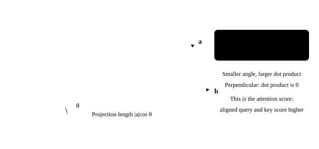
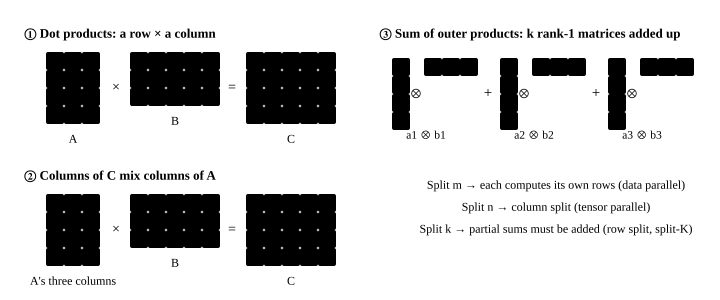
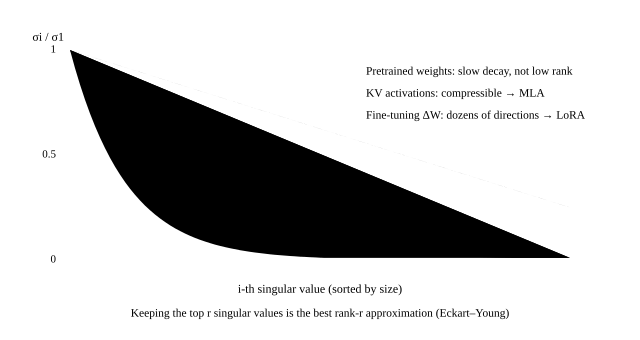

# Linear algebra

<p class="lead">LLM computation is almost all matrix multiplication, and many inference optimizations rest on a few ideas from linear algebra: see matrix multiplication as a "sum of outer products" and you understand tiling and distributed splitting; see a matrix as "low rank plus noise" and you understand LoRA and MLA; see an orthogonal matrix as a "rotation" and you understand RoPE and the rotation tricks in quantization. This chapter explains these ideas and checks them on Qwen3-0.6B's real weights and activations.</p>

!!! question "Self-test: if you can answer these, skip this chapter"
    1. What are three equivalent ways to understand the matrix product $C = AB$? Which parallel split does each correspond to?
    2. What is the rank of a matrix? Why is a truncated SVD the "best" low-rank approximation?
    3. Are an LLM's weights low rank? What about KV? How does this relate to LoRA and MLA?
    4. What properties do orthogonal matrices have? Why does multiplying both the activations and the weights by an orthogonal matrix reduce quantization error?

??? success "Answers (try first, then expand to compare)"
    1. The dot-product view (each element is a row of A dotted with a column of B) → split the output, each part computed independently; the column-combination view (each column of C combines the columns of A) → split B by columns, the column split of tensor parallelism; the sum-of-outer-products view ($C = \sum_k a_k b_k^\top$) → split along k, compute partial results and add them up, the row split, split-K and tiled attention.
    2. The rank is the number of linearly independent rows (columns), the number of dimensions the matrix really "uses". By the Eckart–Young theorem, keeping the r largest singular values of the SVD gives the matrix with the smallest error (in the Frobenius or spectral norm) among all matrices of rank at most r.
    3. The singular values of pretrained weights decay slowly, so they are not low rank; but the deltas from fine-tuning are often low rank (the basis of LoRA), and activations such as K and V are close to low rank (the basis for MLA compressing KV into a low-dimensional latent vector).
    4. An orthogonal matrix satisfies $Q^\top Q = I$ and preserves lengths and dot products, so $(xQ)(Q^\top W) = xW$ and the result is unchanged. The rotation "stirs" outliers concentrated in a few channels across all channels, so the maximum of each group is closer to its typical value and quantization error drops (QuaRot and similar methods).

## Geometry first: a matrix does something to space {#先看几何矩阵是对空间做的一件事}

Before writing down any formula, remember one sentence: **a matrix "moves the basis vectors somewhere else", and every other point follows along**. In two dimensions, $\begin{pmatrix} a & b \\ c & d \end{pmatrix}$ moves $\hat{\imath} = (1,0)$ to the first column $(a, c)$ and $\hat{\jmath} = (0,1)$ to the second column $(b, d)$; any vector $x$ ends up at the corresponding linear combination of those two new positions:

$$
Wx = x_1 \cdot \begin{pmatrix} a \\ c \end{pmatrix} + x_2 \cdot \begin{pmatrix} b \\ d \end{pmatrix}
$$

Drag the four numbers below and watch the grid get stretched, rotated, sheared or even flattened (press "play" to animate from the identity):

<div class="aig-widget" data-widget="linmap"></div>

Three quantities you can read off directly, all of which come up later:

- The **determinant** is the factor by which areas scale. If it is 0, the whole plane is squashed onto a line: the matrix has **lost rank**, one dimension of information is gone, and it cannot be inverted.
- A **negative determinant** means space is flipped (handedness reverses).
- **Eigenvectors** are the vectors whose direction stays the same and that are only stretched. No real eigenvalues means the transformation contains a rotation.

A linear layer does the same thing, just in thousands of dimensions instead of 2: each output channel is a weighted combination of the input channels. So does $QK^\top$ in attention: it computes the dot product of every query with every key, and geometrically a dot product is a **projection**:

{.aig-svg}

The more two vectors point the same way, the larger their dot product and the higher the attention weight; when they are perpendicular the dot product is zero and they are unrelated. RoPE encodes position as a rotation, and a rotation changes angles but not lengths, so it only affects "who is similar to whom", not the vectors' norms (see [rotary position embeddings](llm://transformer/position/)).

## Three views of matrix multiplication {#矩阵乘法的三种视角}

$C = AB$, where $A$ has shape $m \times k$ and $B$ has shape $k \times n$. The same result can be understood in three ways:

1. **The dot-product view**: $C_{ij} = \sum_t A_{it} B_{tj}$; each element of $C$ is a row of $A$ dotted with a column of $B$;
2. **The column-combination view**: column $j$ of $C$ is a linear combination of the columns of $A$, with the coefficients in column $j$ of $B$;
3. **The sum-of-outer-products view**: $C = \sum_t A_{:,t} B_{t,:}$, a sum of $k$ rank-1 matrices (outer products).

{.aig-svg}

```pycon
>>> import torch
>>> torch.manual_seed(0)
<torch._C.Generator object at ...>
>>> A, B = torch.randn(4, 3), torch.randn(3, 5)
>>> C = A @ B
>>> dot = torch.tensor([[A[i] @ B[:, j] for j in range(5)] for i in range(4)])      # dot-product view
>>> cols = torch.stack([A @ B[:, j] for j in range(5)], dim=1)                      # column-combination view
>>> outer = sum(torch.outer(A[:, t], B[t]) for t in range(3))                        # sum-of-outer-products view
>>> torch.allclose(C, dot, atol=1e-6), torch.allclose(C, cols, atol=1e-6), torch.allclose(C, outer, atol=1e-6)
(True, True, True)
```

The three views correspond to three ways of splitting a matrix multiplication, which come up again and again in GPU kernels and distributed parallelism:

| What you split | View | What each part produces | Where you see it |
| --- | --- | --- | --- |
| The rows of $A$ ($m$) | Dot product | Some rows of the result; just concatenate | Different tokens to different thread blocks; data parallelism |
| The columns of $B$ ($n$) | Column combination | Some columns of the result; just concatenate | The **column split** of tensor parallelism |
| $k$ | Sum of outer products | **Partial sums** of the full shape, to be added up | The **row split** of tensor parallelism (all-reduce); split-K GEMM; FlashAttention's tiling along K/V |

Cost: each $C_{ij}$ takes $k$ multiplications and $k$ additions, $2mnk$ floating-point operations in total, the starting point of every compute estimate for LLMs (see [math and PyTorch prerequisites](llm://basics/math-torch/#矩阵乘法线性层)).

## Rank and low-rank approximation {#秩与低秩近似}

The **rank** of a matrix is the largest number of linearly independent columns (or rows), the number of "independent directions" it can represent. Every matrix has a **singular value decomposition** (SVD):

$$
W = U \Sigma V^\top = \sum_{i=1}^{r} \sigma_i \, u_i v_i^\top, \quad \sigma_1 \ge \sigma_2 \ge \dots \ge 0
$$

$u_i$ and $v_i$ are mutually orthogonal unit vectors, and $\sigma_i$ are the singular values. Keeping only the largest $k$ terms gives $W_k$, which among all matrices of rank at most $k$ has the smallest error from $W$ in the Frobenius norm (the Eckart–Young theorem); the error is $\sqrt{\sum_{i>k}\sigma_i^2}$. So the distribution of the squared singular values tells us directly "how much a low-rank approximation of it will lose".

Build the intuition with an example you can drag first: move "singular values kept" from 1 to 24, and watch when the approximation on the right starts looking like the original, and how many parameters that saves.

<div class="aig-widget" data-widget="lowrank"></div>

How fast the singular values fall decides whether a low-rank approximation is worth it. The typical shapes for three kinds of matrices:

{.aig-svg}

Are an LLM's weights low rank? Look at the singular values of `gate_proj` in layer 12 of Qwen3-0.6B (3072 × 1024), compared with a random matrix of the same size and variance:

```python
import re
import torch
from transformers import AutoTokenizer
from mini_llm import KVCache, Transformer

torch.set_num_threads(16)
path = "models/Qwen3-0.6B"
tok = AutoTokenizer.from_pretrained(path)
model = Transformer.from_pretrained(path)

def energy_curve(M):
    s = torch.linalg.svdvals(M)
    return (s ** 2).cumsum(0) / (s ** 2).sum()                      # fraction of the "energy" in the top k singular values

W = model.layers[12].mlp.gate_proj.weight.data
e_w, e_r = energy_curve(W), energy_curve(torch.randn_like(W) * W.std())
for k in (32, 128, 512):
    print(f"秩 {k:3d}：真实权重保留 {e_w[k - 1]:.1%} 的能量，随机矩阵 {e_r[k - 1]:.1%}")
```

```text title="输出"
秩  32：真实权重保留 12.7% 的能量，随机矩阵 7.2%
秩 128：真实权重保留 36.1% 的能量，随机矩阵 25.7%
秩 512：真实权重保留 82.4% 的能量，随机矩阵 73.9%
```

The real weights are somewhat more "concentrated" than a random matrix, but far from low rank: keeping 128 directions retains only 36.1% of the energy, and keeping half of the directions (512) only 82%. **Pretrained weights are not low rank**, so you cannot simply compress a whole model with low-rank factors.

Low rank really matters in two places:

- **LoRA**: the **change** in the weights during fine-tuning, $\Delta W$, is often low rank (the core assumption and experiment of the LoRA paper), so training uses $\Delta W = BA$ ($B$ is $d \times r$, $A$ is $r \times k$, $r$ usually 8–64), which cuts the parameter count from $dk$ to $r(d + k)$ (see [post-training](llm://training/post-training/#lora低秩微调));
- **KV and activations**: activations such as K and V that the model produces at run time tend to concentrate in a few directions.

Check the second point: take a 1024-token text and see how many directions some layers' K and V caches need (1024 dimensions per token, that is 8 KV heads × 128) to cover 90% of the energy:

```python
raw = open("docs/assets/sample-passage.txt").read()   # frozen sample text: a snapshot of the language-model chapter, so editing that chapter no longer changes the numbers here
ids = tok(re.sub(r"[#*`>|\-\[\]()!]", "", raw)).input_ids[:1024]
cache = KVCache(model.cfg.num_hidden_layers)
with torch.no_grad():
    model(torch.tensor([ids]), cache)
for layer in (2, 14, 26):
    for name, t in (("K", cache.k[layer]), ("V", cache.v[layer])):
        M = t[0].transpose(0, 1).reshape(len(ids), -1)              # [1024 tokens, 1024 dims]
        e = energy_curve(M - M.mean(0))
        print(f"第 {layer:2d} 层 {name}：{M.shape[1]} 维中，{int((e < 0.9).sum()) + 1:4d} 个方向覆盖 90% 的能量")
```

```text title="输出"
第  2 层 K：1024 维中，  88 个方向覆盖 90% 的能量
第  2 层 V：1024 维中， 175 个方向覆盖 90% 的能量
第 14 层 K：1024 维中， 129 个方向覆盖 90% 的能量
第 14 层 V：1024 维中， 116 个方向覆盖 90% 的能量
第 26 层 K：1024 维中，  90 个方向覆盖 90% 的能量
第 26 层 V：1024 维中， 122 个方向覆盖 90% 的能量
```

Both K and V are clearly low rank: of 1024 dimensions, only 90–130 directions (about a tenth) cover 90% of the energy, with V somewhat more spread out (120–180). This is exactly where **MLA** (DeepSeek-V2/V3) starts: rather than storing the full K and V, store a low-dimensional latent vector and project it back when needed (see [attention variants](llm://transformer/attention-variants/#mla多头潜在注意力)). Quite a few studies also compress KV directly with low-rank methods at inference time.

## Orthogonal matrices and rotations {#正交矩阵与旋转}

An **orthogonal matrix** $Q$ satisfies $Q^\top Q = I$: every column is a unit vector and the columns are mutually orthogonal. An orthogonal transformation is a (generalized) **rotation** (or reflection):

- It preserves lengths: $\|xQ\| = \|x\|$;
- It preserves dot products: $(xQ)\cdot(yQ) = x \cdot y$;
- Its inverse is its transpose: $Q^{-1} = Q^\top$.

LLMs use it in at least two places.

**RoPE** is a rotation by position: the rotation matrix $R_m$ at position $m$ is block diagonal, with each $2\times2$ block rotating by $m\theta_i$. Because rotation matrices satisfy $R_m^\top R_n = R_{n-m}$, $(qR_m)\cdot(kR_n) = q R_m R_n^\top k^\top = q R_{m-n} k^\top$, and the attention score depends only on the relative position $m - n$ (see [positional encoding](llm://transformer/position/#rope用旋转编码位置)):

```pycon
>>> import math
>>> def rotation(pos, dim=8, theta=10000.0):          # RoPE's rotation matrix (acting on row vectors: x @ R)
...     R = torch.zeros(dim, dim)
...     for i in range(dim // 2):
...         a = pos * theta ** (-2 * i / dim)
...         R[2*i:2*i+2, 2*i:2*i+2] = torch.tensor([[math.cos(a), math.sin(a)], [-math.sin(a), math.cos(a)]])
...     return R
>>> R3, R7 = rotation(3.0), rotation(7.0)
>>> torch.allclose(R3 @ R3.T, torch.eye(8), atol=1e-6)            # orthogonal
True
>>> torch.allclose(R3.T @ R7, rotation(4.0), atol=1e-5)           # R_m^T R_n = R_{n-m}
True
```

**Rotation in quantization**: LLMs have huge outliers in certain fixed channels (see [how quantization works](llm://inference/quantization/#激活量化与离群值)), and with per-tensor quantization the step size is set by the outliers, leaving ordinary values very few quantization levels. The idea of rotation is that for any orthogonal matrix $Q$,

$$
XW^\top = (XQ)(WQ)^\top
$$

the product is exactly the same, but $XQ$ spreads each token's "energy" evenly over all dimensions, and outliers that were concentrated in one or two channels get "stirred" away. QuaRot, SpinQuant and similar methods do exactly this, usually with a (block) Hadamard matrix as $Q$, because it can be applied as a fast transform in $O(d\log d)$ time and can be partly merged into the weights of the neighboring layers.

Check it on real activations: capture the input of layer 12's FFN and compare how extreme the outliers are and how large the quantization error is with no rotation, with a random orthogonal rotation, and with a block Hadamard rotation (1024 = 8 × 128, using eight 128-dimensional Hadamard blocks):

```python
from quant import rel_error

captured = {}
hook = model.layers[12].mlp.gate_proj.register_forward_hook(lambda m, i, o: captured.__setitem__("x", i[0][0].detach()))
with torch.no_grad():
    model(torch.tensor([ids[:512]]))
hook.remove()
X, W = captured["x"], model.layers[12].mlp.gate_proj.weight.data
Y = X @ W.T

def quant(x, bits, per_row):
    qmax = 2 ** (bits - 1) - 1
    scale = (x.abs().amax(1, keepdim=True) if per_row else x.abs().max()) / qmax
    return (x / scale).round().clamp(-qmax - 1, qmax) * scale

def hadamard(n):                                                     # Sylvester construction; n is a power of 2
    H = torch.ones(1, 1)
    while H.shape[0] < n:
        H = torch.cat([torch.cat([H, H], 1), torch.cat([H, -H], 1)], 0)
    return H / n ** 0.5

torch.manual_seed(0)
D = X.shape[1]
rotations = {"不旋转": torch.eye(D), "随机正交矩阵": torch.linalg.qr(torch.randn(D, D))[0],
             "分块 Hadamard": torch.block_diag(*[hadamard(128)] * (D // 128))}
for name, Q in rotations.items():
    Xq, Wq = X @ Q, W @ Q
    assert torch.allclose(Xq @ Wq.T, Y, atol=1e-3)                  # the product is unchanged
    peak = (Xq.abs().max() / Xq.abs().median()).item()
    w8a8 = rel_error(quant(Xq, 8, per_row=False) @ quant(Wq, 8, per_row=True).T, Y)
    w4a4 = rel_error(quant(Xq, 4, per_row=True) @ quant(Wq, 4, per_row=True).T, Y)
    print(f"{name:12s} 最大值/中位数 {peak:5.1f}   W8A8 误差 {w8a8:.4f}   W4A4 误差 {w4a4:.4f}")
```

```text title="输出"
不旋转          最大值/中位数  47.2   W8A8 误差 0.0378   W4A4 误差 0.4207
随机正交矩阵       最大值/中位数   9.0   W8A8 误差 0.0116   W4A4 误差 0.1478
分块 Hadamard  最大值/中位数  12.2   W8A8 误差 0.0131   W4A4 误差 0.1768
```

After rotation, the ratio of the activations' maximum to their median drops from 47 to 9–12, the W8A8 error falls to about a third (comparable to SmoothQuant's 0.0130 in [how quantization works](llm://inference/quantization/#激活量化与离群值)), and the W4A4 error falls below half. Block Hadamard is a little worse than a random orthogonal matrix (each block has only 128 dimensions, so it "stirs" less thoroughly than a full rotation), but it can be computed with a fast transform and is much faster.

!!! interview "In an interview"
    Linear algebra shows up most often as "splitting": the three views of a matrix product correspond to three kinds of parallelism: split by rows (data parallelism), by columns (the column split of tensor parallelism, no communication needed), or along k (the row split of tensor parallelism and split-K, where partial sums must be added up). Low rank: pretrained weights are not low rank, but fine-tuning deltas (LoRA) and activations such as K and V often are, which is the basis for MLA's KV compression. Orthogonal transformations preserve dot products: RoPE is a rotation by position, and multiplying both activations and weights by an orthogonal matrix before quantization "stirs" the outliers away.

## Exercises {#练习}

**1. LoRA's parameter count.** Adding rank-16 LoRA to LLaMA-3-8B's `q_proj` (4096 × 4096) and `gate_proj` (14336 × 4096): how many parameters does each add, and what fraction of the original matrix is that?

??? success "Answer"
    ```pycon
    >>> for d_out, d_in in [(4096, 4096), (14336, 4096)]:
    ...     lora = 16 * (d_out + d_in)
    ...     print(lora, f"{lora / (d_out * d_in):.2%}")
    131072 0.78%
    294912 0.50%
    ```

    Both are under 1% of the original matrix. That is why multi-LoRA serving can load hundreds or thousands of adapters on one GPU at the same time.

**2. Why "merge" the rotation into the weights?** If inference really rotated the activations with a 1024 × 1024 matrix multiplication in every layer, how much extra compute would that cost? How do methods such as QuaRot avoid it?

??? success "How to think about it"
    Each token gets one more $d \times d$ multiplication, about $2d^2$ operations, roughly a quarter of an attention projection per layer, which is not cheap. The way around it: in $XW^\top = (XQ)(WQ)^\top$, $WQ$ can be computed offline, and the rotation $XQ$ can be merged into the **previous layer's** output projection (if the previous layer outputs $Y = ZV^\top$, then $YQ = Z(Q^\top V)^\top$, so merge $Q^\top V$ offline), using the fact that RMSNorm is invariant to orthogonal rotations (once the per-channel scaling is removed, $\|xQ\| = \|x\|$). Only a few places that cannot be merged (inside attention, after the FFN's activation function) need an online fast Hadamard transform.

## Summary {#小结}

- [x] The three views of matrix multiplication (dot products, column combinations, sum of outer products) correspond to three ways of splitting it: by rows, by columns (the TP column split), and along $k$ (the TP row split, split-K, tiled attention).
- [x] A truncated SVD is the best low-rank approximation; pretrained weights are not low rank, but fine-tuning deltas (LoRA) and activations such as K and V often are (the basis of MLA).
- [x] Orthogonal matrices preserve lengths and dot products: RoPE is a rotation by position, and $R_m^\top R_n = R_{n-m}$ yields relative positions; rotating both activations and weights before quantization "stirs" the outliers away and greatly reduces quantization error.
