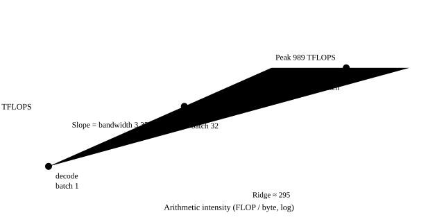
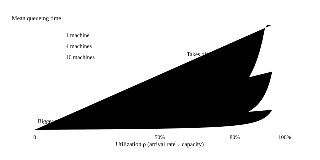

# Math in performance and serving

<p class="lead">Most day-to-day decisions in inference optimization apply a few simple formulas: count FLOPs and bytes to get the arithmetic intensity, and compare it with the hardware's ridge point to find the bottleneck; use Amdahl's law to estimate how much an optimization buys overall; use Little's law and queueing theory to understand why latency explodes as a service nears full load; use statistics to judge how much a benchmark number fluctuates. This chapter gathers these tools in one place and checks every formula with a simulation.</p>

!!! question "Self-test: if you can answer these, skip this chapter"
    1. What is the arithmetic intensity of a $[m, k] \times [k, n]$ matrix multiplication? What does a small $m$ during decode imply?
    2. Attention takes 30% of the total time. If you make it 2 times faster, how much faster is the whole?
    3. On average 20 requests arrive per second, and each takes 8 seconds on average. How many requests are in progress in the system on average?
    4. Utilization rises from 80% to 95%. How does the average queueing time change?
    5. A page calls the model 10 times in parallel, and each call's P99 is 1 second. What is the page's "P99"?
    6. How trustworthy is a P99 latency estimated from 200 samples?

??? success "Answers (try first, then expand to compare)"
    1. $\dfrac{2mnk}{2(mk + kn + mn)}$ FLOP/byte (BF16); when $k$ and $n$ are large and $m$ is small, it is about $m$. During decode $m$ is the batch size, so the intensity is only single digits to a few tens, far below the ridge point: memory bound.
    2. Amdahl's law: $1 / (0.7 + 0.3/2) \approx 1.18$, so the whole is only about 18% faster.
    3. Little's law: $L = \lambda W = 20 \times 8 = 160$ requests.
    4. For M/M/1, the average time in the system is $1/(1-\rho)$ times the service time: 5 times at 80%, 20 times at 95%, so it grows about 4 times, and tail latency grows even more.
    5. The probability that all 10 calls finish within 1 second is $0.99^{10} \approx 0.90$, so 1 second is only the page's P90; the page's P99 corresponds to roughly the P99.9 of a single call.
    6. Not very: the P99 is decided by the largest 2 or so samples, it fluctuates a lot from one batch of samples to the next, and the bootstrap confidence interval is wide. A stable P99 usually needs a few thousand samples.

## FLOPs, bytes and arithmetic intensity {#flops字节与算术强度}

A $[m, k] \times [k, n]$ matrix multiplication needs $2mnk$ floating-point operations and reads and writes at least $(mk + kn + mn)$ elements. Their ratio is the **arithmetic intensity** (operations per byte). Compare it with the hardware's **ridge point** (peak compute / bandwidth, about 295 FLOP/byte for BF16 on an H100): below the ridge point, time is decided by reads and writes (memory bound); above it, by computation (compute bound). The attainable compute is $\min(\text{peak}, \text{intensity} \times \text{bandwidth})$, which is the **roofline model**.

{.aig-svg}

```python
import math
import random
import statistics

peak, bandwidth = 989e12, 3.35e12                                  # H100: dense BF16 peak and HBM bandwidth
print(f"H100 屋脊点：{peak / bandwidth:.0f} FLOP/字节")
print("场景                      m      算术强度    可达算力（TFLOPS）  受限于")
for name, m in [("decode，batch 1", 1), ("decode，batch 8", 8), ("decode，batch 64", 64),
                ("decode，batch 256", 256), ("prefill，4096 token", 4096)]:
    k = n = 4096                                                   # a 4096×4096 BF16 weight
    flops, bytes_ = 2 * m * n * k, 2 * (m * k + k * n + m * n)
    intensity = flops / bytes_
    attainable = min(peak, intensity * bandwidth)
    print(f"{name:20s} {m:6d} {intensity:10.1f} {attainable / 1e12:16.0f}      {'计算' if attainable == peak else '访存'}")
```

```text
H100 屋脊点：295 FLOP/字节
场景                      m      算术强度    可达算力（TFLOPS）  受限于
decode，batch 1            1        1.0                3      访存
decode，batch 8            8        8.0               27      访存
decode，batch 64          64       62.1              208      访存
decode，batch 256        256      227.6              762      访存
prefill，4096 token     4096     1365.3              989      计算
```

With $k = n$ large and $m$ small, the intensity is about $m$: during decode $m$ is the batch size, so batch-1 decode can use only 0.3% of an H100's compute. This one table is the whole mathematical basis for "why batch", "why quantize weights for decode" and "why prefill and decode behave differently" (for how it is applied in detail, see [the complete journey of a token](llm://synthesis/token-journey/#decode-的时间花在哪里)).

Drag m to see the same matrix multiplication move from memory bound to compute bound; switch to a card like the H20, with low compute and high bandwidth, and the ridge point moves far to the left:

<div class="aig-widget" data-widget="roofline"></div>

## Amdahl's law: speed up one part, how much faster overall {#amdahl-定律优化一部分能快多少}

If a part takes a fraction $f$ of the total time and you speed it up $s$ times, the overall speedup is

$$
S = \frac{1}{(1 - f) + f / s}
$$

Even as $s \to \infty$, the overall speedup never exceeds $1/(1-f)$.

```pycon
>>> amdahl = lambda f, s: 1 / ((1 - f) + f / s)
>>> round(amdahl(0.3, 2), 2), round(amdahl(0.3, 100), 2)          # attention is 30%: speed it up 2x / 100x
(1.18, 1.42)
>>> round(amdahl(0.8, 2), 2)                                       # if it were 80%
1.67
```

So profile before you optimize: confirm how large a share the part you want to optimize takes, then decide whether it is worth doing. This is also why [the profiling chapter](serving://perf/profiling/) keeps stressing "quantify the bottleneck first".

## Little's law {#little-定律}

In a stable system, **the average number of requests in the system = the average arrival rate × the average time spent in the system**:

$$
L = \lambda W
$$

It makes no assumption about any distribution, which makes it very handy: with 20 requests per second, each taking 8 seconds on average, there are 160 requests in progress on average, so you need a KV cache that can hold 160 requests at once; conversely, an engine's maximum concurrency and average latency decide the maximum arrival rate it can sustain. Verify it with a simulation of a single-server queue:

```python
random.seed(0)

def single_server(arrival_rate, service_rate, n=200_000):
    """泊松到达、指数服务时间、先来先服务：返回每个请求的 (到达时间, 完成时间)。"""
    t, free_at, records = 0.0, 0.0, []
    for _ in range(n):
        t += random.expovariate(arrival_rate)
        start = max(t, free_at)
        free_at = start + random.expovariate(service_rate)
        records.append((t, free_at))
    return records

records = single_server(8.0, 10.0)
horizon = records[-1][0]
events = sorted([(a, 1) for a, _ in records] + [(d, -1) for _, d in records])
in_system, last, area = 0, 0.0, 0.0
for time, delta in events:                                         # time-average the number of requests in the system
    if time > horizon:
        break
    area += in_system * (time - last)
    in_system += delta
    last = time
W = statistics.mean(d - a for a, d in records)
print(f"实测平均请求数 L = {area / horizon:.3f}；λ × W = 8 × {W:.3f} = {8 * W:.3f}")
```

```text
实测平均请求数 L = 4.013；λ × W = 8 × 0.501 = 4.005
```

## Queueing theory: why latency explodes near full load {#排队论为什么接近满载时延迟爆炸}

{.aig-svg}

In the simplest queueing model, M/M/1 (Poisson arrivals, exponential service times, one server), with service rate $\mu$, arrival rate $\lambda$ and utilization $\rho = \lambda / \mu$, the average time in the system is

$$
W = \frac{1}{\mu - \lambda} = \frac{1}{\mu} \cdot \frac{1}{1 - \rho}
$$

As $\rho \to 1$, $W \to \infty$. Verify it with a simulation and look at the tail latency too:

```python
mu = 10.0                                                           # can serve 10 requests per second
print("利用率   平均延迟（模拟）  平均延迟（公式）   P99 延迟")
for lam in (2, 5, 8, 9, 9.5):
    waits = sorted(d - a for a, d in single_server(lam, mu))
    print(f"{lam / mu:5.0%}   {statistics.mean(waits):10.3f} s   {1 / (mu - lam):10.3f} s   {waits[int(0.99 * len(waits))]:8.2f} s")
```

```text
利用率   平均延迟（模拟）  平均延迟（公式）   P99 延迟
  20%        0.125 s        0.125 s       0.58 s
  50%        0.199 s        0.200 s       0.91 s
  80%        0.486 s        0.500 s       2.14 s
  90%        0.988 s        1.000 s       4.08 s
  95%        1.716 s        2.000 s       6.46 s
```

From 50% to 90% utilization the average latency grows 5 times; from 90% to 95% the formula's average latency doubles again (the simulation comes out lower because under high load the queue length fluctuates a lot and converges slowly), and the P99 reaches 6.5 seconds. An inference service is not a single server (it can batch, and service time changes with batch size), but the qualitative behavior is exactly the same: [the benchmarking chapter](serving://perf/benchmark/) of the inference systems book sees in a simulator that TTFT suddenly explodes once the request rate passes a certain point. This is why **you must not plan a service near full load**: leaving headroom essentially means keeping utilization in the flat part of the latency curve.

## Tail latency gets amplified {#尾部延迟会被放大}

If a request has to call $k$ services **in parallel** (for example an agent calling several tools in parallel, or a page generating several pieces of content at once), its latency is decided by the slowest one. If each call has a 1% chance of exceeding its own P99, the probability that at least one does is $1 - 0.99^k$:

```python
latency = lambda: random.lognormvariate(math.log(100), 0.5)         # single-call latency (ms), median 100
single = sorted(latency() for _ in range(100_000))
p99 = single[int(0.99 * len(single))]
fanout = [max(latency() for _ in range(10)) for _ in range(20_000)]
slow = sum(x > p99 for x in fanout) / len(fanout)
print(f"单次调用：中位数 {single[50_000]:.0f} ms，P99 {p99:.0f} ms")
print(f"并行 10 次：中位数 {sorted(fanout)[10_000]:.0f} ms；超过单次 P99 的比例 {slow:.1%}（公式 1 - 0.99^10 = {1 - 0.99 ** 10:.1%}）")
```

```text
单次调用：中位数 100 ms，P99 318 ms
并行 10 次：中位数 211 ms；超过单次 P99 的比例 10.1%（公式 1 - 0.99^10 = 9.6%）
```

With 10 parallel calls, nearly 10% of requests hit a single call's P99, and the median doubles too. So services facing this kind of load have to control tail latency (P99, P999) even more, not just the average.

## Statistics of performance measurement {#性能测量的统计学}

The P99 and the average TPOT from a benchmark are **sample statistics** with random fluctuation (the [probability and sampling](probability.md#蒙特卡洛的误差) chapter discussed estimation error). The confidence interval of a quantile can be estimated with the **bootstrap**: resample the sample with replacement over and over, compute a P99 each time, and look at the distribution of those P99s:

```python
def percentile99(xs):
    s = sorted(xs)
    return s[int(0.99 * len(s))]

for n in (200, 5000):
    sample = [latency() for _ in range(n)]
    boots = sorted(percentile99(random.choices(sample, k=n)) for _ in range(500))
    print(f"{n:5d} 个样本：P99 = {percentile99(sample):.0f} ms，95% 置信区间 [{boots[12]:.0f}, {boots[487]:.0f}] ms")
```

```text
  200 个样本：P99 = 233 ms，95% 置信区间 [204, 313] ms
 5000 个样本：P99 = 320 ms，95% 置信区间 [310, 341] ms
```

With only 200 samples, the P99's confidence interval is more than a hundred milliseconds wide, and this run's estimate (233 ms) is a quarter lower than the 320 ms from 5000 samples; a 10% difference in P99 between two configurations could easily be just noise. Only with 5000 samples does the interval narrow to about thirty milliseconds. Rules of thumb: estimating a P99 needs at least a few thousand samples; when comparing two options, repeat the benchmark several times and check whether the confidence intervals overlap; and hold the other variables fixed (warm-up, prefix cache state, other concurrent load).

!!! interview "In an interview"
    Performance questions have four tools: the roofline (a GEMM's arithmetic intensity is about its smallest dimension, which during decode is the batch size; the ridge point of an H100 in BF16 is about 295 FLOP/byte); Amdahl's law (the overall speedup never exceeds $1/(1-f)$); Little's law $L = \lambda W$ (concurrency = arrival rate × latency); and queueing theory (waiting time grows as $1/(1-\rho)$, so going from 80% to 95% utilization makes waits about 4 times longer). Add two more points: when a page calls the model 10 times in parallel, the page's P99 is about a single call's P99.9; and a benchmark's P99 takes a few thousand samples to be trustworthy.

## Exercises {#练习}

**1. The roofline of batching.** In the table above, at what batch size does the 4096×4096 BF16 GEMM just reach the H100's ridge point? Why is this number not quite the same as "the best decode batch"?

??? success "Answer"
    The intensity is about $\frac{2mnk}{2(mk + kn + mn)}$. With $k = n = 4096$, setting $\frac{4096m}{2m + 4096} = 295$ gives $m \approx 345$ (once $m$ is no longer much smaller than $k$, the intensity is a bit below $m$). But decode also has to read the KV cache, and attention's intensity does not grow with batch (it equals the GQA group size), so as the batch grows the bottleneck shifts to reading KV; add the TPOT SLO limit and the real best batch is usually smaller and has to be found by benchmarking (see [the complete journey of a token](llm://synthesis/token-journey/#decode-的时间花在哪里)).

**2. Estimating memory with Little's law.** A service averages 50 requests per second, an average context of 4000 tokens and an average E2E latency of 6 seconds, with 56 KB of KV per token (Qwen2.5-7B). How many GB of KV cache does it need on average?

??? success "Answer"
    There are $L = 50 \times 6 = 300$ requests in the system on average, each about $4000 \times 56\ \text{KB} \approx 229\ \text{MB}$, about 69 GB in total. And that is only the average: leave headroom for the peak (when the arrival rate and context lengths are both larger). Estimates like this are very practical in capacity planning.

## Summary {#小结}

- [x] Arithmetic intensity = FLOPs / bytes; compare it with the ridge point to find the bottleneck. A GEMM's intensity is about its smallest dimension, which during decode is the batch size.
- [x] Amdahl's law: only the parts that take a large share are worth optimizing; the overall speedup never exceeds $1/(1-f)$.
- [x] Little's law $L = \lambda W$: given two of concurrency, arrival rate and latency, you get the third.
- [x] Queueing delay grows with utilization as $1/(1-\rho)$, so near full load both average and tail latency explode; parallel calls amplify tail latency.
- [x] Benchmark numbers fluctuate statistically; estimate quantile confidence intervals with the bootstrap, and a P99 needs a few thousand samples.
