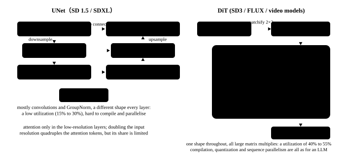

# The denoising network: from UNet to DiT

<p class="lead">The denoising network takes essentially all of generation's computation, and what it looks like decides which optimisations apply. SD 1.5 and SDXL use a convolutional UNet: a resolution pyramid, skip connections, and attention only on the low-resolution levels. PixArt, SD3, FLUX and every mainstream video model switched to a DiT: cut the latents into patches, turn them into a sequence of tokens, and the rest is a standard Transformer. This chapter builds both from minimal configurations and makes clear how their token counts are computed, where the computation sits and where the conditioning enters. All of that decides directly how attention acceleration, sequence parallelism and feature caching are done later.</p>

!!! question "Self-test: if you can answer these, skip the chapter"
    1. Why does a UNet compute attention only on the low-resolution levels? How does its distribution of computation differ from a DiT's?
    2. How is a DiT's token count computed? How many tokens does FLUX's denoising network handle for a 1024x1024 image?
    3. How are the timestep and the text condition each injected into a UNet and a DiT? What is AdaLN-Zero?
    4. How does MMDiT's (SD3's, FLUX's) dual stream differ from a DiT's cross-attention? What does that mean for inference?
    5. Why is a DiT said to suit an inference system's usual optimisations (sequence parallelism, caching, compilation) better than a UNet?

??? success "Answers for the self-test (answer first, then open this)"
    1. Attention is quadratic in the token count, and a UNet's highest-resolution feature map has too many tokens (SDXL's 128x128 = 16384), so self- and cross-attention are computed only on the levels downsampled by 2 to 4 while the high-resolution levels are convolution alone. A UNet's computation is spread across convolutions and attention of differing shapes; a DiT has the same shape at every layer with essentially all of the computation in attention's and the MLP's matrix multiplies.
    2. The token count is (latent height / patch) x (latent width / patch). FLUX: 1024/8 = 128, 128/2 = 64, so 64 x 64 = 4096 image tokens, joined by 512 T5 text tokens for joint attention.
    3. UNet: the timestep goes through a sinusoidal encoding and an MLP and is added to each residual block's features, while the text enters through cross-attention. DiT: the timestep (with a pooled text vector) goes through an MLP producing each layer's LayerNorm scale, shift and gate (AdaLN), with the gate initialised to zero (AdaLN-Zero) so that each block starts as the identity; the text tokens enter through cross-attention (PixArt) or joint attention (SD3, FLUX).
    4. In cross-attention the text is only keys and values; MMDiT concatenates the text and image tokens into one sequence for self-attention, with separate weights for each kind of token (the dual stream), so the text representation is updated too. For inference the sequence is longer (image plus text) but the structure is more uniform and one attention kernel covers everything.
    5. Every layer has the same shape and is nothing but matrix multiplies and attention, exactly like an LLM's Transformer block, so FlashAttention, sequence parallelism, torch.compile and per-layer caching all carry over directly; a UNet's convolutions, skip connections across resolutions and differing per-layer shapes make all of these special cases.

## UNet: convolution on a resolution pyramid {#unet分辨率金字塔上的卷积}

SD 1.5's and SDXL's UNet has three parts: a downsampling path (halving the resolution and doubling the channels at each level), a middle block, and an upsampling path (symmetric to the downsampling, with skip connections bringing the same-resolution features back). Attention sits only on the low-resolution levels:

```python
import torch
from diffusers import UNet2DConditionModel

torch.manual_seed(0)
# a three-level pyramid, 16 to 8 to 4, with attention only on the last two levels (as SD 1.5 does, with no attention on the highest-resolution level)
unet = UNet2DConditionModel(sample_size=16, in_channels=4, out_channels=4, block_out_channels=(32, 64, 64), layers_per_block=1,
                            down_block_types=("DownBlock2D", "CrossAttnDownBlock2D", "CrossAttnDownBlock2D"),
                            up_block_types=("CrossAttnUpBlock2D", "UpBlock2D", "UpBlock2D"),
                            cross_attention_dim=32, attention_head_dim=8, norm_num_groups=8)

# a hook records each block's output shape, to see how the resolution changes
shapes = []
def rec(name):
    def hook(m, i, o):
        out = o[0] if isinstance(o, tuple) else o
        shapes.append((name, tuple(out.shape[-2:]), out.shape[1]))
    return hook
for i, blk in enumerate(unet.down_blocks):
    blk.register_forward_hook(rec(f"down{i} {type(blk).__name__}"))
unet.mid_block.register_forward_hook(rec("mid"))
for i, blk in enumerate(unet.up_blocks):
    blk.register_forward_hook(rec(f"up{i} {type(blk).__name__}"))

with torch.no_grad():
    unet(torch.randn(1, 4, 16, 16), torch.tensor([500]), encoder_hidden_states=torch.randn(1, 8, 32))
for name, hw, c in shapes:
    attn = "注意力" if "CrossAttn" in name or name == "mid" else "只有卷积"
    print(f"{name:<28} 特征图 {hw[0]:>2}×{hw[1]:<2} 通道 {c:>3}  token 数 {hw[0] * hw[1]:>4}  {attn}")
```

```text title="output"
down0 DownBlock2D            特征图  8×8  通道  32  token 数   64  只有卷积
down1 CrossAttnDownBlock2D   特征图  4×4  通道  64  token 数   16  注意力
down2 CrossAttnDownBlock2D   特征图  4×4  通道  64  token 数   16  注意力
mid                          特征图  4×4  通道  64  token 数   16  注意力
up0 CrossAttnUpBlock2D       特征图  8×8  通道  64  token 数   64  注意力
up1 UpBlock2D                特征图 16×16 通道  64  token 数  256  只有卷积
up2 UpBlock2D                特征图 16×16 通道  32  token 数  256  只有卷积
```

Scaled up to SDXL's real size: latents of 128x128 and a three-level pyramid of 128, 64, 32. Attention on the highest-resolution level would be 16384 tokens and an attention matrix of 16384² or about 270 million entries, so SDXL computes it only at 64x64 (4096 tokens) and 32x32 (1024 tokens), stacking most of its Transformer blocks at 32x32. **A UNet's computation is spread across convolutions and attention of differing shapes**, which is the root of its difficulty: every layer wants its own kernel and its own partitioning decision.

## DiT: cutting the image into tokens {#dit把图切成-token}

{.aig-svg}

A DiT cuts the latents into $p \times p$ patches (usually $p = 2$), flattens each into a vector and projects it into a token. The rest is a standard Transformer: the same shape at every layer, nothing but matrix multiplies and attention.

```python
from diffusers import DiTTransformer2DModel

torch.manual_seed(0)
dit = DiTTransformer2DModel(num_attention_heads=2, attention_head_dim=8, in_channels=4, out_channels=8,
                            num_layers=2, sample_size=16, patch_size=2, num_embeds_ada_norm=1000)
x = torch.randn(1, 4, 16, 16)
with torch.no_grad():
    out = dit(x, timestep=torch.tensor([500]), class_labels=torch.tensor([3])).sample
tokens = (16 // 2) ** 2
print(f"潜变量 16×16，patch 2 → {tokens} 个 token，每个 token {dit.config.num_attention_heads * dit.config.attention_head_dim} 维")
print(f"输出 {tuple(out.shape)}：out_channels=8 是 4 个均值 + 4 个方差（DiT 原版同时预测方差，推理时只用均值）")
print(f"每层参数 {sum(p.numel() for p in dit.transformer_blocks[0].parameters()) / 1e3:.1f}K，{len(dit.transformer_blocks)} 层形状完全相同")
```

```text title="output"
潜变量 16×16，patch 2 → 64 个 token，每个 token 16 维
输出 (1, 8, 16, 16)：out_channels=8 是 4 个均值 + 4 个方差（DiT 原版同时预测方差，推理时只用均值）
每层参数 25.2K，2 层形状完全相同
```

The token-count formula is the starting point for every performance estimate:

$$
N = \frac{H}{f \cdot p} \times \frac{W}{f \cdot p} \quad (\times\ \frac{T}{f_t \cdot p_t}\ \text{for video})
$$

where $f$ is the VAE's spatial compression (8 or 16), $p$ is the patch size (1 or 2), and video multiplies by the time dimension ($f_t$ is usually 4). Substituting the mainstream models:

```python
MODELS = [
    # name,              resolution (T, H, W),  VAE compression (ft, f),  patch (pt, p),  text tokens
    ("PixArt-Σ 1024²",   (1, 1024, 1024),   (1, 8),  (1, 2),  300),
    ("SD3-medium 1024²", (1, 1024, 1024),   (1, 8),  (1, 2),  333),
    ("FLUX.1 1024²",     (1, 1024, 1024),   (1, 8),  (1, 2),  512),
    ("FLUX.1 2048²",     (1, 2048, 2048),   (1, 8),  (1, 2),  512),
    ("CogVideoX-5B 480p 49 帧", (49, 480, 720), (4, 8), (1, 2), 226),
    ("Wan 2.1 720p 81 帧",  (81, 720, 1280),  (4, 8),  (1, 2),  512),
    ("HunyuanVideo 720p 129 帧", (129, 720, 1280), (4, 8), (1, 2), 256),
]
print(f"{'模型':<26} {'潜变量 T×H×W':>16} {'图像/视频 token':>14} {'文本 token':>9} {'注意力序列':>9}")
for name, (T, H, W), (ft, f), (pt, p), txt in MODELS:
    lt = 1 + (T - 1) // ft if T > 1 else 1               # a video VAE is usually the first frame plus one frame per 4
    lh, lw = H // f, W // f
    n = (lt // pt) * (lh // p) * (lw // p)
    print(f"{name:<26} {f'{lt}×{lh}×{lw}':>16} {n:>14,} {txt:>9} {n + txt:>9,}")
```

```text title="output"
模型                                潜变量 T×H×W    图像/视频 token  文本 token     注意力序列
PixArt-Σ 1024²                    1×128×128          4,096       300     4,396
SD3-medium 1024²                  1×128×128          4,096       333     4,429
FLUX.1 1024²                      1×128×128          4,096       512     4,608
FLUX.1 2048²                      1×256×256         16,384       512    16,896
CogVideoX-5B 480p 49 帧             13×60×90         17,550       226    17,776
Wan 2.1 720p 81 帧                 21×90×160         75,600       512    76,112
HunyuanVideo 720p 129 帧           33×90×160        118,800       256   119,056
```

Image models' sequences are in the thousands and video models' go straight to a hundred thousand. Attention's computation is proportional to $N^2$, so one attention layer over a hundred thousand tokens is on the order of $10^{10}$ scores. That is the entire origin of the chapter on video inference's bottleneck.

## How the conditioning enters: AdaLN and two kinds of attention {#条件怎么注入adaln-与两种注意力}

The timestep and the text are conditions of different natures: the timestep is one scalar, the same for every token; the text is a sequence of vectors that has to interact with each image token.

**The timestep goes to AdaLN.** A DiT sends the timestep's encoding (plus a pooled text vector) through an MLP that outputs each layer's LayerNorm scale $\gamma$, shift $\beta$ and residual gate $\alpha$: $x \leftarrow x + \alpha \cdot \text{Block}(\gamma \cdot \text{LN}(x) + \beta)$. AdaLN-Zero initialises $\alpha$ to 0 so that each block starts as the identity, which is what makes a deep network train stably. For inference it means that **within one step all of the tokens share one set of modulation coefficients**, and those depend only on the timestep. Feature caching (TeaCache) decides whether a step can be skipped by exactly this: comparing the modulated inputs of two neighbouring steps.

**The text goes to attention.** There are two ways:

| | Cross-attention (PixArt, UNet) | Joint attention / MMDiT (SD3, FLUX, Wan) |
| --- | --- | --- |
| The text's role | only keys and values, never updated | concatenated with the image tokens into one self-attention sequence, with the text representation updated layer by layer |
| Weights | one set, for the image | separate QKV and MLP for the image and the text (the dual stream), shared in FLUX's later half (the single stream) |
| Sequence length | the image token count | the image plus text token count |
| For inference | the text's keys and values can be computed and cached in advance | a longer sequence, but only one kind of attention kernel; the text part cannot be cached |

Here is the difference between the dual and single streams in FLUX's architecture, whose first 19 layers are dual stream (separate parameters for image and text) and whose last 38 are single stream (concatenated and sharing one set):

```python
from diffusers import FluxTransformer2DModel

torch.manual_seed(0)
flux = FluxTransformer2DModel(patch_size=1, in_channels=16, num_layers=2, num_single_layers=4, attention_head_dim=8,
                              num_attention_heads=2, joint_attention_dim=16, pooled_projection_dim=16, axes_dims_rope=(2, 2, 4),
                              guidance_embeds=True)                           # the dev version: the guidance strength is an input
n_img, n_txt, d = 64, 8, 16
img = torch.randn(1, n_img, 16)                                   # the image latents already packed into tokens
txt = torch.randn(1, n_txt, 16)                                   # T5's text tokens
img_ids = torch.zeros(n_img, 3); img_ids[:, 1] = torch.arange(n_img) // 8; img_ids[:, 2] = torch.arange(n_img) % 8   # the 2D positions
txt_ids = torch.zeros(n_txt, 3)
with torch.no_grad():
    out = flux(hidden_states=img, encoder_hidden_states=txt, pooled_projections=torch.randn(1, 16),
               timestep=torch.tensor([0.5]), img_ids=img_ids, txt_ids=txt_ids, guidance=torch.tensor([3.5])).sample
double = sum(p.numel() for p in flux.transformer_blocks[0].parameters())
single = sum(p.numel() for p in flux.single_transformer_blocks[0].parameters())
print(f"输出 {tuple(out.shape)}：只还给图像 token，文本 token 在最后被丢掉")
print(f"双流块参数 {double / 1e3:.1f}K（图像、文本各一套），单流块参数 {single / 1e3:.1f}K（共享一套）")
print(f"注意力序列长度 {n_img + n_txt}（图像 {n_img} + 文本 {n_txt}），guidance 是一个输入标量——引导已经蒸馏进模型")
```

```text title="output"
输出 (1, 64, 16)：只还给图像 token，文本 token 在最后被丢掉
双流块参数 9.7K（图像、文本各一套），单流块参数 4.0K（共享一套）
注意力序列长度 72（图像 64 + 文本 8），guidance 是一个输入标量——引导已经蒸馏进模型
```

FLUX's positional information uses **the 2D and 3D versions of RoPE**: each token's id is a (t, h, w) triple and the rotations act on separate ranges of dimensions. Like an LLM's one-dimensional RoPE, it does not change a vector's length, only its angles (see [Linear algebra](math://linear-algebra/)), so extrapolating the resolution and handling different aspect ratios come naturally. It is also why, under sequence parallelism, each card only has to know the ids of its own segment of tokens.

## How the computation is distributed in the two architectures {#两种结构的计算量分布}

For one forward pass, where a UNet's and a DiT's FLOPs go differs greatly. Counting them by operation type:

```python
from torch.utils.flop_counter import FlopCounterMode

def breakdown(fn):
    with FlopCounterMode(display=False) as fc:
        fn()
    tot = fc.get_total_flops()
    by = {}
    for mod, ops in fc.get_flop_counts().items():
        if mod != "Global":
            continue
        for op, n in ops.items():
            by[str(op).split(".")[-1]] = by.get(str(op).split(".")[-1], 0) + n
    return tot, {k: v / tot for k, v in sorted(by.items(), key=lambda kv: -kv[1])[:3]}

tot_u, by_u = breakdown(lambda: unet(torch.randn(1, 4, 16, 16), torch.tensor([500]), encoder_hidden_states=torch.randn(1, 8, 32)))
tot_d, by_d = breakdown(lambda: dit(torch.randn(1, 4, 16, 16), timestep=torch.tensor([500]), class_labels=torch.tensor([3])))
print("UNet：", ", ".join(f"{k} {v:.0%}" for k, v in by_u.items()))
print("DiT： ", ", ".join(f"{k} {v:.0%}" for k, v in by_d.items()))
```

```text title="output"
UNet： convolution 86%, addmm 10%, mm 3%
DiT：  addmm 96%, convolution 4%
```

A UNet's FLOPs are mostly in convolutions and a DiT's are almost all matrix multiplies (the linear layers plus attention's batched matrix multiplies). That decides which tools apply: convolutions rely on cuDNN and channels_last, matrix multiplies on Tensor Cores and FlashAttention; quantization is friendly to matrix multiplies and unfriendly to the GroupNorms inside convolutional blocks; sequence parallelism suits a token sequence naturally and needs special handling for a convolution's spatial dimensions (see [Multi-GPU parallelism](../perf/parallel.md)).

## The mainstream denoising networks {#主流去噪网络一览}

| Model | Architecture | Parameters | Conditioning | Positional encoding | Notes |
| --- | --- | --- | --- | --- | --- |
| SD 1.5 | UNet | 0.86B | timestep addition, text cross-attention | implicit in the convolutions | attention at 64x64 and below |
| SDXL | UNet | 2.6B | the same plus pooled text and size conditioning | implicit in the convolutions | 10 Transformer blocks stacked at the 32x32 level |
| PixArt-α / Σ | DiT | 0.6B | AdaLN (the timestep), cross-attention (T5) | 2D sinusoidal | the first to show a DiT could do text to image |
| SD3 / 3.5 | MMDiT | 2B / 8B | AdaLN, joint attention | 2D sinusoidal | dual streams for text and image |
| FLUX.1 | MMDiT | 12B | AdaLN, joint attention (19 dual + 38 single) | 2D RoPE | the dev version's guidance is distilled |
| CogVideoX | DiT | 2B / 5B | AdaLN, joint attention | 3D RoPE | full 3D attention |
| HunyuanVideo | MMDiT | 13B | AdaLN, joint attention (dual plus single) | 3D RoPE | full 3D attention |
| Wan 2.1 / 2.2 | DiT | 1.3B / 14B (2.2 is a mixture of experts) | AdaLN, cross-attention (umT5) | 3D RoPE | 2.2 splits into two experts by noise level |

The trend is clear: **every new model is in the DiT family**, video models without exception. The good news for an inference engineer is that their bodies are the same thing as an LLM's Transformer block, so most of the LLM inference toolkit (FlashAttention, sequence parallelism, compilation, quantization) carries over directly; the bad news is that there is no KV cache, so every step computes attention over a hundred thousand tokens in full.

!!! interview "How to answer in an interview"
    Asked what a DiT gives inference over a UNet, answer in three layers: structurally, every layer has the same shape and is nothing but matrix multiplies and attention, so FlashAttention, sequence parallelism and torch.compile apply directly, unlike a UNet with its special cases for convolutions and skip connections across resolutions; on conditioning, AdaLN makes a step's modulation coefficients depend only on the timestep, which feature caching uses to judge how similar neighbouring steps are; and the price is that the token count enters attention's quadratic term, so a video model's hundred-thousand-token sequence makes attention the outright bottleneck, with no KV cache to save and only kernels, parallelism and sparsity to fall back on.

## Exercises {#练习}

1. Change this chapter's `dit` to `patch_size=1`. What does the token count become? How many times the FLOPs? How many times for the attention part?

??? success "Answer"
    16x16 = 256 tokens, 4 times what it was. The linear layers' FLOPs are proportional to the token count, so 4 times; attention's two batched matrix multiplies are proportional to its square, so 16 times. The patch size is the most direct dial between resolution and computation, which is why FLUX packs 2x2 on top of the VAE's f8.

2. For the UNet example, measure each of the three resolution levels' share of the FLOPs (hint: wrap each block in its own `FlopCounterMode`). Is the highest-resolution level, which has only convolutions, a large share or a small one?

??? success "Answer"
    The highest-resolution level has few channels but a large feature map, and a convolution's FLOPs are proportional to $H \times W \times C_{in} \times C_{out}$, so its share is not small; SDXL's highest level has no attention and still a substantial amount of convolution, and its activations are the largest. This is one of the reasons a UNet is hard to partition evenly for parallelism.

3. FLUX's dual-stream block has separate QKV for the text and the image. If the text tokens' keys and values were computed on the first step and reused for the other 27, how much computation would that save? Is it correct to do?

??? success "Answer"
    The text is only about 11% of the sequence (512 of 4608) and its QKV projection is a small part of the linear layers, so it saves little; and in an MMDiT the text representation is updated at every layer and every step (it takes part in the self-attention and depends on the image tokens), so caching the first step's keys and values would change the result. This is unlike cross-attention, where the text is only keys and values. What can genuinely be cached is the text's keys and values in a cross-attention architecture (PixArt, Wan).

## Summary {#小结}

- [x] A UNet is a resolution pyramid with skip connections and attention only on the low-resolution levels; its computation is spread across convolutions and attention of differing shapes, so optimisation is a per-layer special case.
- [x] A DiT cuts the latents into tokens, with the same shape at every layer and nothing but matrix multiplies and attention; the token count is the latent size divided by the patch, and video multiplied by the time dimension reaches a hundred thousand easily.
- [x] The timestep enters through AdaLN (with all of a step's tokens sharing the modulation coefficients) and the text through cross or joint attention; FLUX uses dual plus single streams and 2D or 3D RoPE for position.
- [x] Every new model is in the DiT family and most of the LLM inference toolkit carries over, but there is no KV cache, so attention's quadratic term is the core bottleneck of video inference.
