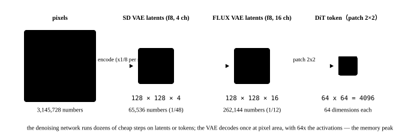

# The VAE and the latent space

<p class="lead">The denoising network never touches pixels: it works in the latent space a VAE compresses into, where a 1024x1024 image is only 128x128 (SD) or 64x64 packed tokens (FLUX). The VAE runs once and takes little of the computation, but it decides three things that matter a great deal for inference: how large the latent space is (the denoising network's token count), the memory peak when decoding (often higher than one denoising step's), and how the time dimension is compressed in a video model. This chapter works out the VAE's arithmetic and implements tiled decoding by hand.</p>

!!! question "Self-test: if you can answer these, skip the chapter"
    1. What shape does SD's VAE compress a 512x512x3 image into? What is the compression ratio? Why does a 16-channel VAE give better quality?
    2. What is `scaling_factor`? Why is it multiplied and divided around the denoising?
    3. How large are the VAE's activations when decoding a 1024x1024 image? Why larger than one denoising step's?
    4. Why does tiled decoding save memory? Why do the seams need overlap and blending?
    5. What does a video VAE's "4x8x8" mean? Why does it have to be causal?

??? success "Answers for the self-test (answer first, then open this)"
    1. Into 64x64x4: 8 times in each spatial direction and 3 channels into 4, a total of 48 times by element count. A 16-channel VAE (SD3, FLUX) gives each latent pixel more information and more than halves the reconstruction error, which is what preserves high-frequency detail like small text and faces, at the price of the denoising network's input channels going from 4 to 16 (barely any effect on computation).
    2. A scalar (0.18215 for SD 1.5) scaling the VAE's encoded latents to a standard deviation near 1, matching the noise scale the denoising network was trained at. Multiply after encoding and divide before decoding; forget it and the decoded image is badly overexposed or washed out.
    3. The decoder's last few layers have 128 to 256 channels at pixel resolution: 1024x1024x256 fp16 values is 512 MB, and several intermediates inside the residual blocks push the peak past 4 GB easily; one denoising step works on a 128x128 latent space with far smaller activations.
    4. Cut the latents into tiles and decode each separately, so only one tile's activations are in memory. Neighbouring tiles overlap and the overlap is blended linearly by weight, or the tile boundaries leave visible seams.
    5. The time dimension is compressed 4 frames into 1 and the space 8x8 into 1, so 81 frames of 720p become latents of 21x90x160. Causal means each latent frame depends only on the frames before it: the first frame can be encoded on its own (which is what image-to-video rests on) and a long video can be decoded in streaming segments without holding the whole video's activations in memory.

## How much it compresses {#压缩了多少}

{.aig-svg}

A minimal VAE shows the encode and decode shapes and what `scaling_factor` does:

```python
import torch
from diffusers import AutoencoderKL

torch.manual_seed(0)
vae = AutoencoderKL(in_channels=3, out_channels=3, block_out_channels=(32, 64, 64), latent_channels=4, norm_num_groups=8,
                    down_block_types=("DownEncoderBlock2D",) * 3, up_block_types=("UpDecoderBlock2D",) * 3, sample_size=64)
f = 2 ** (len(vae.config.block_out_channels) - 1)
img = torch.randn(1, 3, 96, 96)
with torch.no_grad():
    dist = vae.encode(img).latent_dist               # the encoder gives a Gaussian distribution (a mean and a variance)
    z = dist.sample() * vae.config.scaling_factor    # sample a latent, then multiply by scaling_factor
    rec = vae.decode(z / vae.config.scaling_factor).sample
print(f"图像 {tuple(img.shape)} → 潜变量 {tuple(z.shape)}：空间压缩 1/{f}，元素数压缩 {img.numel() / z.numel():.0f} 倍")
print(f"scaling_factor={vae.config.scaling_factor}：真实 SD VAE 编码出的潜变量标准差约 5.5，乘上它才接近 1，和去噪网络训练时的噪声尺度一致"
      f"（这个随机初始化的玩具 VAE 没有这个性质，编码出的标准差只有 {dist.sample().std():.2f}）")
print(f"解码回 {tuple(rec.shape)}")
```

```text title="output"
图像 (1, 3, 96, 96) → 潜变量 (1, 4, 24, 24)：空间压缩 1/4，元素数压缩 12 倍
scaling_factor=0.18215：真实 SD VAE 编码出的潜变量标准差约 5.5，乘上它才接近 1，和去噪网络训练时的噪声尺度一致（这个随机初始化的玩具 VAE 没有这个性质，编码出的标准差只有 1.19）
解码回 (1, 3, 96, 96)
```

The mainstream VAEs' configurations:

| VAE | Spatial compression | Temporal | Latent channels | Who uses it | Notes |
| --- | --- | --- | --- | --- | --- |
| SD VAE (kl-f8) | 8 | — | 4 | SD 1.5, SDXL | 1024² to 128x128x4 |
| SD3 / FLUX VAE | 8 | — | 16 | SD3, FLUX | the same spatial size with 4 times the information, noticeably better detail |
| DC-AE | 32 | — | 32 to 128 | SANA | extreme compression, 16 times fewer tokens, bought for the DiT's speed |
| CogVideoX 3D VAE | 8 | 4 | 16 | CogVideoX | causal 3D convolutions |
| HunyuanVideo VAE | 8 | 4 | 16 | HunyuanVideo | 3D causal |
| Wan-VAE | 8 | 4 | 16 | Wan 2.1 / 2.2 | causal, supporting streaming segmented decoding |
| LTX-Video VAE | 32 | 8 | 128 | LTX-Video | the most aggressive compression and the fastest, with the decoder taking on some of the denoising |

**The spatial compression ratio sets the denoising network's token count directly** (see the formula in [The denoising network](unet-to-dit.md)). DC-AE replaces f8 with f32, giving 16 times fewer tokens and 256 times less attention at the same resolution, which is how SANA produces 4K images on a laptop. The cost moves to the VAE: the more aggressive the compression, the larger the VAE, the harder it is to train and the more expensive to decode.

## The decode's memory peak {#解码的显存峰值}

A VAE decoder has wide channels at pixel resolution, and its activations are far larger than one denoising step's. A hook records the largest intermediate tensor during decoding:

```python
peak = {"numel": 0, "shape": None, "where": ""}
def watch(name):
    def hook(m, i, o):
        out = o[0] if isinstance(o, tuple) else o
        if torch.is_tensor(out) and out.numel() > peak["numel"]:
            peak.update(numel=out.numel(), shape=tuple(out.shape), where=name)
    return hook
for name, m in vae.decoder.named_modules():
    if isinstance(m, torch.nn.Conv2d):
        m.register_forward_hook(watch(name))
with torch.no_grad():
    vae.decode(z / vae.config.scaling_factor)
print(f"解码时最大的中间张量：{peak['shape']}，在 {peak['where']}")
print(f"它是潜变量元素数的 {peak['numel'] / z.numel():.0f} 倍")

# scaled to real size: SD's VAE decoding 1024x1024, whose widest pixel-level feature is 128 channels
H = W = 1024
act = H * W * 128 * 2                                  # fp16, one copy
print(f"SD VAE 解码 1024²：一份像素级特征就有 {act / 2 ** 20:.0f} MB；残差块里同时存着好几份，GroupNorm 还要 fp32 副本，实测峰值 2～4 GB")
print(f"对比去噪一步：SDXL UNet 在 128×128 潜空间上，最大的激活约 128×128×320×2 字节 = {128 * 128 * 320 * 2 / 2 ** 20:.0f} MB")
```

```text title="output"
解码时最大的中间张量：(1, 64, 96, 96)，在 up_blocks.1.upsamplers.0.conv
它是潜变量元素数的 256 倍
SD VAE 解码 1024²：一份像素级特征就有 256 MB；残差块里同时存着好几份，GroupNorm 还要 fp32 副本，实测峰值 2～4 GB
对比去噪一步：SDXL UNet 在 128×128 潜空间上，最大的激活约 128×128×320×2 字节 = 10 MB
```

This is where "the denoising ran fine and then the decode ran out of memory" comes from: **the denoising network's activations are in the latent space and the VAE's are in pixel space, an area 64 times larger**. Video is more extreme: one decode of 81 frames of 720p has 81 times a single image's pixel-level activations and simply will not fit without tiling.

## Tiled decoding {#分块解码}

Since convolution is local, the latents can be cut into tiles and decoded separately with only one tile's activations in memory. But the receptive field is cut off at a tile's boundary and joining them directly leaves seams; what diffusers does is **overlap the tiles and blend the overlap by a linear weight**. Here is a minimal implementation of it, against a whole-image decode:

```python
def tiled_decode(vae, z, tile=16, overlap=4):
    """潜空间按 tile 切块（相邻块重叠 overlap），分别解码后在重叠区线性混合。"""
    f = 2 ** (len(vae.config.block_out_channels) - 1)
    _, _, H, W = z.shape
    stride = tile - overlap
    out = torch.zeros(1, 3, H * f, W * f)
    weight = torch.zeros(1, 1, H * f, W * f)
    ramp = torch.linspace(0, 1, overlap * f)                # the overlap's blending weight, from 0 to 1
    tiles = 0
    for y in range(0, H - overlap, stride):
        for x in range(0, W - overlap, stride):
            y1, x1 = min(y + tile, H), min(x + tile, W)
            with torch.no_grad():
                piece = vae.decode(z[:, :, y:y1, x:x1] / vae.config.scaling_factor).sample
            w = torch.ones(1, 1, piece.shape[2], piece.shape[3])
            if y > 0: w[:, :, :overlap * f, :] *= ramp[:, None]
            if x > 0: w[:, :, :, :overlap * f] *= ramp[None, :]
            out[:, :, y * f:y1 * f, x * f:x1 * f] += piece * w
            weight[:, :, y * f:y1 * f, x * f:x1 * f] += w
            tiles += 1
    return out / weight, tiles

full = rec
tiled, n_tiles = tiled_decode(vae, z, tile=12, overlap=4)
err = (tiled - full).abs()
print(f"切成 {n_tiles} 块解码，和整图解码的平均误差 {err.mean():.4f}，最大误差 {err.max():.4f}（像素范围约 ±3）")
print(f"每块只解码 {12 * f}×{12 * f} 像素，像素级激活是整图的 1/{(full.shape[2] * full.shape[3]) / (12 * f) ** 2:.0f}，显存峰值按同样比例下降")
```

```text title="output"
切成 9 块解码，和整图解码的平均误差 0.1134，最大误差 1.2141（像素范围约 ±3）
每块只解码 48×48 像素，像素级激活是整图的 1/4，显存峰值按同样比例下降
```

The error is not zero: the receptive field at a boundary is incomplete and the blending only hides it. More overlap gets closer to a whole-image decode at the price of more repeated computation (with an overlap of 4 and a tile of 12, over half of each tile's area is computed twice). The empirical values in real deployments: SD's VAE uses 512-pixel tiles with a 64-pixel overlap, which leaves no visible seam and takes the memory from several gigabytes to a few hundred megabytes.

Two variants of the same idea:

- **Tiled encoding** (used for image-to-image and for a video's first-frame condition), on the same principle.
- **Temporal tiling**: a video VAE decodes in segments of latent frames, and the causal structure guarantees that an earlier segment does not depend on a later one. Wan's VAE turns this into a streaming interface that emits frames as it decodes.

## Preview decoders {#预览解码器}

Wanting a rough look partway through the denoising (a user preview, an early cancellation) does not justify a full VAE pass. **A distilled small decoder** like TAESD is a few megabytes and a few convolutional layers, producing a blurry but recognisable image straight from the latents:

```python
import torch.nn as nn

class TinyDecoder(nn.Module):                        # a minimal illustration: a tower of upsampling convolutions, roughly TAESD's structure
    def __init__(self, latent_channels, f):
        super().__init__()
        layers, c = [], latent_channels
        for _ in range(int(f).bit_length() - 1):     # x2 per level, up to pixel resolution
            layers += [nn.Conv2d(c, 16, 3, padding=1), nn.ReLU(), nn.Upsample(scale_factor=2)]
            c = 16
        layers += [nn.Conv2d(c, 3, 3, padding=1)]
        self.net = nn.Sequential(*layers)
    def forward(self, z):
        return self.net(z)

tiny = TinyDecoder(4, f)
with torch.no_grad():
    preview = tiny(z)
print(f"完整 VAE 解码器 {sum(p.numel() for p in vae.decoder.parameters()) / 1e3:.0f}K 参数，"
      f"预览解码器 {sum(p.numel() for p in tiny.parameters()) / 1e3:.1f}K 参数，输出同样是 {tuple(preview.shape)}")
```

```text title="output"
完整 VAE 解码器 587K 参数，预览解码器 3.3K 参数，输出同样是 (1, 3, 96, 96)
```

The real TAESD is 1.2M parameters against SD's VAE decoder's roughly 50M, an order of magnitude faster, and it is what the "live preview" in a web UI uses. The serving layer can treat it as progressive output: give the user a preview every few steps, and if they are unhappy they cancel, saving every remaining step's compute (see [Scheduling a generation service](../serving/scheduling.md)).

## The video VAE: compressing time as well {#视频-vae时间维也要压}

A video model's VAE compresses the time dimension too: CogVideoX, HunyuanVideo and Wan are all **4x8x8**, compressing 4 frames into 1 latent frame and each 8x8 of space into 1. What that means for the denoising network:

```python
def latent_shape(frames, h, w, ft=4, f=8):
    return 1 + (frames - 1) // ft, h // f, w // f         # the first frame is encoded on its own, and after that every ft frames become one

for name, frames, h, w in [("CogVideoX 480p 49 帧", 49, 480, 720), ("Wan 2.1 480p 81 帧", 81, 480, 832),
                           ("Wan 2.1 720p 81 帧", 81, 720, 1280), ("HunyuanVideo 720p 129 帧", 129, 720, 1280)]:
    T, H, W = latent_shape(frames, h, w)
    pixels = frames * h * w * 3
    latent = T * H * W * 16
    print(f"{name:<24} 像素 {pixels / 1e6:>6.1f}M 个值 → 潜变量 {T}×{H}×{W}×16 = {latent / 1e6:>5.2f}M 个值，压缩 {pixels / latent:>4.0f} 倍")
```

```text title="output"
CogVideoX 480p 49 帧      像素   50.8M 个值 → 潜变量 13×60×90×16 =  1.12M 个值，压缩   45 倍
Wan 2.1 480p 81 帧        像素   97.0M 个值 → 潜变量 21×60×104×16 =  2.10M 个值，压缩   46 倍
Wan 2.1 720p 81 帧        像素  223.9M 个值 → 潜变量 21×90×160×16 =  4.84M 个值，压缩   46 倍
HunyuanVideo 720p 129 帧  像素  356.7M 个值 → 潜变量 33×90×160×16 =  7.60M 个值，压缩   47 倍
```

About 48 times, comparable to an image VAE, but the starting point is hundreds of millions of pixels, so the latents alone hold millions of values and the denoising network's token count reaches a hundred thousand. Two more designs are particular to video:

- **Causality**: each latent frame sees only the frames before it. The first frame can be encoded into a latent frame on its own (which is why the frame counts are 4k+1: 49, 81, 129), and image-to-video puts that first frame's latents in as the condition; decoding can also proceed in streaming temporal segments without holding the whole video's activations in memory.
- **Decoding is the larger cost**: 81 frames of 720p has 81 times a single image's pixel-level activations and will not fit without tiling in both time and space. LTX-Video simply compresses its VAE to 32x32x8 and has the decoder take on some of the denoising, trading decode quality for speed.

!!! interview "How to answer in an interview"
    Asked why the VAE matters for inference, three points: (1) its spatial compression ratio sets the denoising network's token count, and f8 against f32 is a 16-fold difference in tokens and 256-fold in attention; (2) its decoding has wide channels at pixel resolution and its activation peak often exceeds one denoising step's, hence tiled decoding with overlapping blended tiles to remove the seams; (3) a video VAE adds temporal compression (4x8x8) and causality, and the causality is what makes first-frame conditioning and streaming segmented decoding possible. Add a word on TAESD: a few-megabyte distilled decoder for previews, which is the basis for progressive output and early cancellation in the serving layer.

## Exercises {#练习}

1. Set `tiled_decode`'s `overlap` to 0 and then 8, and look at the error and the tile count in each case. How much overlap is right?

??? success "Answer"
    At overlap=0 the error at the tile boundaries is obvious (the seams); at overlap=8 the error is near zero but there are more tiles and more repeated computation. The right overlap is on the order of the decoder's receptive field: SD's VAE decoder has a receptive field of a few dozen pixels, so a 64-pixel (8 in latent space) overlap already leaves no visible seam.

2. SDXL's VAE produces NaNs when decoding in fp16, and there is an official `madebyollin/sdxl-vae-fp16-fix`. Guess where the problem is and how it is fixed.

??? success "Answer"
    Some layers' activations in the decoder exceed fp16's range (65504), overflow to inf, and become NaN after a normalisation. The fixed version rescales the weights so that the activations fall back within fp16's range; in engineering you can also run the VAE alone in bf16 or fp32 (it runs once, so the precision cost is acceptable), or use `force_upcast`. This is the classic case of mixed precision not being one size fits all (see [Mixed precision and FP8 training](train://practice/mixed-precision/)).

3. Decoding 81 frames of 720p with Wan-VAE, estimating the pixel-level features at 128 channels in fp16: how large is the activation peak for decoding it all at once? Into how many temporal segments does it have to be split to stay under 8 GB (counting one copy of the features)?

??? success "Answer"
    One copy of the pixel-level features is 81 x 720 x 1280 x 128 x 2 bytes, about 19 GB; with several copies alive inside the residual blocks the peak far exceeds 40 GB. Split into 4 temporal segments (about 20 frames each), one copy is about 4.8 GB, and adding spatial tiling brings it to a few gigabytes. A causal VAE makes temporal segmentation natural, which is why Wan's decoder is a streaming one.

## Summary {#小结}

- [x] A VAE compresses pixels into a latent space (SD's is 1/8 in space with 4 or 16 channels), and the spatial compression ratio sets the denoising network's token count directly; `scaling_factor` aligns the latents with the denoising network's noise scale.
- [x] The decoder works at pixel resolution and its activation peak often exceeds one denoising step's; tiled decoding with blended overlaps brings the peak down, at the price of a little repeated computation at the boundaries.
- [x] A distilled small decoder like TAESD is used for previews and is the basis for progressive output and early cancellation.
- [x] A video VAE is a causal 4x8x8 compression: the first frame is encoded on its own (hence frame counts of 4k+1) and decoding can stream in temporal segments; the decode's activations are the easiest place in video inference to run out of memory.
