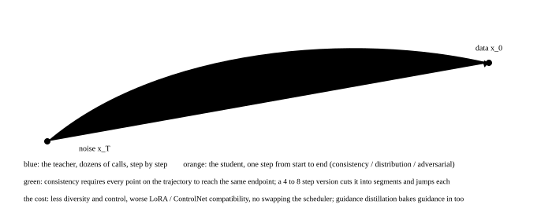

# Few-step generation: distilling 50 steps into 4

<p class="lead">The largest term in the cost formula is the step count. Samplers took DDPM's 1000 steps down to 20 to 50, and below that it is no longer the solver's business: the model itself has to change, and distillation teaches a student to cover in one step what the teacher covers in dozens. This chapter sorts the mainstream few-step methods by principle, does one-step distillation by hand on a two-dimensional toy on a CPU to see why it works and what it costs, and then puts SDXL-Turbo, Lightning, LCM, Hyper-SD and FLUX schnell back into the cost formula to work out what each saves and what it gives up.</p>

!!! question "Self-test: if you can answer these, skip the chapter"
    1. Why can a sampler only get the step count down to about 20, with distillation needed below that?
    2. What do progressive distillation, consistency models, adversarial distillation and distribution-matching distillation each learn?
    3. Which term does guidance distillation save? Where does FLUX.1-dev's `guidance` input come from?
    4. What do few-step models cost? When should they not be used?
    5. Why can an LCM-LoRA be plugged into any model with the same base?

??? success "Answers for the self-test (answer first, then open this)"
    1. A solver's accuracy is limited by how curved the velocity field is, and a real model's trajectory curves sharply at the high-noise end, so a large step's error exceeds what is acceptable. Distillation changes the velocity field itself: the student predicts the endpoint or a straighter trajectory directly at a few points, rather than relying on a solver walking along a curve.
    2. Progressive distillation: the student's one step imitates the teacher's two, halved repeatedly. Consistency models: learn a map from any point on the trajectory straight to the endpoint (one step from any $t$ to $x_0$), with more steps only refining. Adversarial distillation: a discriminator pushes the student's one-step output to look like a real image, no longer matching the teacher pointwise. Distribution-matching distillation: make the student's output distribution match the teacher's in the sense of the score function, using the teacher as a scorer.
    3. It saves guidance's extra forward pass: training takes the guided prediction $v_\varnothing + w(v_c - v_\varnothing)$ as the target and teaches the student $w$ as an extra input, so one forward pass at inference is equivalent to the two-path extrapolation. FLUX.1-dev was distilled this way, which is why it takes a scalar `guidance`.
    4. Reduced diversity (especially with adversarial distillation, where the output collapses toward a few attractive modes), a quality ceiling slightly below the teacher's, almost no freedom to change the sampler or the step count (LCM requires the LCM scheduler, and Turbo gets worse above 4 steps), and compatibility with LoRA, ControlNet and other plugins that has to be re-verified. Not for the highest quality, for many varied candidates, or for controllable editing.
    5. It learns the **increment** to the weights that compresses the teacher's many-step trajectory into a few steps, and that increment is broadly transferable between fine-tunes of the same base; adding it as a LoRA to any SD 1.5 or SDXL fine-tune gives 4-step generation.

## Why the solver stops here {#为什么求解器到此为止}

In the toy from [the samplers chapter](../basics/schedulers.md) the error falls monotonically with the step count, but a real model's velocity field curves sharply at the high-noise end and 4 Euler steps already have an unacceptable error. Distillation does not improve the solver but **changes the model**: at a few sampling points, the student gives the endpoint directly.

Training a two-dimensional flow-matching teacher and then distilling a one-step student, and seeing how each performs at different step counts. "Quality" here is a computable metric: the fraction of generated samples landing near a mode.

```python
import math
import torch
import torch.nn as nn

torch.manual_seed(0)
K, R = 8, 2.0                                                    # the target distribution: 8 Gaussians on a circle

def sample_data(n):
    idx = torch.randint(0, K, (n,))
    ang = idx.float() * (2 * math.pi / K)
    return torch.stack([R * ang.cos(), R * ang.sin()], dim=1) + 0.08 * torch.randn(n, 2)

class Velocity(nn.Module):
    def __init__(self, h=96):
        super().__init__()
        self.net = nn.Sequential(nn.Linear(3, h), nn.SiLU(), nn.Linear(h, h), nn.SiLU(), nn.Linear(h, 2))
    def forward(self, x, t):
        return self.net(torch.cat([x, t], dim=1))

teacher = Velocity()
opt = torch.optim.AdamW(teacher.parameters(), lr=3e-3)
for step in range(3000):                                         # the teacher: standard flow-matching training
    x1, x0 = sample_data(256), torch.randn(256, 2)
    t = torch.rand(256, 1)
    loss = ((teacher((1 - t) * x0 + t * x1, t) - (x1 - x0)) ** 2).mean()
    opt.zero_grad(); loss.backward(); opt.step()

@torch.no_grad()
def ode(model, x, steps):                                        # from noise (t=0) to data (t=1) with Euler's method
    for i in range(steps):
        t = torch.full((x.shape[0], 1), i / steps)
        x = x + model(x, t) / steps
    return x

centers = torch.stack([R * torch.cos(torch.arange(K) * 2 * math.pi / K), R * torch.sin(torch.arange(K) * 2 * math.pi / K)], 1)
def hit_rate(x):
    return (torch.cdist(x, centers).min(1).values < 0.3).float().mean().item()

torch.manual_seed(1)
noise = torch.randn(4000, 2)
print("老师在不同步数下的命中率（样本落在模态 0.3 半径内的比例）：")
for steps in (1, 2, 4, 8, 50):
    print(f"  {steps:>2} 步  {hit_rate(ode(teacher, noise, steps)):.0%}")
```

```text title="output"
老师在不同步数下的命中率（样本落在模态 0.3 半径内的比例）：
   1 步  0%
   2 步  11%
   4 步  56%
   8 步  69%
  50 步  79%
```

The teacher at 1 and 2 steps draws essentially nothing and needs dozens to look right. That is the solver's limit.

## One-step distillation: the student learns the teacher's endpoint {#一步蒸馏学生学老师的终点}

{.aig-svg}

The simplest distillation: for each noise sample $x_0$, the teacher computes the endpoint $x_1^{\text{teacher}}$ in 50 steps, and the student starting from the same $x_0$ takes one step and has to land in the same place. The student has the teacher's architecture and starts from the teacher's weights:

```python
import copy

student = copy.deepcopy(teacher)
opt = torch.optim.AdamW(student.parameters(), lr=1e-3)
t0 = torch.zeros(256, 1)
for step in range(1500):
    x0 = torch.randn(256, 2)
    target = ode(teacher, x0, 50)                                # the endpoint the teacher reaches in 50 steps
    pred = x0 + student(x0, t0)                                  # the student's one step: x0 + v·1
    loss = ((pred - target) ** 2).mean()
    opt.zero_grad(); loss.backward(); opt.step()

print("蒸馏后：")
for name, model, steps in [("老师 1 步", teacher, 1), ("老师 4 步", teacher, 4), ("老师 50 步", teacher, 50), ("学生 1 步", student, 1)]:
    print(f"  {name:<9} 命中率 {hit_rate(ode(model, noise, steps)):.0%}")
mode_counts = torch.bincount(torch.cdist(ode(student, noise, 1), centers).argmin(1), minlength=K)
print(f"学生 1 步生成落在各模态的样本数：{mode_counts.tolist()}（理想是每个 500）")
```

```text title="output"
蒸馏后：
  老师 1 步    命中率 0%
  老师 4 步    命中率 56%
  老师 50 步   命中率 79%
  学生 1 步    命中率 63%
学生 1 步生成落在各模态的样本数：[482, 498, 504, 547, 502, 477, 513, 477]（理想是每个 500）
```

In **one forward pass** the student goes from the teacher's 0% at 1 step to roughly the teacher's level at 8 steps, with the evaluations down from 50 to 1; there is still a gap to the teacher's 50 steps, and closing it is what the later methods are for. Two details to note are exactly where the real methods diverge:

- This student learns a map from noise straight to the endpoint, so it **only knows one step**, and taking more is not even defined. Consistency models solve exactly that: one step to the endpoint from any $t$, with more steps refining.
- The target is the teacher's pointwise output, so the student's diversity cannot exceed the teacher's, and the tendency to regress to the mean flattens the output. Adversarial and distribution-matching distillation replace the pointwise regression with a discriminator or a score function for this reason.

## The family of methods {#主流方法的谱系}

| Method | What it learns | Representative models | Steps | Characteristics |
| --- | --- | --- | --- | --- |
| Progressive distillation | the student's one step = the teacher's two, halved repeatedly | early distilled SD versions | 4 to 8 | retrained each round, a long process |
| Consistency models / LCM | a map from any point on the trajectory to the endpoint (self-consistency) | LCM, LCM-LoRA | 4 to 8 (1 is viewable) | a pluggable LoRA; needs a dedicated scheduler |
| Adversarial distillation (ADD, LADD) | a discriminator pushes the one-step output toward real images, with the teacher only guiding by score | SDXL-Turbo, SD3-Turbo, FLUX.1-schnell | 1 to 4 | high quality, less diversity; more steps makes it worse |
| Progressive plus adversarial | halved level by level with an adversarial loss at each | SDXL-Lightning | 1 / 2 / 4 / 8 | one set of weights per step count |
| Distribution-matching distillation (DMD, DMD2) | the score difference between the student's and the teacher's output distributions | DMD2, various 4-step versions | 1 to 4 | no paired data needed; quality close to the teacher's |
| Trajectory-segmented consistency | the trajectory in segments, with consistency plus adversarial within each | Hyper-SD | 1 to 8 | one set of weights usable at several step counts |
| Reflow | retrain on (noise, image) pairs the teacher generated, straightening the trajectory | InstaFlow, PeRFlow | 1 to 4 | a natural fit for flow matching |
| Guidance distillation | bake guidance's extrapolation into the model with the strength as an input | FLUX.1-dev, various guidance-distilled models | unchanged | saves guidance's extra forward pass |

**Guidance distillation** deserves its own word: it does not reduce the steps but the two forward passes within each, which is why FLUX.1-dev takes a `guidance` scalar. It is worth the same factor of 2 for a video model, which is why newer models like Wan 2.2 ship guidance-distilled versions.

## Back into the cost formula {#放回成本公式}

Putting the distilled models back into steps x guidance x per step:

```python
CASES = [
    # name,                  steps, guidance factor, per step against the teacher, the teacher's steps, the teacher's guidance
    ("SDXL base",               30, 2, 1.0, 30, 2),
    ("SDXL + LCM-LoRA",          6, 1, 1.0, 30, 2),
    ("SDXL-Turbo",               4, 1, 1.0, 30, 2),
    ("SDXL-Lightning 4 步",      4, 1, 1.0, 30, 2),
    ("FLUX.1-dev（引导已蒸馏）",  28, 1, 1.0, 28, 2),      # the teacher counted as undistilled with guidance
    ("FLUX.1-schnell",            4, 1, 1.0, 28, 2),
    ("Wan 2.1 14B",              50, 2, 1.0, 50, 2),
    ("Wan 14B + 蒸馏 4 步",       4, 1, 1.0, 50, 2),
]
print(f"{'模型':<24} {'前向次数':>8} {'相对老师':>8}  说明")
for name, steps, cfg, rel, t_steps, t_cfg in CASES:
    nfe, t_nfe = steps * cfg * rel, t_steps * t_cfg
    note = "" if nfe < t_nfe else "基准"
    print(f"{name:<24} {nfe:>8.0f} {t_nfe / nfe:>7.1f}×  {note}")
```

```text title="output"
模型                           前向次数     相对老师  说明
SDXL base                      60     1.0×  基准
SDXL + LCM-LoRA                 6    10.0×  
SDXL-Turbo                      4    15.0×  
SDXL-Lightning 4 步              4    15.0×  
FLUX.1-dev（引导已蒸馏）              28     2.0×  
FLUX.1-schnell                  4    14.0×  
Wan 2.1 14B                   100     1.0×  基准
Wan 14B + 蒸馏 4 步                4    25.0×  
```

**15 to 25 times**, which no kernel-level optimisation can match. So interactive products (real-time painting, previews, batch drafts) almost all use distilled models; the price is diversity and the quality ceiling, so a production pipeline usually drafts quickly with a distilled model and refines the chosen one with the full model.

## The costs and when not to use them {#代价与不该用的场景}

| Cost | How it shows | Consequence |
| --- | --- | --- |
| Reduced diversity | different seeds on the same prompt look alike | poor value when many candidates are needed |
| The quality ceiling | detail, text and hands slightly worse than the teacher's | only a draft in a production pipeline |
| No freedom in the sampler or step count | LCM requires the LCM scheduler; Turbo degrades above 4 steps | the configuration is fixed per model in the service |
| Plugin compatibility | LoRA, ControlNet and IP-Adapter have to be re-verified | another round of testing |
| Guidance is not adjustable | a guidance-distilled model's guidance scale is weak or ineffective | a parameter users expect stops working |
| Limited controllable editing | inversion and inpainting depend on a many-step trajectory | editing features use the full model |

There is one more point bearing directly on an inference system: **few-step models raise the share of CPU overhead and fixed costs**. A 4-step SDXL-Turbo image denoises in a hundred-odd milliseconds, so the text encoding, the VAE decode, the Python dispatch and the data movement become the main act. That is exactly when CUDA graphs, text-encoding caches and a tiled VAE pay the most (see [Kernel acceleration](kernels.md) and the chapter on scheduling a generation service).

!!! interview "How to explain it"
    To explain how a diffusion model produces an image in 4 steps, give the boundary first: a solver's limit is about 20 steps, and fewer means changing the model. Then classify by principle: progressive distillation has one step learn two; consistency models learn a map from any point to the endpoint; adversarial distillation trades diversity for quality with a discriminator; DMD matches distributions; guidance distillation separately saves guidance's extra pass. Give the number: SDXL's 60 forward passes to Turbo's 4, 15 times. Finish with the costs and the systems implication: diversity and the ceiling fall, the scheduler and step count are locked, and once the steps are few the fixed overhead's share rises so that CUDA graphs and encoding caches pay the most.

## Exercises {#练习}

1. Turn the one-step student into a two-step one: train it to go from $x_0$ to the teacher's trajectory point at $t=0.5$ and then from there to the endpoint (two targets). Is the two-step student's hit rate higher? Which family of methods does that correspond to?

??? success "Answer"
    Usually a little higher: the second step corrects the first's error from a cleaner starting point. It corresponds to the consistency and trajectory-segment idea: cut the trajectory into segments, learn a map to each segment's endpoint, and more steps refine segment by segment (what Hyper-SD does).

2. The one-step student's loss is a pointwise MSE. Comparing the student's 4000 generated points against the teacher's 50-step results, which metric better exposes the regression to the mean: the average distance to the nearest mode, or the distribution across the modes?

??? success "Answer"
    The average distance. MSE training has the student output the average of several modes at a noise point where it is uncertain which mode to go to, and those points are far from any mode; the distribution across modes may still be even. In real images this is where a few-step model's blurry detail comes from, and replacing the pointwise MSE with a distributional loss is exactly what adversarial distillation and DMD do to remove it.

3. A service uses SDXL-Lightning's 4-step model, and users report that 8 images from one prompt all look alike. What can be done without changing the model? And how would you weigh changing it?

??? success "Answer"
    Without changing the model: varying the initial noise more does not help (the collapse is the model's, not the seed's), but the prompts can be perturbed (paraphrases, random style words), or the first one or two steps can run on the full model with the rest on the few-step one (a hybrid pipeline). Changing it: LCM or DMD2 usually has better diversity than adversarial distillation, at the price of a few more steps or slightly lower quality; or draft 8 with the few-step model and refine the chosen one with the full model.

## Summary {#小结}

- [x] A solver's limit is about 20 steps; fewer takes distillation, changing the model itself so that it gives the endpoint directly at a few points.
- [x] One-step distillation is visible even on a toy: the student's one forward pass approaches the teacher's 8 steps, but it only knows one step and its diversity cannot exceed the teacher's. Consistency models, adversarial distillation and DMD address those two problems respectively.
- [x] Guidance distillation separately saves guidance's extra forward pass; distillation overall takes the forward passes down 15 to 25 times, the largest single factor of all.
- [x] The costs: diversity and the ceiling fall, the scheduler and step count are locked, and plugins have to be re-verified; once the steps are few, the fixed overhead's share rises and CUDA graphs and encoding caches pay the most.
