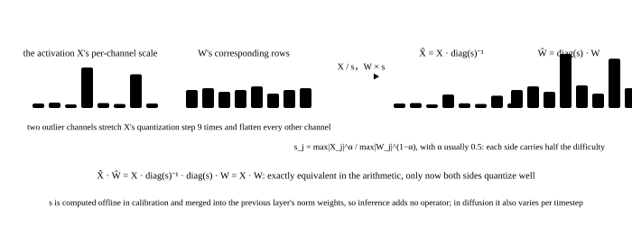

# Quantization: where diffusion differs from an LLM

<p class="lead">Weight quantization is one of the best bargains in LLM inference: decode is bandwidth-bound, so smaller weights are directly faster. A diffusion model is not like that. A step is compute-bound, so shrinking the weights alone barely speeds anything up and what it buys is fitting. Real speed needs the matrix multiplies themselves in low precision: FP8 or INT8 activation quantization, or even W4A4. And activation quantization has traps of its own in a diffusion model: AdaLN modulation amplifies outlier channels, the activation distribution differs greatly between timesteps, and some layers break at a touch. This chapter sets out those differences, uses runnable examples to see what outliers, per-timestep calibration, SmoothQuant and SVDQuant each solve, and ends with a list of which layers can be quantized and which cannot.</p>

!!! question "Self-test: if you can answer these, skip the chapter"
    1. Why does INT4 weight quantization speed an LLM up and possibly slow a diffusion model down?
    2. Where do a diffusion model's activation outliers come from? Why are they harder than an LLM's?
    3. What does per-timestep calibration mean? What happens without it?
    4. What is SVDQuant's low-rank branch doing? Why does it make W4A4 nearly lossless?
    5. Which layers should not be quantized? Why is the VAE treated separately?

??? success "Answers for the self-test (answer first, then open this)"
    1. An LLM's decode computes one token per read of the weights, so halving the weights doubles the speed; a diffusion step computes over thousands to tens of thousands of tokens and the weight reads are not the bottleneck, while INT4 has to dequantize to bf16 before computing, which is an extra step, so it does not speed up and may slow down. Its value is memory: 12B from 24 GB to 6.5 GB.
    2. AdaLN multiplies timestep-dependent scales and shifts onto the activations, amplifying some channels dozens of times; the attention output and the MLP's intermediate activations also have a few channels far larger than the rest. An LLM's outlier channels are fixed (and can be handled statically), while a diffusion model's degree of outlierness varies with the timestep, so one static set of quantization parameters overflows or wastes precision at some timesteps.
    3. Quantizing activations needs a scaling factor, set by the activation range of the calibration data. A diffusion model's activations are distributed differently at different timesteps, so calibration data has to be sampled at several timesteps, or different timesteps (or ranges) given different scaling factors; calibrating at one timestep alone means the others either overflow or waste resolution.
    4. First an SVD separates a low-rank component (rank 16 to 64) out of the weights, computed in 16 bits as a small branch; the remaining residual weights have their outliers absorbed, so they are flatter and much easier to quantize to 4 bits, and the activations are smoothed into the weights as well. The low-rank branch is a few percent of the computation and yet brings 4-bit quantization's error down to roughly 8-bit's, with the matrix multiply on INT4 Tensor Cores, making FLUX 3 times faster on a 4090.
    5. The timestep embedding and AdaLN's modulation MLP (few parameters, with the error amplified onto every token), the first patch embedding and the final output projection, softmax and normalisation (which should be high-precision anyway), and the VAE (itself precision-sensitive, with SDXL's VAE overflowing even in fp16, and running once so there is nothing to gain).

## First the distinction: saving memory or gaining speed {#先分清省显存还是提速}

| Precision | Weight size | How the matrix multiply runs | Speed (a diffusion model) | When to use it |
| --- | --- | --- | --- | --- |
| bf16 / fp16 | 1x | 16-bit Tensor Cores | the baseline | when memory suffices |
| FP8 weights and activations (W8A8) | 0.5x | FP8 Tensor Cores (Hopper, Ada, Blackwell) | 1.2 to 1.6x | the default on a newer card |
| INT8 weights and activations | 0.5x | INT8 Tensor Cores (from Ampere) | 1.2 to 1.5x | older cards; needs the outliers smoothed |
| INT8 / INT4 weights only (NF4, GPTQ, AWQ) | 0.5x / 0.28x | dequantized to 16 bits before computing | 0.6 to 1.0x | only to make it fit |
| W4A4 (SVDQuant) | 0.28x | INT4 Tensor Cores plus a 16-bit low-rank branch | 2 to 3x | running FLUX or Wan on a consumer card |

Remember the dividing line: **quantizing the weights alone is a memory technique, quantizing the activations too is a speed technique**. A diffusion step's arithmetic intensity is in the thousands (see [The inference arithmetic](accounting.md)), so the matrix multiplies' own speed is the bottleneck.

## Outliers: where they come from and why they are trouble {#离群值从哪来为什么麻烦}

Quantizing a tensor is $x \approx s \cdot \text{round}(x / s)$, with the scaling factor $s$ set by the tensor's maximum. A few very large values inflate $s$ and leave most of the rest with only a few levels. Building an activation with outlier channels and watching INT8's error grow with their severity:

```python
import torch

torch.manual_seed(0)

def fake_quant(x, bits, axis=None):
    """对称均匀量化再反量化；axis=None 按整个张量一个缩放因子，否则沿该维各自一个"""
    qmax = 2 ** (bits - 1) - 1
    amax = x.abs().amax() if axis is None else x.abs().amax(dim=axis, keepdim=True)
    s = amax.clamp(min=1e-8) / qmax
    return (x / s).round().clamp(-qmax, qmax) * s

def rel_err(a, b):
    return ((a - b).norm() / b.norm()).item()

N, C = 1024, 512                                   # 1024 tokens and 512 channels
base = torch.randn(N, C)
def err_normal(q, x):                              # look only at the channels that were not amplified: once the outliers inflate the scaling factor, these are what suffer
    return rel_err(q[:, 4:], x[:, 4:])
print(f"{'离群通道的放大倍数':>12} {'INT8 按张量':>10} {'INT8 按通道':>10} {'INT4 按张量':>10} {'INT4 按通道':>10}   （误差在正常通道上量）")
for scale in (1, 10, 50, 200):
    x = base.clone()
    x[:, :4] *= scale                              # the first 4 channels are amplified (such channels appear in AdaLN modulation and the attention output)
    print(f"{scale:>12} {err_normal(fake_quant(x, 8), x):>10.4f} {err_normal(fake_quant(x, 8, axis=0), x):>10.4f} "
          f"{err_normal(fake_quant(x, 4), x):>10.4f} {err_normal(fake_quant(x, 4, axis=0), x):>10.4f}")
```

```text title="output"
   离群通道的放大倍数   INT8 按张量   INT8 按通道   INT4 按张量   INT4 按通道   （误差在正常通道上量）
           1     0.0106     0.0079     0.1920     0.1426
          10     0.0885     0.0079     0.9907     0.1426
          50     0.4420     0.0079     1.0000     0.1426
         200     0.9961     0.0079     1.0000     0.1426
```

With the outlier channels amplified 50 times, per-tensor INT8's error on the ordinary channels grows dozens of times (their levels have been squeezed out by those 4 channels) and INT4 is simply unusable; **per channel** scaling brings the error back down. But note: in the matrix multiply $XW$, the activation $X$'s channels are its columns, and an INT8 matrix multiply requires the scaling factors to come out of the product, which a column-wise factor cannot (it is coupled to $W$'s rows). That is the fundamental reason activation quantization is harder than weight quantization, and the reason SmoothQuant exists.

## SmoothQuant: moving the activations' outliers into the weights {#smoothquant把激活的离群迁移到权重里}

{.aig-svg}

Since the activations' column-wise scaling cannot come out, **multiply it into the weights' rows**: $XW = (X \Lambda^{-1})(\Lambda W)$, where $\Lambda$ is diagonal and each channel's scale is $\max|X_j|^{\alpha} / \max|W_j|^{1-\alpha}$. The activations flatten, the weights steepen a little, and both become easier to quantize:

```python
W = torch.randn(C, C) * 0.02
x = base.clone(); x[:, :4] *= 50
y_ref = x @ W

def smooth(x, W, alpha=0.5):
    lam = (x.abs().amax(0) ** alpha) / (W.abs().amax(1) ** (1 - alpha))
    return x / lam, W * lam[:, None]

print(f"{'方案':<28} {'输出相对误差':>12}")
print(f"{'W8A8 直接量化（按张量）':<28} {rel_err(fake_quant(x, 8) @ fake_quant(W, 8), y_ref):>12.4f}")
xs, Ws = smooth(x, W)
print(f"{'W8A8 + SmoothQuant':<28} {rel_err(fake_quant(xs, 8) @ fake_quant(Ws, 8), y_ref):>12.4f}")
print(f"{'W4A4 直接量化':<28} {rel_err(fake_quant(x, 4) @ fake_quant(W, 4), y_ref):>12.4f}")
xs4, Ws4 = smooth(x, W, alpha=0.5)
print(f"{'W4A4 + SmoothQuant':<28} {rel_err(fake_quant(xs4, 4) @ fake_quant(Ws4, 4), y_ref):>12.4f}")
```

```text title="output"
方案                                 输出相对误差
W8A8 直接量化（按张量）                     0.0970
W8A8 + SmoothQuant                 0.0218
W4A4 直接量化                          0.3254
W4A4 + SmoothQuant                 0.3159
```

W8A8 with smoothing brings the error back to an acceptable level, which is the basis for INT8 and FP8 activation quantization working in a diffusion model at all. But **W4A4's error is still too large even after smoothing**: 4 bits is only 16 levels, and once the outliers have moved into the weights the weights are hard to quantize too.

## SVDQuant: putting the outliers into a low-rank branch {#svdquant把离群值放进一个低秩分支}

SVDQuant's idea: after smoothing, the hard-to-quantize part of the weights is concentrated in a few directions. An SVD splits the weights into a rank-$r$ component $L_1 L_2$ and a residual $R$: $W = L_1 L_2 + R$. The low-rank component computes in 16 bits (a few percent of the computation at $r = 32$) and the residual $R$, with the outliers taken away, is flat and quantizes to 4 bits with far less error:

```python
def svdquant(x, W, rank, bits=4):
    xs, Ws = smooth(x, W, alpha=0.5)
    U, S, Vh = torch.linalg.svd(Ws, full_matrices=False)
    L1, L2 = U[:, :rank] * S[:rank], Vh[:rank]            # the low-rank branch, 16-bit
    R = Ws - L1 @ L2                                      # the residual, 4-bit
    return fake_quant(xs, bits) @ fake_quant(R, bits) + xs @ L1 @ L2

print(f"{'方案':<28} {'输出相对误差':>12}  低秩分支的额外计算")
for rank in (0, 16, 32, 64):
    err = rel_err(svdquant(x, W, rank) if rank else fake_quant(xs4, 4) @ fake_quant(Ws4, 4), y_ref)
    print(f"{'W4A4 + 低秩 r=' + str(rank):<28} {err:>12.4f}  {2 * rank / C:>6.1%}")
floor = rel_err(fake_quant(base, 4) @ fake_quant(W, 4), base @ W)
print(f"{'对照：没有离群值时的 W4A4':<28} {floor:>12.4f}  （4 位本身的分辨率下限）")
print(f"{'对照：W8A8 + SmoothQuant':<28} {rel_err(fake_quant(xs, 8) @ fake_quant(Ws, 8), y_ref):>12.4f}")
```

```text title="output"
方案                                 输出相对误差  低秩分支的额外计算
W4A4 + 低秩 r=0                      0.3159    0.0%
W4A4 + 低秩 r=16                     0.1935    6.2%
W4A4 + 低秩 r=32                     0.1829   12.5%
W4A4 + 低秩 r=64                     0.1622   25.0%
对照：没有离群值时的 W4A4                    0.2693  （4 位本身的分辨率下限）
对照：W8A8 + SmoothQuant              0.0218
```

A rank-32 low-rank branch adds only 12% more computation (a smaller share in a real model, where $d = 3072$) and brings the error below what a tensor with no outliers at all gets from plain 4-bit quantization: with the outliers' damage removed, the low-rank branch also carries the weights' highest-energy directions in 16 bits. What remains is 4 bits' own resolution limit, which a real implementation pushes down further with group quantization (one scaling factor per 64 elements), and dozens of denoising steps average the per-step error out, so the image quality approaches W8A8's. With a dedicated kernel (Nunchaku fuses the low-rank branch with the 4-bit matrix multiply and shares the activation reads), FLUX runs 3 times faster on a 4090 in 6.5 GB, which is one of the best options for running a large DiT on a consumer card today.

## The timestep: the variable peculiar to diffusion {#时间步扩散模型独有的变量}

An LLM's activation distribution is static: calibrate once and it holds everywhere. A diffusion model's activations pass through AdaLN modulation, so **the distribution differs at every timestep**. Here is the modulation's effect on the quantization parameters:

```python
def adaln(x, t):
    """模拟 AdaLN：缩放随时间步变化——高噪声端（t 小）把一部分通道放大几倍，到数据端逐渐回落"""
    gamma = torch.ones(C)
    gamma[:8] = 1 + 5.0 * torch.exp(-4.0 * t)       # the first 8 channels are amplified 6 times at t=0 and barely at all at t=1
    return x * gamma

print(f"{'时间步 t':>7} {'激活最大值':>9} {'用 t=0.5 的缩放因子量化(INT8)':>26} {'按本步校准':>9}")
s_mid = adaln(base, torch.tensor(0.5)).abs().amax() / 127                      # the scaling factor from calibrating at t=0.5 alone
for t in (0.0, 0.25, 0.5, 0.75, 1.0):
    xt = adaln(base, torch.tensor(t))
    q_static = (xt / s_mid).round().clamp(-127, 127) * s_mid                   # a static scaling factor: it may overflow or waste levels
    print(f"{t:>7.2f} {xt.abs().amax():>9.2f} {rel_err(q_static, xt):>26.4f} {rel_err(fake_quant(xt, 8), xt):>9.4f}")
```

```text title="output"
  时间步 t     激活最大值      用 t=0.5 的缩放因子量化(INT8)     按本步校准
   0.00     23.35                     0.2147    0.0426
   0.25     11.05                     0.0257    0.0238
   0.50      6.53                     0.0146    0.0146
   0.75      4.86                     0.0148    0.0110
   1.00      4.66                     0.0148    0.0106
```

One static set of scaling factors overflows at the timesteps with large magnitudes (the error explodes) and wastes levels at those with small ones. What is done in practice: **the calibration data has to cover every timestep** (sampling activations at each), with separate scaling factors per range of timesteps (as in Q-Diffusion and TDQ), or simply dynamic quantization (computing the scaling factor from the current activations each step, one extra reduction but the most robust). FP8's exponent bits make it far more tolerant of this variation in magnitude, which is why FP8 is less trouble than INT8 for a diffusion model.

## Which layers to leave alone {#哪些层不碰}

| Layer | Quantize | Why |
| --- | --- | --- |
| The large matrix multiplies of attention and the MLP | yes | over 95% of the computation and the entire source of the gain |
| The timestep embedding and AdaLN's modulation MLP | no | very few parameters, with the output multiplied onto every token so the error is amplified |
| The patch embedding (first layer) and the output projection (last) | no, or INT8 at most | they touch the latents directly and the error goes straight to the output |
| softmax, normalisation, RoPE | no | high precision is wanted anyway and the FLOPs are few |
| The text encoder (T5) | FP8 or INT8 is fine | it runs once, quantized to save memory, with little effect on the output |
| The VAE | no | precision-sensitive (SDXL's VAE overflows even in fp16) and it runs once, so there is nothing to gain |

The evaluation differs from an LLM's too: an LLM is judged by perplexity and downstream tasks, while a diffusion model has no correct answer. The usual approach is to fix the seed and compare images before and after quantization (PSNR, SSIM, LPIPS), then look at the CLIP score and human evaluation; and **test at several guidance scales and step counts**, since the quantization error is more visible with strong guidance and few steps.

!!! interview "How to answer in an interview"
    Asked how a diffusion model is quantized, give the dividing line first: a diffusion step is compute-bound, so quantizing the weights alone saves memory without gaining speed, and speed needs the activations quantized so that the matrix multiplies run on FP8, INT8 or INT4 Tensor Cores. Then the two difficulties peculiar to diffusion: the outlier channels AdaLN modulation creates (SmoothQuant moves the activations' scaling into the weights), and the activation distribution varying with the timestep (calibration has to cover every timestep, with separate scaling factors per range, or FP8, which tolerates the variation). Then the frontier: SVDQuant absorbs the outliers into a 16-bit low-rank branch and quantizes the residual to W4A4, making FLUX 3 times faster on a 4090. Finish with the layers to leave alone: the modulation MLP, the first and last layers, the normalisations and the VAE.

## Exercises {#练习}

1. Sweep `smooth`'s `alpha` from 0.5 to 0.3 and 0.8. How does W8A8's error change? What does $\alpha$ mean?

??? success "Answer"
    $\alpha$ decides how the outliers are divided between the activations and the weights: 0 leaves them all in the activations and 1 moves them all into the weights. Both extremes are bad and the middle (around 0.5) is best; a layer whose activations are particularly outlier-heavy wants a larger $\alpha$. A real implementation searches for an $\alpha$ per layer.

2. Quantize `svdquant`'s low-rank branch to INT8 as well. How much does the error grow? What does that say about why the low-rank branch is 16 bits?

??? success "Answer"
    The error grows slightly but stays far below having no low-rank branch at all. The low-rank branch concentrates the weights' highest-energy directions, so its error affects the main output directly; but it is only a few percent of the computation, so 16 bits costs negligibly. There is no point saving that little compute.

3. A service quantized FLUX to FP8, and users report colour blocks at guidance scales above 6, which the bf16 version does not have. What could be the cause? How would you verify and mitigate it?

??? success "Answer"
    Strong guidance amplifies the difference between the two predictions by $w$, and the quantization error with it, overflowing FP8's range at some timesteps. To verify: with a fixed seed, compare the quantized and bf16 versions' PSNR at various $w$ and see whether the error rises sharply with it, and check which layers' activations leave the range at high $w$. To mitigate: keep those layers in bf16, use per-block scaled FP8, or switch to the high-precision path at high $w$.

## Summary {#小结}

- [x] A diffusion step is compute-bound: quantizing the weights alone is a memory technique (FP8 halves, NF4 reaches 0.28), and speed requires the activations quantized so that the matrix multiplies use low-precision Tensor Cores.
- [x] Outlier channels (from AdaLN modulation and the attention output) break per-tensor quantization; SmoothQuant moves the activations' scaling into the weights to make W8A8 workable; W4A4 needs SVDQuant's 16-bit low-rank branch to absorb the outliers.
- [x] The activation distribution varies with the timestep: calibration has to cover every timestep, with scaling per range or dynamic quantization; FP8 tolerates the variation better.
- [x] The layers to leave alone: the modulation MLP, the first and last layers, the normalisations and the VAE; evaluation compares images at a fixed seed, across several guidance scales and step counts.
