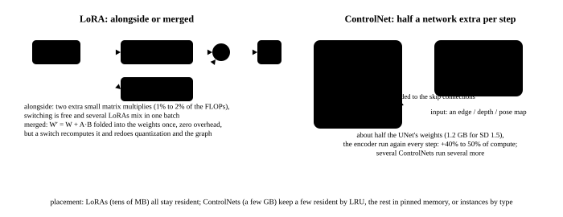

# Serving several LoRAs, ControlNet and IP-Adapter

<p class="lead">A text-to-image service in production rarely runs a bare model alone: users pick a style (a LoRA), upload a line drawing (ControlNet), or give a reference image (IP-Adapter). Their effects on inference are entirely different — a LoRA is a low-rank increment of tens of MB that can be merged into the weights or computed alongside them; a ControlNet is half a denoising network that has to be run again at every step; an IP-Adapter is only a few dozen extra tokens. This chapter works out all three plugins' compute and memory costs, compares the switching cost of serving LoRAs merged against unmerged, and gives placement strategies for serving several plugins.</p>

!!! question "Self-test: if you can answer these, skip the chapter"
    1. Which layers of a diffusion model does a LoRA attach to? What does merging into the weights cost, and what does computing alongside them cost?
    2. How are requests in one batch that use different LoRAs computed together?
    3. Why does ControlNet have to run an extra network at every step? Where is it more expensive than T2I-Adapter?
    4. Where is IP-Adapter's cost? How does it differ from concatenating the reference image into the sequence?
    5. How are dozens of LoRAs and a few ControlNets placed in a service?

??? success "Answers for the self-test (answer first, then open this)"
    1. Usually to attention's Q, K, V and O projections, sometimes to the MLP too; in SD's UNet sometimes to the convolutions as well. Merged: $BA$ is added into $W$, inference costs nothing extra, but switching LoRA means subtracting the old one and adding the new — in theory just reading and writing the affected weights once (a few milliseconds), in practice often hundreds of milliseconds (per-layer Python operations, quantized weights to be requantized, a compiled graph possibly invalidated). Unmerged: each layer computes an extra $x A^\top B^\top$, the overhead growing linearly with the rank (a rank of 64 adds about 4% to the affected layers' computation), switching is instant, and one batch can mix them.
    2. Unmerged: each request carries its own LoRA index and the low-rank matrix multiplies are grouped by request (the same machinery as SGMV / punica in LLM serving, see [Serving multiple LoRAs](serving://ops/multi-lora/)). Merged cannot do it and has to serialise.
    3. A ControlNet is a copy of the denoising network's encoder that takes the control image and outputs a residual for each layer added into the trunk; its input includes the current noisy latents, so it has to be recomputed every step. T2I-Adapter looks only at the control image and not at the latents, so it is computed once for the whole generation.
    4. The reference image is encoded by CLIP or SigLIP into a few dozen tokens and injected through an extra set of cross-attentions; the cost is one small cross-attention per layer (over a few dozen tokens), nearly negligible. Concatenating the reference image's VAE latents into the sequence (what Kontext and OmniGen do) pays attention's quadratic term and is far more expensive.
    5. LoRAs are tens of MB, so all of them stay resident in memory, computed unmerged and grouped by request; ControlNets are a few GB, so the hot ones stay resident and the cold ones sit in pinned memory to be moved on demand (hundreds of milliseconds), or instances are split by type; an IP-Adapter's encoder stays resident.

## LoRA: merged or alongside {#lora融合还是旁路}

{.aig-svg}

A LoRA adds a low-rank increment to the weights, $W' = W + BA$ ($A$ is $r \times d$, $B$ is $d \times r$, and $r$ is usually 8 to 128). There are two algorithms at inference:

- **Merged**: compute $W + BA$ ahead of time, after which it is as if there were no LoRA.
- **Unmerged**: each layer computes one extra $x A^\top B^\top$ and adds it to $xW^\top$.

The unmerged overhead and the merged switching cost first:

```python
def lora_costs(d_model, layers, adapted_per_layer, rank, n_tokens, hbm_gbps=3350, dtype=2):
    """旁路：每个被加 LoRA 的线性层多 2×N×(d×r + r×d) FLOP；融合 / 解融合：读写一遍受影响的权重"""
    base_flops = 2 * n_tokens * d_model * d_model * adapted_per_layer * layers           # count only the linear layers the LoRA covers
    lora_flops = 2 * n_tokens * (d_model * rank + rank * d_model) * adapted_per_layer * layers
    weight_bytes = d_model * d_model * dtype * adapted_per_layer * layers
    merge_ms = 2 * weight_bytes / (hbm_gbps * 1e9) * 1e3                              # read plus write
    lora_mb = (d_model * rank * 2) * dtype * adapted_per_layer * layers / 2 ** 20
    return lora_flops / base_flops, merge_ms, lora_mb

print("FLUX：57 层，每层 4 个注意力投影加 LoRA，1024² 共 4608 个 token")
print(f"{'秩 r':>5} {'旁路的额外计算（相对受影响的层）':>22} {'LoRA 大小':>9} {'融合或解融合一次':>12}")
for rank in (8, 16, 64, 128):
    extra, merge_ms, mb = lora_costs(3072, 57, 4, rank, 4608)
    print(f"{rank:>5} {extra:>22.1%} {mb:>7.0f} MB {merge_ms:>10.0f} ms")
```

```text title="output"
FLUX：57 层，每层 4 个注意力投影加 LoRA，1024² 共 4608 个 token
  秩 r       旁路的额外计算（相对受影响的层）   LoRA 大小     融合或解融合一次
    8                   0.5%      21 MB          3 ms
   16                   1.0%      43 MB          3 ms
   64                   4.2%     171 MB          3 ms
  128                   8.3%     342 MB          3 ms
```

Neither cost is large, but they are different in kind:

| | Merged | Unmerged |
| --- | --- | --- |
| Per-step overhead | 0 | 4% on the affected layers at a rank of 64, 1% to 3% overall |
| Switching LoRA | unmerge the old and merge the new: a few milliseconds in theory, often hundreds in practice (per-layer operations, requantization, recompilation) | swap a pointer |
| Mixing LoRAs in one batch | no (there is only one copy of the weights) | yes: the low-rank matrix multiplies are grouped by request |
| Stacking several LoRAs | a weighted sum merged once | a few more alongside computations |
| Compatibility with quantization and compilation | merging breaks quantized weights (they have to be requantized); the compiled graph is unchanged | the quantized weights are untouched; the alongside computation has to enter the compiled graph |

**Serving almost always uses unmerged**: switching is instant, batches can be mixed, and it is compatible with FP8 weights. Merging is used only in the offline case of "one instance fixed to one style". The implementation of mixing LoRAs in a batch is exactly as in LLM serving — a segmented matrix multiply grouped by request (SGMV), see [Serving multiple LoRAs](serving://ops/multi-lora/), which has a runnable implementation.

A detail particular to diffusion: **a LoRA's weight can vary with the timestep**. Some methods (variants of LCM-LoRA, step-wise style LoRAs) use a different scale at different noise levels, which the unmerged form supports naturally (swap a scalar each step) and the merged form cannot.

## ControlNet: half a network extra at every step {#controlnet每步多跑半个网络}

ControlNet copies the denoising network's encoder (the UNet's downsampling path, or a DiT's first few layers), takes the control image (a line drawing, a depth map, a pose) and **the current noisy latents**, and outputs a residual per layer added back into the trunk. Because the current latents are part of its input, **it has to be recomputed at every step**:

```python
def controlnet_cost(main_params_b, control_params_b, n_control, steps, cfg):
    """每步多算一个 ControlNet；T2I-Adapter 只算一次"""
    per_step = main_params_b + n_control * control_params_b
    return per_step / main_params_b

for name, main, ctrl in [("SD 1.5", 0.86, 0.36), ("SDXL", 2.6, 1.25), ("FLUX（Union ControlNet）", 11.9, 3.3)]:
    for n in (1, 2, 3):
        print(f"{name:<22} {n} 个 ControlNet：每步计算 {controlnet_cost(main, ctrl, n, 30, 2):>4.2f}×，显存多 {n * ctrl * 2:>4.1f} GB（bf16）")
```

```text title="output"
SD 1.5                 1 个 ControlNet：每步计算 1.42×，显存多  0.7 GB（bf16）
SD 1.5                 2 个 ControlNet：每步计算 1.84×，显存多  1.4 GB（bf16）
SD 1.5                 3 个 ControlNet：每步计算 2.26×，显存多  2.2 GB（bf16）
SDXL                   1 个 ControlNet：每步计算 1.48×，显存多  2.5 GB（bf16）
SDXL                   2 个 ControlNet：每步计算 1.96×，显存多  5.0 GB（bf16）
SDXL                   3 个 ControlNet：每步计算 2.44×，显存多  7.5 GB（bf16）
FLUX（Union ControlNet） 1 个 ControlNet：每步计算 1.28×，显存多  6.6 GB（bf16）
FLUX（Union ControlNet） 2 个 ControlNet：每步计算 1.55×，显存多 13.2 GB（bf16）
FLUX（Union ControlNet） 3 个 ControlNet：每步计算 1.83×，显存多 19.8 GB（bf16）
```

One ControlNet on SDXL makes each step half again as expensive and three of them double it — and all of that has to be done on both of guidance's paths. Several ways to bring the cost down:

| Approach | Where it saves | Cost |
| --- | --- | --- |
| T2I-Adapter | does not look at the latents, computed once for the whole process | weaker control than ControlNet |
| ControlNet active for the first k steps only | the composition settles in the first few steps and needs no control afterwards | weaker control of the detail |
| Several controls merged into one Union model | one forward pass handles several kinds of control | needs dedicated training |
| ControlNet folded into the trunk (ControlNet-XS, LoRA-style control) | an order of magnitude fewer parameters | slightly worse results |
| Skipping steps together with feature caching | the ControlNet's output is cached too | the same error as the cache's |

"Active for the first 60% of the steps only" is the most used of these in a service: it costs almost no quality and saves forty percent of the ControlNet's computation.

## IP-Adapter: a cheap reference image {#ip-adapter便宜的参考图}

IP-Adapter turns the reference image into a few dozen tokens with a CLIP or SigLIP image encoder and injects them through **an extra set of cross-attentions** (parallel to the text's cross-attention). The cost: the image encoder runs once (tens of milliseconds) and each layer gains one cross-attention over a few dozen tokens — nearly negligible.

Against the approach of concatenating the reference image into the sequence (FLUX Kontext, OmniGen, Wan's reference-image mode): the reference image's VAE latents become tokens in a joint attention with the noise latents, the sequence length doubles and the attention cost quadruples:

```python
def ref_image_cost(n_img, n_ref_tokens, d, layers, mode):
    attn_base = layers * 4 * n_img ** 2 * d
    if mode == "IP-Adapter（交叉注意力）":
        extra = layers * 2 * 2 * n_img * n_ref_tokens * d                   # one small cross-attention per layer
    else:                                                                  # concatenated into the sequence: a joint attention
        n = n_img + n_ref_tokens
        extra = layers * 4 * n ** 2 * d - attn_base
    return extra / attn_base

for mode, n_ref in [("IP-Adapter（交叉注意力）", 64), ("参考图拼进序列（联合注意力）", 4096)]:
    print(f"{mode:<22} 注意力部分多 {ref_image_cost(4608, n_ref, 3072, 57, mode):>5.0%}")
```

```text title="output"
IP-Adapter（交叉注意力）      注意力部分多    1%
参考图拼进序列（联合注意力）         注意力部分多  257%
```

The cheap approach has weaker control (it can convey only roughly what the style or the subject looks like) while the expensive one can do precise editing. A product often offers both — and to the scheduler they are requests of two different shapes (see [Scheduling a generation service](scheduling.md)).

## Placement: the hot resident, the cold moved {#放置热的常驻冷的搬}

Put all three kinds of plugin where their size and their usage frequency suggest:

```python
GB = 1024 ** 3
inventory = [
    # name, the size of one in GB, the count, the probability a request uses it
    ("LoRA（秩 64）",     0.10,  200, 0.6),
    ("IP-Adapter 编码器",  0.8,    1, 0.3),
    ("ControlNet（SDXL）", 2.5,    6, 0.25),
]
budget = 80 - 24 - 9.5 - 6                                                 # an 80 GB card: FLUX plus T5 plus the activation and VAE peak
print(f"插件的显存预算约 {budget:.0f} GB")
total_all = sum(size * n for _, size, n, _ in inventory)
print(f"全部常驻要 {total_all:.0f} GB：{'放得下' if total_all <= budget else '放不下'}")
pcie = 25.0                                                                # GB/s
for name, size, n, p in inventory:
    plan = "全部常驻" if size < 1.0 and size * n <= 0.5 * budget else "按 LRU 常驻几个，其余放锁页内存按需搬"
    print(f"  {name:<18} {n:>3} 个 × {size:>4.1f} GB = {size * n:>5.1f} GB → {plan}（按需搬一次 {size / pcie * 1e3:>4.0f} ms）")
```

```text title="output"
插件的显存预算约 40 GB
全部常驻要 36 GB：放得下
  LoRA（秩 64）         200 个 ×  0.1 GB =  20.0 GB → 全部常驻（按需搬一次    4 ms）
  IP-Adapter 编码器       1 个 ×  0.8 GB =   0.8 GB → 全部常驻（按需搬一次   32 ms）
  ControlNet（SDXL）     6 个 ×  2.5 GB =  15.0 GB → 按 LRU 常驻几个，其余放锁页内存按需搬（按需搬一次  100 ms）
```

The rules are plain: **every LoRA stays resident** (200 of them is only 20 GB, less at a small rank), computed alongside and grouped by request; **a few ControlNets stay resident by LRU** with the rest in pinned memory, where moving one on demand is 100 milliseconds — far shorter than a generation's several seconds; or simply **split instances by ControlNet type**, with the routing layer dispatching on the control type in the request so each instance keeps only its own resident.

Against LLM serving's multi-LoRA, diffusion has two extra variables: a plugin is either computed at every step (ControlNet) or once (T2I-Adapter, an IP-Adapter's encoder), which affects the per-step cost and not only the memory; and a LoRA's effect can vary with the timestep. A scheduler estimating a request's duration has to account for both (see the expected-duration function in [Scheduling a generation service](scheduling.md)).

!!! interview "How to explain it"
    To explain how a text-to-image service supports dozens of LoRAs and ControlNet, separate the three kinds of plugin by the nature of their cost first: a LoRA is a low-rank increment of tens of MB, costing a few percent per step computed alongside, switching instantly and mixable within one batch (the same machinery as an LLM's SGMV), while merging costs nothing per step but has to traverse the weights to switch and cannot mix a batch — so a service computes alongside. A ControlNet is half a denoising network recomputed every step, one on SDXL making each step half again as expensive, with "active for the first 60% of the steps" and Union models the usual savings. An IP-Adapter is a cross-attention over a few dozen tokens and nearly free, while concatenating the reference image into the sequence pays attention's quadratic term. On placement, every LoRA resident, ControlNets resident by LRU plus pinned memory moved on demand, or instances split by type.

## Exercises {#练习}

1. Use `lora_costs` for SDXL (about 70 attention layers in the UNet with $d$ from 1280 to 2048, estimated at 1600) at a rank of 128, for both the alongside overhead and the merging cost. Compared with FLUX, why is merging rather more worthwhile on SDXL?

??? success "Answer"
    SDXL's affected weights are smaller (a few hundred MB), so merging once is tens of milliseconds, while at a rank of 128 the alongside computation is a higher fraction for layers with a small $d$ ($2r/d$, and a small $d$ means a large ratio). So merging is the better deal for a small model like SDXL fixed to one style; FLUX's $d = 3072$ makes the alongside overhead relatively small and the merging cost absolutely large, so computing alongside wins.

2. Four requests in one batch use four different LoRAs. How is the computation organised in the unmerged form? What if two of the requests use the same LoRA?

??? success "Answer"
    Group the batch's activations by LoRA index, have each group compute its own $x A^\top B^\top$ (a segmented matrix multiply, one kernel handling every group), and add the results back into the trunk's output in the original order; two requests on the same LoRA naturally fall in one group, making the matrix multiply larger and more efficient. This is exactly what punica and SGMV do.

3. With ControlNet active for the first 60% of the steps only, what does that do to feature caching's (TeaCache's) skip decisions?

??? success "Answer"
    At the step where the ControlNet switches on and the one where it switches off, the trunk's input residual jumps, the probe distance grows suddenly and the cache (correctly) forces a real step. After that the ControlNet no longer participates, neighbouring steps are more alike and the cache can skip more. In the implementation the ControlNet's output has to be part of the cached residual, or a skipped step loses the control signal.

## Summary {#小结}

- [x] LoRA: computed alongside, it costs a few percent per step, switches instantly, mixes in a batch and is compatible with FP8 weights, which is what a service almost always uses; merged costs nothing per step but has to traverse the weights to switch, suiting only the offline case of a fixed style.
- [x] ControlNet recomputes half a network at every step (one on SDXL makes each step half again as expensive) while T2I-Adapter is computed once; "active for the first 60% of the steps" and Union models are the usual savings.
- [x] IP-Adapter's cross-attention over a few dozen tokens is nearly free; concatenating the reference image into the sequence pays attention's quadratic term, and the two are requests of different shapes.
- [x] Placement: every LoRA resident and computed alongside grouped by request; ControlNets resident by LRU plus pinned memory moved on demand (a hundred milliseconds), or instances split by type; the expected duration has to account for the plugins computed at every step.
