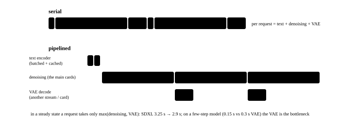

# Scheduling a generation service: heterogeneous requests, stage pipelining and long tasks

<p class="lead">With one generation optimised, the next step is turning it into a service: dozens of users arrive at once with different resolutions, step counts, models and attachments, some wanting a 512² draft and some a 60-second video. An LLM service's "amortise the weights over a big batch" does not hold here — one step is compute-bound and a batch saves nothing. What can be saved is the staggering of the three stages (the text encoding, the denoising, the VAE decode), the merging of identically shaped requests, and queueing by expected duration rather than by request count. This chapter computes several scheduling policies' latency distributions with a discrete-event simulation, then covers cancellation, previews and long tasks, the problems particular to diffusion serving.</p>

!!! question "Self-test: if you can answer these, skip the chapter"
    1. Why does a diffusion service not chase a large batch the way an LLM service does? When is a batch still useful?
    2. What kind of batching and placement suits each of a request's three stages?
    3. What goes wrong with FCFS queueing by request count? What is a better ordering?
    4. Why is cancelling and preempting a diffusion request cheaper than an LLM's?
    5. On an 8-card node, is it one request per card or all 8 cards on one request? How do you weigh that?

??? success "Answers for the self-test (answer first, then open this)"
    1. One step is already compute-bound at a batch of 1, so stacking a batch only makes each step linearly slower: the throughput barely rises and the latency degrades linearly. The exceptions: a small model at a low resolution whose kernels do not fill the GPU (where a batch raises the utilization), and naturally identically shaped requests such as "four candidate images from one prompt".
    2. The text encoder: short input, little computation, large memory — suited to batching, to being placed on the CPU or a separate card, and to being cached by prompt. The denoising: compute-bound, grouped by shape, usually with a very small batch. The VAE decode: heavy on traffic with a high memory peak — suited to its own stream or card, overlapped with the next request's denoising, and tiled.
    3. One long video takes hundreds of times as long as one image, so FCFS leaves the short requests behind it waiting a long time and the P99 latency explodes. Queue by expected duration (tokens x steps x a model factor), prioritise or pool the short tasks, and cap the long tasks' concurrency.
    4. There is no state across denoising steps (apart from the scheduler object), so cancelling means not issuing the next step, with nothing to save or recompute; preempting an LLM means either saving the KV cache or dropping it and recomputing the prefill.
    5. One request per card: the highest throughput (no communication overhead) and the worst single-request latency. Eight cards on one request: the lowest latency, with throughput lost to communication and imbalance. Decide by the SLO: interactive video generation wants latency (several cards per request), bulk offline work wants throughput (one per card). The common practice is pooling — some cards form sequence-parallel groups serving interactive requests while the others run an offline queue one card at a time.

## What a request looks like {#请求长什么样}

A diffusion service's requests are **heterogeneous**, and the dimensions of that heterogeneity decide directly whether two can go together and how long they take:

| Dimension | Values | Effect on scheduling |
| --- | --- | --- |
| Model | SDXL / FLUX / Wan…, plus LoRA and ControlNet | different models are not even in the same process |
| Resolution, frame count | 512² to 2048², 5 to 60 seconds | decides the token count; different shapes cannot share a batch |
| Steps, guidance, sampler | 4 to 50 steps | decides the number of forward passes |
| Attachments | a reference image, a control image, a first frame | changes the sequence length or adds a network |
| Output count | 1 to 4 images | a naturally identically shaped batch |

Write "the expected duration" as a computable function first — it is the input to every scheduling policy below:

```python
def est_seconds(tokens, steps, cfg, model_tflop_per_1k_tokens, gpu_eff_tflops=450):
    """预计耗时 ≈ 前向次数 × 单步 FLOP / 有效算力；单步 FLOP 按 token 数线性估（注意力的平方项在图像尺寸下占比小）"""
    step_tflop = tokens / 1000 * model_tflop_per_1k_tokens
    return steps * cfg * step_tflop / gpu_eff_tflops

REQS = [("SDXL 512² · 20 步", 1024, 20, 2, 2.0), ("SDXL 1024² · 30 步", 4096, 30, 2, 2.9),
        ("FLUX 1024² · 28 步", 4608, 28, 1, 19.5), ("FLUX 2048² · 28 步", 16896, 28, 1, 24.7),
        ("Wan 5 秒 480p · 50 步", 33272, 50, 2, 90.0), ("Wan 5 秒 720p · 50 步", 76112, 50, 2, 175.0)]
print(f"{'请求':<22} {'token':>7} {'前向次数':>7} {'预计耗时(H100)':>13}")
for name, tok, steps, cfg, k in REQS:
    print(f"{name:<22} {tok:>7,} {steps * cfg:>7} {est_seconds(tok, steps, cfg, k):>11.1f} s")
```

```text title="output"
请求                       token    前向次数    预计耗时(H100)
SDXL 512² · 20 步         1,024      40         0.2 s
SDXL 1024² · 30 步        4,096      60         1.6 s
FLUX 1024² · 28 步        4,608      28         5.6 s
FLUX 2048² · 28 步       16,896      28        26.0 s
Wan 5 秒 480p · 50 步     33,272     100       665.4 s
Wan 5 秒 720p · 50 步     76,112     100      2959.9 s
```

From 0.2 seconds to 20 minutes, four orders of magnitude. **With those requests mixed in one queue, the queueing policy is everything.**

## Queueing: by what {#排队按什么排}

A minimal discrete-event simulation compares three policies. Requests arrive as a Poisson process, 80% images (short) and 20% video (long); one card runs one request at a time (it is compute-bound, so a batch is pointless):

```python
import heapq
import random

def simulate(policy, n_gpus=4, arrivals=400, rate=0.06, seed=0):
    """policy: 'fcfs' 先到先服务；'sjf' 预计耗时短的优先；'pools' 图像用 1 张卡、视频用 3 张卡（按各自的负载分）。
    到达率 0.06 个/秒、两成是视频，4 张卡的总利用率约 70%。返回图像请求和视频请求各自的 P50 / P99 排队延迟（秒）"""
    rng = random.Random(seed)
    t, reqs = 0.0, []
    for i in range(arrivals):
        t += rng.expovariate(rate)
        if rng.random() < 0.8:
            reqs.append((t, "图像", rng.choice([2.0, 3.0, 6.0])))         # the expected duration
        else:
            reqs.append((t, "视频", rng.choice([120.0, 300.0])))
    waits = {"图像": [], "视频": []}
    if policy == "pools":
        groups = [("图像", [r for r in reqs if r[1] == "图像"], 1), ("视频", [r for r in reqs if r[1] == "视频"], n_gpus - 1)]
    else:
        groups = [("全部", reqs, n_gpus)]
    for _, rs, gpus_per in groups:
        free = [0.0] * gpus_per                                         # when each card frees up
        pending = []
        i, now = 0, 0.0
        while i < len(rs) or pending:
            # move the requests that have arrived into the pending set
            while i < len(rs) and rs[i][0] <= now:
                heapq.heappush(pending, ((rs[i][2] if policy == "sjf" else rs[i][0]), rs[i])); i += 1
            g = min(range(gpus_per), key=lambda k: free[k])
            if pending and free[g] <= now:
                _, (arr, kind, dur) = heapq.heappop(pending)
                waits[kind].append(now - arr)
                free[g] = now + dur
            else:                                                       # advance the time to the next event
                nxt = [free[g]] if pending else []
                if i < len(rs): nxt.append(rs[i][0])
                now = max(now, min(nxt)) if nxt else now
    def pct(xs, q):
        xs = sorted(xs); return xs[min(len(xs) - 1, int(q * len(xs)))] if xs else 0.0
    return {k: (pct(v, 0.5), pct(v, 0.99)) for k, v in waits.items()}

print(f"{'策略':<8} {'图像 P50':>8} {'图像 P99':>8} {'视频 P50':>8} {'视频 P99':>8}")
for policy in ("fcfs", "sjf", "pools"):
    r = simulate(policy)
    print(f"{policy:<8} {r['图像'][0]:>7.0f}s {r['图像'][1]:>7.0f}s {r['视频'][0]:>7.0f}s {r['视频'][1]:>7.0f}s")
```

```text title="output"
策略         图像 P50   图像 P99   视频 P50   视频 P99
fcfs          17s     473s      19s     423s
sjf            2s      90s      23s     614s
pools          0s       7s     152s     745s
```

At only 70% overall utilization, the images' P99 queueing time under FCFS is still minutes — a 3-second image queued behind a 5-minute video. Shortest-job-first brings the images' latency down to seconds at the cost of the video starving under a high load; **pooling** is the steadiest: the queues do not affect each other, at the cost of resources that cannot be lent (the image pool may sit idle while the video pool is busy). A real system is usually pooling plus ordering within a pool by expected duration plus a cap on the long tasks' concurrency, plus a rule that overload rejects the long tasks first.

## Three stages, three placements {#三个阶段三种放法}

One request = the text encoding (once) + the denoising (N times) + the VAE decode (once). Their resource profiles are entirely different, so they should not run serially on one pipeline:

| Stage | Profile | Batching | Placement |
| --- | --- | --- | --- |
| Text encoding | little computation, large memory (T5 is 9.5 GB), input independent of the noise | batching pays; cache by a hash of the prompt | a separate card, the CPU, or sharing a card with the denoising but loading the weights on demand |
| Denoising | compute-bound, a fixed shape, N times | only identical shapes; worth it only for a small model at a low resolution | the main cards; sequence-parallel groups when there are several |
| VAE decode | traffic-heavy, a high memory peak, once | tiled; not batched | its own stream or card, overlapped with the next request's denoising |

{.aig-svg}

How much does moving the VAE decode to another stream (or card) and overlapping it with the next request's denoising save? A simulation:

```python
def pipeline_throughput(denoise, vae, text, overlap_vae):
    """连续 N 个请求的平均每请求耗时：串行 vs VAE 解码与下一个请求的去噪重叠"""
    if not overlap_vae:
        return text + denoise + vae
    return text + max(denoise, vae)                                    # in a steady state the VAE hides behind the next denoising

for name, dn, va, tx in [("SDXL 1024²", 2.9, 0.3, 0.05), ("FLUX 1024²", 4.7, 0.3, 0.1), ("SDXL-Turbo 4 步", 0.15, 0.3, 0.05), ("Wan 5 秒 720p (8 卡)", 150.0, 25.0, 0.8)]:
    a, b = pipeline_throughput(dn, va, tx, False), pipeline_throughput(dn, va, tx, True)
    print(f"{name:<22} 串行 {a:>6.2f} s/请求  VAE 重叠后 {b:>6.2f} s/请求  吞吐 +{a / b - 1:>4.0%}")
```

```text title="output"
SDXL 1024²             串行   3.25 s/请求  VAE 重叠后   2.95 s/请求  吞吐 + 10%
FLUX 1024²             串行   5.10 s/请求  VAE 重叠后   4.80 s/请求  吞吐 +  6%
SDXL-Turbo 4 步         串行   0.50 s/请求  VAE 重叠后   0.35 s/请求  吞吐 + 43%
Wan 5 秒 720p (8 卡)     串行 175.80 s/请求  VAE 重叠后 150.80 s/请求  吞吐 + 17%
```

A few percent on a large model, **double on a few-step model** — SDXL-Turbo's 4-step denoising takes only 0.15 seconds and the VAE decode becomes the bulk instead, so not overlapping means the GPU spends half its time decoding. Serving a few-step model, the bottleneck has moved from the denoising to the odds and ends (see [Few-step generation](../perf/distillation.md)).

## Cancellation, previews and long tasks {#取消预览与长任务}

Diffusion's denoising has **no state across steps** (the scheduler object is private to the request), which allows several things an LLM service cannot do:

- **Cancellation is nearly free**: when the user closes the page, simply do not issue the next step, with nothing to save; preempting an LLM means either saving the KV cache or recomputing the prefill.
- **Previews**: every few steps, decode a low-resolution image with a small decoder like TAESD and push it to the front end (see [The VAE and the latent space](../basics/vae-latent.md)); a user unhappy after a few steps cancels, and every remaining step is saved. A preview decode costs a few percent of one denoising step.
- **The step count can change midway**: an unsatisfying request can stop early, and a satisfying one can get extra refinement steps (an image-to-image style continuation).
- **Long tasks**: a 60-second video is a task of several minutes, returning as a stream per segment with cancellation and checkpointing (see [Long video and consistency](../video/long-video.md)); the scheduler counts them by expected duration rather than by request count and rejects them first under overload.

## Several cards: one request per card, or one request per group of cards {#多卡每卡一个请求还是一组卡一个请求}

8 cards can be 8 independent workers (the highest throughput), 1 sequence-parallel group (the lowest latency), or a combination in between. Work it out on one 5-second 720p Wan video:

```python
SINGLE = 25 * 60.0                                                     # 25 minutes on one card
for group in (1, 2, 4, 8):
    eff = {1: 1.0, 2: 0.95, 4: 0.88, 8: 0.80}[group]                  # sequence parallelism's efficiency (communication, imbalance)
    latency = SINGLE / (group * eff)
    throughput = 8 / group / latency * 3600                            # how many videos per hour
    print(f"每组 {group} 卡（8 卡 {8 // group} 组）：单条延迟 {latency / 60:>5.1f} 分钟，吞吐 {throughput:>5.1f} 条/小时")
```

```text title="output"
每组 1 卡（8 卡 8 组）：单条延迟  25.0 分钟，吞吐  19.2 条/小时
每组 2 卡（8 卡 4 组）：单条延迟  13.2 分钟，吞吐  18.2 条/小时
每组 4 卡（8 卡 2 组）：单条延迟   7.1 分钟，吞吐  16.9 条/小时
每组 8 卡（8 卡 1 组）：单条延迟   3.9 分钟，吞吐  15.4 条/小时
```

A group of 8 has the lowest latency but only 80% of the per-card throughput. So it depends on the SLO: an interactive product (where the user is waiting) uses large groups, bulk work (generating assets offline) uses small groups or a single card. In practice it is often pooled — two groups of 4 serving interactive requests and the rest running an offline queue a card at a time, adjusted by the queue depth.

## Memory: fitting several models {#显存多模型怎么放}

With a FLUX (24 GB) plus T5 (9.5 GB) on an 80 GB card there are fifty GB left; can an SDXL go on too? It can, but when the two models alternate, each one's activations and VAE peak have to be reserved separately, and each one's CUDA graph and compilation caches take their own copy. The common practices:

- **An instance per model**: each process serves one model (plus its LoRA pool) and the routing layer dispatches by model — the simplest and steadiest.
- **The hot resident, the cold offloaded**: LoRAs at tens of MB all stay resident, while ControlNets at a few GB sit in pinned memory and move on demand (see [Serving several LoRAs and ControlNet](lora-controlnet.md)).
- **A shared text encoder**: several models using the same T5 keep one copy, or even put it in a separate encoding service.

!!! interview "How to answer in an interview"
    Asked how a text-to-image or video service is scheduled, state the fundamental difference from an LLM first: one step is compute-bound and a batch saves nothing, so the aim is not a large batch but filling the cards and spreading the requests out. Then three things: queue by expected duration and pool (a 3-second image and a 20-minute video mixed under FCFS is a guaranteed P99 blowout); place the three stages separately (batch and cache the text encoding, group the denoising by shape, give the VAE decode its own stream overlapped with the next request — which doubles the throughput on a few-step model); and cancellation is nearly free while previews let users stop early. Finish with the multi-card trade-off: one request per group has the lowest latency, one per card the highest throughput, pooled according to the SLO.

## Exercises {#练习}

1. Raise the simulation's arrival rate `rate` from 0.06 to 0.08 (an overall utilization near 95%). What does each policy's P99 become? Which degrades worst, and why?

??? success "Answer"
    Near full load every policy's queueing time rises sharply (see [queueing theory](math://performance-math/#排队论为什么接近满载时延迟爆炸)), and FCFS degrades worst because the probability of a long task blocking the queue rises with the load; under pooling the video pool saturates first and the image pool is barely affected. This is also why a generation service has to keep headroom and reject the long tasks first under overload.

2. Add a rule to `simulate`: a video request may occupy at most 2 cards at once (a concurrency cap). What does that do to the image and the video latencies?

??? success "Answer"
    The images' P99 falls markedly (at least 2 cards can serve a short request at any time) and the video's queueing time rises. This is the classic trade of a long task's latency for a short one's, and most products choose it this way — video users expect to wait minutes anyway.

3. Serving SDXL-Turbo at 4 steps, the denoising is 0.15 s, the VAE 0.3 s and the text encoding 0.05 s. Besides overlapping the VAE, what else can bring the time per request under 0.2 s?

??? success "Answer"
    Use a small decoder like TAESD for the VAE (slightly lower quality, tens of milliseconds), or put the VAE decode on another card as a two-stage pipeline; cache the text encoding by prompt; turn on CUDA graphs for the denoising (the launch overhead is a large share on a small model); batch requests at the same resolution (Turbo's small compute demand means a batch really does raise the utilization). Serving a few-step model is the engineering of odds and ends.

## Summary {#小结}

- [x] Diffusion requests span four orders of magnitude in duration, so scheduling's first job is queueing by expected duration and pooling rather than FCFS, rejecting the long tasks first under overload.
- [x] One step is compute-bound and a batch saves nothing; what can be saved is the staggering of the three stages: batch and cache the text encoding, group the denoising by shape, give the VAE decode its own stream overlapped with the next request — which doubles the throughput on a few-step model.
- [x] With no state across steps: cancellation is free, previews allow early stopping, and the step count can change midway; a long video is a long task, counted by duration, returned as a stream and cancellable.
- [x] Several cards: one request per group has the lowest latency, one per card the highest throughput, pooled according to the SLO; in memory, an instance per model, the hot resident and the cold offloaded, a shared text encoder.
