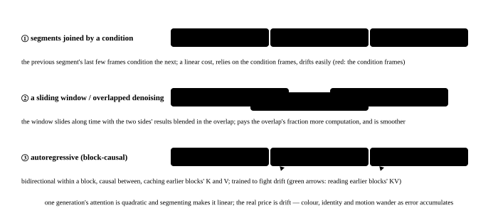

# Long video and consistency: segments, sliding windows and autoregression

<p class="lead">5 seconds of video is already a hundred thousand tokens, and a minute done the same way is a million — attention's quadratic term makes "generate the whole long video at once" unrealistic on any hardware. So long video is always **segmented**: either the end of the previous segment becomes the next one's condition, or a window slides, or the model is made autoregressive outright and generates block-causally. Segmenting brings two new problems: the computation repeated between segments, and the drift from errors accumulating along them. This chapter works out the cost of all three routes, demonstrates the drift with a toy, then looks at why an autoregressive video model brings the KV cache back into diffusion inference — and what that means for serving.</p>

!!! question "Self-test: if you can answer these, skip the chapter"
    1. Why can a 60-second video not be generated as one sequence? Work out the token count and the attention cost.
    2. How does segmented generation keep consecutive segments coherent? What does the overlap cost?
    3. What is drift? Why is it worse with more segments? What mitigations are there?
    4. How does an autoregressive video diffusion model work? What is the essential difference in inference cost from an ordinary bidirectional diffusion model?
    5. What is the same and what differs between the KV cache in an autoregressive video model and an LLM's?

??? success "Answers for the self-test (answer first, then open this)"
    1. 60 seconds of 720p at 24 fps is about 1440 frames, 361 latent frames, about 1.3 million tokens; attention is $\propto N^2$, so it is 300 times more expensive than a 5-second video, on the order of a million TFLOP for one step, and the activations will not fit in memory either.
    2. Take the previous segment's last few frames (as VAE-encoded latents) as the next one's condition (a generalisation of the first-frame condition), or let two neighbouring segments overlap by a few frames and blend the two denoising results in the overlap. The overlapping frames are computed twice, so more overlap is more coherent and more repeated computation.
    3. Every segment's generation carries a little error (a colour shift, a change of detail), and the next segment, conditioned on it, inherits and compounds it, so after dozens of segments the picture has visibly changed colour and the subject has deformed. Mitigations: anchor the first frame or a reference image (so every segment can see the original condition), re-anchor periodically, reschedule the noise, weight the condition frames more heavily, and simulate inference's distribution during training (Self-Forcing).
    4. Split the video into blocks along time, with bidirectional attention within a block and causality between blocks: generating block $k$ only sees the blocks before it. The earlier blocks' K and V can then be cached, a new block's attention cost is proportional only to "the new block x all existing blocks", the whole video's cost grows linearly rather than quadratically with its length, and it can be streamed.
    5. The same: both store the K and V already computed for later reuse, both grow in memory with the length, and both need paging or eviction. Different: each video "position" is a whole block (thousands to tens of thousands of tokens) rather than one token; each block is also denoised over several steps, and what is cached is the K and V **after** the denoising finishes; and a long video usually keeps only the most recent few blocks (a sliding window) plus an anchor block, not the whole history.

## Why it has to be segmented {#为什么必须分段}

```python
def tokens(seconds, fps=24, h=720, w=1280, ft=4, fs=8, p=2):
    frames = int(seconds * fps) + 1
    T = 1 + (frames - 1) // ft
    return T * (h // fs // p) * (w // fs // p)

d, L = 5120, 40
print(f"{'时长':>6} {'token 数':>10} {'一步注意力 PFLOP':>15} {'相对 5 秒':>8}")
base = None
for sec in (5, 10, 20, 60):
    n = tokens(sec)
    attn = L * 4 * n * n * d / 1e15
    base = base or attn
    print(f"{sec:>5}s {n:>10,} {attn:>15.1f} {attn / base:>7.0f}×")
```

```text title="output"
    时长    token 数     一步注意力 PFLOP   相对 5 秒
    5s    111,600            10.2       1×
   10s    219,600            39.5       4×
   20s    435,600           155.4      15×
   60s  1,299,600          1383.6     136×
```

60 seconds is 150 times 5 seconds — not a little slower, impossible. So a long video has to be cut up.

## The three routes {#三条路}

| Route | How | Cost | Coherence | Representative |
| --- | --- | --- | --- | --- |
| Segments with a condition joint | each segment generated on its own, with the previous one's last few frames as its condition | linear, paying for a first-frame condition per segment | relies on the condition frames, drifts easily | the "continuation" of every vendor's I2V model |
| A sliding window with overlapped denoising | the window slides along time, with the two sides' results blended in the overlap | linear x (1 + the overlap's fraction) | smoother, still drifts | FreeNoise, Gen-L-Video |
| Autoregressive (block-causal) | bidirectional within a block, causal between blocks, caching the earlier blocks' K and V | linear, with a KV cache | trained specifically against drift | CausVid, Self-Forcing, MAGI-1, LTX's streaming mode |

{.aig-svg}

The first two use an ordinary bidirectional diffusion model (the model is unchanged, the inference procedure does the work); the third has to be trained for. The first two's cost:

```python
def segmented_cost(seconds, seg_seconds=5, overlap_seconds=1):
    """分段生成的总注意力成本（相对一段 5 秒），重叠的帧算两次"""
    n_seg = max(1, round((seconds - overlap_seconds) / (seg_seconds - overlap_seconds)))
    per_seg = (tokens(seg_seconds) / tokens(5)) ** 2
    return n_seg, n_seg * per_seg

print(f"{'时长':>6} {'一次生成(相对)':>12} {'分 5 秒段/重叠 1 秒':>16} {'段数':>4} {'重叠带来的重复':>12}")
for sec in (5, 10, 20, 60):
    one = (tokens(sec) / tokens(5)) ** 2
    n_seg, seg = segmented_cost(sec)
    no_overlap = sec / 5
    print(f"{sec:>5}s {one:>12.0f}× {seg:>16.1f}× {n_seg:>4} {seg / no_overlap - 1:>11.0%}")
```

```text title="output"
    时长     一次生成(相对)    分 5 秒段/重叠 1 秒   段数      重叠带来的重复
    5s            1×              1.0×    1          0%
   10s            4×              2.0×    2          0%
   20s           15×              5.0×    5         25%
   60s          136×             15.0×   15         25%
```

Segmenting turns the quadratic into a linear cost, and a 1-second overlap pays a little over twenty percent more computation. The real price is not in the compute but in **drift**.

## Drift: how errors accumulate along the segments {#漂移误差怎么沿着段累积}

No segment's generation is perfect: encoding and decoding the condition frames through the VAE loses something, the denoising itself is random, and the model is not entirely at home with the distribution of "pictures it generated itself". The next segment, conditioned on that, inherits the error, and after dozens of segments the picture has visibly shifted in colour and the subject has deformed. The simplest possible toy measures it: each segment takes the previous one's end state as its condition and generates with a little random offset, comparing "look only at the previous segment" with "anchor the first frame as well":

```python
import torch

torch.manual_seed(0)
def generate_segment(cond, anchor, w_anchor, noise=0.08):
    """玩具：新段的状态 = 条件的加权组合 + 一点生成误差（偏移是有方向的，模拟 VAE 往返和模型偏好）"""
    target = (1 - w_anchor) * cond + w_anchor * anchor
    return target + noise * (torch.randn_like(cond) + 0.3)       # +0.3 is the systematic offset: every segment leans a little the same way

first = torch.zeros(16)                                          # the first frame (as the anchor)
print(f"{'段数':>4} {'只看上一段：离首帧的距离':>22} {'锚定首帧(权重 0.3)':>16} {'每 5 段重锚一次':>14}")
for mode in range(1):
    chain, anchored, periodic = first.clone(), first.clone(), first.clone()
    for k in range(1, 41):
        chain = generate_segment(chain, first, 0.0)
        anchored = generate_segment(anchored, first, 0.3)
        periodic = generate_segment(periodic, first, 1.0 if k % 5 == 0 else 0.0)
        if k in (1, 4, 5, 9, 10, 19, 20, 39, 40):
            print(f"{k:>4} {chain.norm():>22.2f} {anchored.norm():>16.2f} {periodic.norm():>14.2f}")
```

```text title="output"
  段数           只看上一段：离首帧的距离     锚定首帧(权重 0.3)      每 5 段重锚一次
   1                   0.30             0.37           0.30
   4                   0.71             0.44           0.77
   5                   0.84             0.45           0.29
   9                   1.54             0.60           1.06
  10                   1.77             0.79           0.35
  19                   2.56             0.41           1.06
  20                   2.60             0.63           0.21
  39                   4.69             0.41           1.01
  40                   4.85             0.32           0.24
```

Looking only at the previous segment, the distance grows linearly with the segment count (the systematic offset accumulating); **anchoring the first frame** holds it within a bounded range where it stops growing; re-anchoring periodically drifts as much as ever between re-anchorings (segments 4, 9, 19 and 39) and jumps sharply back at the re-anchoring (which in a real video is the picture flickering every few seconds). Every mitigation in a real system is a variant of this toy:

- **Keep a reference image or the first frame in the condition always** (subject consistency): every segment can see the original anchor.
- **Keep the condition frames' provenance clean**: condition on the latents rather than on pixels decoded and re-encoded, avoiding the VAE round trip's loss.
- **Reschedule the noise** (the FreeNoise family): neighbouring windows share part of their initial noise, reducing the random difference between segments.
- **Fight drift during training**: condition the model on "frames it generated itself" while training (Self-Forcing, DMD-style autoregressive distillation), which is the heart of the autoregressive route.

## Autoregressive video diffusion: the KV cache is back {#自回归视频扩散kv-cache-回来了}

Split the video into blocks along time (say 4 latent frames each), with **bidirectional attention within a block and causality between blocks**: generating block $k$ only sees the blocks before it. That brings three changes to inference:

1. **The earlier blocks' K and V can be cached.** Generating a new block, its tokens attend to every existing block, but those blocks' K and V do not have to be recomputed — the same thing as an LLM's KV cache. The cost goes from quadratic to linear:

```python
def ar_cost(n_blocks, block_tokens, d, L, window=None):
    """自回归生成 n 个块的注意力成本：第 k 块对前面 min(k, window) 个块的 K、V 做注意力（块内也算）"""
    total = 0
    for k in range(1, n_blocks + 1):
        visible = k if window is None else min(k, window)
        total += L * 4 * block_tokens * (visible * block_tokens) * d
    return total

blk = tokens(5) // 5                                             # about 1 second per block: a fifth of Wan's 720p
print(f"{'时长':>6} {'双向一次生成':>12} {'自回归(看全部历史)':>16} {'自回归(窗口 10 块)':>16}")
for sec in (5, 20, 60):
    n_blocks = sec
    full = L * 4 * tokens(sec) ** 2 * d
    print(f"{sec:>5}s {full / 1e15:>10.0f} PF {ar_cost(n_blocks, blk, d, L) / 1e15:>14.0f} PF {ar_cost(n_blocks, blk, d, L, 10) / 1e15:>14.0f} PF")
```

```text title="output"
    时长       双向一次生成       自回归(看全部历史)     自回归(窗口 10 块)
    5s         10 PF              6 PF              6 PF
   20s        155 PF             86 PF             63 PF
   60s       1384 PF            747 PF            227 PF
```

2. **It can be streamed**: the first block can be decoded and played as soon as it is generated, and the user's perceived latency is "the first block" rather than "the whole thing". Together with few-step distillation (4 steps per block), a model of 1.3B can come close to real time on a single H100 (CausVid and Self-Forcing report streaming generation at a dozen or so frames per second).

3. **Exposure bias has to be solved in training**: the model sees real history frames while training and its own generations at inference, the distributions differ, and the error accumulates all the same. Methods like Self-Forcing use the model's own generated blocks as the history during training, teaching the model inference's distribution directly — which is what lets the autoregressive route reach tens of seconds without collapsing.

### Against an LLM's KV cache {#和-llm-的-kv-cache-比}

| | LLM | Autoregressive video diffusion |
| --- | --- | --- |
| What is cached | one token's K and V | a whole block's (thousands of tokens) K and V, and **after the denoising finishes** |
| One forward pass handles | 1 new token | 1 new block x the denoising steps (each step attends to the history) |
| History length | all of it, up to the context limit | usually only the most recent few blocks plus an anchor block (a sliding window), or the memory and the cost both grow linearly |
| Memory | grows linearly with the sequence, needs paging | grows with the block count likewise, and the blocks are large so the limit arrives sooner |
| Reuse | prefix caching reuses across requests | reuse within one video; across requests only when continuing the same video |

What it means on the inference-system side: an autoregressive video model is **the first generative model that can use an LLM serving stack's machinery** — a paged KV pool, per-block scheduling, streaming output, a cache hit on a continuation request (see [Writing mini-sglang](minisgl://) and [The paged KV cache](serving://engine/paged-kv/)). This is exactly what frameworks like SGLang Diffusion and vLLM-Omni are after in putting diffusion and LLMs in the same engine.

## What it means for the serving layer {#服务层的含义}

Long video turns generation into a **long task**:

- **Streaming output**: decode and return per segment or per block, since the latency to the user's first segment decides the experience.
- **Checkpointing and cancellation**: a task of several minutes has to be cancellable midway (saving the remaining compute), and ideally resumable from some segment.
- **Resource occupancy**: one long video holds one or several cards for minutes, so the scheduler has to queue by "expected duration" rather than by request count.
- **Quality monitoring**: drift is gradual, so a light consistency check between segments (a colour histogram, the similarity to a reference image) can re-anchor or raise an alarm when a threshold is crossed.

These are developed in generation serving's scheduling.

!!! interview "How to answer in an interview"
    Asked how long video is generated, give the impossibility first: 60 seconds is 12 times 5 seconds' tokens and 150 times its attention, so it has to be segmented. Then the three routes: segments joined by a condition (a linear cost, relying on the condition frames, drifting easily), a sliding window with overlap (smoother, paying twenty percent more computation), and autoregressive block-causal generation (a linear cost, a KV cache, streamable, but needing dedicated training and a solution to exposure bias — Self-Forcing uses the model's own blocks as the training history). Drift is in essence a systematic error accumulating along the segments, and anchoring the first frame or a reference image flattens it to a constant. Finish on the systems point: an autoregressive video model is the first time paged KV, block scheduling and streaming output, that whole LLM serving stack, has been applied to a generative model.

## Exercises {#练习}

1. Change the systematic offset in the drift toy from 0.3 to 0 (random error only). How does the distance grow when looking only at the previous segment? What does that say about the nature of drift's two sources?

??? success "Answer"
    The distance grows as $\sqrt{k}$ (a random walk), much slower than linearly. The systematic offset (the VAE round trip's fixed loss, the model's preference for a certain kind of picture) accumulates linearly and is drift's main source, while the random error only diffuses slowly. So mitigating drift means first eliminating the systematic bias (condition on the latents, let the model see its own output during training) and only then reducing the randomness.

2. In autoregressive generation, change the window from 10 blocks to 3. What does 60 seconds cost now? What does it cost you?

??? success "Answer"
    The cost approaches $n \times 3 \times$ a block's cost, about 3 times lower again than a window of 10. The price is that the model can see only the most recent 3 seconds and anything earlier has to be held by the anchor block or a reference image, so long-range consistency (a person leaving the frame and coming back) gets worse. Real systems often use "the most recent few blocks plus the first block as an anchor".

3. A service runs 5-second short-video requests and 60-second long-video requests at the same time. What goes wrong with queueing by "request count"? How would you design it?

??? success "Answer"
    One 60-second request holds a card more than 12 times as long as a short one, so queueing by request count leaves short requests waiting minutes behind long ones. Queue by expected duration (tokens x steps) and split the pools: long tasks get dedicated instances or a fixed quota while short tasks are kept at a low latency; long tasks return per segment as a stream and support cancellation; under overload, reject or degrade (fewer segments, a lower resolution) the long tasks rather than slowing everyone down together.

## Summary {#小结}

- [x] A long video cannot be generated at once: 60 seconds' attention is 150 times 5 seconds'. It has to be segmented, which turns the quadratic into a linear cost, with an overlap paying twenty percent more.
- [x] Drift is a systematic error accumulating along the segments, growing linearly when only the previous segment is seen; anchoring the first frame or a reference image flattens it to a constant, with noise rescheduling and training against it (Self-Forcing) as further measures.
- [x] A block-causal autoregressive model brings the KV cache back to diffusion inference: a linear cost, streamable, close to real time after few-step distillation; but it needs dedicated training to solve exposure bias, and the history usually keeps only the most recent few blocks plus an anchor.
- [x] A long video is a long task: queue by expected duration, stream the output, allow cancellation, monitor consistency between segments — the first landing of the LLM serving stack on a generative model.
