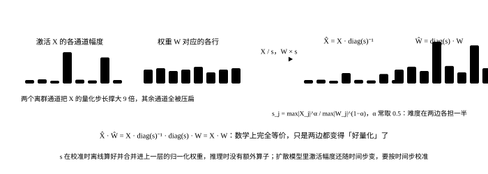

# 量化：扩散模型和 LLM 不一样的地方

<p class="lead">LLM 推理里权重量化是最划算的手段之一：decode 带宽受限，权重变小直接变快。扩散模型不是——一步算力受限，只把权重压小几乎不提速，它换来的是"放得下"。要真的快，得让矩阵乘在低精度上做：FP8、INT8 的激活量化，乃至 W4A4。而激活量化在扩散模型里有自己的坑：AdaLN 调制放大了离群通道，不同时间步的激活分布差别很大，某些层碰一下就花。这一章把这些差别讲清楚，用可运行的例子看离群值、按时间步校准、SmoothQuant 和 SVDQuant 各自在解决什么，最后给出"哪些层能量化、哪些不能"的清单。</p>

!!! question "自测：能答上来就可以跳过本章"
    1. 为什么 INT4 权重量化在 LLM 上提速、在扩散模型上反而可能更慢？
    2. 扩散模型的激活离群值从哪来？为什么比 LLM 更难处理？
    3. "按时间步校准"是什么意思？不做会怎样？
    4. SVDQuant 的低秩分支在干什么？它为什么能做到 W4A4 还接近无损？
    5. 哪些层不该量化？VAE 为什么要单独对待？

??? success "自测参考答案（先自己答，再展开对照）"
    1. LLM decode 每读一次权重只算一个 token，权重小一倍速度快一倍；扩散模型一步对几千上万个 token 做计算，权重读取不是瓶颈，INT4 还要先反量化成 bf16 再算，多了一步，所以不提速甚至变慢。它的价值是显存：12B 从 24 GB 压到 6.5 GB。
    2. AdaLN 把时间步相关的缩放和偏移乘到激活上，某些通道被放大几十倍；注意力输出和 MLP 的中间激活也有少数通道幅度远超其他。LLM 的离群通道是固定的（可以静态处理），扩散模型的离群程度随时间步变化，一套静态的量化参数在某些时间步会严重溢出或损失精度。
    3. 量化激活需要缩放因子，它由校准数据的激活范围决定。扩散模型的激活在不同时间步分布不同，所以要在多个时间步上采样校准数据，或者给不同时间步（段）用不同的缩放因子；只在一个时间步校准，其他时间步要么溢出要么分辨率浪费。
    4. 先用 SVD 从权重里分离出一个低秩分量（秩 16～64），用 16 位算这个小分支；剩下的"残差"权重离群值被吸收后分布更平、更容易 4 位量化，激活也经过平滑迁移到权重。低秩分支的计算量只占百分之几，却把 4 位量化的误差压到接近 8 位的水平，矩阵乘走 INT4 Tensor Core，FLUX 在 4090 上 3 倍快。
    5. 时间步嵌入和 AdaLN 的调制 MLP（参数少、误差放大到所有 token）、第一层 patch 嵌入和最后的输出投影、softmax 和归一化（本来就该高精度）、VAE（本身对精度敏感，SDXL 的 VAE 连 fp16 都溢出，而且它只跑一次，量化没有收益）。

## 先分清：省显存还是提速

| 精度 | 权重大小 | 矩阵乘怎么算 | 速度（扩散模型） | 什么时候用 |
| --- | --- | --- | --- | --- |
| bf16 / fp16 | 1× | 16 位 Tensor Core | 基准 | 显存够时 |
| FP8 权重 + FP8 激活（W8A8） | 0.5× | FP8 Tensor Core（Hopper、Ada、Blackwell） | 1.2～1.6× | 新卡的默认选择 |
| INT8 权重 + INT8 激活 | 0.5× | INT8 Tensor Core（Ampere 起） | 1.2～1.5× | 老卡；需要平滑离群值 |
| INT8 / INT4 仅权重（NF4、GPTQ、AWQ） | 0.5× / 0.28× | 反量化成 16 位再算 | 0.6～1.0× | 只为放得下 |
| W4A4（SVDQuant） | 0.28× | INT4 Tensor Core + 16 位低秩分支 | 2～3× | 消费级卡上跑 FLUX / Wan |

记住一条分界线：**只量化权重 = 显存手段，激活也量化 = 速度手段**。扩散模型一步的算术强度是几千（见[推理的算账](accounting.md)），矩阵乘本身的速度才是瓶颈。

## 离群值：从哪来，为什么麻烦

量化一个张量就是 $x \approx s \cdot \text{round}(x / s)$，缩放因子 $s$ 由张量的最大值决定。少数极大的值会把 $s$ 撑大，让其余大多数值只剩几个有效档位。先造一个有离群通道的激活，看 INT8 的误差随离群程度怎么变：

```python
import torch

torch.manual_seed(0)

def fake_quant(x, bits, axis=None):
    """对称均匀量化再反量化；axis=None 按整个张量一个缩放因子，否则沿该维各自一个"""
    qmax = 2 ** (bits - 1) - 1
    amax = x.abs().amax() if axis is None else x.abs().amax(dim=axis, keepdim=True)
    s = amax.clamp(min=1e-8) / qmax
    return (x / s).round().clamp(-qmax, qmax) * s

def rel_err(a, b):
    return ((a - b).norm() / b.norm()).item()

N, C = 1024, 512                                   # 1024 个 token、512 个通道
base = torch.randn(N, C)
def err_normal(q, x):                              # 只看没被放大的那些通道：离群值把缩放因子撑大之后，受害的是它们
    return rel_err(q[:, 4:], x[:, 4:])
print(f"{'离群通道的放大倍数':>12} {'INT8 按张量':>10} {'INT8 按通道':>10} {'INT4 按张量':>10} {'INT4 按通道':>10}   （误差在正常通道上量）")
for scale in (1, 10, 50, 200):
    x = base.clone()
    x[:, :4] *= scale                              # 前 4 个通道被放大（AdaLN 调制、注意力输出里都会出现这种通道）
    print(f"{scale:>12} {err_normal(fake_quant(x, 8), x):>10.4f} {err_normal(fake_quant(x, 8, axis=0), x):>10.4f} "
          f"{err_normal(fake_quant(x, 4), x):>10.4f} {err_normal(fake_quant(x, 4, axis=0), x):>10.4f}")
```

```text title="输出"
   离群通道的放大倍数   INT8 按张量   INT8 按通道   INT4 按张量   INT4 按通道   （误差在正常通道上量）
           1     0.0106     0.0079     0.1920     0.1426
          10     0.0885     0.0079     0.9907     0.1426
          50     0.4420     0.0079     1.0000     0.1426
         200     0.9961     0.0079     1.0000     0.1426
```

离群通道放大 50 倍，正常通道上按张量的 INT8 误差涨了几十倍（它们的档位被那 4 个通道挤没了），INT4 直接不可用；**按通道**各自一个缩放因子能把误差压回去——但注意：矩阵乘 $XW$ 里，激活 $X$ 的"通道"是它的列，而 INT8 矩阵乘要求缩放因子能从乘积里提出来，列方向的缩放因子提不出来（它和 $W$ 的行耦合）。这就是激活量化比权重量化难的根本原因，也是 SmoothQuant 存在的原因。

## SmoothQuant：把激活的离群迁移到权重里

{.aig-svg}

既然激活按列缩放提不出来，就把它**乘到权重的行上去**：$XW = (X \Lambda^{-1})(\Lambda W)$，$\Lambda$ 是对角矩阵，每个通道的缩放取 $\max|X_j|^{\alpha} / \max|W_j|^{1-\alpha}$。激活变平了、权重变陡了一点，两边都好量化：

```python
W = torch.randn(C, C) * 0.02
x = base.clone(); x[:, :4] *= 50
y_ref = x @ W

def smooth(x, W, alpha=0.5):
    lam = (x.abs().amax(0) ** alpha) / (W.abs().amax(1) ** (1 - alpha))
    return x / lam, W * lam[:, None]

print(f"{'方案':<28} {'输出相对误差':>12}")
print(f"{'W8A8 直接量化（按张量）':<28} {rel_err(fake_quant(x, 8) @ fake_quant(W, 8), y_ref):>12.4f}")
xs, Ws = smooth(x, W)
print(f"{'W8A8 + SmoothQuant':<28} {rel_err(fake_quant(xs, 8) @ fake_quant(Ws, 8), y_ref):>12.4f}")
print(f"{'W4A4 直接量化':<28} {rel_err(fake_quant(x, 4) @ fake_quant(W, 4), y_ref):>12.4f}")
xs4, Ws4 = smooth(x, W, alpha=0.5)
print(f"{'W4A4 + SmoothQuant':<28} {rel_err(fake_quant(xs4, 4) @ fake_quant(Ws4, 4), y_ref):>12.4f}")
```

```text title="输出"
方案                                 输出相对误差
W8A8 直接量化（按张量）                     0.0970
W8A8 + SmoothQuant                 0.0218
W4A4 直接量化                          0.3254
W4A4 + SmoothQuant                 0.3159
```

W8A8 加上平滑之后误差回到可接受的水平——这是 INT8 / FP8 激活量化能在扩散模型上落地的基础。但 **W4A4 即使平滑了误差还是太大**：4 位只有 16 个档位，离群值迁移到权重后权重也不好量化了。

## SVDQuant：把离群值放进一个低秩分支

SVDQuant 的思路：平滑之后，权重里"难量化"的部分集中在少数几个方向上。用 SVD 把权重拆成一个秩 $r$ 的分量 $L_1 L_2$ 和残差 $R$：$W = L_1 L_2 + R$。低秩分量用 16 位算（$r = 32$ 时计算量只有原来的几个百分点），残差 $R$ 离群被吸走之后分布平坦，4 位量化误差小得多：

```python
def svdquant(x, W, rank, bits=4):
    xs, Ws = smooth(x, W, alpha=0.5)
    U, S, Vh = torch.linalg.svd(Ws, full_matrices=False)
    L1, L2 = U[:, :rank] * S[:rank], Vh[:rank]            # 低秩分支，16 位
    R = Ws - L1 @ L2                                      # 残差，4 位
    return fake_quant(xs, bits) @ fake_quant(R, bits) + xs @ L1 @ L2

print(f"{'方案':<28} {'输出相对误差':>12}  低秩分支的额外计算")
for rank in (0, 16, 32, 64):
    err = rel_err(svdquant(x, W, rank) if rank else fake_quant(xs4, 4) @ fake_quant(Ws4, 4), y_ref)
    print(f"{'W4A4 + 低秩 r=' + str(rank):<28} {err:>12.4f}  {2 * rank / C:>6.1%}")
floor = rel_err(fake_quant(base, 4) @ fake_quant(W, 4), base @ W)
print(f"{'对照：没有离群值时的 W4A4':<28} {floor:>12.4f}  （4 位本身的分辨率下限）")
print(f"{'对照：W8A8 + SmoothQuant':<28} {rel_err(fake_quant(xs, 8) @ fake_quant(Ws, 8), y_ref):>12.4f}")
```

```text title="输出"
方案                                 输出相对误差  低秩分支的额外计算
W4A4 + 低秩 r=0                      0.3159    0.0%
W4A4 + 低秩 r=16                     0.1935    6.2%
W4A4 + 低秩 r=32                     0.1829   12.5%
W4A4 + 低秩 r=64                     0.1622   25.0%
对照：没有离群值时的 W4A4                    0.2693  （4 位本身的分辨率下限）
对照：W8A8 + SmoothQuant              0.0218
```

秩 32 的低秩分支只多了 12% 的计算（真实模型里 $d = 3072$，占比更小），就把误差压到了比"没有离群值的张量直接做 4 位量化"还低——离群值的危害被消掉之后，低秩分支还顺便用 16 位扛走了权重里能量最大的几个方向。剩下的是 4 位本身的分辨率问题，真实实现再用按组（每 64 个元素一个缩放因子）的量化把它往下压，并且几十步去噪对单步误差有平均效应，所以出图质量能接近 W8A8。配上专门的 kernel（Nunchaku 把低秩分支和 4 位矩阵乘融合、共享激活的读取），FLUX 在 4090 上 3 倍快、显存 6.5 GB——这是目前消费级卡上跑大 DiT 的最优解之一。

## 时间步：扩散模型独有的变量

LLM 的激活分布是静态的：一次校准、处处适用。扩散模型的激活经过 AdaLN 调制，**每个时间步的分布都不同**。看调制对量化参数的影响：

```python
def adaln(x, t):
    """模拟 AdaLN：缩放随时间步变化——高噪声端（t 小）把一部分通道放大几倍，到数据端逐渐回落"""
    gamma = torch.ones(C)
    gamma[:8] = 1 + 5.0 * torch.exp(-4.0 * t)       # 前 8 个通道在 t=0 时放大 6 倍，t=1 时几乎不放大
    return x * gamma

print(f"{'时间步 t':>7} {'激活最大值':>9} {'用 t=0.5 的缩放因子量化(INT8)':>26} {'按本步校准':>9}")
s_mid = adaln(base, torch.tensor(0.5)).abs().amax() / 127                      # 只在 t=0.5 校准得到的缩放因子
for t in (0.0, 0.25, 0.5, 0.75, 1.0):
    xt = adaln(base, torch.tensor(t))
    q_static = (xt / s_mid).round().clamp(-127, 127) * s_mid                   # 静态缩放因子：可能溢出或浪费档位
    print(f"{t:>7.2f} {xt.abs().amax():>9.2f} {rel_err(q_static, xt):>26.4f} {rel_err(fake_quant(xt, 8), xt):>9.4f}")
```

```text title="输出"
  时间步 t     激活最大值      用 t=0.5 的缩放因子量化(INT8)     按本步校准
   0.00     23.35                     0.2147    0.0426
   0.25     11.05                     0.0257    0.0238
   0.50      6.53                     0.0146    0.0146
   0.75      4.86                     0.0148    0.0110
   1.00      4.66                     0.0148    0.0106
```

一套静态的缩放因子在幅度大的时间步上溢出（误差暴涨），在幅度小的时间步上浪费档位。实践里的做法：**校准数据要覆盖全部时间步**（每个时间步采样一些激活），并且给不同时间步段各自的缩放因子（Q-Diffusion、TDQ 这类方法），或者干脆用动态量化（每一步按当前激活算缩放因子，多一次归约但最稳）。FP8 的指数位让它对这种幅度变化宽容得多，这也是 FP8 比 INT8 在扩散模型上更省心的原因。

## 哪些层不碰

| 层 | 要不要量化 | 原因 |
| --- | --- | --- |
| 注意力和 MLP 的大矩阵乘 | 量化 | 占 95% 以上的计算，是量化的全部收益来源 |
| 时间步嵌入、AdaLN 调制 MLP | 不量化 | 参数极少、输出乘到全部 token 上，误差被放大 |
| patch 嵌入（第一层）、输出投影（最后一层） | 不量化或只 INT8 | 直接接触潜变量，误差直通输出 |
| softmax、归一化、RoPE | 不量化 | 本来就该高精度，FLOP 也少 |
| 文本编码器（T5） | 可以 FP8 / INT8 | 只跑一次，量化为了省显存；对输出影响小 |
| VAE | 不量化 | 对精度敏感（SDXL 的 VAE 连 fp16 都溢出）；只跑一次，没有收益 |

评估方法也和 LLM 不同：LLM 看困惑度和下游任务，扩散模型没有"正确答案"——通常固定种子对比量化前后的图（PSNR / SSIM / LPIPS），再看 CLIP score 和人工评测；而且**要在多个 CFG 和步数下测**，量化误差在强引导、少步时更明显。

!!! interview "怎么讲清楚"
    讲"扩散模型怎么量化"，先给分界线：扩散一步算力受限，只量化权重不提速、只省显存；要提速得量化激活，让矩阵乘走 FP8 / INT8 / INT4 Tensor Core。再给扩散特有的两个难点：AdaLN 调制造成的离群通道（SmoothQuant 把激活的缩放迁移到权重）和激活分布随时间步变化（校准要覆盖全部时间步、按时间步段用不同缩放因子，或者用对幅度宽容的 FP8）。然后给前沿：SVDQuant 用一个 16 位的低秩分支吸走离群值，残差做 W4A4，FLUX 在 4090 上 3 倍快。最后说清哪些层不碰：调制 MLP、首尾层、归一化和 VAE。

## 练习

1. 把 `smooth` 的 `alpha` 从 0.5 扫到 0.3 和 0.8，W8A8 的误差怎么变？$\alpha$ 的含义是什么？

??? success "参考答案"
    $\alpha$ 决定离群值在激活和权重之间怎么分：0 全留在激活，1 全迁到权重。两头都差，中间（0.5 附近）最好；激活离群特别严重的层要把 $\alpha$ 调大一点。真实实现里每层单独搜一个 $\alpha$。

2. 把 `svdquant` 里的低秩分支也量化成 INT8，误差会变多少？这说明低秩分支为什么要用 16 位？

??? success "参考答案"
    误差略增但远小于没有低秩分支的情况。低秩分支集中了权重里能量最大的几个方向，它的误差直接影响主要输出；但它的计算量只占几个百分点，用 16 位的代价可以忽略——所以没必要为它省这点算力。

3. 一个服务把 FLUX 量化成 FP8 后，用户反映"引导强度调到 6 以上图会出现色块"，而 bf16 版本没有这个问题。可能的原因是什么？怎么验证和缓解？

??? success "参考答案"
    强引导把两路预测的差放大 $w$ 倍，量化误差也被放大 $w$ 倍，在某些时间步溢出 FP8 的范围；验证：固定种子，在不同 $w$ 下比较量化版和 bf16 版的 PSNR，看误差是否随 $w$ 急剧上升，并检查哪些层的激活在高 $w$ 时超出范围。缓解：这些层保留 bf16、用按块（per-block）缩放的 FP8、或者在高 $w$ 时切回高精度分支。

## 小结

- [x] 扩散一步算力受限：只量化权重是显存手段（FP8 减半、NF4 到 0.28），要提速必须量化激活，让矩阵乘走低精度 Tensor Core。
- [x] 离群通道（AdaLN 调制、注意力输出）让按张量量化失效；SmoothQuant 把激活的缩放迁移到权重，W8A8 可行；W4A4 要靠 SVDQuant 的 16 位低秩分支吸走离群值。
- [x] 激活分布随时间步变化：校准要覆盖全部时间步、分段缩放或动态量化；FP8 对幅度变化更宽容。
- [x] 不碰的层：调制 MLP、首尾层、归一化、VAE；评估要固定种子比图，并在多个 CFG 和步数下测。
