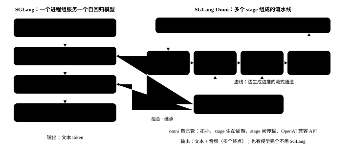

# 定位：SGLang-Omni 是什么，和 SGLang 的边界在哪

<p class="lead">SGLang 擅长的事情是"把一个自回归模型的 batch 跑满"。可一个能听会说的模型——比如 Qwen3-Omni——其实是一串模型：图像和音频编码器、一个大的 MoE 语言模型、一个小的语音 token 生成器、一个非自回归的声码器。它们算力形态不同、依赖关系不同、输出还要边算边往下游推。SGLang-Omni 就是为这类"多阶段生成"写的运行时：它自己管流水线的拓扑、stage 的生命周期、stage 之间的数据搬运和对外的 API，碰到自回归的那一环，再把 SGLang 当成库嵌进去。这一章先把两者的边界划清楚，后面所有章节都建立在这条边界上。</p>

!!! question "自测：能答上来就可以跳过本章"
    1. SGLang 主仓里的 Qwen3-Omni 能输出语音吗？为什么？
    2. SGLang-Omni 用 SGLang 的方式有哪三种？
    3. `sglang_omni/vendor/sglang/` 这个目录是干什么的？
    4. 仓库里有没有完全不依赖 SGLang 的模型？举一个。

??? success "自测参考答案（先自己答，再展开对照）"
    1. 不能。主仓的 `Qwen3OmniMoeForConditionalGeneration` 只建 thinker，`enable_talker` 写死为 `False`，加载权重时把 `talker`、`code2wav` 开头的权重直接跳过，所以只能输出文本。
    2. ① pip 依赖：`pyproject.toml` 锁定 `sglang==0.5.21`；② 直接 import SGLang 的内部类（`Req`、`ScheduleBatch`、`ModelRunner`、并行层……），用组合和继承把它们嵌进自己的 stage；③ 通过 `sglang.serve_backends` 入口点把自己注册成 `sglang serve --model-type omni` 的一个后端。
    3. 对 SGLang 的一部分 import 的收口处，并在这里打 monkey patch（例如 `apply_qk_norm`、`RMSNorm.forward_cuda`）；注释写明上游合并之后就删。
    4. 有。在基准提交里，`auk`、`audar_tts`、`nemotron3_5_asr` 三个模型目录没有任何一个文件 import SGLang 或 omni 的 SGLang 引擎层，只用 omni 自己的调度器。

## 为什么 SGLang 跑不了完整的 Qwen3-Omni

Qwen3-Omni 名义上是"一个模型"，打开权重文件看，其实是好几个子模型拼在一起：编码器、thinker、talker、声码器。SGLang 的一套调度循环只能驱动其中一个自回归模型，所以它只能跑这个模型的一部分。先看 SGLang 主仓怎么处理 Qwen3-Omni。基准版本 v0.5.21 里，模型类是这样建的：

```python title="sglang:python/sglang/srt/models/qwen3_omni_moe.py @ v0.5.21 L541-556,600-604"
class Qwen3OmniMoeForConditionalGeneration(PreTrainedModel):
    def __init__(
        self,
        config: Qwen3VLMoeConfig,
        quant_config: Optional[QuantizationConfig] = None,
        prefix: str = "",
    ):
        super().__init__(config)
        self.config = config

        self.thinker = Qwen3OmniMoeThinkerForConditionalGeneration(
            config.thinker_config, quant_config=quant_config, prefix=prefix
        )
        self.enable_talker = False
        self.pad_input_ids = self.thinker.pad_input_ids
        self.forward = self.thinker.forward
...
        for name, loaded_weight in weights:
            name = name.replace(r"model.language_model.", r"model.")

            if ("talker" in name or "code2wav" in name) and not self.enable_talker:
                continue
```

`self.forward = self.thinker.forward`：整个模型的前向就是 thinker 的前向。加载权重时，名字里带 `talker` 或 `code2wav` 的全部 `continue` 掉。这不是 bug，而是 SGLang 的架构决定的：SGLang 的进程模型是"一个 TokenizerManager → 一个 Scheduler → 一个 ModelRunner → 一个 Detokenizer"，一个调度循环只驱动一个自回归模型，输出是 token 再反分词成文本。

而 Qwen3-Omni 要说话，至少要再跑两样东西：

| 部件 | 计算形态 | 和上下游的关系 |
| --- | --- | --- |
| thinker（30B-A3B 的 MoE） | 自回归，prefill 算力受限、decode 访存受限 | 吃编码器的结果，产出文本 token 和隐状态 |
| talker（小的自回归模型） | 自回归，每一步还要再预测多个码本 | 吃 thinker 的隐状态，边生成边往下游推 codec 码 |
| code2wav（声码器） | 非自回归的卷积网络，按 chunk 解码 | 吃 talker 的码流，输出 24 kHz 波形 |

三者的 batch 策略、显存需求、延迟目标都不一样，塞进同一个调度循环会互相拖慢。SGLang-Omni 的答案是把它们拆成多个 **stage**，每个 stage 配一个适合自己负载的调度器，stage 之间用流式通道连起来。仓库 README 的定位写得很直白：

```text title="README.md @ 921ea2c8 L41-46"
SGLang-Omni is a multi-stage serving runtime for omni, speech, and TTS models. Its design target is multi-stage decoding: generation split across heterogeneous stages with different compute patterns, dependency structures, and resource needs. SGLang-Omni owns the pipeline topology, stage lifecycle, inter-stage transport, model-family integration layer, and OpenAI-compatible serving surface, while composing with [SGLang](https://github.com/sgl-project/sglang) for high-performance autoregressive scheduling and model execution where applicable.

- **Multi-stage runtime**: SGLang-Omni models generation as coordinated stages: preprocessing, encoders, autoregressive engines, talkers, decoders, vocoders, and aggregators.
- **Stage-specialized scheduling**: Each stage runs behind a scheduler matched to its workload, from SGLang-backed autoregressive scheduling to lightweight preprocessing and streaming vocoder loops.
- **Transport-aware execution**: A control plane coordinates requests while the relay data plane moves tensor payloads across shared-memory, NCCL, NIXL, and Mooncake backends.
- **API surface**: OpenAI-compatible endpoints expose multimodal chat, speech generation, batch speech, streaming speech, uploaded voices, and transcription.
```

注意最后半句：**"composing with SGLang ... where applicable"**。omni 不是 SGLang 的 fork，也不是 SGLang 里的一个插件模块，而是一个以 SGLang 为库的上层运行时。下面这张图是全书的地图：

{.aig-svg}

## 依赖 SGLang 的三种方式

### 一、pip 依赖：版本锁死

```bash title="pins.sh"
git show "$REF:pyproject.toml" | grep -nE '^\s*"(sglang|torch|transformers|flashinfer_python\[cu13\])==' | cut -c1-90
```

```text title="输出"
23:    "torch==2.13.0",
26:    "transformers==5.12.1",  # Match the pinned sglang stack
35:    "sglang==0.5.21; sys_platform != 'darwin' or platform_machine != 'arm64'",
38:    "flashinfer_python[cu13]==0.6.18; sys_platform != 'darwin' or platform_machine != '
```

omni 锁定 `sglang==0.5.21`，连 torch、transformers、flashinfer 的版本也跟着 SGLang 的那套走——因为它要 import SGLang 的内部类，任何一边升级都可能让接口对不上。升级 SGLang 在这个仓库里是一个专门的 PR（比如 `[Deps] Bump SGLang to 0.5.20`），会顺带改一批适配代码。

### 二、import 内部类：组合、继承和 vendor 层

数一数基准提交里有多少文件直接 import 了 SGLang：

```bash title="imports.sh"
total=$(git ls-tree -r --name-only "$REF" -- sglang_omni | grep -c '\.py$')
direct=$(git grep -lE '^\s*(from sglang(\.| )|import sglang(\.| |$))' "$REF" -- 'sglang_omni/*.py' | wc -l)
vendor=$(git grep -lE 'sglang_omni\.vendor\.sglang' "$REF" -- 'sglang_omni/*.py' | wc -l)
echo "sglang_omni/ 下的 .py 文件：$total"
echo "直接 import sglang 的：      $direct"
echo "经 vendor 层 import 的：     $vendor"
```

```text title="输出"
sglang_omni/ 下的 .py 文件：723
直接 import sglang 的：      184
经 vendor 层 import 的：     22
```

两百来个文件直接用 SGLang 的东西，最核心的有三处，第五章会逐行读：

- `scheduling/omni_scheduler.py` 的 `OmniScheduler`：**不继承** SGLang 的 `Scheduler`，而是用 `__getattr__` 把上游类的方法绑到自己身上调用（组合）；
- `model_runner/sglang_model_runner.py` 的 `SGLModelRunner`：**继承** SGLang 的 `ModelRunner`，负责加载权重、分配 KV 池、捕获 CUDA Graph；
- 模型代码用 SGLang 的并行层来写：`QKVParallelLinear`、`RowParallelLinear`、`RMSNorm`、`FusedMoE`……

`vendor/sglang/` 是一个隔离层。它的 `core.py` 把常用的内部类集中 import 一遍：

```python title="sglang_omni/vendor/sglang/core.py @ 921ea2c8"
"""Vendor wrapper for sglang.srt.model_executor.forward_batch_info.

Use static imports to preserve IDE navigation, and apply optional patches below.
"""

from __future__ import annotations

from sglang.srt.configs.model_config import ModelConfig
from sglang.srt.environ import envs
from sglang.srt.managers.schedule_batch import Req, ScheduleBatch
from sglang.srt.managers.schedule_policy import PrefillAdder
from sglang.srt.managers.scheduler import GenerationBatchResult
from sglang.srt.model_executor.forward_batch_info import ForwardBatch
from sglang.srt.model_executor.model_runner import ModelRunner
from sglang.srt.server_args import ATTENTION_BACKEND_CHOICES, PortArgs, ServerArgs

__all__ = [
    "Req",
    "envs",
    "ScheduleBatch",
    "PrefillAdder",
    "ForwardBatch",
    "ModelRunner",
    "ModelConfig",
    "ServerArgs",
    "PortArgs",
    "ATTENTION_BACKEND_CHOICES",
    "GenerationBatchResult",
]

```

同目录的 `layers.py`、`models.py` 则在 import 的同时打补丁，并在文件头写明补丁的内容和删除条件：

```python title="sglang_omni/vendor/sglang/models.py @ 921ea2c8 L1-9"
"""Vendor wrapper for sglang.srt.models.utils.

Centralize third-party imports and apply monkey patches here.

Patch applied to apply_qk_norm:
  - Skip fused_inplace_qknorm when q_norm.cast_x_before_out_mul is True,
    ensuring HF-compatible RMSNorm cast order for QK normalization.
This patch can be removed once upstream SGLang merges the equivalent change.
"""
```

这种写法的好处是"对上游的所有改动都在一个地方"：升级 SGLang 时先看这里的补丁还要不要，再看直接 import 的那两百个文件有没有接口变化。

### 三、serve 插件：挂在 SGLang 外面

SGLang 在 2026-08-14（#34753）加了一个扩展点：外部项目在 `sglang.serve_backends` 入口点组里注册一个工厂，它的名字就成了 `sglang serve --model-type` 的合法取值。omni 在 `pyproject.toml` 里注册了自己：

```toml title="pyproject.toml @ 921ea2c8 L126-131"
[project.scripts]
sgl-omni = "sglang_omni.cli:app"
sgl-omni-router-py = "sglang_omni_router.python.serve:main"

[project.entry-points."sglang.serve_backends"]
omni = "sglang_omni.cli.sglang_backend:create_backend"
```

SGLang 那一侧的接口说明：

```python title="sglang:python/sglang/cli/serve_backends.py @ v0.5.21 L3-11"
"""Extension API and discovery for ``sglang serve`` backends.

Out-of-tree projects register a zero-argument factory in the
``sglang.serve_backends`` entry point group. The factory returns a
:class:`ServeBackend`; its entry point name becomes a valid ``--model-type``.

The module is intentionally lightweight. Importing it must not initialize an
inference runtime or import an out-of-tree backend implementation.
"""
```

所以 `sglang serve --model-type omni ...` 和 `sgl-omni serve ...` 走的是同一条路——前者只是把命令行转发给后者（`sglang_omni/cli/sglang_backend.py`）。这个方向很能说明两者的关系：**是 SGLang 给外部项目开口子，而不是 omni 改 SGLang 内部。**

## 并非所有模型都用 SGLang

omni 的模型都在 `sglang_omni/models/<模型>/`。逐个目录检查它有没有用到 SGLang 或 omni 的 SGLang 引擎层（`OmniScheduler`、`engine_factory`、`model_runner`、vendor 层）：

```bash title="no-sglang-models.sh"
for d in $(git ls-tree -d --name-only "$REF" sglang_omni/models/ | sed 's#.*/##'); do
  n=$(git grep -lE '^\s*(from sglang(\.| )|import sglang(\.| |$))|sglang_omni\.(vendor\.sglang|scheduling\.(omni_scheduler|engine_factory)|model_runner)' "$REF" -- "sglang_omni/models/$d/" | wc -l)
  [ "$n" = 0 ] && echo "不用 SGLang：$d"
done
echo "模型目录总数：$(git ls-tree -d --name-only "$REF" sglang_omni/models/ | wc -l)"
```

```text title="输出"
不用 SGLang：audar_tts
不用 SGLang：auk
不用 SGLang：nemotron3_5_asr
模型目录总数：25
```

这三个模型（腾讯的 AuK 语音编辑、Audar TTS、NVIDIA Nemotron 3.5 ASR）的计算全用 omni 自己的 `SimpleScheduler`、`SessionScheduler` 这类调度器驱动。这说明 omni 的骨架——Coordinator、Stage、通信层——本身不依赖 SGLang；SGLang 只是"自回归引擎"这一种 stage 的实现。第三、四章会在一台没有 GPU、也没有装 SGLang 内核的机器上，用 omni 的真实运行时跑一条玩具流水线，正是利用了这一点。

## 和周边项目的关系

**SGLang Diffusion（`sglang.multimodal_gen`）。** 它在 SGLang 主仓里，做图像和视频的扩散生成，和 omni 不是一回事。omni 只在一个地方用到它：

```bash title="multimodal-gen.sh"
git grep -lE 'sglang\.multimodal_gen' "$REF" -- sglang_omni | sed "s/^$REF://"
```

```text title="输出"
sglang_omni/models/minimax_music3/README.md
sglang_omni/models/minimax_music3/dit.py
```

MiniMax Music 3 的 DiT 部分直接借了 SGLang Diffusion 的组件——又一个"能复用就复用"的例子。

**vLLM 那边的对应项目是 vLLM-Omni**，定位相同：在 vLLM 引擎之上做多阶段的全模态服务。

**仓库里的 Swift 代码（`Voxt/`、`OmniTyper/`）不是 kernel。** 它们是两个 macOS 客户端 App，通过 HTTP 调用本机的 omni 服务做语音输入，和推理系统的学习无关；统计代码量、grep 的时候记得排除这两个目录（第二章会用到）。

## 什么时候用哪个

| 你要服务的模型 | 用什么 |
| --- | --- |
| 纯文本 LLM、视觉语言模型（输出文本） | SGLang |
| Qwen3-Omni 但只要文本输出 | 两者都行：SGLang 主仓（只加载 thinker）或 omni 的 `text` 变体 |
| 要输出语音的全模态模型（Qwen3-Omni、Ming-Omni、MiniCPM-o） | SGLang-Omni |
| TTS、ASR、音乐生成 | SGLang-Omni |
| 文生图、文生视频 | SGLang Diffusion |

## 练习

**1. 验证"omni 的 Qwen3-Omni 加载了 talker"。** 在基准提交里找到 omni 自己注册的 talker 模型类，并说出它是怎么让 SGLang 的 `ModelRegistry` 认识这个类的。

??? success "参考思路"
    `git grep -n 'Qwen3OmniTalker' 921ea2c8 -- sglang_omni/model_runner/` 会找到 `sglang_model_runner.py` 里的 `register_omni_model()`：它在 SGLang 的 `ModelRegistry` 里按名字登记 omni 的模型类（`Qwen3OmniTalker`、`Qwen3OmniThinkerForCausalLM`、`Qwen3TTSTalker`……），SGLang 的 ModelRunner 按 HF 配置里的架构名加载模型时就能找到它们。第五章会读这段代码。

**2. 估算一次 SGLang 升级的影响面。** 用 `git log` 找出最近一次 bump SGLang 版本的提交，统计它改了多少个文件、分布在哪些目录。

??? success "参考思路"
    `git log --oneline -i --grep='bump sglang' 921ea2c8 | head`，再对找到的提交用 `git show --stat <提交> | tail -1` 和 `git show --name-only --format= <提交> | cut -d/ -f1-2 | sort | uniq -c`。通常集中在 `vendor/`、`scheduling/`、`model_runner/` 和个别模型的 `sglang_model.py`。

**3. 找一个 vendor 补丁的上游状态。** 选 `vendor/sglang/layers.py` 里的一个补丁，到 SGLang 主仓的 main 上看对应的函数有没有合入等价修改。

??? success "参考思路"
    读 `layers.py` 文件头的补丁说明（`RMSNorm.forward_cuda` 的空张量提前返回、dtype 不一致时的回退），然后在 `~/sglang-src` 里 `git log -S 'numel() == 0' -- python/sglang/srt/layers/layernorm.py` 之类地搜。合入了的补丁就是一个现成的清理 PR 机会。

!!! interview "怎么讲清楚"
    讲"SGLang-Omni 和 SGLang 的关系"，先讲问题：全模态模型是一串算力形态不同的模型，一个调度循环驱动不了；SGLang 主仓的 Qwen3-Omni 因此只加载 thinker。再讲边界：omni 自己管拓扑、stage 生命周期、stage 间传输和 API，自回归那一环用组合 + 继承把 SGLang 的调度器和 ModelRunner 嵌进来，vendor 层收口所有补丁，serve 插件挂在 SGLang 外面。最后用一个事实收尾：有三个模型完全不用 SGLang，说明骨架和引擎是解耦的。

## 小结

- [x] SGLang 主仓的 Qwen3-Omni 只建 thinker（`enable_talker = False`，跳过 talker / code2wav 权重），只能输出文本。
- [x] omni 是"以 SGLang 为库的多阶段运行时"：拓扑、stage、传输、API 自己管，自回归 stage 嵌 SGLang。
- [x] 依赖 SGLang 的三种方式：pip 锁版本、import 内部类（组合 / 继承 / vendor 补丁）、serve 插件。
- [x] `auk`、`audar_tts`、`nemotron3_5_asr` 完全不用 SGLang——骨架与引擎解耦。
