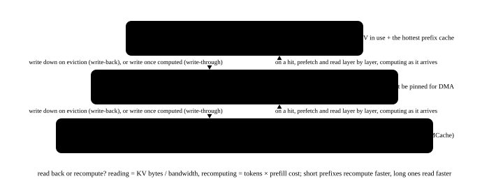

# KV transfer engines and distributed KV storage: Mooncake, NIXL and 3FS

<p class="lead">PD disaggregation moves KV from prefill instances to decode instances, and tiered caching moves KV among GPU memory, CPU memory, remote memory and SSD. Having every inference framework write its own RDMA is unrealistic, so dedicated <b>transfer engines</b> (Mooncake Transfer Engine, NVIDIA NIXL) and <b>distributed KV storage</b> (Mooncake Store, LMCache, 3FS) appeared. This chapter covers their abstractions and design trade-offs, and uses a simulation of multi-turn conversations to show how much prefill a KV pool shared across instances actually saves.</p>

!!! question "Self-test: if you can answer these, skip this chapter"
    1. What problems does a KV transfer engine solve? Why not just use NCCL?
    2. What do Mooncake Transfer Engine's segments and batch transfer interface look like?
    3. What does distributed KV storage use as keys? Why "prefix-chained" hashes?
    4. With cache-aware routing already in place, why is a KV pool shared across instances still needed?
    5. What is 3FS? What role does it play in inference?

??? success "Answers (try first, then expand to compare)"
    1. Moving lots of small chunks of varying size point-to-point between different machines and different media (GPU memory, CPU memory, SSD): registering memory, exchanging metadata (addresses, keys), batched reads and writes, completion notification, plus handling multiple NICs, topology and failures. NCCL is designed for collective communication among fixed members, with communication groups set up in advance and both sides participating, which does not fit this dynamic, point-to-point, multi-media transfer.
    2. A segment is a registered, remotely accessible range of memory (GPU memory, CPU memory or a file), identified by name, with its metadata (address, key, NIC) registered in a metadata service; to transfer, you submit a batch of read/write requests (local address, target segment and offset, length), the engine picks NICs and paths automatically and runs them in parallel, and finally you query the completion status.
    3. Chained hashes of the prefix: the key of block i = hash(key of block i−1, tokens of block i). So one key stands for one complete prefix (KV depends on the whole prefix), different instances compute the same key for the same prefix, and lookups can be global across the cluster.
    4. Cache-aware routing must send a request to the instance that cached it, which creates hotspots, and each instance's cache capacity is limited; a shared KV pool decouples "hitting the cache" from "where to route": under random routing, recomputation drops from about half to just the new content, and when local caches are tight it is steadier than cache-aware routing.
    5. A distributed file system open-sourced by DeepSeek: a disaggregated architecture of SSDs plus RDMA providing very high aggregate bandwidth. In inference it serves as the bottom tier of the KV cache, providing capacity for long contexts and many sessions, on the premise that reading back is faster than recomputing.

## Why a transfer engine {#为什么需要传输引擎}

{.aig-svg}

KV transfer is very different from the collective communication of training:

- **Point-to-point and dynamic**: which prefill instance sends to which decode instance differs for every request, and instances join, leave and fail at any time. NCCL's communication groups are static sets established at startup that must be rebuilt when membership changes, a poor fit;
- **Varied media**: the source and destination may be GPU memory, CPU memory, or a local or remote SSD;
- **Must saturate several NICs**: a machine has 8 NICs, and a large transfer must be sliced and spread across several of them in parallel; which NIC to use depends on the PCIe topology between GPUs and NICs (the [interconnect](interconnect.md#gpudirect让数据不绕道-cpu) chapter);
- **Many small chunks**: KV is stored in pages, which must be merged and posted in batches to avoid the NIC's message rate limit (the [RDMA](rdma.md#请求数与消息速率) chapter);
- **Must tolerate faults**: if a NIC or link breaks, switch to another path and retry.

A transfer engine wraps all this in a simple interface: register memory, read and write in batches by "target + offset", and query the completion status. The inference framework only has to say "write these pieces of KV to those positions on that machine".

## Mooncake Transfer Engine {#mooncake-transfer-engine}

Mooncake is a KV-Cache-centric disaggregated inference architecture (originally designed for a large-scale online chat service), and its transfer engine and KV storage are open source; SGLang's and vLLM's PD disaggregation can both use it as a transfer backend. The transfer engine's core abstractions:

- **segment**: a registered, remotely accessible contiguous address space: a block of CPU or GPU memory on some machine (a RAM segment), or a file on an NVMe drive (accessed over NVMe-oF). Each segment has a name and an ID;
- **Metadata service**: a segment's address, `rkey` and its machine's NIC information are registered in a metadata service (etcd, Redis or an HTTP service), and other nodes look them up by name and then access them directly; this is the engineered version of the previous chapter's "exchange addresses and keys out of band";
- **Batch transfers**: first allocate a batch (`allocateBatchID`), then submit a group of requests (`submitTransfer`), each `{op: READ/WRITE, local address, target segment, target offset, length}`, and finally poll each request's status (`getTransferStatus`);
- **Topology awareness and multiple NICs**: the engine reads the machine's topology and picks the "nearest" NIC for each memory range; large requests are cut into slices spread across several NICs in parallel; when a path fails, it retries on another NIC.

NVIDIA's **NIXL** (NVIDIA Inference Xfer Library) is a library of the same kind, used by Dynamo and vLLM's NIXL connector: each process is an agent that registers GPU memory, CPU memory, files and other memory with different backends (UCX, GPUDirect Storage and others); after agents exchange metadata, they start batch transfers with descriptor lists, optionally with notifications attached. The two abstractions correspond almost one to one: register → exchange metadata → batch reads and writes → completion notification.

## Distributed KV storage {#分布式-kv-存储}

With a transfer engine, KV can be stored "elsewhere":

| Tier | Medium | Capacity | Typical implementations |
| --- | --- | --- | --- |
| L1 | this GPU's memory | tens of GB | the inference engine's own KV pool and prefix cache |
| L2 | this machine's CPU memory | hundreds of GB to TB | SGLang HiCache, vLLM's CPU offloading |
| L3 | memory pools on remote machines | the cluster's total memory | Mooncake Store, LMCache |
| L3 / L4 | SSD (local or a distributed file system) | TB to PB | 3FS, local NVMe |

**Mooncake Store** organizes the spare memory (and SSDs) of many machines in a cluster into a distributed object store: a master service manages metadata, allocates space and decides evictions; the data itself moves directly between clients and storage nodes through the transfer engine, never through the master; hot objects can have several replicas. **LMCache** is a KV-centric cache layer supporting local memory, disk, remote servers and other backends, plugged in through vLLM's KV connector.

**Keys**: every tier and every instance must recognize "the same piece of KV", and the common approach reuses the prefix cache's **prefix-chained hash**: the key of block $i$ is $\text{hash}(\text{key of block } i-1, \text{tokens of block } i)$. So a block's key stands for "the whole prefix from the start up to this block": if two requests share a prefix, their block keys match; if any token in the prefix differs, every later block's key differs. Since KV depends on exactly the whole prefix, these are precisely the semantics we want.

The simulation below verifies this, then looks at what a shared KV pool does for multi-turn conversations. The workload is 300 sessions with 3 kinds of system prompts, 2–6 turns per session, each turn with 128 user tokens and a 256-token model answer, with turns from different sessions arriving interleaved at 4 instances. Compare two routings (random, and cache-aware, where a session always goes to the same instance), with and without a shared KV pool:

```python
import random
from collections import OrderedDict

BLOCK = 16


def block_keys(tokens):
    """前缀链式哈希：第 i 块的键 = hash(第 i-1 块的键, 第 i 块的 token)；只有完整的块才有键"""
    keys, h = [], 0
    for i in range(0, len(tokens) - len(tokens) % BLOCK, BLOCK):
        h = hash((h, tuple(tokens[i:i + BLOCK])))
        keys.append(h)
    return keys


class LRU:
    def __init__(self, cap):
        self.cap, self.d = cap, OrderedDict()

    def __contains__(self, k):
        if k in self.d:
            self.d.move_to_end(k)
            return True
        return False

    def add(self, keys):
        for k in keys:
            self.d[k] = True
            self.d.move_to_end(k)
        while len(self.d) > self.cap:
            self.d.popitem(last=False)


a = list(range(1000, 1048))                      # three full blocks
b = a[:40] + [7] + a[41:]                        # token 41 differs
print("相同前缀的块键一致：", block_keys(a)[:2] == block_keys(b)[:2], "；改动之后的块全部不同：", block_keys(a)[2] != block_keys(b)[2])

# multi-turn workload: 3 system prompts (512 tokens each) × 300 sessions, each turn appending 128 user tokens and 256 answer tokens
rng = random.Random(0)
systems = [[rng.randrange(50000) for _ in range(512)] for _ in range(3)]
convs = [{"hist": list(rng.choice(systems)), "turns": rng.randint(2, 6)} for _ in range(300)]
events = [c for c in convs for _ in range(c["turns"])]
rng.shuffle(events)                              # turns of different sessions arrive interleaved


def simulate(n_inst, local_cap, pool_cap, sticky):
    rng = random.Random(1)
    local = [LRU(local_cap) for _ in range(n_inst)]
    pool = LRU(pool_cap) if pool_cap else None
    for c in convs:
        c["cur"] = list(c["hist"])
        c["home"] = rng.randrange(n_inst)
    total = computed = 0
    for c in events:
        c["cur"] += [rng.randrange(50000) for _ in range(128)]           # the user's new message
        inst = c["home"] if sticky else rng.randrange(n_inst)            # cache-aware routing vs random routing
        keys = block_keys(c["cur"])
        hit = 0
        for k in keys:                                                   # find the longest hit prefix from the start: if it is not local, try the shared pool
            if k in local[inst] or (pool is not None and k in pool):
                hit += 1
            else:
                break
        total += len(c["cur"])
        computed += len(c["cur"]) - hit * BLOCK
        local[inst].add(keys)
        if pool is not None:
            pool.add(keys)
        c["cur"] += [rng.randrange(50000) for _ in range(256)]           # the model's answer, which becomes history next turn
    return computed / total


print("需要重新计算的 prefill token 占比（每个实例的本地缓存 8000 块 / 2000 块）：")
for name, sticky, pool_cap in [("随机路由", False, 0), ("随机路由 + 共享 KV 池", False, 400_000),
                               ("缓存感知路由", True, 0), ("缓存感知路由 + 共享 KV 池", True, 400_000)]:
    print(f"  {name}：" + " / ".join(f"{simulate(4, cap, pool_cap, sticky):.0%}" for cap in (8000, 2000)))
```

```text title="output"
相同前缀的块键一致： True ；改动之后的块全部不同： True
需要重新计算的 prefill token 占比（每个实例的本地缓存 8000 块 / 2000 块）：
  随机路由：48% / 56%
  随机路由 + 共享 KV 池：24% / 24%
  缓存感知路由：25% / 42%
  缓存感知路由 + 共享 KV 池：24% / 24%
```

24% is this workload's floor: what each turn adds (the user's new message, plus the tail of the previous answer that did not fill a block) always has to be computed. Reading the table:

- **Random routing with only local caches**: half of the prefill is recomputation; the session's next turn most likely lands on another instance and hits only the system prompt;
- **Cache-aware routing** nearly reaches the floor when local caches are big enough, but once they get tight (2000 blocks), long sessions' history is evicted and recomputation climbs back to 42%;
- **A shared KV pool** reaches the floor under both routings and both local capacities: it decouples "hitting the cache" from "which instance the request goes to".

This is the value of a distributed KV pool: the router can load-balance more freely (no need to pin requests on a busy instance just to hit the cache); caches survive instance scaling and restarts; and cache capacity grows from "one GPU's memory + one machine's memory" to "the whole cluster's memory and SSDs". The cost is the time to read KV from remote storage, which only pays off when reading back is faster than recomputing; that judgment is in [tiered KV caching and offloading](../distributed/kv-offload.md#读回来还是重算): with long prefixes and large models, reading back is far cheaper than recomputing; with short prefixes and small models, not necessarily.

## 3FS: a distributed file system designed for AI workloads {#3fs给-ai-负载设计的分布式文件系统}

**3FS** (Fire-Flyer File System) is a distributed file system open-sourced by DeepSeek, designed for AI training and inference workloads:

- **Disaggregated architecture**: many SSDs and an RDMA network form a storage cluster, and compute nodes read and write directly over RDMA without caring which storage machine holds the data, aggregating the bandwidth of thousands of SSDs;
- **Strong consistency**: data is replicated with CRAQ (Chain Replication with Apportioned Queries: chain replication where reads can be spread over any replica in the chain); the metadata service is stateless, with metadata kept in the transactional key-value store FoundationDB;
- **Uses**: random reads of training data, parallel reading and writing of checkpoints, and inference's **KVCache**: putting the KV cache on SSDs, trading capacity far cheaper than memory for a higher context-cache hit rate. The officially published figure: a cluster of 180 storage nodes with an aggregate read bandwidth of about 6.6 TiB/s.

SGLang's HiCache can use 3FS as its third-tier storage backend. The point of the SSD tier is **capacity**: a 70B model's KV is 320 KB per token, so a million tokens is 320 GB; keeping caches for thousands of sessions, long documents and agents' long contexts is only affordable with the capacity and cost of SSDs.

## Design trade-offs {#设计取舍}

- **Push or pull, write-back or write-through**: in PD disaggregation, prefill pushing layer by layer overlaps with compute; in tiered caching, write-through (asynchronously write a copy to the lower tier once computed) eases sharing, while write-back (write only on eviction) writes less;
- **Granularity**: smaller blocks give finer prefix sharing but more metadata and requests; storage tiers usually use larger blocks than the inference engine (or pack several blocks into one object);
- **Low consistency requirements**: the KV cache is data that "can be recomputed if lost", so storage can evict aggressively and need not be strongly consistent (3FS's strong consistency mainly serves training data and checkpoints);
- **Layout conversion**: the KV layout in storage must match the instances reading it (TP degree, page size, data type), or it needs converting after reading (see [PD disaggregation](../distributed/pd-disagg.md#布局转换));
- **Security and isolation**: different tenants' KV must not hit each other. Prefix-chained hashes usually mix in the tenant, the model version, the LoRA adapter and similar information, or "the same prefix" might come from different models.

!!! source "Source code"
    - **Mooncake** (`kvcache-ai/Mooncake`): `mooncake-transfer-engine/` (the transfer engine, in C++, with RDMA, TCP, NVMe-oF and other transports) and `mooncake-store/` (distributed KV storage).
    - **NIXL** (`ai-dynamo/nixl`): agents, memory registration and the backend plugins; vLLM's `kv_connector/v1/nixl/` is a complete integration example (both pull and push), and the same directory also has `mooncake/`, `hf3fs/`, `lmcache_connector.py` and more.
    - **SGLang**: PD transfer is in `srt/disaggregation/` (subdirectories such as `mooncake/` and `nixl/`); the third-tier storage of tiered caching is in `srt/mem_cache/storage/`.
    - **3FS** (`deepseek-ai/3FS`): the file system itself, plus the client interface used for KVCache.

!!! interview "How to explain it"
    When PD disaggregation or caching for multi-turn conversations comes up, you can proactively expand on this layer: the transfer engine handles "registering memory, exchanging metadata out of band, batched reads and writes, multiple NICs and topology awareness"; distributed KV storage uses prefix-chained hashes as global keys, decoupling cache hits from routing; and the SSD tier (things like 3FS) provides capacity. Give a quantitative conclusion such as "with random routing half the prefill is recomputation, and a shared pool cuts it down to just the new content", then add "reading back only pays off when it is faster than recomputing", and the layer is covered.

## Exercises {#练习}

**1. Why not transfer KV with NCCL?** List at least three reasons.

??? success "Answer"
    ① NCCL's communication groups are static: instances joining, leaving or failing all require rebuilding the group, while the pairings in PD disaggregation change with every request; ② NCCL targets collective communication and transfers between GPU memories, with no direct support for CPU memory, SSDs and other media; ③ NCCL's sends and receives need both ends to call at the same time (two-sided semantics), while pushing KV suits one-sided writes the peer does not notice; ④ fault tolerance: an NCCL error usually means the whole communication group is dead, while a transfer engine can retry a single request on another path. In fact vLLM once had an NCCL-based PD transfer implementation, and the mainstream solutions since have all switched to transfer engines like NIXL and Mooncake.

**2. What goes into a block key?** A multi-tenant inference platform serves several LoRA versions of the same base model at once. Designing the global key of a KV block, what must you consider besides the tokens?

??? success "Answer"
    At least: the model and weight version (different weights, different KV), the LoRA adapter's ID (when LoRA applies to the Q/K/V projections, the KV differs), the KV data type and quantization, other inputs that affect KV (hashes of images in multimodal inputs, offsets in positional encodings, and so on), and the need for tenant isolation (tenants should not be able to infer each other's prompts from cache hit timing). A common approach is to put this information into the hash seed of the first block, which the chained hashes then inherit naturally.

## Summary {#小结}

- [x] KV transfer is point-to-point, dynamic, multi-media and full of small chunks, so NCCL does not fit; a transfer engine offers a "register memory → exchange metadata → batch reads and writes → completion notification" interface and handles multiple NICs, topology awareness and fault tolerance.
- [x] Mooncake Transfer Engine centers on segments, a metadata service and batch transfers; NIXL provides the same capabilities with agents and backend plugins.
- [x] Distributed KV storage (Mooncake Store, LMCache, 3FS) uses prefix-chained hashes as global keys, growing cache capacity to the cluster's memory and SSDs.
- [x] A shared KV pool decouples cache hits from routing: under random routing, recomputation drops from about half to just the new content; with tight local caches it is steadier than cache-aware routing.
- [x] 3FS provides high aggregate bandwidth with a disaggregated SSD + RDMA architecture, and the SSD tier provides capacity for long contexts and many sessions; reading back only pays off when it is faster than recomputing.
