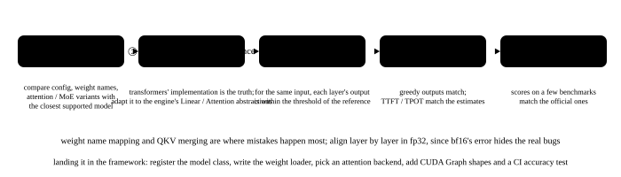

# Onboarding new models and aligning accuracy

<p class="lead">On the day a new model is released, the inference team must get it running in their own engine, and running <b>correctly</b>: outputs matching the official reference implementation, and accuracy evaluations matching the numbers on the model card. This sounds like "writing it out once by copying", but what really takes time is finding the differences you cannot see: a normalization with an extra 1, a few layers using a different RoPE base, a sliding window that only kicks in with long prompts. This chapter walks through the full flow: find the differences, write it following the reference implementation, align layer by layer to locate bugs, accept it with KL and accuracy evaluations, and finally map it onto vLLM's and SGLang's code structure. The example onboards Gemma 3 (270M) into an implementation that "only knows the Qwen architecture".</p>

!!! question "Self-test: if you can answer these, skip this chapter"
    1. Given a new model, what do you look at first to judge how it differs from architectures you already support?
    2. When outputs don't match, how do you find which layer and which module is wrong fastest?
    3. Why must test prompts be long enough and varied enough? Which bugs appear only at certain lengths?
    4. Fully aligned in FP32 but differing in BF16: how much difference is normal? Does a 100% top-1 agreement rate mean there are no bugs?
    5. To add a new model in vLLM or SGLang, what must you write?

??? success "Answers (try first, then expand to compare)"
    1. Three places: `config.json` (new fields, layer types, RoPE parameters), the weight names (which new tensors exist and their shapes), and the reference implementation's code (what the forward pass actually does). Some differences (the $1 + w$ normalization, the embedding being multiplied by a scale) are invisible in the config and only appear in the code.
    2. In FP32, hook every layer (and every module within a layer) and compare outputs with the reference layer by layer to find "which layer and which position starts to go wrong": going wrong from layer 0 usually means the embedding or a normalization; position 0 fine with later positions wrong usually relates to RoPE; going wrong only from some length (say 512) means a length-dependent mechanism like a sliding window.
    3. Many bugs appear only under specific conditions: lengths beyond the sliding window, boundaries of chunked prefill, block-size boundaries, the length at which RoPE scaling kicks in, as well as different batch compositions, the two paths of prefill and decode, and tensor parallelism. Prompts that are too short or too uniform cover none of these.
    4. The same order of magnitude as "normal noise at that precision" is normal: for example, the gap between running the reference implementation itself in BF16 versus FP32. A 100% top-1 agreement rate does not mean there are no bugs; it is very insensitive. KL divergence is sharper, and should be the same order of magnitude as the baseline.
    5. The model file (rewriting the forward pass with the engine's parallel layers and attention backend), the name mapping during weight loading (including merged qkv and gate / up), and registration in the model table; if there is a new structure (a new attention, a new cache type), the engine itself often needs changing too.

## The flow {#流程}

{.aig-svg}

| Step | What to do | Acceptance |
| --- | --- | --- |
| 1. Find the differences | compare the new model's `config.json`, weight names and reference implementation (`modeling_*.py` in transformers) with the closest supported architecture | produce a "difference list" |
| 2. Implement | reuse existing layers and fill in only the differences; map weight names, merge QKV / gate_up projections, split for tensor parallelism | all weights load, with nothing missing or extra |
| 3. Align layer by layer | in FP32, with the same input, compare hidden states layer by layer, find the first mismatching layer, then narrow down into modules | the maximum difference per layer is within floating-point error |
| 4. End to end | KL divergence of the next-token distribution, top-1 agreement rate, greedy generation matching token by token; cover long prompts, batches mixing long and short requests, and both the prefill and decode paths | KL at the order of magnitude of noise at that precision |
| 5. Accuracy evaluation | start a server and run datasets such as GSM8K and MMLU, comparing with the model card and reference frameworks | within about 1 point |
| 6. Performance | CUDA Graphs, a suitable attention backend and kernels, quantization | load tests meet expectations |

## Step one: find the differences {#第一步找差别}

First see what the config and weight names have beyond "the already supported Qwen architecture":

```python
import json

import torch
from safetensors import safe_open

PATH = "models/gemma-3-270m"
new = json.load(open(f"{PATH}/config.json"))
old = json.load(open("models/Qwen3-0.6B/config.json"))
print("config 里新出现的字段：", sorted(set(new) - set(old) - {"_sliding_window_pattern", "use_bidirectional_attention", "pad_token_id"}))
layer0 = lambda path: {k.split("layers.0.")[1] for k in safe_open(f"{path}/model.safetensors", "pt").keys() if "layers.0." in k}
print("第 0 层多出来的权重：", sorted(layer0(PATH) - layer0("models/Qwen3-0.6B")))
print("层类型：", "".join("S" if t == "sliding_attention" else "F" for t in new["layer_types"]), "（S = 滑窗，F = 全注意力）")
```

```text title="output"
config 里新出现的字段： ['attn_logit_softcapping', 'final_logit_softcapping', 'hidden_activation', 'layer_types', 'query_pre_attn_scalar', 'rope_local_base_freq']
第 0 层多出来的权重： ['post_feedforward_layernorm.weight', 'pre_feedforward_layernorm.weight']
层类型： SSSSSFSSSSSFSSSSSF （S = 滑窗，F = 全注意力）
```

Every item on the list corresponds to a passage in the reference implementation (`transformers/models/gemma3/modeling_gemma3.py`); read them one by one:

- `query_pre_attn_scalar`: attention scores are scaled by $1/\sqrt{256}$ rather than $1/\sqrt{\text{head\_dim}}$ (in this model the two happen to be equal, but not at other sizes);
- `hidden_activation`: the MLP's activation is the tanh approximation of GELU, not SiLU;
- `layer_types` and `rope_local_base_freq`: 5 of every 6 layers are sliding-window attention (window 512) and 1 is full attention; the two kinds of layers use different RoPE bases;
- Two extra normalizations: each layer has 4 RMSNorms (one before and one after both attention and the MLP, the "sandwich" structure);
- Reading the code also reveals what the config doesn't show: RMSNorm multiplies by $(1 + w)$ rather than $w$ (the weights are initialized to 0), the word embedding is multiplied by $\sqrt{\text{hidden\_size}}$, and the output layer shares weights with the embedding.

## Step two: write it following the reference implementation {#第二步照着参考实现写}

Write a Gemma 3 from the list above, with two details the first version often misses, controlled by the `fixes` switch so the next section can find them by aligning layer by layer:

```python
import torch.nn as nn
import torch.nn.functional as F
from transformers import AutoModelForCausalLM, AutoTokenizer


class GemmaRMSNorm(nn.Module):
    """Gemma 的 RMSNorm：权重初始化为 0，乘的是 (1 + weight)"""

    def __init__(self, dim, eps):
        super().__init__()
        self.eps, self.weight = eps, nn.Parameter(torch.zeros(dim))

    def forward(self, x):
        x32 = x.float()
        return (x32 * torch.rsqrt(x32.pow(2).mean(-1, keepdim=True) + self.eps) * (1 + self.weight.float())).type_as(x)


def rope(x, theta):
    """x: [heads, T, D]；与 LLaMA 相同的"前后两半配对"写法"""
    D, T = x.shape[-1], x.shape[-2]
    inv = 1.0 / theta ** (torch.arange(0, D, 2).float() / D)
    f = torch.arange(T).float()[:, None] * inv
    cos, sin = torch.cat([f, f], -1).cos().to(x.dtype), torch.cat([f, f], -1).sin().to(x.dtype)
    x1, x2 = x.chunk(2, -1)
    return x * cos + torch.cat([-x2, x1], -1) * sin


class Gemma3(nn.Module):
    """按 config 和参考实现写的 Gemma 3 文本模型；fixes 控制两个"第一版里漏掉的细节"，演示怎么靠逐层对齐把它们找出来"""

    def __init__(self, cfg, fixes=()):
        super().__init__()
        self.cfg, self.fixes = cfg, set(fixes)
        H, hd, eps = cfg["hidden_size"], cfg["head_dim"], cfg["rms_norm_eps"]
        self.nh, self.nkv, self.hd = cfg["num_attention_heads"], cfg["num_key_value_heads"], hd
        self.embed_tokens = nn.Embedding(cfg["vocab_size"], H)
        self.layers = nn.ModuleList()
        for _ in range(cfg["num_hidden_layers"]):
            layer = nn.Module()
            layer.self_attn = nn.Module()
            for name, out in (("q_proj", self.nh * hd), ("k_proj", self.nkv * hd), ("v_proj", self.nkv * hd)):
                setattr(layer.self_attn, name, nn.Linear(H, out, bias=False))
            layer.self_attn.o_proj = nn.Linear(self.nh * hd, H, bias=False)
            layer.self_attn.q_norm, layer.self_attn.k_norm = GemmaRMSNorm(hd, eps), GemmaRMSNorm(hd, eps)
            layer.mlp = nn.Module()
            layer.mlp.gate_proj, layer.mlp.up_proj = nn.Linear(H, cfg["intermediate_size"], bias=False), nn.Linear(H, cfg["intermediate_size"], bias=False)
            layer.mlp.down_proj = nn.Linear(cfg["intermediate_size"], H, bias=False)
            for name in ("input_layernorm", "post_attention_layernorm", "pre_feedforward_layernorm", "post_feedforward_layernorm"):
                setattr(layer, name, GemmaRMSNorm(H, eps))                    # 4 norms per layer: the "sandwich" structure
            self.layers.append(layer)
        self.norm = GemmaRMSNorm(H, eps)

    def attention(self, i, x):
        a, T = self.layers[i].self_attn, x.shape[0]
        sliding = self.cfg["layer_types"][i] == "sliding_attention"
        q = a.q_norm(a.q_proj(x).view(T, self.nh, self.hd).transpose(0, 1))          # QK-Norm comes before RoPE
        k = a.k_norm(a.k_proj(x).view(T, self.nkv, self.hd).transpose(0, 1))
        v = a.v_proj(x).view(T, self.nkv, self.hd).transpose(0, 1)
        theta = self.cfg["rope_local_base_freq"] if sliding and "local_rope" in self.fixes else self.cfg["rope_theta"]
        q, k = rope(q, theta), rope(k, theta)
        k, v = k.repeat_interleave(self.nh // self.nkv, 0), v.repeat_interleave(self.nh // self.nkv, 0)
        scores = q @ k.transpose(-1, -2) * self.cfg["query_pre_attn_scalar"] ** -0.5
        pos = torch.arange(T)
        mask = pos[None, :] <= pos[:, None]                                          # causal
        if sliding and "sliding_window" in self.fixes:
            mask &= pos[None, :] > pos[:, None] - self.cfg["sliding_window"]         # see only the last sliding_window tokens
        out = scores.masked_fill(~mask, float("-inf")).softmax(-1, dtype=torch.float32).to(v.dtype) @ v
        return a.o_proj(out.transpose(0, 1).reshape(T, -1))

    def forward(self, ids):
        x = self.embed_tokens(ids) * torch.tensor(self.cfg["hidden_size"] ** 0.5, dtype=self.embed_tokens.weight.dtype)
        for i, l in enumerate(self.layers):
            x = x + l.post_attention_layernorm(self.attention(i, l.input_layernorm(x)))
            m = l.mlp
            h = l.pre_feedforward_layernorm(x)
            x = x + l.post_feedforward_layernorm(m.down_proj(F.gelu(m.gate_proj(h), approximate="tanh") * m.up_proj(h)))
            self.outputs.append(x)
        return self.norm(x[-32:]) @ self.embed_tokens.weight.T                       # the output layer shares weights with the embedding; compute only the last 32 positions

    def run(self, ids):
        self.outputs = []
        with torch.no_grad():
            return self(ids), self.outputs
```

## Step three: align layer by layer {#第三步逐层对齐}

Hook every decoder layer of the reference implementation and compare with your own layer by layer; the first layer over the threshold is where the bug is (or upstream of it). Then look at which token in that layer starts going wrong, which often points straight at the cause:

```python
from safetensors.torch import load_file

state = {k.removeprefix("model."): v.float() for k, v in load_file(f"{PATH}/model.safetensors").items()}
tok = AutoTokenizer.from_pretrained(PATH)
ref = AutoModelForCausalLM.from_pretrained(PATH, dtype=torch.float32, attn_implementation="eager").eval()


def reference(ids):
    outs = []
    hooks = [l.register_forward_hook(lambda m, i, o: outs.append((o[0] if isinstance(o, tuple) else o)[0])) for l in ref.model.layers]
    with torch.no_grad():
        logits = ref.lm_head(ref.model(ids[None]).last_hidden_state[0, -32:])
    for h in hooks:
        h.remove()
    return logits, outs


def check(model, ids, name):
    lo, ours = model.run(ids)
    lt, theirs = reference(ids)
    diffs = [(a - b).abs().max().item() for a, b in zip(ours, theirs)]
    bad = next((i for i, d in enumerate(diffs) if d > 1e-3), None)
    if bad is None:
        top1 = (lo.argmax(-1) == lt.argmax(-1)).float().mean().item()
        print(f"{name}：{len(ids)} 个 token，18 层全部对齐（逐层最大差都小于 1e-3），最后 32 个位置的 top-1 一致率 {top1:.0%}")
    else:
        rows = ((ours[bad] - theirs[bad]).abs().amax(-1) > 1e-3).nonzero()
        print(f"{name}：{len(ids)} 个 token，第 {bad} 层（{new['layer_types'][bad]}）开始对不上，出错的位置从第 {rows[0].item()} 个 token 开始")


short = tok("Gemma 3 uses local sliding-window attention on five of every six layers.", return_tensors="pt").input_ids[0]
long = tok(" ".join(f"Item {i}: the quick brown fox jumps over the lazy dog." for i in range(40)), return_tensors="pt").input_ids[0]
model = Gemma3(new)
model.load_state_dict(state)
check(model, short, "第一版，短提示词")
model.fixes.add("local_rope")                  # against the reference: sliding-window layers use rope_local_base_freq (10 thousand) for RoPE, and only full-attention layers use rope_theta (1 million)
check(model, short, "修正 RoPE 后，短提示词")
check(model, long, "修正 RoPE 后，长提示词")
model.fixes.add("sliding_window")              # only exposed beyond 512 tokens: sliding-window layers see only the last 512
check(model, long, "再加上滑窗，长提示词")
```

```text title="output"
第一版，短提示词：18 个 token，第 0 层（sliding_attention）开始对不上，出错的位置从第 1 个 token 开始
修正 RoPE 后，短提示词：18 个 token，18 层全部对齐（逐层最大差都小于 1e-3），最后 32 个位置的 top-1 一致率 100%
修正 RoPE 后，长提示词：591 个 token，第 0 层（sliding_attention）开始对不上，出错的位置从第 512 个 token 开始
再加上滑窗，长提示词：591 个 token，18 层全部对齐（逐层最大差都小于 1e-3），最后 32 个位置的 top-1 一致率 100%
```

- **The first version goes wrong at layer 0, starting from token 1**: position 0 is fine, so it is position-dependent; RoPE is the identity at position 0. Layer 0 is a sliding-window layer, and going back to the reference shows that sliding-window layers use `rope_local_base_freq` (10 thousand) for RoPE, while only full-attention layers use `rope_theta` (1 million);
- **After fixing that, short prompts align exactly while long prompts still go wrong, starting exactly at token 512**: 512 is the sliding window's size. The first version never implemented the window, so with prompts shorter than 512 it is identical to full attention; this class of bug can never be caught with short prompts;
- Each fix is one line, but looking only at the final output, it is hard to guess it is those two lines.

Layer-by-layer alignment is the most effective tool when onboarding a new model. A few lessons: compare in FP32 so "a wrong implementation" and "different precision" stay separable; run the reference with the plainest eager attention (`attn_implementation="eager"`) to avoid mixing in differences from its own optimized kernels; when things don't match, look first at "which layer and which position it starts from", since the position is itself a clue (position 0 fine → RoPE; starting at some round number → window, block or chunked-prefill boundaries).

## Step four: end-to-end metrics {#第四步端到端指标}

After aligning layer by layer, look at the final output distribution. Two common metrics: the **KL divergence** of the next-token distribution, and the **top-1 agreement rate**. Take the long prompt from before and compare the last 64 positions:

```python
def last_logits(m, ids, n=64):
    """只算最后 n 个位置的 logits（词表有 26 万，全算太占内存）"""
    with torch.no_grad():
        x = m.embed_tokens(ids) * torch.tensor(m.cfg["hidden_size"] ** 0.5, dtype=m.embed_tokens.weight.dtype)
        for i, l in enumerate(m.layers):
            x = x + l.post_attention_layernorm(m.attention(i, l.input_layernorm(x)))
            h = l.pre_feedforward_layernorm(x)
            x = x + l.post_feedforward_layernorm(l.mlp.down_proj(F.gelu(l.mlp.gate_proj(h), approximate="tanh") * l.mlp.up_proj(h)))
        return (m.norm(x[-n:]) @ m.embed_tokens.weight.T).float()


with torch.no_grad():
    ref_logp = ref.lm_head(ref.model(long[None]).last_hidden_state[0, -64:]).log_softmax(-1)


def agreement(m):
    """与参考实现比：下一个 token 分布的 KL 散度、top-1 一致率"""
    logp = last_logits(m, long).log_softmax(-1)
    kl = (ref_logp.exp() * (ref_logp - logp)).sum(-1).mean().item()
    return ("< 1e-6" if kl < 1e-6 else f"{kl:.1e}"), (logp.argmax(-1) == ref_logp.argmax(-1)).float().mean().item()


for name, setup in [("两处都修正", lambda: None), ("漏了滑窗", lambda: model.fixes.discard("sliding_window"))]:
    setup()
    kl, top1 = agreement(model)
    print(f"FP32、{name}：与参考实现的 KL {kl}，top-1 一致率 {top1:.0%}")
```

```text title="output"
FP32、两处都修正：与参考实现的 KL < 1e-6，top-1 一致率 100%
FP32、漏了滑窗：与参考实现的 KL 1.8e-02，top-1 一致率 100%
```

**With the sliding window missing, the top-1 agreement rate is still 100%**: truncated attention simply cannot see content more than 512 tokens back, which on this repetitive text does not change the most likely next token, yet the distribution has changed. The top-1 agreement rate is insensitive; KL is sharp. Now look at deployment precision:

```python
model.fixes.add("sliding_window")
model.to(torch.bfloat16)                      # deployment precision: the same implementation, just switched to BF16
kl, top1 = agreement(model)
print(f"BF16、两处都修正：与参考实现的 KL {kl}，top-1 一致率 {top1:.0%}")
```

Output on an x86 development machine (BF16 numbers depend on the CPU's instruction set, so read only the magnitude):

```text
BF16、两处都修正：与参考实现的 KL 1.3e-05，top-1 一致率 100%
```

The same correct implementation, switched to BF16, gives KL on the order of $10^{-5}$; the FP32 implementation missing the sliding window gives $10^{-2}$, three orders of magnitude larger. So the acceptance criterion is not "KL of 0" but "the same order of magnitude as normal noise at that precision": first measure a known-correct model's KL at the same precision as a baseline, and if the new model's KL is clearly above it, go back and check layer by layer.

Test inputs must cover every **boundary**, or bugs like the sliding window stay hidden:

- Lengths: prompts beyond the sliding window, beyond chunked prefill's chunk size, beyond the KV block (page) size, beyond compression blocks (DeepSeek-V4's 128), and at the maximum context;
- Paths: the result of one prefill must match "prefill part of it + decode one by one" (the latter takes the incremental KV Cache path, a different body of code);
- Batches: running a request alone and mixed into a batch of varying lengths should give identical results (see [deterministic inference](../topics/deterministic.md));
- Parallelism: after splitting for tensor parallelism (TP=2, 4, 8), results must match a single GPU, especially the head replication when the KV head count is below TP;
- Others: batches padded for CUDA Graphs, continuing after a prefix cache hit, and the KL of a quantized model against the BF16 baseline.

## Step five: accuracy evaluation {#第五步精度评测}

Alignment verifies "the same as the reference implementation"; accuracy evaluation verifies "the same capability as when the model was released", catching problems the reference implementation does not have, such as the chat template, stop tokens, default sampling parameters and the tokenizer's special tokens. The way to do it is to serve the model behind an OpenAI-compatible interface and have an evaluation framework call it:

```bash
vllm serve google/gemma-3-270m-it --port 8000
lm_eval --model local-completions \
  --model_args model=google/gemma-3-270m-it,base_url=http://localhost:8000/v1/completions,num_concurrent=32 \
  --tasks gsm8k --num_fewshot 5
```

- What to compare against: the numbers on the model card (minding the evaluation setup: the number of few-shot examples, whether the chat template is used, greedy or sampling), and the numbers a reference framework (transformers or another inference framework) produces under the same setup;
- How much difference is normal: generative tasks (GSM8K) are affected by sampling and truncation, and about 1 point is common; run several times or look at several tasks together. When clearly low, check the chat template and stop tokens first, then the numerics;
- Quantized models: compare task accuracy against the same model's BF16 baseline, then compare KL and top-1 on a calibration set.

## Landing it in an inference framework {#在推理框架里落地}

- **vLLM**: add a model file under `vllm/model_executor/models/`, using the framework's parallel layers (`QKVParallelLinear`, `MergedColumnParallelLinear`, `RowParallelLinear`) and the unified `Attention` layer (the sliding window is a per-layer parameter); in `load_weights`, use `stacked_params_mapping` to load HF's `q_proj/k_proj/v_proj` into the merged `qkv_proj` and `gate_proj/up_proj` into `gate_up_proj`; map the config's `architectures` name to this class in `registry.py`. Tests go under `tests/models/`, where `check_logprobs_close` in `tests/models/utils.py` is exactly "compare logprobs with HF";
- **SGLang**: add a model file under `srt/models/`, with `EntryClass` at the end of the file declaring its class; the parallel layers, attention (`RadixAttention`) and weight loading are written much like vLLM's;
- New structures a model brings (a new attention, new MoE routing, a new cache type) often require changing the engine itself rather than just adding a model file; the [new generation of open models](../frontier/new-models.md) chapter lists the changes the DeepSeek-V4 generation needs.

!!! interview "In an interview"
    When asked "how do you get a new model running correctly in the engine on release day", walk through the flow with an example you have hit yourself: first compare the config, weight names and reference implementation to list the differences (the $1+w$ normalization, the embedding scale, per-layer RoPE bases, sliding windows, the activation function, the scaling factor); reuse existing layers and fill in the differences; hook layer by layer in FP32 against the reference and infer the cause from "which layer and which position starts going wrong" (position 0 fine means RoPE, starting at 512 means the sliding window); end to end, look at KL rather than only top-1, with normal noise at the same precision as the baseline; cover lengths, both prefill and decode paths, batch composition and tensor parallelism in tests; finally serve it and run evaluations like GSM8K, checking the chat template and stop tokens first.

## Exercises {#练习}

**1. If the "1 +" in RMSNorm were missing, what would layer-by-layer alignment show?**

??? success "Answer"
    RMSNorm is the first operation in every layer, so layer 0 goes wrong, and **every position, including token 0, is wrong**, which distinguishes it nicely from a RoPE bug (where position 0 is fine). More precisely, hooking `input_layernorm`'s output in layer 0 shows it differs from the reference by nearly an overall scaling factor (Gemma's weights are learned around 0, so $w$ and $1+w$ are far apart), locating the normalization on the first step. Try changing `(1 + self.weight.float())` to `self.weight.float()` in the example.

**2. Why align layer by layer in FP32 rather than the BF16 used in deployment?**

??? success "Answer"
    BF16 has only 8 mantissa bits, so two correct implementations (differing, say, in matrix-multiply accumulation order) also differ by about $10^{-2}$ layer by layer, growing with depth and mixing with "differences from real bugs", which makes the threshold hard to set. In FP32, two correct implementations differ by about $10^{-6}$, so any implementation error far exceeds it and layer-by-layer comparison has resolution. BF16's own problems (overflow, operators that must accumulate in FP32) are left to the end-to-end stage, checked with KL against a baseline at the same precision.

**3. A new model scores 8 points below the model card on GSM8K in your engine, yet layer-by-layer alignment passes completely. What do you check?**

??? success "Answer"
    Passing alignment means "given a token sequence, the model's computation is right", so the problem is most likely in the token sequence itself or in decoding: the chat template (system prompt, role markers, whether BOS was added, the thinking-mode switch), the tokenizer's special tokens and stop tokens (not stopping, or stopping early), default sampling parameters (temperature, top_p, repetition penalty in `generation_config.json`), the maximum generation length truncating the reasoning, and the evaluation's few-shot setup and answer extraction. Only then come the paths reached only in the service: chunked prefill, prefix caching, CUDA Graph padding, speculative decoding.

**4. Hands-on: onboard a model with a newer structure.** Gemma 3's differences are all "inside the layers". Qwen3.5 goes further: of 24 layers, 18 are Gated DeltaNet, so each request carries state that must be saved, zeroed, and relayed between chunks.

??? success "Approach"
    This is [assignment four](minisgl://wrap/assignment-hybrid/): onboard Qwen3.5's text part in a hand-written mini-sglang, matching transformers token by token. The difference list includes at least: two kinds of RMSNorm (layer norms use $1+w$, gate norms plain $w$), an output gate inside q_proj, RoPE applied to only the first 1/4 of the dimensions, convolution caches and recurrent states, and a KV pool allocated only for the 6 full-attention layers. The layer-by-layer method is exactly as in this chapter; what is new is the engine side: the state pool holds state per request slot, and prefix caching must either refuse or hit only where a state checkpoint was saved.

## Summary {#小结}

- [x] The flow for a new model: find the differences → reuse existing layers and fill in the differences → align layer by layer in FP32 → end-to-end KL and greedy agreement → accuracy evaluation → performance.
- [x] The difference list comes from three places: the config, the weight names and the reference implementation; some differences (the $1+w$ normalization, the embedding scale) are invisible in the config and only appear in the code.
- [x] Layer-by-layer alignment infers the cause from "which layer and which position starts going wrong"; test inputs must cross every length boundary and cover prefill and decode, batch composition and tensor parallelism.
- [x] The top-1 agreement rate is insensitive while KL is sharp; the acceptance criterion is "the same order of magnitude as normal noise at that precision".
- [x] Accuracy evaluation catches problems like templates, stop tokens and default sampling parameters; onboarding in vLLM / SGLang means a model file, weight mapping and registration, and new structures often require changing the engine.
