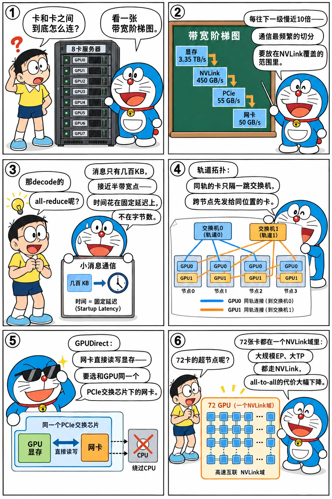

# GPU 互联与网络：NVLink、PCIe 与 RDMA 网络

<p class="lead">前面几章的张量并行、专家并行、PD 分离，最后都落到"数据从一张卡搬到另一张卡"。搬得多快，取决于走的是哪条路：同一台机器里的 NVLink、PCIe，还是机器之间的 InfiniBand / RoCE 网络。这一章把一台 8 卡服务器和一个集群里的数据通路讲清楚，用 α-β 模型解释"为什么小消息总是慢"，再看集群网络的轨道拓扑，以及让网卡直接读写显存的 GPUDirect。</p>

!!! question "自测：能答上来就可以跳过本章"
    1. 一台 8 卡 H100 服务器里，卡与卡之间、卡与网卡之间、机器之间的带宽分别是什么量级？
    2. 为什么 decode 阶段张量并行的 all-reduce 常常"带宽用不满"？
    3. 什么是轨道优化（rail-optimized）拓扑？为什么跨节点通信最好发给"同一个位置"的卡？
    4. GPUDirect RDMA 解决了什么问题？对硬件拓扑有什么要求？
    5. NVL72 这样的超节点改变了哪些并行方案的取舍？

??? success "自测参考答案（先自己答，再展开对照）"
    1. 每卡单向：卡与卡之间的 NVLink 约 450 GB/s；卡与网卡之间是 PCIe（Gen5 约 55 GB/s）；机器之间每张网卡 400 Gb/s，约 50 GB/s（一台机器通常 8 张网卡）。显存本身约 3.35 TB/s。
    2. decode 时每次 all-reduce 的消息只有几百 KB，接近甚至小于"半带宽点"（固定开销和传输时间相等的消息大小），时间主要花在固定的延迟上，而不是传输字节上。
    3. 每台机器的第 i 张卡（和它的网卡）都接到同一组交换机（第 i 条"轨道"），同轨的卡之间只隔一跳交换机，最近。跨节点通信先发给目标节点上同一位置的卡（同轨），再在节点内用 NVLink 转发，比直接跨轨快，也不会挤占上层网络。
    4. 让网卡直接读写 GPU 显存，数据不用先拷到 CPU 内存再发送（省掉拷贝和 CPU 参与）。要求网卡和 GPU 在同一个 PCIe 交换芯片下（拓扑上离得近），程序要选对和 GPU 配对的那张网卡。
    5. 72 张卡在同一个 NVLink 域里，大规模 EP、更大的 TP 都可以走 NVLink 而不是跨机网络，all-to-all 的代价大幅下降；原来因为跨机通信太贵而不得不采用的方案（比如限制 EP 规模、PD 分离的某些配置）可以重新权衡。

先看一个六格小剧场，再读正文：

{.aig-comic}

## 一台 8 卡服务器里的数据通路

以 8 卡 H100 SXM 服务器（DGX / HGX H100）为例，单方向、每张卡的带宽：

| 通路 | 带宽（每卡、单方向） | 连接什么 | 推理里谁在用 |
| --- | --- | --- | --- |
| HBM3 | 约 3.35 TB/s | GPU 与自己的显存 | 所有 kernel；decode 的瓶颈 |
| NVLink 4 + NVSwitch | 450 GB/s（双向合计 900 GB/s） | 机内 8 张卡两两全速互通 | TP 的 all-reduce、机内 EP 的 all-to-all |
| PCIe Gen5 x16 | 约 64 GB/s（实际 50～55） | GPU 与 CPU 内存、GPU 与网卡 | KV 卸载到 CPU、权重加载 |
| 网卡（ConnectX-7，400 Gb/s） | 50 GB/s | 机器之间，每张卡配一张 | 跨机 EP、PD 分离的 KV 传输、多机 TP / PP |

几个数字值得记住：NVLink 比网卡快约 9 倍，比 PCIe 快 8 倍；而 HBM 又比 NVLink 快 7 倍。所以并行方案的第一原则是"通信最频繁的切分放在 NVLink 能覆盖的范围里"——张量并行一般不跨机，跨机的 EP 要千方百计减少跨机流量（[专家并行](../distributed/expert-parallel.md)、下文的 DeepEP）。

{.aig-svg}

H100 的 NVLink 由 18 条链路组成，8 张卡通过机内的 4 颗 NVSwitch 芯片连在一起，任意两张卡之间都是满带宽，不存在"相邻卡快、远端卡慢"。PCIe 那边，每张 GPU 和它的网卡挂在同一个 PCIe 交换芯片下，这一点对后面的 GPUDirect RDMA 很关键。

## 延迟与带宽：α-β 模型

一次传输的时间可以粗略写成 $T(n) = \alpha + n / \beta$：$\alpha$ 是固定开销（发起传输、同步、网络往返），$\beta$ 是链路带宽。消息小的时候 $\alpha$ 占主导，实际带宽远低于标称值：

```python
LINKS = {                          # 单方向带宽 β（字节/秒）与一次传输的固定开销 α（秒），数量级示意
    "NVLink": (450e9, 1e-6),       # H100 经 NVSwitch
    "PCIe 5": (55e9, 2e-6),        # x16，扣掉协议开销
    "IB 400G": (50e9, 3e-6),       # 一张 ConnectX-7，跨节点
}


def fmt(n):
    return f"{n / 2**20:.0f} MiB" if n >= 2**20 else f"{n / 2**10:.0f} KiB"


print("消息大小  " + "".join(f"{k:>12}" for k in LINKS) + "   （实际达到的带宽，GB/s）")
for n in (4 << 10, 64 << 10, 1 << 20, 16 << 20, 256 << 20):
    print(f"{fmt(n):>8}  " + "".join(f"{n / (a + n / b) / 1e9:>12.1f}" for b, a in LINKS.values()))
for name, (b, a) in LINKS.items():
    print(f"{name}：半带宽点 n½ = α·β = {fmt(a * b)}")

# 推理里的两种典型消息：张量并行的一次 all-reduce（hidden=8192、bf16）
b, a = LINKS["NVLink"]
for stage, tokens in (("decode，batch 32", 32), ("prefill，8K token", 8192)):
    n = tokens * 8192 * 2
    print(f"{stage}：每次 {fmt(n)}，NVLink 上固定开销占 {a / (a + n / b):.0%}")
```

```text title="输出"
消息大小        NVLink      PCIe 5     IB 400G   （实际达到的带宽，GB/s）
   4 KiB           4.1         2.0         1.3
  64 KiB          57.2        20.5        15.2
   1 MiB         314.9        49.8        43.7
  16 MiB         438.2        54.6        49.6
 256 MiB         449.2        55.0        50.0
NVLink：半带宽点 n½ = α·β = 439 KiB
PCIe 5：半带宽点 n½ = α·β = 107 KiB
IB 400G：半带宽点 n½ = α·β = 146 KiB
decode，batch 32：每次 512 KiB，NVLink 上固定开销占 46%
prefill，8K token：每次 128 MiB，NVLink 上固定开销占 0%
```

拉一拉消息大小，看三种链路的"实际带宽 / 标称带宽"曲线：

<div class="aig-widget" data-widget="alphabeta"></div>

$\alpha$ 的取值只是数量级（真实值取决于软件栈，NCCL 一次机内 all-reduce 的延迟通常是几微秒到十几微秒），但结论不变：**消息小于半带宽点 $n_{1/2} = \alpha\beta$ 时，时间主要花在固定开销上**。prefill 的通信是带宽问题，decode 的通信是延迟问题。这解释了推理框架里很多看似奇怪的设计：

- vLLM、SGLang 都有自己的**定制 all-reduce**（custom all-reduce）：小消息时每张卡直接通过 NVLink 读其他卡的缓冲区、一步求和（one-shot），省掉 NCCL ring 算法的多步往返；下一章会算它和 ring 的分界点；
- decode 要用 **CUDA Graph** 把几十次通信和计算一起录制下来，省掉每次的 CPU 发起开销；
- 把通信和计算**融合**（比如 all-reduce + RMSNorm 融合成一个 kernel），减少一次 kernel 边界；
- 小 batch 的 decode 甚至会选择**更小的 TP**：通信次数不变，每次的固定开销却是实打实的。

## 节点之间：InfiniBand、RoCE 与轨道拓扑

机器之间用支持 **RDMA**（远程直接内存访问）的网络：网卡直接读写远端机器的内存，不经过对方的 CPU 和操作系统（编程模型见[RDMA 编程模型](rdma.md)一章）。两种主流实现：

- **InfiniBand**：专门的网络协议栈和交换机，基于信用的流控天然无损，还有自适应路由、交换机内计算（SHARP）等特性，是训练集群的首选；
- **RoCEv2**（RDMA over Converged Ethernet）：把 RDMA 跑在以太网（UDP/IP）上，设备便宜、和数据中心现有网络统一。以太网本身会丢包，而 RDMA 对丢包很敏感，所以要靠 PFC（基于优先级的暂停帧）做成"无损"，再用 ECN + DCQCN 做拥塞控制——调不好就会出现拥塞扩散、PFC 风暴等问题。

大规模 GPU 集群普遍采用**轨道优化**（rail-optimized）的拓扑：每台机器的第 $i$ 张网卡都接到第 $i$ 个叶交换机上，这组交换机叫第 $i$ 条"轨道"。于是不同机器上**位置相同**的两张卡之间只隔一个交换机；位置不同的卡要上到脊交换机再下来，跳数多、还和其他流量争抢上行链路。统计一次 32 卡 all-to-all 的流量走向：

```python
from collections import Counter

NODES, GPN = 4, 8                         # 4 个节点，每节点 8 卡，每张卡配一张网卡（第 i 张卡的网卡接第 i 个叶交换机）


def path(src, dst, pxn=False):
    (sn, sg), (dn, dg) = divmod(src, GPN), divmod(dst, GPN)
    if sn == dn:
        return "节点内 NVLink"
    if sg == dg:
        return "同轨：网卡 → 叶交换机 → 网卡"
    if pxn:
        return "PXN：先 NVLink 转给同轨的卡，再同轨发出"
    return "跨轨：还要经过脊交换机"


for pxn in (False, True):
    c = Counter(path(s, d, pxn) for s in range(NODES * GPN) for d in range(NODES * GPN) if s != d)
    print("开启 PXN" if pxn else "不开 PXN", "，all-to-all 的 992 对收发：", sep="")
    for k, v in c.items():
        print(f"  {k}：{v} 对（{v / sum(c.values()):.0%}）")
```

```text title="输出"
不开 PXN，all-to-all 的 992 对收发：
  节点内 NVLink：224 对（23%）
  同轨：网卡 → 叶交换机 → 网卡：96 对（10%）
  跨轨：还要经过脊交换机：672 对（68%）
开启 PXN，all-to-all 的 992 对收发：
  节点内 NVLink：224 对（23%）
  同轨：网卡 → 叶交换机 → 网卡：96 对（10%）
  PXN：先 NVLink 转给同轨的卡，再同轨发出：672 对（68%）
```

all-to-all 里三分之二的流量是跨轨的。NCCL 的 **PXN**（PCI × NVLink）把这部分流量先用 NVLink 转给本机上与目标同轨的那张卡，再由它的网卡发出去，跨机流量全部变成了"同轨"。DeepEP 的高吞吐模式也是同一个思路：跨机时先用 RDMA 发给目标机器上**同一位置**的卡，再在目标机器内部用 NVLink 转发给真正的目标（见 [NVSHMEM 与 DeepEP](nvshmem-deepep.md)）。

## GPUDirect：让数据不绕道 CPU

没有 GPUDirect 时，显存里的数据要发到另一台机器，得先拷到 CPU 内存，再由网卡从 CPU 内存读走；接收方反过来再拷一次。GPUDirect 是一组去掉这些中转的技术：

| 技术 | 做什么 | 推理里的用途 |
| --- | --- | --- |
| **GPUDirect P2P** | 同一台机器的 GPU 之间直接读写对方显存（NVLink 或 PCIe） | 定制 all-reduce、机内 EP |
| **GPUDirect RDMA** | 网卡通过 PCIe 直接读写显存 | 跨机 KV 传输、跨机 EP、NCCL 跨机通信 |
| **GPUDirect Storage** | NVMe 盘与显存之间直接 DMA | 从 SSD 加载权重、KV 落盘 |
| **GDRCopy** | 把显存映射给 CPU，CPU 用普通读写访问（低延迟的小数据拷贝） | 传标志位、小元数据；NVSHMEM 等库的内部实现 |

GPUDirect RDMA 对拓扑有要求：网卡和 GPU 最好挂在**同一个 PCIe 交换芯片**下，数据路径只经过这个交换芯片；如果要穿过 CPU 的根复合体（甚至跨 CPU 插槽），带宽和延迟都会明显变差。用 `nvidia-smi topo -m` 可以看到每对设备之间的连接类型（下面是示意，只保留了两张卡和两张网卡）：

```text
        GPU0    GPU1    NIC0    NIC1
GPU0     X      NV18    PIX     SYS
GPU1    NV18     X      SYS     PIX
NIC0    PIX     SYS      X      SYS
NIC1    SYS     PIX     SYS      X
```

`NV18` 表示两张卡之间有 18 条 NVLink；`PIX` 表示只经过一个 PCIe 交换芯片（最好）；`NODE` 表示要经过同一个 CPU 的根复合体；`SYS` 表示还要跨 CPU 插槽（最差）。每张卡应该用和它 `PIX` 的那张网卡——NCCL 会自动这样选，自己写 RDMA 程序（比如 KV 传输引擎）时要自己处理，这就是"拓扑感知"的含义。软件上，GPUDirect RDMA 需要网卡驱动能访问显存：旧的方式是 `nvidia-peermem` 内核模块，新的方式是 Linux 的 dma-buf。

## 超节点：把 NVLink 域做大

GB200 NVL72 把 72 张 Blackwell GPU 用 NVLink 5 连成一个域，每张卡的 NVLink 带宽是双向 1.8 TB/s，72 张卡之间任意两两全速互通。它改变了几个取舍：

- **大规模 EP 不再需要跨机网络**：DeepSeek-V3 这样 256 个专家的模型，EP=72 以内的 all-to-all 全在 NVLink 上，之前为减少跨机流量做的各种技巧（限制路由的节点数、两跳转发）变得不那么必要；
- **TP 可以更大**：以前 TP 被限制在 8 卡以内，是因为 NVLink 域只有 8 卡；
- **PD 分离的 KV 传输**可以在同一个 NVLink 域内完成。

代价是这样的系统昂贵、功耗和散热要求高，而且 72 卡之外仍然要靠 RDMA 网络。设计推理系统时，先问清楚"NVLink 域有多大"，很多并行方案的选择就随之确定了。

!!! interview "怎么讲清楚"
    讲"为什么张量并行不跨机"或"跨机 EP 的瓶颈在哪"，先报数字：NVLink 每卡单向 450 GB/s，网卡 50 GB/s，差 9 倍；再讲延迟：decode 的通信消息只有几百 KB，接近甚至小于半带宽点，固定开销占一半，所以要定制 all-reduce、CUDA Graph、通信计算融合。讲跨机通信时提到轨道拓扑和"先同轨发出、再机内转发"（PXN、DeepEP），会显得你理解集群的物理结构。

!!! info "相关章节"
    - [集合通信：NCCL 的算法与协议](nccl.md)（本书下一章）
    - [多卡系统：NVLink、拓扑、切分与功耗](cs://arch/multi-gpu/)（计算机基础：拓扑与 NUMA 的基础）
    - [多 GPU 与 NCCL](cuda://tools/multi-gpu/)（CUDA）、[集合通信原语](train://basics/collectives/)（分布式训练）

## 练习

**1. 半带宽点。** 某条链路的带宽是 200 GB/s，一次传输的固定开销是 5 µs。多大的消息才能跑到 100 GB/s？跑到 180 GB/s 呢？

??? success "参考答案"
    实际带宽 $n / (\alpha + n/\beta) = \beta / (1 + \alpha\beta / n)$。达到 $\beta/2$ 需要 $n = \alpha\beta = 5\,\mu s \times 200\,\text{GB/s} = 1\,\text{MB}$；达到 $0.9\beta$ 需要 $\alpha\beta / n = 1/9$，即 $n = 9\alpha\beta = 9$ MB。想要接近满带宽，消息要比半带宽点大一个数量级，这就是 NCCL 要把大消息切块流水、小消息却只能靠降低 $\alpha$ 的原因。

**2. 选网卡。** 一台 8 卡服务器上，GPU3 和 NIC3 之间是 `PIX`，和 NIC7 之间是 `SYS`。你的 KV 传输程序把所有卡的数据都交给 NIC0 发送，会有什么问题？

??? success "参考答案"
    一是带宽：8 张卡共享一张 50 GB/s 的网卡，总带宽只有原来的 1/8；二是路径：除 GPU0 外，其他卡的数据都要穿过 PCIe 根复合体甚至跨 CPU 插槽才能到 NIC0，GPUDirect RDMA 的性能会大幅下降，还会和其他 PCIe 流量争抢。正确做法是每张卡用和它 `PIX` 的网卡（拓扑感知），多张网卡并行发送；Mooncake Transfer Engine 等传输引擎会读取拓扑自动做这件事。

## 小结

- [x] 每卡单向带宽：HBM 约 3.35 TB/s，NVLink 450 GB/s，PCIe 约 55 GB/s，400G 网卡 50 GB/s；通信最频繁的切分放在 NVLink 域里。
- [x] α-β 模型：消息小于 $\alpha\beta$ 时固定开销占主导。decode 的通信是延迟问题，prefill 是带宽问题；定制 all-reduce、CUDA Graph、通信计算融合都在对付 $\alpha$。
- [x] 集群网络用 InfiniBand 或 RoCEv2（要靠 PFC 和拥塞控制做成无损）；轨道优化拓扑下，同位置的卡之间最近，PXN 和 DeepEP 都先同轨发出、再机内转发。
- [x] GPUDirect P2P / RDMA / Storage 让数据不绕道 CPU；网卡和 GPU 要在同一个 PCIe 交换芯片下，程序要选对网卡。
- [x] NVL72 这样的超节点把 NVLink 域扩大到 72 卡，大规模 EP 和更大的 TP 不再受跨机网络限制。
