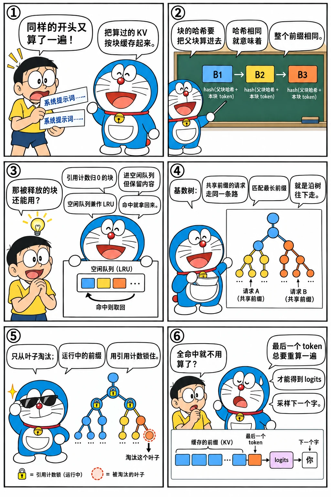

# 前缀缓存：哈希块与基数树

<p class="lead">很多请求有相同的开头：系统提示词、多轮对话的历史、few-shot 示例、Agent 反复调用时不断增长的上下文。相同位置上的相同 token，KV 完全一样，只需要算一次。这一章实现两种前缀缓存：vLLM 的"链式哈希块 + LRU 空闲队列"和 SGLang 的"基数树"，在真实模型上验证复用后的输出不变，并比较两者在不同负载下的命中率。</p>

!!! question "自测：能答上来就可以跳过本章"
    1. vLLM 的块哈希为什么要包含父块的哈希？
    2. 引用计数为 0 的块被放回空闲队列后，还能被命中吗？什么时候才真正失效？
    3. 提示词完全命中缓存时，为什么还要重算最后一个 token？
    4. 基数树的节点为什么需要"锁"？淘汰时为什么只从叶子开始？
    5. 什么是缓存感知的调度？什么是缓存感知的路由？

??? success "自测参考答案（先自己答，再展开对照）"
    1. 一个块的 KV 不只取决于这个块里的 token，还取决于它前面的所有 token（注意力看得到整个前缀）。把父块的哈希算进去，"哈希相同"就意味着"整个前缀都相同"，只比较一个哈希就能判断能不能复用。
    2. 能：引用计数为 0 的块放回空闲队列时仍保留内容和哈希，空闲队列兼作 LRU 缓存，新请求可以直接命中把它拿回来；只有它被分配给别的内容、真正被覆盖时才失效。
    3. 每一步至少要计算一个 token，才能得到最后一个位置的隐藏状态、算出 logits 采样下一个 token；所以最后一个 token 总要重新算一遍。
    4. 锁（引用计数）保护正在被运行中的请求使用的前缀，防止它们的 KV 被淘汰。只从叶子淘汰：内部节点是其他节点的前缀，先淘汰它会让子节点不可达；从叶子开始，树始终是合法的前缀结构。
    5. 缓存感知的调度：在一个实例内部，优先调度能命中缓存的请求（比如按最长前缀匹配排序）；缓存感知的路由：在多个实例之间，把请求发给最可能已经缓存了它的前缀的实例。

先看一个六格小剧场，再读正文：

{.aig-comic}

## 两种思路

| | vLLM：哈希块 | SGLang：基数树 |
| --- | --- | --- |
| 缓存单位 | 装满的 KV 块（默认 16 个 token） | token（页大小为 1 时），也支持按页 |
| 查找 | 逐块计算链式哈希，查哈希表 | 从根沿树向下匹配 |
| 缓存在哪里 | 块本身：空闲块保留内容和哈希，被重新分配时才失效 | 树的节点持有 KV 槽位，淘汰时才释放 |
| 淘汰 | 空闲队列即 LRU 队列，从队头复用 | 从最久未访问的叶子开始删 |
| 优点 | 与块分配器融为一体，实现简单；哈希可以作为全局标识，便于跨机器共享（KV 事件、卸载、PD 分离） | 天然表达树状共享关系（多分支、多轮），粒度细 |

## 哈希块：vLLM 的做法

每个装满的块有一个哈希：`hash(父块哈希, 本块的 token)`。因为包含了父块的哈希，两个块哈希相同，意味着**从序列开头到这个块为止的所有 token 都相同**，而不仅仅是这个块的 16 个 token 相同。这很关键：同样的 16 个 token 出现在不同的上下文之后，KV 是不同的（注意力看到的历史不同，位置也可能不同）。

```python title="prefix_cache.py"
"""prefix_cache.py —— vLLM 式的前缀缓存：按块做链式哈希，空闲块兼作 LRU 缓存。

- 每个"装满的"块有一个哈希 = hash(父块哈希, 本块 token)，因此哈希相同 ⇔ 从开头到这个块的所有 token 都相同；
- 引用计数降为 0 的块进入空闲队列，但内容和哈希保留，仍可被命中；
- 分配新块时从空闲队列头部取，如果取到的块带着哈希，就把它从缓存中"驱逐"——队列顺序即 LRU 顺序。
"""

from collections import OrderedDict

from paged import BlockPool


class PrefixCachingBlockPool(BlockPool):
    enable_caching = True

    def __init__(self, num_blocks: int, block_size: int):
        super().__init__(num_blocks)
        self.block_size = block_size
        self.free_queue = OrderedDict((b, None) for b in range(num_blocks))   # 头部最先被复用
        self.hash_to_block: dict[int, int] = {}
        self.block_hash: list[int | None] = [None] * num_blocks
        self.num_queries = self.num_hits = 0                                   # 以 token 计

    def allocate(self, n: int) -> list[int] | None:
        if n > len(self.free_queue):
            return None
        blocks = []
        for _ in range(n):
            b, _ = self.free_queue.popitem(last=False)
            if self.block_hash[b] is not None:                                 # 驱逐：这个块要被新内容覆盖了
                del self.hash_to_block[self.block_hash[b]]
                self.block_hash[b] = None
            self.ref_cnt[b] = 1
            blocks.append(b)
        return blocks

    def free(self, blocks: list[int]) -> None:
        # 倒序释放：序列尾部的块最不可能被别人共享，让它们排在前面、先被驱逐
        for b in reversed(blocks):
            self.ref_cnt[b] -= 1
            if self.ref_cnt[b] == 0:
                self.free_queue[b] = None

    def touch(self, blocks: list[int]) -> None:
        """命中的块被新请求引用：引用计数 +1；如果它在空闲队列里，就移出来。"""
        for b in blocks:
            if self.ref_cnt[b] == 0:
                del self.free_queue[b]
            self.ref_cnt[b] += 1

    def block_hashes(self, token_ids: list[int]) -> list[int]:
        hashes, parent = [], None
        for start in range(0, len(token_ids) - self.block_size + 1, self.block_size):
            parent = hash((parent, tuple(token_ids[start:start + self.block_size])))
            hashes.append(parent)
        return hashes

    def lookup(self, token_ids: list[int]) -> list[int]:
        """返回最长的已缓存前缀对应的块（只看装满的块）。"""
        hit = []
        for h in self.block_hashes(token_ids):
            b = self.hash_to_block.get(h)
            if b is None:
                break
            hit.append(b)
        self.num_queries += len(token_ids)
        self.num_hits += len(hit) * self.block_size
        return hit

    def cache_blocks(self, token_ids: list[int], block_ids: list[int], num_computed: int) -> None:
        """前向之后调用：把新装满的块登记进缓存。"""
        for i, h in enumerate(self.block_hashes(token_ids[:num_computed])):
            b = block_ids[i]
            if self.block_hash[b] is None and h not in self.hash_to_block:
                self.block_hash[b] = h
                self.hash_to_block[h] = b
```

这个实现最巧妙的地方在于**空闲队列兼作 LRU 缓存**。请求结束时，它的块引用计数降为 0，回到空闲队列，但内容和哈希都还在，下一个请求仍然可以命中；只有当这个块被分配给别人、要被新内容覆盖时，才把它的哈希删掉。因为分配总是从队头取，而释放的块排到队尾，所以最久没被用过的块最先被覆盖，这就是 LRU。

```pycon
>>> from prefix_cache import PrefixCachingBlockPool
>>> pool = PrefixCachingBlockPool(num_blocks=4, block_size=2)
>>> a = [1, 2, 3, 4, 5]                          # 5 个 token：两个装满的块，外加一个没装满的块
>>> blocks = pool.allocate(3)
>>> pool.cache_blocks(a, blocks, num_computed=5) # 只有装满的块进入缓存
>>> [pool.block_hash[b] is not None for b in blocks]
[True, True, False]
>>> pool.free(blocks)                            # 请求结束：块回到空闲队列，内容和哈希还在
>>> list(pool.free_queue)                        # 倒序释放：序列尾部的块排在前面，先被复用
[3, 2, 1, 0]
>>> hit = pool.lookup([1, 2, 3, 4, 9])           # 新请求的前 4 个 token 相同
>>> hit
[0, 1]
>>> pool.touch(hit)                              # 命中的块被引用，移出空闲队列
>>> list(pool.free_queue)
[3, 2]
>>> pool.free(hit)                               # 第二个请求也结束了
>>> pool.allocate(3)                             # 需要 3 个新块：块 1 被复用，它的缓存失效
[3, 2, 1]
>>> pool.lookup([1, 2, 3, 4, 9])                 # 现在只能命中第一个块
[0]
```

### 接入调度器

上一章的调度器在接收新请求时调用 `_lookup_prefix_cache`：查到命中的块后，直接把它们作为请求块表的开头，并把 `num_computed` 设为命中的 token 数，之后的调度与计算就像这些 token 已经算过一样。有一个细节：**至少留最后一个 token 不命中**。即使整个提示词都在缓存里，也必须对最后一个 token 做一次前向，才能得到下一个 token 的 logits。

在真实模型上验证：6 个请求共享一段较长的系统提示词。先单独运行第一个请求，再把其余 5 个一起运行：

```python
import time
import torch
from transformers import AutoTokenizer
from mini_llm import Transformer, generate
from nano_engine import LLMEngine, SamplingParams
from prefix_cache import PrefixCachingBlockPool

torch.set_num_threads(16)
path = "models/Qwen3-0.6B"
tok = AutoTokenizer.from_pretrained(path)
model = Transformer.from_pretrained(path)

system = "你是一个推理优化专家，回答要简洁、准确，必要时给出数字。" * 6
questions = ["什么是 KV Cache？", "用一句话解释连续批处理。", "Python 的 GIL 是什么？",
             "写一个关于月亮的比喻。", "Explain tensor parallelism in one sentence.", "1+1 等于几？请直接回答。"]
prompts = [tok(tok.apply_chat_template([{"role": "system", "content": system}, {"role": "user", "content": q}],
                                       tokenize=False, add_generation_prompt=True, enable_thinking=False)).input_ids for q in questions]
reference = [generate(model, torch.tensor([p]), 16, eos_token_id=tok.eos_token_id)[0].tolist() for p in prompts]

for caching in (False, True):
    pool = PrefixCachingBlockPool(256, 16) if caching else None
    engine = LLMEngine(model, eos_token_id=tok.eos_token_id, pool=pool)
    first = engine.generate(prompts[:1], SamplingParams(max_tokens=16))
    n_steps = len(engine.step_log)
    t0 = time.perf_counter()
    rest = engine.generate(prompts[1:], SamplingParams(max_tokens=16))
    elapsed = time.perf_counter() - t0
    computed = sum(s["num_tokens"] for s in engine.step_log[n_steps:])
    print(f"前缀缓存 {'开' if caching else '关'}：后 5 个请求共计算 {computed} 个 token，用时 {elapsed:.2f} s，"
          f"输出一致：{first + rest == reference}")
    assert first + rest == reference
print(f"提示词长度 {[len(p) for p in prompts]}，命中 {pool.num_hits} / {pool.num_queries} 个 token")
```

```text
前缀缓存 关：后 5 个请求共计算 705 个 token，用时 2.07 s，输出一致：True
前缀缓存 开：后 5 个请求共计算 225 个 token，用时 1.66 s，输出一致：True
提示词长度 [123, 126, 126, 126, 128, 132]，命中 480 / 755 个 token
```

复用之后，要计算的 token 数减少了七成，输出完全不变。这里用时只缩短了约 20%，是因为这个 CPU 实验中 decode 占了大部分时间；在 GPU 上、提示词很长时，节省的主要是 prefill 时间，TTFT 会显著下降。

## 基数树：SGLang 的做法

SGLang 用一棵基数树（radix tree，压缩前缀树）组织所有缓存过的序列。每条边上是一段 token 和它们的 KV 槽位，从根到某个节点的路径就是一个缓存过的前缀：

{.aig-svg}

一个请求一个请求地加进去，看这棵树怎么长、命中率怎么变：

<div class="aig-widget" data-widget="radixcache"></div>

```python title="radix.py"
"""radix.py —— SGLang 式的基数树前缀缓存（token 粒度）。

树的每条边保存一段 token 序列（key）和这些 token 的 KV 槽位（value）。从根到某个节点的路径拼起来，
就是一个被缓存过的前缀。匹配时沿树向下走，必要时把一条边劈成两段；淘汰时按最近访问时间从叶子开始删除，
正在被请求使用的节点通过 lock_ref 保护起来，不会被淘汰。
"""

import heapq
import itertools


class Node:
    def __init__(self, key=(), value=(), parent=None):
        self.children: dict[int, Node] = {}   # 子节点，以边上第一个 token 为键
        self.key, self.value = list(key), list(value)
        self.parent = parent
        self.lock_ref = 0
        self.last_access = 0


def _common_len(a, b) -> int:
    n = 0
    for x, y in zip(a, b):
        if x != y:
            break
        n += 1
    return n


class RadixCache:
    def __init__(self):
        self.root = Node()
        self.root.lock_ref = 1                # 根永远不被淘汰
        self._clock = itertools.count(1)
        self.evictable_size = 0               # 未被锁住、可以淘汰的 token 数
        self.protected_size = 0               # 被正在运行的请求锁住的 token 数

    def match_prefix(self, key: list[int]) -> tuple[list[int], Node]:
        """返回最长匹配前缀的 KV 槽位，以及匹配到的最后一个节点（用于加锁）。"""
        node, value = self.root, []
        now = next(self._clock)
        while key:
            child = node.children.get(key[0])
            if child is None:
                break
            n = _common_len(child.key, key)
            if n < len(child.key):
                child = self._split(child, n)   # 只匹配了半条边：把边劈开，让匹配终点落在节点上
            child.last_access = now
            value += child.value
            node, key = child, key[n:]
        return value, node

    def insert(self, key: list[int], value: list[int]) -> int:
        """插入一条序列，返回其中已经在树里的前缀长度（这部分的 value 是重复的，调用方应释放）。"""
        node, matched = self.root, 0
        now = next(self._clock)
        while key:
            child = node.children.get(key[0])
            if child is None:
                new = Node(key, value, node)
                new.last_access = now
                node.children[key[0]] = new
                self.evictable_size += len(key)
                return matched
            n = _common_len(child.key, key)
            if n < len(child.key):
                child = self._split(child, n)
            child.last_access = now
            matched += n
            node, key, value = child, key[n:], value[n:]
        return matched

    def _split(self, child: Node, n: int) -> Node:
        """把 child 的边从第 n 个 token 处劈开，返回新的中间节点。"""
        mid = Node(child.key[:n], child.value[:n], child.parent)
        mid.lock_ref, mid.last_access = child.lock_ref, child.last_access
        child.parent.children[mid.key[0]] = mid
        child.key, child.value, child.parent = child.key[n:], child.value[n:], mid
        mid.children[child.key[0]] = child
        return mid

    def inc_lock_ref(self, node: Node) -> None:
        while node is not self.root:
            if node.lock_ref == 0:
                self.evictable_size -= len(node.key)
                self.protected_size += len(node.key)
            node.lock_ref += 1
            node = node.parent

    def dec_lock_ref(self, node: Node) -> None:
        while node is not self.root:
            node.lock_ref -= 1
            if node.lock_ref == 0:
                self.evictable_size += len(node.key)
                self.protected_size -= len(node.key)
            node = node.parent

    def evict(self, num_tokens: int) -> list[int]:
        """按 LRU 从叶子开始淘汰至少 num_tokens 个 token，返回释放出来的 KV 槽位。"""
        leaves = [(n.last_access, id(n), n) for n in self._nodes() if not n.children and n.lock_ref == 0]
        heapq.heapify(leaves)
        freed = []
        while leaves and len(freed) < num_tokens:
            _, _, node = heapq.heappop(leaves)
            freed += node.value
            parent = node.parent
            del parent.children[node.key[0]]
            self.evictable_size -= len(node.key)
            if parent is not self.root and not parent.children and parent.lock_ref == 0:
                heapq.heappush(leaves, (parent.last_access, id(parent), parent))
        return freed

    def _nodes(self):
        stack = [self.root]
        while stack:
            n = stack.pop()
            if n is not self.root:
                yield n
            stack.extend(n.children.values())

    def total_size(self) -> int:
        return sum(len(n.key) for n in self._nodes())
```

几个关键操作：

- **匹配**时，如果新请求只和某条边的前半段相同，就把这条边劈成两段（`_split`），让匹配的终点正好落在一个节点上。
- **加锁**：请求开始使用某个前缀时，从匹配到的节点一直到根，都把 `lock_ref` 加 1。被锁住的节点不会被淘汰，否则正在计算的请求的 KV 会被别人覆盖。
- **淘汰**只从叶子开始：内部节点是别人的前缀，删掉它会让子孙无法再被匹配到。叶子删掉之后，如果父节点变成了没有被锁住的叶子，它也成为候选。

```pycon
>>> from radix import RadixCache
>>> tree = RadixCache()
>>> tree.insert([1, 2, 3, 4, 5], [10, 11, 12, 13, 14])   # value 是这些 token 的 KV 槽位
0
>>> tree.insert([1, 2, 3, 9, 9], [10, 11, 12, 20, 21])   # 前 3 个 token 已在树中，边被劈开
3
>>> value, node = tree.match_prefix([1, 2, 3, 4, 7])
>>> value, node.key
([10, 11, 12, 13], [4])
>>> tree.inc_lock_ref(node)                               # 正在使用 [1, 2, 3, 4]，锁住
>>> tree.evictable_size, tree.protected_size
(3, 4)
>>> tree.evict(10)                                        # 想腾出 10 个 token：只有未锁住的叶子能删
[14, 20, 21]
>>> tree.dec_lock_ref(node)                               # 请求结束，解锁
>>> sorted(tree.evict(10)), tree.total_size()
([10, 11, 12, 13], 0)
```

## 命中率比较

两种方法的命中率差多少？在四种典型负载上模拟（不需要模型，只比较能复用的 token 数）：

```python
import random
from radix import RadixCache

random.seed(0)

def rand_tokens(n):
    return [random.randrange(1000, 50000) for _ in range(n)]

def block_hashes(tokens, block_size):
    hashes, parent = [], None
    for start in range(0, len(tokens) - block_size + 1, block_size):
        parent = hash((parent, tuple(tokens[start:start + block_size])))
        hashes.append(parent)
    return hashes

def hit_rate(workload, method):
    hits = total = 0
    if method == "radix":
        tree = RadixCache()
        for req in workload:
            hits += len(tree.match_prefix(req[:-1])[0])
            total += len(req)
            tree.insert(req, list(range(len(req))))
        return hits / total
    cached = set()
    for req in workload:
        n = 0
        for h in block_hashes(req[:-1], method):
            if h not in cached:
                break
            n += 1
        hits += n * method
        total += len(req)
        cached.update(block_hashes(req, method))
    return hits / total

system = rand_tokens(1000)
shared_system = [system + rand_tokens(random.randint(20, 200)) for _ in range(100)]
multi_turn = []
for _ in range(20):                                           # 20 个对话，每个 8 轮
    history = rand_tokens(300)
    for _ in range(8):
        history = history + rand_tokens(random.randint(10, 60))   # 用户的新消息
        multi_turn.append(list(history))
        history = history + rand_tokens(random.randint(50, 300))  # 模型的回答
examples, header = [rand_tokens(random.randint(100, 200)) for _ in range(5)], rand_tokens(37)
few_shot = [header + sum(examples[:random.randint(2, 5)], []) + rand_tokens(random.randint(20, 80)) for _ in range(100)]
parallel = []
for _ in range(30):                                           # 30 个问题，每个采样 8 次
    problem = rand_tokens(random.randint(80, 400))
    parallel += [problem + rand_tokens(1) for _ in range(8)]

print(f"{'负载':16s}{'基数树':>8s}{'块 16':>8s}{'块 64':>8s}")
for name, w in [("共享系统提示词", shared_system), ("多轮对话", multi_turn),
                ("few-shot 示例数不同", few_shot), ("同一问题并行采样", parallel)]:
    print(f"{name:16s}" + "".join(f"{hit_rate(w, m):8.1%}" for m in ("radix", 16, 64)))
```

```text title="输出"
负载                   基数树    块 16    块 64
共享系统提示词            89.5%   88.8%   86.0%
多轮对话               79.2%   78.6%   76.8%
few-shot 示例数不同     89.6%   87.8%   81.1%
同一问题并行采样           87.1%   84.2%   73.3%
```

token 粒度的基数树总是命中最多，但与 16 个 token 的块相比，差距只有一到三个百分点：块方法损失的只是每个共享前缀末尾不满一块的部分。块越大，损失越明显。所以两者的真正区别不在命中率，而在工程上：vLLM 的方案与块分配器、KV 事件、跨机器的 KV 共享天然契合；SGLang 的树结构便于表达复杂的共享关系，并支撑它的缓存感知调度。

## 缓存感知的调度与路由

有了前缀缓存，请求的**处理顺序**和**发往哪个实例**都会影响命中率：

- **缓存感知调度**（单个实例内）：SGLang 的默认策略是 LPM（longest prefix match），优先调度与缓存匹配最长的请求，让共享同一前缀的请求挨在一起执行，避免前缀在被复用之前就被淘汰。代价是可能让匹配短的请求等得更久，所以请求很多时会退回 FCFS。
- **缓存感知路由**（多个实例之间）：同一前缀的请求最好发到同一个实例，否则每个实例都要各算一遍、各存一份。SGLang Model Gateway（原 sgl-router）在路由器里维护一棵近似的基数树，估计每个实例缓存了什么；vLLM 则通过 **KV 事件**（块被缓存、块被淘汰）把各实例的缓存状态发布出去，供外部路由器（如 llm-d、vLLM production stack）使用。路由还要兼顾负载均衡：所有请求都去命中率最高的实例，它就会过载。

!!! source "源码对照"
    - **vLLM**：`KVCacheManager.get_computed_blocks`（`vllm/v1/core/kv_cache_manager.py`）查找最长命中，注释里写明了"最多命中 `num_tokens - 1` 个 token，因为需要重算最后一个 token 来得到 logits"。块哈希在 `kv_cache_utils.py` 的 `hash_block_tokens` 中计算：`hash((父块哈希, 本块 token, extra_keys))`。其中 `extra_keys` 包含多模态输入的哈希、LoRA ID，以及用于多租户隔离的 `cache_salt`，否则内容不同的请求可能错误地共享 KV。哈希算法可以通过 `--prefix-caching-hash-algo` 选择 `sha256`（默认）或 `xxhash` 等。
    - 缓存与淘汰在 `BlockPool`（`block_pool.py`）中：`cache_full_blocks` 登记，`touch` 引用，`free_blocks` 把没有哈希的块放到队头（LIFO，利于 GPU 局部性）、有哈希的块放到队尾（LRU），`_maybe_evict_cached_block` 在复用时驱逐。块被缓存或淘汰时会产生 KV 事件（`kv_event_queue`）。
    - **SGLang**：`RadixCache`（`srt/mem_cache/radix_cache.py`）提供 `match_prefix`、`insert`、`evict`、`inc_lock_ref`、`dec_lock_ref`，请求结束和分块时分别调用 `cache_finished_req`、`cache_unfinished_req` 把 KV 插入树中。调度策略在 `srt/managers/schedule_policy.py`：`CacheAwarePolicy`（LPM、DFS_WEIGHT）和 `CacheAgnosticPolicy`（FCFS、LOF 等）。`mem_cache/` 下还有面向滑动窗口、Mamba 等混合模型的变体，以及正在统一它们的 `unified_cache/`。

!!! interview "面试怎么答"
    "vLLM 和 SGLang 的前缀缓存有什么区别？"可以从三个层次回答：**数据结构**（链式哈希块 vs 基数树）、**粒度**（块 vs token）、**淘汰**（空闲队列即 LRU vs 叶子 LRU 加引用锁），最后落到**效果**：命中率相近（本章的模拟相差一到三个百分点），差别主要在工程取舍和配套的调度策略上。能说出"块哈希包含父块哈希"和"至少重算最后一个 token"这两个细节，会是加分项。

## 练习

**1. 多租户隔离。** 两个租户用了完全相同的系统提示词。共享 KV 有什么风险？怎样在不牺牲同一租户内部复用的前提下隔离？

??? success "参考答案"
    风险是时间侧信道：攻击者可以通过测量 TTFT，判断某段内容是否已经在缓存里（命中时 TTFT 明显更短），从而推断其他租户发送过什么。解决办法是在第一个块的哈希里加入租户专属的"盐"，也就是 vLLM 的 `cache_salt`：同一租户的请求哈希一致、可以复用，不同租户的哈希不同、互不命中。

**2. 预热与固定。** 某个服务的所有请求都以一段 8K token 的系统提示词开头，但偶尔会因为缓存压力被淘汰，导致一批请求的 TTFT 突然变长。有什么办法？

??? success "参考思路"
    - 提高这段前缀的"价值"：LRU 按访问时间淘汰，它本来就很热，被淘汰说明缓存容量不够，先检查 KV 显存配置和并发；
    - 分层缓存：把被淘汰的块卸载到 CPU 内存或 SSD，需要时再加载，比重算快（见 [KV 分层缓存](../distributed/kv-offload.md)）；
    - 如果引擎支持，把它"钉"在缓存里（引用计数额外加 1，永不释放）；
    - 服务启动时发一个预热请求，让它先进入缓存。

## 小结

- [x] 前缀缓存复用相同前缀的 KV；vLLM 用链式哈希块，SGLang 用基数树。
- [x] 块哈希包含父块哈希，保证"哈希相同即整个前缀相同"；空闲队列兼作 LRU 缓存，块被复用时才失效。
- [x] 至少重算最后一个 token 才能得到 logits；基数树用引用锁保护正在使用的前缀，只从叶子淘汰。
- [x] 两者命中率相近，块越大损失越多；缓存感知的调度与路由能进一步提高命中率。
