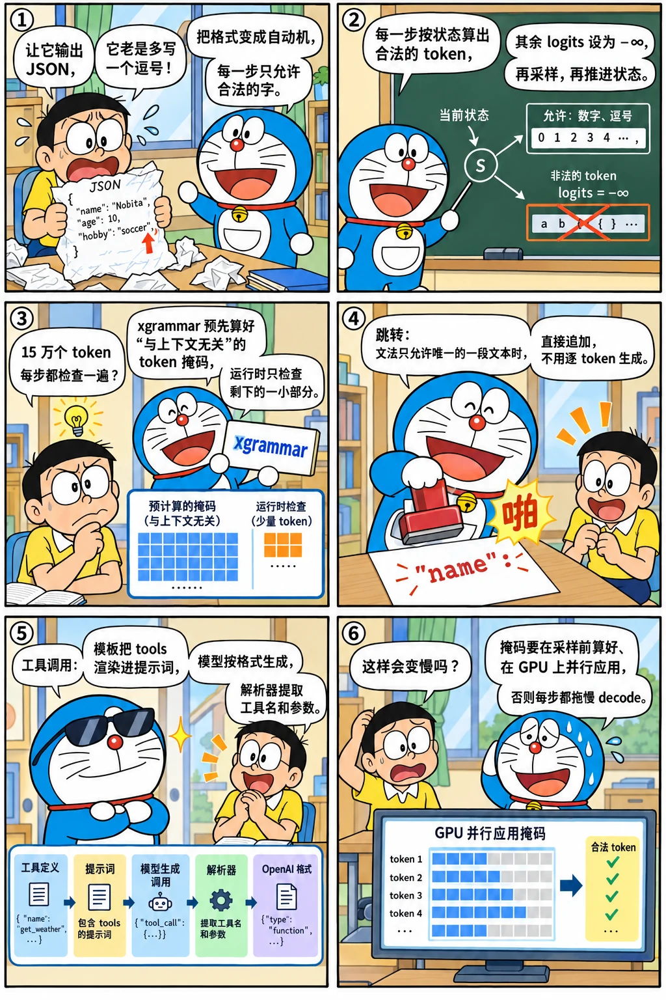

# 结构化输出与工具调用

<p class="lead">Agent 和工具调用要求模型输出严格符合格式的 JSON，多一个字符、少一个引号，下游就会解析失败。靠提示词"请输出 JSON"并不可靠，推理引擎的做法是**约束解码**：每一步只允许那些能让输出继续符合语法的 token。这一章实现一个最小的约束解码器（模板匹配器 + 词表前缀树），在真实模型上对比约束前后的输出，再讨论它在推理引擎中的性能问题与实现，以及工具调用的完整链路。</p>

!!! question "自测：能答上来就可以跳过本章"
    1. 约束解码每一步做了什么？为什么不改变模型、只改采样？
    2. 词表有 15 万个 token，每一步都逐个检查会有什么问题？xgrammar 是怎样加速的？
    3. 什么是 jump-forward？它有什么隐患？
    4. 一次工具调用请求，从 `tools` 参数到返回 `tool_calls`，经过了哪些步骤？

??? success "自测参考答案（先自己答，再展开对照）"
    1. 把文法（JSON Schema、正则、EBNF）编译成自动机；每一步根据自动机的当前状态算出哪些 token 合法，把不合法的 token 的 logits 设为负无穷，再采样，然后用选中的 token 推进自动机。只改采样，模型不变，输出保证符合文法。
    2. 逐个检查 15 万个 token 太慢，每一步都要做，会让 decode 严重变慢。xgrammar 预先计算"与上下文无关"的 token（它们是否合法只取决于自动机的状态）的掩码，运行时只需检查少数与上下文相关的 token，而且把掩码的计算和 GPU 的前向重叠。
    3. 当文法在某个位置只允许唯一确定的一段文本时（比如 JSON 的键名、固定的标点），直接把这段文本追加上去，不用逐个 token 生成，省下很多步。隐患：追加的文本的分词方式可能和模型自己生成时不同，得到模型没见过的 token 序列，影响后续的输出质量。
    4. 对话模板把 `tools` 的定义渲染进提示词 → 模型按约定的格式生成工具调用（可以用 JSON Schema 约束参数）→ 工具解析器从生成的文本里提取出工具名和参数 → 按 OpenAI 的格式返回 `tool_calls`（流式时还要增量解析）。

先看一个六格小剧场，再读正文：

{.aig-comic}

## 原理

把目标格式表示成一个自动机（正则表达式对应有限自动机，JSON Schema 或任意上下文无关文法对应下推自动机）。解码时维护自动机的当前状态，每一步：

1. 计算**允许的 token 集合**：一个 token 被允许，当且仅当它解码出的每个字符都能被自动机依次接受；
2. 把不允许的 token 的 logits 设为 −∞（一个词表大小的位掩码），再正常采样；
3. 用选中 token 的字符推进自动机的状态。

模型本身完全不变，只是在采样前加了一个掩码。因为只屏蔽不合法的 token，合法 token 之间的相对概率不变，模型在格式允许的范围内仍然按自己的偏好选择。

{.aig-svg}

## 实现

一个"JSON 模板"匹配器（字面量 + 字符串、整数、枚举三种字段），以及一棵由整个词表构成的字符前缀树。计算允许集合时，**沿前缀树与匹配器同步向下走**：一旦某个字符不被接受，整棵子树都不用再看，这比逐个检查 15 万个 token 快得多。

```python title="constrained.py"
"""constrained.py —— 语法约束解码的最小实现：一个"JSON 模板"匹配器 + 词表前缀树，每步算出允许的 token 集合。

模板由字面量和带类型的字段组成，例如：
    ['{"city": "', STR, '", "temp_c": ', INT, ', "weather": "', ENUM("晴", "多云", "雨"), '"}']
匹配器的状态是 (第几段, 这一段已经读了什么)。一个 token 允许出现，当且仅当它的每个字符都能被匹配器接受。
"""

from dataclasses import dataclass


@dataclass(frozen=True)
class Field:
    kind: str                      # "str" | "int" | "enum"
    options: tuple = ()
    max_len: int = 16


STR, INT = Field("str"), Field("int", max_len=3)


def ENUM(*options):
    return Field("enum", tuple(options))


class TemplateMatcher:
    def __init__(self, template):
        self.template = template

    def step(self, state, ch):
        """在状态 state 下读入字符 ch，返回新状态；不合法返回 None。"""
        seg, buf = state
        while seg < len(self.template):
            part = self.template[seg]
            if isinstance(part, str):                                  # 字面量：必须逐字符一致
                if part[len(buf)] == ch:
                    buf += ch
                    return (seg + 1, "") if len(buf) == len(part) else (seg, buf)
                return None
            if part.kind == "str" and ch not in '"\\\n' and len(buf) < part.max_len:
                return seg, buf + ch
            if part.kind == "int" and ch.isdigit() and len(buf) < part.max_len and not (buf == "0"):
                return seg, buf + ch
            if part.kind == "enum" and any(o.startswith(buf + ch) for o in part.options):
                return seg, buf + ch
            if self._field_complete(part, buf):                        # 字段可以在这里结束：交给下一段
                seg, buf = seg + 1, ""
                continue
            return None
        return None

    @staticmethod
    def _field_complete(field, buf):
        if field.kind == "enum":
            return buf in field.options
        return len(buf) > 0

    def is_final(self, state):
        seg, buf = state
        return seg == len(self.template)

    def forced_text(self, state):
        """当前状态下，接下来"唯一可能"的字面量（可以直接写出，不必让模型生成）。"""
        seg, buf = state
        if seg < len(self.template) and isinstance(self.template[seg], str):
            return self.template[seg][len(buf):]
        return ""


class VocabTrie:
    """把词表中每个 token 解码后的字符串插入一棵字符前缀树，节点上记录"在这里结束的 token"。"""

    def __init__(self, tokenizer, special_ids=()):
        self.root = {}
        for tid in range(len(tokenizer)):
            if tid in special_ids:
                continue
            s = tokenizer.decode([tid])
            if not s or "�" in s:                                 # 不完整的 UTF-8 片段：本实现不允许
                continue
            node = self.root
            for ch in s:
                node = node.setdefault(ch, {})
            node.setdefault(None, []).append(tid)

    def allowed(self, matcher: TemplateMatcher, state):
        """与匹配器同步遍历前缀树：只沿合法的字符往下走，返回 (允许的 token 列表, 访问的节点数)。"""
        result, visited, stack = [], 0, [(self.root, state)]
        while stack:
            node, st = stack.pop()
            visited += 1
            for ch, child in node.items():
                if ch is None:
                    result.extend(child)
                    continue
                nxt = matcher.step(st, ch)
                if nxt is not None:
                    stack.append((child, nxt))
        return result, visited


def advance(matcher, state, text):
    for ch in text:
        state = matcher.step(state, ch)
    return state
```

要求模型用 JSON 描述天气，先看不加约束的输出，再看加约束的：

```python
import json
import time
import torch
from transformers import AutoTokenizer
from mini_llm import KVCache, Transformer, generate
from constrained import ENUM, INT, STR, TemplateMatcher, VocabTrie, advance

torch.set_num_threads(16)
path = "models/Qwen3-0.6B"
tok = AutoTokenizer.from_pretrained(path)
model = Transformer.from_pretrained(path)
trie = VocabTrie(tok, special_ids=set(tok.all_special_ids))
matcher = TemplateMatcher(['{"city": "', STR, '", "temp_c": ', INT, ', "weather": "', ENUM("晴", "多云", "雨"), '"}'])

messages = [{"role": "user", "content": "用 JSON 描述今天北京的天气，包含城市、摄氏温度和天气。"}]
prompt = tok(tok.apply_chat_template(messages, tokenize=False, add_generation_prompt=True, enable_thinking=False)).input_ids
free = generate(model, torch.tensor([prompt]), 60, eos_token_id=tok.eos_token_id)[0].tolist()
print("不加约束：", repr(tok.decode(free, skip_special_tokens=True)))

cache, state, output, log = KVCache(model.cfg.num_hidden_layers), (0, ""), [], []
with torch.no_grad():
    logits = model(torch.tensor([prompt]), cache)[0, -1]
    while not matcher.is_final(state):
        t0 = time.perf_counter()
        allowed, visited = trie.allowed(matcher, state)
        mask_ms = (time.perf_counter() - t0) * 1e3
        forced = matcher.forced_text(state)
        bias = torch.full_like(logits, float("-inf"))
        bias[allowed] = 0.0
        token = (logits + bias).argmax().item()               # 在允许的 token 中贪心
        log.append((len(allowed), visited, mask_ms, bool(forced)))
        output.append(token)
        state = advance(matcher, state, tok.decode([token]))
        logits = model(torch.tensor([[token]]), cache)[0, -1]
text = tok.decode(output)
print("加约束：  ", text, "→ 解析结果", json.loads(text))
print(f"共 {len(output)} 步；允许的 token 数：{[n for n, *_ in log]}")
in_field = [(v, ms) for n, v, ms, forced in log if not forced]
print(f"字段内的步：平均访问前缀树 {sum(v for v, _ in in_field) / len(in_field):.0f} 个节点，"
      f"平均耗时 {sum(ms for _, ms in in_field) / len(in_field):.0f} ms；"
      f"{sum(forced for *_, forced in log)} 步处在字面量中（输出其实是确定的）")
```

```text
不加约束： '```json\n{\n  "city": "北京",\n  "temperature": 25,\n  "weather": "晴"\n}\n```'
加约束：   {"city": "北京", "temp_c": 22, "weather": "晴"} → 解析结果 {'city': '北京', 'temp_c': 22, 'weather': '晴'}
共 20 步；允许的 token 数：[2, 4, 2, 110, 146283, 145716, 2, 4, 2, 2, 1, 28, 29, 27, 2, 3, 2, 2, 3, 2]
字段内的步：平均访问前缀树 76867 个节点，平均耗时 77 ms；13 步处在字面量中（输出其实是确定的）
```

不加约束时，模型输出了 Markdown 代码块，还改了字段名（写成了 `temperature`，要求的是 `temp_c`），下游程序直接出错；加约束后，输出严格符合模板，可以直接解析。

## 性能问题与优化

上面的统计暴露了约束解码的两个性能问题：

1. **计算掩码很贵**：处在字符串字段里时，几乎所有 token 都合法（14 万多个），前缀树的二十多万个节点都要走一遍；字段内各步平均要七八十毫秒，和这个小模型在 CPU 上的一次前向差不多。即使用 C++ 实现，对 15 万个 token 的词表逐步计算也会拖慢每一步。
2. **很多步其实是确定的**：处在字面量中时（`", "temp_c": ` 这样的键名与标点），只有唯一的输出，却仍然要一个 token 一个 token 地跑前向。

对应的优化：

- **预计算与缓存**（xgrammar 的核心思想）：大多数 token 是否合法只取决于自动机的"局部状态"，与下推栈的内容无关（上下文无关 token），可以对每个状态预先算好并缓存；只有少数与栈有关的 token（例如可能闭合括号的 token）才在运行时检查。这让每步的掩码计算降到微秒级。
- **与 GPU 计算重叠**：掩码只依赖已经生成的 token，可以在 GPU 做前向的同时在 CPU 上计算。vLLM 的 EngineCore 在调用 `execute_model` 之后、等待结果之前计算语法掩码（`get_grammar_bitmask`），再交给采样；SGLang 的重叠调度也为此做了专门处理。
- **jump-forward**：当接下来的文本是确定的（字面量），直接把它追加到输出中，一次前向处理多个 token，而不是逐个生成。SGLang 最早实现了这一优化。它的隐患在于**分词不一致**：直接追加的字符串按分词器切分出的 token，可能与模型"自己一步步生成时"会选的 token 不同，而模型没有见过这种切分方式，后续质量可能受影响。实现时通常会回退几个字符重新分词，让拼接处的切分与正常分词一致。

## 工具调用的完整链路

OpenAI 接口的工具调用（`tools` 参数）在推理引擎中是这样实现的：

1. **渲染**：把 `tools` 的 JSON Schema 通过模型的对话模板写进提示词（每个模型家族的格式不同，Qwen 使用 Hermes 风格，把函数签名放在系统提示中）；
2. **生成**：模型按训练时学到的格式输出调用，例如 Qwen 输出 `<tool_call>{"name": ..., "arguments": {...}}</tool_call>`；
3. **解析**：引擎的**工具解析器**从输出文本中提取调用，转换成 OpenAI 格式的 `tool_calls` 字段（流式时要增量解析）；推理模型还需要**推理解析器**把思考内容（如 `<think>...</think>`）分离到 `reasoning_content`；
4. **约束（可选）**：当 `tool_choice` 指定了必须调用某个函数、或者要求必须调用工具时，可以用函数参数的 JSON Schema 做约束解码，保证参数一定合法；否则只依赖模型自己的格式能力。

所以工具调用的可靠性取决于三件事：模型本身的能力、对话模板是否正确、解析器是否与模型的输出格式匹配。上线新模型时，这三者都要验证。

!!! source "源码对照"
    - **vLLM**：`vllm/v1/structured_output/`，`StructuredOutputManager` 管理各请求的语法状态，后端有 `backend_xgrammar.py`（默认）、`backend_guidance.py`（llguidance）、`backend_outlines.py`、`backend_lm_format_enforcer.py`；EngineCore 中的 `get_grammar_bitmask` 与投机解码配合时，草稿 token 也要通过语法校验。工具解析器在 `vllm/tool_parsers/`（`--enable-auto-tool-choice --tool-call-parser hermes`），推理解析器在 `vllm/reasoning/`（`--reasoning-parser`）。
    - **SGLang**：`srt/constrained/` 下有 xgrammar、outlines、llguidance 等语法后端（`--grammar-backend`）；工具调用解析在 `srt/function_call/`（`--tool-call-parser`），推理解析器通过 `--reasoning-parser` 指定。

!!! interview "怎么讲清楚"
    "结构化输出是怎么实现的？"：**原理**（文法 → 自动机，每步计算允许的 token 掩码，屏蔽后采样，不改变合法 token 的相对概率）→ **难点**（大词表下掩码计算的开销、上下文无关文法需要下推自动机）→ **优化**（xgrammar 的上下文无关 token 预计算与缓存、与 GPU 前向重叠、jump-forward 及其分词一致性问题）→ **与其他特性的交互**（投机解码的草稿也要通过校验、重叠调度下的状态同步）。能说出"约束只屏蔽、不重新加权"以及它对输出分布的含义，是加分项。

## 练习

**1. 约束会改变质量吗？** 约束解码保证了格式，但会不会让内容变差？举一个例子。

??? success "参考答案"
    会。约束让模型只能在合法 token 中选择，但模型的"最优路径"可能本来就不在合法范围内。例如模型本想输出 `"temperature": "25℃"`，被约束成整数字段后只能输出数字，但它此前的"计划"是写带单位的字符串，被迫改变之后，后面的内容可能不连贯。更极端的例子：字段顺序与模型习惯的顺序不同、或者 Schema 要求模型不熟悉的格式时，质量会明显下降。缓解办法是在提示词中给出格式说明和示例，让模型"本来就想"输出这个格式，约束只起兜底作用。

**2. 为什么本章的实现不允许解码为 "�" 的 token？** 真实系统需要怎样处理？

??? success "参考答案"
    这些 token 只是一个多字节 UTF-8 字符的一部分（例如某些生僻汉字、emoji 被拆成两个字节 token），单独解码得不到完整的字符，无法用"字符级"的自动机判断是否合法。本章为了简单直接禁止了它们，这意味着那些字符无法出现在输出中。真实系统（xgrammar 等）在**字节级**上运行自动机：把每个 token 看成一串字节，自动机在字节上推进，这样既能处理被拆开的多字节字符，也与字节级 BPE 的词表天然对应。

## 小结

- [x] 约束解码：文法 → 自动机，每步计算允许的 token，屏蔽其余 token 后采样，再用选中的 token 推进自动机。
- [x] 用词表前缀树与自动机同步遍历，可以只访问合法前缀；但字段内几乎所有 token 都合法，逐步计算仍然很贵。
- [x] xgrammar 预计算上下文无关 token 的掩码，引擎把掩码计算与 GPU 前向重叠；jump-forward 跳过确定的文本，要注意分词一致性。
- [x] 工具调用 = 对话模板渲染 + 模型按格式生成 + 工具解析器提取，必要时用 Schema 约束参数。
