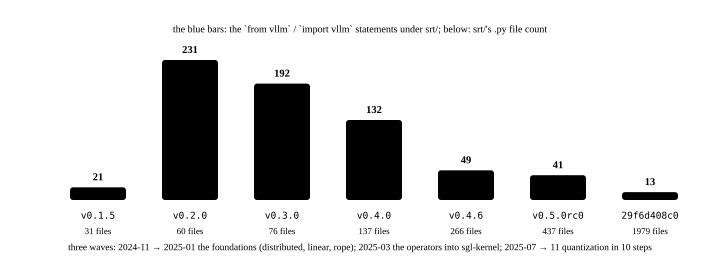

# Borrowing from vLLM: why the model layer was reused first and removed later

<p class="lead">The first version's Llama model file opens with a long run of <code>from vllm... import</code>: the parallel linear layers, RMSNorm, RoPE, the vocabulary parallelism, the weight loaders and the process groups, all off the shelf. That let SGLang put all of its effort into scheduling and caching, and it also had SGLang tripping over vLLM's version changes for the next year. From November 2024 a removal of the vLLM dependency, running to January 2026 across 26 commits, turned those modules into its own one by one. This chapter tells that curve in numbers: how much was imported, when it peaked, how it was taken back and what is left today.</p>

!!! question "Self-test: if you can answer these, skip the chapter"
    1. What kinds of thing did the first version borrow from vLLM? What did it write itself?
    2. What concrete trouble does depending on a fast-moving inference framework bring? What evidence of it is in the commit history?
    3. How was the dependency removed — by rewriting or by copying? What do the headers of `srt/distributed/` and `srt/layers/linear.py` tell you?
    4. Does SGLang still import vLLM today? Under what circumstances?

??? success "Answers for the self-test (answer first, then open this)"
    1. Borrowed: the layers inside the models (`QKVParallelLinear`, `RowParallelLinear`, `RMSNorm`, `SiluAndMul`, `get_rope`, `VocabParallelEmbedding`), the quantization configuration (AWQ), the weight loading (`hf_model_weights_iterator`) and the tensor-parallel process group's initialisation. Written itself: the scheduling, the radix tree, the memory pool, the attention kernels (Triton), the sampling and the service processes.
    2. Version pinning: vLLM's version in `pyproject.toml` went from `>=0.2.5` to `==0.5.3.post1`, `==0.5.5`…, with a "compat" commit for every vLLM upgrade (#380 of 2024-05, #598 of 07, #1276 of 09 fixing an fp8 bug vLLM 0.5.5 introduced); vLLM's wheel also pins a particular torch version at install time; and a new model waits for vLLM's layers to support it.
    3. Mostly copied and then modified: `srt/distributed/`'s header reads "Adapted from vllm v0.6.4.post1 … parallel_state.py", and `layers/linear.py`'s likewise; the quantization modules were decoupled in 10 steps starting 2025-07. At the baseline commit, 129 files carry "Adapted from vLLM" or a vLLM copyright header.
    4. There are 12 places left, nearly all conditional imports: on non-CUDA platforms (ROCm, XPU) it falls back to `vllm._custom_ops` kernels (AWQ dequantization, RoPE, RMSNorm), plus a few comments. `pyproject.toml` has not declared a vLLM dependency since v0.5.

A six-panel strip first, then the chapter:

<!-- comic ../assets/comics/borrow-vllm.webp is in Chinese; put it back once the English version exists -->

## A curve that rises and then falls {#一条先升后降的曲线}

Count the files and statements under `srt/` that import vLLM in each version:

```bash title="vllm-imports.sh"
REF=${REF:-29f6d408c0}
printf '%-11s %6s %6s %8s\n' 版本 文件数 语句数 srt文件数
for t in v0.1.5 v0.2.0 v0.3.0 v0.4.0 v0.4.6 v0.5.0rc0 "$REF"; do
  files=$(git grep -l 'from vllm\|import vllm' "$t" -- python/sglang/srt | wc -l)
  lines=$(git grep -h 'from vllm\|import vllm' "$t" -- python/sglang/srt | wc -l)
  total=$(git ls-tree -r --name-only "$t" -- python/sglang/srt | grep -c '\.py$')
  printf '%-11s %6d %6d %8d\n' "$t" "$files" "$lines" "$total"
done
```

```text title="output"
版本      文件数 语句数 srt文件数
v0.1.5           6     21       31
v0.2.0          32    231       60
v0.3.0          34    192       76
v0.4.0          48    132      137
v0.4.6          19     49      266
v0.5.0rc0       21     41      437
29f6d408c0      12     13     1979
```

{.aig-svg}

v0.2.0 is the peak: 32 files and 231 imports — that is when `models/` grew from 3 files to 22, each of them borrowing layers wholesale just like the first version's `llama2.py`:

```python title="python/sglang/srt/models/llama2.py @ v0.2.0 L10-20" linenums="10"
from vllm.config import CacheConfig
from vllm.distributed import get_tensor_model_parallel_world_size
from vllm.model_executor.layers.activation import SiluAndMul
from vllm.model_executor.layers.layernorm import RMSNorm
from vllm.model_executor.layers.quantization.base_config import QuantizationConfig
from vllm.model_executor.layers.rotary_embedding import get_rope
from vllm.model_executor.layers.vocab_parallel_embedding import (
    ParallelLMHead,
    VocabParallelEmbedding,
)
from vllm.model_executor.model_loader.weight_utils import default_weight_loader
```

From then on the statement count falls steadily while `srt/`'s file count climbs from 60 to nearly 2000. At the baseline commit only 13 are left, in 12 files, all conditional imports and comments.

## Why borrow {#为什么借}

SGLang in January 2024 was a paper's implementation, with its effort concentrated on three innovations. vLLM already had mature tensor-parallel layers, a dozen or so models, quantization and weight loading, and the same PyTorch-plus-custom-kernel stack. The first README's acknowledgement says outright that it "learned from the design of Guidance, vLLM and LightLLM and reused some of their code". What was borrowed has one thing in common: **it has nothing to do with scheduling and everything to do with GPU operators**. What SGLang really wrote itself is the `RadixAttention` layer and the three Triton kernels under it — attention is the only operator that has to know which slot of the pool holds the KV, and no other layer does.

## What borrowing cost {#借的代价}

The version constraints in `pyproject.toml` record the cost:

```bash title="vllm-pins.sh"
REF=${REF:-29f6d408c0}
for t in v0.1.5 v0.2.0 v0.3.0 v0.4.0 v0.4.6 v0.5.0rc0 "$REF"; do
  printf '%-11s %s\n' "$t" "$(git show "$t:python/pyproject.toml" | grep -o '"vllm[^"]*"' | tr '\n' ' ')"
done
```

```text title="output"
v0.1.5      "vllm>=0.2.5" 
v0.2.0      "vllm==0.5.3.post1" 
v0.3.0      "vllm==0.5.5" 
v0.4.0      "vllm>=0.6.3.post1" "vllm==0.6.3.dev13" 
v0.4.6      "vllm==0.6.7.dev2" 
v0.5.0rc0   
29f6d408c0  
```

From `>=0.2.5` to `==0.5.3.post1`: an ever tighter pin, because the internal APIs being borrowed (`vllm.model_executor.layers.*`, `vllm.distributed`) make no stability promise. The "compat" series in the commit messages is the bill: "restrict vllm version" of 2024-05-09, #380 "Compat with latest VLLM 0.4.2 main" of 05-12, #598 "Make sglang compat with vllm 0.5.1" of 07-09, #705 "Update vllm version to support llama3.1" of 07-23, #1276 "resolve the fp8 bug introduced by vLLM 0.5.5" of 09-01, #2350 "limit the range of vllm versions" of 12-05. And an invisible bill: vLLM's wheel pins a torch version, so SGLang's torch upgrade waits; compiling vLLM's `_custom_ops` has its own problems on ROCm and XPU; and one `import vllm` pulls vLLM's whole dependency tree into the process.

## How it was taken back {#怎么拿回来}

Mostly by **copying and then modifying**, not by rewriting:

```bash title="remove-vllm-commits.sh"
REF=${REF:-29f6d408c0}
git log --reverse --date=short --format='%ad  %h  %s' "$REF" | grep -iE 'remove.*vllm|vllm.*depend|decouple.*vllm|adapt vllm' | cut -c1-100
```

```text title="output"
2024-11-17  38625e2139  Remove monkey_patch_vllm_dummy_weight_loader (#2064)
2024-12-01  d5b95cbb53  adapt vllm distributed module to sglang (#2244)
2025-01-07  8a6906127a  Improve linear.py to load sharded weights & remove the dependency of Paramet
2025-01-09  656aed58c6  Remove vllm dependency in model config (#2809)
2025-01-17  5dc54f1a62  feat: remove vllm distributed (#2907)
2025-01-18  2add697d7a  feat: remove vllm get_rope (#2964)
2025-03-08  b93ef5e56d  Remove the vllm dependency from the moe_align function  (#4164)
2025-03-12  e0917e6bd0  Remove vllm ops scaled fp8 quant and accelerate per token quant by 20-28% (#
2025-03-18  9b81f9bd34  sglang quant module remove vllm dependency (#4507)
2025-06-18  094c116f7d  Update python API of activation, topk, norm and rope and remove vllm depende
2025-07-17  c28ad1990d  [1/n] chore: decouple quantization implementation from vLLM dependency (#799
2025-07-19  1f76fc8747  [3/n] chore: decouple AWQ implementation from vLLM dependency (#8113)
2025-07-21  e50109f2ed  [AMD] Remove vllm's scaled_fp8_quant and moe_sum when SGLANG_USE_AITER=1 (#7
2025-08-07  aaf0ad8cdf  remove vllm fp8quant from fp8.py (#8937)
2025-08-14  5aa1ebd242  [2/n]decouple quantization implementation from vLLM dependency (#8112)
2025-08-15  2cc9eeab01  [4/n]decouple quantization implementation from vLLM dependency (#9191)
2025-08-22  9c8e4f69c3  [5/n]decouple quantization implementation from vLLM dependency (#9454)
2025-10-12  8fdcd98efe  [7/n] decouple quantization impl from vllm dependency - gguf kernel (#11019)
2025-10-23  d7e834d6ba  [6/n]decouple quantization implementation from vLLM dependency (#10750)
2025-10-22  4d4feccbb2  [ROCm] Remove vLLM rope dependency & use AITER impl (#11322)
2025-10-23  8ae9d4bb41  Revert "[ROCm] Remove vLLM rope dependency & use AITER impl" (#12028)
2025-10-24  14a4d80e57  [8/n] decouple quantization impl from vllm dependency - gguf srt (#11964)
2025-11-04  6dade6c3b5  Fix VLLM dependency test (#12670)
2025-11-11  012bfc4fdc  [9/n] decouple quantization impl from vllm dependency - adjust ci (#12753)
2025-11-21  2dec555d36  [10/n] decouple quantization impl from vllm dependency - fix import (#13524)
2026-01-09  d6d5c3fdea  [AMD] Clean up vllm dependencies in moe_runner/triton.py (#11349)
```

In three waves:

1. **2024-11 → 2025-01: the foundational layers.** #2064 removed the monkey patch on weight loading; #2244 (2024-12-01) "adapt vllm distributed module to sglang" copied the whole of `vllm/distributed` into `srt/distributed/`, #2907 cut the import and #3010 synchronised with 0.6.4.post1 once more; #2784 brought its own `layers/linear.py`, #2809 the model configuration and #2964 RoPE. This wave corresponds to the "remove vLLM dependency" item in the H1 2025 roadmap.
2. **2025-03: the operators.** The MoE alignment (#4164), the custom all-reduce (#4210), the FP8 quantization kernel (#4215) and the quantization module (#4507) — those kernels landed in the `sgl-kernel/` created in November 2024 (chapter 14).
3. **2025-07 → 2025-11: quantization decoupled in 10 steps.** `[1/n]` through `[10/n]` peeled AWQ, GPTQ, FP8, GGUF and the rest away from vLLM's implementations one at a time. #11349 of 2026-01 cleaned up the last references on the AMD path.

The copied files keep their provenance:

```python title="python/sglang/srt/distributed/parallel_state.py @ 29f6d408c0 L1-8" linenums="1"
# SPDX-License-Identifier: Apache-2.0
# SPDX-FileCopyrightText: Copyright contributors to the vLLM project
# Adapted from https://github.com/vllm-project/vllm/blob/v0.6.4.post1/vllm/distributed/parallel_state.py

# Copyright 2023 The vLLM team.
# Adapted from
# https://github.com/NVIDIA/Megatron-LM/blob/main/megatron/core/parallel_state.py
# Copyright (c) 2022, NVIDIA CORPORATION. All rights reserved.
```

```python title="python/sglang/srt/layers/linear.py @ 29f6d408c0 L1-3" linenums="1"
# SPDX-License-Identifier: Apache-2.0
# SPDX-FileCopyrightText: Copyright contributors to the vLLM project
"""Adapted from https://github.com/vllm-project/vllm/blob/v0.6.4.post1/vllm/model_executor/layers/linear.py"""
```

Count the files with such a header:

```bash title="adapted-from-vllm.sh"
REF=${REF:-29f6d408c0}
echo "带 vLLM 来源说明的文件：$(git grep -l 'Adapted from.*vllm\|adapted from vllm\|Copyright contributors to the vLLM project' "$REF" -- python/sglang/srt | wc -l)"
echo "仍然 import vllm 的语句："
git grep -h 'from vllm\|import vllm' "$REF" -- python/sglang/srt | sed 's/^ *//' | sort | uniq -c | sort -rn | head -6
```

```text title="output"
带 vLLM 来源说明的文件：129
仍然 import vllm 的语句：
      2 from vllm._custom_ops import awq_dequantize
      2 # adapted from vllm.model_executor.layers.quantization.utils.quant_utils.is_layer_skipped
      1 import vllm.distributed.parallel_state as vllm_parallel_state
      1 from vllm.logger import logger as vllm_default_logger
      1 from vllm._custom_ops import rotary_embedding
      1 from vllm._custom_ops import fused_add_rms_norm, rms_norm
```

"Adapted from vLLM" went from one line of acknowledgement to 129 file headers: ownership of the code came back to SGLang and the two projects' evolution parted ways, while the Apache 2.0 notice leaves the provenance in every file.

## Design trade-offs {#设计取舍}

| | Borrowing (2024) | Owning (from 2025) |
| --- | --- | --- |
| Development speed | over 20 models added in the first year at nearly no cost | every layer and every quantization has to be maintained |
| Version coupling | one compat commit per vLLM upgrade; the torch version constrained | the upgrade pace is its own |
| Several kinds of hardware | whatever platforms vLLM supports | its own `hardware_backend/`, with ROCm, NPU and CPU each implemented |
| Performance | limited by vLLM's choice of kernels | sgl-kernel can write kernels for its own scheduling (per-token quantization 20 to 28% faster, for one) |

The time to borrow was right (the paper's phase) and so was the time to give it back (2025, when large-scale EP, several kinds of hardware and its own kernels were on the table). The year of compat commits in between is the interest this strategy had to pay.

## What happened afterwards {#后来怎么样了}

- `sgl-kernel/` was created on 2024-11-30, moved to registering operators with `TORCH_LIBRARY` in January 2025 (#3130) and reorganised by directory in March; it became the home of the kernels after the dependency was removed (chapter 14).
- `v0.5.0rc0`'s `pyproject.toml` of 2025-08 no longer mentions vLLM.
- The references left at the baseline commit are all inside `try/except` or a platform branch: on a non-CUDA platform, if vLLM is installed, its `_custom_ops` are borrowed for AWQ dequantization, RoPE and RMSNorm, and otherwise SGLang's own implementations are used.
- The two projects keep borrowing from each other: vLLM's tool-call parsers were adapted into `function_call/` (noted in the file headers), and SGLang's `bench_serving.py` has informed vLLM's benchmark scripts.

## Exercises {#练习}

**1. Where the peak is.** Use `vllm-imports.sh`'s method with a few more tags (v0.2.5, v0.3.5, v0.4.3) to find the exact version where the import count peaks.

??? success "A way to approach it"
    `git tag --sort=creatordate | grep '^v0\.[234]'` lists the candidates; substitute them for the loop's tag list. The peak is around v0.2.x, because that is when the model count rose fast while the layers had no implementation of their own yet.

**2. What one compat commit contains.** Read `git show 33b242df30` (#380) and list what API vLLM 0.4.2 changed that forced SGLang to follow.

??? success "A way to approach it"
    The diff concentrates in `model_runner.py` and the model files: `parallel_state`'s initialisation signatures, `LinearMethodBase` becoming `QuantizationConfig`, and the weight-loading interface. This kind of "someone else changed an internal API" is exactly the motivation for removing the dependency.

**3. Copied or rewritten.** Compare the baseline commit's `srt/distributed/parallel_state.py` with vLLM v0.6.4.post1's file of the same name (`git clone` vLLM and `diff`), and estimate how much changed.

??? success "A way to approach it"
    Most of it is identical and the differences concentrate in the process groups SGLang added (for DP attention and PD disaggregation, say) and the vLLM-specific logic removed; which shows that "copy plus incremental modification" was the main method, and explains why the provenance comments are kept.

!!! interview "How to explain it"
    "What do you make of inference frameworks borrowing code from each other?" — Use SGLang's curve: borrowing vLLM's model layers early let it spend a year's effort on scheduling and caching; the price was version coupling (cite the compat commits); and in 2025, for several kinds of hardware, its own kernels and its own upgrade pace, it took the dependency back over 26 commits while keeping the provenance headers. The conclusion, "both the borrowing and the giving back are questions of timing", is more convincing than simply saying "build it yourself" or "reuse it".

## Summary {#小结}

- [x] The first version borrowed vLLM's layers, quantization, weight loading and process groups; what it wrote itself is the attention layer tied to the KV slots, and the scheduling.
- [x] The imports peaked at v0.2.0 (32 files, 231 statements) and then fell all the way to 13; the version pin in `pyproject.toml` went from `>=` to `==` and then disappeared.
- [x] The dependency was removed by copying and modifying: `srt/distributed/`, `layers/linear.py` and quantization's 10-step decoupling, with 129 files keeping their vLLM provenance headers.
