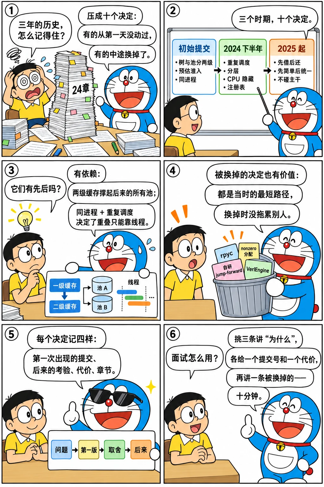

# 贯穿始终的十个设计决定

<p class="lead">读完前面 24 章，可以把三年的历史压缩成十个决定：有的在初始提交里就定下、再没动过；有的是在某个具体的提交里做出的、后来被反复验证；有的是"先这样做、以后再改"的有意拖延。这一章把它们列出来，每一条给出它第一次出现的提交、后来受到的考验，以及它的代价。这是全书的索引，也是面试时讲"SGLang 为什么长成这样"的提纲。</p>

!!! question "自测：能答上来就可以跳过本章"
    1. 哪些决定从初始提交保留到今天？哪些是中途换掉的？
    2. "每个 TP rank 重复调度、只广播输入"和"调度与前向同进程"各解决什么、各付什么代价？
    3. "先借后还"和"先简单后统一"分别对应哪些具体的提交？
    4. 哪些决定是用"接口 + 注册表"的方式保证扩展性的？

??? success "自测参考答案（先自己答，再展开对照）"
    1. 保留：树与池分两级、调度与前向同进程、三类进程的 ZMQ 环、调度器预估未来而不是抢占、注意力层只选后端不管缓存、每个 rank 重复调度。换掉：rpyc、`torch.nonzero` 分配、连做 10 步 decode、复制的 Outlines 代码、自己的 jump-forward、页大小为 1 的硬假设、vLLM 的层实现。
    2. 重复调度把"各 rank 的 batch 一致"归约成"输入一致 + 确定性"，省掉每步广播元数据，代价是 CPU 工作 × TP；同进程省掉调度器与 GPU 之间的 RPC 跳转，代价是调度器的 CPU 工作直接挡在 GPU 前面——重叠调度就是为此付的。
    3. 先借后还：初版借 vLLM 的层（`22085081bb`），2024-11 → 2026-01 的 26 个提交拿回来；先简单后统一：页大小为 1 做了一年多的功能，2025-03 的 #4356 统一改页再逐个适配。
    4. 注意力后端（#1381 / #1547）、投机方法（`spec_registry.py`）、淘汰策略（#10190）、PD 传输后端（#5328）、语法后端（#2020）、硬件后端（`hardware_backend/`）、工具调用解析器、路由策略（#7987）。

先看一个六格小剧场，再读正文：

{.aig-comic}

## 十个决定

```bash title="principles-anchors.sh"
for h in 22085081bb d774acad5c 7d671e4ad2 cdcbde5fc3 99ec439da4 c76040e31b 2d96da813e 419a57e771 815dce0554 03464890e0; do
  git log -1 --date=short --format='%ad  %h  %s' $h | cut -c1-96
done
```

```text title="输出"
2024-01-08  22085081bb  release initial code
2024-07-18  d774acad5c  Remove the dependency of rpyc (#646)
2024-11-19  7d671e4ad2  Enable overlap by default (#2067)
2024-07-29  cdcbde5fc3  Code structure refactor (#807)
2024-09-30  99ec439da4  Organize Attention Backends (#1547)
2025-03-12  c76040e31b  Support page size > 1 (#4356)
2024-07-19  2d96da813e  refactor model loader [unreachable code]: initial refactor (#655)
2024-11-30  419a57e771  minor: add sgl-kernel dir (#2261)
2025-01-02  815dce0554  Eagle speculative decoding part 4: Add EAGLE2 worker (#2150)
2025-01-19  03464890e0  Separate two entry points: Engine and HTTP server (#2996)
```

| # | 决定 | 第一次出现 | 后来的考验 | 代价 | 章 |
| --- | --- | --- | --- | --- | --- |
| 1 | **树与池分两级**：基数树只记槽位，池只管存储，页大小为 1 | 初始提交 `22085081bb` | MLA 池、分层缓存、页大小 > 1、SWA 池都只加池或改键，树的四个核心函数没变 | 元数据按 token 粒度；页对齐要后补 | [3](../origins/radix-v1.md)、[11](../perf/mla-compile.md)、[16](../scale/hicache.md)、[19](../scale/attention-backends.md) |
| 2 | **预估未来、保守接纳、估错撤回**，而不是先接收再抢占 | 初始提交的 `new_token_estimation_ratio`，v0.2 的动态系数与 `retract_decode` | DP attention 下更保守（#2096）、PD 的 decode 侧预分配整段 | 混合负载下系数难调；`--schedule-conservativeness` 交给用户 | [2](../origins/first-commit.md)、[9](../service/v02.md)、[17](../scale/pd.md) |
| 3 | **调度与前向同进程**，分词 / 反分词各自成进程 | 初始提交；#646 去掉 rpyc 后定型 | 重叠调度把前向挪到线程而不是进程；gRPC 入口仍由 Engine 拉起调度器 | CPU 调度直接挡在 GPU 前，必须重叠 | [2](../origins/first-commit.md)、[6](../service/processes.md)、[12](../perf/overlap.md) |
| 4 | **每个 TP rank 重复调度、只广播输入** | #646（2024-07-18） | DP attention 的各 rank 调度不同请求但每步同步形状；投机解码、PD 都建立在它之上 | 调度 CPU × TP；大请求（多模态）pickle 慢 | [6](../service/processes.md)、[13](../perf/multi-gpu.md)、[15](../scale/eagle.md) |
| 5 | **按生命周期分目录，批次分三层，注意力层只选后端** | #807（2024-07-29）、#1543 / #1547（2024-09-30） | 新后端只加文件；重叠调度只改两个类；池可换实现 | 概念多（三个 batch、两个 pool、一个 backend） | [10](../perf/restructure.md) |
| 6 | **CPU 工作藏到 GPU 后面**：CUDA Graph、重叠调度、未来 token | #612（2024-07-13）、#2067（2024-11-19） | 每个新功能（撤回、约束解码、混批、投机、PD）都要和重叠重新磨合 | 并发带来的竞态；所有读 token 的地方要能处理占位符 | [9](../service/v02.md)、[12](../perf/overlap.md) |
| 7 | **接口 + 注册表换扩展性** | 注意力后端 #1381 / #1547；语法后端 #2020；之后推广 | 后端 2 → 30 多个，投机方法十余种，淘汰策略、传输后端、硬件后端、解析器、路由策略同样 | 接口随功能生长到 20 多个方法；新人要先学注册表 | [4](../origins/fsm-jump.md)、[10](../perf/restructure.md)、[15](../scale/eagle.md)、[19](../scale/attention-backends.md) |
| 8 | **先借后还**：模型层借 vLLM，kernel 借 FlashInfer，再逐步自有（sgl-kernel） | 初始提交借；#2261（2024-11-30）建 sgl-kernel；26 个 remove-vllm 提交 | 自有 kernel 后才能做 per-token 量化加速、多硬件、自主升级 | 一年的 compat 提交；版本矩阵 | [8](../service/borrow-vllm.md)、[14](../perf/sgl-kernel.md) |
| 9 | **先简单后统一**：页大小、单一入口文件、单一 OpenAI adapter、自己的 jump-forward | 各自的初版；#4356（2025-03-12）、#2996、#7167、#4032 是"统一"的时刻 | 每次统一都要一次性适配所有已有功能 | 技术债集中偿还 | [4](../origins/fsm-jump.md)、[19](../scale/attention-backends.md)、[20](../platform/entrypoints.md) |
| 10 | **新功能做成 worker / mixin / 独立运行时，不碰调度器主干** | EAGLE worker #2150；PD 的 mixin #4654；`multimodal_gen/` #12484 | 调度器只需理解"一步多 token""两种循环"；扩散模型另起运行时 | worker 变厚、mixin 让 `Scheduler` 方法膨胀、仓库变大 | [15](../scale/eagle.md)、[17](../scale/pd.md)、[23](../platform/multimodal-diffusion.md) |

{.aig-svg}

## 它们之间的关系

这十条不是并列的，有几条明显的依赖：

- **1 → 11、16、19**：树与池分两级，是 MLA 池、分层缓存、页大小后改都能"只动一层"的前提。
- **3 + 4 → 6**：调度与前向同进程、每个 rank 重复调度，决定了"把 CPU 藏到 GPU 后面"只能靠线程级重叠和未来 token，而不是另起调度进程。
- **5 → 7、10**：目录与批次分层之后，接口 + 注册表和 worker / mixin 才有地方放。
- **8 → 14、18**：拿回 kernel 的所有权之后，大规模 EP 需要的 DeepGEMM、permute、量化融合算子才有归宿。
- **9 是 1 到 8 的另一面**：每一条"先这样做"的决定都在某个时刻被"统一"了一次，统一的提交就是这本书里最值得读的那几个。

## 被换掉的决定

同样值得记住的是没活下来的：rpyc（半年）、`torch.nonzero` 分配（九个月）、连做 10 步 decode（十个月）、复制的 Outlines 代码（一个月）、自己的 jump-forward（十四个月）、vLLM 的层实现（一年到两年）、`VerlEngine`（三个半月）、`HiRadixCache` 作为独立类（十九个月，并入统一树）。它们的共同点：都是在当时让功能"先跑起来"的最短路径，被换掉时都有一个更通用的东西接手。判断一个决定好不好，不看它活了多久，看它被换掉时有没有拖累别的东西——这几条都没有。

## 练习

**1. 找一条自己的。** 从[第 24 章](../platform/codebase-2026.md)的目录地图里挑一个本书没有专章的目录（如 `lora/`、`sampling/`、`constrained/` 之外的 `parser/`），用[下一章](archaeology.md)的方法找出它的第一个提交和最大的一次重构，判断它遵循的是上面哪几条决定。

??? success "参考思路"
    `git log --reverse --date=short --format='%ad %h %s' "$REF" -- python/sglang/srt/lora | head`，再看 `--stat` 最大的提交；LoRA 的演变（2024-09 起步、2025 年 `LoRAManager` 的两次重构 #6994 / #7412）符合第 7 条（后端化）和第 10 条（不碰主干）。

**2. 反例。** 找一个和这十条冲突的提交（例如直接在 `scheduler.py` 里加一大段某个功能专用的逻辑），看它后来是否被拆出去。

??? success "参考思路"
    `git log --stat --format='%ad %h %s' "$REF" -- python/sglang/srt/managers/scheduler.py | grep -B3 'scheduler.py.*+[0-9]\{3\}'` 找出一次加几百行的提交，再在 `scheduler_components/` 和各 mixin 里找同名逻辑。

!!! interview "怎么讲清楚"
    讲"你怎么理解 SGLang 的架构"的时候，不要从目录树开始。挑三条决定讲清"为什么"（推荐 1、4、6：树与池分两级、每个 rank 重复调度、把 CPU 藏到 GPU 后面），每条给一个提交号和一个代价，再用一条"被换掉的决定"说明你知道它是演化出来的。十分钟讲完，比背模块关系更能体现判断力。

## 小结

- [x] 十个决定：两级缓存、预估准入、同进程、重复调度、分层目录、CPU 隐藏、接口与注册表、先借后还、先简单后统一、新功能不碰主干。
- [x] 它们有依赖：两级缓存撑起后来的所有池；同进程 + 重复调度决定了重叠的做法；分层之后才有注册表和 worker。
- [x] 被换掉的决定同样有价值：都是当时的最短路径，换掉时没有拖累别的东西。
