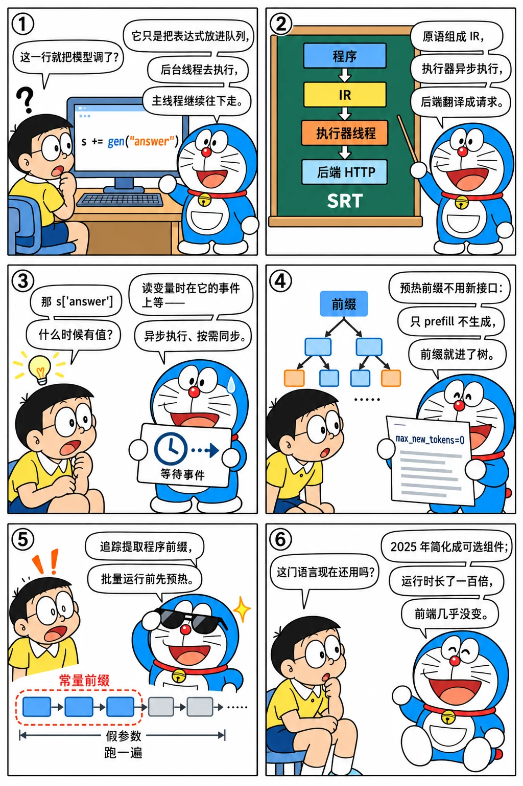

# 前端语言：解释器、追踪器与编译器

<p class="lead">SGLang 的名字里有"Lang"。初版的 <code>lang/</code> 目录有 1655 行：用 Python 装饰器定义程序，<code>gen</code>、<code>select</code>、<code>fork</code> 这些原语构成一棵 IR，解释器在后台线程里异步执行，追踪器用假参数把程序跑一遍提取常量前缀，编译器把追踪得到的图做拓扑排序后执行。这一章读这部分代码，弄清它和运行时之间那几个"为前端而生"的接口（<code>max_new_tokens=0</code> 的预热请求、归一化对数概率的 <code>select</code>、把分支的 KV 拼回主干的 <code>concate_and_append</code>），再看它为什么在 2025 年被简化成可选组件。</p>

!!! question "自测：能答上来就可以跳过本章"
    1. `@sgl.function` 修饰的函数里 `s += gen("answer")` 做了什么？`s["answer"]` 什么时候阻塞？
    2. `select` 在运行时侧是怎么实现的？为什么要先发一个 `max_new_tokens=0` 的请求？
    3. 追踪器用来做什么？为什么 `run_batch` 之前要 `pin_program`？
    4. 前端在 2025 年发生了什么？它今天还在吗？

??? success "自测参考答案（先自己答，再展开对照）"
    1. `s` 是 `ProgramState`，`+=` 把表达式提交给它的 `StreamExecutor`：放进队列，由后台线程顺序执行（调用后端生成），Python 主线程立刻返回。`s["answer"]` 调用 `get_var`，在该变量的 `threading.Event` 上等待，直到后台线程把生成结果写进 `variables`。
    2. 先把当前文本作为 `max_new_tokens=0` 的请求发给运行时（只做 prefill，把前缀放进缓存并拿到 `prompt_tokens`），再把"文本 + 每个选项"作为一批请求发出，带 `return_normalized_logprob=True` 和 `normalized_logprob_start_len=prompt_tokens`，取归一化对数概率最大的选项。预热请求保证各选项的公共前缀只算一次，并且让 `start_len` 精确等于前缀长度。
    3. 用假参数（`SglArgument(name, None)`）执行程序，记录原语序列得到图；`extract_prefix_by_tracing` 取图开头连续的常量文本作为"程序前缀"，`pin_program` 把它发给运行时预热（`cache_prefix`），批量运行时所有实例都能命中这段前缀。
    4. 2025-08-10 的 `Simplify frontend language (#9029)` 把 `api.py` 挪进 `lang/`，去掉一些依赖，前端成为可选安装的组件。目录还在（14 个文件），但三年里提交很少，运行时成了主角。

先看一个六格小剧场，再读正文：

{.aig-comic}

## 原语与 IR

公开 API 在 `api.py`：

```python title="python/sglang/api.py @ 22085081bb L23-28,31-45"
def function(func: Callable):
    return SglFunction(func)


def set_default_backend(backend: BaseBackend):
    global_config.default_backend = backend
...
def gen(
    name: Optional[str] = None,
    max_tokens: Optional[int] = None,
    stop: Optional[Union[str, List[str]]] = None,
    temperature: Optional[float] = None,
    top_p: Optional[float] = None,
    top_k: Optional[int] = None,
    frequency_penalty: Optional[float] = None,
    presence_penalty: Optional[float] = None,
    dtype: Optional[type] = None,
    choices: Optional[List[str]] = None,
    regex: Optional[str] = None,
):
    if choices:
        return SglSelect(name, choices, temperature)
```

`gen(choices=...)` 直接变成 `SglSelect`，`gen(regex=...)` 把正则交给运行时（[上一章](fsm-jump.md)的约束解码就是这么触发的）。所有原语都是 `SglExpr` 的子类（`ir.py`）：`SglConstantText`、`SglGen`、`SglSelect`、`SglImage`、`SglRoleBegin`/`SglRoleEnd`、`SglFork`、`SglVariable`……表达式之间用 `+` 拼成 `SglExprList`。`@function` 返回 `SglFunction`，它要求第一个参数叫 `s`：

```python title="python/sglang/lang/ir.py @ 22085081bb L69-78,182-190"
class SglFunction:
    def __init__(self, func, bind_arguments=None):
        self.func = func
        self.bind_arguments = bind_arguments or {}
        self.pin_prefix_rid = None

        # Parse arguments
        argspec = inspect.getfullargspec(func)
        assert argspec.args[0] == "s", 'The first argument must be "s"'
        self.arg_names = argspec.args[1:]
...
    def __call__(self, *args, **kwargs):
        from sglang.lang.tracer import TracingScope

        tracing_scope = TracingScope.get_current_scope()
        if tracing_scope is None:
            return self.run(*args, **kwargs)
        else:
            kwargs["backend"] = tracing_scope.tracer_state.backend
            return self.trace(*args, **kwargs)
```

`__call__` 里的分支是关键：如果当前处于追踪作用域（`TracingScope`），调用就是追踪而不是执行——这让一个 SGLang 函数既能直接运行，也能作为子程序被另一个程序追踪。

{.aig-svg}

## 解释器：一个后台线程、一堆事件

`run_program` 创建一个 `StreamExecutor` 和包着它的 `ProgramState`，然后直接调用用户函数。用户函数里的每个 `s += ...` 最终到 `submit`：

```python title="python/sglang/lang/interpreter.py @ 22085081bb L200-215" linenums="200"
    def submit(self, expr: SglExpr):
        if isinstance(expr, (SglGen, SglSelect, SglVarScopeBegin)):
            self.variable_event[expr.name] = threading.Event()
            if self.stream:
                self.stream_var_event[expr.name] = threading.Event()
        elif isinstance(expr, SglExprList):
            for e in expr.expr_list:
                if isinstance(e, (SglGen, SglSelect, SglVarScopeBegin)):
                    self.variable_event[e.name] = threading.Event()
                    if self.stream:
                        self.stream_var_event[e.name] = threading.Event()

        if self.use_thread:
            self.queue.put(expr)
        else:
            self._execute(expr)
```

每个会产生变量的表达式（`gen`、`select`、变量作用域）先注册一个 `threading.Event`，然后表达式进队列。后台线程 `_thread_worker_func` 顺序取出执行：常量文本直接追加到 `text_`，`gen` 调用后端生成并 `set` 事件，`select` 调用后端打分。用户代码读变量时阻塞在事件上。这就是论文说的"异步执行、按需同步"：程序里连续三个 `gen` 会被尽快地依次发出，而 Python 主线程早就跑到后面去了。

`fork` 复制执行器：

```python title="python/sglang/lang/interpreter.py @ 22085081bb L232-256" linenums="232"
    def fork(self, number: int, position_ids_offset: Optional[List[int]] = None):
        if number > 1:
            self.submit(SglCommitLazy())
            self.sync()

        number = int(number)

        exes = [
            StreamExecutor(
                self.backend,
                self.arguments,
                self.default_sampling_para,
                self.chat_template,
                self.stream,
            )
            for _ in range(number)
        ]
        for i in range(number):
            exes[i].variables = dict(self.variables)
            exes[i].text_ = str(self.text_)
            exes[i].messages_ = list(self.messages_)
            exes[i].cur_role = self.cur_role
            exes[i].fork_start_text_pos = len(self.text_)

        return exes
```

分叉前先提交一个 `SglCommitLazy` 并同步——让后端把当前文本做一次 prefill（`commit_lazy_operations` 发的也是 `max_new_tokens=0` 的请求），这样所有分支都能命中这段前缀。每个分支有自己的线程和队列，`join` 时把分支里新产生的变量收集回主干（`gather_variable`），或者把分支的 KV 拼回主干（`concate_and_append`）。

`_execute_gen` 非流式的部分很短：

```python title="python/sglang/lang/interpreter.py @ 22085081bb L347-359" linenums="347"
    def _execute_gen(self, expr: SglGen):
        sampling_params = self._resolve_sampling_params(expr.sampling_params)
        name = expr.name

        if not self.stream:
            comp, meta_info = self.backend.generate(
                self, sampling_params=sampling_params
            )
            self.text_ += comp

            self.variables[name] = comp
            self.meta_info[name] = meta_info
            self.variable_event[name].set()
```

## 后端：为前端定制的运行时接口

`backend/runtime_endpoint.py` 是前端连 SRT 的适配器，它暴露了几个只有前端会用的运行时接口：

```python title="python/sglang/backend/runtime_endpoint.py @ 22085081bb L35-39,131-159,161-166"
    def cache_prefix(self, prefix_str: str):
        res = http_request(
            self.base_url + "/generate",
            json={"text": prefix_str, "sampling_params": {"max_new_tokens": 0}},
        )
...
    def select(
        self,
        s: StreamExecutor,
        choices: List[str],
        temperature: float,
    ):
        assert temperature <= 1e-5

        # Cache common prefix
        data = {"text": s.text_, "sampling_params": {"max_new_tokens": 0}}
        self._add_images(s, data)
        res = http_request(self.base_url + "/generate", json=data)
        assert res.status_code == 200
        prompt_len = res.json()["meta_info"]["prompt_tokens"]

        # Compute logprob
        data = {
            "text": [s.text_ + c for c in choices],
            "sampling_params": {"max_new_tokens": 0},
            "return_normalized_logprob": True,
            "normalized_logprob_start_len": prompt_len,
        }
        self._add_images(s, data)
        res = http_request(self.base_url + "/generate", json=data)
        assert res.status_code == 200
        logps = [r["meta_info"]["normalized_logprob"] for r in res.json()]

        decision = choices[np.argmax(logps)]
        return decision, logps
...
    def concatenate_and_append(self, src_rids: List[str], dst_rid: str):
        res = http_request(
            self.base_url + "/concate_and_append_request",
            json={"src_rids": src_rids, "dst_rid": dst_rid},
        )
        assert res.status_code == 200
```

- `cache_prefix` / `commit_lazy_operations`：`max_new_tokens=0` 的 `/generate`——只 prefill 不生成，副作用是把前缀放进基数树。这是"前端知道的信息传给运行时"最直接的例子：运行时根本不需要新接口，一个参数就够了。
- `select`：先预热公共前缀拿到 `prompt_tokens`，再把每个选项拼在后面成批发出，请求 `return_normalized_logprob` 并指定从 `prompt_tokens` 开始算——运行时侧的 `normalized_logprob_start_len` 参数（[第二章](first-commit.md)准入逻辑里那段"至少两个 token"的特殊处理）就是为它存在的。
- `concatenate_and_append`：`/concate_and_append_request` 接口把若干分支的 KV 拼回主干，论文里"并行分支后合并"的运行时支持；它要求分支的起点一致（`fork_start_text_pos == self_len`），由 `global_config.enable_parallel_encoding` 控制。

对 OpenAI 后端，`select` 退化成多次调用比较对数概率；2024-01-25 的 `support speculative execution for openai API (#48)` 加了论文的 API 投机执行：一次 `gen` 多要一些 token，后面的 `gen` 若是续写就直接复用。

## 追踪器与编译器

追踪器复用解释器的 `ProgramState` 接口，但 `_execute` 不执行，只把表达式接成链（`prev_node`）：

```python title="python/sglang/lang/tracer.py @ 22085081bb L32-53" linenums="32"
def extract_prefix_by_tracing(program, backend):
    # Create dummy arguments
    dummy_arguments = {name: SglArgument(name, None) for name in program.arg_names}
    arguments = dummy_arguments
    arguments.update(program.bind_arguments)

    # Trace
    tracer = TracerProgramState(backend, arguments, only_trace_prefix=True)
    try:
        with TracingScope(tracer):
            tracer.ret_value = program.func(tracer, **arguments)
    except StopTracing:
        pass

    # Run and cache prefix
    prefix = ""
    for expr in tracer.flatten_nodes():
        if isinstance(expr, SglConstantText):
            prefix += expr.value
        else:
            break
    return prefix
```

`extract_prefix_by_tracing` 只追踪到第一个非常量表达式（`only_trace_prefix=True` 时遇到 `gen` 抛 `StopTracing`），把前面的常量文本拼成前缀。`pin_program` 在批量运行前调用它：

```python title="python/sglang/lang/interpreter.py @ 22085081bb L126-136" linenums="126"
def pin_program(program, backend):
    if global_config.enable_prefix_sharing and program.pin_prefix_rid is None:
        # TODO: handle multiple backends
        from sglang.lang.tracer import extract_prefix_by_tracing

        prefix = extract_prefix_by_tracing(program, backend)
        if prefix and len(prefix) > 64:
            prefix_rid = backend.cache_prefix(prefix)
            program.pin_prefix_rid = prefix_rid
            return prefix_rid
    return None
```

前缀超过 64 个字符才值得预热。`run_batch` 用线程池并发运行所有实例，每个实例的前缀都会命中——这是论文里 MMLU、HellaSwag 这类 few-shot 评测拿到高命中率的机制。

编译器把完整追踪得到的链构造成图、拓扑排序、再按顺序提交给（可能多个）执行器：

```python title="python/sglang/lang/compiler.py @ 22085081bb L72-87,95-123"
    def topological_sort(self):
        prevd = {}
        cand = Queue()
        for x in self.nodes:
            prevd[x] = (x.prev_node is not None) + (x.source_node is not None)
            if prevd[x] == 0:
                cand.put(x)
        new_list = []
        while cand.qsize() > 0:
            head = cand.get()
            new_list.append(head)
            for x in head.next_nodes:
                prevd[x] -= 1
                if prevd[x] == 0:
                    cand.put(x)
        self.nodes = new_list
...
    def run_internal(
        self,
        backend,
        kwargs,
        default_sampling_para,
    ):
        stream_executor_ids = set([x.expr.pid for x in self.nodes])
        stream_executors = {}
        for x in stream_executor_ids:
            arguments = kwargs if x == self.last_node.expr.pid else {}
            stream_executors[x] = StreamExecutor(
                backend, arguments, default_sampling_para, None, False
            )
        for node in self.nodes:
            se_id = node.expr.pid
            expr = node.expr
            if isinstance(expr, SglVariable):
                # Make a copy for SglVariable
                expr = SglVariable(expr.name, expr.source)
                expr.source_stream_executor = stream_executors[
                    node.source_node.expr.pid
                ]
            elif isinstance(expr, SglArgument):
                # Substitute SglArgument
                expr = kwargs[expr.name]
            stream_executors[se_id].submit(expr)
        for stream_executor in stream_executors.values():
            stream_executor.end()
        return ProgramState(stream_executors[self.last_node.expr.pid])
```

每个 `fork` 出来的分支有自己的 `pid`，`run_internal` 为每个 `pid` 建一个 `StreamExecutor`；`SglVariable` 引用别的分支的变量时，通过 `source_stream_executor` 跨执行器取值。这是论文"图执行"的实现，但论文里的"代码移动"优化（让 GPT-4 重排模板）并没有进入仓库——编译器实际能做的只是按依赖顺序执行。

## 设计取舍

- **线程而不是 asyncio。** 用户函数是普通的同步 Python，`+=` 不能是 `await`；所以执行器用后台线程和事件，流式输出用 `text_iter` 轮询事件。代价是每个程序实例（以及每个 fork 分支）一个线程，批量运行时线程数等于并发数。2024-01-18 的 `Increase interpreter parallelism (#46)` 和 2024-04 的 `Reduce overhead when fork(1) (#375)` 都是在这个代价上做文章。
- **运行时接口尽量不为前端加东西。** 预热用 `max_new_tokens=0`，`select` 用归一化对数概率，只有 `concate_and_append` 是专用接口。好处是运行时保持通用，坏处是 `select` 要两次往返。
- **追踪靠假参数执行。** 不解析 Python 源码，直接跑一遍——简单，但程序的控制流如果依赖参数的值（`if len(question) > 100`），追踪就会走错分支；`SglArgument.__format__` 直接抛错也是为了防止参数被格式化进字符串后追踪不到。

## 后来怎么样了

```bash title="lang-size.sh"
REF=${REF:-29f6d408c0}
lines() { git ls-tree -r --name-only "$1" -- "$2" | grep '\.py$' | while read -r f; do git show "$1:$f"; done | wc -l; }
echo "lang/ 行数：初版 $(lines 22085081bb python/sglang/lang)，今天 $(lines "$REF" python/sglang/lang)"
echo "srt/ 行数：初版 $(lines 22085081bb python/sglang/srt)，今天 $(lines "$REF" python/sglang/srt)"
for y in 2024 2025 2026; do
  echo "$y 年改动 lang/ 的提交：$(git log --format=%h --since=$y-01-01 --until=$y-12-31 "$REF" -- python/sglang/lang python/sglang/api.py | wc -l)，改动 srt/managers/ 的：$(git log --format=%h --since=$y-01-01 --until=$y-12-31 "$REF" -- python/sglang/srt/managers | wc -l)"
done
```

```text title="输出"
lang/ 行数：初版 1841，今天 4650
srt/ 行数：初版 6384，今天 851793
2024 年改动 lang/ 的提交：111，改动 srt/managers/ 的：508
2025 年改动 lang/ 的提交：42，改动 srt/managers/ 的：926
2026 年改动 lang/ 的提交：18，改动 srt/managers/ 的：1296
```

前端的规模三年几乎没变，运行时长了一百多倍。中间的几个节点：

- 2024-02 → 2024-05：Gemini / VertexAI、Anthropic、LiteLLM 等后端，`choices` 的多种打分方式（`Feat: add alternative choices selection methods (#835)`，2024-08）；
- 2024-07-25 的 v0.2 博客开始把 SGLang 称为 "SGLang Runtime (SRT)" 为主的推理引擎，前端放到第二位；
- 2025-01-06 `Add generator-style run_batch function (#2513)`，批量接口的最后一次大改；
- 2025-08-10 `Simplify frontend language (#9029)`：`api.py` 搬进 `lang/api.py`，`sglang/__init__.py` 里 `Engine` 改从 `srt.entrypoints.engine` 导入，前端相关依赖从 `all` 里拿掉——安装 SGLang 不再意味着安装前端。

今天的 `python/sglang/lang/` 仍有 14 个文件，`sglang.function`、`gen`、`select` 还能用，官方文档把它放在 "Frontend Language" 一节里，和 OpenAI 兼容接口、原生 `/generate` 并列。但新功能（函数调用、推理模型的思考模式、多模态的各种输入）都做在运行时和网关层，前端只是维持可用。

## 练习

**1. 异步到什么程度。** 一个程序里连续写 `s += gen("a"); s += gen("b"); print(s["a"])`，三步分别在哪个线程、什么时候执行？如果把 `print` 挪到最前面呢？

??? success "参考答案"
    两个 `gen` 立刻进队列，主线程不等；后台线程先执行 `gen("a")`（调用后端，返回后 set 事件），再执行 `gen("b")`。`print(s["a"])` 在主线程阻塞到 `a` 的事件被 set，此时 `b` 可能还在生成。`print` 挪到最前面会 KeyError——`variable_event` 里还没有 `a`（`submit` 之前）。

**2. `select` 的两次往返能不能省。** 读 `RuntimeEndpoint.select`，想一想如果不先发 `max_new_tokens=0` 的请求会怎样；运行时侧要加什么才能一次往返完成？

??? success "参考思路"
    不预热的话各选项的公共前缀会在同一批里各算一遍（初版的树在请求结束时才插入，见 [RadixAttention 一章](radix-v1.md)），并且 `normalized_logprob_start_len` 需要知道前缀的 token 数，只能先分词一次。一次往返需要运行时支持"同一批内共享前缀"（后来的 #2442）和"按文本前缀自动确定起始位置"。

**3. 前端的最后一次大改。** 用 `git show b58ae7a2a0 --stat` 看 #9029 动了哪些文件，并解释 `sglang/__init__.py` 里 `Engine` 的导入位置为什么要变。

??? success "参考思路"
    改动集中在 `pyproject.toml`（依赖分组）、`__init__.py`（导入）和 `api.py` 的搬家；`Engine` 从 `srt.entrypoints.engine` 直接导入，是为了让"只用运行时"的用户导入 `sglang` 时不必加载前端代码，前端 API 保留在 `lang/api.py` 里按需导入。

!!! interview "面试怎么答"
    如果被问到"SGLang 的前端语言是什么、为什么现在很少提"，可以这样讲：它是论文的一半，用装饰器 + 原语把多次调用的程序写成 Python 函数，解释器异步执行、追踪器提取共享前缀、`select` 用对数概率打分；它对运行时的要求很少（预热请求、归一化对数概率、分支合并），所以运行时能独立成为通用引擎。后来用户要的是 OpenAI 兼容的引擎，前端在 2025 年被简化成可选组件。这个回答同时说明了协同设计的价值和它的边界。

## 小结

- [x] 前端 = 原语构成的 IR + 后台线程的解释器 + 用假参数执行的追踪器 + 拓扑排序的编译器。
- [x] 它只向运行时要了三样东西：`max_new_tokens=0` 的预热、归一化对数概率的 `select`、分支合并接口。
- [x] 追踪器提取的常量前缀 + 批量运行前的预热，是论文里 few-shot 评测高命中率的来源。
- [x] 三年里前端规模几乎不变，2025-08 被简化为可选组件；运行时长了一百多倍。
