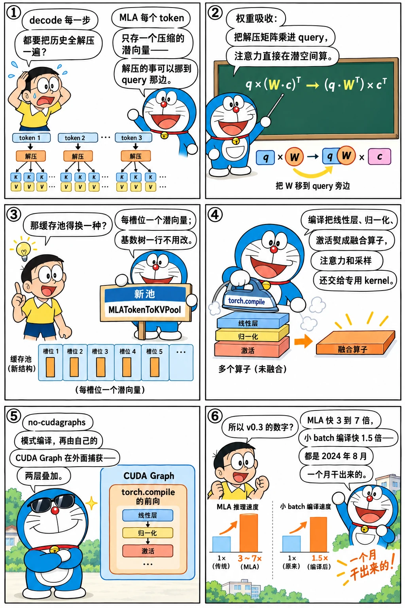

# MLA 与 torch.compile：v0.3 的两个来源

<p class="lead">2024 年 9 月 4 日的 v0.3 博客标题是"DeepSeek MLA 快 7 倍、torch.compile 快 1.5 倍、多图多视频的 LLaVA-OneVision"。前两项是这一章的主题：MLA 是第一次为一种新的注意力结构重做内存池和 kernel，也是 SGLang 与 DeepSeek 系列模型绑定的开始；torch.compile 则是在 CUDA Graph 之上再叠一层编译，用来压低小 batch 的延迟。两者都始于 8 月初的一个提交和一个早已存在的开关。</p>

!!! question "自测：能答上来就可以跳过本章"
    1. MLA 的 KV 缓存和多头注意力的有什么不同？SGLang 为它改了哪三处？
    2. "权重吸收"（weight absorption）是什么？为什么 decode 时要用它、prefill 时不一定？
    3. torch.compile 在 SGLang 里编译的是什么、不编译的是什么？它和 CUDA Graph 是什么关系？
    4. v0.3 博客的 3–7 倍和 1.5 倍分别在什么条件下成立？

??? success "自测参考答案（先自己答，再展开对照）"
    1. MLA 每层每个 token 只缓存一个压缩的潜向量（`kv_lora_rank` 维）加一小段 RoPE 维度（`qk_rope_head_dim`），而不是每个 KV 头各一份 K 和 V。改动：内存池新增 `MLATokenToKVPool`（每个槽位一个 `kv_lora_rank + qk_rope_head_dim` 的向量）；注意力 kernel 支持 q 与 k 的维度不同（`extend_attention` / `token_attention` 的 `kv_lora_rank` 参数）；模型文件里的 `DeepseekV2AttentionMLA` 用吸收后的权重直接在潜空间算注意力。
    2. 把 `W_UK`（从潜向量解压出 K 的矩阵）吸收进 query 一侧：`q · (W_UK c)ᵀ = (q W_UKᵀ) · cᵀ`，于是注意力分数可以直接在压缩的潜向量上算，不必把每个历史 token 的 K 解压出来；同理把 `W_UV` 挪到输出一侧。decode 时每步只有一个 query、却要对整段历史算分数，解压历史 K 的代价远大于变换一个 query，所以吸收划算；prefill 时 query 和 key 一样多，解压的成本相对低，而且吸收会让每个头的 q 维度变大，矩阵乘更贵——两条路径各有适用范围。
    3. 编译 Transformer 层里的线性层、归一化、激活等"普通算子"（`torch.compile(model.forward, mode="max-autotune-no-cudagraphs")`），注意力和采样仍用 FlashInfer 的 kernel；编译发生在 CUDA Graph 捕获之前，编译后的前向被捕获进图。所以是"编译减少 kernel 数和融合算子，图回放减少发射开销"的叠加，只对 `--torch-compile-max-bs` 以内的 batch 开启。
    4. 3–7 倍：DeepSeek-V2（Lite 用 TP=1、大模型 TP=8）在 H100 上、ShareGPT 数据集、BF16 与 FP8，对比 vLLM 的吞吐；1.5 倍：小 batch（1 到 32）的延迟，对比不开 compile 的 SGLang 自己。

先看一个六格小剧场，再读正文：

{.aig-comic}

## MLA：从一个 439 行的提交开始

```bash title="mla-commits.sh"
REF=${REF:-29f6d408c0}
git log --reverse --date=short --format='%ad  %h  %s' "$REF" --since=2024-07-20 --until=2024-09-10 | grep -iE 'mla|deepseek' | cut -c1-96
```

```text title="输出"
2024-07-21  eedc12e12e  Support Deepseek MoE Model (#689)
2024-07-26  679ebcbbdc  Deepseek v2 support (#693)
2024-08-05  e1eae1fd15  Support MLA for DeepSeek-V2 with Triton - step 1 (#905)
2024-08-13  65915f9f3e  fix: temporary solution for DeepSeek V2 H100 layout conversion issue (#1
2024-08-19  df191254ab  Optimize MLA/GQA/MQA Triton decoding (#1138)
2024-08-30  f414352ae6  Transpose mla weight offline (#1261)
2024-09-01  54772f784a  feat: fix fp8 for MLA and support bmm fp8 for DeepSeek V2 (#1285)
```

7 月 26 日 #693 让 DeepSeek-V2 能跑，但用的是"把 MLA 当普通多头注意力"的路径：从潜向量解压出完整的 K、V 存进普通的 KV 池。8 月 5 日 Ke Bao 的 #905 "Support MLA for DeepSeek-V2 with Triton - step 1" 才是真正的 MLA 实现，改了 10 个文件、439 行：

| 文件 | 改动 |
| --- | --- |
| `mem_cache/memory_pool.py` | 新增 `MLATokenToKVPool`：每层每槽位一个 `kv_lora_rank + qk_rope_head_dim` 维的向量，而不是 K、V 两份 |
| `layers/extend_attention.py`、`token_attention.py` | Triton kernel 支持 q 的维度大于 v 的维度（`kv_lora_rank`） |
| `models/deepseek_v2.py` | 新类 `DeepseekV2AttentionMLA`，权重吸收 |
| `server_args.py` | `--disable-mla` 开关（默认启用 MLA 路径） |

v0.3.0 的内存池里两种池并列：

```python title="python/sglang/srt/mem_cache/memory_pool.py @ v0.3.0 L56-62,146-150,204-216"
class BaseTokenToKVPool(ABC):
    """A memory pool that maps a token to its kv cache locations"""

    def __init__(
        self,
        size: int,
        dtype: torch.dtype,
...
class MHATokenToKVPool(BaseTokenToKVPool):

    def __init__(
        self,
        size: int,
...
class MLATokenToKVPool(BaseTokenToKVPool):

    def __init__(
        self,
        size: int,
        dtype: torch.dtype,
        kv_lora_rank: int,
        qk_rope_head_dim: int,
        layer_num: int,
    ):
        super().__init__(size, dtype)

        self.kv_lora_rank = kv_lora_rank
```

`BaseTokenToKVPool` 抽象出"按槽位存取每层的 KV"，`MHATokenToKVPool` 是初版的 K/V 双缓冲，`MLATokenToKVPool` 一个槽位只存一个潜向量。[第三章](../origins/radix-v1.md)的基数树完全不受影响：它只管槽位索引，不管槽位里存什么——这是"树与池分两级"的设计第一次显出好处。

权重吸收在模型加载时完成一次：

```python title="python/sglang/srt/models/deepseek_v2.py @ v0.3.0 L735-745" linenums="735"
            for layer_id in range(self.config.num_hidden_layers):
                self_attn = self.model.layers[layer_id].self_attn
                w_kc, w_vc = self_attn.kv_b_proj.weight.unflatten(
                    0, (-1, self_attn.qk_nope_head_dim + self_attn.v_head_dim)
                ).split([self_attn.qk_nope_head_dim, self_attn.v_head_dim], dim=1)
                self_attn.w_kc = w_kc.transpose(1, 2).contiguous().transpose(1, 2)
                self_attn.w_vc = w_vc.contiguous().transpose(1, 2)
                if hasattr(self_attn.kv_b_proj, "weight_scale"):
                    self_attn.w_scale = self_attn.kv_b_proj.weight_scale
                del self_attn.kv_b_proj

```

`kv_b_proj` 的权重被拆成 `w_kc`（K 的解压矩阵）和 `w_vc`（V 的解压矩阵），decode 时直接用它们做批量矩阵乘：

```python title="python/sglang/srt/models/deepseek_v2.py @ v0.3.0 L447-460,474-488"
        q_nope, q_pe = q.split([self.qk_nope_head_dim, self.qk_rope_head_dim], dim=-1)

        if self.w_kc.dtype == torch.float8_e4m3fn:
            q_nope_val, q_nope_scale = input_to_float8(
                q_nope.transpose(0, 1), torch.float8_e4m3fn
            )
            q_nope_out = bmm_fp8(
                q_nope_val, self.w_kc, q_nope_scale, self.w_scale, torch.bfloat16
            )
        else:
            q_nope_out = torch.bmm(q_nope.transpose(0, 1), self.w_kc)
        q_input[..., : self.kv_lora_rank] = q_nope_out.transpose(0, 1)

        latent_cache = self.kv_a_proj_with_mqa(hidden_states)[0]
...
        if self.w_vc.dtype == torch.float8_e4m3fn:
            attn_output_val, attn_output_scale = input_to_float8(
                attn_output.transpose(0, 1), torch.float8_e4m3fn
            )
            attn_bmm_output = bmm_fp8(
                attn_output_val,
                self.w_vc,
                attn_output_scale,
                self.w_scale,
                torch.bfloat16,
            )
        else:
            attn_bmm_output = torch.bmm(attn_output.transpose(0, 1), self.w_vc)
        attn_output = attn_bmm_output.transpose(0, 1).flatten(1, 2)
        output, _ = self.o_proj(attn_output)
```

`q_nope` 先乘 `w_kc` 变到潜空间（`torch.bmm`，每个头一个小矩阵），注意力在潜向量上算，输出再乘 `w_vc` 回到值空间。FP8 时用 `bmm_fp8`——这是 9 月 1 日 #1285 加的，也是博客里"FP8 batched MatMul"的来源。8 月 19 日 #1138 "Optimize MLA/GQA/MQA Triton decoding" 是博客里"grouped decoding kernels"的来源：decode 时一个 KV 头被多个 query 头共享（MLA 吸收后相当于 MQA），kernel 把同组的 query 头放在一个 block 里算，提高 KV 的复用。四项合起来（吸收、分组 decode kernel、FP8 bmm、FP8 KV 缓存）就是博客的 3–7 倍。

{.aig-svg}

## torch.compile：早已存在的开关

`--enable-torch-compile` 在 v0.2.0 里就有了，藏在 `CudaGraphRunner` 的 `use_torch_compile` 参数里（[第九章](../service/v02.md)的 `compile_bs = [1, 2, 4, 8, 16, 24, 32]`）。v0.3.0 的实现：

```python title="python/sglang/srt/model_executor/cuda_graph_runner.py @ v0.3.0 L58-76" linenums="58"
def patch_model(
    model: torch.nn.Module, enable_compile: bool, tp_group: "GroupCoordinator"
):
    backup_ca_comm = None

    try:
        if enable_compile:
            _to_torch(model)
            monkey_patch_vllm_all_gather()
            backup_ca_comm = tp_group.ca_comm
            tp_group.ca_comm = None
            yield torch.compile(model.forward, mode="max-autotune-no-cudagraphs")
        else:
            yield model.forward
    finally:
        if enable_compile:
            _to_torch(model, reverse=True)
            monkey_patch_vllm_all_gather(reverse=True)
            tp_group.ca_comm = backup_ca_comm
```

`patch_model` 是一个上下文管理器：开启编译时先 `_to_torch(model)`——把模型里的自定义算子（vLLM 的 `RMSNorm`、`SiluAndMul` 等 CUDA kernel）临时换成纯 PyTorch 实现，让 `torch.compile` 能看见并融合它们；关掉自定义 all-reduce（编译器处理不了它的通信）；然后 `torch.compile(model.forward, mode="max-autotune-no-cudagraphs")`。`no-cudagraphs` 是关键：编译器自己的 CUDA Graph 被关掉，由 SGLang 的 `CudaGraphRunner` 在外面捕获编译后的前向。退出时把算子换回来。编译只对 `compile_bs` 列表里的 batch 大小做（后来变成 `--torch-compile-max-bs`），因为编译一个 batch 形状要几十秒到几分钟，大 batch 时发射开销本来就不重要。

8 月 8 日 #993 把编译配置挪进 `cuda_graph_runner.py`，8 月 26 日 #1223 加了编译的 CI 吞吐测试，9 月 2 日 #1306 修了采样器在 CUDA Graph / compile 下的 bug——博客的 1.5 倍（batch 1 到 32、Llama-3.1-8B）就是这个月打磨出来的。博客还提到在 batch 1 上比 gpt-fast 更快，并保留了连续批处理和 RadixAttention。

```bash title="compile-commits.sh"
REF=${REF:-29f6d408c0}
git log --reverse --date=short --format='%ad  %h  %s' "$REF" --since=2024-07-01 --until=2024-09-10 | grep -iE 'torch.?compile|compile' | cut -c1-96
```

```text title="输出"
2024-08-08  9f662501a3  Move torch.compile configs into cuda_graph_runner.py (#993)
2024-08-13  0076f11541  fix: use devel for Triton's compiler requirements (#1074)
2024-08-26  c61a1b6f97  Torch compile CI throughput test (#1223)
2024-09-02  a5a134f39f  Fix bugs in sampler with CUDA graph / torch.compile (#1306)
```

## 设计取舍

- **MLA 做成第二种池，而不是改树。** 把"槽位里存什么"和"槽位怎么被引用"分开，使 MLA 零成本地复用前缀缓存、CUDA Graph 和调度器。后来的 SWA 池、混合注意力池、NSA 的索引池都走这条路。
- **吸收路径和解压路径并存。** `forward_absorb`（decode）与 `forward_normal`（prefill）的分工在 v0.3.0 已经出现，后来变成按 batch 的 extend 长度动态选择（推理系统手册 [MLA 一章](serving://moe/mla/)讲这两条路径的计算量）。
- **编译只编"普通算子"。** 注意力和采样交给专用 kernel，编译器负责线性层、归一化、激活的融合——每种工具做自己擅长的事。代价是 `_to_torch` 这种临时替换算子的技巧，以及对 vLLM 自定义算子的猴子补丁（去 vLLM 依赖时一并清理）。
- **只对小 batch 开。** 编译时间和 batch 形状数成正比，大 batch 又不缺并行度。

## 后来怎么样了

- MLA：2024-12 FlashInfer 的 MLA kernel 接入；2025-03 FlashMLA、cutlass MLA（`sgl-kernel/csrc/attention/cutlass_mla_kernel.cu`）、TRT-LLM MLA 后端；2025-04 `--disable-mla` 和 `--enable-flashinfer-mla` 等开关被弃用，统一成注意力后端的选择；DeepSeek-V3 / R1 的 EP 部署在[第 18 章](../scale/large-ep.md)。
- torch.compile：2025 年加入 `compilation/` 目录和 piecewise CUDA graph（#11490）——把前向切成若干段分别捕获，让 prefill 的非注意力部分也能图化；`torch_compile_max_bs` 仍是开关。
- `MLATokenToKVPool` 今天还在 `mem_cache/memory_pool.py` 里，旁边多了十几个池。

## 练习

**1. 吸收的代价。** 用 DeepSeek-V2 的配置（`num_attention_heads=128`、`qk_nope_head_dim=128`、`kv_lora_rank=512`）算一算：decode 时一个 query 走吸收路径要多少次乘加，走解压路径对一段 4096 token 的历史要多少？

??? success "参考答案"
    吸收：每个头把 128 维的 `q_nope` 乘 `w_kc`（128×512）得 512 维，128 个头共 128 × 128 × 512 ≈ 8.4M 次乘加，与历史长度无关；解压：每个历史 token 的 512 维潜向量乘 `W_UK` 还原成 128 个头 × 128 维，4096 × 512 × 128 × 128 ≈ 34G 次乘加。差四个数量级，所以 decode 必须吸收。

**2. 两种池的接口。** 读 v0.3.0 的 `BaseTokenToKVPool`，列出子类必须实现的方法，并解释为什么 `RadixAttention` 不需要知道池的类型。

??? success "参考思路"
    `get_key_buffer` / `get_value_buffer` / `get_kv_buffer` / `set_kv_buffer` 等按层和槽位存取；`RadixAttention` 只把 `forward_batch` 交给注意力后端，由后端按池的类型读写。

**3. 编译了什么。** 读 v0.3.0 的 `_to_torch`，列出被临时替换的算子类型，并说明为什么要替换。

??? success "参考思路"
    `RMSNorm`、`SiluAndMul`、`GeluAndMul` 等 vLLM 的自定义 CUDA 算子被换成它们的 `forward_native`（纯 PyTorch）；编译器只能融合它能追踪的 PyTorch 算子，自定义 CUDA 算子对它是黑盒。

!!! interview "面试怎么答"
    "MLA 为什么能省 KV、推理时怎么算？"——先说缓存：每 token 一个潜向量加一小段 RoPE 维，而不是每头一份 K、V；再说吸收：把解压矩阵挪到 query 和输出两侧，decode 在潜空间算注意力，与历史长度无关；最后说工程：SGLang 为它加了第二种内存池和支持 q、v 维度不同的 kernel，而基数树和调度器不用改。提一句 2024-08 的 #905 和它后来演变成的多个 MLA 后端，说明你知道这是一步步做出来的。

## 小结

- [x] #905（2024-08-05）：`MLATokenToKVPool`、支持 `kv_lora_rank` 的 Triton kernel、带权重吸收的 `DeepseekV2AttentionMLA`，加上分组 decode kernel 与 FP8 bmm，构成 v0.3 的 3–7 倍。
- [x] 树与池分两级的设计让 MLA 零成本复用前缀缓存和调度。
- [x] torch.compile 从 v0.2 的开关变成 v0.3 的卖点：编译普通算子、注意力与采样交给 kernel、在 CUDA Graph 外面捕获、只对小 batch 开启。
