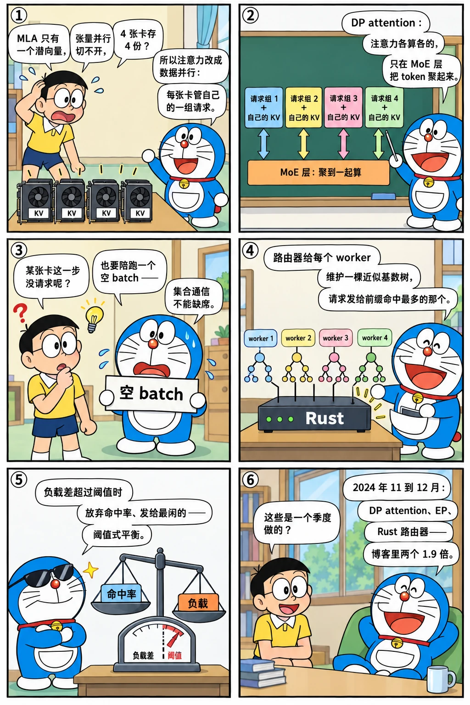

# 多卡：DP attention、EP 与 Rust 路由器的诞生

<p class="lead">2024 年第四季度，SGLang 在三个方向上同时越过了"一组 TP rank"的边界：为 DeepSeek 的 MLA 做数据并行注意力（同一个进程组里，注意力按 DP 各算各的、MoE 层再合起来），把 MoE 的专家按 EP 切到不同的卡，以及在引擎之外写一个 Rust 路由器——它维护每个 worker 基数树的近似副本，把请求发给前缀命中最多的那个。三者都在 11 月到 12 月之间从第一个提交走到可用，v0.4 博客给了两个数字：DP attention 让 DeepSeek 的 decode 吞吐提高 1.9 倍，缓存感知路由让吞吐提高 1.9 倍、命中率提高 3.8 倍。</p>

!!! question "自测：能答上来就可以跳过本章"
    1. 对 MLA 模型，为什么张量并行会浪费 KV 显存？DP attention 怎么解决？它要求各 rank 在哪些地方同步？
    2. `prepare_dp_attn_batch` 做了什么？`IDLE` 前向模式为什么存在？
    3. 缓存感知路由器怎么知道每个 worker 缓存了什么？它什么时候放弃命中率去做负载均衡？
    4. 路由器为什么用 Rust 写？它和引擎内的数据并行控制器是什么关系？

??? success "自测参考答案（先自己答，再展开对照）"
    1. MLA 每层只有一个压缩的 KV（相当于一个 KV 头），TP 切不开它，每个 rank 都要存一份完整的 KV；DP attention 让每个 rank 各自服务一组请求、各存自己那组的 KV，注意力部分独立计算，只在 MoE / 稠密 FFN 这类按 token 并行的层上把各 rank 的 token 聚到一起算（all-gather），算完再散回去。各 rank 要在每步同步"我这批有多少 token"（决定 gather 的形状）和"我这批是 decode 还是 extend"（决定能不能走 CUDA Graph）。
    2. 用 `all_gather` 收集所有 rank 的 token 数；如果本 rank 没有 batch 但别的 rank 有，就造一个 `IDLE` 的空 batch 陪跑——因为 MoE 层的集合通信需要所有 rank 参与，不能有人缺席；再用 `all_reduce(MIN)` 判断是否所有 rank 都是 decode，以决定本步能否回放 CUDA Graph。
    3. 它为每个 worker 维护一棵"近似基数树"：请求被发往某个 worker 时，把请求的文本插进该 worker 的树；查询时对每棵树做前缀匹配，匹配率超过 `cache_threshold` 就发给命中最多的 worker。当各 worker 的负载差超过阈值（`balance_abs_threshold` 与 `balance_rel_threshold`）时改为发给最空闲的 worker。树按 LRU 定期淘汰，和 worker 实际的树只是近似一致。
    4. 路由在请求路径上，Python 的 GIL 和 asyncio 在高并发下是瓶颈，Rust 的树操作和 HTTP 转发都更快、更省；而且它要独立于引擎部署（可以挂在多台机器的多个引擎前面）。引擎内的 `DataParallelController` 负责一个实例内的副本分发，路由器负责实例之间。

先看一个六格小剧场，再读正文：

{.aig-comic}

## 时间线

```bash title="multi-gpu-commits.sh"
for h in 3839be2913 530ff541cf f9633fa9b9 976bc302e5 62832bb272 699384cb01 cbedd1db1d 4b0a1c9365 3d32e4a32c 2e4a5907c9 e3b3acfa6f e835a50021; do
  git log -1 --date=short --format='%ad  %h  %s' $h | cut -c1-96
done
```

```text title="输出"
2024-10-28  3839be2913  [Router] Add a rust-based router (#1790)
2024-11-04  530ff541cf  [router] Impl radix tree and set up CI (#1893)
2024-11-10  f9633fa9b9  [rust] cache-aware DP - approx tree (#1934)
2024-11-16  976bc302e5  Support DP MLA (#1970)
2024-11-18  62832bb272  Support cuda graph for DP attention (#2061)
2024-11-20  699384cb01  Set schedule policy more conservative for DP attention (#2096)
2024-11-23  cbedd1db1d  [router] cache-aware load-balancing router v1 (#2114)
2024-11-24  4b0a1c9365  Replace prob based with threshold based load balancing  (#2170)
2024-12-06  3d32e4a32c  Resubmit MoE-EP (#2371)
2024-12-11  2e4a5907c9  [router] Release router 0.1.0 with dynamic scaling and fault tolerance (
2024-12-12  e3b3acfa6f  Rename rust folder to sgl-router (#2464)
2024-12-24  e835a50021  Reorg moe code (#2563)
```

## DP attention：为 MLA 量身定做（#1970）

[上一章](mla-compile.md)讲了 MLA 把每层的 KV 压成一个潜向量。它带来一个并行上的副作用：普通多头注意力可以按 KV 头做张量并行（8 个 KV 头切到 8 张卡），MLA 只有一个潜向量，TP 时**每张卡都要存一份完整的 KV**，8 卡 TP 的 KV 显存效率只有 1/8。11 月 16 日 Ke Bao 的 #1970 "Support DP MLA" 引入了 `--enable-dp-attention`：注意力部分改成数据并行——每个 rank 有自己的调度器、自己的请求、自己的 KV；MoE 和稠密 FFN 层仍按原来的方式并行（专家切分或 TP），各 rank 的 token 在进入这些层之前 all-gather 到一起，算完再按 rank 散回去。

于是 DP attention 的各 rank 既独立（各自调度）又耦合（每步都要一起过 MoE 层）。v0.4.0 的 `Scheduler` 在组好本地 batch 之后多了一步：

```python title="python/sglang/srt/managers/scheduler.py @ v0.4.0 L436-475" linenums="436"
    def prepare_dp_attn_batch(self, local_batch: ScheduleBatch):
        # Check if other DP workers have running batches
        if local_batch is None:
            num_tokens = 0
        elif local_batch.forward_mode.is_decode():
            num_tokens = local_batch.batch_size()
        else:
            num_tokens = local_batch.extend_num_tokens

        local_num_tokens = torch.tensor([num_tokens], dtype=torch.int64)
        global_num_tokens = torch.empty(self.tp_size, dtype=torch.int64)
        torch.distributed.all_gather_into_tensor(
            global_num_tokens,
            local_num_tokens,
            group=self.tp_cpu_group,
        )

        if local_batch is None and global_num_tokens.max().item() > 0:
            local_batch = self.get_idle_batch()

        if local_batch is not None:
            local_batch.global_num_tokens = global_num_tokens.tolist()

            # Check forward mode for cuda graph
            if not self.server_args.disable_cuda_graph:
                forward_mode_state = torch.tensor(
                    (
                        1
                        if local_batch.forward_mode.is_decode()
                        or local_batch.forward_mode.is_idle()
                        else 0
                    ),
                    dtype=torch.int32,
                )
                torch.distributed.all_reduce(
                    forward_mode_state,
                    op=torch.distributed.ReduceOp.MIN,
                    group=self.tp_cpu_group,
                )
                local_batch.can_run_dp_cuda_graph = forward_mode_state.item() == 1
```

三件事：用 `all_gather` 交换各 rank 本步的 token 数（gather 的形状要一致）；本 rank 没活而别人有时造一个 `IDLE` batch 陪跑——集合通信不能缺席；再 `all_reduce(MIN)` 确认所有 rank 都在 decode，才能走 CUDA Graph（11 月 18 日 #2061 加的）。11 月 20 日 #2096 把 DP attention 下的调度策略调得更保守——各 rank 的 batch 大小会互相影响，估计要留余量。

v0.4 博客的数字：DeepSeek 系列在 DP attention 下 decode 吞吐提高 1.9 倍，来源就是 KV 不再重复、能放更大的 batch。这是[第六章](../service/processes.md)"每个 rank 重复调度"设计的一次延伸：DP attention 的各 rank 调度的是**不同**的请求，但通过每步的 all-gather 保持集合通信的一致。

{.aig-svg}

## EP：专家切到不同的卡（#2371）

MoE 模型的另一条并行路是专家并行：每张卡只放一部分专家，token 按路由结果送到专家所在的卡。SGLang 的 EP 在 12 月 6 日 #2371 "Resubmit MoE-EP" 进入主线（之前一次合入被回退），12 月 24 日 #2563 把 MoE 代码整理成 `layers/moe/` 下的 `ep_moe/` 和 `fused_moe_triton/`：前者是 EP 的专家分发与 grouped GEMM，后者是从 vLLM 改编的 Triton fused MoE。这时的 EP 还是"all-to-all 用 NCCL、专家 GEMM 用 Triton"的朴素版本；2025 年 3 月 DeepEP 进来之后才有了[第 18 章](../scale/large-ep.md)的大规模 EP。DP attention + EP 的组合从这个月起成为 DeepSeek 部署的标准形态。

## Rust 路由器：树的近似副本（#1790 → #2114）

论文里"路由器维护元树"的设想（[第一章](../origins/paper.md)）在 10 月 28 日有了实现：#1790 "Add a rust-based router"——一个独立的 HTTP 服务，前面接客户端，后面接多个 SGLang worker。第一版只有轮询和随机；11 月 4 日 #1893 加了基数树，11 月 10 日 #1934 "cache-aware DP - approx tree"，11 月 23 日 #2114 "cache-aware load-balancing router v1"。v0.4.0 的 `rust/src/router.rs` 用一段长注释说明了策略：

```rust title="rust/src/router.rs @ v0.4.0 L15-27,44-92"
pub enum Router {
    RoundRobin {
        worker_urls: Vec<String>,
        current_index: AtomicUsize,
    },
    Random {
        worker_urls: Vec<String>,
    },
    CacheAware {
        /*
            Cache-Aware Load Balancing Router

            This router combines two strategies to optimize both cache utilization and request distribution:
...
            This strategy maintains an approximate radix tree for each worker based on request history,
            eliminating the need for direct cache state queries. The tree stores raw text characters
            instead of token IDs to avoid tokenization overhead.

            Process:
            a. For each request, find the worker with the highest prefix match
            b. If match rate > cache_threshold:
            Route to the worker with highest match (likely has relevant data cached)
            c. If match rate ≤ cache_threshold:
            Route to the worker with smallest tree size (most available cache capacity)
            d. Background maintenance:
            Periodically evict least recently used leaf nodes to prevent memory overflow

            2. Load Balancing (Shortest Queue)
            -------------------------------------------
            This strategy tracks pending request counts per worker and routes new requests
            to the least busy worker when the system is detected to be imbalanced.

            Configuration Parameters:
            ------------------------
            1. cache_threshold: (float, 0.0 to 1.0)
            Minimum prefix match ratio to use highest-match routing.
            Below this threshold, routes to worker with most available cache space.

            2. balance_abs_threshold: (integer)
            Absolute difference threshold for load imbalance detection.
            System is potentially imbalanced if (max_load - min_load) > abs_threshold

            3. balance_rel_threshold: (float)
            Relative ratio threshold for load imbalance detection.
            System is potentially imbalanced if max_load > min_load * rel_threshold
            Used in conjunction with abs_threshold to determine final imbalance state.

            4. eviction_interval_secs: (integer)
            Interval between LRU eviction cycles for the approximate trees.

            5. max_tree_size: (integer)
            Maximum nodes per tree. When exceeded, LRU leaf nodes are evicted
            during the next eviction cycle.
        */
        worker_urls: Vec<String>,
        tree: Arc<Mutex<Tree>>,
        running_queue: Arc<Mutex<HashMap<String, usize>>>,
        processed_queue: Arc<Mutex<HashMap<String, usize>>>,
        cache_threshold: f32,
        balance_abs_threshold: usize,
        balance_rel_threshold: f32,
        _eviction_thread: Option<thread::JoinHandle<()>>,
    },
```

每个 worker 一棵近似树（`tree.rs`，Rust 实现的基数树，支持多租户 / 多 worker 共享节点）：请求发往某个 worker 时把它的文本插进对应的树；查询时对所有树匹配前缀，匹配率高于 `cache_threshold` 就选命中最多的 worker；但如果最忙和最闲的 worker 负载差超过 `balance_abs_threshold` 且比值超过 `balance_rel_threshold`，就放弃命中率、发给最闲的（11 月 24 日 #2170 把概率式的平衡改成了这种阈值式）。一个后台线程按 `eviction_interval_secs` 做 LRU 淘汰，树只是 worker 真实缓存的近似。博客的数字：吞吐 1.9 倍、命中率 3.8 倍（多轮对话类负载）。

12 月 11 日发布 0.1.0：动态加减 worker（`/add_worker`、`/remove_worker`）、健康检查、基于重试的容错；次日目录从 `rust/` 改名 `sgl-router/`。看一下它的规模：

```bash title="router-size.sh"
REF=${REF:-29f6d408c0}
for spec in "v0.4.0 rust" "v0.4.6 sgl-router" "v0.5.0rc0 sgl-router" "$REF sgl-model-gateway"; do
  set -- $spec
  printf '%-11s %-18s %4d 个文件，其中 .rs %3d 个，共 %6d 行 Rust\n' "$1" "$2" "$(git ls-tree -r --name-only "$1" -- "$2" | wc -l)" "$(git ls-tree -r --name-only "$1" -- "$2" | grep -c '\.rs$')" "$(git ls-tree -r --name-only "$1" -- "$2" | grep '\.rs$' | while read -r f; do git show "$1:$f"; done | wc -l)"
done
```

```text title="输出"
v0.4.0      rust                 17 个文件，其中 .rs   5 个，共   2169 行 Rust
v0.4.6      sgl-router           18 个文件，其中 .rs   4 个，共   2660 行 Rust
v0.5.0rc0   sgl-router           50 个文件，其中 .rs  34 个，共  18918 行 Rust
29f6d408c0  sgl-model-gateway   403 个文件，其中 .rs 252 个，共  94747 行 Rust
```

## 设计取舍

| 决定 | 理由 | 代价 |
| --- | --- | --- |
| DP attention 放在同一进程组内 | 注意力独立、MoE 合并，需要每步同步形状 | 各 rank 互相等待；调度要更保守；IDLE 陪跑 |
| EP 先用 NCCL all-to-all + Triton | 快速可用 | 通信与计算串行，大规模时不够（DeepEP 解决） |
| 路由器独立成 Rust 服务 | 可跨机部署、高并发、树操作快 | 两套负载均衡（引擎内 DP 控制器 + 外部路由器）；近似树会漂移 |
| 阈值式平衡优先于命中率 | 防止热点 worker 过载 | 命中率在负载不均时下降 |

## 后来怎么样了

- DP attention 从 MLA 专用变成通用选项，2025 年加入 `--dp-size` 与 `--enable-dp-attention` 的多种组合、DP 下的 LM head 优化，`moe_dense_tp_size` 控制稠密层的并行方式；
- EP：2025-03 DeepEP、2025-05 EPLB 与双 batch 重叠、2025-10 弹性 EP（[第 18 章](../scale/large-ep.md)）；
- 路由器：2025-04 独立目录 `sgl-router/` 持续扩张，加入 PD 分离的路由、多种策略的依赖注入重构（#7987）、工具解析，2025-12 改名 `sgl-model-gateway/`（第 21 章）。

## 练习

**1. IDLE 的必要性。** 如果去掉 `get_idle_batch`，让没活的 rank 直接跳过这一步，会在哪一层卡住？

??? success "参考答案"
    MoE 层的 all-gather / all-to-all 需要进程组里所有 rank 参与；缺席的 rank 会让其他 rank 永远等待（NCCL 集合通信挂起）。IDLE batch 让它以零 token 参与通信。

**2. 近似树的漂移。** 路由器的树和 worker 的真实树在什么情况下会不一致？各举一种"路由器以为命中、实际没命中"和相反的情况。

??? success "参考思路"
    worker 因显存压力淘汰了节点而路由器的 LRU 周期还没到（以为命中、实际没有）；worker 之间通过别的请求（不经过路由器）插入了前缀（实际命中、路由器不知道）。近似带来的只是次优路由，不影响正确性。

**3. 两层负载均衡。** 画出"路由器 → N 个引擎实例 → 每个实例内的 DP 控制器 → DP 副本"的层次，说明 DP attention 的副本为什么不适合由外部路由器直接调度。

??? success "参考思路"
    DP attention 的各 rank 每步同步，属于一个紧耦合的进程组，必须由同一个控制器按步分发；外部路由器只看到实例的 HTTP 入口。

!!! interview "怎么讲清楚"
    "DeepSeek 这类 MLA + MoE 模型怎么部署？"——答"注意力 DP、专家 EP"，解释 TP 为什么浪费 MLA 的 KV，再讲 DP attention 每步要同步什么（token 数、前向模式、IDLE 陪跑）。如果追问多实例，讲缓存感知路由：近似树、命中率阈值与负载阈值的取舍。能说出这些是 2024-11 到 12 月一个季度内落地的，并指出后来的 DeepEP / EPLB 是在这个基础上做的，就是加分项。

## 小结

- [x] #1970（2024-11-16）DP attention：MLA 下注意力按 DP、MoE 合并，每步 all-gather token 数、IDLE 陪跑、all-reduce 决定 CUDA Graph；博客 1.9 倍 decode 吞吐。
- [x] #2371 EP 进入主线，#2563 整理出 `layers/moe/`；大规模 EP 要等 2025 年的 DeepEP。
- [x] Rust 路由器从轮询（#1790）到近似基数树的缓存感知路由（#2114）再到 0.1.0 的动态扩缩与容错；吞吐 1.9 倍、命中率 3.8 倍。
