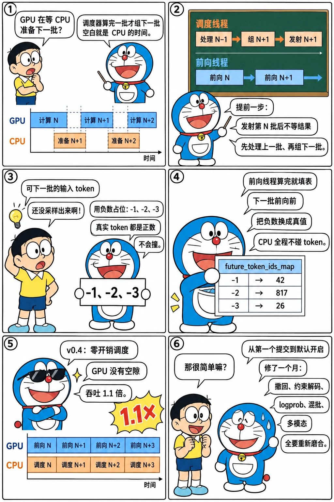

# 重叠调度：把 CPU 藏到 GPU 后面

<p class="lead">v0.4 的头条是"零开销批调度器"：调度器提前一步运行，GPU 在算第 N 批时 CPU 已经在准备第 N+1 批，Nsight 里连续的 decode 之间看不到空隙，吞吐提高 1.1 倍。它的实现只有两个类：<code>Scheduler.event_loop_overlap</code> 和跑在另一个线程里的 <code>TpModelWorkerClient</code>，外加一个巧妙的"未来 token"技巧——下一批的输入里还没采样出来的 token 用负数占位，由前向线程在 GPU 上补上。这一章读 2024 年 10 月 16 日到 11 月 19 日之间从第一个提交到默认开启的全过程，以及它和撤回、约束解码、分块 prefill 的每一次冲突。</p>

!!! question "自测：能答上来就可以跳过本章"
    1. 非重叠的循环里，一步的 CPU 工作有哪些？它们为什么会让 GPU 空闲？
    2. 重叠循环里"提前一步"是什么意思？第 N+1 批的 `input_ids` 在调度时还不知道，怎么办？
    3. `future_token_ids_map` 是什么？为什么用负数做占位？
    4. 重叠模式默认开启之前修了哪些类型的问题？哪些功能一度和它不兼容？

??? success "自测参考答案（先自己答，再展开对照）"
    1. 收请求、准入与前缀匹配、构造 batch 的张量、发射前向、**等前向结束**、把采样结果拷回 CPU、判断结束、增量反分词的准备、把输出发给反分词进程。只要调度器在等 GPU 结果之后才做下一批的准备，GPU 在这段准备时间里就没活干。
    2. 调度线程发射第 N 批后不等结果，立刻处理第 N−1 批的结果并组第 N+1 批。第 N+1 批里 decode 请求的输入 token 正是第 N 批要采样出来的那个，调度时拿不到，于是用一个"未来 token id"（负数索引）占位，前向线程在拿到第 N 批的采样结果后把它写进一张映射表，第 N+1 批前向前把负数索引换成真实 token。
    3. 一张 GPU 上的 int32 表，长度是 `max_running_requests × 3`，位置 k 存"第 k 个未来 token"的真实值。占位用 `-(k+1)`：真实 token id 都是非负的，负数不会和它们混淆，`resolve_future_token_ids` 用 `torch.where(input_ids < 0, map[-input_ids], input_ids)` 一次替换，不需要 CPU 参与。
    4. 竞态（#1712）、CUDA 非法内存访问（#2048、#2070：前向线程还在用的张量被调度线程释放）、logprob（#1795）、撤回（#1860）、约束解码（#2095）、分块 prefill 混批（#2158）；多模态模型一度被禁用重叠（#2235），xgrammar 的掩码要等前向线程（#2377）。

先看一个六格小剧场，再读正文：

{.aig-comic}

## 一个月的提交

```bash title="overlap-commits.sh"
REF=${REF:-29f6d408c0}
git log --reverse --date=short --format='%ad  %h  %s' "$REF" --since=2024-10-15 --until=2024-12-10 | grep -iE 'overlap' | cut -c1-96
```

```text title="输出"
2024-10-16  dbec2f1847  Launch a thread to overlap CPU and GPU (#1687)
2024-10-18  3db43d1b08  Fix `is_all_ready` for overlap copy (#1710)
2024-10-19  769bf11c05  Fix the race condition in overlap mode (#1712)
2024-10-20  b48edff67f  Split the overlapped version of TpModelWorkerClient into a separate file
2024-10-20  cf470fea32  Make token mapping non-blocking in the overlapped mode (#1740)
2024-10-21  7ce3606891  Faster overlap mode scheduler (#1738)
2024-10-25  e646c5901e  Fix logprob in the overlapped mode (#1795)
2024-10-31  b9fd178f1b  Fix retraction + overlap (#1860)
2024-11-15  29ebe3dff4  fix: align enable_overlap_scheduler naming between code and docs (#2038)
2024-11-15  e5c6715003  Fix core (MI300X) with --enable-overlap (#2048)
2024-11-16  edad373135  Fix illegal memory access in overlap mode & Use more fused triton kernel
2024-11-17  a9e90b4bce  [Minor] Fix styles for overlap mode (#2068)
2024-11-17  116685337e  Fix cuda illegal memory access in overlap mode (#2070)
2024-11-19  ffd20fcd03  Make constrained decoding work for overlap scheduler (#2095)
2024-11-19  7d671e4ad2  Enable overlap by default (#2067)
2024-11-20  722530fa01  Enable overlap scheduler by default for the triton attention backend (#2
2024-11-24  731146f6cb  Fix mixed chunked prefill in overlap mode (#2158)
2024-11-27  fb915bd1a2  Disable overlap scheduler for multimodal models (#2235)
2024-12-06  0e7409adb6  Fix the overlap for xgrammar (#2377)
```

10 月 16 日 #1687 "Launch a thread to overlap CPU and GPU" 是起点；四天后 #1726 把重叠版本拆成单独的文件 `tp_worker_overlap_thread.py`；#1738 "Faster overlap mode scheduler" 是博客里那个版本；11 月 19 日 #2067 默认开启。中间二十多个提交几乎都是修 bug——重叠把原本顺序执行的两段代码变成并发，每一处共享状态都成了问题。

## 两个事件循环

v0.4.0 的 `Scheduler` 保留了两个循环。普通的：

```python title="python/sglang/srt/managers/scheduler.py @ v0.4.0 L376-396" linenums="376"
    def event_loop_normal(self):
        """A normal scheduler loop."""
        while True:
            recv_reqs = self.recv_requests()
            self.process_input_requests(recv_reqs)

            batch = self.get_next_batch_to_run()
            if self.server_args.enable_dp_attention:
                batch = self.prepare_dp_attn_batch(batch)

            self.cur_batch = batch

            if batch:
                result = self.run_batch(batch)
                self.process_batch_result(batch, result)
            else:
                # Self-check and re-init some states when the server is idle
                self.check_memory()
                self.new_token_ratio = self.init_new_token_ratio

            self.last_batch = batch
```

`run_batch` 发射前向并**等待结果**，`process_batch_result` 处理结果，然后才进入下一轮。重叠的：

```python title="python/sglang/srt/managers/scheduler.py @ v0.4.0 L399-434" linenums="399"
    def event_loop_overlap(self):
        """A scheduler loop that overlaps the CPU processing and GPU computation."""
        result_queue = deque()

        while True:
            recv_reqs = self.recv_requests()
            self.process_input_requests(recv_reqs)

            batch = self.get_next_batch_to_run()
            self.cur_batch = batch
            if batch:
                result = self.run_batch(batch)
                result_queue.append((batch.copy(), result))

                if self.last_batch is None:
                    # A dummy first batch to start the pipeline for overlap scheduler.
                    # It is now used for triggering the sampling_info_done event.
                    tmp_batch = ScheduleBatch(
                        reqs=None,
                        forward_mode=ForwardMode.DUMMY_FIRST,
                        next_batch_sampling_info=self.tp_worker.cur_sampling_info,
                    )
                    self.process_batch_result(tmp_batch, None)

            if self.last_batch:
                tmp_batch, tmp_result = result_queue.popleft()
                tmp_batch.next_batch_sampling_info = (
                    self.tp_worker.cur_sampling_info if batch else None
                )
                self.process_batch_result(tmp_batch, tmp_result)
            elif batch is None:
                # Self-check and re-init some states when the server is idle
                self.check_memory()
                self.new_token_ratio = self.init_new_token_ratio

            self.last_batch = batch
```

差别只有几行：`run_batch` 返回的 `result` 不再是采样结果而是"未来"，和 batch 的副本一起放进 `result_queue`；本轮先不处理它，而是把**上一轮**的 `(batch, result)` 从队列里取出来处理。于是调度线程的时间线是：发射第 N 批 → 处理第 N−1 批的结果 → 组第 N+1 批 → 发射第 N+1 批 → 处理第 N 批……GPU 永远有一批在算。`DUMMY_FIRST` 是为了让第一轮也有"上一批"可处理，顺便触发采样信息的同步事件。

{.aig-svg}

## 前向线程与未来 token

`TpModelWorkerClient` 包装 `TpModelWorker`，在自己的线程和 CUDA 流里跑前向：

```python title="python/sglang/srt/managers/tp_worker_overlap_thread.py @ v0.4.0 L41-46" linenums="41"
def resolve_future_token_ids(input_ids, future_token_ids_map):
    input_ids[:] = torch.where(
        input_ids < 0,
        future_token_ids_map[torch.clamp(-input_ids, min=0)],
        input_ids,
    )
```

```python title="python/sglang/srt/managers/tp_worker_overlap_thread.py @ v0.4.0 L108-160" linenums="108"
    def forward_thread_func_(self):
        batch_pt = 0
        batch_lists = [None] * 2

        while True:
            model_worker_batch, future_token_ids_ct = self.input_queue.get()
            if not model_worker_batch:
                break

            # Keep a reference of model_worker_batch by storing it into a list.
            # Otherwise, the tensor members of model_worker_batch will be released
            # by pytorch and cause CUDA illegal memory access errors.
            batch_lists[batch_pt % 2] = model_worker_batch
            batch_pt += 1

            # Create event
            self.launch_done = threading.Event()
            copy_done = torch.cuda.Event()

            # Resolve future tokens in the input
            input_ids = model_worker_batch.input_ids
            resolve_future_token_ids(input_ids, self.future_token_ids_map)

            # Run forward
            logits_output, next_token_ids = self.worker.forward_batch_generation(
                model_worker_batch, self.launch_done
            )

            # Update the future token ids map
            bs = len(model_worker_batch.seq_lens)
            self.future_token_ids_map[
                future_token_ids_ct + 1 : future_token_ids_ct + bs + 1
            ] = next_token_ids

            # Copy results to the CPU
            if model_worker_batch.return_logprob:
                logits_output.next_token_logprobs = logits_output.next_token_logprobs[
                    torch.arange(len(next_token_ids), device=self.device),
                    next_token_ids,
                ].to("cpu", non_blocking=True)
                if logits_output.input_token_logprobs is not None:
                    logits_output.input_token_logprobs = (
                        logits_output.input_token_logprobs.to("cpu", non_blocking=True)
                    )
                    logits_output.normalized_prompt_logprobs = (
                        logits_output.normalized_prompt_logprobs.to(
                            "cpu", non_blocking=True
                        )
                    )
            next_token_ids = next_token_ids.to("cpu", non_blocking=True)
            copy_done.record()

            self.output_queue.put((copy_done, logits_output, next_token_ids))
```

调度线程调用 `forward_batch_generation` 时并不前向，只是把 batch 放进 `input_queue`，然后**立刻**分配一段未来 token id 返回：

```python title="python/sglang/srt/managers/tp_worker_overlap_thread.py @ v0.4.0 L181-210" linenums="181"
    def forward_batch_generation(self, model_worker_batch: ModelWorkerBatch):
        # Create a new copy of sampling_info because it will be updated in-place by the scheduler for the next batch.
        sampling_info = model_worker_batch.sampling_info
        sampling_info.update_penalties()
        model_worker_batch.sampling_info = self.cur_sampling_info = dataclasses.replace(
            sampling_info,
            sampling_info_done=threading.Event(),
            scaling_penalties=sampling_info.scaling_penalties,
            linear_penalties=sampling_info.linear_penalties,
        )

        # A cuda stream sync here to avoid the cuda illegal memory access error.
        torch.cuda.current_stream().synchronize()

        # Push a new batch to the queue
        self.input_queue.put((model_worker_batch, self.future_token_ids_ct))

        # Allocate output future objects
        bs = len(model_worker_batch.seq_lens)
        future_next_token_ids = torch.arange(
            -(self.future_token_ids_ct + 1),
            -(self.future_token_ids_ct + 1 + bs),
            -1,
            dtype=torch.int32,
            device=self.device,
        )
        self.future_token_ids_ct = (
            self.future_token_ids_ct + bs
        ) % self.future_token_ids_limit
        return None, future_next_token_ids
```

`future_next_token_ids = arange(-(ct+1), -(ct+1+bs), -1)`：第 N 批的 bs 个请求各领一个负数。调度线程把这些负数当作"已采样的 token"写进请求、组进第 N+1 批的 `input_ids`；前向线程在真正跑第 N 批时得到 `next_token_ids`，写进 `future_token_ids_map[ct+1 : ct+bs+1]`；跑第 N+1 批之前 `resolve_future_token_ids` 把输入里的负数换成表里的真值。整个过程 CPU 不碰 token 值——这是"零开销"的核心：**调度器不需要知道上一批采样了什么，就能组下一批**。表的长度 `max_running_requests × 3` 保证两三批之内的占位不会被覆盖。

前向线程还负责把结果拷回 CPU（`non_blocking=True` 加一个 `copy_done` 事件），调度线程处理第 N 批结果时先等这个事件（`resolve_batch_result`），`batch_lists[batch_pt % 2]` 保留对最近两批的引用、防止张量在前向线程用到之前被释放——注释里写着这是为了避免 "CUDA illegal memory access"，正是 #2048 / #2070 修的那类问题。

## 冲突与修复

重叠把"上一批的结果"推迟了一步，所有依赖"这一步结束就知道结果"的逻辑都要重写：

| 功能 | 冲突 | 修复 |
| --- | --- | --- |
| 撤回（retract） | 撤回要改 batch，但前向线程可能还在用它 | #1860：撤回在处理上一批结果时做，并复制 batch |
| logprob | 结果在前向线程里，调度线程要等拷贝 | #1795：logprob 的拷贝随 `copy_done` 事件 |
| 约束解码 | 掩码要在采样前按 FSM 状态算，而状态依赖上一步采样 | #2095、#2377：掩码在前向线程里等 `sampling_info_done` 事件后再填 |
| 分块 prefill 混批 | 混批里的 decode 请求也用未来 token | #2158 |
| 多模态 | 图片预处理和 `pad_input_ids` 在调度线程 | #2235 先禁用，后来逐步支持 |

11 月 19 日默认开启（#2067），次日 Triton 后端也默认开启（#2105）。v0.4 博客给的数字是 1.1 倍，并附了 Nsight 截图：连续 decode 之间 GPU 没有空隙。

## 设计取舍

- **线程而不是进程。** 前向线程和调度线程共享 CUDA 上下文和张量，传一个 `ModelWorkerBatch` 的引用就够了；代价是 GIL 和共享状态的竞态，前面的 bug 清单就是账单。
- **未来 token 而不是等待。** 另一种做法是让调度线程等到采样结果再组下一批（只重叠"处理结果"的部分）；SGLang 选择连输入都提前占位，重叠得更彻底，代价是一张映射表和所有读 token 的地方都要"解析"一次。
- **保留两个循环。** 普通循环一直留着，作为调试和不兼容功能的后路。

## 后来怎么样了

```bash title="overlap-files.sh"
REF=${REF:-29f6d408c0}
for t in v0.4.0 v0.4.6 v0.5.0rc0 "$REF"; do
  printf '%-11s tp_worker_overlap_thread.py：%4d 行   scheduler.py：%5d 行\n' "$t" "$(git show "$t:python/sglang/srt/managers/tp_worker_overlap_thread.py" 2>/dev/null | wc -l)" "$(git show "$t:python/sglang/srt/managers/scheduler.py" | wc -l)"
done
```

```text title="输出"
v0.4.0      tp_worker_overlap_thread.py： 231 行   scheduler.py： 1500 行
v0.4.6      tp_worker_overlap_thread.py： 240 行   scheduler.py： 2041 行
v0.5.0rc0   tp_worker_overlap_thread.py： 296 行   scheduler.py： 2589 行
29f6d408c0  tp_worker_overlap_thread.py：   0 行   scheduler.py： 5969 行
```

- 2025-10 的路线图（issue #7736）把"overlap scheduler simplification"列为重点，#11762 之后前向线程的逻辑被重新组织，`scheduler.py` 的两个循环仍在；
- 投机解码的 v2（2025 下半年）把 draft / verify 也放进重叠流程，`future_token_ids_map` 的思路被推广到多 token；
- PD 分离的 decode 端、DP attention 的 idle batch 都在重叠循环里增加了自己的分支。

## 练习

**1. 映射表的长度。** 为什么是 `max_running_requests × 3` 而不是 `× 2`？什么情况下 `× 2` 会出错？

??? success "参考思路"
    调度线程可能在前向线程写完第 N 批的结果之前已经发出第 N+1、N+2 批（队列里积压两批），加上正在被解析的那批，最多三批的占位同时有效；`× 2` 时第 N+2 批的占位可能覆盖第 N 批还没被解析的值。

**2. 自己验证一次冲突。** 读 #1860 的 diff（`git show b9fd178f1b`），说明撤回时为什么要 `batch.copy()`，以及撤回的请求的未来 token 怎么处理。

??? success "参考思路"
    撤回发生在处理第 N 批结果的时候，而第 N+1 批已经发出去了；直接改 batch 会影响前向线程正在用的对象，所以在副本上改；被撤回请求的占位 token 不再被任何批引用，表里的值自然失效。

**3. 关掉重叠的代价。** 在基准提交里找到 `--disable-overlap-schedule` 的处理逻辑，列出哪些模式下它会被自动关闭。

??? success "参考思路"
    `git grep -n 'disable_overlap_schedule' 29f6d408c0 -- python/sglang/srt/server_args.py` 看自动关闭的条件（某些注意力后端、某些投机解码配置、特定硬件）。

!!! interview "面试怎么答"
    "推理引擎怎么做 CPU 和 GPU 的重叠？"——讲 SGLang 的三件套：调度线程提前一步（结果队列延迟一轮处理）、前向线程独占 CUDA 流、未来 token 用负数占位并在 GPU 上解析。然后讲代价：所有依赖"结果已知"的逻辑（撤回、约束解码、logprob、混批）都要改，默认开启前花了一个月修竞态。再对照 vLLM V1 的异步调度（`AsyncScheduler`）说明两者思路相近、实现不同。

## 小结

- [x] 2024-10-16 #1687 起步，11-19 #2067 默认开启；v0.4 博客：1.1 倍、GPU 无空隙。
- [x] 实现：`event_loop_overlap` 延迟一轮处理结果 + `TpModelWorkerClient` 的前向线程 + 负数占位的未来 token 在 GPU 上解析。
- [x] 代价是并发带来的竞态和与撤回、约束解码、混批、多模态的逐一磨合；两个循环都保留至今。
