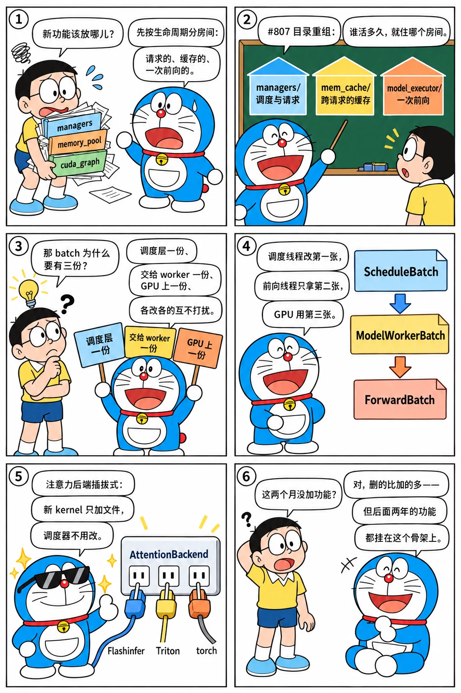

# 目录大重组：mem_cache、model_executor 与注意力后端

<p class="lead">2024 年 7 月底到 10 月初的两个月里，SGLang 的运行时被重新切了一遍：<code>mem_cache/</code>、<code>model_executor/</code>、<code>sampling/</code>、<code>layers/attention/</code> 四个目录在这期间出现，<code>InputMetadata</code> 改名 <code>ForwardBatch</code>，批次数据结构分成调度层、worker 层和前向层三份，注意力从"一个类里 if-else 选 kernel"变成一组可插拔的后端。这些改动没有一个带来性能数字，却决定了后面两年所有新功能挂在哪里。这一章把这次重组当作"模块边界是怎么被发现的"来读。</p>

!!! question "自测：能答上来就可以跳过本章"
    1. `ScheduleBatch`、`ModelWorkerBatch`、`ForwardBatch` 三个批次结构各在哪一层、各装什么？为什么要三份？
    2. `AttentionBackend` 接口有哪些方法？为什么 CUDA Graph 相关的方法占了一半？
    3. 2024-07-29 的 #807 把哪些文件搬到了哪里？今天的目录结构里哪些来自它？
    4. 把采样搬进 `sampling/` 和把分配状态搬到 CPU（#1557）分别解决什么问题？

??? success "自测参考答案（先自己答，再展开对照）"
    1. `ScheduleBatch`（`managers/schedule_batch.py`）在调度器里：请求对象列表、前缀匹配结果、准入与撤回用的元信息，全是 CPU 侧的 Python 对象；`ModelWorkerBatch` 是调度器交给 worker 的"最小必要集合"（input_ids、seq_lens、槽位、采样信息……），可以跨线程 / 进程传递，不带调度器的私有状态；`ForwardBatch`（`model_executor/forward_batch_info.py`）是 worker 在 GPU 上为一次前向准备的张量和注意力元数据。三份对应三个所有者，重叠调度时调度线程和前向线程各改各的，互不干扰。
    2. `init_forward_metadata`（每次前向前准备元数据）、`init_cuda_graph_state`、`init_forward_metadata_capture_cuda_graph`、`init_forward_metadata_replay_cuda_graph`、`get_cuda_graph_seq_len_fill_value`、`forward_decode` / `forward_extend`。CUDA Graph 要求固定的缓冲区和可回放的元数据更新，每个后端的做法不同（FlashInfer 的 indptr/indices 缓冲区、Triton 的 kv_indptr），所以接口把"捕获时怎么填"和"回放时怎么填"交给后端。
    3. `managers/controller/` 压平进 `managers/`（`controller_single.py`、`controller_multi.py`、`tp_worker.py`、`schedule_batch.py`、`policy_scheduler.py`），`radix_cache.py` 和 `memory_pool.py` 进 `mem_cache/`，`model_runner.py` 和 `cuda_graph_runner.py` 进 `model_executor/`。今天的 `mem_cache/`、`model_executor/`、`managers/schedule_batch.py`、`managers/schedule_policy.py` 都源于此。
    4. `sampling/`（2024-08-08）把采样参数、惩罚项、批量采样信息从 `infer_batch.py` 里拆出来，让采样能进 CUDA Graph（#1201）并支持更多参数；#1557 把槽位的空闲状态从 GPU 张量（`torch.nonzero` 扫描）搬到 CPU 的空闲列表，分配不再需要 GPU 同步。

先看一个六格小剧场，再读正文：

{.aig-comic}

## 两个月的提交清单

```bash title="restructure-commits.sh"
for h in cdcbde5fc3 87e8c090e9 ab7875941b 75ce37f401 3a6e8b6d78 fec185ce0c 3efa798116 f86c1e611f 3f0fe08d37 36d5acfca5 63ba2f8d7b 99ec439da4 f202ed9712 4ae0969c0a 32eb6e96f2; do
  git log -1 --date=short --format='%ad  %h  %s' $h | cut -c1-96
done
```

```text title="输出"
2024-07-29  cdcbde5fc3  Code structure refactor (#807)
2024-08-06  87e8c090e9  Organize code (rename, movement) (#953)
2024-08-08  ab7875941b  feat: frequency, min_new_tokens, presence, and repetition penalties (#97
2024-08-26  75ce37f401  Move sampler into CUDA graph (#1201)
2024-09-10  3a6e8b6d78  [Minor] move triton attention kernels into a separate folder (#1379)
2024-09-11  fec185ce0c  Refactor attention backend (#1381)
2024-09-12  3efa798116  Support cuda graph in the triton attention backend (#1401)
2024-09-29  f86c1e611f  Move scheduler code from tp_worker.py to scheduler.py (#1538)
2024-09-29  3f0fe08d37  Let ModelRunner take InputMetadata as input, instead of ScheduleBatch (#
2024-09-30  36d5acfca5  Rename InputMetadata -> ForwardBatch (#1543)
2024-09-30  63ba2f8d7b  Clean up batch data structures: Introducing ModelWorkerBatch (#1544)
2024-09-30  99ec439da4  Organize Attention Backends (#1547)
2024-10-01  f202ed9712  [Refactor] Simplify io_struct and tokenizer_manager (#1549)
2024-10-02  4ae0969c0a  Move status check in the memory pool to CPU (#1557)
2024-10-03  32eb6e96f2  Organize sampling batch info better (#1562)
```

看 `srt/` 一级目录在三个版本里的样子：

```bash title="srt-dirs.sh"
for t in v0.2.0 v0.3.0 v0.4.0; do
  echo "== $t"
  git ls-tree -r --name-only $t -- python/sglang/srt | grep '\.py$' | awk -F/ '{print (NF > 4 ? $4 "/" : $4)}' | sort | uniq -c | sort -rn | awk '{printf "   %3d %s\n", $1, $2}'
done
```

```text title="输出"
== v0.2.0
    22 models/
    11 managers/
     9 layers/
     4 constrained/
     2 openai_api/
     2 model_loader/
     1 utils.py
     1 server_args.py
     1 server.py
     1 sampling_params.py
     1 model_config.py
     1 mm_utils.py
     1 memory_pool.py
     1 hf_transformers_utils.py
     1 flush_cache.py
     1 conversation.py
== v0.3.0
    25 models/
    12 layers/
     8 sampling/
     8 managers/
     5 mem_cache/
     4 constrained/
     3 model_executor/
     2 openai_api/
     2 configs/
     1 utils.py
     1 server_args.py
     1 server.py
     1 model_config.py
     1 mm_utils.py
     1 hf_transformers_utils.py
     1 conversation.py
== v0.4.0
    41 models/
    26 layers/
    13 distributed/
    11 managers/
     8 sampling/
     6 configs/
     5 mem_cache/
     5 constrained/
     4 model_loader/
     3 model_executor/
     3 lora/
     2 openai_api/
     2 metrics/
     1 utils.py
     1 server_args.py
     1 server.py
     1 model_parallel.py
     1 mm_utils.py
     1 hf_transformers_utils.py
     1 conversation.py
     1 _custom_ops.py
```

v0.2.0 只有 `managers/`、`models/`、`layers/`、`constrained/` 和一堆散落的顶层文件；v0.3.0 多了 `mem_cache/`、`model_executor/`、`sampling/`、`configs/`；v0.4.0 又多了 `distributed/`、`lora/`、`metrics/`、`model_loader/`。按今天的目录看，2024 年 8–9 月是"骨架定型"的时候。

## 第一刀：按生命周期分目录（#807、#953）

[第六章](../service/processes.md)讲过 #807 把 `controller/` 压平。它更深的含义是按**对象的生命周期**分目录：

| 目录 | 放什么 | 生命周期 |
| --- | --- | --- |
| `managers/` | 进程、调度、请求与批次 | 跟着请求走 |
| `mem_cache/` | 基数树、内存池 | 服务整个生命周期，跨请求共享 |
| `model_executor/` | `ModelRunner`、CUDA Graph、前向元数据 | 跟着一次前向走 |
| `layers/` | 模型里的层（注意力、线性、采样……） | 无状态或只有权重 |
| `sampling/`（08-08） | 采样参数、惩罚项、批量采样信息 | 跟着 batch 走，但独立于调度 |

一周后的 #953 "Organize code (rename, movement)" 把 `InputMetadata` 搬进 `model_executor/forward_batch_info.py`——它要到两个月后才改名，但位置先对了。

## 第二刀：注意力后端（#1379、#1381、#1547）

初版的 `RadixAttention` 用 `if use_flashinfer` 在两套 kernel 之间切换（[第二章](../origins/first-commit.md)），MLA 来了之后又多了一组分支。9 月 11 日 #1381 "Refactor attention backend" 把 175 行的 `RadixAttention` 缩到不到 50 行，新建 `attention_backend.py`（383 行）承接所有 kernel 相关的逻辑；9 月 30 日 #1547 再把它拆成目录：`layers/attention/__init__.py` 定义接口，`flashinfer_backend.py`、`triton_backend.py` 各一个实现，Triton kernel 搬进 `triton_ops/`。v0.4.0 时的接口：

```python title="python/sglang/srt/layers/attention/__init__.py @ v0.4.0 L11-82" linenums="11"
class AttentionBackend(ABC):
    """The base class of attention backends"""

    @abstractmethod
    def init_forward_metadata(self, forward_batch: ForwardBatch):
        """Init the metadata for a forward pass."""
        raise NotImplementedError()

    def init_cuda_graph_state(self, max_bs: int):
        """Init the global shared states for cuda graph."""
        raise NotImplementedError()

    def init_forward_metadata_capture_cuda_graph(
        self,
        bs: int,
        req_pool_indices: torch.Tensor,
        seq_lens: torch.Tensor,
        encoder_lens: Optional[torch.Tensor] = None,
    ):
        """Init the metadata for a forward pass for capturing a cuda graph."""
        raise NotImplementedError()

    def init_forward_metadata_replay_cuda_graph(
        self,
        bs: int,
        req_pool_indices: torch.Tensor,
        seq_lens: torch.Tensor,
        seq_lens_sum: int,
        encoder_lens: Optional[torch.Tensor] = None,
    ):
        """Init the metadata for a forward pass for replying a cuda graph."""
        raise NotImplementedError()

    def get_cuda_graph_seq_len_fill_value(self):
        """Get the fill value for padded seq lens. Typically, it is 0 or 1."""
        raise NotImplementedError()

    def forward(
        self,
        q: torch.Tensor,
        k: torch.Tensor,
        v: torch.Tensor,
        layer: RadixAttention,
        forward_batch: ForwardBatch,
    ):
        """Run forward on an attention layer."""
        if forward_batch.forward_mode.is_decode():
            return self.forward_decode(q, k, v, layer, forward_batch)
        else:
            return self.forward_extend(q, k, v, layer, forward_batch)

    def forward_decode(
        self,
        q: torch.Tensor,
        k: torch.Tensor,
        v: torch.Tensor,
        layer: RadixAttention,
        forward_batch: ForwardBatch,
    ):
        """Run a forward for decode."""
        raise NotImplementedError()

    def forward_extend(
        self,
        q: torch.Tensor,
        k: torch.Tensor,
        v: torch.Tensor,
        layer: RadixAttention,
        forward_batch: ForwardBatch,
    ):
        """Run a forward for extend."""
        raise NotImplementedError()
```

八个方法（含分发用的 `forward`）里四个和 CUDA Graph 有关，这不是偶然：[第九章](../service/v02.md)讲过 CUDA Graph 要求固定缓冲区，而注意力是唯一需要"按 batch 变化的元数据"（每个请求的 KV 位置、长度）的层。把"捕获时怎么准备元数据、回放时怎么更新元数据"交给后端，`CudaGraphRunner` 就不必知道后端的细节。`forward` 只按模式分发到 `forward_decode` / `forward_extend`，`RadixAttention` 层只剩下调用 `forward_batch.attn_backend.forward(q, k, v, self, forward_batch)`。

有了这个接口，9 月 12 日 #1401 让 Triton 后端也支持 CUDA Graph，v0.4.0 多了 `torch_native_backend.py`（纯 PyTorch，用于调试和没有 kernel 的平台）和 `double_sparsity_backend.py`（稀疏注意力实验）。后端数量后来的增长：

```bash title="attention-backends.sh"
REF=${REF:-29f6d408c0}
for t in v0.4.0 v0.4.6 v0.5.0rc0 "$REF"; do
  printf '%-11s %3d 个后端文件：' "$t" "$(git ls-tree -r --name-only "$t" -- python/sglang/srt/layers/attention | grep -c '_backend\.py$')"
  git ls-tree -r --name-only "$t" -- python/sglang/srt/layers/attention | grep '_backend\.py$' | sed 's|.*/||; s|_backend\.py||' | tr '\n' ' ' | cut -c1-110; echo
done
```

```text title="输出"
v0.4.0        4 个后端文件：double_sparsity flashinfer torch_native triton 

v0.4.6        8 个后端文件：base_attn double_sparsity flashattention flashinfer flashinfer_mla flashmla torch_native triton 

v0.5.0rc0    17 个后端文件：aiter ascend base_attn cutlass_mla double_sparsity dual_chunk_flashattention flashattention flashinfer flashin

29f6d408c0   34 个后端文件：aiter base_attn cutedsl_mla deepseek_v4 deepseek_v4_trtllm dots_hybrid dsa_topk paged_mqa_logits dsa flashatte
```

## 第三刀：三份批次（#1538、#1541、#1543、#1544）

9 月 29–30 日四个连续的提交完成了批次数据结构的分层。先是 #1538 把调度代码搬进 `scheduler.py`；#1541 让 `ModelRunner` 接收 `InputMetadata` 而不是 `ScheduleBatch`——执行层不再看到调度层的对象；#1543 把 `InputMetadata` 改名为 `ForwardBatch`；#1544 引入中间的 `ModelWorkerBatch`。v0.4.0 的 `ForwardBatch` 开头：

```python title="python/sglang/srt/model_executor/forward_batch_info.py @ v0.4.0 L50-64,85-118"
class ForwardMode(IntEnum):
    # Prefill a new sequence. This is deprecated now. "EXTEND" covers this case.
    PREFILL = auto()
    # Extend a sequence. The KV cache of the beginning part of the sequence is already computed (e.g., system prompt).
    EXTEND = auto()
    # Decode one token.
    DECODE = auto()
    # Contains both EXTEND and DECODE when doing chunked prefill.
    MIXED = auto()
    # No sequence to forward. For data parallel attention, some workers wil be IDLE if no sequence are allocated.
    IDLE = auto()

    # A dummy first batch to start the pipeline for overlap scheduler.
    # It is now used for triggering the sampling_info_done event for the first prefill batch.
    DUMMY_FIRST = auto()
...
@dataclass
class ForwardBatch:
    """Store all inputs of a forward pass."""

    # The forward mode
    forward_mode: ForwardMode
    # The batch size
    batch_size: int
    # The input ids
    input_ids: torch.Tensor
    # The indices of requests in the req_to_token_pool
    req_pool_indices: torch.Tensor
    # The sequence length
    seq_lens: torch.Tensor
    # The indices of output tokens in the token_to_kv_pool
    out_cache_loc: torch.Tensor

    # The sum of all sequence lengths
    seq_lens_sum: int

    # For logprob
    return_logprob: bool = False
    top_logprobs_nums: Optional[List[int]] = None

    # Position information
    positions: torch.Tensor = None

    # For extend
    extend_num_tokens: Optional[int] = None
    extend_seq_lens: Optional[torch.Tensor] = None
    extend_prefix_lens: Optional[torch.Tensor] = None
    extend_start_loc: Optional[torch.Tensor] = None
    extend_prefix_lens_cpu: Optional[List[int]] = None
    extend_seq_lens_cpu: Optional[List[int]] = None
```

`ForwardMode` 比初版多了 `MIXED`（分块 prefill 和 decode 混批）、`IDLE`（DP attention 下本 rank 没活也要陪跑）和 `DUMMY_FIRST`（重叠调度启动用）。`ForwardBatch` 的字段全是 GPU 张量或注意力后端需要的元数据。中间层 `ModelWorkerBatch`：

```python title="python/sglang/srt/managers/schedule_batch.py @ v0.4.0 L1136-1168" linenums="1136"
@dataclasses.dataclass
class ModelWorkerBatch:
    # The batch id
    bid: int
    # The forward mode
    forward_mode: ForwardMode
    # The input ids
    input_ids: torch.Tensor
    # The indices of requests in the req_to_token_pool
    req_pool_indices: torch.Tensor
    # The sequence length
    seq_lens: torch.Tensor
    # The indices of output tokens in the token_to_kv_pool
    out_cache_loc: torch.Tensor

    # The sum of all sequence lengths
    seq_lens_sum: int

    # The memory pool operation records
    req_to_token_pool_records: Optional[List[Tuple[Tuple, torch.Tensor]]]

    # For logprob
    return_logprob: bool
    top_logprobs_nums: Optional[List[int]]

    # For DP attention
    global_num_tokens: Optional[List[int]]
    can_run_dp_cuda_graph: bool

    # For extend
    extend_num_tokens: Optional[int]
    extend_seq_lens: Optional[List[int]]
    extend_prefix_lens: Optional[List[int]]
```

它是 `ScheduleBatch.get_model_worker_batch()` 的产物，只带 worker 需要的字段，可以放进队列交给另一个线程——这正是三周后重叠调度（[第 12 章](overlap.md)）需要的：调度线程继续改 `ScheduleBatch`，前向线程只拿 `ModelWorkerBatch`。

{.aig-svg}

## 第四刀：分配状态上 CPU（#1557）

初版的 `TokenToKVPool.alloc` 用 `torch.nonzero` 在 GPU 上扫空闲位（[第二章](../origins/first-commit.md)）。10 月 2 日的 #1557 "Move status check in the memory pool to CPU" 把空闲槽位改成 CPU 上的索引张量：分配是切片、释放是拼接，不再触发 GPU kernel 和同步。这是重叠调度的另一个前提——调度线程里的分配不能等 GPU。同一周 #1549 简化了 `io_struct` 和 `TokenizerManager`，#1562 整理了 `SamplingBatchInfo`，#1555 / #1556 把正则 FSM 和 `ScheduleBatch` 从采样信息里摘出去。这一组"简化"提交加起来删的行比加的多。

## 设计取舍

这次重组没有新功能，为什么值得花两个月？从后面的历史看，它买到了三样东西：

1. **新后端只加文件不改调度。** FlashAttention 3（2025-03）、FlashMLA、TRT-LLM MLA、AITER、Ascend、CPU……每个都是 `layers/attention/` 下的一个文件加注册，`scheduler.py` 不用动。
2. **重叠调度只改两个类。** `Scheduler.event_loop_overlap` 和 `TpModelWorkerClient`，因为批次已经分成三层。
3. **内存池能换实现。** `mem_cache/` 独立之后，MLA 池、分层缓存、页大小 > 1、SWA 池都是在这个目录下加类。

代价是概念变多：读源码的人要先弄清三个 batch、两个 pool、一个 backend 的关系——[推理系统手册的源码导读](serving://source/sglang/)就是按这套概念写的。

## 后来怎么样了

- `layers/attention/` 到基准提交有 139 个文件、二十多个后端，外加 `hybrid_attn_backend` 这类组合器；
- `model_executor/forward_batch_info.py` 的 `ForwardBatch` 字段数翻了几倍（多模态、DP attention、投机解码、PD 分离各加自己的字段），2025 年起用 mixin 拆分；
- `managers/schedule_batch.py` 近 4000 行，`Req` 和 `ScheduleBatch` 仍是核心；
- `mem_cache/` 从 5 个文件长到 156 个（[第三章](../origins/radix-v1.md)末尾的脚本）。

## 练习

**1. 三个 batch 的字段对比。** 在 v0.4.0 里分别数一数 `ScheduleBatch`、`ModelWorkerBatch`、`ForwardBatch` 的字段数，并找出同时出现在三者里的字段。

??? success "参考思路"
    `git show v0.4.0:python/sglang/srt/managers/schedule_batch.py | sed -n '471,560p'` 看 `ScheduleBatch` 的 dataclass 字段，`ModelWorkerBatch` 在 1137 行起，`ForwardBatch` 在 `forward_batch_info.py` 86 行起。`input_ids`、`req_pool_indices`、`seq_lens`、`out_cache_loc`、`forward_mode` 三者都有：它们是从调度到前向一路传递的"主键"。

**2. 后端接口的变化。** 比较 v0.4.0 和基准提交的 `layers/attention/base_attn_backend.py`（或 `__init__.py`）里的方法列表，说出新增的方法各为哪个功能服务。

??? success "参考思路"
    `git show 29f6d408c0:python/sglang/srt/layers/attention/base_attn_backend.py | grep 'def '`。新增的通常和投机解码（draft / verify 的元数据）、分页 KV（page size）、PD 分离和 DP attention 有关。

**3. 删得比加得多的一周。** 用 `git log --shortstat --since=2024-09-28 --until=2024-10-05 -- python/sglang/srt` 统计这一周的增删行数。

??? success "参考思路"
    把每个提交的 insertions / deletions 相加；重构周的删除行数接近或超过新增，说明这是在还技术债而不是加功能。

!!! interview "面试怎么答"
    "推理引擎的模块应该怎么划分？"——用 SGLang 这次重组回答：按生命周期分目录（请求 / 批次 / 服务级缓存 / 一次前向 / 无状态的层），批次按所有者分成调度层、worker 层、前向层三份，注意力后端通过接口把"元数据怎么准备"交给实现。再说明这些边界后来带来了什么（新后端只加文件、重叠调度只改两个类）。

## 小结

- [x] 2024-07-29 → 10-03：`mem_cache/`、`model_executor/`、`sampling/`、`layers/attention/` 出现，`InputMetadata` → `ForwardBatch`，批次分成三层。
- [x] `AttentionBackend` 接口的一半方法服务于 CUDA Graph，把"元数据怎么准备"交给后端。
- [x] 分配状态搬到 CPU、采样独立成目录，为三周后的重叠调度扫清障碍。
