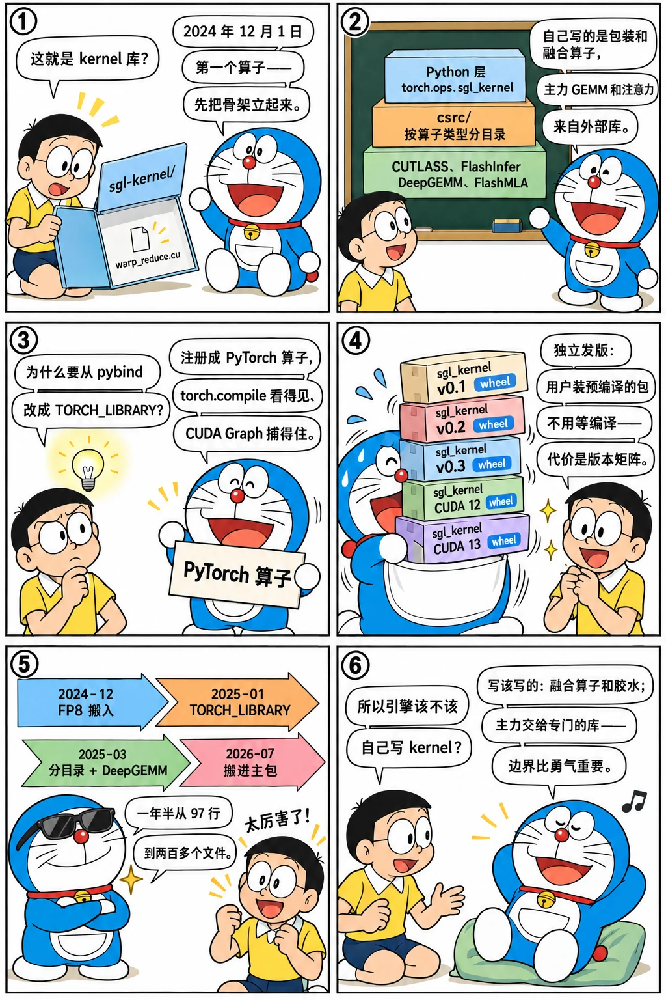

# sgl-kernel：自己写算子的起点

<p class="lead">2024 年 11 月 30 日，仓库里多了一个几乎空的目录 <code>sgl-kernel/</code>；第二天它有了 PyPI 包和一个 97 行的 warp 归约示例。一年半之后它有两百多个文件，覆盖 all-reduce、注意力、GEMM、MoE、量化、采样和投机解码的 kernel，并把 CUTLASS、FlashInfer、DeepGEMM、FlashMLA 等外部库包成同一套 PyTorch 算子；2026 年 7 月它被搬进 <code>python/sglang/kernels/</code>。这一章讲它为什么出现（去 vLLM 依赖、多硬件、为自己的调度定制 kernel）、怎么组织（TORCH_LIBRARY 注册、按算子类型分目录、独立发版），以及"自己写 kernel"在这个项目里的边界。</p>

!!! question "自测：能答上来就可以跳过本章"
    1. sgl-kernel 出现之前，SGLang 的自定义 kernel 从哪里来？出现之后哪些东西第一批搬了进去？
    2. 为什么 2025 年 1 月要从 `PYBIND11_MODULE` 改成 `TORCH_LIBRARY`？
    3. sgl-kernel 为什么独立发版（自己的 PyPI 包、自己的版本号）？这带来什么麻烦？
    4. 它和 FlashInfer、CUTLASS、DeepGEMM 是什么关系：替代还是包装？

??? success "自测参考答案（先自己答，再展开对照）"
    1. 之前：Triton kernel（自己写在 `layers/` 里）、FlashInfer（注意力、采样）、vLLM 的 `_custom_ops`（RMSNorm、激活、量化、all-reduce 等 CUDA 算子）。第一批搬进去的是 FP8 量化相关的算子（#2370 "Move FP8 to SGLang"，2024-12-06）、自定义 all-reduce、MoE 的对齐与 top-k 等——都是原来依赖 vLLM 的部分。
    2. `TORCH_LIBRARY` 把 kernel 注册成 PyTorch 的算子（有 schema、支持 `torch.compile` 的追踪、能被 CUDA Graph 捕获、有 meta 实现可做形状推断），`PYBIND11_MODULE` 只是把 C++ 函数暴露给 Python，编译器看不见它。
    3. kernel 的编译要几十分钟到几小时、依赖特定的 CUDA / torch 版本，独立成包后用户 `pip install sgl-kernel` 拿预编译的 wheel，主包的发布和 kernel 的发布解耦。麻烦是版本匹配：主包每个版本要求特定范围的 sgl-kernel，升级时要两边同步，CI 要同时测多个组合。
    4. 包装为主、替代为辅：CUTLASS 的 GEMM、FlashInfer 的部分 kernel、DeepGEMM 的分组 GEMM、FlashMLA 的 MLA decode 都通过 sgl-kernel 以统一的 PyTorch 算子暴露；自己写的主要是胶水、融合算子（量化 + 转置、MoE 的对齐与门控）和外部库没覆盖的部分（如轻量注意力的 decode）。

先看一个六格小剧场，再读正文：

{.aig-comic}

## 从一个 warp 归约开始

```bash title="sgl-kernel-commits.sh"
for h in 419a57e771 5c91a315d7 47eb139f81 84d96b3ae5 9286740eff 6b45a21d16 110e006673 c553e1604c 54b9a2de0a c32c4ef79c; do
  git log -1 --date=short --format='%ad  %h  %s' $h | cut -c1-96
done
```

```text title="输出"
2024-11-30  419a57e771  minor: add sgl-kernel dir (#2261)
2024-12-01  5c91a315d7  feat: support sgl-kernel pypi (#2302)
2024-12-01  47eb139f81  feat: use warp reduce as a simple example (#2304)
2024-12-06  84d96b3ae5  Move FP8 to SGLang (#2370)
2025-01-26  9286740eff  feat: refactor sgl-kernel and use TORCH_LIBRARY instead of PYBIND11_MODU
2025-03-03  6b45a21d16  Reorganize c++ source files in sgl-kernel with multiple folders  (#4025)
2025-03-03  110e006673  Reorganize python source files in sgl-kernel with multiple files  (#4027
2025-03-10  c553e1604c  DeepGemm integrate to sgl-kernel (#4165)
2025-03-29  54b9a2de0a  remove setup for sgl-kernel (#4899)
2026-07-29  c32c4ef79c  [Kernel] Move sgl-kernel under sglang.kernels.aot (#32648)
```

11 月 30 日 #2261 "add sgl-kernel dir"，12 月 1 日 #2302 "support sgl-kernel pypi"，同一天 #2304 放进第一个 kernel——一个 warp 归约的教学示例：

```cuda title="sgl-kernel/src/sgl-kernel/csrc/warp_reduce_kernel.cu @ 47eb139f81 L1-39" linenums="1"
#include <cuda.h>
#include <cuda_runtime.h>
#include <torch/extension.h>

#define FINAL_MASK 0xffffffff
#define BLOCK_SIZE 256

template <typename scalar_t>
__device__ __forceinline__ scalar_t add(scalar_t a, scalar_t b) {
  return a + b;
}

template <typename scalar_t>
__device__ __forceinline__ scalar_t warpReduceSum(scalar_t val) {
#pragma unroll
  for (int offset = 16; offset > 0; offset /= 2) {
    val += __shfl_down_sync(FINAL_MASK, val, offset);
  }
  return val;
}

template <typename scalar_t>
__device__ __forceinline__ scalar_t blockReduceSum(scalar_t val) {
  __shared__ scalar_t shared[32];
  int lane = threadIdx.x % 32;
  int wid = threadIdx.x / 32;

  val = warpReduceSum(val); // First reduce within warp

  if (lane == 0)
    shared[wid] = val; // Write reduced value to shared memory

  __syncthreads(); // Wait for all partial reductions

  // Read from shared memory only if that warp existed
  val = (threadIdx.x < (blockDim.x / 32)) ? shared[lane] : 0;

  if (wid == 0)
    val = warpReduceSum(val); // Final reduce within first warp
```

这个示例的意义不在 kernel 本身，而在它确立的骨架：`csrc/` 放 `.cu`，`ops/__init__.py` 放 Python 侧的包装，`setup.py` 用 `torch.utils.cpp_extension` 编译，发布到 PyPI。五天后 #2370 "Move FP8 to SGLang" 搬进了第一批真正的算子——这正是[第八章](../service/borrow-vllm.md)讲的去 vLLM 依赖在 kernel 层的落点。

## 两次重组

2025 年 1 月 26 日的 #3130 把注册方式从 `PYBIND11_MODULE` 换成 `TORCH_LIBRARY`：

```cpp title="sgl-kernel/csrc/common_extension.cc @ v0.4.6 L1-40" linenums="1"
/* Copyright 2025 SGLang Team. All Rights Reserved.

Licensed under the Apache License, Version 2.0 (the "License");
you may not use this file except in compliance with the License.
You may obtain a copy of the License at

    http://www.apache.org/licenses/LICENSE-2.0

Unless required by applicable law or agreed to in writing, software
distributed under the License is distributed on an "AS IS" BASIS,
WITHOUT WARRANTIES OR CONDITIONS OF ANY KIND, either express or implied.
See the License for the specific language governing permissions and
limitations under the License.
==============================================================================*/
#include <ATen/core/dispatch/Dispatcher.h>
#include <torch/all.h>
#include <torch/library.h>

#include "sgl_kernel_ops.h"

TORCH_LIBRARY_FRAGMENT(sgl_kernel, m) {
  /*
   * From csrc/allreduce
   */

  m.def("get_graph_buffer_ipc_meta", &get_graph_buffer_ipc_meta);
  m.def("register_graph_buffers", &register_graph_buffers);
  m.def("dispose", &dispose);
  m.def("meta_size", &meta_size);
  m.def("register_buffer", &register_buffer);

  m.def(
      "init_custom_ar(int[] ipc_tensors, Tensor rank_data, "
      "int rank, bool full_nvlink) -> int");
  m.impl("init_custom_ar", torch::kCUDA, &init_custom_ar);

  m.def(
      "all_reduce(int fa, Tensor inp, Tensor! out, int reg_buffer, "
      "int reg_buffer_sz_bytes) -> ()");
  m.impl("all_reduce", torch::kCUDA, &all_reduce);
```

每个算子有 schema（参数和返回的类型）、按设备分发的实现（`m.impl(..., torch::kCUDA, ...)`），于是 `torch.compile` 能追踪它、CUDA Graph 能捕获它，形状推断可以靠 meta 实现。3 月 3 日的 #4025 / #4027 把 C++ 源文件按算子类型分目录、Python 包装按功能分文件；3 月 10 日 #4165 把 DeepGEMM 集成进来；3 月 29 日 #4899 去掉 `setup.py`，完全转向 CMake 构建。v0.4.6 的目录：

```bash title="sgl-kernel-dirs.sh"
REF=${REF:-29f6d408c0}
for t in v0.4.6 v0.5.0rc0; do
  echo "== $t：$(git ls-tree -r --name-only $t -- sgl-kernel | wc -l) 个文件，.cu $(git ls-tree -r --name-only $t -- sgl-kernel | grep -c '\.cu$') 个"
  git ls-tree -r --name-only $t -- sgl-kernel/csrc | awk -F/ 'NF > 3 {print $3}' | sort | uniq -c | awk '{printf "   %3d %s\n", $1, $2}'
done
echo "== $REF：python/sglang/kernels/ 有 $(git ls-tree -r --name-only "$REF" -- python/sglang/kernels | wc -l) 个文件，.cu $(git ls-tree -r --name-only "$REF" -- python/sglang/kernels | grep -c '\.cu$') 个"
```

```text title="输出"
== v0.4.6：128 个文件，.cu 29 个
     4 allreduce
     4 attention
    19 cpu
     3 cutlass_extensions
     3 elementwise
    12 gemm
     1 grammar
     5 moe
     5 speculative
== v0.5.0rc0：221 个文件，.cu 58 个
    11 allreduce
     9 attention
    23 cpu
     8 cutlass_extensions
     3 elementwise
    19 gemm
     1 grammar
     1 kvcacheio
    29 moe
     3 spatial
     5 speculative
== 29f6d408c0：python/sglang/kernels/ 有 1426 个文件，.cu 55 个
```

`allreduce/`、`attention/`、`elementwise/`、`gemm/`、`moe/`、`speculative/`、`cpu/`——目录名就是 SGLang 需要的算子种类。`cpu/` 是 2025 年初加的 CPU 后端（Intel 的贡献），说明 sgl-kernel 一开始就不只为 NVIDIA 准备。

{.aig-svg}

## 为什么自己写

三个动机在提交历史里都能找到：

1. **去依赖。** [第八章](../service/borrow-vllm.md)的 26 个提交里，2025-03 那一波（MoE 对齐 #4164、自定义 all-reduce #4210、FP8 量化 #4215、量化模块 #4507）全部落在 sgl-kernel 里。没有自己的 kernel 包，去 vLLM 依赖无从谈起。
2. **为自己的调度定制。** 比如 per-token 量化 kernel "accelerate per token quant by 20-28%"（#4215）、把量化和转置融合、MoE 的 `moe_align_block_size` 与 `fused_gate`——这些融合算子的收益取决于调用方怎么组织数据，通用库不会为某个引擎做。
3. **包装外部库。** CUTLASS 的 FP8 / INT8 GEMM、DeepGEMM 的分组 GEMM、FlashMLA、后来的 FlashInfer 部分 kernel，都通过 sgl-kernel 统一成 PyTorch 算子，调用方不用关心是哪个库在后面。3 月 16 日 #4449 加 FlashMLA 子模块当天被回退（#4470），几天后以另一种方式接入——第三方库的接入方式本身也在试错。

边界也很清楚：注意力的主力仍是 FlashInfer / FlashAttention（[第 19 章](../scale/attention-backends.md)），sgl-kernel 不重写它们；Triton kernel 继续留在 Python 侧（`layers/attention/triton_ops/`、`fused_moe_triton/`），因为改起来快。sgl-kernel 收的是"必须用 C++ / CUDA 写、而且要稳定发布"的那部分。

## 独立发版的代价

sgl-kernel 从第一天起就是独立的 PyPI 包。好处是用户装预编译的 wheel 不用等几十分钟的编译，坏处是版本矩阵：主包的每个版本要求特定范围的 sgl-kernel，CUDA 12.x / 13.x、torch 的多个版本、x86 与 aarch64、CUDA 与 ROCm 各要一份 wheel。看一下它的发布频率：

```bash title="sgl-kernel-releases.sh"
REF=${REF:-29f6d408c0}
echo "2025 年里标题含 sgl-kernel 且含 bump/release/version 的提交：$(git log --format=%s --since=2025-01-01 --until=2025-12-31 "$REF" | grep -i 'sgl-kernel' | grep -icE 'bump|release|version')"
echo "sgl-kernel 相关提交总数（标题含 sgl-kernel）：$(git log --format=%s "$REF" | grep -ic 'sgl-kernel')"
```

```text title="输出"
2025 年里标题含 sgl-kernel 且含 bump/release/version 的提交：112
sgl-kernel 相关提交总数（标题含 sgl-kernel）：491
```

2026 年 7 月 29 日的 #32648 "Move sgl-kernel under sglang.kernels.aot" 把它搬进主包目录 `python/sglang/kernels/`（`aot` 指提前编译的部分，与 Triton 这类即时编译的 kernel 相对）——顶层的 `sgl-kernel/` 目录在基准提交里已经不存在。这一步把"同一个仓库、两个包"的版本矩阵问题收敛了一些，但预编译的 wheel 仍然单独发布。

## 设计取舍

| | 继续依赖 vLLM / FlashInfer 的算子 | 自己的 kernel 包 |
| --- | --- | --- |
| 开发 | 零成本 | 要维护 C++ / CUDA、CMake、多平台 wheel |
| 升级节奏 | 受上游约束 | 自主 |
| 定制 | 不可能 | 融合算子按自己的数据布局做 |
| 多硬件 | 等上游 | ROCm、CPU 自己接 |
| 用户安装 | 一个包 | 两个包要版本匹配 |

SGLang 的选择是"自己的包装层 + 外部库做主力 kernel + 自己写融合与胶水"，和 vLLM 把 `csrc/` 放在主包里编译的做法不同，和 FlashInfer 作为纯 kernel 库也不同。

## 后来怎么样了

- 2025 年：Blackwell（SM100）的 FP4 / FP8 GEMM、MXFP4、cutlass MLA、投机解码的 kernel（`speculative/`）、ROCm 的 hip 实现、`cpu/` 后端持续扩张；
- 2025-08 的 "[sgl-kernel] 1/N Refactor sglang cutlass 3x" 系列重整 CUTLASS 封装；
- 2026-07 搬进主包 `python/sglang/kernels/`，基准提交里有 1400 多个文件（含 CUTLASS 等第三方头文件）。

## 练习

**1. 第一个算子。** 读 #2304 的 `warp_reduce_kernel.cu`，说明它用了哪些 CUDA 原语（`__shfl_down_sync` 等），以及示例为什么选"归约"。

??? success "参考思路"
    warp 内归约用 shuffle 指令，是最小的"需要懂硬件才能写对"的 kernel，适合当模板；CUDA 手册的[归约一章](cuda://kernels/reduction/)讲同样的技巧。

**2. 注册方式的差别。** 在 v0.4.6 里找一个用 `TORCH_LIBRARY` 注册的算子，再找它的 Python 包装，说明调用路径：Python → `torch.ops.sgl_kernel.xxx` → C++。

??? success "参考思路"
    `common_extension.cc` 里的 `m.def("...")` 和 `m.impl(...)`，Python 侧 `sgl_kernel/elementwise.py` 等文件用 `torch.ops.sgl_kernel.<name>` 调用；`torch.compile` 时算子作为一个整体节点出现。

**3. 版本矩阵。** 在基准提交的 `python/pyproject.toml` 里找到对 sgl-kernel 的版本要求，再在 `python/sglang/kernels/` 下找它自己的版本号，说明两者怎么对应。

??? success "参考思路"
    `git show 29f6d408c0:python/pyproject.toml | grep -i kernel`；主包声明 `sgl-kernel==x.y.z` 或范围，kernel 包的版本在它的 `pyproject.toml` / `version.py` 里；发布流程里两者各有 workflow。

!!! interview "面试怎么答"
    "推理引擎要不要自己写 kernel？"——用 sgl-kernel 的历史回答：注意力和 GEMM 的主力交给专门的库（FlashInfer、CUTLASS、DeepGEMM），自己写的是融合算子和胶水（量化 + 转置、MoE 对齐、采样），并用 `TORCH_LIBRARY` 注册成 PyTorch 算子以配合 `torch.compile` 和 CUDA Graph；独立发版换来安装便利，代价是版本矩阵。这个回答说明你知道"写 kernel"在系统里的边界。

## 小结

- [x] 2024-11-30 建目录，12-01 PyPI 包与 warp 归约示例，12-06 FP8 算子搬入：去 vLLM 依赖的 kernel 落点。
- [x] 2025-01 `TORCH_LIBRARY` 注册、03 月按算子类型分目录并集成 DeepGEMM、CMake 构建；目录名就是 SGLang 需要的算子种类。
- [x] 定位：包装外部库 + 自写融合算子与胶水；独立发版的代价是版本矩阵，2026-07 搬进主包的 `kernels/`。
