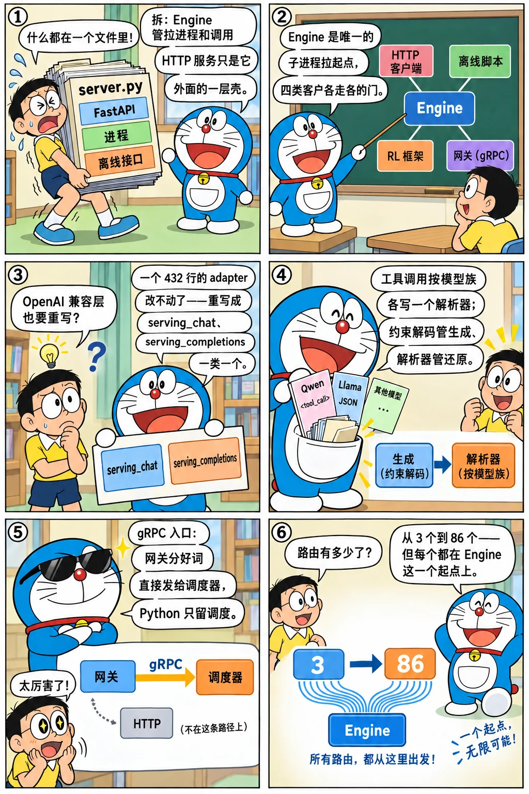

# 入口层重写：entrypoints、OpenAI server 重构、function call 与 gRPC

<p class="lead">2025 年之前，SGLang 的"入口"只有一个 <code>server.py</code>：FastAPI、进程拉起、离线 <code>Runtime</code> 全在一个文件里。2025 年 1 月 19 日 #2996 把它拆成 <code>entrypoints/engine.py</code>（离线引擎、也是子进程拉起的唯一来源）和 <code>http_server.py</code>；6 月 16 日 #7167 用 4400 行把 OpenAI 兼容层重写成按接口分类的 <code>serving_*</code>；5 月起 <code>function_call/</code> 收集了十几种模型的工具调用解析器；9 月 11 日 #10283 加了独立的 gRPC 服务器，让 Rust 网关可以绕过 Python 的 HTTP 直接和调度器说话。这一章讲入口层从"一个文件"到"一个目录"的理由，以及它为谁服务：HTTP 客户端、离线脚本、RL 框架、网关。</p>

!!! question "自测：能答上来就可以跳过本章"
    1. `Engine` 和 `http_server` 是什么关系？RL 框架和网关各通过哪条入口进来？
    2. 2025 年 6 月的 OpenAI 层重构改了什么结构？为什么之前的 `adapter.py` 不够用？
    3. 工具调用的解析为什么要按模型族写一份？它和约束解码（[第四章](../origins/fsm-jump.md)）各管什么？
    4. gRPC 入口解决什么问题？它和 HTTP 入口并存时各自的客户是谁？

??? success "自测参考答案（先自己答，再展开对照）"
    1. `Engine`（`entrypoints/engine.py`）负责拉起调度器 / 反分词子进程并持有 `TokenizerManager`，提供 `generate`、`update_weights_*` 等 Python 方法；`http_server.py` 在 `Engine` 的基础上挂 FastAPI 路由。RL 框架通过 `Engine`（或 `verl_engine.py` 这类包装）在自己的进程里直接调用；网关通过 HTTP，或 2025-09 之后通过 gRPC 直连调度器。
    2. 从一个 432 行的 `adapter.py` 变成 `entrypoints/openai/` 下按接口分类的类：`serving_base.py` 定义公共流程（解析请求 → 转成内部请求 → 调用 → 包装响应，流式与非流式各一条路），`serving_chat.py`、`serving_completions.py`、`serving_embedding.py` 各自实现细节，`protocol.py` 是 pydantic 模型，并配了 1800 行测试。之前的 adapter 把所有接口塞在两个几百行的函数里，每加一个功能（工具调用、推理模型的思考段、多模态、logprobs 格式）都要在同一个函数里加分支。
    3. 每个模型族用不同的标记格式输出工具调用（`<tool_call>` 标签、JSON 数组、特殊 token……），解析器要按格式写，还要支持流式（半个 JSON 时怎么处理）。约束解码保证"生成阶段只产生合法格式"，解析器负责"把生成出来的文本变成结构化的调用"；两者可以配合（structural tag），但职责不同。
    4. Python 的 HTTP 层（FastAPI + pydantic + `TokenizerManager`）在高并发下是瓶颈，而且网关已经做了请求解析、分词模板渲染等工作；gRPC 入口让网关直接把分好词的请求发给调度器，省掉一层。HTTP 入口继续服务普通客户端和兼容 OpenAI 的 SDK。

先看一个六格小剧场，再读正文：

{.aig-comic}

## 从 server.py 到 entrypoints/

```bash title="entrypoints-dir.sh"
REF=${REF:-29f6d408c0}
git log --reverse --date=short --format='%ad  %h  %s' "$REF" -- python/sglang/srt/entrypoints | head -1 | cut -c1-96
for t in v0.4.6 v0.5.0rc0 "$REF"; do
  printf '%-11s %2d 个文件：' "$t" "$(git ls-tree -r --name-only "$t" -- python/sglang/srt/entrypoints | grep -c '\.py$')"
  git ls-tree -r --name-only "$t" -- python/sglang/srt/entrypoints | sed 's|python/sglang/srt/entrypoints/||' | awk -F/ '{print (NF > 1 ? $1 "/" : $1)}' | sort -u | tr '\n' ' ' | cut -c1-150; echo
done
```

```text title="输出"
2025-01-19  03464890e0  Separate two entry points: Engine and HTTP server (#2996)
v0.4.6       5 个文件：EngineBase.py engine.py http_server.py http_server_engine.py verl_engine.py 

v0.5.0rc0   19 个文件：EngineBase.py context.py engine.py harmony_utils.py http_server.py http_server_engine.py openai/ tool.py 

29f6d408c0  66 个文件：EngineBase.py anthropic/ context.py elastic_ep.py engine.py engine_info_bootstrap_server.py engine_score_mixin.py grpc_bridge.py grpc_server.py harmon
```

#2996 的标题说明了意图："Separate two entry points: Engine and HTTP server"。此前 `Runtime`（[第二章](../origins/first-commit.md)里初版就有的离线接口）是在子进程里起一个 HTTP 服务再用 HTTP 调自己；拆分后 `Engine` 直接持有 `TokenizerManager`、在进程内调用，HTTP 服务只是 `Engine` 外面的一层路由。`EngineBase.py` 定义两者共同的接口，`http_server_engine.py` 用 HTTP 客户端实现同一接口（给需要"远程 Engine"的场景），`verl_engine.py`（2025-03 加入、06 月移除，[第 22 章](rl.md)）曾是给 RL 框架的包装。v0.5.0rc0 多了 `openai/` 目录、`context.py`（请求上下文）、`harmony_utils.py`（gpt-oss 的 harmony 格式）；基准提交又多了 `anthropic/`（Anthropic Messages API 兼容）、`grpc_*`、`elastic_ep.py`。

## OpenAI 层的重写

```bash title="openai-refactor.sh"
git show --stat=100 --format='%ad  %an  %s' --date=short 70c471a868 | grep -v '^$' | cut -c1-96
```

```text title="输出"
2025-06-16  Xinyuan Tong  [Refactor] OAI Server components (#7167)
 python/sglang/srt/entrypoints/openai/__init__.py            |   0
 python/sglang/srt/entrypoints/openai/protocol.py            | 539 ++++++++++++++++++
 python/sglang/srt/entrypoints/openai/serving_base.py        | 178 ++++++
 python/sglang/srt/entrypoints/openai/serving_chat.py        | 938 +++++++++++++++++++++++++++++
 python/sglang/srt/entrypoints/openai/serving_completions.py | 467 ++++++++++++++++
 python/sglang/srt/entrypoints/openai/serving_embedding.py   | 227 ++++++++
 python/sglang/srt/entrypoints/openai/utils.py               | 264 +++++++++
 test/pytest.ini                                             |   2 +
 test/srt/openai/test_protocol.py                            | 683 +++++++++++++++++++++++
 test/srt/openai/test_serving_chat.py                        | 634 +++++++++++++++++++++
 test/srt/openai/test_serving_completions.py                 | 176 ++++++
 test/srt/openai/test_serving_embedding.py                   | 316 +++++++++++
 12 files changed, 4424 insertions(+)
```

12 个文件、4424 行、零删除——这是一次"先并行建新路、再切换"的重构：新目录建好、测试写够（1800 行测试超过实现的 40%），再把路由指过去，旧的 `openai_api/` 之后删除。结构：

```bash title="openai-serving.sh"
REF=${REF:-29f6d408c0}
for f in $(git ls-tree -r --name-only "$REF" -- python/sglang/srt/entrypoints/openai | grep '\.py$'); do printf '%5d  %s\n' "$(git show "$REF:$f" | wc -l)" "${f#python/sglang/srt/entrypoints/openai/}"; done
echo "-- serving_base.py 的方法："; git show "$REF:python/sglang/srt/entrypoints/openai/serving_base.py" | grep -E '^    (async )?def ' | sed 's/^ *//; s/(.*//' | tr '\n' ' '; echo
```

```text title="输出"
    0  __init__.py
  102  audio_chunking.py
  289  chat_encoding.py
  469  encoding_dsv32.py
  884  encoding_dsv4.py
  705  encoding_dsv41.py
 2352  protocol.py
    5  realtime/__init__.py
  120  realtime/handler.py
   78  realtime/protocol.py
  741  realtime/session.py
  215  responses_adapters.py
  290  serving_base.py
 3251  serving_chat.py
  204  serving_classify.py
  694  serving_completions.py
  535  serving_decisions.py
  308  serving_embedding.py
  609  serving_rerank.py
 2774  serving_responses.py
  120  serving_score.py
  194  serving_tokenize.py
  809  serving_transcription.py
   99  sse_utils.py
  209  streaming_asr.py
  188  tool_server.py
   39  transcription_adapters/__init__.py
  198  transcription_adapters/base.py
   91  transcription_adapters/glmasr.py
   63  transcription_adapters/granite_speech.py
   46  transcription_adapters/mimo_v2_asr.py
   61  transcription_adapters/qwen2_audio.py
   69  transcription_adapters/qwen3_asr.py
  382  transcription_adapters/whisper.py
  126  usage_processor.py
  389  utils.py
-- serving_base.py 的方法：
def __init__ def _parse_model_parameter def _resolve_lora_path async def handle_request def _request_id_prefix def _generate_request_id_base def _convert_to_internal_request async def _handle_streaming_request async def _handle_non_streaming_request def _validate_request def create_error_response def create_streaming_error_response def extract_custom_labels def extract_routing_key def extract_routed_dp_rank_from_header 
```

`serving_base.py` 定义模板方法：校验请求 → 转成内部的 `GenerateReqInput` → 调用 `TokenizerManager` → 按流式 / 非流式包装响应；每个接口类只实现"怎么转、怎么包"。后来加的 responses API、score、rerank、tokenize 都是新增一个 `serving_*.py`。[第七章](../service/api-multimodal.md)讲过"兼容层只做翻译"的原则，这次重构把它落实成了类层次。

## 工具调用：按模型族的解析器

```bash title="function-call.sh"
REF=${REF:-29f6d408c0}
git log --reverse --date=short --format='%ad  %h  %s' "$REF" -- python/sglang/srt/function_call | head -1 | cut -c1-96
echo "今天 $(git ls-tree -r --name-only "$REF" -- python/sglang/srt/function_call | grep -c '\.py$') 个文件，其中 detector：$(git ls-tree -r --name-only "$REF" -- python/sglang/srt/function_call | grep -c '_detector\.py$') 个"
git ls-tree -r --name-only "$REF" -- python/sglang/srt/function_call | grep '_detector\.py$' | sed 's|.*/||; s|_detector\.py||' | tr '\n' ' ' | cut -c1-200; echo
```

```text title="输出"
2025-05-23  ed0c3035cd  feat(Tool Calling): Support `required` and specific function mode (#6550
今天 47 个文件，其中 detector：37 个
apertus2509 base_format cohere_command4 deepseekv31 deepseekv32 deepseekv3 deepseekv41 deepseekv4 dots gemma4 gigachat35 gigachat3 glm47_moe glm4_moe gpt_oss hermes hunyuan inkling internlm iquest_q1 
```

每个 detector 对应一种模型族的工具调用格式：从输出文本里识别调用的开始标记、解析 JSON 参数、处理流式（增量到达时只发出完整的片段）。`--tool-call-parser` 选择解析器。2025 年 2 月 #3566 的 structural tag 让约束解码能保证"工具调用部分一定是合法 JSON"，解析器则负责把它变成 OpenAI 格式的 `tool_calls`——生成阶段和解析阶段各管一段。2025 年 8 月起网关也有了自己的 Rust 解析器（[下一章](gateway.md)），两边并存。

## gRPC：给网关的第二条入口

2025 年 9 月 11 日 #10283 "Implement Standalone gRPC Server for SGLang Python Scheduler"：一个 gRPC 服务直接连到调度器的 ZMQ 端口，请求用 protobuf 定义（仓库根目录的 `proto/`），分词、模板渲染由网关一侧完成。看看路由数的最后一段增长，以及 gRPC 相关的文件：

```bash title="routes-and-grpc.sh"
REF=${REF:-29f6d408c0}
for t in v0.4.6 v0.5.0rc0 "$REF"; do printf '%-11s %2d 个 HTTP 路由\n' "$t" "$(git show "$t:python/sglang/srt/entrypoints/http_server.py" | grep -c '^@app\.')"; done
echo "gRPC 相关文件：$(git ls-tree -r --name-only "$REF" -- python/sglang/srt/entrypoints python/sglang/srt/grpc proto | grep -iE 'grpc|\.proto$' | sed 's|.*/||' | tr '\n' ' ')"
```

```text title="输出"
v0.4.6      41 个 HTTP 路由
v0.5.0rc0   49 个 HTTP 路由
29f6d408c0  86 个 HTTP 路由
gRPC 相关文件：sglang.proto grpc_bridge.py grpc_server.py 
```

网关侧对应的是 `rust/sglang-grpc` 和 `sglang-renderer`（在 Rust 里渲染聊天模板）——分词与模板渲染从 Python 的 `TokenizerManager` 挪到了 Rust，Python 这边只剩调度与执行。这是"控制面上移"的开始：HTTP 入口服务普通用户，gRPC 入口服务网关。

{.aig-svg}

## 设计取舍

- **Engine 是唯一的子进程拉起点。** HTTP 服务、离线脚本、RL 框架、gRPC 服务都从 `Engine` 起进程，启动逻辑只有一份；代价是 `engine.py` 变成一千多行的"启动大全"。
- **先建新路再切换。** OpenAI 层重写零删除、带测试，切换后再清理旧目录——大重构的安全做法。
- **解析器按模型族。** 没有统一的工具调用格式，只能一种一种写；代价是 detector 文件随模型数增长。
- **两条入口并存。** gRPC 快但只给网关用；HTTP 保持兼容。

## 后来怎么样了

- 2025-08：gpt-oss 的 harmony 格式、推理模型的思考段分离（`parser/reasoning_parser.py`）；
- 2025 下半年：responses API、Anthropic Messages API 兼容、score / rerank 接口；
- gRPC 路径成为网关的默认数据面之一，`rust/sglang-server`（71 个文件）是 Rust 实现的服务层（[下一章](gateway.md)）；
- `entrypoints/` 到基准提交有 66 个文件，`http_server.py` 的路由 86 个。

## 练习

**1. 路由分类。** 用 `git show 29f6d408c0:python/sglang/srt/entrypoints/http_server.py | grep -E '^@app\.(get|post|put|delete)' | sed 's/.*("\([^"]*\)".*/\1/'` 列出全部路由，按"OpenAI 兼容 / 原生生成 / 运行时控制 / 健康与指标"分组计数。

??? success "参考思路"
    `/v1/*` 是兼容层；`/generate`、`/encode`、`/classify` 是原生；`/update_weights*`、`/flush_cache`、`/abort_request`、`/release_memory_occupation` 等是运行时控制（多数为 RL 和运维准备）；`/health*`、`/metrics`、`/get_server_info` 是健康与指标。

**2. 模板方法。** 读基准提交的 `serving_base.py`，画出一次 chat 请求经过的方法调用顺序，标出哪些在子类里重写。

??? success "参考思路"
    `handle_request` → `_validate_request` → `_convert_to_internal_request` → `_handle_streaming_request` / `_handle_non_streaming_request` → `_build_*_response`；转换和构造响应在子类里重写。

**3. 一个 detector。** 选 `qwen25_detector.py`，说明它识别的开始 / 结束标记，以及流式解析时 `parse_streaming_increment` 怎样处理只到了一半的 JSON。

??? success "参考思路"
    Qwen2.5 用 `<tool_call>` … `</tool_call>` 包裹 JSON；流式时缓冲文本，只有在能解析出完整的函数名和部分参数时才发出增量，`</tool_call>` 到达时发出结束。

!!! interview "面试怎么答"
    "推理服务的 API 层怎么设计？"——用 SGLang 的入口层回答：一个 Engine 作为唯一的启动点，HTTP / gRPC / Python 调用是它外面的壳；OpenAI 兼容层只做翻译，并用模板方法把"校验 → 转换 → 调用 → 包装"固定下来，每个接口一个类；工具调用的格式解析按模型族，和约束解码分工；高并发时控制面上移到 Rust 网关、Python 只留调度。

## 小结

- [x] #2996（2025-01-19）：`Engine` 与 `http_server` 分离，`Engine` 是唯一的子进程拉起点；RL 框架与离线脚本直接用 `Engine`。
- [x] #7167（2025-06-16）：OpenAI 层重写成 `serving_*` 类层次，4424 行零删除、带 1800 行测试。
- [x] `function_call/` 按模型族解析工具调用；#10283（2025-09-11）gRPC 入口让网关绕过 Python HTTP，分词与模板渲染上移到 Rust。
