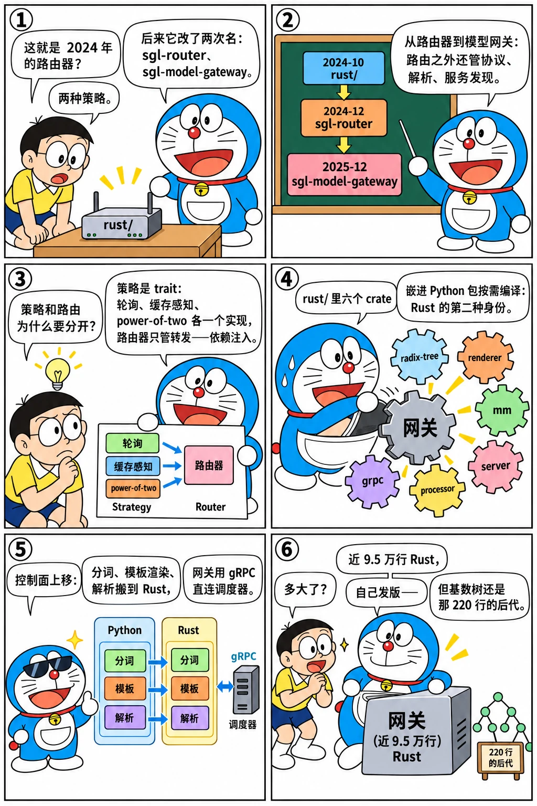

# Rust 网关：从 router 到 sgl-model-gateway

<p class="lead">2024 年 10 月的 Rust 路由器只有五个源文件、两种策略；到基准提交，<code>sgl-model-gateway/</code> 有 400 多个文件、近 9.5 万行 Rust，自己发版（<code>gateway-v*</code> tag），能做缓存感知与 PD 感知的路由、服务发现、工具调用与推理段的解析、指标与追踪，甚至有一个 WASM 插件层；旁边的 <code>rust/</code> 目录里还有六个被 Python 包按需编译的 Rust crate（gRPC、多模态、处理器、基数树、模板渲染、服务层）。这一章顺着 <code>rust/</code> → <code>sgl-router/</code> → <code>sgl-model-gateway/</code> 的三次改名读这条线：Rust 在 SGLang 里是怎么从"一个路由器"变成"控制面"的。</p>

!!! question "自测：能答上来就可以跳过本章"
    1. 路由器三次改名各对应什么定位的变化？
    2. 2025 年 7 月的依赖注入重构（#7987）解决什么问题？策略（policy）和路由器（router）是怎么分开的？
    3. PD 感知的路由要多做什么？网关怎么知道哪些实例是 prefill、哪些是 decode？
    4. 为什么分词、模板渲染、工具调用解析会从 Python 搬到 Rust？`rust/` 目录里的 crate 和网关是什么关系？

??? success "自测参考答案（先自己答，再展开对照）"
    1. `rust/`（2024-10）：实验性的路由器，和引擎放在一起；`sgl-router`（2024-12）：独立的 PyPI 包，定位是"SGLang 的路由器"；`sgl-model-gateway`（2025-12）：模型网关——不只路由，还负责协议转换（OpenAI / Anthropic / 原生）、解析、服务发现、可观测性，面向多引擎、多后端。
    2. 之前每种策略是 `Router` 枚举的一个分支，策略逻辑和 HTTP 转发、worker 管理混在一起；#7987 把"选哪个 worker"抽成 `LoadBalancingPolicy` trait（轮询、随机、缓存感知、power-of-two 等各一个实现），`Router` 只负责持有 worker 列表和转发，策略通过依赖注入传入，PD 路由器复用同一组策略。
    3. 要同时选一个 prefill 实例和一个 decode 实例，并给请求生成 bootstrap 信息（room id、prefill 的地址）附在请求里（[第 17 章](../scale/pd.md)的 `mini_lb` 做的事），两类实例分别维护负载与缓存状态。实例的角色在注册时声明（启动参数或服务发现的标签）。
    4. 高并发下 Python 的 GIL 和 asyncio 成为瓶颈，而这些工作（分词、模板、解析）是纯 CPU 的、和调度无关；搬到 Rust 后网关直接通过 gRPC 把分好词的请求发给调度器。`rust/` 下的 crate 是可被 Python 包按需编译的扩展（`srt/rust_extensions/`）：基数树核心、多模态预处理、模板渲染、gRPC、服务层——网关和引擎共用这些 crate。

先看一个六格小剧场，再读正文：

{.aig-comic}

## 三次改名

```bash title="gateway-timeline.sh"
for h in 3839be2913 530ff541cf cbedd1db1d 2e4a5907c9 e3b3acfa6f c8f31042a8 8c7bb39dfb 6e316588f8 9768c50d90 53ca15529a 49dfa1d891; do
  git log -1 --date=short --format='%ad  %h  %s' $h | cut -c1-96
done
```

```text title="输出"
2024-10-28  3839be2913  [Router] Add a rust-based router (#1790)
2024-11-04  530ff541cf  [router] Impl radix tree and set up CI (#1893)
2024-11-23  cbedd1db1d  [router] cache-aware load-balancing router v1 (#2114)
2024-12-11  2e4a5907c9  [router] Release router 0.1.0 with dynamic scaling and fault tolerance (
2024-12-12  e3b3acfa6f  Rename rust folder to sgl-router (#2464)
2025-07-18  c8f31042a8  [router] Refactor router and policy traits with dependency injection (#7
2025-08-05  8c7bb39dfb  [router] PD Router Simplification and Reorganization (#8838)
2025-08-18  6e316588f8  [router] add reasoning parser base structure (#9310)
2025-08-27  9768c50d90  [router] restructure tool parser module folder (#9693)
2025-09-11  53ca15529a  Implement Standalone gRPC Server for SGLang Python Scheduler (#10283)
2025-12-05  49dfa1d891  [model-gateway] change sgl-router to sgl-model-gateway (#14312)
```

[第 13 章](../perf/multi-gpu.md)讲到 2024 年 12 月 11 日的 0.1.0（动态扩缩、容错）和次日的改名 `sgl-router`。之后半年它主要在做"更稳的路由器"：重试、健康检查、指标、Python 绑定的发布流程。2025 年 7 月开始定位变化：#7987 的依赖注入重构、8 月 PD 路由器的重组（#8838）、推理段解析器（#9310、#9353）、工具解析器搬进来（#9693）、协议定义集中到 `spec.rs`（#9519）、9 月 gRPC 路由（配合 [#10283](entrypoints.md)），12 月 5 日改名 `sgl-model-gateway`。规模的变化：

```bash title="gateway-size.sh"
REF=${REF:-29f6d408c0}
for spec in "v0.4.0 rust" "v0.4.6 sgl-router" "v0.5.0rc0 sgl-router" "$REF sgl-model-gateway" "$REF rust"; do
  set -- $spec
  printf '%-11s %-18s %4d 个文件，.rs %4d 个，%6d 行 Rust\n' "$1" "$2" "$(git ls-tree -r --name-only "$1" -- "$2" | wc -l)" "$(git ls-tree -r --name-only "$1" -- "$2" | grep -c '\.rs$')" "$(git ls-tree -r --name-only "$1" -- "$2" | grep '\.rs$' | while read -r f; do git show "$1:$f"; done | wc -l)"
done
echo "gateway 的 tag：$(git tag | grep -c '^gateway-v')，最早 $(git for-each-ref --sort=creatordate --format='%(creatordate:short) %(refname:short)' refs/tags | grep gateway | head -1)，最新 $(git for-each-ref --sort=creatordate --format='%(creatordate:short) %(refname:short)' refs/tags | grep gateway | tail -1)"
```

```text title="输出"
v0.4.0      rust                 17 个文件，.rs    5 个，  2169 行 Rust
v0.4.6      sgl-router           18 个文件，.rs    4 个，  2660 行 Rust
v0.5.0rc0   sgl-router           50 个文件，.rs   34 个， 18918 行 Rust
29f6d408c0  sgl-model-gateway   403 个文件，.rs  252 个， 94747 行 Rust
29f6d408c0  rust                186 个文件，.rs  160 个， 89973 行 Rust
gateway 的 tag：12，最早 2025-07-06 gateway-v0.1.5，最新 2026-01-08 gateway-v0.3.1
```

## 今天的结构

```bash title="gateway-tree.sh"
REF=${REF:-29f6d408c0}
echo "sgl-model-gateway/src/ 一级：$(git ls-tree --name-only "$REF" sgl-model-gateway/src/ | sed 's|.*/||' | tr '\n' ' ')"
echo "policies/：$(git ls-tree -r --name-only "$REF" -- sgl-model-gateway/src/policies | sed 's|.*/||; s|\.rs||' | tr '\n' ' ')"
echo "routers/ 一级：$(git ls-tree --name-only "$REF" sgl-model-gateway/src/routers/ | sed 's|.*/||' | tr '\n' ' ')"
echo "rust/ 下的 crate：$(git ls-tree --name-only "$REF" rust/ | sed 's|rust/||' | grep -v '\.' | tr '\n' ' ')"
```

```text title="输出"
sgl-model-gateway/src/ 一级：app_context.rs config core lib.rs main.rs middleware.rs observability policies routers server.rs service_discovery.rs version.rs wasm 
policies/：bucket cache_aware consistent_hashing factory manual mod power_of_two prefix_hash random registry round_robin tree utils 
routers/ 一级：conversations error.rs factory.rs grpc header_utils.rs http mcp_utils.rs mesh mod.rs openai parse persistence_utils.rs router_manager.rs streaming_utils.rs tokenize 
rust/ 下的 crate：sglang-grpc sglang-mm sglang-processor sglang-radix-tree sglang-renderer sglang-server 
```

`policies/` 是 #7987 之后的策略集合：轮询、随机、缓存感知（[第 13 章](../perf/multi-gpu.md)的近似基数树）、power-of-two（随机挑两个选负载低的）、以及 PD 场景下的组合；`routers/` 按数据面分：HTTP 的普通路由、PD 路由、gRPC 路由、OpenAI 兼容的路由；`core/` 是 worker 的抽象与注册，`service_discovery.rs` 对接 Kubernetes，`observability/` 是指标与追踪，`wasm/` 是插件层，`bindings/` 是 Python 绑定（`sglang_router` 包名延续）。网关的 README 开头：

```markdown title="sgl-model-gateway/README.md @ 29f6d408c0 L1-16" linenums="1"
# SGLang Model Gateway

High-performance model routing control and data plane for large-scale LLM deployments. The gateway orchestrates fleets of workers, balances traffic across HTTP and gRPC backends, and exposes OpenAI-compatible APIs with pluggable history storage and tool integrations—while remaining deeply optimized for the SGLang serving runtime.

## Overview
- Unified control plane for registering, monitoring, and orchestrating prefill, decode, and regular workers across heterogeneous model fleets.
- Data plane that routes requests across HTTP, PD (prefill/decode), gRPC, and OpenAI-compatible backends with shared reliability features.
- Industry-first gRPC pipeline with native Rust tokenization, reasoning, and tool-call execution for high-throughput OpenAI-compatible serving.
- Multi-model inference gateway mode (`--enable-igw`) that runs several routers at once and applies per-model policies.
- Conversation, response, and chat-history connectors that centralize state at the router, enabling compliant sharing across models/MCP loops with in-memory, no-op, or Oracle ATP storage options.
- Built-in reliability primitives: retries with exponential backoff, circuit breakers, token-bucket rate limiting, and queuing.
- First-class observability with structured logging, OpenTelemetry trace and Prometheus metrics.

### Architecture at a Glance
**Control Plane**
- Worker Manager validates workers, discovers capabilities, and keeps the registry in sync.
```

## rust/ 里的六个 crate

改名 `sgl-router` 之后 `rust/` 目录消失了一年多，2026 年重新出现，装的是另一类东西：被 Python 包按需编译的扩展：

```bash title="rust-crates.sh"
REF=${REF:-29f6d408c0}
for d in $(git ls-tree --name-only "$REF" rust/ | grep -v '\.'); do printf '  %-24s %3d 个文件\n' "${d#rust/}" "$(git ls-tree -r --name-only "$REF" -- "$d" | wc -l)"; done
git log --reverse --date=short --format='%ad  %h  %s' "$REF" -- python/sglang/srt/rust_extensions | head -1 | cut -c1-96
git log --reverse --date=short --format='%ad  %h  %s' "$REF" -- rust/sglang-radix-tree | head -1 | cut -c1-96
```

```text title="输出"
  sglang-grpc               12 个文件
  sglang-mm                 23 个文件
  sglang-processor          12 个文件
  sglang-radix-tree         22 个文件
  sglang-renderer           43 个文件
  sglang-server             71 个文件
2026-08-16  67e12131df  Build Rust extensions on demand in source checkouts (#34994)
2026-09-01  a77283fb02  [Rust] Rename mem-cache to sglang-radix-tree (#37290)
```

`sglang-radix-tree` 是基数树的 Rust 核心（2026-08-31 的 #32710 "Add Rust TreeCore backend with shared parity tests"：Python 树和 Rust 树跑同一组测试保证行为一致——[第三章](../origins/radix-v1.md)那 220 行 Python 的最终去处）；`sglang-renderer` 渲染聊天模板；`sglang-mm` 做多模态预处理；`sglang-processor` 是处理流水线；`sglang-grpc` 是 gRPC 的协议实现；`sglang-server` 是 Rust 写的服务层（`srt/rust_server/` 是它的 Python 入口）。`srt/rust_extensions/loader.py` 在源码安装时按需编译（#34994）。于是 Rust 在 SGLang 里有两种身份：独立部署的网关，和嵌在 Python 包里的热路径组件。

{.aig-svg}

## 设计取舍

| 决定 | 理由 | 代价 |
| --- | --- | --- |
| 网关独立于引擎（独立目录、独立发版） | 可以挂在多个引擎、多种后端前面；发布节奏不同 | 版本矩阵：网关版本 × 引擎版本的兼容测试（`e2e_test/`） |
| 策略与路由分离（DI） | 策略可组合、可测试，PD 路由复用 | 多一层抽象 |
| 控制面功能上移（分词、模板、解析） | Python 侧减负，高并发 | 两套解析器（Python 的 `function_call/` 与 Rust 的）要保持一致 |
| Rust crate 嵌入 Python 包 | 热路径（树、预处理）用 Rust，接口不变 | 源码安装要编译；两套实现要有一致性测试 |

## 后来怎么样了

- 2025-07 → 2026-01：`gateway-v0.1.5` 到 `gateway-v0.3.1` 的 12 个独立版本（改名之前就已经单独发版）；之后的 WASM 插件、Anthropic 协议、多模态请求处理随主仓库发布；
- `sglang-radix-tree` 的 Rust 树成为引擎内基数树的可选后端，`unified_cache/` 用它；
- Kubernetes 的服务发现与弹性 EP（[第 18 章](../scale/large-ep.md)）配合：实例可以动态加入 / 退出；
- 推理系统手册的 [vLLM Rust 前端一章](serving://source/rust-frontend/)讲了 vLLM 的同类做法，两者的分工思路相近。

## 练习

**1. 策略接口。** 读基准提交 `sgl-model-gateway/src/policies/mod.rs` 里的 trait 定义，列出一个策略必须实现的方法，并说明缓存感知策略为什么还需要"请求完成"的回调。

??? success "参考思路"
    至少有 `select_worker`（按请求选 worker）和负载更新的钩子；缓存感知策略要在请求完成时更新近似树和负载计数。

**2. PD 路由的额外工作。** 在 `routers/` 下找到 PD 路由器，说明它为一个请求做的三件事（选 prefill、选 decode、注入 bootstrap 信息）各在哪个函数。

??? success "参考思路"
    `grep -rn 'bootstrap' sgl-model-gateway/src/routers/` 定位注入逻辑；选实例调用策略两次。

**3. 一致性测试。** 读 #32710 的 "shared parity tests"：Python 树和 Rust 树怎样共享同一组测试？找出测试文件的位置。

??? success "参考思路"
    `git show 9cf157c252 --stat` 看 `test/` 下新增的参数化测试，同一用例对两种后端各跑一遍。

!!! interview "面试怎么答"
    "推理网关该做什么？"——用 sgl-model-gateway 的演变答：从路由（轮询 → 缓存感知 → PD 感知）到协议转换、解析、服务发现、可观测性；策略与路由分离；控制面从 Python 上移到 Rust，并通过 gRPC 直连调度器。再提 Rust 的第二种身份（嵌入 Python 包的热路径 crate）和它要求的一致性测试。

## 小结

- [x] `rust/`（2024-10）→ `sgl-router`（2024-12）→ `sgl-model-gateway`（2025-12）：从路由器到模型网关，9.5 万行 Rust，独立发版。
- [x] #7987 把策略抽成 trait、路由器只管转发；PD 路由、gRPC 路由、解析器、服务发现、WASM 插件逐步加入。
- [x] 2026 年 `rust/` 重新出现：六个按需编译的 crate（基数树核心、模板渲染、多模态、gRPC、服务层），Rust 既是网关也是引擎的热路径。
