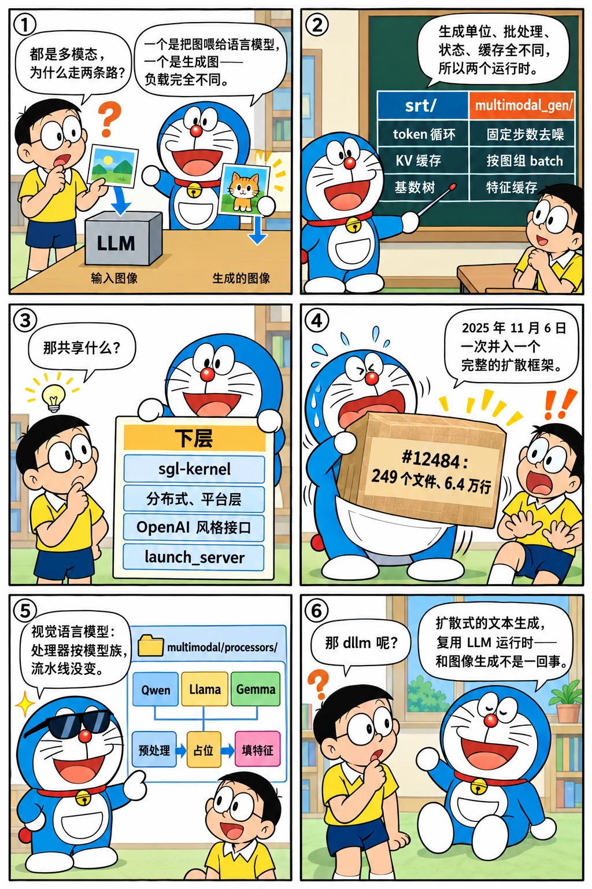

# 多模态与 SGLang Diffusion：multimodal/ 与另起炉灶的 multimodal_gen/

<p class="lead">多模态在 SGLang 里走过两条完全不同的路。视觉语言模型从初版的 LLaVA 起就在运行时里：图片变成占位 token、视觉特征在前向时填进去，2025 年 6 月它们的预处理器被整理成 <code>multimodal/</code> 目录。图像与视频生成则在 2025 年 11 月 6 日以一次 249 个文件、6.4 万行的提交进入仓库——<code>python/sglang/multimodal_gen/</code> 是一个独立的运行时，有自己的调度器、流水线和模型层，只和 LLM 运行时共享 kernel、分布式与平台层。这一章讲这两条路为什么不同，以及"在一个仓库里放两个运行时"的取舍。</p>

!!! question "自测：能答上来就可以跳过本章"
    1. 视觉语言模型的输入在 SGLang 里经过哪几步？`multimodal/processors/` 里的处理器负责哪一步？
    2. 为什么扩散模型的推理不能复用 LLM 的调度器和 KV 池？
    3. `multimodal_gen/` 和 `srt/` 共享什么、不共享什么？
    4. `dllm/` 又是什么？它和 `multimodal_gen/` 是一回事吗？

??? success "自测参考答案（先自己答，再展开对照）"
    1. 处理器（按模型族）把图片 / 视频 / 音频变成张量和占位 token 序列，并算出用于缓存的哈希；调度器只看到 token 序列（占位 token 能走前缀缓存）；前向时视觉编码器算出特征，按位置填进语言模型的输入嵌入。处理器负责第一步，可能在独立的进程或线程池里跑。
    2. 扩散模型没有 KV 缓存和逐 token 生成：一次请求是固定步数的去噪循环，每步整张图（或整段视频的潜变量）过一遍网络，batch 的单位是"图"而不是"token"，还有 CFG 翻倍、文本编码器、VAE 解码这些阶段。连续批处理、前缀缓存、投机解码都不适用，需要按步数和分辨率组织的调度与缓存（如特征缓存）。
    3. 共享：sgl-kernel 的算子、`distributed/` 与平台层、OpenAI 兼容的 API 风格、`launch_server` 入口与 CLI、CUDA Graph 的做法。不共享：调度器、内存池、基数树、模型层（扩散的 DiT / UNet / VAE 在 `multimodal_gen/runtime/models` 和 `layers`）。
    4. `dllm/` 是 srt 里对"扩散语言模型"（用扩散方式生成文本的 LLM，如块扩散）的支持，仍然是文本生成、复用 LLM 运行时；`multimodal_gen/` 是图像与视频生成，完全不同的运行时。

先看一个六格小剧场，再读正文：

{.aig-comic}

## 视觉语言模型：处理器目录

```bash title="multimodal-growth.sh"
REF=${REF:-29f6d408c0}
git log --reverse --date=short --format='%ad  %h  %s' "$REF" -- python/sglang/srt/multimodal | head -1 | cut -c1-96
for t in v0.5.0rc0 "$REF"; do
  printf '%-11s multimodal/ %3d 个文件，processors/ %3d 个\n' "$t" "$(git ls-tree -r --name-only "$t" -- python/sglang/srt/multimodal | grep -c '\.py$')" "$(git ls-tree -r --name-only "$t" -- python/sglang/srt/multimodal/processors | grep -c '\.py$')"
done
echo "今天 processors/ 里的模型族：$(git ls-tree -r --name-only "$REF" -- python/sglang/srt/multimodal/processors | grep '\.py$' | sed 's|.*/||; s|\.py||' | grep -v '__init__\|base_processor' | tr '\n' ' ' | cut -c1-230)"
```

```text title="输出"
2025-06-27  ce3a3e8783  Move multimodal processors into a separate folder (#7581)
v0.5.0rc0   multimodal/  19 个文件，processors/  18 个
29f6d408c0  multimodal/  95 个文件，processors/  64 个
今天 processors/ 里的模型族：bailing_mm clip cohere2_vision cosmos3_edge deepseek_ocr deepseek_v41 deepseek_vl_v2 diffusion_gemma dots_note_omni flatten_runner preprocess v2core video_qa_flattener dots_vlm ernie45_vl executor gemma3 gemma3n gemma4 gemma4_unif
```

[第七章](../service/api-multimodal.md)讲过"预处理在前、占位在中、特征在后"的流水线。2025 年 6 月 27 日的 #7581 把散落在 `managers/` 里的各模型预处理器搬进 `multimodal/processors/`，一个基类加每个模型族一个文件：Qwen-VL、Llama 4、InternVL、Gemma 3、Pixtral、Kimi-VL、MiniCPM、Phi-4 多模态、语音模型……基类定义了"从请求里取出多模态数据 → 预处理 → 生成占位 token 与哈希"的步骤，子类填模型相关的细节。`multimodal_cache.py` 用哈希缓存视觉特征，`mm_utils.py` 保留了从 LLaVA 时代传下来的工具。2025 年下半年还有一条延伸：`disaggregation/encoder/`（[第 17 章](../scale/pd.md)）把视觉编码也拆成独立服务。

## 图像与视频生成：一次 6.4 万行的提交

```bash title="diffusion-import.sh"
git show --stat=200 --format='%ad  %an  %s' --date=short 7bc1dae095 | sed -n '1p;$p' | cut -c1-96
echo "-- 按目录："; git show --stat=200 --format= 7bc1dae095 | awk '{print $1}' | grep '^python/sglang/multimodal_gen/' | cut -d/ -f4 | sort | uniq -c | sort -rn | head -8 | awk '{printf "   %3d  %s\n", $1, $2}'
git log --date=short --format='%ad  %h  %s' 29f6d408c0 | grep -i 'diffusion announcement' | cut -c1-96
```

```text title="输出"
2025-11-06  Mick  WIP: initial multimodal-gen support (#12484)
 249 files changed, 63750 insertions(+), 11 deletions(-)
-- 按目录：
   168  runtime
    47  configs
    12  test
     5  csrc
     3  docs
     2  third_party
     1  utils.py
     1  envs.py
2025-11-07  32f7982800  sglang diffusion announcement (#12856)
```

11 月 6 日 #12484 "WIP: initial multimodal-gen support"（2025 Q4 路线图 issue #12799 的主线），次日 #12856 发布公告。这不是在 `srt/` 里加功能，而是把一个完整的扩散推理框架（它的前身在 SGLang 之外开发）并入仓库：`runtime/` 下有自己的 `managers`、`scheduler_client`、`pipelines`、`layers`、`models`、`loader`、`distributed`、`platforms`、`disaggregation`、`realtime`，`configs/` 里是各模型的配置，`csrc/` 是专用 kernel。README 的定位：

```markdown title="python/sglang/multimodal_gen/README.md @ 29f6d408c0 L6-14" linenums="6"

SGLang diffusion features an end-to-end unified pipeline for accelerating diffusion models. It is designed to be modular and extensible, allowing users to easily add new models and optimizations.

## Key Features

SGLang Diffusion has the following features:
  - Broad model support: Wan, FastWan, FLUX, Qwen-Image / Qwen-Image 2.1, LongCat-Image, Z-Image, Anima, Ideogram 4, Krea-2, Cosmos3, LTX-2/LTX-2.3/LTX-2.5, MiniMax-H3, FastH3, VDN-H3, LingBot Video MoE, LingBot World, SANA-Video/SANA-WM, JoyEcho, MOVA, GLM-Image, ERNIE-Image, Hunyuan3D, and more
  - Fast inference speed: empowered by optimized `sgl-kernel` kernels, scheduler/runtime improvements, caching acceleration, and native diffusion hot-path optimizations
  - Ease of use: OpenAI-compatible api, CLI, python sdk, and a [ComfyUI plugin](apps/ComfyUI_SGLDiffusion/README.md)
```

今天的规模：

```bash title="diffusion-size.sh"
REF=${REF:-29f6d408c0}
echo "multimodal_gen/ 共 $(git ls-tree -r --name-only "$REF" -- python/sglang/multimodal_gen | wc -l) 个文件，.py $(git ls-tree -r --name-only "$REF" -- python/sglang/multimodal_gen | grep -c '\.py$') 个"
echo "runtime/ 一级目录：$(git ls-tree --name-only "$REF" python/sglang/multimodal_gen/runtime/ | sed 's|.*/||' | grep -v '\.py$' | tr '\n' ' ')"
echo "共享的入口：$(git show --stat=200 --format= 7bc1dae095 | awk '{print $1}' | grep -E '^python/sglang/(launch_server|cli)' | tr '\n' ' ')"
```

```text title="输出"
multimodal_gen/ 共 1198 个文件，.py 1151 个
runtime/ 一级目录：breakable_cuda_graph cache disaggregation distributed entrypoints layers loader managers models observability pipelines pipelines_core platforms post_training postprocess realtime server_args utils vla weights 
共享的入口：python/sglang/cli/__init__.py python/sglang/cli/generate.py python/sglang/cli/main.py python/sglang/cli/serve.py python/sglang/launch_server.py 
```

`runtime/` 的目录名和 `srt/` 很像（managers、layers、models、loader、distributed、platforms、disaggregation），说明它借用了同一套组织方式；但内容是扩散的：`pipelines/` 是按模型的生成流水线（文本编码 → 去噪循环 → VAE 解码），`cache/` 是特征缓存（相邻去噪步的激活相似，可以跳过），`breakable_cuda_graph/` 是可中断的图捕获，`realtime/` 是实时生成，`vla/` 是视觉-语言-动作模型。图像与视频生成手册的[推理算账](media://perf/accounting/)、[特征缓存](media://perf/caching/)、[多卡并行](media://perf/parallel/)几章讲的正是这些机制背后的原理。

{.aig-svg}

## 为什么另起炉灶

把扩散模型塞进 `srt/` 的调度器不是没人想过，但两种负载在每一层都不同：

| | LLM（srt） | 扩散（multimodal_gen） |
| --- | --- | --- |
| 生成单位 | 一个 token，循环直到结束 | 一张图 / 一段视频，固定步数 |
| 批处理 | 连续批处理，按 token 预算 | 按图组 batch，分辨率要一致或分桶 |
| 状态 | KV 缓存随长度增长 | 潜变量固定大小，无 KV |
| 缓存复用 | 前缀缓存（基数树） | 特征缓存（跨步）、条件缓存（跨请求） |
| 并行 | TP / EP / DP attention / PD | 序列并行、CFG 并行、流水线按阶段 |
| 瓶颈 | decode 的访存与发射开销 | 去噪网络的算力、VAE 的显存峰值 |

共享的是下层：sgl-kernel 的注意力与 GEMM、`distributed/` 的进程组、平台层的多硬件支持（README 列了 NVIDIA、AMD、Intel XPU、昇腾、Apple MPS、摩尔线程）、CUDA Graph 的做法、OpenAI 风格的接口与 `launch_server` 入口。这是比"复用调度器"更现实的复用边界。

`dllm/`（2025-11-26 #12588 "Initial block diffusion language model support"）则相反：扩散式的**文本**生成仍走 `srt/` 的运行时，只是解码循环不同——它复用 KV 池和调度器，加一组算法文件。

## 设计取舍

- **两个运行时放一个仓库。** 共享 kernel、CI、发布和社区；代价是仓库更大、CI 要按目录触发（#12940 "skip full CI suite for multimodal_gen changes"）。
- **处理器按模型族。** 和工具调用解析器一样（[第 20 章](entrypoints.md)），没有统一格式只能逐个写；基类固定步骤。
- **视觉编码可分离。** 编码器服务（E/P/D）让大视觉塔不占 decode 节点的显存。

## 后来怎么样了

- `multimodal/` 到基准提交 95 个文件；多模态请求的哈希缓存、视频抽帧、音频输入逐步补齐；
- `multimodal_gen/` 到基准提交 1198 个文件，`runtime/` 下 20 多个子目录，支持的模型从 Wan、FLUX、Qwen-Image 扩到十几个家族，有 ComfyUI 插件和 Python SDK；
- 2026 年两边都在接 Rust 的多模态预处理（`rust/sglang-mm`，[第 21 章](gateway.md)）。

## 练习

**1. 一个处理器。** 读基准提交的 `multimodal/processors/base_processor.py`，列出子类必须实现的方法，再看 `qwen_vl.py` 怎样算出图片对应的占位 token 数。

??? success "参考思路"
    基类有 `process_mm_data_async` 一类的入口和 `load_mm_data` 等步骤；Qwen-VL 按图片分辨率除以 patch 大小再除以合并因子得到 token 数。

**2. 共享的边界。** 用 `git grep -l 'from sglang.srt' 29f6d408c0 -- python/sglang/multimodal_gen | wc -l` 数一数扩散运行时引用了多少 srt 的模块，并按被引用的子模块分类。

??? success "参考思路"
    主要是 `distributed`、`layers`（注意力、归一化、量化）、`utils`、`server_args` 的部分、`platforms`；不会引用 `managers/scheduler.py` 或 `mem_cache/`。

**3. CI 的切分。** 读 #12940 的 workflow 改动，说明仓库怎样让 `multimodal_gen/` 的改动不触发全部 LLM 测试。

??? success "参考思路"
    按路径过滤触发条件、给扩散部分单独的 workflow。

!!! interview "面试怎么答"
    "推理框架要不要同时支持 LLM 和扩散模型？"——用 SGLang 的做法答：两种负载在生成单位、批处理、状态、缓存、并行上都不同，所以是两个运行时；共享的是 kernel、分布式、平台层和接口风格。能说出 `multimodal_gen/` 是 2025-11 一次并入的独立框架、`dllm/` 则是复用 LLM 运行时的扩散式文本生成，说明你分得清这两件事。

## 小结

- [x] 视觉语言模型：预处理器按模型族集中到 `multimodal/processors/`（#7581，2025-06），流水线"预处理 → 占位 → 填特征"不变。
- [x] 图像与视频生成：`multimodal_gen/` 以 249 个文件、6.4 万行的提交并入（#12484，2025-11-06），是独立的运行时，只共享 kernel、分布式、平台层与接口风格。
- [x] `dllm/` 是复用 LLM 运行时的扩散式文本生成，与 `multimodal_gen/` 不是一回事。
