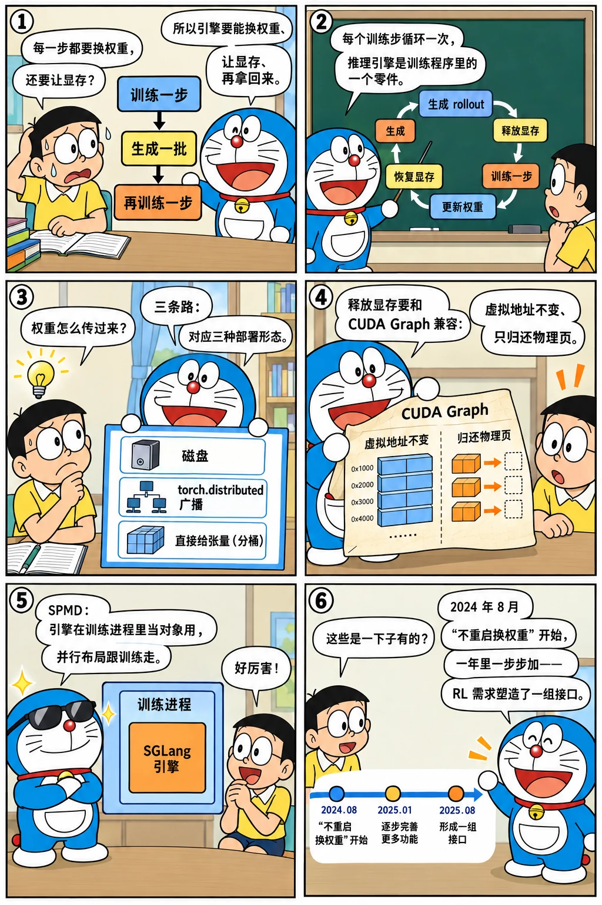

# RL 训练闭环：权重同步与 rollout 接口

<p class="lead">README 的第一句把 "RL rollouts" 和 agentic workloads、大规模服务并列为三个优化目标。强化学习训练里，推理引擎每隔几步就要换一次权重、在训练时让出显存、在生成时再拿回来——这些需求从 2024 年 8 月"不重启更新权重"开始，一步步变成 <code>update_weights_from_tensor</code>、<code>release_memory_occupation</code>、<code>verl_engine.py</code> 和 <code>weight_sync/</code>。这一章按时间读这组接口，看一个推理引擎为了被训练框架"嵌入"做了哪些妥协。</p>

!!! question "自测：能答上来就可以跳过本章"
    1. RL 训练对推理引擎提出了哪几类特殊要求？SGLang 各用什么接口满足？
    2. `update_weights_from_distributed` 和 `update_weights_from_tensor` 有什么区别？各适合什么部署形态？
    3. 为什么"释放显存再恢复"必须和 CUDA Graph 兼容？
    4. `verl_engine.py` 的 SPMD 是什么意思？引擎为什么要能在训练框架的进程里运行？

??? success "自测参考答案（先自己答，再展开对照）"
    1. 换权重（每个训练步之后）、让出显存（训练时权重与 KV 占的显存要还给训练进程）、按训练框架的并行布局运行（和训练进程同机同卡）、批量 rollout 的吞吐。接口：`update_weights_from_disk` / `from_distributed` / `from_tensor`，`release_memory_occupation` / `resume_memory_occupation`，`verl_engine.py` 的 SPMD 模式，以及离线 `Engine.generate`。
    2. `from_distributed`：训练进程和推理进程加入同一个 torch.distributed 组，训练侧广播参数、推理侧按名字接收，适合分离部署（训练卡和推理卡不同）；`from_tensor`：直接把张量（同一进程或通过序列化的桶）交给引擎，适合同机共置（colocate）的形态，2025 年加了分桶（`tensor_bucket.py`）减少小张量的往返。
    3. CUDA Graph 捕获时记录了固定的显存地址；如果释放后再分配得到不同地址，图就失效了。#2630 用 torch_memory_saver 这类机制在虚拟地址不变的前提下释放物理显存，恢复时映射回同样的地址，图可以继续回放。
    4. SPMD（单程序多数据）：每个训练 rank 自己持有一个推理 worker，不再有单独的 HTTP 服务和调度器进程；引擎在 torchrun 起的进程里被当作普通对象调用，并行布局跟着训练框架走。这样权重更新不需要跨进程传输，显存也能在训练和推理之间直接切换。

先看一个六格小剧场，再读正文：

{.aig-comic}

## 一组接口的时间线

```bash title="rl-commits.sh"
for h in cd10654e7e 983bfcf386 fd28640dc5 9183c23eca 923f518337 e3e0bc50a9 bc92107b03 ce32bc2ba9 89588179cf 96a5e4dd79 21028b5507; do
  git log -1 --date=short --format='%ad  %h  %s' $h | cut -c1-96
done
```

```text title="输出"
2024-08-20  cd10654e7e  [Feat] Support update weights without restart server (#1157)
2024-12-01  983bfcf386  Online weight updates from torch.distributed (#2279)
2024-12-29  fd28640dc5  Add `update_weights_from_tensor` (#2631)
2025-01-02  9183c23eca  Speed up `update_weights_from_tensor` (#2695)
2025-01-14  923f518337  CUDA-graph-compatible releasing and resuming KV cache and model weight m
2025-03-01  e3e0bc50a9  [Feature] SPMD for SGLang + Verl (#3852)
2025-04-13  bc92107b03  Support server based rollout in Verlengine (#4848)
2025-07-26  ce32bc2ba9  Extract update_weights from RL Engine to SGLang to keep simplicity and f
2025-08-05  89588179cf  [1/3] Optimize Slime Update Weights: Remove QWen3MOE Load Weight Overhea
2025-10-24  96a5e4dd79  [Feature] Support loading weights from ckpt engine worker (#11755)
2025-12-10  21028b5507  [RL] support weight reload for low-bit rollout (#9650)
```

- **2024-08-20 #1157**：`update_weights`（从磁盘重新加载权重）不重启服务——最早的需求来自线上换模型版本。
- **2024-12-01 #2279**：`update_weights_from_distributed`——训练进程通过 torch.distributed 广播参数，推理进程接收；RL 框架第一次能"在线"更新。
- **2024-12-29 #2631、2025-01-02 #2695**：`update_weights_from_tensor` 及其加速——同机共置时不走网络。
- **2025-01-14 #2630**：释放与恢复 KV 缓存和权重的显存，且与 CUDA Graph 兼容——训练时把显存让给训练框架。
- **2025-03-01 #3852**：SPMD + veRL，`entrypoints/verl_engine.py`——引擎在训练进程里运行。
- **2025-04-13 #4848**：基于服务器的 rollout（训练框架通过 HTTP 调远程引擎）。
- **2025-07-26 #8xxx 系列**：`weight_sync/` 目录——把 RL 引擎里的权重更新工具（分桶传输）抽到 SGLang 本体；8 月 slime 的更新路径优化（去掉 Qwen3-MoE 的加载开销、避免设备同步）。
- **2025-10-24 #11755**：从 checkpoint engine 的 worker 加载权重；**2025-12-10 #9650**：低比特 rollout 的权重重载。

## 三种更新权重的方式

```bash title="update-weights-api.sh"
REF=${REF:-29f6d408c0}
echo "io_struct.py 里和权重更新有关的请求类型："
git show "$REF:python/sglang/srt/managers/io_struct.py" | grep -E '^class (Update|Init|Get|Release|Resume|Destroy).*(Weight|Memory|Parameter).*:' | sed 's/^class //; s/[(:].*//' | tr '\n' ' '; echo
echo "weight_sync/：$(git ls-tree -r --name-only "$REF" -- python/sglang/srt/weight_sync | sed 's|.*/||' | tr '\n' ' ')"
git show "$REF:python/sglang/srt/weight_sync/tensor_bucket.py" | grep -E '^class |^    def ' | sed 's/^ *//; s/(.*//' | tr '\n' ' '; echo
```

```text title="输出"
io_struct.py 里和权重更新有关的请求类型：
UpdateWeightFromDiskReqInput UpdateWeightFromDiskReqOutput UpdateWeightsFromDistributedReqInput UpdateWeightsFromDistributedReqOutput UpdateWeightsFromTensorReqInput UpdateWeightsFromTensorReqOutput InitWeightsSendGroupForRemoteInstanceReqInput UpdateWeightsFromIPCReqInput UpdateWeightsFromIPCReqOutput InitWeightsSendGroupForRemoteInstanceReqOutput InitWeightsUpdateGroupReqInput InitWeightsUpdateGroupReqOutput DestroyWeightsUpdateGroupReqInput DestroyWeightsUpdateGroupReqOutput UpdateWeightVersionReqInput UpdateWeightVersionReqOutput GetWeightsByNameReqInput GetWeightsByNameReqOutput ReleaseMemoryOccupationReqInput ReleaseMemoryOccupationReqOutput ResumeMemoryOccupationReqInput ResumeMemoryOccupationReqOutput 
weight_sync/：tensor_bucket.py utils.py 
class FlattenedTensorMetadata: class FlattenedTensorBucket: def __init__ def get_flattened_tensor def get_metadata def reconstruct_tensors 
```

三条路的共同点是都要穿过[第六章](../service/processes.md)的进程结构：请求从 `TokenizerManager` 发给每个调度器进程，调度器交给 `TpModelWorker` → `ModelRunner` 去替换参数；差别在数据怎么到：从磁盘读、从 torch.distributed 组接收、或者从请求里带的序列化张量（分桶后一次传多个）。`update_weights_from_tensor` 走 ZMQ 要序列化整块权重，所以 `tensor_bucket.py` 把小张量打包、用 `FlattenedTensorBucket` 一次传一个大 buffer——这是 #8751 "Optimize Slime Update Weights" 系列的成果之一。

## 让出显存：release / resume

#2630 的标题 "CUDA-graph-compatible releasing and resuming KV cache and model weight memory" 点出了难点：训练和推理共置时，训练步要用显存，推理引擎必须把 KV 池和权重的显存释放掉，训练完再拿回来；但 CUDA Graph 记录的是地址，重新分配会让图失效。做法是用能保持虚拟地址不变的内存保存器（`torch_memory_saver`）：释放只归还物理页，恢复时映射回同一虚拟地址。`--enable-memory-saver` 开启，`/release_memory_occupation` 与 `/resume_memory_occupation` 两个接口分别在训练前后调用。[第六章](../service/processes.md)的 `_launch_scheduler_processes` 里 `memory_saver_adapter.configure_subprocess()` 就是在起调度器进程时套上这层。

## 在训练框架的进程里运行

```bash title="verl-engine.sh"
REF=${REF:-29f6d408c0}
git show --stat=100 --format='%ad  %an  %s' --date=short e3e0bc50a9 | grep -v '^$' | cut -c1-96
echo "-- verl_engine.py @ v0.4.6 的方法："; git show v0.4.6:python/sglang/srt/entrypoints/verl_engine.py | grep -E '^class |^    def ' | sed 's/^ *//; s/(.*//' | tr '\n' ' '; echo
echo "-- verl_engine.py 的最后一个提交：$(git log -1 --date=short --format='%ad  %h  %s' "$REF" -- python/sglang/srt/entrypoints/verl_engine.py | cut -c1-80)"
```

```text title="输出"
2025-03-01  fzyzcjy  [Feature] SPMD for SGLang + Verl (#3852)
 .github/workflows/pr-test.yml                               |   6 +
 examples/runtime/engine/offline_batch_inference_torchrun.py |  81 +++++++
 python/sglang/srt/entrypoints/engine.py                     |  19 +-
 python/sglang/srt/entrypoints/verl_engine.py                | 145 +++++++++++++
 python/sglang/srt/managers/data_parallel_controller.py      |   8 +-
 python/sglang/srt/managers/io_struct.py                     |   2 +
 python/sglang/srt/managers/scheduler.py                     |   5 +-
 python/sglang/srt/managers/tp_worker.py                     |   5 +-
 python/sglang/srt/model_executor/model_runner.py            |  45 +++-
 python/sglang/srt/models/gemma.py                           |   6 -
 python/sglang/srt/models/gemma2.py                          |   7 -
 python/sglang/srt/server_args.py                            |   8 +
 python/sglang/srt/utils.py                                  |   1 -
 python/sglang/test/runners.py                               | 364 ++++++++++++++++++++---------
 python/sglang/test/test_programs.py                         |   2 +-
 test/lang/test_srt_backend.py                               |   2 +-
 test/srt/models/test_generation_models.py                   |  61 ++----
 test/srt/test_update_weights_from_tensor.py                 |  28 +++
 test/srt/test_verl_engine.py                                | 297 ++++++++++++++++++++++++++
 19 files changed, 890 insertions(+), 202 deletions(-)
-- verl_engine.py @ v0.4.6 的方法：
class VerlEngine: def __init__ def generate def update_weights_from_tensor def release_memory_occupation def resume_memory_occupation def shutdown 
-- verl_engine.py 的最后一个提交：2025-06-19  1ab6be1b26  Purge VerlEngine (#7326)
```

`VerlEngine` 的思路：训练框架（veRL）用 torchrun 起 N 个进程做 FSDP / Megatron 训练，每个进程里再建一个 SGLang 的 `Engine`，`tp_size` 和训练的并行布局对应，`device_mesh` 直接传进来；生成时各进程以 SPMD 方式一起调用 `generate`（输入在各 rank 间广播、输出收集），权重更新用 `update_weights_from_tensor` 在进程内完成。这把"推理引擎"变成了训练程序里的一个对象，而不是一个服务。4 月的 #4848 又加了反过来的形态：训练框架通过 HTTP 调远程的 SGLang 服务器做 rollout（适合训练卡和推理卡分离）。三个半月后，2025-06-19 的 #7326 "Purge VerlEngine" 删掉了这个包装类（脚本的最后一行）：SPMD 需要的能力（在外部进程组里构造 `Engine`、按 rank 广播输入）进入了 `Engine` 本体，框架相关的包装回到 veRL 自己的仓库——引擎只保留通用接口，不再为某一个框架维护专门的类。

{.aig-svg}

## 设计取舍

- **三种更新方式并存。** 每种对应一种部署形态（分离 / 共置 / 磁盘），统一接口（都走 `io_struct` 的请求、调度器、`ModelRunner`）但传输方式不同。代价是三条路要同步维护量化、MoE 专家等特殊权重的处理（#8751 系列、#13323 的 ue8m0 scale）。
- **引擎可嵌入，但不为单个框架写包装。** `Engine` 不依赖 HTTP，能在别人的进程里以 SPMD 运行；`VerlEngine` 只活了三个半月就被删掉，通用能力留在 `Engine`、框架相关的留在框架。代价是引擎要容忍"外部决定并行布局"和"随时被要求让出显存"。
- **把工具抽回本体。** `weight_sync/` 来自 RL 引擎（slime）里的代码，抽回 SGLang 后各框架共用，避免每个框架各写一份。

## 后来怎么样了

- 2025 年下半年：slime、AREAL、veRL 三个框架都在路线图（issue #7736）的合作名单里；MoE 专家权重的更新路径、FP8 / 低比特 rollout 的权重重载（#9650）、从 checkpoint engine 直接加载（`checkpoint_engine/`）；
- 2026 年：`weight_cache/`（#27139，2026-07-25）让引擎在重启后从缓存快速恢复权重；`ray/` 目录提供 Ray 上的引擎编排；
- 分布式训练手册的 [训练框架与 RL 训练系统一章](train://practice/frameworks-rl/)和推理系统手册的 [RL 推理一章](serving://topics/rl-rollout/)从训练侧和系统侧讲同一个闭环。

## 练习

**1. 分桶的收益。** 读基准提交的 `weight_sync/tensor_bucket.py`，说明 `FlattenedTensorBucket` 怎样把多个张量拼成一个 buffer、接收方怎样还原，以及为什么这对 MoE 模型特别重要。

??? success "参考思路"
    按顺序记录每个张量的名字、形状、dtype 和偏移，拼接成一维 buffer 一次传输；接收方按元数据切片并 `view` 回原形状。MoE 有成百上千个专家权重，小张量多，不分桶时每个都要一次往返。

**2. 释放后还剩什么。** 调用 `release_memory_occupation` 之后，引擎进程里哪些显存还在？为什么不能把 CUDA Graph 也释放掉重新捕获？

??? success "参考思路"
    CUDA 上下文、图的内存池、少量工作区仍在；重新捕获要几十秒到几分钟，RL 每个训练步都要切换一次，承受不起。

**3. SPMD 的代价。** 读 v0.4.6 的 `verl_engine.py`，找出 `generate` 里为了让所有 rank 返回一致结果做了哪些广播或收集。

??? success "参考思路"
    输入在 tp 组内广播（只有 rank 0 真正拿到数据），输出在各 rank 上一致；注意 `update_weights_from_tensor` 在每个 rank 上各自调用。

!!! interview "面试怎么答"
    "推理引擎怎么支持 RL 训练？"——按三件事答：换权重（磁盘 / torch.distributed / 张量分桶，对应三种部署形态）、让显存（保持虚拟地址的释放与恢复，才能和 CUDA Graph 共存）、可嵌入（SPMD 模式在训练进程里运行，或作为远程服务）。再说这些接口是 2024-08 到 2025-07 一步步加的，并且把 RL 框架里的工具（分桶传输）抽回了引擎本体。

## 小结

- [x] 从 2024-08 的"不重启换权重"到 2025 年的三种更新方式、显存释放与恢复、SPMD 嵌入，RL 需求塑造了一组专门的接口。
- [x] CUDA Graph 与显存释放的兼容靠保持虚拟地址不变的内存保存器。
- [x] `verl_engine.py`（2025-03 → 06）让引擎成为训练程序里的对象，之后能力并入 `Engine`；`weight_sync/` 把框架里的工具抽回本体，slime / AREAL / veRL 共用。
