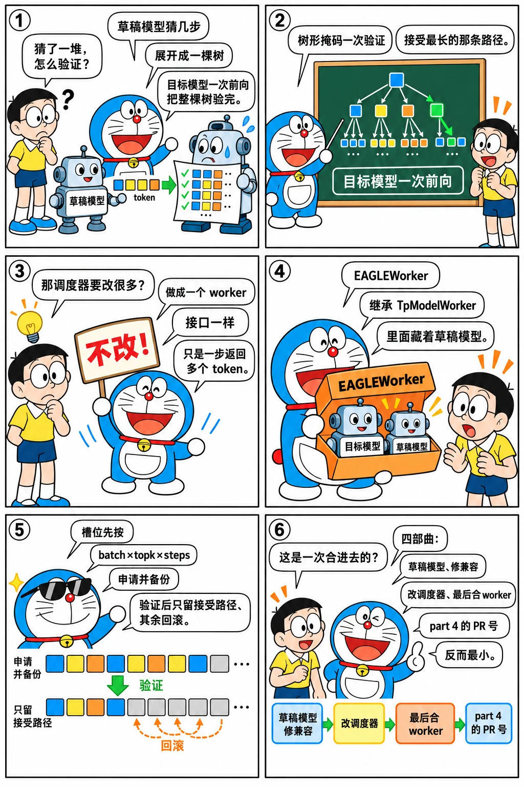

# EAGLE 投机解码四部曲：为什么做成一个 worker

<p class="lead">投机解码在 2024 年 Q3 的路线图里就有"原型"，真正进入主线是 2024 年 12 月 29 日到 2025 年 1 月 2 日的四个提交——标题就叫 part 1 到 part 4。最后一个 part 的 PR 号是 #2150，比前三个都小：它在 11 月就开了，等前面三块基础（草稿模型、CUDA Graph 与 DP attention 的修复、调度器的小改动）落地才合入。这一章讲 EAGLE 为什么被实现成 <code>TpModelWorker</code> 的子类而不是调度器的分支，它和 KV 池、基数树、CUDA Graph 怎么相处，以及这个"worker"抽象后来怎样容纳了 MTP、n-gram 和一打新的投机方法。</p>

!!! question "自测：能答上来就可以跳过本章"
    1. EAGLE 一步 decode 在 SGLang 里分几个阶段？目标模型跑几次、草稿模型跑几次？
    2. 为什么把投机解码做成 `EAGLEWorker(TpModelWorker)`？调度器需要为它改什么？
    3. 草稿 token 的 KV 槽位怎么分配？验证之后被拒绝的 token 怎么处理？
    4. "part 4 的 PR 号比 part 1 小"说明了什么开发方式？

??? success "自测参考答案（先自己答，再展开对照）"
    1. `draft`：草稿模型跑 `speculative_num_steps` 步，每步取 top-k，展开成一棵树；`verify`：目标模型跑**一次**，用树形注意力掩码同时验证树上的所有候选，得到每个请求接受的 token 序列；`forward_draft_extend_after_decode`：草稿模型用接受的 token 做一次 extend，准备下一轮。目标模型一次、草稿模型 `num_steps + 1` 次。
    2. 调度器只认一个接口：给一个 batch，返回下一批 token 和接受数。`EAGLEWorker` 在内部持有目标 `TpModelWorker` 和草稿模型的 `ModelRunner`，对外仍是 `forward_batch_generation`。调度器需要改的是"一步可能产生多个 token"：`Req` 的输出追加多个 id、`seq_lens` 一次加多个、流式输出按接受数推送（part 3 的"小改动"）。
    3. 草稿前为 `batch_size × topk × num_steps` 个候选一次性申请槽位（`alloc_token_slots`，并备份分配器状态），验证后只保留被接受路径上的槽位，其余释放；页大小大于 1 时还要处理最后一页的复制。被接受的 token 像普通 decode 一样进入基数树。
    4. 先开一个大 PR 展示整体设计，再把其中可以独立合入的部分拆成小 PR 先合（草稿模型文件、CUDA Graph / DP attention 的修复、调度器改动），最后合大 PR——把风险分摊到几次评审里。

先看一个六格小剧场，再读正文：

{.aig-comic}

## 四部曲与它们的后续

```bash title="eagle-commits.sh"
for h in 9c05c6898e b0524c3789 ad20b7957e 815dce0554 8c8779cd05 013021b6a1 f9905d59a8 862dd76c76 9fafa62db7 9fb48f951f e983e43248 b26bc86b36; do
  git log -1 --date=short --format='%ad  %h  %s' $h 2>/dev/null | cut -c1-96
done
```

```text title="输出"
2024-12-29  9c05c6898e  Add llama_eagle.py (#2640)
2024-12-31  b0524c3789  Eagle speculative decoding part 2: Fix cuda graph + DP attention hanging
2025-01-02  ad20b7957e  Eagle speculative decoding part 3: small modifications to the general sc
2025-01-02  815dce0554  Eagle speculative decoding part 4: Add EAGLE2 worker (#2150)
2025-01-03  8c8779cd05  [Fix] fix retract error in eagle speculative decoding (#2711)
2025-02-03  013021b6a1  refactor EAGLE 2 (#3269)
2025-02-07  f9905d59a8  support speculative decoding kernel in sgl-kernel (#3373)
2025-02-15  862dd76c76  Support NextN (MTP) speculative decoding for DeepSeek-V3/R1 (#3582)
2025-03-04  9fafa62db7  Share target model embed and head weights for nextn (#4033)
2025-03-09  9fb48f951f  Support nextn for flashinfer mla attention backend (#4218)
2025-04-02  e983e43248  Add Eagle Speculative Decoding to FA3 Backend (#4951)
2025-03-30  b26bc86b36  Support page size > 1 + eagle (#4908)
```

四部曲之后的一个月都在修边界情况：撤回（#2711）、多个并发请求崩溃（#2730）、`max_tokens = 1`（#2939）、CPU 开销与 `flush_cache`（#3014）；2 月 3 日 #3269 做了一次整体重构，2 月 7 日 #3373 把验证用的树形掩码等 kernel 放进 sgl-kernel，2 月 15 日 #3582 让 DeepSeek-V3 / R1 自带的 MTP 头（NextN）走同一条路。

## 做成一个 worker

v0.4.6 的 `speculative/` 只有五个文件：

```bash title="spec-dir.sh"
REF=${REF:-29f6d408c0}
for t in v0.4.6 v0.5.0rc0 "$REF"; do
  printf '%-11s %3d 个文件：' "$t" "$(git ls-tree -r --name-only "$t" -- python/sglang/srt/speculative | grep -c '\.py$')"
  git ls-tree -r --name-only "$t" -- python/sglang/srt/speculative | grep '\.py$' | grep -c '_worker' | xargs printf '%s 个带 worker 的文件；'
  git ls-tree -r --name-only "$t" -- python/sglang/srt/speculative | grep '_worker.*\.py$' | sed 's|.*/||; s|\.py||' | tr '\n' ' ' | cut -c1-120; echo
done
```

```text title="输出"
v0.4.6        5 个文件：1 个带 worker 的文件；eagle_worker 

v0.5.0rc0     6 个文件：1 个带 worker 的文件；eagle_worker 

29f6d408c0   62 个文件：11 个带 worker 的文件；base_spec_worker dflash_worker_v2 draft_worker_common dspark_worker_v2 eagle_worker_common eagle_worker_v2 frozen_kv_mtp
```

核心是 `eagle_worker.py` 里的 `EAGLEWorker`：

```python title="python/sglang/srt/speculative/eagle_worker.py @ v0.4.6 L53-60" linenums="53"
class EAGLEWorker(TpModelWorker):

    def __init__(
        self,
        server_args: ServerArgs,
        gpu_id: int,
        tp_rank: int,
        dp_rank: Optional[int],
```

它继承 `TpModelWorker`，自己就是"目标模型的 worker"，再额外持有一个草稿模型的 `ModelRunner`。调度器调用的入口：

```python title="python/sglang/srt/speculative/eagle_worker.py @ v0.4.6 L236-280" linenums="236"
    def forward_batch_speculative_generation(
        self, batch: ScheduleBatch
    ) -> Tuple[LogitsProcessorOutput, List[int], int, int]:
        """Run speculative decoding forward.

        NOTE: Many states of batch is modified as you go through. It is not guaranteed that
        the final output batch have the same state as the input.

        Args:
            batch: The batch to run forward. The state of the batch is modified as it runs.
        Returns:
            A tuple of the final logit output of the target model, next tokens accepeted,
            the batch id (used for overlap schedule), and number of accepeted tokens.
        """
        if batch.forward_mode.is_decode():
            with self.draft_tp_context(self.draft_model_runner.tp_group):
                spec_info = self.draft(batch)
            logits_output, verify_output, model_worker_batch = self.verify(
                batch, spec_info
            )

            # If it is None, it means all requests are finished
            if batch.spec_info.verified_id is not None:
                with self.draft_tp_context(self.draft_model_runner.tp_group):
                    self.forward_draft_extend_after_decode(batch)
            return (
                logits_output,
                verify_output.verified_id,
                model_worker_batch.bid,
                sum(verify_output.accept_length_per_req_cpu),
            )
        elif batch.forward_mode.is_idle():
            model_worker_batch = batch.get_model_worker_batch()
            logits_output, next_token_ids = self.target_worker.forward_batch_generation(
                model_worker_batch
            )

            return logits_output, next_token_ids, model_worker_batch.bid, 0
        else:
            logits_output, next_token_ids, bid = self.forward_target_extend(batch)
            with self.draft_tp_context(self.draft_model_runner.tp_group):
                self.forward_draft_extend(
                    batch, logits_output.hidden_states, next_token_ids
                )
            return logits_output, next_token_ids, bid, 0
```

三个分支对应三种前向模式：decode 时"草稿 → 验证 → 草稿 extend"，返回目标模型的 logits、被接受的 token 和接受总数；idle 时只跑目标模型（DP attention 下陪跑）；extend（prefill）时目标模型先算，草稿模型再用目标模型的隐状态做一次 extend（EAGLE 的草稿模型以目标模型上一层的隐状态为输入）。对调度器来说，这就是一个返回值多了一个"接受数"的 `forward_batch_generation`——part 3 "small modifications to the general scheduler" 改的正是处理多 token 输出的那几处。

{.aig-svg}

## 草稿、验证与槽位

`draft` 开头先解决显存：

```python title="python/sglang/srt/speculative/eagle_worker.py @ v0.4.6 L304-330" linenums="304"
    def draft(self, batch: ScheduleBatch):
        # Parse args
        num_seqs = batch.batch_size()
        spec_info = batch.spec_info

        # Accumulate penalty
        if batch.sampling_info.penalizer_orchestrator.is_required:
            # This is a relaxed version of penalties for speculative decoding.
            batch.sampling_info.penalizer_orchestrator.cumulate_output_tokens(
                spec_info.verified_id.to(torch.int64)
            )

        # Allocate cache locations
        if self.page_size == 1:
            out_cache_loc, token_to_kv_pool_state_backup = batch.alloc_token_slots(
                num_seqs * self.topk * self.speculative_num_steps, backup_state=True
            )
        else:
            if self.topk == 1:
                prefix_lens = batch.seq_lens
                seq_lens = prefix_lens + self.speculative_num_steps
                extend_num_tokens = num_seqs * self.speculative_num_steps
            else:
                # In this case, the last partial page needs to be duplicated.
                # KV cache layout in batch.req_to_token_pool.req_to_token:
                #
                # | -------- | -- xxxx .. | -- xxxx .. | -- xxxx .. |
```

页大小为 1 时一次申请 `num_seqs × topk × num_steps` 个槽位并备份分配器状态（验证后按接受结果回滚），页大小大于 1 时按请求逐个计算、最后一个不满的页要复制——这是 3 月底 #4908 "Support page size > 1 + eagle" 的内容。草稿 `num_steps` 步每步取 top-k，`build_eagle_tree.py` 把候选展开成树并生成验证用的注意力掩码和位置；`verify` 用目标模型跑一次 extend，`EagleVerifyInput` 里带着树的结构，kernel（`sgl-kernel` 的 `verify_tree_greedy` 等）沿树找出每个请求接受的最长路径。接受的 token 写回 `Req`，释放树上其余的槽位，再用接受的 token 给草稿模型做一次 extend。草稿模型自己也有 CUDA Graph（`eagle_draft_cuda_graph_runner.py`），因为草稿每步的 batch 形状固定。

和基数树的关系很简单：被接受的 token 和普通 decode 产生的 token 没有区别，请求结束时一起插入。但撤回变复杂了（#2711）：撤回一个正在投机的请求要把树上的槽位一起释放。

## 设计取舍

- **worker 而不是调度器分支。** 投机解码的全部复杂度（树、掩码、槽位回滚、两个模型的 CUDA Graph）封在 worker 里；调度器只需理解"一步多个 token"。代价是 worker 变厚（655 行起步），以及一些本该在调度层做的决定（比如按负载调整草稿步数）要绕一下。
- **先申请、后回滚。** 为所有候选预留槽位比按需分配简单，也避免验证期间显存不够；代价是峰值占用高，`alloc_token_slots(..., backup_state=True)` 的备份 / 回滚是为此付的。
- **树形验证一次前向。** 和逐条验证相比，一次前向的代价和 batch 大小、树的大小有关；[推理系统手册的投机解码一章](serving://topics/speculative/)讨论了 K 的取舍。
- **分四步合入。** 大功能拆成可独立评审的小块，先把基础（草稿模型、兼容性修复）合进去。

## 后来怎么样了

- 2025-02：MTP / NextN（#3582），DeepSeek-V3 的草稿头和目标模型共享 embedding 与 LM head（#4033），3 月支持 FlashInfer MLA 后端（#4218）、FA3 后端（#4951）；
- 2025-03：页大小大于 1（#4908）；投机解码与重叠调度、DP attention、PD 分离逐一打通；
- 2025 下半年：`eagle_worker_v2.py`——"spec v2"把草稿与验证也纳入重叠流程，`base_spec_worker.py` 和 `spec_registry.py` 把投机方法做成可注册的插件；`ngram_worker.py` + C++ 的 n-gram 匹配（不需要草稿模型）、`standalone_worker_v2.py`（独立的小模型做草稿）；
- 基准提交的 `speculative/` 有 60 多个文件：EAGLE、多层 EAGLE、MTP、n-gram 之外还有几种 2026 年的新方法（文件名里的 dflash、uno、dspark），全部通过同一个 worker 接口接入调度器。

## 练习

**1. 一步的前向次数。** 设 `num_steps = 3`、`topk = 4`，一次 decode 里草稿模型、目标模型各前向几次？树上有多少候选 token？

??? success "参考答案"
    草稿 3 次（每步 top-4，第二步起从上一步的候选继续，树的节点数取决于实现是否剪枝；v0.4.6 的 `build_eagle_tree` 把每步的 top-k 展开，总候选最多 4 + 4 + 4 = 12 个加上根）、验证 1 次目标模型前向（输入 1 + 候选数个 token）、草稿 extend 1 次。目标模型只跑一次是加速的来源。

**2. 为什么 part 2 要修 DP attention 的挂起。** 读 `git show b0524c3789` 的 diff，解释投机解码的 batch 形状和 DP attention 的 all-gather 之间的冲突。

??? success "参考思路"
    投机解码的 decode 一步输入多个 token，各 rank 的 token 数不再等于 batch 大小；`prepare_dp_attn_batch` 要用正确的 token 数做 gather，否则有的 rank 等不到匹配的通信而挂起。

**3. 数一数今天的方法。** 在基准提交里列出 `speculative/` 下所有 `*_worker*.py`，猜测每个对应的投机方法，并在 `spec_registry.py` 里确认注册名。

??? success "参考思路"
    `git ls-tree --name-only 29f6d408c0 python/sglang/srt/speculative/ | grep worker`，再 `git show 29f6d408c0:python/sglang/srt/speculative/spec_registry.py`。

!!! interview "面试怎么答"
    "投机解码怎么和推理引擎集成？"——答 SGLang 的做法：做成一个 worker（内含草稿模型），对调度器暴露同样的接口，只是一步返回多个 token；槽位先申请后回滚；树形掩码一次验证；草稿模型自己有 CUDA Graph。再讲集成时真正难的地方：撤回、DP attention 的 gather 形状、页大小、重叠调度——每一个都有对应的修复提交。

## 小结

- [x] 2024-12-29 → 2025-01-02 四部曲合入 EAGLE-2，大 PR 拆成可独立评审的小块。
- [x] `EAGLEWorker(TpModelWorker)`：草稿 → 一次验证 → 草稿 extend，调度器只需处理"一步多 token"。
- [x] 槽位先申请后回滚，树上的 kernel 进 sgl-kernel；MTP、n-gram、spec v2 和后来的新方法都通过同一个 worker 接口接入。
